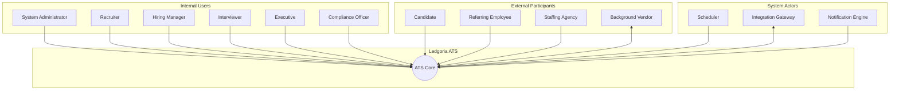

# Ledgoria - Actors

## Overview

This document defines all actors that interact with the Ledgoria ATS system. Actors are categorized by their relationship to the system: primary users, external participants, and system actors.

---

## Primary Actors (Internal Users)

### ACT-01: System Administrator

**Description:** Technical administrator responsible for system configuration, integrations, and user management at the organization level.

**Characteristics:**
- Highest privilege level
- Typically IT or HR Operations staff
- May manage multiple organizations (in multi-tenant scenarios)

**Goals:**
- Configure organization settings
- Manage user accounts and permissions
- Set up integrations (SSO, HRIS, job boards)
- Monitor system health and audit logs
- Configure compliance settings

**Typical Activities:**
- Create/deactivate user accounts
- Configure SSO and security policies
- Set up job board integrations
- Configure data retention policies
- Export audit reports

---

### ACT-02: Recruiter

**Description:** Primary power user responsible for managing the full recruiting lifecycle, from job creation through candidate hire.

**Characteristics:**
- High-volume daily usage
- Works across multiple requisitions simultaneously
- Primary owner of candidate communication
- Measured on time-to-fill and quality of hire

**Goals:**
- Fill open positions quickly with qualified candidates
- Maintain organized candidate pipelines
- Ensure positive candidate experience
- Meet compliance requirements
- Provide data for hiring decisions

**Typical Activities:**
- Create and post job requisitions
- Source and screen candidates
- Manage candidate pipeline
- Schedule interviews
- Extend offers
- Generate recruiting reports

---

### ACT-03: Hiring Manager

**Description:** Business stakeholder who owns the hiring decision for their team's open positions. Approves requisitions and makes final hiring decisions.

**Characteristics:**
- Part-time ATS user (primary job is not recruiting)
- Limited patience for complex interfaces
- Needs clear "what do I need to do" guidance
- Accountable for team headcount and performance

**Goals:**
- Hire the best candidate for their team
- Minimize time spent in recruiting tool
- Maintain visibility into pipeline status
- Make informed, defensible hiring decisions

**Typical Activities:**
- Review and approve job requisitions
- Review candidate profiles and resumes
- Provide interview feedback
- Approve/reject candidates at decision points
- Approve offer details

---

### ACT-04: Interviewer

**Description:** Employee who participates in candidate interviews and provides structured feedback.

**Characteristics:**
- Occasional ATS user
- Needs simple, focused interface
- May have limited context on full hiring process
- Focused on evaluating specific competencies

**Goals:**
- Conduct effective interviews
- Provide timely, structured feedback
- Avoid bias in evaluation
- Contribute to good hiring decisions

**Typical Activities:**
- View interview schedule and candidate information
- Access interview kits and questions
- Submit scorecard feedback
- Review (limited) other feedback after submission

---

### ACT-05: Executive / Leadership

**Description:** Senior leaders who need visibility into hiring metrics and may participate in final-round interviews for key roles.

**Characteristics:**
- Minimal direct system interaction
- Needs high-level dashboards and reports
- May have approval authority for senior roles
- Concerned with hiring velocity and diversity

**Goals:**
- Monitor organizational hiring health
- Ensure hiring aligns with business strategy
- Track diversity and compliance metrics
- Approve critical hires

**Typical Activities:**
- View recruiting dashboards
- Review diversity reports
- Approve executive-level offers
- Participate in final interviews (occasionally)

---

### ACT-06: HR Compliance Officer

**Description:** Specialist responsible for ensuring hiring practices meet legal and regulatory requirements.

**Characteristics:**
- Periodic, audit-focused usage
- Deep knowledge of employment law
- Needs comprehensive audit trails
- May span multiple jurisdictions

**Goals:**
- Ensure EEOC/OFCCP compliance
- Maintain GDPR compliance for EU candidates
- Produce required regulatory reports
- Identify and remediate compliance gaps

**Typical Activities:**
- Generate EEOC/OFCCP reports
- Review adverse action workflows
- Audit hiring decisions
- Configure compliance settings
- Manage data retention and deletion requests

---

## External Actors (Outside Organization)

### ACT-07: Candidate

**Description:** Job seeker who applies for positions and progresses through the hiring pipeline.

**Characteristics:**
- First-time or infrequent user
- Mobile-first expectations
- Values transparency and speed
- May apply to multiple positions

**Goals:**
- Find suitable job opportunities
- Apply with minimal friction
- Understand application status
- Schedule interviews conveniently
- Receive timely communication

**Typical Activities:**
- Browse job listings
- Submit applications
- Upload resume and documents
- Complete application questions
- Self-schedule interviews
- Accept/decline offers
- Provide EEOC data (voluntary)

---

### ACT-08: Referring Employee

**Description:** Current employee who refers candidates from their network.

**Characteristics:**
- Infrequent ATS usage
- Motivated by referral bonuses and team building
- Needs simple referral submission flow
- Wants visibility into referral status

**Goals:**
- Easily submit qualified referrals
- Track referral progress
- Receive credit for successful hires

**Typical Activities:**
- Submit candidate referrals
- Track referral status
- Receive referral outcome notifications

---

### ACT-09: Staffing Agency

**Description:** External recruiting agency that submits candidates on behalf of the organization.

**Characteristics:**
- May have portal access or email-based submission
- Submits candidates for specific requisitions
- Needs visibility into submitted candidate status
- Contractual relationship with organization

**Goals:**
- Submit qualified candidates efficiently
- Track candidate progress
- Ensure proper attribution for placements

**Typical Activities:**
- View assigned job requisitions
- Submit candidate profiles
- Track submitted candidate status
- Receive placement notifications

---

### ACT-10: Background Screening Vendor

**Description:** External service that conducts background checks on candidates (e.g., Ledgoria, Checkr, Sterling).

**Characteristics:**
- System-to-system integration
- Receives candidate data for screening
- Returns screening results and status
- Subject to compliance requirements

**Goals:**
- Receive accurate candidate information
- Return timely screening results
- Maintain chain of custody for compliance

**Typical Activities:**
- Receive screening requests
- Return status updates
- Deliver final reports
- Handle adverse action workflows

---

## System Actors (Automated)

### ACT-11: Scheduler

**Description:** Background job system that executes time-based and event-driven automation.

**Characteristics:**
- Runs continuously
- Processes queued jobs
- Handles retries and failures
- Produces audit trail of actions

**Responsibilities:**
- Send scheduled emails
- Process job board postings
- Execute automation rules
- Generate scheduled reports
- Enforce data retention policies
- Sync calendar events

---

### ACT-12: Integration Gateway

**Description:** System component that manages external service connections.

**Characteristics:**
- Handles API authentication
- Manages rate limiting
- Processes webhooks
- Transforms data between systems

**Responsibilities:**
- Sync with job boards
- Integrate with HRIS systems
- Connect to calendar services
- Process incoming webhooks
- Handle SSO authentication

---

### ACT-13: Notification Engine

**Description:** System component responsible for all candidate and user communications.

**Characteristics:**
- Multi-channel (email, SMS, in-app)
- Template-driven
- Tracks delivery and engagement
- Respects communication preferences

**Responsibilities:**
- Send application confirmations
- Deliver interview reminders
- Notify approvers of pending actions
- Send offer letters
- Trigger automated sequences

---

## Actor Relationships

---

## Actor Permission Matrix

| Capability | Admin | Recruiter | Hiring Mgr | Interviewer | Executive | Compliance |
|------------|-------|-----------|------------|-------------|-----------|------------|
| **Organization Settings** | Full | None | None | None | View | View |
| **User Management** | Full | None | None | None | None | View |
| **Job Requisitions** | Full | Full | Own Team | View Assigned | View | View |
| **Candidates** | Full | Full | Own Jobs | Assigned Only | View | View |
| **Applications** | Full | Full | Own Jobs | Assigned Only | View | View |
| **Interviews** | Full | Full | Own Jobs | Own Interviews | Own | View |
| **Scorecards** | Full | View All | Own Jobs | Own Only | Own | View |
| **Offers** | Full | Full | Approve Own | None | Approve | View |
| **Reports** | Full | Recruiting | Own Team | None | Full | Compliance |
| **Audit Logs** | Full | Own Actions | Own Actions | Own Actions | View | Full |
| **EEOC Data** | None | None | None | None | Aggregate | Full |
| **Integrations** | Full | None | None | None | None | View |

---

## Actor Identification Reference

| ID | Actor | Type | Primary Interface |
|----|-------|------|-------------------|
| ACT-01 | System Administrator | Internal | Admin Console |
| ACT-02 | Recruiter | Internal | Main Application |
| ACT-03 | Hiring Manager | Internal | Manager Portal |
| ACT-04 | Interviewer | Internal | Feedback Interface |
| ACT-05 | Executive | Internal | Dashboard |
| ACT-06 | HR Compliance Officer | Internal | Compliance Module |
| ACT-07 | Candidate | External | Career Site / Portal |
| ACT-08 | Referring Employee | External | Referral Portal |
| ACT-09 | Staffing Agency | External | Agency Portal |
| ACT-10 | Background Vendor | External | API Integration |
| ACT-11 | Scheduler | System | Background Jobs |
| ACT-12 | Integration Gateway | System | API Layer |
| ACT-13 | Notification Engine | System | Messaging Service |
