# Ledgoria - System Architecture

## Overview

This document describes the high-level architecture for Ledgoria, a compliance-first Applicant Tracking System. The architecture is designed for:

- **Modularity:** Bounded contexts that can evolve independently
- **Scalability:** Horizontal scaling for high-volume recruiting
- **Security:** Defense in depth for sensitive candidate data
- **Compliance:** Audit-ready data handling and retention
- **Integration:** Open APIs and webhook-driven events

---

## Architecture Principles

### AP-1: Modular Monolith First

Start with a well-structured monolith organized by bounded contexts. Extract services only when there's a clear operational need.

**Rationale:** Faster initial development, easier debugging, simpler deployment. Service extraction is a future optimization, not a starting requirement.

### AP-2: Event-Driven Integration

Contexts communicate through domain events, not direct coupling. This enables future service extraction and supports audit requirements.

**Rationale:** Loose coupling, audit trail by design, webhook support for external integrations.

### AP-3: Security by Default

All data encrypted at rest and in transit. PII fields encrypted at application layer. Zero-trust internal architecture.

**Rationale:** Candidate data is sensitive. Compliance requires encryption. Breaches are existential.

### AP-4: Audit Everything

Every state change produces an immutable audit record. No silent mutations.

**Rationale:** Regulatory compliance requires complete audit trails. Debugging requires observability.

### AP-5: API-First Design

All functionality accessible via API. UI is a client of the API, not a special case.

**Rationale:** Enables integrations, mobile apps, and third-party extensions.

---

## System Context

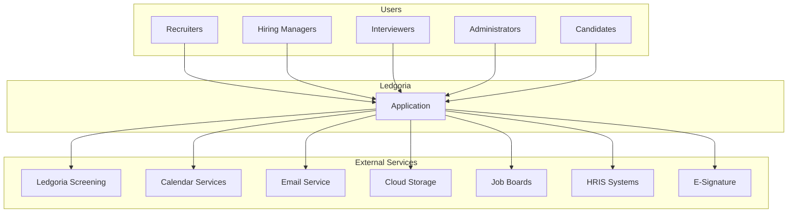

### External Integrations

| System | Purpose | Protocol | Direction |
|--------|---------|----------|-----------|
| Ledgoria Screening | Background checks, identity verification | REST API | Bidirectional |
| Google Calendar | Interview scheduling | OAuth + REST | Bidirectional |
| Microsoft Outlook | Interview scheduling | OAuth + REST | Bidirectional |
| SendGrid/Postmark | Transactional email | REST API | Outbound |
| AWS S3 | Document storage | SDK | Bidirectional |
| Indeed | Job posting, applications | REST API | Bidirectional |
| LinkedIn | Job posting | REST API | Outbound |
| Workday | HRIS export | REST API | Outbound |
| DocuSign | Offer e-signature | REST API | Bidirectional |

---

## Container Architecture

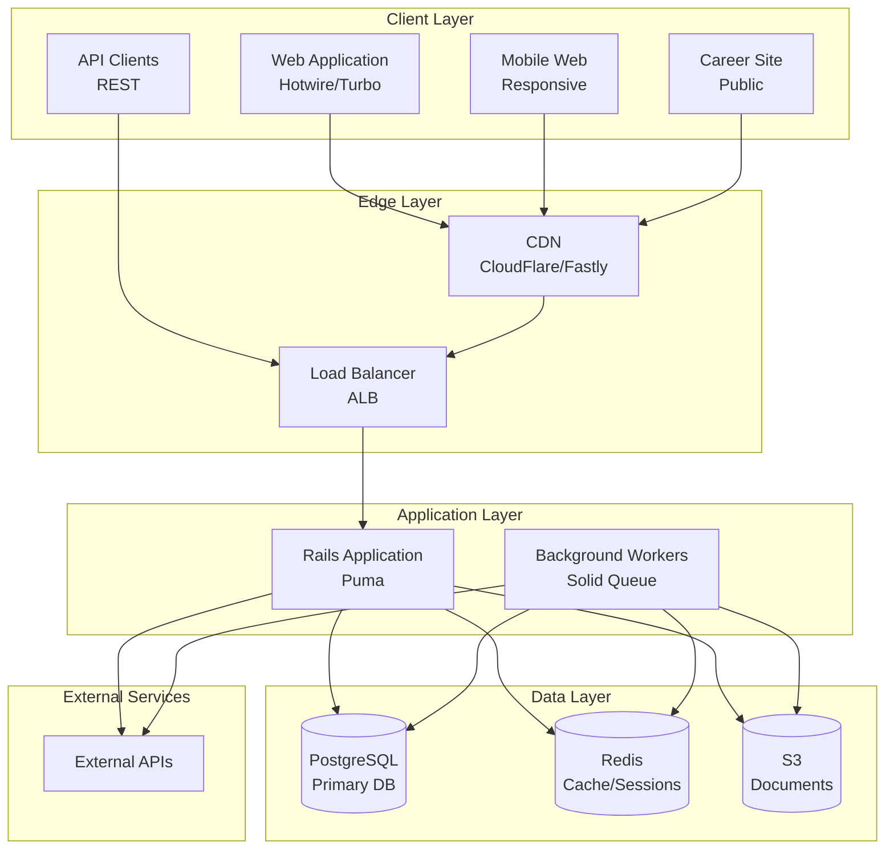

### Container Descriptions

| Container | Technology | Purpose | Scaling |
|-----------|------------|---------|---------|
| Web Application | Rails 8 + Hotwire | Primary UI for internal users | Horizontal |
| Career Site | Rails 8 (public routes) | Public job listings, applications | Horizontal + CDN |
| Background Workers | Solid Queue | Async jobs, integrations, emails | Horizontal |
| PostgreSQL | PostgreSQL 16 | Primary data store | Vertical + Read replicas |
| Redis | Redis 7 | Caching, sessions, real-time | Vertical |
| Object Storage | AWS S3 | Resumes, documents, exports | Managed |

---

## Application Architecture

### Modular Monolith Structure

```
app/
├── controllers/
│   ├── api/
│   │   └── v1/
│   ├── admin/
│   ├── careers/
│   └── portal/
├── models/
│   ├── concerns/
│   └── [domain models]
├── domains/
│   ├── iam/                    # SA-01: Identity & Access
│   ├── organization/           # SA-02: Organization
│   ├── requisition/            # SA-03: Job Requisition
│   ├── candidate/              # SA-04: Candidate
│   ├── pipeline/               # SA-05: Application Pipeline
│   ├── interview/              # SA-06: Interview
│   ├── evaluation/             # SA-07: Evaluation
│   ├── offer/                  # SA-08: Offer Management
│   ├── compliance/             # SA-09: Compliance & Audit
│   ├── communication/          # SA-10: Communication
│   ├── integration/            # SA-11: Integration
│   └── career_site/            # SA-12: Career Site
├── jobs/
├── mailers/
├── services/
└── views/
```

### Domain Module Structure

Each domain follows a consistent internal structure:

```
domains/pipeline/
├── models/
│   ├── application.rb
│   └── stage_transition.rb
├── services/
│   ├── move_stage_service.rb
│   ├── reject_application_service.rb
│   └── bulk_action_service.rb
├── events/
│   ├── application_created_event.rb
│   ├── stage_changed_event.rb
│   └── application_rejected_event.rb
├── policies/
│   └── application_policy.rb
├── queries/
│   ├── pipeline_query.rb
│   └── applications_search_query.rb
└── validators/
    └── stage_transition_validator.rb
```

### Layer Responsibilities

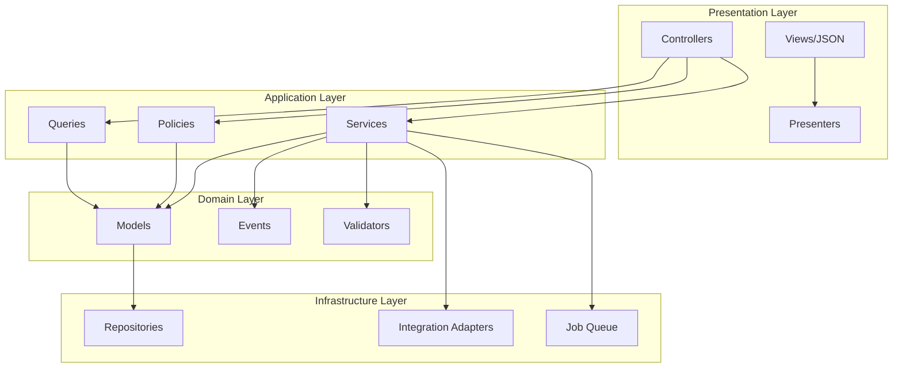

| Layer | Responsibility | Examples |
|-------|----------------|----------|
| Presentation | HTTP handling, rendering | Controllers, Views, API serializers |
| Application | Use case orchestration | Services, Policies, Queries |
| Domain | Business logic, rules | Models, Events, Validators |
| Infrastructure | External concerns | Database, APIs, Queue, Storage |

---

## Data Architecture

### Database Design

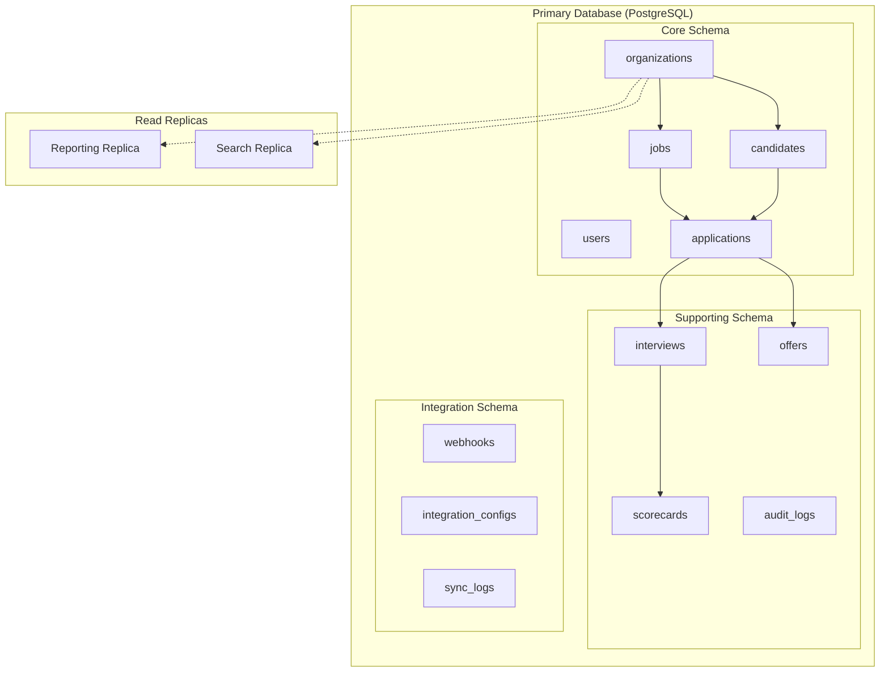

### Multi-Tenancy

**Strategy:** Shared database, shared schema with `organization_id` discrimination

```ruby
# All tenant-scoped models include:
module OrganizationScoped
  extend ActiveSupport::Concern

  included do
    belongs_to :organization
    default_scope { where(organization_id: Current.organization&.id) }

    validates :organization_id, presence: true
  end
end
```

**Row-Level Security (Future):**
```sql
-- PostgreSQL RLS for defense in depth
ALTER TABLE applications ENABLE ROW LEVEL SECURITY;

CREATE POLICY tenant_isolation ON applications
  USING (organization_id = current_setting('app.current_organization_id')::bigint);
```

### Data Classification

| Classification | Examples | Encryption | Retention |
|----------------|----------|------------|-----------|
| Public | Job descriptions, company info | Transit only | Indefinite |
| Internal | Pipeline status, notes | Transit + Rest | Per policy |
| Confidential | Candidate PII, resumes | Transit + Rest + Field | Per policy |
| Restricted | EEOC data, salary, SSN | Transit + Rest + Field | Minimum legal |

### Encryption Strategy

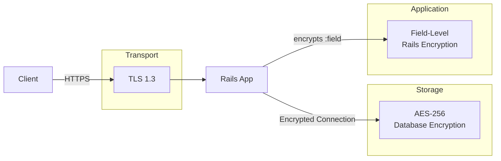

**Field-Level Encryption (Rails 7+):**
```ruby
class Candidate < ApplicationRecord
  encrypts :email, deterministic: true  # Allows querying
  encrypts :phone                        # Non-deterministic
  encrypts :ssn                          # Non-deterministic
end

class Offer < ApplicationRecord
  encrypts :salary
  encrypts :bonus
  encrypts :equity
end
```

---

## Event Architecture

### Domain Events

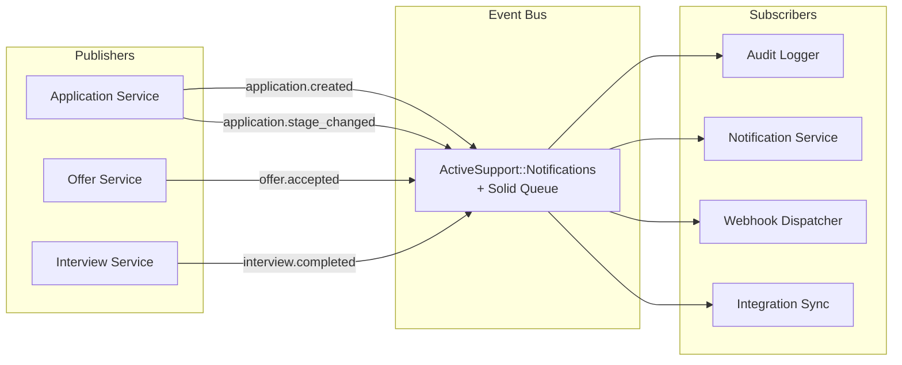

### Event Flow

```ruby
# Publishing an event
class MoveStageService
  def call(application, target_stage, user:, notes: nil)
    Application.transaction do
      from_stage = application.current_stage
      application.update!(current_stage: target_stage)

      StageTransition.create!(
        application: application,
        from_stage: from_stage,
        to_stage: target_stage,
        moved_by: user,
        notes: notes
      )

      # Publish domain event
      EventBus.publish(
        'application.stage_changed',
        application: application,
        from_stage: from_stage,
        to_stage: target_stage,
        user: user
      )
    end
  end
end

# Subscribing to events
EventBus.subscribe('application.stage_changed') do |event|
  AuditLogger.log(event)
  NotificationService.notify_stage_change(event)
  WebhookDispatcher.dispatch(event)
end
```

### Event Catalog

| Event | Trigger | Subscribers |
|-------|---------|-------------|
| `job.created` | Job requisition created | Audit |
| `job.opened` | Job status → open | Audit, Webhooks, Job Boards |
| `job.closed` | Job status → closed | Audit, Webhooks, Job Boards |
| `application.created` | New application | Audit, Notifications, Webhooks |
| `application.stage_changed` | Pipeline movement | Audit, Notifications, Webhooks |
| `application.rejected` | Application rejected | Audit, Notifications, Webhooks, Communication |
| `application.hired` | Candidate hired | Audit, Notifications, Webhooks, HRIS |
| `interview.scheduled` | Interview created | Audit, Notifications, Calendar |
| `interview.completed` | Interview finished | Audit, Notifications |
| `scorecard.submitted` | Feedback submitted | Audit, Notifications |
| `offer.sent` | Offer sent to candidate | Audit, Notifications, Webhooks |
| `offer.accepted` | Candidate accepted | Audit, Notifications, Webhooks, HRIS |
| `background_check.completed` | Screening results | Audit, Notifications, Compliance |

---

## API Architecture

### API Design

```
/api/v1/
├── /jobs
│   ├── GET    /                    # List jobs
│   ├── POST   /                    # Create job
│   ├── GET    /:id                 # Get job
│   ├── PATCH  /:id                 # Update job
│   ├── DELETE /:id                 # Archive job
│   ├── POST   /:id/open            # Open job
│   ├── POST   /:id/close           # Close job
│   └── GET    /:id/applications    # Job applications
├── /candidates
│   ├── GET    /                    # List/search candidates
│   ├── POST   /                    # Create candidate
│   ├── GET    /:id                 # Get candidate
│   ├── PATCH  /:id                 # Update candidate
│   └── GET    /:id/applications    # Candidate applications
├── /applications
│   ├── GET    /                    # List applications
│   ├── POST   /                    # Create application
│   ├── GET    /:id                 # Get application
│   ├── POST   /:id/move            # Move stage
│   ├── POST   /:id/reject          # Reject
│   └── GET    /:id/timeline        # Activity timeline
├── /interviews
│   ├── GET    /                    # List interviews
│   ├── POST   /                    # Schedule interview
│   ├── GET    /:id                 # Get interview
│   ├── PATCH  /:id                 # Update interview
│   ├── DELETE /:id                 # Cancel interview
│   └── POST   /:id/complete        # Mark complete
├── /offers
│   ├── GET    /                    # List offers
│   ├── POST   /                    # Create offer
│   ├── GET    /:id                 # Get offer
│   ├── PATCH  /:id                 # Update offer
│   ├── POST   /:id/send            # Send to candidate
│   └── POST   /:id/withdraw        # Withdraw offer
└── /webhooks
    ├── GET    /                    # List webhooks
    ├── POST   /                    # Create webhook
    ├── GET    /:id                 # Get webhook
    ├── PATCH  /:id                 # Update webhook
    └── DELETE /:id                 # Delete webhook
```

### Authentication & Authorization

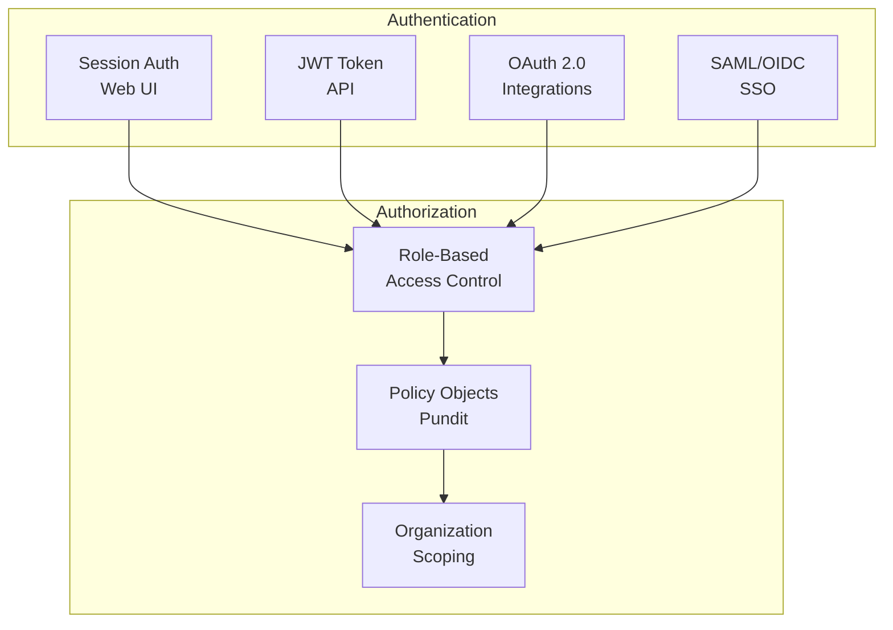

**API Authentication:**
```ruby
# API Key Authentication
class Api::V1::BaseController < ApplicationController
  before_action :authenticate_api_key!

  private

  def authenticate_api_key!
    api_key = ApiKey.find_by_key(request.headers['X-API-Key'])

    if api_key&.active?
      Current.user = api_key.user
      Current.organization = api_key.organization
      api_key.touch(:last_used_at)
    else
      render json: { error: 'Unauthorized' }, status: :unauthorized
    end
  end
end
```

### Rate Limiting

| Endpoint Type | Limit | Window |
|---------------|-------|--------|
| Standard API | 1000 requests | 1 hour |
| Search | 100 requests | 1 minute |
| Bulk operations | 10 requests | 1 minute |
| Webhooks (outbound) | 1000 events | 1 hour |
| Career site | 10000 requests | 1 hour |

---

## Infrastructure Architecture

### Deployment Architecture

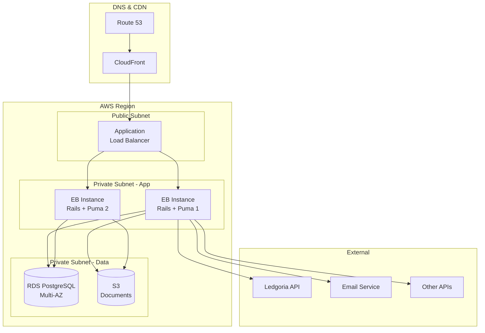

**Note:** Uses Elastic Beanstalk with auto-scaling groups, aligned with ledgoria_collect infrastructure patterns.

### Environment Tiers

**MVP Approach:** Single production environment to minimize costs during rapid development. Staging testing done in production until customer acquisition justifies environment separation.

| Environment | Purpose | Infrastructure |
|-------------|---------|----------------|
| Development | Local development | SQLite, bin/dev |
| Production | Live system + staging | Elastic Beanstalk (shared ledgoria-aux VPC) |

**Future State (Post-MVP):** When customer load justifies the cost, add dedicated staging environment.

**Infrastructure Reference:** See `ledgoria-iac` repository for authoritative CloudFormation templates and deployment runbooks.

### Deployment Pipeline

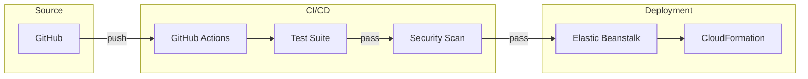

**Note:** This deployment approach aligns with ledgoria_collect patterns for consistency across the Ledgoria portfolio.

### Infrastructure as Code

Infrastructure is managed via CloudFormation in the `ledgoria-iac` repository (shared across Ledgoria applications).

**Application-level configuration:**
```
.ebextensions/           # Elastic Beanstalk configuration
├── 00_vpc.config        # VPC, subnets, security groups
├── 01_packages.config   # System dependencies
├── 02_rails.config      # Rails environment, DB config
├── 03_ssm.config        # AWS Systems Manager
├── 04_deployment.config # Rolling deployment strategy
├── 05_health.config     # Health check configuration
└── 06_logs.config       # CloudWatch Logs integration
```

**Shared infrastructure (ledgoria-iac repo):**
```
cloudformation/
├── vpc.yaml             # VPC with public/private subnets
├── rds.yaml             # PostgreSQL RDS instance
├── elasticache.yaml     # Redis cluster (optional)
├── s3.yaml              # Document storage buckets
└── iam.yaml             # IAM roles and policies
```

---

## Security Architecture

### Security Layers

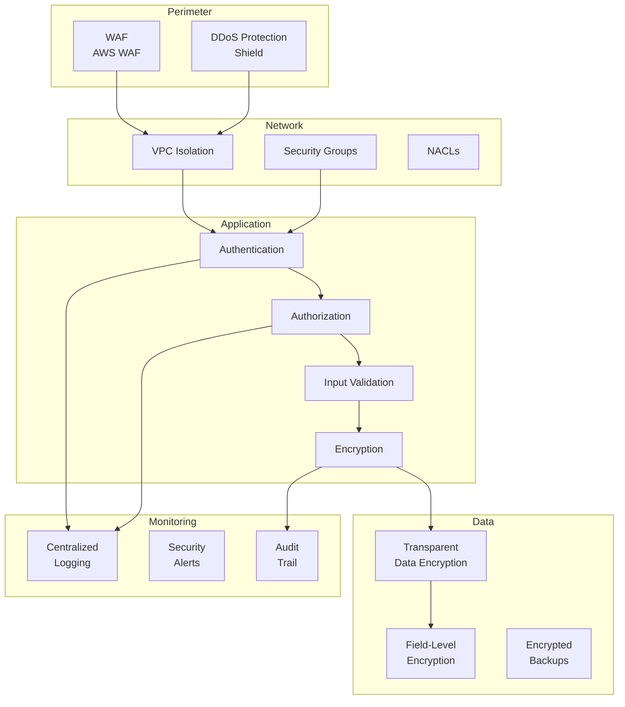

### Security Controls

| Layer | Control | Implementation |
|-------|---------|----------------|
| Network | VPC isolation | Private subnets for app/data |
| Network | Security groups | Least-privilege port access |
| Transport | TLS 1.3 | All connections encrypted |
| Application | Authentication | Session + JWT + SSO |
| Application | Authorization | RBAC + Pundit policies |
| Application | Input validation | Strong parameters + validators |
| Application | CSRF protection | Rails defaults |
| Application | XSS protection | Content Security Policy |
| Data | Encryption at rest | RDS encryption + S3 encryption |
| Data | Field encryption | Rails encrypts for PII |
| Audit | Access logging | CloudTrail + application audit |
| Monitoring | Intrusion detection | GuardDuty |

### Compliance Controls

| Requirement | Control | Evidence |
|-------------|---------|----------|
| Data encryption | AES-256 at rest, TLS in transit | AWS config, SSL reports |
| Access control | RBAC, MFA for admins | User audit, MFA logs |
| Audit logging | Immutable audit trail | Audit log exports |
| Data retention | Configurable policies | Retention policy config |
| Right to deletion | GDPR deletion workflow | Deletion request logs |
| Breach notification | Incident response plan | IR documentation |

---

## Scalability Architecture

### Scaling Strategy

| Component | Strategy | Trigger |
|-----------|----------|---------|
| Web servers | Horizontal (EB auto-scaling) | CPU > 70%, Response time > 500ms |
| Workers | Solid Queue (in-process) | Queue depth monitoring |
| Database | Vertical + Read replicas | CPU > 80%, Connection count |
| Storage | Managed (S3) | Automatic |

### Performance Targets

| Metric | Target | Alert Threshold |
|--------|--------|-----------------|
| API Response (p50) | < 100ms | > 200ms |
| API Response (p99) | < 500ms | > 1000ms |
| Page Load | < 2s | > 3s |
| Background Job (p50) | < 5s | > 30s |
| Database Query (p95) | < 50ms | > 100ms |

### Caching Strategy

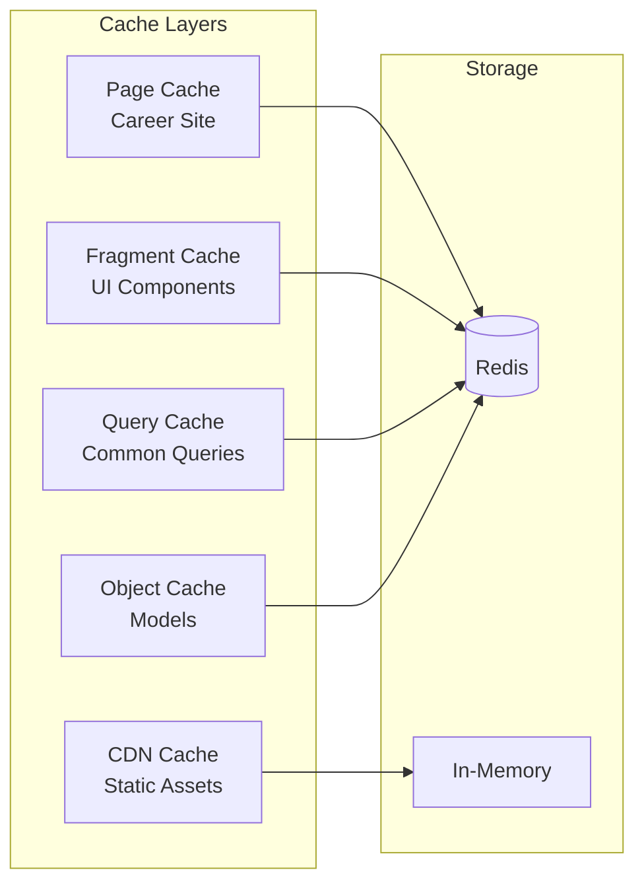

| Cache Type | TTL | Invalidation |
|------------|-----|--------------|
| Static assets | 1 year | Deploy |
| Career site pages | 5 minutes | Job change event |
| Fragment cache | 1 hour | Model touch |
| Query cache | 15 minutes | Related model change |
| Session cache | 24 hours | Logout |

---

## Observability Architecture

### Monitoring Stack

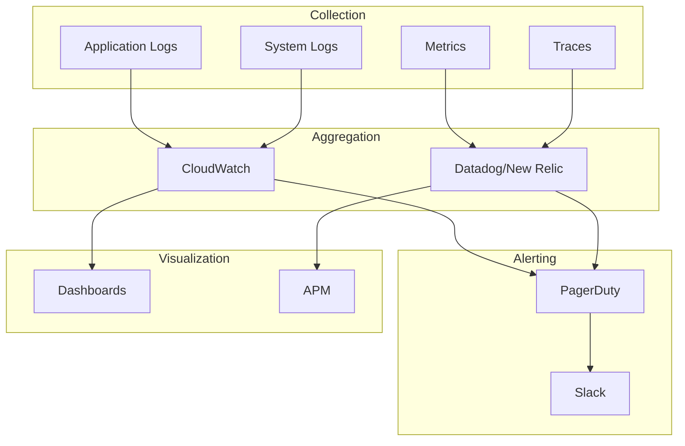

### Key Metrics

| Category | Metric | Purpose |
|----------|--------|---------|
| Availability | Uptime % | SLA tracking |
| Performance | Response time (p50, p95, p99) | User experience |
| Performance | Apdex score | User satisfaction |
| Throughput | Requests/second | Capacity planning |
| Errors | Error rate | Quality monitoring |
| Saturation | CPU, memory, connections | Resource planning |
| Business | Applications/day | Business health |
| Business | Time in stage | Process efficiency |

### Logging Strategy

```ruby
# Structured logging format
{
  timestamp: "2026-01-19T10:30:00Z",
  level: "info",
  service: "ledgoria",
  environment: "production",
  request_id: "abc-123",
  organization_id: 42,
  user_id: 123,
  action: "application.stage_changed",
  duration_ms: 45,
  metadata: {
    application_id: 456,
    from_stage: "screen",
    to_stage: "interview"
  }
}
```

---

## Disaster Recovery

### Recovery Objectives

| Tier | RTO | RPO | Examples |
|------|-----|-----|----------|
| Critical | 1 hour | 5 minutes | Database, Auth |
| High | 4 hours | 1 hour | Application, Jobs |
| Medium | 24 hours | 24 hours | Reporting, Analytics |
| Low | 72 hours | 7 days | Archives, Logs |

### Backup Strategy

| Component | Method | Frequency | Retention |
|-----------|--------|-----------|-----------|
| Database | RDS automated + snapshots | Continuous + daily | 30 days |
| Documents | S3 versioning + replication | Continuous | 90 days |
| Configuration | Git + encrypted secrets | On change | Indefinite |
| Audit logs | S3 + Glacier | Daily archive | 7 years |

### Failover Architecture

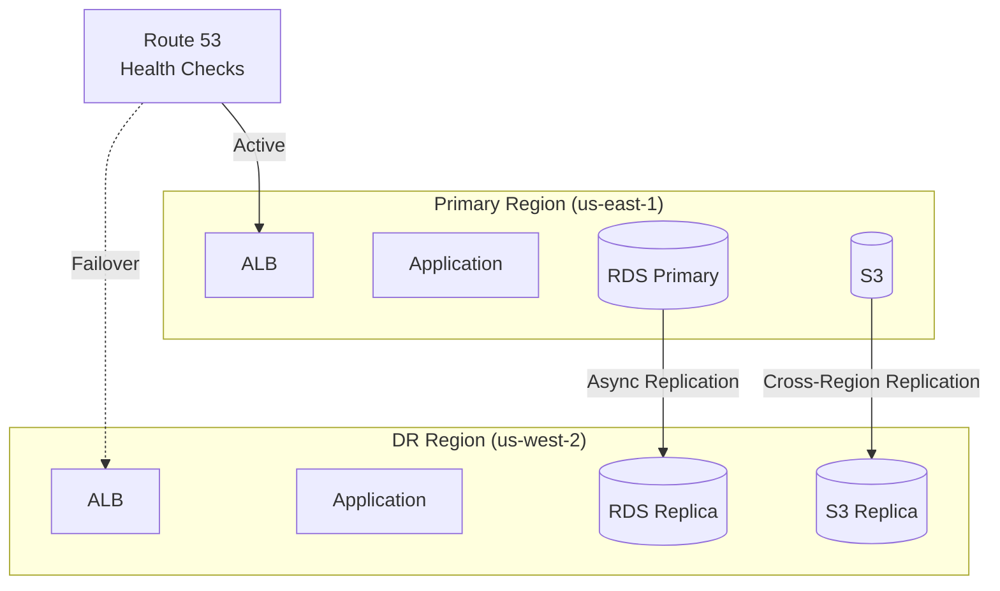

---

## Technology Stack Summary

### Core Stack

| Layer | Technology | Version | Purpose |
|-------|------------|---------|---------|
| Language | Ruby | 3.4 | Application code |
| Framework | Rails | 8.0 | Web framework |
| Database | PostgreSQL | 16 | Primary data store |
| Cache | Redis | 7 | Caching, sessions, real-time |
| Queue | Solid Queue | - | Background jobs |
| Real-time | Solid Cable | - | WebSocket/ActionCable |
| Frontend | Hotwire | - | Turbo + Stimulus |
| CSS | Tailwind CSS | 3 | Styling |

### Infrastructure

| Component | Technology | Purpose |
|-----------|------------|---------|
| Compute | AWS ECS Fargate | Container hosting |
| Database | AWS RDS | Managed PostgreSQL |
| Cache | AWS ElastiCache | Managed Redis |
| Storage | AWS S3 | Document storage |
| CDN | AWS CloudFront | Static assets, caching |
| DNS | AWS Route 53 | DNS management |
| Secrets | AWS Secrets Manager | Credential storage |
| Deployment | Kamal | Container deployment |

### Development Tools

| Tool | Purpose |
|------|---------|
| GitHub | Source control, CI/CD |
| Docker | Local development |
| RSpec | Testing framework |
| Rubocop | Code style |
| Brakeman | Security scanning |
| Bullet | N+1 detection |

---

## Architecture Decision Records

### ADR-001: Modular Monolith over Microservices

**Status:** Accepted

**Context:** Need to choose between microservices and monolith architecture for initial development.

**Decision:** Start with a modular monolith organized by bounded contexts.

**Rationale:**
- Faster initial development
- Simpler deployment and debugging
- Team size doesn't justify microservices overhead
- Bounded context structure allows future extraction

**Consequences:**
- Must maintain discipline in module boundaries
- Plan for service extraction at scale milestones

### ADR-002: PostgreSQL as Primary Database

**Status:** Accepted

**Context:** Need to select primary database technology.

**Decision:** Use PostgreSQL for all persistent data.

**Rationale:**
- Excellent Rails support
- Strong JSON/JSONB for flexible schemas
- Full-text search for candidate search (initial)
- Row-level security for defense in depth
- Managed options (RDS) mature and cost-effective

**Consequences:**
- May need Elasticsearch for advanced search at scale
- Single database simplifies operations initially

### ADR-003: Solid Queue over Sidekiq

**Status:** Accepted

**Context:** Need to select background job processor.

**Decision:** Use Solid Queue (Rails 8 default).

**Rationale:**
- Native Rails integration
- Database-backed (no Redis dependency for jobs)
- Simpler operational model
- Sufficient for initial scale

**Consequences:**
- May need to migrate to Sidekiq for very high throughput
- Less ecosystem of plugins than Sidekiq

### ADR-004: Field-Level Encryption for PII

**Status:** Accepted

**Context:** Need to protect sensitive candidate data.

**Decision:** Use Rails 7+ `encrypts` for PII fields in addition to database encryption.

**Rationale:**
- Defense in depth
- Database breach doesn't expose raw PII
- Application-level key rotation
- Compliance requirement for some customers

**Consequences:**
- Performance overhead for encrypted fields
- Deterministic encryption required for queryable fields
- Key management complexity

---

## Next Steps

**Phase 1 MVP: COMPLETE** (Sprints 0-6, 325 points, 431 tests)

1. ~~Set up development environment~~ (bin/dev, SQLite)
2. ~~Implement core domain models~~ (Organization, User, Role, Job, JobApproval)
3. ~~Authentication & Authorization~~ (Devise + Pundit)
4. ~~Implement Candidate & Application models~~ with PII encryption
5. ~~Create MoveStageService~~ for pipeline transitions
6. ~~Build Kanban pipeline~~ with drag-drop (Stimulus)
7. ~~Implement audit trail~~ (immutable AuditLog, StageTransition)
8. ~~Build public career site~~ with application flow
9. ~~Email notifications~~ (JobApplicationMailer)

**Phase 2 (Next):**
- Interview scheduling with calendar integration
- Structured scorecards and feedback
- Interviewer preparation views

**Future:**
- **Deploy to production** on AWS Elastic Beanstalk (ledgoria-aux VPC)
- **Establish event bus pattern** for domain events
- **Create API foundation** with authentication and versioning
