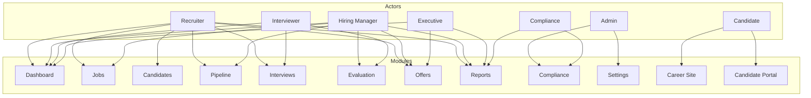

# Ledgoria - Concept of Operations

## Ledgoria Voice: Strategic Philosophy

**Ledgoria converts hiring activity into trusted outcomes.**

### Concept 1 — Security and privacy are the starting point, not a feature

An ATS is a high-risk system by default. It contains identity attributes, communications, evaluation content, and onboarding artifacts. Ledgoria's model assumes this data must be protected with the same discipline as any other trust-bearing system.

Ledgoria is designed around:
- Least-privilege access by role
- Tamper-resistant audit history
- Privacy-first handling and retention controls
- Secure integration patterns that avoid unnecessary replication of PII

**Principle: Security and privacy are invariants. Everything else is built on top.**

### Concept 2 — I-9 is not an add-on. It's a first-class operational capability.

Even if an ATS performs well for recruiting, an organization can still fail operationally if it cannot reliably execute the I-9 process. This is where hiring shifts from workflow efficiency to legal compliance and workforce activation.

A Ledgoria-aligned ATS must support I-9 / work authorization execution as a structured, auditable capability — not a side process handled by email, spreadsheets, or disconnected tools.

This matters because I-9 success depends on consistently handling:
- Form I-9 completion timing
- Document capture
- Verification workflow
- Audit readiness
- Handoff to HRIS / onboarding
- Edge cases (remote hires, rehires, expiring work authorization)

**Principle: Hiring is not complete until the relationship can be safely activated.**

### Concept 3 — Hiring is an ecosystem, not a recruiter workflow

Recruiters don't "own hiring." They operate it. Hiring is executed across candidates, managers, interviewers, HR, and compliance — each with different constraints, urgency, and accountability.

Ledgoria is designed for:
- Candidate clarity and low-friction engagement
- Recruiter velocity and coordination
- Hiring manager confidence and consistency
- Interviewer structure and accountability
- HR and compliance readiness, not cleanup

**Principle: Adoption comes from designing for every actor, not optimizing for one.**

### Concept 4 — The system must drive decisions, not store resumes

Traditional ATS platforms are systems of record. Ledgoria is a decision system.

Every interaction is evaluated against a simple standard:
*Does this move a candidate toward a decision with integrity?*

That means:
- Fast triage and dispositioning
- Structured collaboration and internal alignment
- Embedded communications that reduce drift
- Decision visibility that doesn't require detective work

**Principle: A pipeline isn't progress unless it produces decisions.**

### Concept 5 — Sourcing is measurable ROI, not volume

Candidate volume is not a strategy. Ledgoria treats sourcing as measurable, role-specific, and outcome-driven.

Ledgoria emphasizes:
- Attribution per job and channel
- Visibility into what produces qualified candidates
- Feedback loops from hire outcomes back to sourcing investment
- Repeatable sourcing patterns for roles, not generic dashboards

**Principle: Sourcing maturity is measured by outcomes, not activity.**

### Concept 6 — Interview structure is how quality scales

Unstructured interviewing does not scale. It produces variance, bias, and inconsistent evaluation.

Ledgoria enables structured interviewing through:
- Role-specific interview kits
- Competency-driven guides and scoring criteria
- Standardized scorecards that streamline reviewer input
- Consolidated feedback designed for decisions, not debate

**Principle: Hiring improves when evaluation becomes repeatable.**

### Concept 7 — The hiring record must be defensible, not just complete

Teams don't just need a timeline — they need a narrative that holds up when reviewed later.

Ledgoria treats the hiring record as evidence:
- Who evaluated what, when, and why
- Structured rationale aligned to job requirements
- Consistent representation of stage outcomes
- Audit-ready context without reconstruction

**Principle: The most valuable decision is the one you can explain.**

### Concept 8 — Remote hiring requires assurance, not more manual work

Remote hiring expands opportunity, but it also expands uncertainty. The response can't be spreadsheets, inboxes, and "HR heroics."

Ledgoria supports onboarding readiness workflows that preserve integrity through:
- Secure document handling
- Evidence capture and clear accountability
- Exception workflows that don't break operations
- Integration paths for identity verification where required or appropriate

**Principle: Remote onboarding should increase assurance without increasing friction.**

### Concept 9 — Integration is the operating model

Hiring stacks are ecosystems: scheduling, video interviews, assessments, HRIS, background screening, compliance workflows.

Ledgoria is designed to orchestrate the ecosystem while keeping one consistent source of truth for outcomes.

Ledgoria emphasizes:
- Integration-first architecture
- Clean handoff into HRIS/onboarding systems
- Consistent statuses across tools
- Minimal duplication of sensitive data

**Principle: The ATS coordinates. It doesn't duplicate.**

---

## Operating Summary

| Principle | Traditional ATS | Ledgoria |
|-----------|-----------------|----------|
| Security | Feature to add | Foundation |
| I-9/Work Auth | External tool | First-class capability |
| Users | Recruiter-centric | Multi-actor ecosystem |
| Purpose | Store resumes | Drive decisions |
| Sourcing | Volume metrics | ROI measurement |
| Interviews | Unstructured | Repeatable quality |
| Records | Complete | Defensible |
| Remote | Manual workarounds | Built-in assurance |
| Integration | Bolt-on | Operating model |

---

## Implementation Alignment

### Concept Alignment Matrix

| Concept | Status | Key Implementations |
|---------|--------|---------------------|
| 1. Security & Privacy | ✅ Complete | RBAC, PII encryption, immutable audit, GDPR consent |
| 2. I-9 First-Class | ✅ Complete | I-9 verification workflow, E-Verify, work auth tracking (Phase 8) |
| 3. Multi-Actor Ecosystem | ✅ Complete | Role-based views, candidate portal, interviewer kits |
| 4. Decision System | ✅ Complete | Pipeline automation, hiring decisions, SLA alerts |
| 5. Sourcing ROI | ✅ Complete | Source effectiveness reports, conversion tracking |
| 6. Structured Interviews | ✅ Complete | Scorecards, question banks, interview kits |
| 7. Defensible Records | ✅ Complete | Immutable logs, decision rationale, EEOC compliance |
| 8. Remote Assurance | ⚠️ Partial | Documents, I-9 ready; identity verification integration pending |
| 9. Integration Model | ✅ Complete | Webhooks, API, SSO, background checks |

> **See [REALIZED_CONOPS.md](./REALIZED_CONOPS.md) for detailed gap analysis and GTM recommendations.**

### I-9 / Work Authorization (Phase 8 - COMPLETE)

The CONOPS explicitly identifies I-9 as a first-class capability. **All requirements delivered:**

1. **I9Verification Model** - Section 1/2/3 workflow with timing enforcement ✅
2. **I9Document Model** - List A/B/C documents with expiration tracking ✅
3. **WorkAuthorization Model** - Type tracking, reverification scheduling ✅
4. **EVerifyCase Model** - Case submission, TNC workflow ✅
5. **Remote I-9 Support** - Authorized representative workflow ✅
6. **Compliance Dashboard** - Pending I-9s, expiring authorizations ✅

### Remaining Gap: Identity Verification

The only partially realized concept is **Remote Assurance** (Concept 8), which requires:

1. **Pre-offer identity verification** - Ledgoria identity integration (Phase 9+)
2. **Credential attestation** - Education/employment verification
3. **Portable trust profiles** - Returning candidate recognition

---

## Purpose

This document defines the operational concept for Ledgoria's user experience. It describes how each actor interacts with the system, their goals and workflows, and how the application modules support those interactions.

---

## User Experience Principles

### UX-1: Clarity Over Cleverness

Every screen answers: *What do I need to do next?*

- Primary actions are obvious and prominent
- Secondary actions are accessible but not distracting
- Status is always visible without clicking
- No hidden menus for common operations

### UX-2: Progressive Disclosure

Show what's needed, when it's needed.

- Simple defaults, advanced options available
- Wizards for complex multi-step flows
- Inline expansion for details (no page navigation for context)
- Role-appropriate views (recruiters see everything; hiring managers see what they need)

### UX-3: Speed to Action

Minimize clicks, maximize impact.

- Keyboard shortcuts for power users
- Bulk operations for repetitive tasks
- Quick actions from any list view
- Remember user preferences and last-used filters

### UX-4: Trust Through Transparency

Users trust systems they understand.

- Clear feedback for every action
- Undo where possible, confirm where destructive
- Audit trail visible to users (their own actions)
- No silent failures—always communicate errors clearly

### UX-5: Mobile-Ready, Desktop-Optimized

Works everywhere, excels on desktop.

- Responsive design for all screens
- Touch-friendly targets on mobile
- Dense information display on desktop
- Critical workflows (approvals, feedback) work fully on mobile

### UX-6: Accessibility First

Usable by everyone.

- WCAG 2.1 AA compliance minimum
- Screen reader compatible
- Keyboard navigation throughout
- Color not sole indicator of state

---

## Actor Experience Map

### Actor-Module Matrix

| Module | Admin | Recruiter | Hiring Mgr | Interviewer | Executive | Compliance | Candidate |
|--------|-------|-----------|------------|-------------|-----------|------------|-----------|
| Dashboard | Config | Primary | Primary | Limited | Primary | Primary | - |
| Jobs | Full | Full | Own Team | View | View | View | Browse |
| Candidates | Full | Full | Own Jobs | Assigned | - | View | Self |
| Pipeline | Full | Full | Own Jobs | - | View | View | - |
| Interviews | Full | Full | Own Jobs | Own | Own | View | Self |
| Offers | Full | Full | Approve | - | Approve | View | Self |
| Reports | Full | Recruiting | Team | - | Full | Compliance | - |
| Settings | Full | Limited | - | - | - | Limited | - |
| Career Site | - | - | - | - | - | - | Primary |

**Legend:** Full = all operations | Primary = main workspace | Own = scoped to their items | View = read-only | Limited = subset | - = no access

---

## Actor Experience Details

### ACT-01: System Administrator

**Primary Goal:** Keep the system running smoothly and configured correctly.

**Mindset:** "I need to set this up once and have it work reliably."

**Key Workflows:**
1. Initial organization setup (branding, settings, integrations)
2. User provisioning and role management
3. Integration configuration (SSO, job boards, HRIS)
4. Troubleshooting and support escalation

**UX Requirements:**
- Admin console separate from recruiting interface
- Bulk user import/management
- Integration health dashboard
- Audit log access for troubleshooting
- Test modes for integrations

**Entry Points:**
```
/admin                    → Admin dashboard
/admin/users              → User management
/admin/integrations       → Integration settings
/admin/organization       → Organization settings
/admin/audit              → Audit logs
```

**Success Metrics:**
- Time to complete initial setup < 2 hours
- User provisioning < 2 minutes per user
- Integration setup with guided wizard

---

### ACT-02: Recruiter

**Primary Goal:** Fill positions quickly with qualified candidates while maintaining compliance.

**Mindset:** "I'm juggling 20 requisitions—show me what needs attention now."

**Key Workflows:**
1. **Morning triage:** Review new applications, check SLA alerts
2. **Pipeline management:** Move candidates, schedule interviews, send updates
3. **Sourcing:** Search talent pools, post to job boards
4. **Coordination:** Schedule interviews, collect feedback, extend offers
5. **Reporting:** Track metrics, identify bottlenecks

**UX Requirements:**
- Inbox-style task list ("Candidates awaiting review", "Feedback pending")
- Kanban pipeline with drag-drop
- Bulk actions (email, stage move, reject)
- Quick candidate preview without leaving list
- Global search across all candidates/jobs
- Keyboard shortcuts for common actions

**Entry Points:**
```
/dashboard                → Recruiter dashboard (task-focused)
/jobs                     → Job list with quick filters
/jobs/:id/pipeline        → Kanban pipeline view
/candidates               → Candidate database
/candidates/:id           → Candidate profile
/interviews               → Interview calendar
/reports                  → Recruiting analytics
```

**Dashboard Widgets:**
- Tasks requiring action (count + list)
- Applications by stage (pipeline summary)
- Interviews today/this week
- Offer pending responses
- SLA alerts (candidates stuck in stage)

**Success Metrics:**
- Page load < 2 seconds
- Common actions < 3 clicks
- Bulk operations save 50%+ time vs. individual

---

### ACT-03: Hiring Manager

**Primary Goal:** Hire the best candidate for my team with minimal time investment.

**Mindset:** "Recruiting isn't my job—tell me exactly what you need from me."

**Key Workflows:**
1. **Approve requisitions:** Review and approve job postings
2. **Review candidates:** See who's in pipeline, read resumes
3. **Provide feedback:** Submit interview scorecards
4. **Make decisions:** Approve stage progression, approve offers
5. **Track progress:** See pipeline status for my open roles

**UX Requirements:**
- Simplified interface (less is more)
- Clear "action required" indicators
- Email-driven workflow (can act from email links)
- Mobile-friendly for approvals on-the-go
- Candidate comparison view
- Aggregated team feedback view

**Entry Points:**
```
/dashboard                → HM dashboard (approval-focused)
/jobs                     → My team's jobs only
/jobs/:id/pipeline        → Pipeline (simplified view)
/jobs/:id/candidates/:id  → Candidate detail (HM view)
/approvals                → Pending approvals (jobs + offers)
```

**Dashboard Widgets:**
- Pending approvals (prominent, actionable)
- Open positions status
- Candidates in final stages
- Upcoming interviews (my participation)

**Success Metrics:**
- Approval workflow < 30 seconds
- Scorecard submission < 5 minutes
- Zero training needed for basic operations

---

### ACT-04: Interviewer

**Primary Goal:** Conduct effective interviews and provide useful feedback quickly.

**Mindset:** "I have 10 minutes before my next meeting to submit this feedback."

**Key Workflows:**
1. **Prepare:** Review candidate, see interview questions
2. **Conduct:** (happens outside system)
3. **Submit feedback:** Complete scorecard immediately after
4. **Review (optional):** See aggregate team feedback after submitting

**UX Requirements:**
- Interview prep view (candidate summary + questions)
- Fast scorecard entry (mobile-optimized)
- Competency ratings with minimal typing
- Save draft and resume later
- Calendar integration showing interview details

**Entry Points:**
```
/interviews               → My upcoming interviews
/interviews/:id           → Interview detail + prep
/interviews/:id/feedback  → Scorecard submission
/calendar                 → Calendar view with interviews
```

**Interview Prep View:**
- Candidate name, photo, current role
- Resume (viewable, not downloadable for security)
- Position they're interviewing for
- Interview questions/focus areas
- Previous interview notes (visibility-controlled)

**Scorecard View:**
- Competency list with 1-5 rating buttons
- Quick notes field per competency
- Overall recommendation (Strong No → Strong Yes)
- Strengths/concerns text areas
- Submit button (prominent)

**Success Metrics:**
- Scorecard submission < 3 minutes
- Interview prep access < 2 clicks from email
- Mobile scorecard fully functional

---

### ACT-05: Executive / Leadership

**Primary Goal:** Understand hiring health and intervene only when necessary.

**Mindset:** "Give me the 30-second version unless something's wrong."

**Key Workflows:**
1. **Monitor:** Check dashboard for hiring health
2. **Investigate:** Drill into problem areas
3. **Approve:** Sign off on executive-level offers
4. **Report:** Share metrics with board/leadership

**UX Requirements:**
- Executive dashboard (metrics-first)
- Drill-down from metrics to details
- Comparison views (this quarter vs. last)
- Export/share capabilities
- Minimal day-to-day interaction required

**Entry Points:**
```
/dashboard                → Executive dashboard
/reports/executive        → Executive reports
/approvals                → Executive-level approvals only
```

**Dashboard Widgets:**
- Hiring velocity (filled this month/quarter)
- Open positions by department
- Time-to-hire trend
- Offer acceptance rate
- Diversity metrics (aggregated)
- Pipeline health (bottlenecks highlighted)

**Success Metrics:**
- Dashboard load < 3 seconds
- Key metrics visible without scrolling
- Drill-down to details in 1 click

---

### ACT-06: HR Compliance Officer

**Primary Goal:** Ensure hiring practices meet legal requirements and can withstand audit.

**Mindset:** "If OFCCP comes calling, can we produce clean documentation?"

**Key Workflows:**
1. **Audit preparation:** Generate compliance reports
2. **Adverse action management:** Oversee pre-adverse/final adverse workflows
3. **EEOC reporting:** Generate required regulatory reports
4. **Data management:** Handle deletion requests, retention policies
5. **Review:** Spot-check hiring decisions for consistency

**UX Requirements:**
- Compliance-specific dashboard
- Report generation with date ranges
- Audit trail search and export
- Adverse action workflow management
- GDPR tools (deletion, export)
- Aggregated EEOC data (never individual)

**Entry Points:**
```
/compliance               → Compliance dashboard
/compliance/eeoc          → EEOC reports
/compliance/audit         → Audit log search
/compliance/adverse       → Adverse action queue
/compliance/retention     → Retention policy management
/compliance/requests      → Data subject requests
```

**Dashboard Widgets:**
- Pending adverse actions
- Data deletion requests
- Upcoming retention expirations
- EEOC collection rate
- Recent audit activity

**Success Metrics:**
- EEOC report generation < 1 minute
- Audit trail export < 5 minutes for any date range
- Adverse action workflow fully guided

---

### ACT-07: Candidate

**Primary Goal:** Find a great job and know where I stand throughout the process.

**Mindset:** "Don't make me create an account just to apply."

**Key Workflows:**
1. **Discover:** Browse/search open positions
2. **Apply:** Submit application with resume
3. **Track:** Check application status
4. **Schedule:** Self-schedule interviews
5. **Respond:** Accept/decline offers

**UX Requirements:**
- Frictionless apply (no account required)
- Mobile-first design
- Status transparency (always know current stage)
- Self-scheduling with available slots
- Document upload capability
- Offer review and e-signature

**Entry Points:**
```
/careers                  → Public career site
/careers/jobs             → Job listings
/careers/jobs/:id         → Job detail
/careers/jobs/:id/apply   → Application form
/portal                   → Candidate portal (optional login)
/portal/applications      → My applications
/portal/schedule/:token   → Self-scheduling (tokenized)
/portal/offer/:token      → Offer review (tokenized)
```

**Career Site:**
- Company branding throughout
- Job search with filters (location, department, type)
- Job detail with clear Apply button
- Simple application form (name, email, resume, questions)
- Confirmation with status tracking link

**Candidate Portal:**
- Optional—can track via email links without account
- Application status timeline
- Upcoming interviews
- Document upload
- Message history
- Offer acceptance

**Success Metrics:**
- Application completion < 3 minutes
- Mobile apply fully functional
- Status check without login
- Self-scheduling < 2 minutes

---

### ACT-08: Referring Employee

**Primary Goal:** Help my network find great opportunities and get credit for successful hires.

**Mindset:** "Make it easy or I won't bother."

**Key Workflows:**
1. **Submit:** Refer a candidate for a specific role
2. **Track:** See status of my referrals
3. **Receive credit:** Get notified of successful hires

**UX Requirements:**
- Simple referral form (minimal fields)
- Shareable job links with referral tracking
- Referral status dashboard
- Notifications on status changes

**Entry Points:**
```
/referrals                → My referrals dashboard
/referrals/new            → Submit referral
/jobs/:id?ref=:code       → Trackable job link
```

**Success Metrics:**
- Referral submission < 2 minutes
- Status visible without asking recruiter

---

## Application Modules

### MOD-01: Dashboard Module

**Purpose:** Personalized landing page showing relevant tasks and metrics.

**Variants by Role:**

| Role | Primary Focus | Key Components |
|------|---------------|----------------|
| Recruiter | Tasks & pipeline | Task list, pipeline summary, calendar, alerts |
| Hiring Manager | Approvals & status | Approval queue, my jobs status, upcoming interviews |
| Interviewer | Upcoming interviews | Interview list, prep links, pending feedback |
| Executive | Metrics & health | KPIs, trends, drill-down charts |
| Compliance | Compliance queue | Adverse actions, requests, alerts |

**Shared Components:**
- Notification center
- Quick search
- Recent activity

---

### MOD-02: Jobs Module

**Purpose:** Create, manage, and track job requisitions.

**Key Screens:**

| Screen | Purpose | Primary Users |
|--------|---------|---------------|
| Job List | Browse/filter all jobs | Recruiter, HM |
| Job Detail | View job info, team, activity | Recruiter, HM |
| Job Editor | Create/edit job content | Recruiter |
| Job Pipeline | Kanban view of candidates | Recruiter, HM |
| Job Analytics | Job-specific metrics | Recruiter, HM |
| Job Settings | Stages, questions, posting | Recruiter |

**Key Features:**
- Status workflow (Draft → Approval → Open → Closed)
- Approval routing
- Job board posting
- Stage customization per job
- Clone job functionality

---

### MOD-03: Candidates Module

**Purpose:** Manage candidate profiles across all jobs.

**Key Screens:**

| Screen | Purpose | Primary Users |
|--------|---------|---------------|
| Candidate List | Search/browse candidates | Recruiter |
| Candidate Profile | Full candidate detail | Recruiter, HM, Interviewer |
| Resume Viewer | View/parse resume | Recruiter, HM, Interviewer |
| Candidate Timeline | Activity history | Recruiter |
| Merge Candidates | Deduplicate | Recruiter |

**Key Features:**
- Advanced search (boolean, filters)
- Talent pools
- Tags and notes
- Resume parsing
- Duplicate detection
- Source tracking

---

### MOD-04: Pipeline Module

**Purpose:** Visual workflow management for applications.

**Key Screens:**

| Screen | Purpose | Primary Users |
|--------|---------|---------------|
| Kanban Board | Drag-drop stage management | Recruiter |
| List View | Sortable/filterable list | Recruiter |
| Candidate Card | Quick preview in pipeline | Recruiter |
| Bulk Actions | Multi-select operations | Recruiter |

**Key Features:**
- Drag-drop stage movement
- Quick actions (reject, email, schedule)
- Filters (stage, source, rating, date)
- Bulk move/reject/email
- Stage duration tracking

---

### MOD-05: Interviews Module

**Purpose:** Schedule and manage interviews.

**Key Screens:**

| Screen | Purpose | Primary Users |
|--------|---------|---------------|
| Interview Calendar | Calendar view of all interviews | Recruiter, Interviewer |
| Schedule Interview | Create interview | Recruiter |
| Interview Detail | View/manage interview | Recruiter, Interviewer |
| Interview Prep | Candidate info + questions | Interviewer |
| Self-Schedule | Candidate slot selection | Candidate |

**Key Features:**
- Calendar integration (Google, Outlook)
- Panel interview coordination
- Interviewer availability
- Candidate self-scheduling
- Video link generation
- Interview templates

---

### MOD-06: Evaluation Module

**Purpose:** Collect and aggregate interview feedback.

**Key Screens:**

| Screen | Purpose | Primary Users |
|--------|---------|---------------|
| Scorecard Form | Submit feedback | Interviewer |
| Feedback Summary | View all feedback | Recruiter, HM |
| Competency Ratings | Aggregated competency view | Recruiter, HM |
| Decision Capture | Record hiring decision | HM |

**Key Features:**
- Structured scorecards
- Competency-based ratings
- Visibility controls (hide until submitted)
- Feedback reminders
- Hiring decision documentation

---

### MOD-07: Offers Module

**Purpose:** Create, approve, and manage offers.

**Key Screens:**

| Screen | Purpose | Primary Users |
|--------|---------|---------------|
| Offer Builder | Create offer | Recruiter |
| Offer Approval | Review/approve offer | HM, Executive |
| Offer Letter Preview | Preview generated letter | Recruiter |
| Offer Portal | Candidate offer view | Candidate |
| Offer Tracking | Status of all offers | Recruiter |

**Key Features:**
- Offer templates
- Approval workflow
- Compensation fields
- E-signature integration
- Offer expiration
- Negotiation tracking

---

### MOD-08: Reports Module

**Purpose:** Analytics and insights.

**Key Screens:**

| Screen | Purpose | Primary Users |
|--------|---------|---------------|
| Dashboard | Key metrics overview | All |
| Time-to-Hire | Hiring duration analysis | Recruiter, HM, Exec |
| Source Analysis | Source effectiveness | Recruiter |
| Pipeline Funnel | Conversion rates | Recruiter, Exec |
| Diversity Report | EEOC metrics | Compliance, Exec |
| Custom Reports | Build your own | Recruiter, Compliance |

**Key Features:**
- Date range selection
- Drill-down capability
- Export (CSV, PDF)
- Scheduled reports
- Report sharing

---

### MOD-09: Compliance Module

**Purpose:** Regulatory compliance and audit support.

**Key Screens:**

| Screen | Purpose | Primary Users |
|--------|---------|---------------|
| Compliance Dashboard | Overview of compliance status | Compliance |
| EEOC Reports | Generate EEOC/OFCCP reports | Compliance |
| Audit Trail | Search/export audit logs | Compliance, Admin |
| Adverse Action | Manage adverse action workflows | Compliance |
| Data Requests | GDPR/CCPA requests | Compliance |
| Retention | Data retention management | Compliance, Admin |

**Key Features:**
- Regulatory report generation
- Audit log search and export
- Adverse action workflow
- Data deletion workflow
- Consent management
- Retention policy enforcement

---

### MOD-10: Settings Module

**Purpose:** System configuration.

**Key Screens:**

| Screen | Purpose | Primary Users |
|--------|---------|---------------|
| Organization | Company settings | Admin |
| Users | User management | Admin |
| Roles | Permission management | Admin |
| Integrations | External connections | Admin |
| Templates | Email/offer templates | Admin, Recruiter |
| Stages | Pipeline stage config | Admin, Recruiter |
| Custom Fields | Field configuration | Admin |
| Career Site | Career site settings | Admin |

---

### MOD-11: Career Site Module

**Purpose:** Public-facing job listings and application.

**Key Screens:**

| Screen | Purpose | Primary Users |
|--------|---------|---------------|
| Home | Career site landing | Candidate |
| Job List | Browse jobs | Candidate |
| Job Detail | View job and apply | Candidate |
| Application Form | Submit application | Candidate |
| Confirmation | Application received | Candidate |

**Key Features:**
- Company branding
- Job search/filter
- Mobile-responsive
- Frictionless apply
- EEOC collection (post-apply)
- Social sharing

---

### MOD-12: Candidate Portal Module

**Purpose:** Candidate self-service after applying.

**Key Screens:**

| Screen | Purpose | Primary Users |
|--------|---------|---------------|
| Status | Application status | Candidate |
| Schedule | Self-schedule interviews | Candidate |
| Documents | Upload additional docs | Candidate |
| Offer | Review and sign offer | Candidate |
| Profile | Update contact info | Candidate |

**Key Features:**
- Token-based access (no login required)
- Optional account creation
- Status timeline
- Interview self-scheduling
- Offer e-signature
- Document upload

---

## Navigation Structure

### Primary Navigation (Sidebar)

**Recruiter View:**
```
├── Dashboard
├── Jobs
│   ├── All Jobs
│   ├── My Jobs
│   └── Create Job
├── Candidates
│   ├── All Candidates
│   ├── Talent Pools
│   └── Search
├── Interviews
│   ├── Calendar
│   └── Templates
├── Offers
│   ├── Active Offers
│   └── Templates
├── Reports
│   ├── Overview
│   ├── Time-to-Hire
│   ├── Sources
│   └── Custom
└── Settings (if admin)
```

**Hiring Manager View:**
```
├── Dashboard
├── My Jobs
├── Approvals
│   ├── Job Approvals
│   └── Offer Approvals
├── Interviews
└── Reports
    └── My Team
```

**Interviewer View:**
```
├── Dashboard
├── My Interviews
└── Feedback
    └── Pending
```

### Global Elements

- **Top Bar:** Logo, Search, Notifications, Profile
- **Search:** Global search across jobs, candidates, applications
- **Notifications:** Bell icon with dropdown, unread count
- **Profile:** User menu with settings, logout

---

## Responsive Breakpoints

| Breakpoint | Width | Layout |
|------------|-------|--------|
| Mobile | < 640px | Single column, bottom nav |
| Tablet | 640-1024px | Condensed sidebar, responsive grid |
| Desktop | 1024-1440px | Full sidebar, standard layout |
| Large | > 1440px | Full sidebar, expanded content |

### Mobile Adaptations

- Bottom navigation for primary sections
- Slide-out panels instead of modals
- Touch-friendly targets (44px minimum)
- Simplified pipeline (list view default)
- Full-screen candidate cards

---

## Performance Targets

| Metric | Target |
|--------|--------|
| First Contentful Paint | < 1.5s |
| Time to Interactive | < 3s |
| Dashboard Load | < 2s |
| Pipeline Load | < 2s (100 candidates) |
| Search Results | < 1s |
| Page Navigation | < 500ms |
| Bulk Action (10 items) | < 3s |

---

## Accessibility Requirements

| Requirement | Standard |
|-------------|----------|
| WCAG Level | AA minimum |
| Keyboard Navigation | Full support |
| Screen Readers | ARIA labels throughout |
| Color Contrast | 4.5:1 minimum |
| Focus Indicators | Visible on all interactive elements |
| Error Messages | Announced to screen readers |
| Form Labels | Associated with inputs |
| Alt Text | All meaningful images |

---

## Module-Actor Summary



---

## Success Criteria

### Recruiter Efficiency
- [ ] 50% reduction in clicks for common workflows vs. competitor baseline
- [ ] < 5 minute training for basic operations
- [ ] < 30 minute training for full proficiency

### Hiring Manager Adoption
- [ ] 90% of approvals completed within 24 hours
- [ ] Zero support tickets for "how do I approve"
- [ ] 80% scorecard completion within 24 hours of interview

### Candidate Experience
- [ ] < 3 minute application completion
- [ ] 90% mobile application success rate
- [ ] Net Promoter Score > 50 for application experience

### Compliance Confidence
- [ ] Audit report generation < 5 minutes
- [ ] 100% of rejections have documented reasons
- [ ] Zero compliance gaps in adverse action workflow
