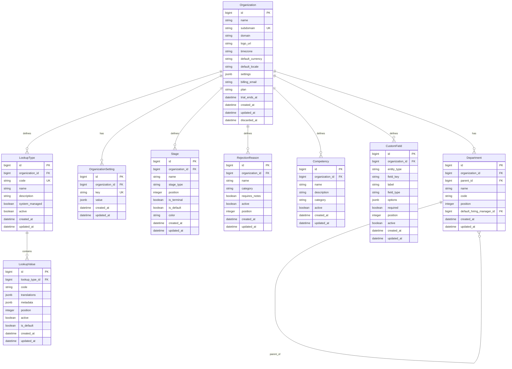
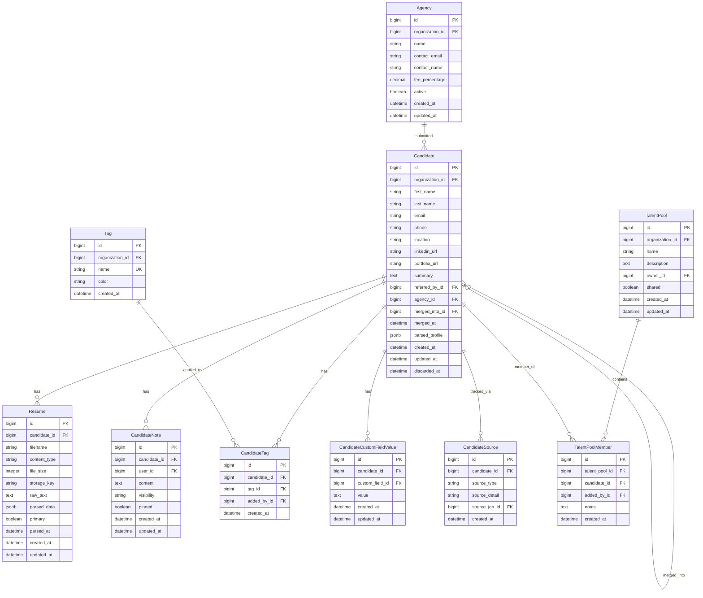

# Ledgoria - Data Model

## Overview

This document defines the data model organized by **subject areas** that map to bounded contexts in a domain-driven design. Each subject area represents a cohesive domain with clear boundaries, aggregates, and integration points.

---

## Subject Area Map


---

## Subject Area Summary

| ID | Subject Area | Bounded Context | Aggregate Roots | Description |
|----|--------------|-----------------|-----------------|-------------|
| SA-01 | Identity & Access | `iam` | User, Role | Authentication, authorization, permissions |
| SA-02 | Organization | `org` | Organization, Department | Multi-tenancy, org structure, settings |
| SA-03 | Job Requisition | `requisition` | Job | Job lifecycle, approvals, posting |
| SA-04 | Candidate | `candidate` | Candidate | Candidate profiles, resumes, talent pools |
| SA-05 | Application Pipeline | `pipeline` | Application | Applications, stages, workflow |
| SA-06 | Interview | `interview` | Interview | Scheduling, calendar, participants |
| SA-07 | Evaluation | `evaluation` | Scorecard | Feedback, competencies, decisions |
| SA-08 | Offer Management | `offer` | Offer | Offers, approvals, e-signature |
| SA-09 | Compliance & Audit | `compliance` | AuditLog, BackgroundCheck | EEOC, GDPR, screening, audit trail |
| SA-10 | Communication | `communication` | EmailLog | Templates, notifications, sequences |
| SA-11 | Integration | `integration` | IntegrationConfig | Job boards, HRIS, API, webhooks |
| SA-12 | Career Site | `career` | CareerSiteConfig | Public site, branding, application flow |

---

## Context Map

Shows relationships between bounded contexts:


### Context Relationships

| Upstream | Downstream | Pattern | Integration |
|----------|------------|---------|-------------|
| Identity & Access | All contexts | Conformist | Shared User/Org IDs |
| Organization | Job, Candidate | Shared Kernel | Org scoping |
| Job Requisition | Application | Partnership | Job reference |
| Candidate | Application | Partnership | Candidate reference |
| Application | Interview | Customer-Supplier | Application events |
| Application | Offer | Customer-Supplier | Application events |
| Interview | Evaluation | Customer-Supplier | Interview events |
| Application | Compliance | Published Language | Domain events |
| Application | Communication | Published Language | Domain events |

---

# SA-01: Identity & Access

## Context Overview

Handles authentication, authorization, user management, and access control. This is a **core subdomain** that all other contexts depend on.

## Aggregate: User


## Entities

### User (Aggregate Root)

| Field | Type | Constraints | Description |
|-------|------|-------------|-------------|
| id | bigint | PK | Unique identifier |
| organization_id | bigint | FK, NOT NULL | Owning organization |
| email | string | NOT NULL, UNIQUE(org) | Login email |
| encrypted_password | string | NULL | Hashed password (null if SSO-only) |
| first_name | string | NOT NULL | First name |
| last_name | string | NOT NULL | Last name |
| avatar_url | string | NULL | Profile image URL |
| active | boolean | NOT NULL, DEFAULT true | Account active flag |
| confirmed_at | datetime | NULL | Email confirmation time |
| last_sign_in_at | datetime | NULL | Last login timestamp |
| last_sign_in_ip | string | NULL | Last login IP |
| sign_in_count | integer | DEFAULT 0 | Total login count |
| password_changed_at | datetime | NULL | Last password change |
| locked_at | datetime | NULL | Account lock time |
| failed_attempts | integer | DEFAULT 0 | Failed login attempts |
| unlock_token | string | NULL | Account unlock token |

### Role

| Field | Type | Constraints | Description |
|-------|------|-------------|-------------|
| id | bigint | PK | Unique identifier |
| organization_id | bigint | FK, NOT NULL | Owning organization |
| name | string | NOT NULL, UNIQUE(org) | Role name |
| description | string | NULL | Role description |
| system_role | boolean | DEFAULT false | System-defined (not deletable) |
| permissions | jsonb | NOT NULL | Permission set |

**System Roles:**
- `admin` - Full system access
- `recruiter` - Full recruiting access
- `hiring_manager` - Job and candidate management for own jobs
- `interviewer` - Interview and feedback access
- `readonly` - View-only access

### Permission

| Field | Type | Constraints | Description |
|-------|------|-------------|-------------|
| id | bigint | PK | Unique identifier |
| resource | string | NOT NULL | Resource type (job, candidate, etc.) |
| action | string | NOT NULL | Action (create, read, update, delete) |
| description | string | NULL | Human-readable description |

**Permission Examples:**
- `job:create`, `job:read`, `job:update`, `job:delete`
- `candidate:read`, `candidate:update`
- `application:move_stage`, `application:reject`
- `offer:approve`
- `report:view_diversity`

---

# SA-02: Organization Management

## Context Overview

Manages multi-tenancy, organizational structure, and organization-wide settings. This is the **tenant boundary** for the entire system.

## Aggregate: Organization



## Entities

### Organization (Aggregate Root)

| Field | Type | Constraints | Description |
|-------|------|-------------|-------------|
| id | bigint | PK | Unique identifier |
| name | string | NOT NULL | Organization name |
| subdomain | string | UNIQUE, NOT NULL | URL subdomain |
| domain | string | NULL | Custom domain |
| logo_url | string | NULL | Logo image URL |
| timezone | string | DEFAULT 'UTC' | Default timezone |
| default_currency | string | DEFAULT 'USD' | Default currency |
| default_locale | string | DEFAULT 'en' | Default locale |
| settings | jsonb | NOT NULL | Organization settings |
| billing_email | string | NULL | Billing contact |
| plan | string | DEFAULT 'trial' | Subscription plan |
| trial_ends_at | datetime | NULL | Trial expiration |
| discarded_at | datetime | NULL | Soft delete timestamp |

**Settings JSON Structure:**
```json
{
  "require_job_approval": true,
  "require_offer_approval": true,
  "rejection_notification_delay_hours": 48,
  "eeoc_collection_enabled": true,
  "gdpr_mode": false,
  "background_check_provider": "ledgoria",
  "calendar_provider": "google"
}
```

### Department

| Field | Type | Constraints | Description |
|-------|------|-------------|-------------|
| id | bigint | PK | Unique identifier |
| organization_id | bigint | FK, NOT NULL | Owning organization |
| parent_id | bigint | FK, NULL | Parent department (hierarchy) |
| name | string | NOT NULL | Department name |
| code | string | NULL | Department code |
| position | integer | DEFAULT 0 | Sort order |
| default_hiring_manager_id | bigint | FK, NULL | Default HM for new jobs |

### Stage

| Field | Type | Constraints | Description |
|-------|------|-------------|-------------|
| id | bigint | PK | Unique identifier |
| organization_id | bigint | FK, NOT NULL | Owning organization |
| name | string | NOT NULL | Stage name |
| stage_type | enum | NOT NULL | applied, screening, interview, offer, hired, rejected |
| position | integer | NOT NULL | Sort order |
| is_terminal | boolean | DEFAULT false | End state flag |
| is_default | boolean | DEFAULT false | Include in new jobs |
| color | string | NULL | UI display color |

### RejectionReason

| Field | Type | Constraints | Description |
|-------|------|-------------|-------------|
| id | bigint | PK | Unique identifier |
| organization_id | bigint | FK, NOT NULL | Owning organization |
| name | string | NOT NULL | Reason display name |
| category | enum | NOT NULL | not_qualified, timing, compensation, culture_fit, withdrew, other |
| requires_notes | boolean | DEFAULT false | Force notes entry |
| active | boolean | DEFAULT true | Available for selection |
| position | integer | DEFAULT 0 | Sort order |

### Competency

| Field | Type | Constraints | Description |
|-------|------|-------------|-------------|
| id | bigint | PK | Unique identifier |
| organization_id | bigint | FK, NOT NULL | Owning organization |
| name | string | NOT NULL | Competency name |
| description | string | NULL | Detailed description |
| category | enum | NULL | technical, behavioral, cultural, role_specific |
| active | boolean | DEFAULT true | Available for use |

### CustomField

| Field | Type | Constraints | Description |
|-------|------|-------------|-------------|
| id | bigint | PK | Unique identifier |
| organization_id | bigint | FK, NOT NULL | Owning organization |
| entity_type | enum | NOT NULL | candidate, job, application |
| field_key | string | NOT NULL | Internal key |
| label | string | NOT NULL | Display label |
| field_type | enum | NOT NULL | text, number, date, select, multiselect, boolean |
| options | jsonb | NULL | Select options |
| required | boolean | DEFAULT false | Required field |
| position | integer | DEFAULT 0 | Sort order |
| active | boolean | DEFAULT true | Field enabled |

### LookupType

Reference data categories for configurable dropdown values. Supports i18n through LookupValue translations.

| Field | Type | Constraints | Description |
|-------|------|-------------|-------------|
| id | bigint | PK | Unique identifier |
| organization_id | bigint | FK, NOT NULL | Owning organization |
| code | string | UNIQUE per org, NOT NULL | Internal key (e.g., employment_type, location_type) |
| name | string | NOT NULL | Admin display name |
| description | string | NULL | Help text for admins |
| system_managed | boolean | DEFAULT false | If true, values cannot be deleted |
| active | boolean | DEFAULT true | Type enabled |

**Standard Lookup Types:**
- `employment_type` - Full-time, Part-time, Contract, etc.
- `location_type` - Remote, Onsite, Hybrid
- `application_source` - Career site, Job board, Referral, etc.
- `note_visibility` - Private, Team, Hiring team
- `rejection_category` - Not qualified, Timing, Compensation, etc.

### LookupValue

Individual values within a lookup type, with multi-locale translations stored in JSON.

| Field | Type | Constraints | Description |
|-------|------|-------------|-------------|
| id | bigint | PK | Unique identifier |
| lookup_type_id | bigint | FK, NOT NULL | Parent lookup type |
| code | string | UNIQUE per type, NOT NULL | Internal key (e.g., full_time) |
| translations | jsonb | NOT NULL | Locale-keyed display names |
| metadata | jsonb | NULL | Additional data (e.g., icon, color) |
| position | integer | DEFAULT 0 | Sort order |
| active | boolean | DEFAULT true | Value enabled |
| is_default | boolean | DEFAULT false | Default selection |

**Translations JSON Structure:**
```json
{
  "en": { "name": "Full-time", "description": "Regular full-time employment" },
  "es": { "name": "Tiempo completo", "description": "Empleo regular a tiempo completo" },
  "fr": { "name": "Temps plein", "description": "Emploi régulier à temps plein" }
}
```

**Metadata JSON Structure (optional):**
```json
{
  "icon": "bi-briefcase",
  "color": "#3B82F6",
  "requires_location": true
}
```

**Locale Fallback:** When a translation is missing for the requested locale, the system falls back to the organization's `default_locale`, then to `en`.

---

# SA-03: Job Requisition

## Context Overview

Manages the job requisition lifecycle from creation through posting to closure. This is a **core domain** that drives the recruiting process.

## Aggregate: Job


## Entities

### Job (Aggregate Root)

| Field | Type | Constraints | Description |
|-------|------|-------------|-------------|
| id | bigint | PK | Unique identifier |
| organization_id | bigint | FK, NOT NULL | Owning organization |
| department_id | bigint | FK, NULL | Department |
| hiring_manager_id | bigint | FK, NULL | Hiring manager user |
| recruiter_id | bigint | FK, NULL | Assigned recruiter |
| title | string | NOT NULL | Job title |
| description | text | NULL | Public job description |
| requirements | text | NULL | Job requirements |
| internal_notes | text | NULL | Internal-only notes |
| location | string | NULL | Job location |
| location_type | enum | NOT NULL | onsite, remote, hybrid |
| employment_type | enum | NOT NULL | full_time, part_time, contract, intern |
| salary_min | integer | NULL | Minimum salary (cents) |
| salary_max | integer | NULL | Maximum salary (cents) |
| salary_currency | string | DEFAULT 'USD' | Salary currency |
| salary_visible | boolean | DEFAULT false | Show salary on career site |
| status | enum | NOT NULL | draft, pending_approval, open, on_hold, closed |
| opened_at | datetime | NULL | When job opened |
| closed_at | datetime | NULL | When job closed |
| close_reason | enum | NULL | filled, cancelled, on_hold |
| headcount | integer | DEFAULT 1 | Positions to fill |
| filled_count | integer | DEFAULT 0 | Positions filled |
| remote_id | string | NULL | External system reference |
| discarded_at | datetime | NULL | Soft delete |

**Status State Machine:**
```
draft → pending_approval → open ⇄ on_hold → closed
                            ↓
                          closed
```

### JobApproval

| Field | Type | Constraints | Description |
|-------|------|-------------|-------------|
| id | bigint | PK | Unique identifier |
| job_id | bigint | FK, NOT NULL | Parent job |
| approver_id | bigint | FK, NOT NULL | Approving user |
| status | enum | NOT NULL | pending, approved, rejected |
| notes | text | NULL | Approval notes |
| sequence | integer | DEFAULT 0 | Approval order |
| decided_at | datetime | NULL | Decision timestamp |

### JobStage

| Field | Type | Constraints | Description |
|-------|------|-------------|-------------|
| id | bigint | PK | Unique identifier |
| job_id | bigint | FK, NOT NULL | Parent job |
| stage_id | bigint | FK, NOT NULL | Stage reference |
| position | integer | NOT NULL | Order in pipeline |
| required_interview | boolean | DEFAULT false | Require interview at stage |
| scorecard_template_id | bigint | FK, NULL | Scorecard template for stage |

### JobBoardPosting

| Field | Type | Constraints | Description |
|-------|------|-------------|-------------|
| id | bigint | PK | Unique identifier |
| job_id | bigint | FK, NOT NULL | Parent job |
| board_name | string | NOT NULL | Job board identifier |
| external_id | string | NULL | ID from job board |
| external_url | string | NULL | URL on job board |
| status | enum | NOT NULL | pending, active, expired, removed, error |
| posted_at | datetime | NULL | Posted timestamp |
| expires_at | datetime | NULL | Expiration date |
| removed_at | datetime | NULL | Removal timestamp |
| metadata | jsonb | NULL | Board-specific data |

---

# SA-04: Candidate

## Context Overview

Manages candidate profiles, resumes, and talent pools. Candidates exist independently of specific job applications and can apply to multiple jobs.

## Aggregate: Candidate



## Entities

### Candidate (Aggregate Root)

| Field | Type | Constraints | Description |
|-------|------|-------------|-------------|
| id | bigint | PK | Unique identifier |
| organization_id | bigint | FK, NOT NULL | Owning organization |
| first_name | string | NOT NULL | First name |
| last_name | string | NOT NULL | Last name |
| email | string | NOT NULL, ENCRYPTED | Email address |
| phone | string | NULL, ENCRYPTED | Phone number |
| location | string | NULL | Current location |
| linkedin_url | string | NULL | LinkedIn profile URL |
| portfolio_url | string | NULL | Portfolio/website |
| summary | text | NULL | Professional summary |
| referred_by_id | bigint | FK, NULL | Referring employee |
| agency_id | bigint | FK, NULL | Submitting agency |
| merged_into_id | bigint | FK, NULL | Merged into candidate |
| merged_at | datetime | NULL | Merge timestamp |
| parsed_profile | jsonb | NULL | Aggregated parsed data |
| discarded_at | datetime | NULL | Soft delete |

**Unique Constraint:** `(organization_id, email)` for duplicate detection

### Resume

| Field | Type | Constraints | Description |
|-------|------|-------------|-------------|
| id | bigint | PK | Unique identifier |
| candidate_id | bigint | FK, NOT NULL | Parent candidate |
| filename | string | NOT NULL | Original filename |
| content_type | string | NOT NULL | MIME type |
| file_size | integer | NOT NULL | Size in bytes |
| storage_key | string | NOT NULL | Cloud storage key |
| raw_text | text | NULL | Extracted text |
| parsed_data | jsonb | NULL | Structured parsed data |
| primary | boolean | DEFAULT false | Primary resume flag |
| parsed_at | datetime | NULL | Parse completion time |

**Parsed Data Structure:**
```json
{
  "contact": { "email": "", "phone": "", "location": "" },
  "experience": [
    { "company": "", "title": "", "start": "", "end": "", "description": "" }
  ],
  "education": [
    { "institution": "", "degree": "", "field": "", "year": "" }
  ],
  "skills": ["skill1", "skill2"],
  "certifications": [],
  "languages": []
}
```

### CandidateNote

| Field | Type | Constraints | Description |
|-------|------|-------------|-------------|
| id | bigint | PK | Unique identifier |
| candidate_id | bigint | FK, NOT NULL | Parent candidate |
| user_id | bigint | FK, NOT NULL | Note author |
| content | text | NOT NULL | Note content |
| visibility | enum | DEFAULT 'team' | private, team, all |
| pinned | boolean | DEFAULT false | Pinned to top |

### TalentPool

| Field | Type | Constraints | Description |
|-------|------|-------------|-------------|
| id | bigint | PK | Unique identifier |
| organization_id | bigint | FK, NOT NULL | Owning organization |
| name | string | NOT NULL | Pool name |
| description | text | NULL | Pool description |
| owner_id | bigint | FK, NOT NULL | Pool owner |
| shared | boolean | DEFAULT true | Visible to team |

### Agency

| Field | Type | Constraints | Description |
|-------|------|-------------|-------------|
| id | bigint | PK | Unique identifier |
| organization_id | bigint | FK, NOT NULL | Owning organization |
| name | string | NOT NULL | Agency name |
| contact_email | string | NULL | Primary contact email |
| contact_name | string | NULL | Primary contact name |
| fee_percentage | decimal | NULL | Placement fee % |
| active | boolean | DEFAULT true | Active relationship |

---

# SA-05: Application Pipeline

## Context Overview

Manages the application workflow from submission through hire/rejection. This is the **core domain** that ties jobs and candidates together.

## Aggregate: Application


## Entities

### Application (Aggregate Root)

| Field | Type | Constraints | Description |
|-------|------|-------------|-------------|
| id | bigint | PK | Unique identifier |
| organization_id | bigint | FK, NOT NULL | Owning organization |
| job_id | bigint | FK, NOT NULL | Applied job |
| candidate_id | bigint | FK, NOT NULL | Applying candidate |
| current_stage_id | bigint | FK, NOT NULL | Current pipeline stage |
| status | enum | NOT NULL | active, hired, rejected, withdrawn |
| rejection_reason_id | bigint | FK, NULL | Rejection reason |
| rejection_notes | text | NULL | Internal rejection notes |
| source_type | enum | NOT NULL | direct_apply, recruiter, referral, agency, job_board |
| source_detail | string | NULL | Specific source (e.g., "Indeed") |
| applied_at | datetime | NOT NULL | Application timestamp |
| hired_at | datetime | NULL | Hire timestamp |
| rejected_at | datetime | NULL | Rejection timestamp |
| withdrawn_at | datetime | NULL | Withdrawal timestamp |
| rating | integer | NULL | 1-5 recruiter rating |
| starred | boolean | DEFAULT false | Starred/favorited |
| last_activity_at | datetime | NOT NULL | Last action timestamp |
| discarded_at | datetime | NULL | Soft delete |

**Unique Constraint:** `(job_id, candidate_id)` prevents duplicate applications

**Status State Machine:**
```
active → hired
active → rejected
active → withdrawn
```

### StageTransition

| Field | Type | Constraints | Description |
|-------|------|-------------|-------------|
| id | bigint | PK | Unique identifier |
| application_id | bigint | FK, NOT NULL | Parent application |
| from_stage_id | bigint | FK, NULL | Previous stage (null for initial) |
| to_stage_id | bigint | FK, NOT NULL | New stage |
| moved_by_id | bigint | FK, NULL | User who moved (null for system) |
| notes | text | NULL | Transition notes |
| duration_hours | integer | NULL | Hours in previous stage |
| created_at | datetime | NOT NULL | Transition timestamp |

**Immutable:** Stage transitions are never updated or deleted.

---

# SA-06: Interview

## Context Overview

Manages interview scheduling, calendar integration, and participant coordination.

## Aggregate: Interview


## Entities

### Interview (Aggregate Root)

| Field | Type | Constraints | Description |
|-------|------|-------------|-------------|
| id | bigint | PK | Unique identifier |
| application_id | bigint | FK, NOT NULL | Parent application |
| interview_template_id | bigint | FK, NULL | Template used |
| interview_type | enum | NOT NULL | phone_screen, video, onsite, panel, take_home |
| title | string | NOT NULL | Interview title |
| instructions | text | NULL | Interview instructions |
| scheduled_at | datetime | NULL | Scheduled time |
| duration_minutes | integer | NOT NULL | Duration |
| location | string | NULL | Physical location |
| video_link | string | NULL | Video conference URL |
| status | enum | NOT NULL | draft, scheduled, confirmed, completed, cancelled, no_show |
| confirmed_at | datetime | NULL | Confirmation timestamp |
| completed_at | datetime | NULL | Completion timestamp |
| cancelled_at | datetime | NULL | Cancellation timestamp |
| cancellation_reason | text | NULL | Why cancelled |
| created_by_id | bigint | FK, NOT NULL | Creator |

### InterviewParticipant

| Field | Type | Constraints | Description |
|-------|------|-------------|-------------|
| id | bigint | PK | Unique identifier |
| interview_id | bigint | FK, NOT NULL | Parent interview |
| user_id | bigint | FK, NOT NULL | Interviewer |
| role | enum | NOT NULL | interviewer, organizer, shadow |
| response | enum | DEFAULT 'pending' | pending, accepted, declined, tentative |
| calendar_event_id | string | NULL | External calendar ID |
| responded_at | datetime | NULL | Response timestamp |
| feedback_submitted | boolean | DEFAULT false | Scorecard submitted |

### InterviewTemplate

| Field | Type | Constraints | Description |
|-------|------|-------------|-------------|
| id | bigint | PK | Unique identifier |
| organization_id | bigint | FK, NOT NULL | Owning organization |
| name | string | NOT NULL | Template name |
| interview_type | enum | NOT NULL | Interview type |
| default_duration | integer | DEFAULT 60 | Default minutes |
| instructions | text | NULL | Default instructions |
| question_ids | jsonb | NULL | Question references |
| scorecard_template_id | bigint | FK, NULL | Linked scorecard |
| active | boolean | DEFAULT true | Available for use |

---

# SA-07: Evaluation

## Context Overview

Manages interview feedback, scorecards, and hiring decisions.

## Aggregate: Scorecard


## Entities

### Scorecard (Aggregate Root)

| Field | Type | Constraints | Description |
|-------|------|-------------|-------------|
| id | bigint | PK | Unique identifier |
| interview_id | bigint | FK, NOT NULL | Parent interview |
| user_id | bigint | FK, NOT NULL | Submitting interviewer |
| scorecard_template_id | bigint | FK, NULL | Template used |
| overall_rating | enum | NULL | strong_no, no, neutral, yes, strong_yes |
| recommendation | text | NULL | Written recommendation |
| strengths | text | NULL | Candidate strengths |
| concerns | text | NULL | Concerns noted |
| hire_recommendation | boolean | NULL | Explicit hire yes/no |
| submitted_at | datetime | NULL | Submission timestamp |

### ScorecardAttribute

| Field | Type | Constraints | Description |
|-------|------|-------------|-------------|
| id | bigint | PK | Unique identifier |
| scorecard_id | bigint | FK, NOT NULL | Parent scorecard |
| competency_id | bigint | FK, NOT NULL | Evaluated competency |
| rating | integer | NOT NULL | 1-5 rating |
| notes | text | NULL | Attribute notes |

### HiringDecision

| Field | Type | Constraints | Description |
|-------|------|-------------|-------------|
| id | bigint | PK | Unique identifier |
| application_id | bigint | FK, NOT NULL | Application |
| decided_by_id | bigint | FK, NOT NULL | Decision maker |
| decision | enum | NOT NULL | hire, reject, hold |
| justification | text | NOT NULL | Decision rationale |
| decided_at | datetime | NOT NULL | Decision timestamp |

**Immutable:** Decisions are never updated, only new ones added.

---

# SA-08: Offer Management

## Context Overview

Manages offer creation, approval workflows, and e-signature integration.

## Aggregate: Offer


## Entities

### Offer (Aggregate Root)

| Field | Type | Constraints | Description |
|-------|------|-------------|-------------|
| id | bigint | PK | Unique identifier |
| application_id | bigint | FK, NOT NULL | Parent application |
| created_by_id | bigint | FK, NOT NULL | Creator |
| offer_template_id | bigint | FK, NULL | Source template |
| status | enum | NOT NULL | draft, pending_approval, approved, sent, viewed, accepted, declined, withdrawn, expired |
| title | string | NOT NULL | Position title |
| salary | integer | NOT NULL, ENCRYPTED | Base salary (cents) |
| salary_currency | string | DEFAULT 'USD' | Currency |
| salary_period | enum | NOT NULL | hourly, annual |
| bonus | integer | NULL, ENCRYPTED | Sign-on bonus (cents) |
| equity | string | NULL, ENCRYPTED | Equity details |
| start_date | date | NULL | Proposed start date |
| expiration_date | date | NULL | Offer expiration |
| notes | text | NULL | Internal notes |
| custom_fields | jsonb | NULL | Additional fields |
| sent_at | datetime | NULL | When sent to candidate |
| viewed_at | datetime | NULL | When candidate viewed |
| responded_at | datetime | NULL | Candidate response time |
| accepted_at | datetime | NULL | Acceptance time |
| declined_at | datetime | NULL | Decline time |
| decline_reason | text | NULL | Why declined |
| withdrawn_at | datetime | NULL | Withdrawal time |
| withdrawal_reason | text | NULL | Why withdrawn |

**Status State Machine:**
```
draft → pending_approval → approved → sent → viewed → accepted
                                         ↓         ↓
                                      expired   declined
                           ↓
                        withdrawn (from any state except accepted)
```

### OfferApproval

| Field | Type | Constraints | Description |
|-------|------|-------------|-------------|
| id | bigint | PK | Unique identifier |
| offer_id | bigint | FK, NOT NULL | Parent offer |
| approver_id | bigint | FK, NOT NULL | Approver |
| status | enum | NOT NULL | pending, approved, rejected |
| notes | text | NULL | Approval notes |
| sequence | integer | DEFAULT 0 | Approval order |
| decided_at | datetime | NULL | Decision time |

### OfferDocument

| Field | Type | Constraints | Description |
|-------|------|-------------|-------------|
| id | bigint | PK | Unique identifier |
| offer_id | bigint | FK, NOT NULL | Parent offer |
| document_type | enum | NOT NULL | offer_letter, employment_agreement, nda, other |
| filename | string | NOT NULL | Document filename |
| storage_key | string | NOT NULL | Cloud storage key |
| status | enum | NOT NULL | draft, pending_signature, signed, void |
| signed_by_id | bigint | FK, NULL | Signer (user or candidate reference) |
| signature_request_id | string | NULL | External e-sign ID |
| sent_at | datetime | NULL | Sent for signature |
| signed_at | datetime | NULL | Signature timestamp |

---

# SA-09: Compliance & Audit

## Context Overview

Manages regulatory compliance (EEOC, GDPR), background checks, adverse actions, and comprehensive audit logging.

## Aggregate: AuditLog


## Entities

### AuditLog (Aggregate Root)

| Field | Type | Constraints | Description |
|-------|------|-------------|-------------|
| id | bigint | PK | Unique identifier |
| organization_id | bigint | FK, NOT NULL | Organization scope |
| user_id | bigint | FK, NULL | Acting user (null for system) |
| action | string | NOT NULL | Action identifier |
| auditable_type | string | NOT NULL | Entity type |
| auditable_id | bigint | NOT NULL | Entity ID |
| metadata | jsonb | NOT NULL | Action context |
| changes | jsonb | NULL | Before/after values |
| ip_address | string | NULL | Client IP |
| user_agent | string | NULL | Client user agent |
| request_id | string | NULL | Request correlation ID |
| created_at | datetime | NOT NULL | Event timestamp |

**Immutable:** Audit logs are never updated or deleted.

**Action Examples:**
- `job.created`, `job.approved`, `job.closed`
- `application.created`, `application.stage_changed`, `application.rejected`
- `offer.sent`, `offer.accepted`
- `user.login`, `user.password_changed`

### EeocResponse

| Field | Type | Constraints | Description |
|-------|------|-------------|-------------|
| id | bigint | PK | Unique identifier |
| candidate_id | bigint | FK, NOT NULL | Candidate |
| application_id | bigint | FK, NULL | Specific application |
| gender_encrypted | string | ENCRYPTED | Gender response |
| ethnicity_encrypted | string | ENCRYPTED | Ethnicity response |
| veteran_status_encrypted | string | ENCRYPTED | Veteran status |
| disability_status_encrypted | string | ENCRYPTED | Disability status |
| collected_at | datetime | NOT NULL | Collection timestamp |
| collection_method | enum | NOT NULL | career_site, recruiter_entry |

**Access Control:** Only compliance roles can decrypt individual records. Reports use aggregate queries only.

### Consent

| Field | Type | Constraints | Description |
|-------|------|-------------|-------------|
| id | bigint | PK | Unique identifier |
| candidate_id | bigint | FK, NOT NULL | Candidate |
| consent_type | enum | NOT NULL | data_processing, marketing, background_check |
| granted | boolean | NOT NULL | Consent given |
| ip_address | string | NULL | Consent IP |
| user_agent | string | NULL | Consent user agent |
| consent_text | text | NOT NULL | Text presented |
| granted_at | datetime | NULL | Grant timestamp |
| revoked_at | datetime | NULL | Revocation timestamp |

### BackgroundCheck

| Field | Type | Constraints | Description |
|-------|------|-------------|-------------|
| id | bigint | PK | Unique identifier |
| application_id | bigint | FK, NOT NULL | Application |
| candidate_id | bigint | FK, NOT NULL | Candidate |
| provider | string | NOT NULL | ledgoria, checkr, sterling |
| external_id | string | NULL | Provider's ID |
| package | string | NOT NULL | Check package name |
| status | enum | NOT NULL | pending, in_progress, completed, cancelled, error |
| results | jsonb | NULL | Check results |
| initiated_at | datetime | NOT NULL | Start time |
| completed_at | datetime | NULL | Completion time |
| initiated_by_id | bigint | FK, NOT NULL | Initiator |

### AdverseAction

| Field | Type | Constraints | Description |
|-------|------|-------------|-------------|
| id | bigint | PK | Unique identifier |
| background_check_id | bigint | FK, NOT NULL | Related check |
| status | enum | NOT NULL | pending, pre_adverse_sent, waiting_period, final_sent, cancelled |
| reason | text | NOT NULL | Adverse action reason |
| pre_adverse_sent_at | datetime | NULL | Pre-adverse notice sent |
| pre_adverse_deadline | datetime | NULL | Response deadline |
| final_adverse_sent_at | datetime | NULL | Final notice sent |
| candidate_response | text | NULL | Candidate response |
| candidate_responded_at | datetime | NULL | Response time |
| initiated_by_id | bigint | FK, NOT NULL | Initiator |

---

# SA-10: Communication

## Context Overview

Manages email templates, notifications, SMS, and communication tracking.

## Aggregate: EmailLog

```mermaid
erDiagram
    EmailTemplate }o--|| Organization : for_org
    EmailLog }o--|| Organization : for_org
    EmailLog }o--o| EmailTemplate : from_template
    EmailSequence ||--o{ EmailSequenceStep : has
    EmailSequenceEnrollment }o--|| EmailSequence : in_sequence
    EmailSequenceEnrollment }o--|| Candidate : for_candidate
    Notification }o--|| User : for_user
    SmsLog }o--|| Candidate : to_candidate

    EmailTemplate {
        bigint id PK
        bigint organization_id FK
        string name
        string subject
        text body
        string template_type
        jsonb variables
        boolean active
        datetime created_at
        datetime updated_at
    }

    EmailLog {
        bigint id PK
        bigint organization_id FK
        bigint email_template_id FK
        string recipient_type
        bigint recipient_id
        string recipient_email
        string subject
        text body
        string status
        datetime queued_at
        datetime sent_at
        datetime delivered_at
        datetime opened_at
        datetime clicked_at
        datetime bounced_at
        datetime unsubscribed_at
        string message_id
        jsonb metadata
        datetime created_at
        datetime updated_at
    }

    EmailSequence {
        bigint id PK
        bigint organization_id FK
        string name
        string trigger_event
        boolean active
        datetime created_at
        datetime updated_at
    }

    EmailSequenceStep {
        bigint id PK
        bigint email_sequence_id FK
        bigint email_template_id FK
        integer delay_days
        integer delay_hours
        integer position
        datetime created_at
        datetime updated_at
    }

    EmailSequenceEnrollment {
        bigint id PK
        bigint email_sequence_id FK
        bigint candidate_id FK
        bigint application_id FK
        string status
        integer current_step
        datetime enrolled_at
        datetime completed_at
        datetime unsubscribed_at
        datetime created_at
        datetime updated_at
    }

    Notification {
        bigint id PK
        bigint user_id FK
        string notification_type
        string title
        text body
        string link
        boolean read
        datetime read_at
        datetime created_at
    }

    SmsLog {
        bigint id PK
        bigint organization_id FK
        bigint candidate_id FK
        string phone_number
        text message
        string status
        string external_id
        datetime sent_at
        datetime delivered_at
        datetime failed_at
        string failure_reason
        datetime created_at
    }
```



## Entities

### EmailTemplate

| Field | Type | Constraints | Description |
|-------|------|-------------|-------------|
| id | bigint | PK | Unique identifier |
| organization_id | bigint | FK, NOT NULL | Organization |
| name | string | NOT NULL | Template name |
| subject | string | NOT NULL | Email subject |
| body | text | NOT NULL | Email body (Liquid/ERB) |
| template_type | enum | NOT NULL | application_received, interview_scheduled, offer_sent, rejection, custom |
| variables | jsonb | NULL | Available variables |
| active | boolean | DEFAULT true | Available for use |

### EmailLog (Aggregate Root)

| Field | Type | Constraints | Description |
|-------|------|-------------|-------------|
| id | bigint | PK | Unique identifier |
| organization_id | bigint | FK, NOT NULL | Organization |
| email_template_id | bigint | FK, NULL | Source template |
| recipient_type | string | NOT NULL | Candidate, User |
| recipient_id | bigint | NOT NULL | Recipient ID |
| recipient_email | string | NOT NULL | Actual email |
| subject | string | NOT NULL | Rendered subject |
| body | text | NOT NULL | Rendered body |
| status | enum | NOT NULL | queued, sent, delivered, opened, clicked, bounced, failed |
| queued_at | datetime | NULL | Queue time |
| sent_at | datetime | NULL | Send time |
| delivered_at | datetime | NULL | Delivery confirmation |
| opened_at | datetime | NULL | First open |
| clicked_at | datetime | NULL | First click |
| bounced_at | datetime | NULL | Bounce time |
| unsubscribed_at | datetime | NULL | Unsubscribe time |
| message_id | string | NULL | ESP message ID |
| metadata | jsonb | NULL | Additional data |

### Notification

| Field | Type | Constraints | Description |
|-------|------|-------------|-------------|
| id | bigint | PK | Unique identifier |
| user_id | bigint | FK, NOT NULL | Recipient user |
| notification_type | string | NOT NULL | Type identifier |
| title | string | NOT NULL | Notification title |
| body | text | NULL | Notification body |
| link | string | NULL | Action URL |
| read | boolean | DEFAULT false | Read status |
| read_at | datetime | NULL | Read timestamp |

---

# SA-11: Integration

## Context Overview

Manages external system integrations including job boards, HRIS, calendar, and API access.

## Aggregate: IntegrationConfig


## Entities

### IntegrationConfig (Aggregate Root)

| Field | Type | Constraints | Description |
|-------|------|-------------|-------------|
| id | bigint | PK | Unique identifier |
| organization_id | bigint | FK, NOT NULL | Organization |
| integration_type | enum | NOT NULL | job_board, hris, calendar, background_check, sso |
| provider | string | NOT NULL | indeed, linkedin, workday, google, etc. |
| credentials_encrypted | jsonb | ENCRYPTED | API credentials |
| settings | jsonb | NULL | Provider settings |
| enabled | boolean | DEFAULT true | Active flag |
| last_sync_at | datetime | NULL | Last sync |
| sync_status | enum | NULL | success, error, pending |

### IntegrationLog

| Field | Type | Constraints | Description |
|-------|------|-------------|-------------|
| id | bigint | PK | Unique identifier |
| integration_config_id | bigint | FK, NOT NULL | Parent config |
| action | string | NOT NULL | Action performed |
| status | enum | NOT NULL | success, error |
| direction | enum | NOT NULL | inbound, outbound |
| request_data | jsonb | NULL | Request payload |
| response_data | jsonb | NULL | Response payload |
| error_message | string | NULL | Error details |
| duration_ms | integer | NULL | Request duration |

### Webhook

| Field | Type | Constraints | Description |
|-------|------|-------------|-------------|
| id | bigint | PK | Unique identifier |
| organization_id | bigint | FK, NOT NULL | Organization |
| name | string | NOT NULL | Webhook name |
| url | string | NOT NULL | Destination URL |
| secret | string | NOT NULL | Signing secret |
| events | jsonb | NOT NULL | Subscribed events |
| enabled | boolean | DEFAULT true | Active flag |

### WebhookDelivery

| Field | Type | Constraints | Description |
|-------|------|-------------|-------------|
| id | bigint | PK | Unique identifier |
| webhook_id | bigint | FK, NOT NULL | Parent webhook |
| event_type | string | NOT NULL | Event name |
| payload | jsonb | NOT NULL | Event payload |
| response_code | integer | NULL | HTTP response code |
| response_body | text | NULL | Response body |
| attempts | integer | DEFAULT 0 | Delivery attempts |
| last_attempt_at | datetime | NULL | Last attempt |
| delivered_at | datetime | NULL | Success timestamp |

---

# SA-12: Career Site

## Context Overview

Manages the public-facing career site, branding, and candidate application experience.

## Aggregate: CareerSiteConfig


## Entities

### CareerSiteConfig (Aggregate Root)

| Field | Type | Constraints | Description |
|-------|------|-------------|-------------|
| id | bigint | PK | Unique identifier |
| organization_id | bigint | FK, NOT NULL | Organization |
| site_title | string | NOT NULL | Site title |
| site_description | text | NULL | SEO description |
| primary_color | string | DEFAULT '#000000' | Primary brand color |
| secondary_color | string | DEFAULT '#ffffff' | Secondary color |
| logo_url | string | NULL | Logo image |
| favicon_url | string | NULL | Favicon |
| custom_css | text | NULL | Custom styles |
| custom_js | text | NULL | Custom scripts |
| social_links | jsonb | NULL | Social media links |
| seo_settings | jsonb | NULL | SEO configuration |
| enabled | boolean | DEFAULT true | Site active |

### CareerSitePage

| Field | Type | Constraints | Description |
|-------|------|-------------|-------------|
| id | bigint | PK | Unique identifier |
| career_site_config_id | bigint | FK, NOT NULL | Parent config |
| page_type | enum | NOT NULL | home, about, benefits, custom |
| title | string | NOT NULL | Page title |
| slug | string | NOT NULL | URL slug |
| content | text | NOT NULL | Page content |
| position | integer | DEFAULT 0 | Navigation order |
| published | boolean | DEFAULT false | Published flag |

### ApplicationQuestion

| Field | Type | Constraints | Description |
|-------|------|-------------|-------------|
| id | bigint | PK | Unique identifier |
| job_id | bigint | FK, NOT NULL | Parent job |
| question_type | enum | NOT NULL | text, textarea, select, multiselect, boolean, file |
| label | string | NOT NULL | Question label |
| description | text | NULL | Help text |
| options | jsonb | NULL | Select options |
| required | boolean | DEFAULT false | Required flag |
| position | integer | DEFAULT 0 | Question order |

---

# Cross-Context Integration Points

## Domain Events

Events published by each context for consumption by others:

| Context | Event | Consumers | Description |
|---------|-------|-----------|-------------|
| Job | `job.opened` | Integration, Career Site | Job ready for applications |
| Job | `job.closed` | Integration, Communication | Job no longer accepting |
| Application | `application.created` | Communication, Compliance | New application received |
| Application | `application.stage_changed` | Communication | Pipeline movement |
| Application | `application.rejected` | Communication, Compliance | Candidate rejected |
| Application | `application.hired` | Communication, Integration, Compliance | Candidate hired |
| Interview | `interview.scheduled` | Communication | Interview booked |
| Interview | `interview.completed` | Evaluation | Interview done |
| Offer | `offer.sent` | Communication | Offer delivered |
| Offer | `offer.accepted` | Application, Integration | Offer accepted |
| BackgroundCheck | `check.completed` | Application, Compliance | Results received |

## Shared Kernel

Common entities referenced across contexts:

| Entity | Owning Context | Consuming Contexts |
|--------|----------------|-------------------|
| Organization | Organization | All |
| User | Identity & Access | All |
| Stage | Organization | Application, Job |
| Competency | Organization | Evaluation, Interview |
| RejectionReason | Organization | Application |

---

# Implementation Notes

## Multi-tenancy Strategy

- All tables include `organization_id`
- Application-level enforcement via `Current.organization`
- Database indexes include `organization_id` prefix
- Consider row-level security for additional protection

## Encryption Strategy

Use Rails 7+ `encrypts` for:
- Candidate PII: email, phone
- Financial: salary, bonus, equity
- Compliance: EEOC responses
- Integration: API credentials

## Soft Deletes

Use `discarded_at` for:
- Organization
- Job
- Candidate
- Application

## Immutable Records

Never update:
- AuditLog
- StageTransition
- HiringDecision
- Consent

## Service Extraction Path

When extracting services, each subject area maps to a bounded context:

1. **Phase 1 (Monolith):** All contexts in single Rails app
2. **Phase 2 (Modular Monolith):** Separate engines/namespaces
3. **Phase 3 (Services):** Extract high-value contexts
   - Communication → Email service
   - Integration → Integration gateway
   - Compliance → Audit service

Recommended extraction order:
1. Communication (high volume, independent)
2. Integration (external dependencies)
3. Compliance (regulatory requirements)
