# Ledgoria - Process Model

## Overview

This document defines the **James Martin Information Engineering (IE) Functional Decomposition** for Ledgoria. It organizes all business functionality into a three-level hierarchy:

1. **Business Functions (BF)** - Major business areas
2. **Business Processes (BP)** - Cohesive groups of activities within a function
3. **Elementary Business Processes (EBP)** - Atomic, "leave-able" business transactions

Each Elementary Business Process maps to one or more use cases and defines the minimum unit of work that leaves the business in a consistent state.

---

## Naming Conventions

| Artifact | Format | Example |
|----------|--------|---------|
| Business Function | BF-XX | BF-01: Talent Acquisition |
| Business Process | BP-XXX | BP-101: Requisition Management |
| Elementary Business Process | EP-XXXX | EP-0101: Create Requisition |
| Use Case | UC-XXX | UC-001 (existing) |

---

## Process Hierarchy Overview

```mermaid
graph TB
    subgraph "Ledgoria ATS"
        BF01[BF-01<br>Talent Acquisition]
        BF02[BF-02<br>Candidate Evaluation]
        BF03[BF-03<br>Offer & Onboarding]
        BF04[BF-04<br>Compliance Management]
        BF05[BF-05<br>Communication Management]
        BF06[BF-06<br>System Administration]
        BF07[BF-07<br>Analytics & Reporting]
    end

    BF01 --> BP101[BP-101: Requisition Mgmt]
    BF01 --> BP102[BP-102: Candidate Sourcing]
    BF01 --> BP103[BP-103: Application Processing]
    BF01 --> BP104[BP-104: Pipeline Management]

    BF02 --> BP201[BP-201: Interview Coordination]
    BF02 --> BP202[BP-202: Feedback Collection]
    BF02 --> BP203[BP-203: Hiring Decision]

    BF03 --> BP301[BP-301: Offer Creation]
    BF03 --> BP302[BP-302: Offer Approval]
    BF03 --> BP303[BP-303: Offer Delivery]
    BF03 --> BP304[BP-304: Hire Finalization]

    BF04 --> BP401[BP-401: EEOC Compliance]
    BF04 --> BP402[BP-402: GDPR/Privacy]
    BF04 --> BP403[BP-403: Background Verification]
    BF04 --> BP404[BP-404: Audit Management]

    BF05 --> BP501[BP-501: Candidate Comms]
    BF05 --> BP502[BP-502: Internal Notifications]
    BF05 --> BP503[BP-503: Email Automation]

    BF06 --> BP601[BP-601: User Administration]
    BF06 --> BP602[BP-602: Org Configuration]
    BF06 --> BP603[BP-603: Integration Mgmt]
    BF06 --> BP604[BP-604: Career Site Mgmt]

    BF07 --> BP701[BP-701: Operational Reporting]
    BF07 --> BP702[BP-702: Compliance Reporting]
    BF07 --> BP703[BP-703: Executive Dashboards]
```

---

## Business Function Summary

| ID | Business Function | Description | Business Processes | EBPs |
|----|-------------------|-------------|-------------------|------|
| BF-01 | Talent Acquisition | Job creation, sourcing, and pipeline management | 4 | 34 |
| BF-02 | Candidate Evaluation | Interviews, feedback, and hiring decisions | 3 | 20 |
| BF-03 | Offer & Onboarding | Offer workflow and hire completion | 4 | 12 |
| BF-04 | Compliance Management | EEOC, GDPR, background checks, audits | 4 | 12 |
| BF-05 | Communication Management | All candidate and internal communications | 3 | 9 |
| BF-06 | System Administration | Users, configuration, integrations | 4 | 32 |
| BF-07 | Analytics & Reporting | Reports and dashboards | 3 | 11 |
| **Total** | | | **25** | **130** |

---

# BF-01: Talent Acquisition

## Overview

The Talent Acquisition function encompasses all activities related to identifying hiring needs, creating job requisitions, sourcing candidates, and managing the application pipeline.

## Business Processes

### BP-101: Requisition Management

**Description:** Lifecycle management of job requisitions from creation through closure.

**Trigger:** Hiring need identified

**Input:** Job requirements, budget approval, hiring manager assignment

**Output:** Approved, posted job requisition

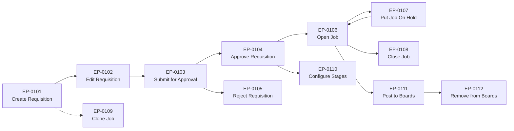

#### Elementary Business Processes

| ID | Name | Description | Trigger | Use Case |
|----|------|-------------|---------|----------|
| EP-0101 | Create Requisition | Create new job requisition with details | User action | [UC-001](use-cases/UC-001-create-job-requisition.md) |
| EP-0102 | Edit Requisition | Modify existing job details | User action | UC-002 |
| EP-0103 | Submit for Approval | Send requisition to approvers | User action | UC-003 |
| EP-0104 | Approve Requisition | Approve pending requisition | Approver action | UC-004 |
| EP-0105 | Reject Requisition | Reject pending requisition | Approver action | UC-005 |
| EP-0106 | Open Job | Set job status to open | User action | UC-006 |
| EP-0107 | Put Job On Hold | Temporarily pause hiring | User action | UC-007 |
| EP-0108 | Close Job | Close job (filled/cancelled) | User action | UC-008 |
| EP-0109 | Clone Job | Duplicate existing job | User action | UC-009 |
| EP-0110 | Configure Job Stages | Customize pipeline stages | User action | UC-010 |
| EP-0111 | Post to Job Boards | Publish job externally | User action | UC-011 |
| EP-0112 | Remove from Job Boards | Unpublish job externally | User action | UC-012 |

---

### BP-102: Candidate Sourcing

**Description:** Activities to attract and identify potential candidates for open positions.

**Trigger:** Open job requisition

**Input:** Job requirements, sourcing channels

**Output:** Candidate records in system

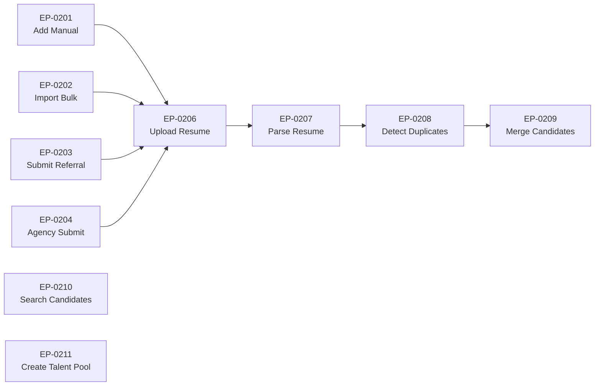

#### Elementary Business Processes

| ID | Name | Description | Trigger | Use Case |
|----|------|-------------|---------|----------|
| EP-0201 | Add Candidate Manually | Create candidate by entering details | User action | UC-050 |
| EP-0202 | Import Candidates | Bulk import from file | User action | UC-051 |
| EP-0203 | Submit Referral | Employee submits referral | User action | UC-052 |
| EP-0204 | Agency Submission | Agency submits candidate | External action | UC-053 |
| EP-0205 | Edit Candidate Profile | Update candidate info | User action | UC-054 |
| EP-0206 | Upload Resume | Attach resume file | User action | UC-055 |
| EP-0207 | Parse Resume | Extract structured data | System event | UC-056 |
| EP-0208 | Add Candidate Note | Add internal notes | User action | UC-057 |
| EP-0209 | Tag Candidate | Apply tags to candidate | User action | UC-058 |
| EP-0210 | Detect Duplicates | Identify duplicate records | System event | UC-059 |
| EP-0211 | Merge Candidates | Combine duplicate records | User action | UC-060 |

---

### BP-103: Application Processing

**Description:** Handling of candidate applications from submission through initial processing.

**Trigger:** Candidate applies to job

**Input:** Application data, resume, custom responses

**Output:** Application record in pipeline

#### Elementary Business Processes

| ID | Name | Description | Trigger | Use Case |
|----|------|-------------|---------|----------|
| EP-0301 | Apply for Job | Candidate submits application | Candidate action | [UC-100](use-cases/UC-100-apply-for-job.md) |
| EP-0302 | Add to Job | Recruiter adds candidate to job | User action | UC-101 |
| EP-0303 | View Pipeline | View Kanban board | User action | UC-102 |

---

### BP-104: Pipeline Management

**Description:** Managing candidate progression through hiring stages.

**Trigger:** Application enters pipeline

**Input:** Application, stage rules

**Output:** Stage transitions, status changes

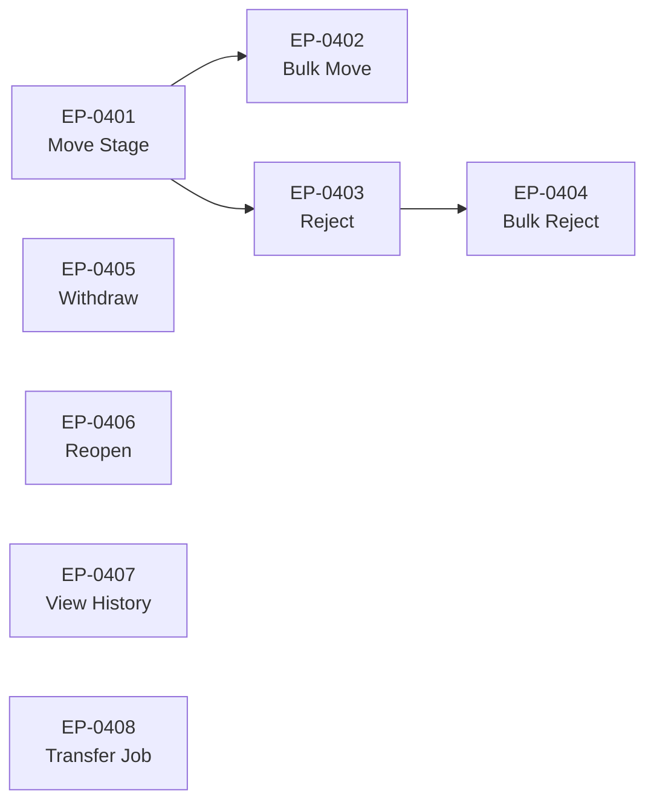

#### Elementary Business Processes

| ID | Name | Description | Trigger | Use Case |
|----|------|-------------|---------|----------|
| EP-0401 | Move Stage | Move candidate to new stage | User action | [UC-103](use-cases/UC-103-move-stage.md) |
| EP-0402 | Bulk Move Stage | Move multiple candidates | User action | UC-104 |
| EP-0403 | Reject Candidate | Reject with reason | User action | [UC-105](use-cases/UC-105-reject-candidate.md) |
| EP-0404 | Bulk Reject | Reject multiple candidates | User action | UC-106 |
| EP-0405 | Withdraw Application | Candidate withdraws | Candidate action | UC-107 |
| EP-0406 | Reopen Application | Reactivate closed application | User action | UC-108 |
| EP-0407 | View Application History | See timeline | User action | UC-109 |
| EP-0408 | Transfer to Another Job | Move to different job | User action | UC-110 |

---

# BF-02: Candidate Evaluation

## Overview

The Candidate Evaluation function covers all interview coordination, feedback collection, and hiring decision activities.

## Business Processes

### BP-201: Interview Coordination

**Description:** Scheduling, managing, and tracking interviews.

**Trigger:** Candidate reaches interview stage

**Input:** Candidate, interviewers, availability

**Output:** Scheduled, completed interviews

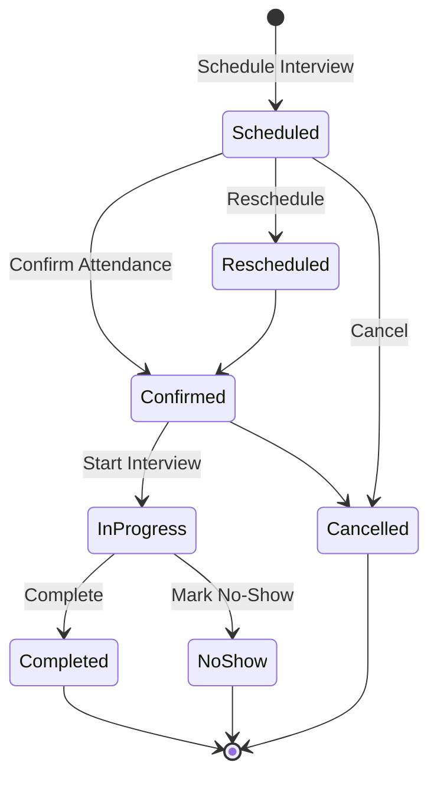

#### Elementary Business Processes

| ID | Name | Description | Trigger | Use Case |
|----|------|-------------|---------|----------|
| EP-0501 | Schedule Interview | Create interview slot | User action | UC-150 |
| EP-0502 | Create Panel Interview | Multi-interviewer session | User action | UC-151 |
| EP-0503 | Send Calendar Invite | Dispatch calendar events | System event | UC-152 |
| EP-0504 | Self-Schedule Interview | Candidate picks slot | Candidate action | UC-153 |
| EP-0505 | Reschedule Interview | Change interview time | User action | UC-154 |
| EP-0506 | Cancel Interview | Cancel scheduled interview | User action | UC-155 |
| EP-0507 | Confirm Attendance | Confirm participation | User action | UC-156 |
| EP-0508 | Mark No-Show | Record non-attendance | User action | UC-157 |
| EP-0509 | Complete Interview | Mark interview done | User action | UC-158 |
| EP-0510 | View Interview Kit | Access questions/criteria | User action | UC-159 |
| EP-0511 | Manage Interview Templates | Configure templates | User action | UC-160 |

---

### BP-202: Feedback Collection

**Description:** Gathering structured interview feedback and evaluations.

**Trigger:** Interview completed

**Input:** Interview, scorecard template

**Output:** Submitted scorecards

#### Elementary Business Processes

| ID | Name | Description | Trigger | Use Case |
|----|------|-------------|---------|----------|
| EP-0601 | Submit Scorecard | Complete evaluation | Interviewer action | UC-200 |
| EP-0602 | Rate Competencies | Score on competencies | Interviewer action | UC-201 |
| EP-0603 | Add Interview Notes | Add free-form notes | Interviewer action | UC-202 |
| EP-0604 | View Team Feedback | Review all scorecards | User action | UC-203 |
| EP-0605 | Request Additional Feedback | Prompt for missing feedback | User action | UC-204 |

---

### BP-203: Hiring Decision Making

**Description:** Making and documenting final hiring decisions.

**Trigger:** Evaluation complete

**Input:** Scorecards, candidate data

**Output:** Documented decision

#### Elementary Business Processes

| ID | Name | Description | Trigger | Use Case |
|----|------|-------------|---------|----------|
| EP-0701 | Make Hiring Decision | Record hire/reject decision | User action | UC-205 |
| EP-0702 | Approve Stage Progression | Approve advancement | Approver action | UC-206 |
| EP-0703 | Manage Competencies | Configure competencies | User action | UC-207 |
| EP-0704 | Create Scorecard Template | Design scorecards | User action | UC-208 |

---

# BF-03: Offer & Onboarding

## Overview

The Offer & Onboarding function manages the offer lifecycle from creation through candidate acceptance and hire completion.

## Business Processes

### BP-301: Offer Creation

**Description:** Drafting and configuring job offers.

**Trigger:** Hiring decision to extend offer

**Input:** Compensation data, offer template

**Output:** Draft offer

#### Elementary Business Processes

| ID | Name | Description | Trigger | Use Case |
|----|------|-------------|---------|----------|
| EP-0801 | Create Offer | Draft offer details | User action | UC-250 |
| EP-0802 | Edit Offer | Modify offer terms | User action | UC-257 |

---

### BP-302: Offer Approval

**Description:** Routing offers through approval workflow.

**Trigger:** Offer submitted for approval

**Input:** Draft offer, approval chain

**Output:** Approved/rejected offer

#### Elementary Business Processes

| ID | Name | Description | Trigger | Use Case |
|----|------|-------------|---------|----------|
| EP-0811 | Submit Offer for Approval | Send to approvers | User action | UC-251 |
| EP-0812 | Approve Offer | Approve pending offer | Approver action | UC-252 |
| EP-0813 | Reject Offer | Reject pending offer | Approver action | UC-253 |

---

### BP-303: Offer Delivery

**Description:** Sending offers to candidates and managing responses.

**Trigger:** Offer approved

**Input:** Approved offer, candidate contact

**Output:** Candidate response

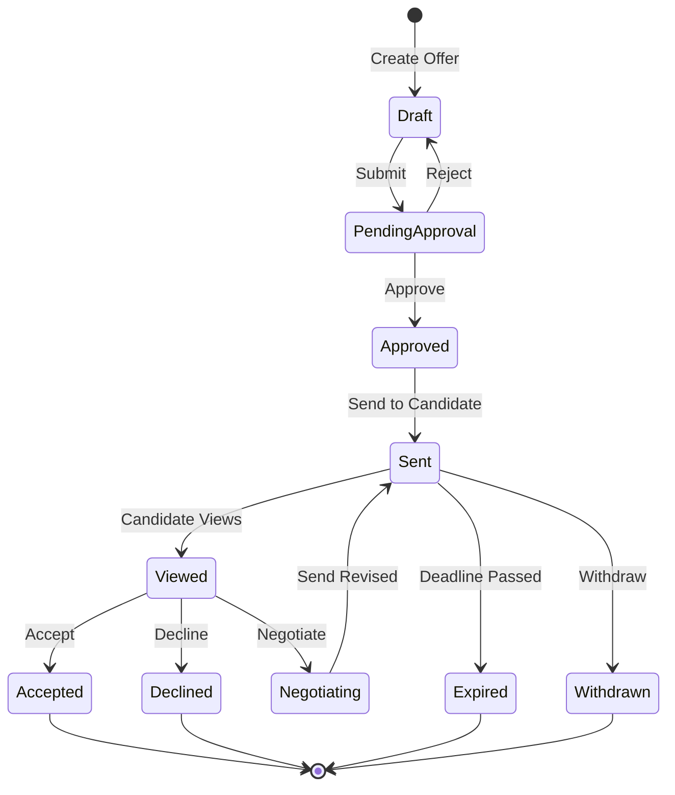

#### Elementary Business Processes

| ID | Name | Description | Trigger | Use Case |
|----|------|-------------|---------|----------|
| EP-0821 | Send Offer to Candidate | Deliver offer | User action | UC-254 |
| EP-0822 | Accept Offer | Candidate accepts | Candidate action | UC-255 |
| EP-0823 | Decline Offer | Candidate declines | Candidate action | UC-256 |
| EP-0824 | Negotiate Offer | Revise offer terms | User action | UC-257 |
| EP-0825 | Withdraw Offer | Rescind offer | User action | UC-258 |

---

### BP-304: Hire Finalization

**Description:** Completing the hiring process and preparing for onboarding.

**Trigger:** Offer accepted

**Input:** Accepted offer, candidate data

**Output:** Hired status, HRIS export

#### Elementary Business Processes

| ID | Name | Description | Trigger | Use Case |
|----|------|-------------|---------|----------|
| EP-0831 | Mark as Hired | Complete hire | User action | UC-259 |
| EP-0832 | Manage Offer Templates | Configure templates | User action | UC-260 |

---

# BF-04: Compliance Management

## Overview

The Compliance Management function ensures adherence to employment regulations including EEOC, GDPR, background checks, and audit requirements.

## Business Processes

### BP-401: EEOC Compliance

**Description:** Collecting and reporting equal opportunity data.

**Trigger:** Application submitted

**Input:** Voluntary demographic data

**Output:** EEOC reports

#### Elementary Business Processes

| ID | Name | Description | Trigger | Use Case |
|----|------|-------------|---------|----------|
| EP-0901 | Collect EEOC Data | Gather voluntary demographics | Candidate action | UC-300 |
| EP-0902 | Generate EEOC Report | Create compliance report | User action | UC-306 |

---

### BP-402: GDPR/Privacy Compliance

**Description:** Managing data privacy requirements and consent.

**Trigger:** Candidate data processing

**Input:** Candidate consent choices

**Output:** Consent records, deletion confirmations

#### Elementary Business Processes

| ID | Name | Description | Trigger | Use Case |
|----|------|-------------|---------|----------|
| EP-0911 | Record Consent | Capture data consent | Candidate action | UC-301 |
| EP-0912 | Process Deletion Request | Handle right-to-deletion | User action | UC-309 |
| EP-0913 | Configure Retention Policy | Set retention rules | Admin action | UC-310 |

---

### BP-403: Background Verification

**Description:** Managing background check workflow including adverse actions.

**Trigger:** Candidate reaches background check stage

**Input:** Candidate authorization, check package

**Output:** Background check results

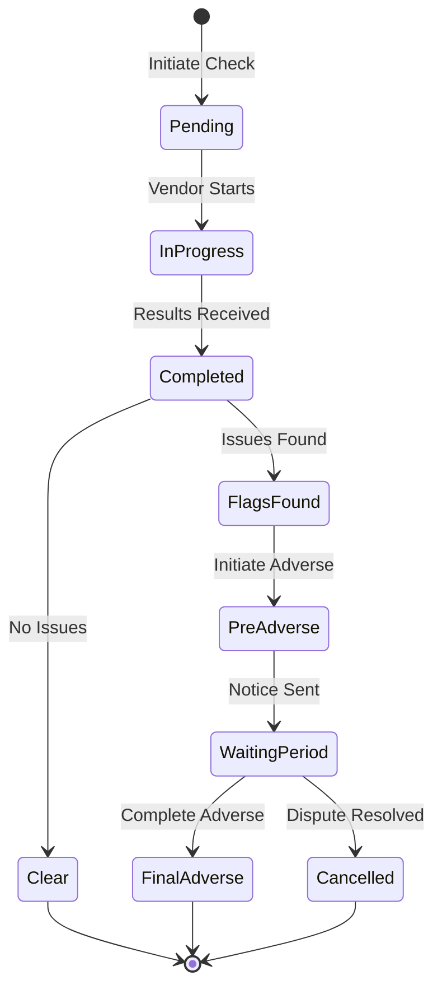

#### Elementary Business Processes

| ID | Name | Description | Trigger | Use Case |
|----|------|-------------|---------|----------|
| EP-0921 | Initiate Background Check | Send to vendor | User action | UC-302 |
| EP-0922 | Receive Screening Results | Process results | System event | UC-303 |
| EP-0923 | Initiate Adverse Action | Start adverse workflow | User action | UC-304 |
| EP-0924 | Complete Adverse Action | Finalize adverse action | System event | UC-305 |

---

### BP-404: Audit Management

**Description:** Maintaining audit trails and compliance documentation.

**Trigger:** System activities

**Input:** User actions, system events

**Output:** Audit logs, hiring decisions

#### Elementary Business Processes

| ID | Name | Description | Trigger | Use Case |
|----|------|-------------|---------|----------|
| EP-0931 | View Audit Trail | Review activity log | User action | UC-307 |
| EP-0932 | Export Audit Logs | Download audit data | User action | UC-308 |
| EP-0933 | Document Hiring Decision | Record decision rationale | User action | UC-311 |

---

# BF-05: Communication Management

## Overview

The Communication Management function handles all candidate and internal user communications.

## Business Processes

### BP-501: Candidate Communication

**Description:** Direct communications with candidates.

**Trigger:** Communication need identified

**Input:** Message content, recipient

**Output:** Sent communication

#### Elementary Business Processes

| ID | Name | Description | Trigger | Use Case |
|----|------|-------------|---------|----------|
| EP-1001 | Send Email to Candidate | Individual email | User action | UC-550 |
| EP-1002 | Send Bulk Email | Mass email | User action | UC-551 |
| EP-1003 | Schedule Email | Future delivery | User action | UC-552 |
| EP-1004 | Send SMS | Text message | User action | UC-554 |
| EP-1005 | View Email History | See sent emails | User action | UC-557 |

---

### BP-502: Internal Notifications

**Description:** Notifications to internal users.

**Trigger:** System events

**Input:** Event data, notification rules

**Output:** Delivered notifications

#### Elementary Business Processes

| ID | Name | Description | Trigger | Use Case |
|----|------|-------------|---------|----------|
| EP-1011 | Send In-App Notification | UI notification | System event | UC-555 |
| EP-1012 | Manage Notification Preferences | Configure prefs | User action | UC-556 |

---

### BP-503: Email Automation

**Description:** Automated email sequences and workflows.

**Trigger:** Workflow triggers

**Input:** Sequence configuration

**Output:** Automated emails

#### Elementary Business Processes

| ID | Name | Description | Trigger | Use Case |
|----|------|-------------|---------|----------|
| EP-1021 | Create Email Sequence | Build automation | User action | UC-553 |
| EP-1022 | Track Email Engagement | Monitor opens/clicks | System event | UC-558 |

---

# BF-06: System Administration

## Overview

The System Administration function covers user management, organization configuration, integrations, and career site management.

## Business Processes

### BP-601: User Administration

**Description:** Managing user accounts and access.

**Trigger:** User management need

**Input:** User data, role assignments

**Output:** Configured user accounts

#### Elementary Business Processes

| ID | Name | Description | Trigger | Use Case |
|----|------|-------------|---------|----------|
| EP-1101 | Create User | Add new user | Admin action | UC-500 |
| EP-1102 | Edit User | Modify user details | Admin action | UC-501 |
| EP-1103 | Deactivate User | Disable access | Admin action | UC-502 |
| EP-1104 | Assign Role | Change permissions | Admin action | UC-503 |

---

### BP-602: Organization Configuration

**Description:** Configuring organization-wide settings.

**Trigger:** Configuration need

**Input:** Setting values

**Output:** Updated configuration

#### Elementary Business Processes

| ID | Name | Description | Trigger | Use Case |
|----|------|-------------|---------|----------|
| EP-1111 | Manage Departments | Configure department structure | Admin action | UC-504 |
| EP-1112 | Configure Organization Settings | Set org preferences | Admin action | UC-505 |
| EP-1113 | Manage Rejection Reasons | Configure reasons | Admin action | UC-506 |
| EP-1114 | Configure Email Templates | Set up templates | Admin action | UC-507 |
| EP-1115 | View System Health | Monitor status | Admin action | UC-508 |
| EP-1116 | Manage Custom Fields | Configure fields | Admin action | UC-509 |

---

### BP-603: Integration Management

**Description:** Managing external system connections.

**Trigger:** Integration need

**Input:** Integration credentials, settings

**Output:** Active integrations

#### Elementary Business Processes

| ID | Name | Description | Trigger | Use Case |
|----|------|-------------|---------|----------|
| EP-1121 | Configure Job Board Integration | Set up job boards | Admin action | UC-450 |
| EP-1122 | Sync Jobs to Boards | Push job postings | User action | UC-451 |
| EP-1123 | Import Applications from Boards | Pull applications | System event | UC-452 |
| EP-1124 | Configure HRIS Integration | Set up HRIS | Admin action | UC-453 |
| EP-1125 | Export Hire to HRIS | Send hire data | User action | UC-454 |
| EP-1126 | Configure Calendar Integration | Set up calendars | Admin action | UC-455 |
| EP-1127 | Sync Calendar Events | Sync events | System event | UC-456 |
| EP-1128 | Configure SSO | Set up authentication | Admin action | UC-457 |
| EP-1129 | Manage API Keys | Create/revoke keys | Admin action | UC-458 |
| EP-1130 | Configure Webhooks | Set up outbound hooks | Admin action | UC-459 |
| EP-1131 | View Integration Logs | Monitor activity | Admin action | UC-460 |

---

### BP-604: Career Site Management

**Description:** Managing the public-facing career site.

**Trigger:** Career site configuration need

**Input:** Branding, content, settings

**Output:** Published career site

#### Elementary Business Processes

| ID | Name | Description | Trigger | Use Case |
|----|------|-------------|---------|----------|
| EP-1141 | Browse Jobs | View job listings | Candidate action | UC-400 |
| EP-1142 | Search Jobs | Filter/search jobs | Candidate action | UC-401 |
| EP-1143 | View Job Details | Read job description | Candidate action | UC-402 |
| EP-1144 | Apply for Job | Submit application | Candidate action | UC-403 |
| EP-1145 | Create Candidate Account | Register account | Candidate action | UC-404 |
| EP-1146 | Check Application Status | View status | Candidate action | UC-405 |
| EP-1147 | Update Profile | Edit candidate info | Candidate action | UC-406 |
| EP-1148 | Upload Documents | Add attachments | Candidate action | UC-407 |
| EP-1149 | Configure Career Site | Set up site | Admin action | UC-408 |
| EP-1150 | Customize Branding | Apply branding | Admin action | UC-409 |
| EP-1151 | Set Application Questions | Configure questions | User action | UC-410 |

---

# BF-07: Analytics & Reporting

## Overview

The Analytics & Reporting function provides operational reports, compliance reports, and executive dashboards.

## Business Processes

### BP-701: Operational Reporting

**Description:** Standard recruiting metrics and reports.

**Trigger:** Report request

**Input:** Date range, filters

**Output:** Report data

#### Elementary Business Processes

| ID | Name | Description | Trigger | Use Case |
|----|------|-------------|---------|----------|
| EP-1201 | View Dashboard | See key metrics | User action | UC-350 |
| EP-1202 | Generate Time-to-Hire Report | Analyze hiring speed | User action | UC-351 |
| EP-1203 | Generate Source Effectiveness Report | Analyze sources | User action | UC-352 |
| EP-1204 | Generate Pipeline Conversion Report | Analyze funnel | User action | UC-353 |
| EP-1205 | Generate Recruiter Activity Report | Track productivity | User action | UC-355 |
| EP-1206 | Generate Open Requisitions Report | View open jobs | User action | UC-356 |
| EP-1207 | Generate Offer Acceptance Report | Analyze offers | User action | UC-357 |
| EP-1208 | Schedule Report | Set up recurring | User action | UC-358 |
| EP-1209 | Export Report Data | Download data | User action | UC-359 |

---

### BP-702: Compliance Reporting

**Description:** Reports required for regulatory compliance.

**Trigger:** Compliance requirement

**Input:** Date range, report type

**Output:** Compliance report

#### Elementary Business Processes

| ID | Name | Description | Trigger | Use Case |
|----|------|-------------|---------|----------|
| EP-1211 | Generate Diversity Report | Diversity metrics | User action | UC-354 |

---

### BP-703: Executive Dashboards

**Description:** High-level dashboards for leadership.

**Trigger:** Executive access

**Input:** Organization data

**Output:** Dashboard views

#### Elementary Business Processes

| ID | Name | Description | Trigger | Use Case |
|----|------|-------------|---------|----------|
| EP-1221 | View Executive Dashboard | Leadership metrics | User action | UC-350 |

---

# Entity Lifecycle State Machines

## Job Lifecycle

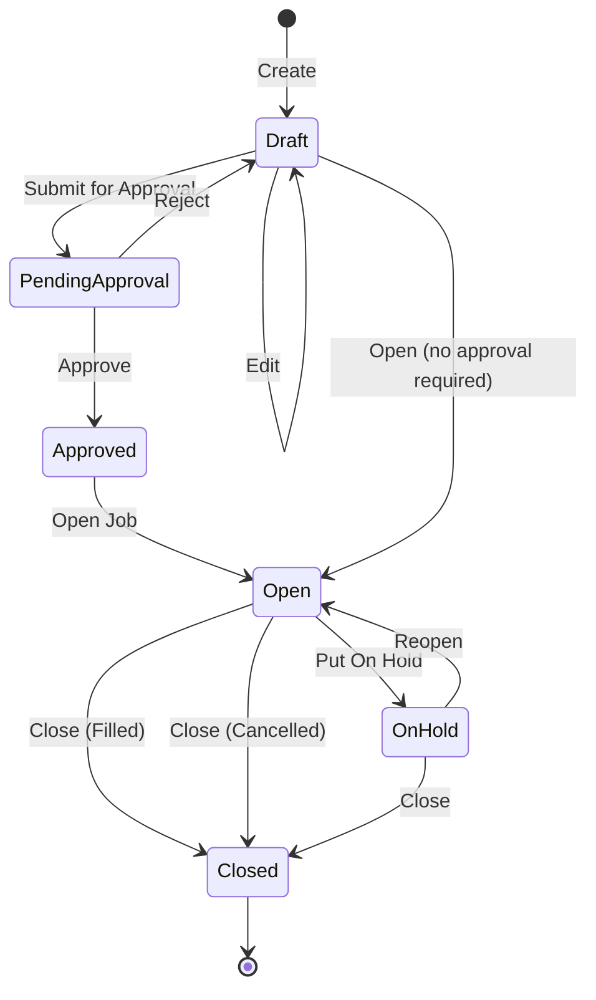

## Application Lifecycle

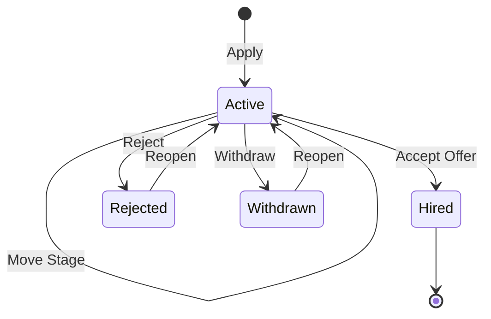

## Offer Lifecycle

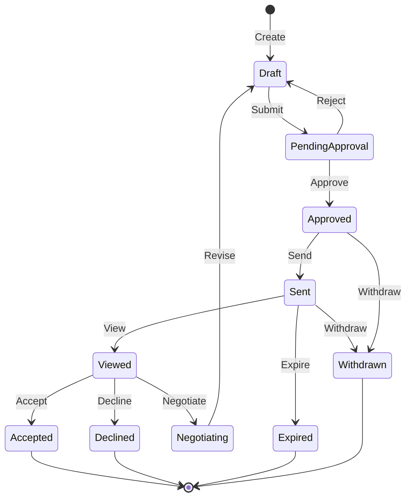

## Interview Lifecycle

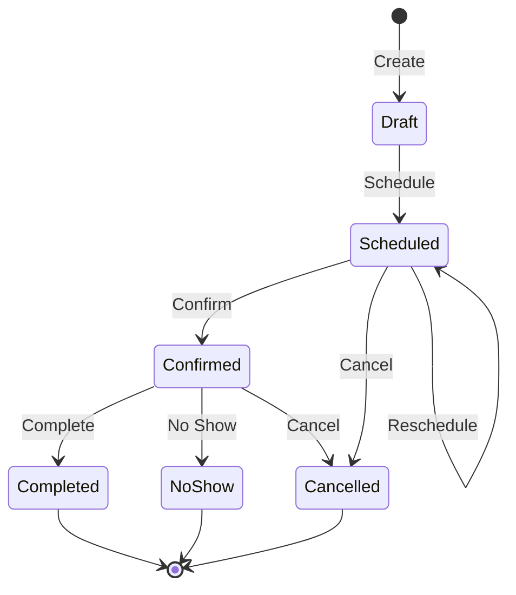

---

# Cross-Reference Index

## EBP to Use Case Mapping

| Elementary Process | Use Case | Subject Area |
|--------------------|----------|--------------|
| EP-0101: Create Requisition | [UC-001](use-cases/UC-001-create-job-requisition.md) | SA-03: Job Requisition |
| EP-0301: Apply for Job | [UC-100](use-cases/UC-100-apply-for-job.md) | SA-05: Application Pipeline |
| EP-0401: Move Stage | [UC-103](use-cases/UC-103-move-stage.md) | SA-05: Application Pipeline |
| EP-0403: Reject Candidate | [UC-105](use-cases/UC-105-reject-candidate.md) | SA-05: Application Pipeline |

## Business Function to Subject Area Mapping

| Business Function | Primary Subject Areas |
|-------------------|----------------------|
| BF-01: Talent Acquisition | SA-03: Job Requisition, SA-04: Candidate, SA-05: Application Pipeline |
| BF-02: Candidate Evaluation | SA-06: Interview, SA-07: Evaluation |
| BF-03: Offer & Onboarding | SA-08: Offer Management |
| BF-04: Compliance Management | SA-09: Compliance & Audit |
| BF-05: Communication Management | SA-10: Communication |
| BF-06: System Administration | SA-01: Identity & Access, SA-02: Organization, SA-11: Integration, SA-12: Career Site |
| BF-07: Analytics & Reporting | Cross-cutting (all areas) |

---

# Related Documentation

- [USE_CASES.md](USE_CASES.md) - Detailed use case specifications
- [DATA_MODEL.md](DATA_MODEL.md) - Data entities and relationships
- [CRUD_MATRIX.md](CRUD_MATRIX.md) - Use case to entity operations
- [PROCESS_CRUD_MATRIX.md](PROCESS_CRUD_MATRIX.md) - EBP to entity operations
- [ACTORS.md](ACTORS.md) - Actor definitions
