# Ledgoria - Use Cases Overview

## Document Purpose

This document serves as the **master index** for all use cases in Ledgoria. It provides:
- System context and actor relationships
- Use case organization by functional area
- Cross-references to data model and process model
- Navigation to detailed use case specifications

---

## System Context Diagram

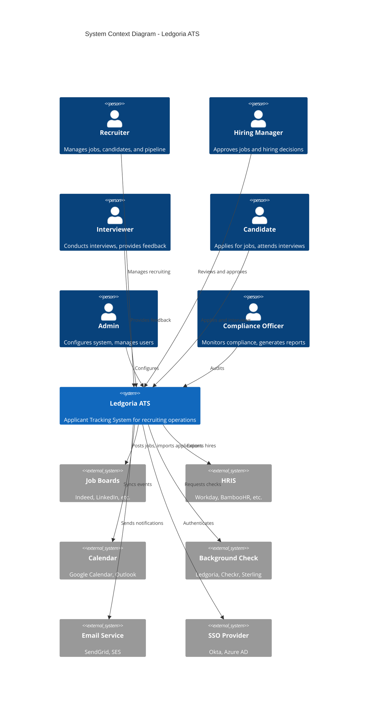

---

## Actor Hierarchy

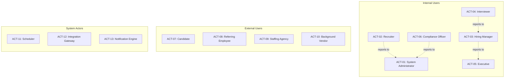

### Actor Quick Reference

| ID | Actor | Type | Primary Use Cases | Primary Interface |
|----|-------|------|-------------------|-------------------|
| [ACT-01](ACTORS.md#act-01-system-administrator) | System Administrator | Internal | UC-500 to UC-509, UC-450 to UC-460 | Admin Console |
| [ACT-02](ACTORS.md#act-02-recruiter) | Recruiter | Internal | UC-001 to UC-012, UC-050 to UC-110 | Main Application |
| [ACT-03](ACTORS.md#act-03-hiring-manager) | Hiring Manager | Internal | UC-004, UC-005, UC-103, UC-205 | Manager Portal |
| [ACT-04](ACTORS.md#act-04-interviewer) | Interviewer | Internal | UC-156, UC-158, UC-159, UC-200 to UC-202 | Feedback Interface |
| [ACT-05](ACTORS.md#act-05-executive) | Executive | Internal | UC-252, UC-350, UC-354 | Dashboard |
| [ACT-06](ACTORS.md#act-06-hr-compliance-officer) | Compliance Officer | Internal | UC-304 to UC-311 | Compliance Module |
| [ACT-07](ACTORS.md#act-07-candidate) | Candidate | External | UC-100, UC-153, UC-255, UC-300, UC-400 to UC-407 | Career Site |
| [ACT-08](ACTORS.md#act-08-referring-employee) | Referring Employee | External | UC-052 | Referral Portal |
| [ACT-09](ACTORS.md#act-09-staffing-agency) | Staffing Agency | External | UC-053 | Agency Portal |
| [ACT-10](ACTORS.md#act-10-background-screening-vendor) | Background Vendor | External | UC-303 | API Integration |
| [ACT-11](ACTORS.md#act-11-scheduler) | Scheduler | System | Background jobs | Background Jobs |
| [ACT-12](ACTORS.md#act-12-integration-gateway) | Integration Gateway | System | UC-452, UC-456 | API Layer |
| [ACT-13](ACTORS.md#act-13-notification-engine) | Notification Engine | System | UC-555 | Messaging Service |

---

## Document Conventions

### Use Case Naming Convention
- **Format:** `UC-XXX-short-description`
- **XXX:** Three-digit number, grouped by functional area

### Use Case Number Ranges

| Range | Functional Area | Business Function |
|-------|-----------------|-------------------|
| UC-001 to UC-049 | Job Requisition Management | [BF-01](PROCESS_MODEL.md#bf-01-talent-acquisition) |
| UC-050 to UC-099 | Candidate Management | [BF-01](PROCESS_MODEL.md#bf-01-talent-acquisition) |
| UC-100 to UC-149 | Application & Pipeline | [BF-01](PROCESS_MODEL.md#bf-01-talent-acquisition) |
| UC-150 to UC-199 | Interview Management | [BF-02](PROCESS_MODEL.md#bf-02-candidate-evaluation) |
| UC-200 to UC-249 | Evaluation & Feedback | [BF-02](PROCESS_MODEL.md#bf-02-candidate-evaluation) |
| UC-250 to UC-299 | Offer Management | [BF-03](PROCESS_MODEL.md#bf-03-offer--onboarding) |
| UC-300 to UC-349 | Compliance & Audit | [BF-04](PROCESS_MODEL.md#bf-04-compliance-management) |
| UC-350 to UC-399 | Reporting & Analytics | [BF-07](PROCESS_MODEL.md#bf-07-analytics--reporting) |
| UC-400 to UC-449 | Career Site & Portal | [BF-06](PROCESS_MODEL.md#bf-06-system-administration) |
| UC-450 to UC-499 | Integrations | [BF-06](PROCESS_MODEL.md#bf-06-system-administration) |
| UC-500 to UC-549 | Administration | [BF-06](PROCESS_MODEL.md#bf-06-system-administration) |
| UC-550 to UC-599 | Communication | [BF-05](PROCESS_MODEL.md#bf-05-communication-management) |

### Detailed Use Case Files
Each use case has a detailed document at: `docs/use-cases/UC-XXX-short-description.md`

---

## Cross-Reference: Use Cases to Subject Areas

| Use Case Range | Primary Subject Areas | Data Model Reference |
|----------------|----------------------|---------------------|
| UC-001 to UC-012 | [SA-03: Job Requisition](DATA_MODEL.md#sa-03-job-requisition) | Job, JobStage, JobApproval |
| UC-050 to UC-063 | [SA-04: Candidate](DATA_MODEL.md#sa-04-candidate) | Candidate, Resume, TalentPool |
| UC-100 to UC-110 | [SA-05: Application Pipeline](DATA_MODEL.md#sa-05-application-pipeline) | Application, StageTransition |
| UC-150 to UC-160 | [SA-06: Interview](DATA_MODEL.md#sa-06-interview) | Interview, InterviewParticipant |
| UC-200 to UC-208 | [SA-07: Evaluation](DATA_MODEL.md#sa-07-evaluation) | Scorecard, ScorecardAttribute |
| UC-250 to UC-261 | [SA-08: Offer Management](DATA_MODEL.md#sa-08-offer-management) | Offer, OfferApproval |
| UC-300 to UC-311 | [SA-09: Compliance & Audit](DATA_MODEL.md#sa-09-compliance--audit) | AuditLog, BackgroundCheck |
| UC-350 to UC-359 | Cross-cutting | ReportSnapshot, ScheduledReport |
| UC-400 to UC-410 | [SA-12: Career Site](DATA_MODEL.md#sa-12-career-site) | CareerSiteConfig, ApplicationQuestion |
| UC-450 to UC-460 | [SA-11: Integration](DATA_MODEL.md#sa-11-integration) | IntegrationConfig, Webhook |
| UC-500 to UC-509 | [SA-01](DATA_MODEL.md#sa-01-identity--access), [SA-02](DATA_MODEL.md#sa-02-organization-management) | User, Role, Organization |
| UC-550 to UC-558 | [SA-10: Communication](DATA_MODEL.md#sa-10-communication) | EmailLog, Notification |

---

## Cross-Reference: Use Cases to Elementary Processes

| Use Case | Elementary Process | Business Process | Business Function |
|----------|-------------------|------------------|-------------------|
| [UC-001](use-cases/UC-001-create-job-requisition.md) | [EP-0101](PROCESS_MODEL.md#elementary-business-processes) | [BP-101](PROCESS_MODEL.md#bp-101-requisition-management) | [BF-01](PROCESS_MODEL.md#bf-01-talent-acquisition) |
| UC-002 | EP-0102 | BP-101 | BF-01 |
| UC-003 | EP-0103 | BP-101 | BF-01 |
| UC-004 | EP-0104 | BP-101 | BF-01 |
| UC-005 | EP-0105 | BP-101 | BF-01 |
| UC-006 | EP-0106 | BP-101 | BF-01 |
| UC-007 | EP-0107 | BP-101 | BF-01 |
| UC-008 | EP-0108 | BP-101 | BF-01 |
| UC-009 | EP-0109 | BP-101 | BF-01 |
| UC-010 | EP-0110 | BP-101 | BF-01 |
| UC-011 | EP-0111 | BP-101 | BF-01 |
| UC-012 | EP-0112 | BP-101 | BF-01 |
| UC-050 | EP-0201 | BP-102 | BF-01 |
| UC-051 | EP-0202 | BP-102 | BF-01 |
| UC-052 | EP-0203 | BP-102 | BF-01 |
| UC-053 | EP-0204 | BP-102 | BF-01 |
| UC-054 | EP-0205 | BP-102 | BF-01 |
| UC-055 | EP-0206 | BP-102 | BF-01 |
| UC-056 | EP-0207 | BP-102 | BF-01 |
| UC-057 | EP-0208 | BP-102 | BF-01 |
| UC-058 | EP-0209 | BP-102 | BF-01 |
| UC-059 | EP-0210 | BP-102 | BF-01 |
| UC-060 | EP-0211 | BP-102 | BF-01 |
| [UC-100](use-cases/UC-100-apply-for-job.md) | [EP-0301](PROCESS_MODEL.md#elementary-business-processes-2) | [BP-103](PROCESS_MODEL.md#bp-103-application-processing) | BF-01 |
| UC-101 | EP-0302 | BP-103 | BF-01 |
| UC-102 | EP-0303 | BP-103 | BF-01 |
| [UC-103](use-cases/UC-103-move-stage.md) | [EP-0401](PROCESS_MODEL.md#elementary-business-processes-3) | [BP-104](PROCESS_MODEL.md#bp-104-pipeline-management) | BF-01 |
| UC-104 | EP-0402 | BP-104 | BF-01 |
| [UC-105](use-cases/UC-105-reject-candidate.md) | EP-0403 | BP-104 | BF-01 |
| UC-106 | EP-0404 | BP-104 | BF-01 |
| UC-107 | EP-0405 | BP-104 | BF-01 |
| UC-108 | EP-0406 | BP-104 | BF-01 |
| UC-109 | EP-0407 | BP-104 | BF-01 |
| UC-110 | EP-0408 | BP-104 | BF-01 |
| UC-150 | EP-0501 | BP-201 | BF-02 |
| UC-151 | EP-0502 | BP-201 | BF-02 |
| UC-152 | EP-0503 | BP-201 | BF-02 |
| UC-153 | EP-0504 | BP-201 | BF-02 |
| UC-154 | EP-0505 | BP-201 | BF-02 |
| UC-155 | EP-0506 | BP-201 | BF-02 |
| UC-156 | EP-0507 | BP-201 | BF-02 |
| UC-157 | EP-0508 | BP-201 | BF-02 |
| UC-158 | EP-0509 | BP-201 | BF-02 |
| UC-159 | EP-0510 | BP-201 | BF-02 |
| UC-160 | EP-0511 | BP-201 | BF-02 |
| UC-200 | EP-0601 | BP-202 | BF-02 |
| UC-201 | EP-0602 | BP-202 | BF-02 |
| UC-202 | EP-0603 | BP-202 | BF-02 |
| UC-203 | EP-0604 | BP-202 | BF-02 |
| UC-204 | EP-0605 | BP-202 | BF-02 |
| UC-205 | EP-0701 | BP-203 | BF-02 |
| UC-206 | EP-0702 | BP-203 | BF-02 |
| UC-207 | EP-0703 | BP-203 | BF-02 |
| UC-208 | EP-0704 | BP-203 | BF-02 |
| UC-250 | EP-0801 | BP-301 | BF-03 |
| UC-251 | EP-0811 | BP-302 | BF-03 |
| UC-252 | EP-0812 | BP-302 | BF-03 |
| UC-253 | EP-0813 | BP-302 | BF-03 |
| UC-254 | EP-0821 | BP-303 | BF-03 |
| UC-255 | EP-0822 | BP-303 | BF-03 |
| UC-256 | EP-0823 | BP-303 | BF-03 |
| UC-257 | EP-0802, EP-0824 | BP-301, BP-303 | BF-03 |
| UC-258 | EP-0825 | BP-303 | BF-03 |
| UC-259 | EP-0831 | BP-304 | BF-03 |
| UC-260 | EP-0832 | BP-304 | BF-03 |
| UC-261 | EP-0821 | BP-303 | BF-03 |
| UC-300 | EP-0901 | BP-401 | BF-04 |
| UC-301 | EP-0911 | BP-402 | BF-04 |
| UC-302 | EP-0921 | BP-403 | BF-04 |
| UC-303 | EP-0922 | BP-403 | BF-04 |
| UC-304 | EP-0923 | BP-403 | BF-04 |
| UC-305 | EP-0924 | BP-403 | BF-04 |
| UC-306 | EP-0902 | BP-401 | BF-04 |
| UC-307 | EP-0931 | BP-404 | BF-04 |
| UC-308 | EP-0932 | BP-404 | BF-04 |
| UC-309 | EP-0912 | BP-402 | BF-04 |
| UC-310 | EP-0913 | BP-402 | BF-04 |
| UC-311 | EP-0933 | BP-404 | BF-04 |

---

## Functional Area 1: Job Requisition Management

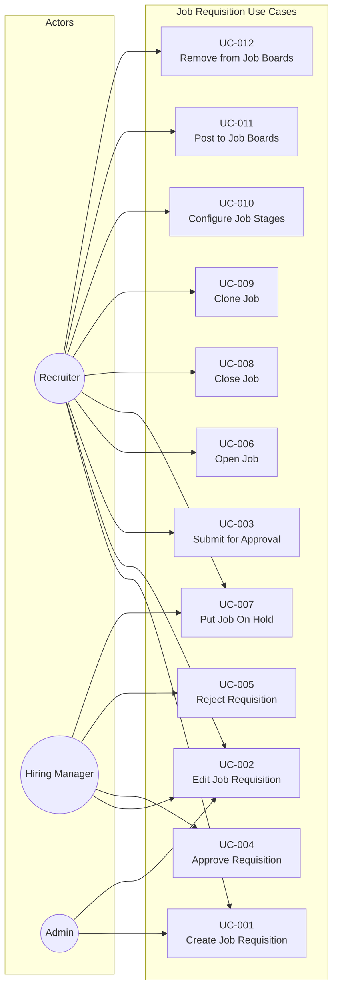

| ID | Use Case | Primary Actor | Brief Description | Detail |
|----|----------|---------------|-------------------|--------|
| UC-001 | Create Job Requisition | [Recruiter (ACT-02)](ACTORS.md#act-02-recruiter) | Create a new job with title, description, requirements, and hiring team | [Detail](use-cases/UC-001-create-job-requisition.md) |
| UC-002 | Edit Job Requisition | Recruiter | Modify job details before or after posting | |
| UC-003 | Submit for Approval | Recruiter | Send requisition to hiring manager for approval | |
| UC-004 | Approve Requisition | [Hiring Manager (ACT-03)](ACTORS.md#act-03-hiring-manager) | Approve a pending job requisition | |
| UC-005 | Reject Requisition | Hiring Manager | Reject a requisition with feedback | |
| UC-006 | Open Job | Recruiter | Change job status to open and enable applications | |
| UC-007 | Put Job On Hold | Recruiter/HM | Temporarily pause hiring without closing | |
| UC-008 | Close Job | Recruiter | Close job and stop accepting applications | |
| UC-009 | Clone Job | Recruiter | Duplicate an existing job as template | |
| UC-010 | Configure Job Stages | Recruiter | Customize pipeline stages for a specific job | |
| UC-011 | Post to Job Boards | Recruiter | Publish job to external job boards | |
| UC-012 | Remove from Job Boards | Recruiter | Remove job listing from external boards | |

---

## Functional Area 2: Candidate Management

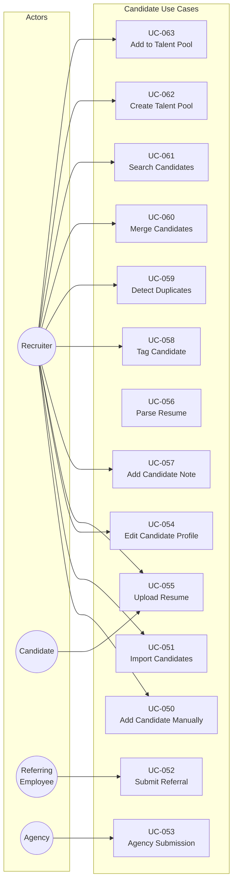

| ID | Use Case | Primary Actor | Brief Description |
|----|----------|---------------|-------------------|
| UC-050 | Add Candidate Manually | Recruiter | Create candidate record by entering details |
| UC-051 | Import Candidates | Recruiter | Bulk import candidates from CSV/file |
| UC-052 | Submit Referral | [Referring Employee (ACT-08)](ACTORS.md#act-08-referring-employee) | Submit a candidate referral with context |
| UC-053 | Agency Submission | [Agency (ACT-09)](ACTORS.md#act-09-staffing-agency) | Submit candidate for a specific requisition |
| UC-054 | Edit Candidate Profile | Recruiter | Update candidate information |
| UC-055 | Upload Resume | Recruiter/Candidate | Attach resume file to candidate profile |
| UC-056 | Parse Resume | System | Extract structured data from resume |
| UC-057 | Add Candidate Note | Recruiter | Add notes to candidate record |
| UC-058 | Tag Candidate | Recruiter | Apply tags for organization/filtering |
| UC-059 | Detect Duplicates | System | Identify potential duplicate candidates |
| UC-060 | Merge Candidates | Recruiter | Combine duplicate candidate records |
| UC-061 | Search Candidates | Recruiter | Find candidates using filters and keywords |
| UC-062 | Create Talent Pool | Recruiter | Create a saved group of candidates |
| UC-063 | Add to Talent Pool | Recruiter | Add candidate(s) to an existing pool |

---

## Functional Area 3: Application & Pipeline

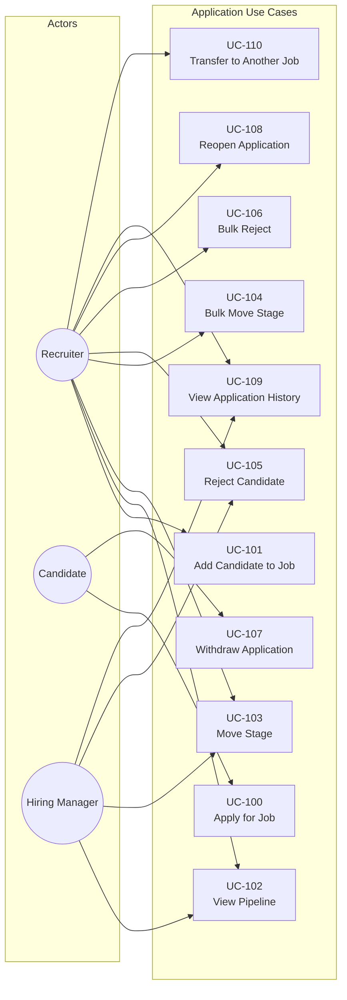

| ID | Use Case | Primary Actor | Brief Description | Detail |
|----|----------|---------------|-------------------|--------|
| UC-100 | Apply for Job | [Candidate (ACT-07)](ACTORS.md#act-07-candidate) | Submit application through career site | [Detail](use-cases/UC-100-apply-for-job.md) |
| UC-101 | Add Candidate to Job | Recruiter | Create application for existing candidate | |
| UC-102 | View Pipeline | Recruiter | View Kanban board of candidates by stage | |
| UC-103 | Move Stage | Recruiter | Advance or move candidate to different stage | [Detail](use-cases/UC-103-move-stage.md) |
| UC-104 | Bulk Move Stage | Recruiter | Move multiple candidates simultaneously | |
| UC-105 | Reject Candidate | Recruiter/HM | Reject with reason, trigger notifications | [Detail](use-cases/UC-105-reject-candidate.md) |
| UC-106 | Bulk Reject | Recruiter | Reject multiple candidates at once | |
| UC-107 | Withdraw Application | Candidate | Candidate withdraws from consideration | |
| UC-108 | Reopen Application | Recruiter | Reactivate a rejected/withdrawn application | |
| UC-109 | View Application History | Recruiter | See full timeline of application activity | |
| UC-110 | Transfer to Another Job | Recruiter | Move candidate's application to different job | |

---

## Functional Area 4: Interview Management

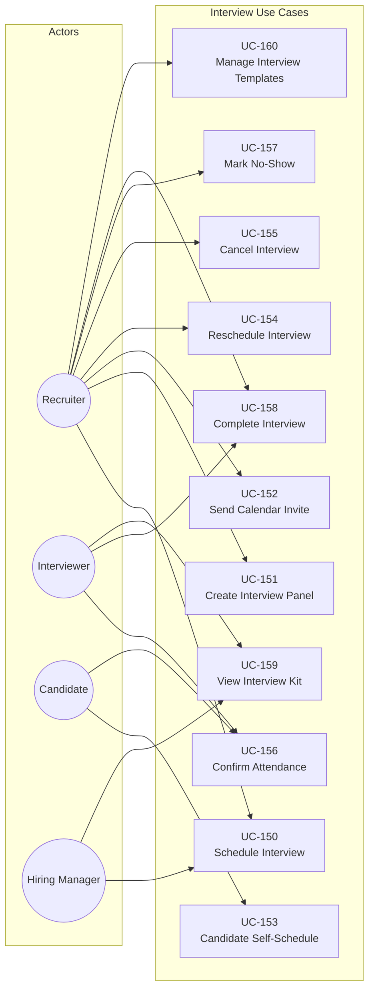

| ID | Use Case | Primary Actor | Brief Description |
|----|----------|---------------|-------------------|
| UC-150 | Schedule Interview | Recruiter | Create interview with time, participants, type |
| UC-151 | Create Interview Panel | Recruiter | Set up multi-person interview session |
| UC-152 | Send Calendar Invite | System | Send calendar invites to all participants |
| UC-153 | Candidate Self-Schedule | Candidate | Pick from available time slots |
| UC-154 | Reschedule Interview | Recruiter | Change interview time |
| UC-155 | Cancel Interview | Recruiter | Cancel scheduled interview |
| UC-156 | Confirm Attendance | [Interviewer (ACT-04)](ACTORS.md#act-04-interviewer)/Candidate | Confirm availability for interview |
| UC-157 | Mark No-Show | Recruiter | Record candidate or interviewer no-show |
| UC-158 | Complete Interview | Interviewer | Mark interview as completed |
| UC-159 | View Interview Kit | Interviewer | Access questions and evaluation criteria |
| UC-160 | Manage Interview Templates | Recruiter | Create/edit interview kit templates |

---

## Functional Area 5: Evaluation & Feedback

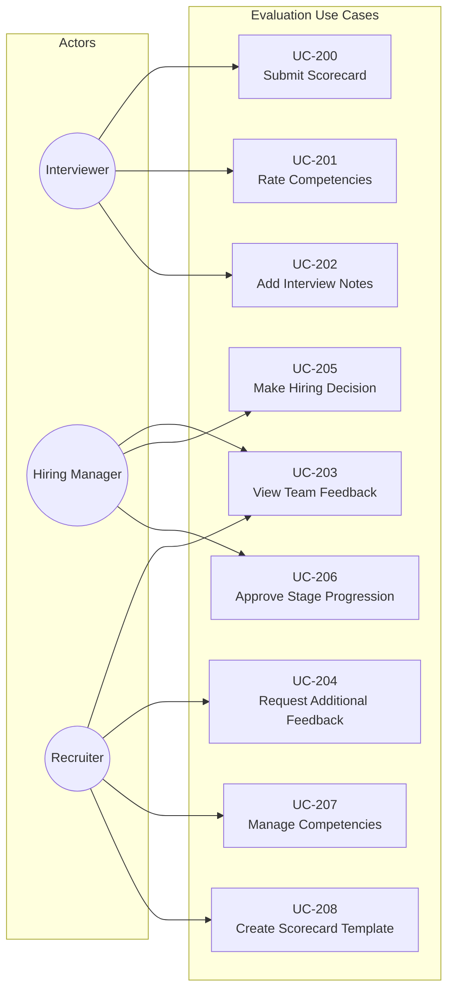

| ID | Use Case | Primary Actor | Brief Description |
|----|----------|---------------|-------------------|
| UC-200 | Submit Scorecard | Interviewer | Complete structured evaluation after interview |
| UC-201 | Rate Competencies | Interviewer | Score candidate on defined competencies |
| UC-202 | Add Interview Notes | Interviewer | Add free-form notes to scorecard |
| UC-203 | View Team Feedback | Hiring Manager | Review all submitted scorecards |
| UC-204 | Request Additional Feedback | Recruiter | Prompt interviewers for missing feedback |
| UC-205 | Make Hiring Decision | Hiring Manager | Record hire/no-hire decision |
| UC-206 | Approve Stage Progression | Hiring Manager | Approve candidate advancement |
| UC-207 | Manage Competencies | Recruiter | Define competencies for evaluation |
| UC-208 | Create Scorecard Template | Recruiter | Design scorecard structure for job/stage |

---

## Functional Area 6: Offer Management

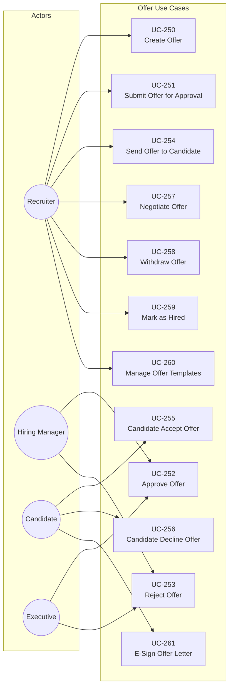

| ID | Use Case | Primary Actor | Brief Description |
|----|----------|---------------|-------------------|
| UC-250 | Create Offer | Recruiter | Draft offer with compensation details |
| UC-251 | Submit Offer for Approval | Recruiter | Send offer through approval workflow |
| UC-252 | Approve Offer | Hiring Manager | Approve offer to proceed |
| UC-253 | Reject Offer | Hiring Manager | Reject offer with feedback |
| UC-254 | Send Offer to Candidate | Recruiter | Deliver offer letter to candidate |
| UC-255 | Candidate Accept Offer | Candidate | Accept offer terms |
| UC-256 | Candidate Decline Offer | Candidate | Decline offer with optional reason |
| UC-257 | Negotiate Offer | Recruiter | Revise offer based on negotiation |
| UC-258 | Withdraw Offer | Recruiter | Rescind offer before acceptance |
| UC-259 | Mark as Hired | Recruiter | Complete hiring process |
| UC-260 | Manage Offer Templates | Recruiter | Create/edit offer letter templates |
| UC-261 | E-Sign Offer Letter | Candidate | Electronically sign offer document |

---

## Functional Area 7: Compliance & Audit

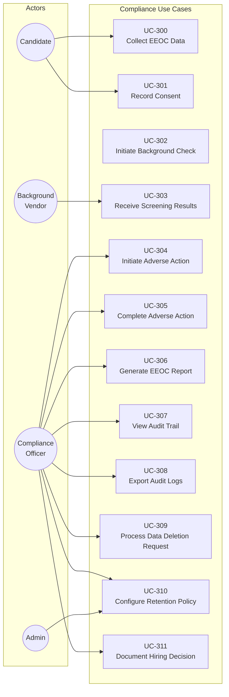

| ID | Use Case | Primary Actor | Brief Description |
|----|----------|---------------|-------------------|
| UC-300 | Collect EEOC Data | Candidate | Voluntarily provide demographic data |
| UC-301 | Record Consent | Candidate | Capture consent for data processing |
| UC-302 | Initiate Background Check | Recruiter | Send candidate to screening vendor |
| UC-303 | Receive Screening Results | System | Process results from background vendor |
| UC-304 | Initiate Adverse Action | [Compliance Officer (ACT-06)](ACTORS.md#act-06-hr-compliance-officer) | Begin pre-adverse action notice process |
| UC-305 | Complete Adverse Action | Compliance Officer | Finalize adverse action after waiting period |
| UC-306 | Generate EEOC Report | Compliance Officer | Create required regulatory reports |
| UC-307 | View Audit Trail | Compliance Officer | Review activity history for candidate/job |
| UC-308 | Export Audit Logs | Compliance Officer | Export audit data for external review |
| UC-309 | Process Data Deletion Request | Compliance Officer | Handle GDPR right-to-deletion |
| UC-310 | Configure Retention Policy | Admin | Set data retention rules |
| UC-311 | Document Hiring Decision | Hiring Manager | Record justification for hire/reject decision |

---

## Functional Area 8: Reporting & Analytics

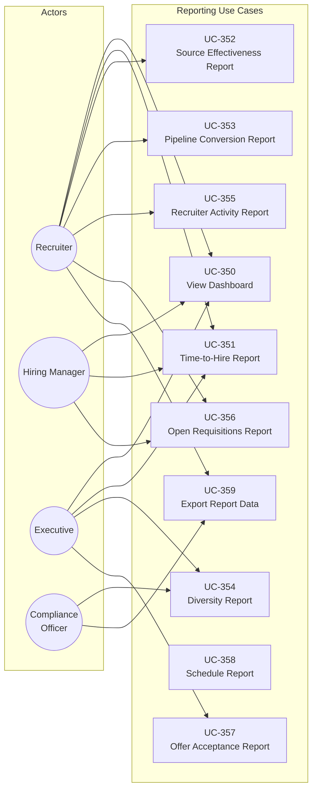

| ID | Use Case | Primary Actor | Brief Description |
|----|----------|---------------|-------------------|
| UC-350 | View Dashboard | Recruiter | View personalized recruiting dashboard |
| UC-351 | Time-to-Hire Report | Recruiter | Analyze hiring duration by job/department |
| UC-352 | Source Effectiveness Report | Recruiter | Measure source quality and conversion |
| UC-353 | Pipeline Conversion Report | Recruiter | Analyze stage-to-stage drop-off |
| UC-354 | Diversity Report | [Executive (ACT-05)](ACTORS.md#act-05-executive) | Review diversity metrics (anonymized) |
| UC-355 | Recruiter Activity Report | Recruiter | Track recruiter productivity metrics |
| UC-356 | Open Requisitions Report | Hiring Manager | View status of all open positions |
| UC-357 | Offer Acceptance Report | Executive | Analyze offer acceptance trends |
| UC-358 | Schedule Report | Recruiter | Export scheduled reports periodically |
| UC-359 | Export Report Data | Recruiter | Download report data as CSV/Excel |

---

## Functional Area 9: Career Site & Candidate Portal

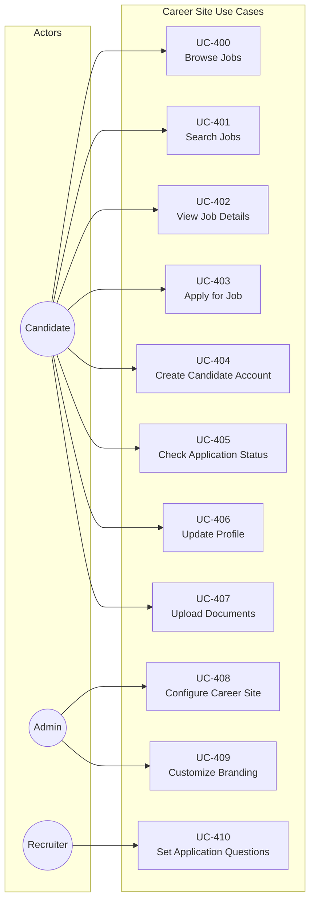

| ID | Use Case | Primary Actor | Brief Description |
|----|----------|---------------|-------------------|
| UC-400 | Browse Jobs | Candidate | View list of open positions |
| UC-401 | Search Jobs | Candidate | Filter and search job listings |
| UC-402 | View Job Details | Candidate | Read full job description |
| UC-403 | Apply for Job | Candidate | Submit application with resume |
| UC-404 | Create Candidate Account | Candidate | Optionally create account for status tracking |
| UC-405 | Check Application Status | Candidate | View current application stage |
| UC-406 | Update Profile | Candidate | Modify personal information |
| UC-407 | Upload Documents | Candidate | Add additional documents to application |
| UC-408 | Configure Career Site | [Admin (ACT-01)](ACTORS.md#act-01-system-administrator) | Set up career site structure and settings |
| UC-409 | Customize Branding | Admin | Apply company branding to career site |
| UC-410 | Set Application Questions | Recruiter | Configure job-specific application questions |

---

## Functional Area 10: Integrations

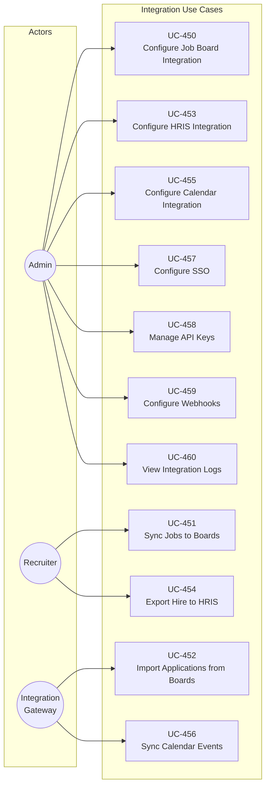

| ID | Use Case | Primary Actor | Brief Description |
|----|----------|---------------|-------------------|
| UC-450 | Configure Job Board Integration | Admin | Set up connection to job boards |
| UC-451 | Sync Jobs to Boards | Recruiter | Push job postings to external boards |
| UC-452 | Import Applications from Boards | System | Pull applications from job boards |
| UC-453 | Configure HRIS Integration | Admin | Set up HRIS system connection |
| UC-454 | Export Hire to HRIS | Recruiter | Send new hire data to HRIS |
| UC-455 | Configure Calendar Integration | Admin | Connect Google/Outlook calendar |
| UC-456 | Sync Calendar Events | System | Keep calendar events synchronized |
| UC-457 | Configure SSO | Admin | Set up SAML/OIDC authentication |
| UC-458 | Manage API Keys | Admin | Create and revoke API keys |
| UC-459 | Configure Webhooks | Admin | Set up outbound event webhooks |
| UC-460 | View Integration Logs | Admin | Monitor integration activity and errors |

---

## Functional Area 11: Administration

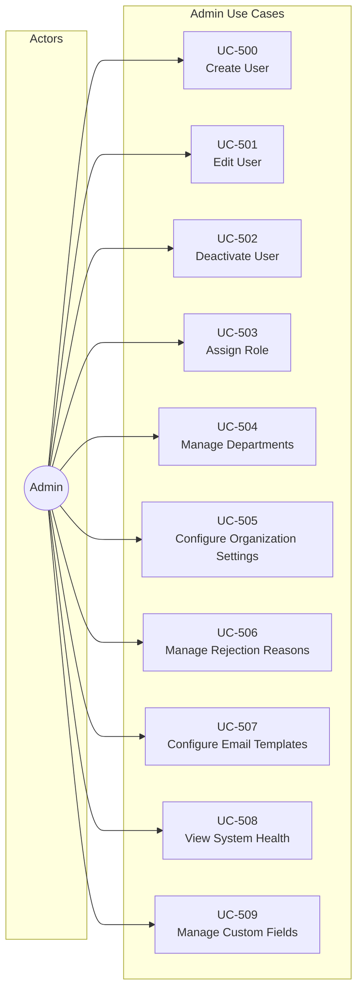

| ID | Use Case | Primary Actor | Brief Description |
|----|----------|---------------|-------------------|
| UC-500 | Create User | Admin | Add new user to organization |
| UC-501 | Edit User | Admin | Modify user details |
| UC-502 | Deactivate User | Admin | Disable user access |
| UC-503 | Assign Role | Admin | Change user role/permissions |
| UC-504 | Manage Departments | Admin | Create/edit department structure |
| UC-505 | Configure Organization Settings | Admin | Set organization-wide preferences |
| UC-506 | Manage Rejection Reasons | Admin | Configure rejection reason options |
| UC-507 | Configure Email Templates | Admin | Create/edit notification templates |
| UC-508 | View System Health | Admin | Monitor system status and metrics |
| UC-509 | Manage Custom Fields | Admin | Define custom data fields |

---

## Functional Area 12: Communication & Notifications

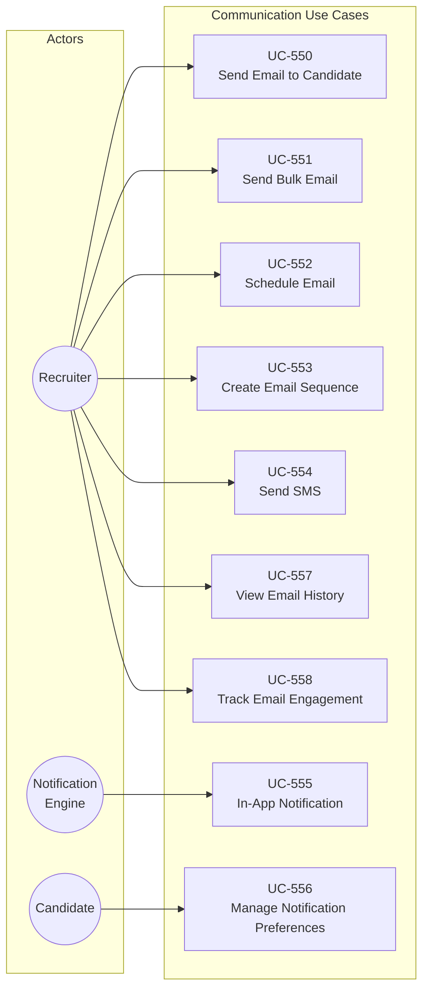

| ID | Use Case | Primary Actor | Brief Description |
|----|----------|---------------|-------------------|
| UC-550 | Send Email to Candidate | Recruiter | Send individual email from ATS |
| UC-551 | Send Bulk Email | Recruiter | Email multiple candidates at once |
| UC-552 | Schedule Email | Recruiter | Queue email for future delivery |
| UC-553 | Create Email Sequence | Recruiter | Set up automated email series |
| UC-554 | Send SMS | Recruiter | Send text message to candidate |
| UC-555 | In-App Notification | System | Deliver notification within application |
| UC-556 | Manage Notification Preferences | Candidate | Set communication preferences |
| UC-557 | View Email History | Recruiter | See all emails sent to candidate |
| UC-558 | Track Email Engagement | Recruiter | Monitor opens, clicks, replies |

---

## Complete Use Case Index

| ID | Use Case Name | Primary Actor | Functional Area | EBP | Detail |
|----|---------------|---------------|-----------------|-----|--------|
| UC-001 | Create Job Requisition | Recruiter | Job Requisition | EP-0101 | [Link](use-cases/UC-001-create-job-requisition.md) |
| UC-002 | Edit Job Requisition | Recruiter | Job Requisition | EP-0102 | |
| UC-003 | Submit for Approval | Recruiter | Job Requisition | EP-0103 | |
| UC-004 | Approve Requisition | Hiring Manager | Job Requisition | EP-0104 | |
| UC-005 | Reject Requisition | Hiring Manager | Job Requisition | EP-0105 | |
| UC-006 | Open Job | Recruiter | Job Requisition | EP-0106 | |
| UC-007 | Put Job On Hold | Recruiter | Job Requisition | EP-0107 | |
| UC-008 | Close Job | Recruiter | Job Requisition | EP-0108 | |
| UC-009 | Clone Job | Recruiter | Job Requisition | EP-0109 | |
| UC-010 | Configure Job Stages | Recruiter | Job Requisition | EP-0110 | |
| UC-011 | Post to Job Boards | Recruiter | Job Requisition | EP-0111 | |
| UC-012 | Remove from Job Boards | Recruiter | Job Requisition | EP-0112 | |
| UC-050 | Add Candidate Manually | Recruiter | Candidate | EP-0201 | |
| UC-051 | Import Candidates | Recruiter | Candidate | EP-0202 | |
| UC-052 | Submit Referral | Referring Employee | Candidate | EP-0203 | |
| UC-053 | Agency Submission | Agency | Candidate | EP-0204 | |
| UC-054 | Edit Candidate Profile | Recruiter | Candidate | EP-0205 | |
| UC-055 | Upload Resume | Recruiter | Candidate | EP-0206 | |
| UC-056 | Parse Resume | System | Candidate | EP-0207 | |
| UC-057 | Add Candidate Note | Recruiter | Candidate | EP-0208 | |
| UC-058 | Tag Candidate | Recruiter | Candidate | EP-0209 | |
| UC-059 | Detect Duplicates | System | Candidate | EP-0210 | |
| UC-060 | Merge Candidates | Recruiter | Candidate | EP-0211 | |
| UC-061 | Search Candidates | Recruiter | Candidate | - | |
| UC-062 | Create Talent Pool | Recruiter | Candidate | - | |
| UC-063 | Add to Talent Pool | Recruiter | Candidate | - | |
| UC-100 | Apply for Job | Candidate | Application | EP-0301 | [Link](use-cases/UC-100-apply-for-job.md) |
| UC-101 | Add Candidate to Job | Recruiter | Application | EP-0302 | |
| UC-102 | View Pipeline | Recruiter | Application | EP-0303 | |
| UC-103 | Move Stage | Recruiter | Application | EP-0401 | [Link](use-cases/UC-103-move-stage.md) |
| UC-104 | Bulk Move Stage | Recruiter | Application | EP-0402 | |
| UC-105 | Reject Candidate | Recruiter | Application | EP-0403 | [Link](use-cases/UC-105-reject-candidate.md) |
| UC-106 | Bulk Reject | Recruiter | Application | EP-0404 | |
| UC-107 | Withdraw Application | Candidate | Application | EP-0405 | |
| UC-108 | Reopen Application | Recruiter | Application | EP-0406 | |
| UC-109 | View Application History | Recruiter | Application | EP-0407 | |
| UC-110 | Transfer to Another Job | Recruiter | Application | EP-0408 | |
| UC-150 | Schedule Interview | Recruiter | Interview | EP-0501 | |
| UC-151 | Create Interview Panel | Recruiter | Interview | EP-0502 | |
| UC-152 | Send Calendar Invite | System | Interview | EP-0503 | |
| UC-153 | Candidate Self-Schedule | Candidate | Interview | EP-0504 | |
| UC-154 | Reschedule Interview | Recruiter | Interview | EP-0505 | |
| UC-155 | Cancel Interview | Recruiter | Interview | EP-0506 | |
| UC-156 | Confirm Attendance | Interviewer | Interview | EP-0507 | |
| UC-157 | Mark No-Show | Recruiter | Interview | EP-0508 | |
| UC-158 | Complete Interview | Interviewer | Interview | EP-0509 | |
| UC-159 | View Interview Kit | Interviewer | Interview | EP-0510 | |
| UC-160 | Manage Interview Templates | Recruiter | Interview | EP-0511 | |
| UC-200 | Submit Scorecard | Interviewer | Evaluation | EP-0601 | |
| UC-201 | Rate Competencies | Interviewer | Evaluation | EP-0602 | |
| UC-202 | Add Interview Notes | Interviewer | Evaluation | EP-0603 | |
| UC-203 | View Team Feedback | Hiring Manager | Evaluation | EP-0604 | |
| UC-204 | Request Additional Feedback | Recruiter | Evaluation | EP-0605 | |
| UC-205 | Make Hiring Decision | Hiring Manager | Evaluation | EP-0701 | |
| UC-206 | Approve Stage Progression | Hiring Manager | Evaluation | EP-0702 | |
| UC-207 | Manage Competencies | Recruiter | Evaluation | EP-0703 | |
| UC-208 | Create Scorecard Template | Recruiter | Evaluation | EP-0704 | |
| UC-250 | Create Offer | Recruiter | Offer | EP-0801 | |
| UC-251 | Submit Offer for Approval | Recruiter | Offer | EP-0811 | |
| UC-252 | Approve Offer | Hiring Manager | Offer | EP-0812 | |
| UC-253 | Reject Offer | Hiring Manager | Offer | EP-0813 | |
| UC-254 | Send Offer to Candidate | Recruiter | Offer | EP-0821 | |
| UC-255 | Candidate Accept Offer | Candidate | Offer | EP-0822 | |
| UC-256 | Candidate Decline Offer | Candidate | Offer | EP-0823 | |
| UC-257 | Negotiate Offer | Recruiter | Offer | EP-0824 | |
| UC-258 | Withdraw Offer | Recruiter | Offer | EP-0825 | |
| UC-259 | Mark as Hired | Recruiter | Offer | EP-0831 | |
| UC-260 | Manage Offer Templates | Recruiter | Offer | EP-0832 | |
| UC-261 | E-Sign Offer Letter | Candidate | Offer | EP-0821 | |
| UC-300 | Collect EEOC Data | Candidate | Compliance | EP-0901 | |
| UC-301 | Record Consent | Candidate | Compliance | EP-0911 | |
| UC-302 | Initiate Background Check | Recruiter | Compliance | EP-0921 | |
| UC-303 | Receive Screening Results | System | Compliance | EP-0922 | |
| UC-304 | Initiate Adverse Action | Compliance Officer | Compliance | EP-0923 | |
| UC-305 | Complete Adverse Action | Compliance Officer | Compliance | EP-0924 | |
| UC-306 | Generate EEOC Report | Compliance Officer | Compliance | EP-0902 | |
| UC-307 | View Audit Trail | Compliance Officer | Compliance | EP-0931 | |
| UC-308 | Export Audit Logs | Compliance Officer | Compliance | EP-0932 | |
| UC-309 | Process Data Deletion Request | Compliance Officer | Compliance | EP-0912 | |
| UC-310 | Configure Retention Policy | Admin | Compliance | EP-0913 | |
| UC-311 | Document Hiring Decision | Hiring Manager | Compliance | EP-0933 | |
| UC-350 | View Dashboard | Recruiter | Reporting | EP-1201 | |
| UC-351 | Time-to-Hire Report | Recruiter | Reporting | EP-1202 | |
| UC-352 | Source Effectiveness Report | Recruiter | Reporting | EP-1203 | |
| UC-353 | Pipeline Conversion Report | Recruiter | Reporting | EP-1204 | |
| UC-354 | Diversity Report | Executive | Reporting | EP-1211 | |
| UC-355 | Recruiter Activity Report | Recruiter | Reporting | EP-1205 | |
| UC-356 | Open Requisitions Report | Hiring Manager | Reporting | EP-1206 | |
| UC-357 | Offer Acceptance Report | Executive | Reporting | EP-1207 | |
| UC-358 | Schedule Report | Recruiter | Reporting | EP-1208 | |
| UC-359 | Export Report Data | Recruiter | Reporting | EP-1209 | |
| UC-400 | Browse Jobs | Candidate | Career Site | EP-1141 | |
| UC-401 | Search Jobs | Candidate | Career Site | EP-1142 | |
| UC-402 | View Job Details | Candidate | Career Site | EP-1143 | |
| UC-403 | Apply for Job | Candidate | Career Site | EP-1144 | |
| UC-404 | Create Candidate Account | Candidate | Career Site | EP-1145 | |
| UC-405 | Check Application Status | Candidate | Career Site | EP-1146 | |
| UC-406 | Update Profile | Candidate | Career Site | EP-1147 | |
| UC-407 | Upload Documents | Candidate | Career Site | EP-1148 | |
| UC-408 | Configure Career Site | Admin | Career Site | EP-1149 | |
| UC-409 | Customize Branding | Admin | Career Site | EP-1150 | |
| UC-410 | Set Application Questions | Recruiter | Career Site | EP-1151 | |
| UC-450 | Configure Job Board Integration | Admin | Integrations | EP-1121 | |
| UC-451 | Sync Jobs to Boards | Recruiter | Integrations | EP-1122 | |
| UC-452 | Import Applications from Boards | System | Integrations | EP-1123 | |
| UC-453 | Configure HRIS Integration | Admin | Integrations | EP-1124 | |
| UC-454 | Export Hire to HRIS | Recruiter | Integrations | EP-1125 | |
| UC-455 | Configure Calendar Integration | Admin | Integrations | EP-1126 | |
| UC-456 | Sync Calendar Events | System | Integrations | EP-1127 | |
| UC-457 | Configure SSO | Admin | Integrations | EP-1128 | |
| UC-458 | Manage API Keys | Admin | Integrations | EP-1129 | |
| UC-459 | Configure Webhooks | Admin | Integrations | EP-1130 | |
| UC-460 | View Integration Logs | Admin | Integrations | EP-1131 | |
| UC-500 | Create User | Admin | Administration | EP-1101 | |
| UC-501 | Edit User | Admin | Administration | EP-1102 | |
| UC-502 | Deactivate User | Admin | Administration | EP-1103 | |
| UC-503 | Assign Role | Admin | Administration | EP-1104 | |
| UC-504 | Manage Departments | Admin | Administration | EP-1111 | |
| UC-505 | Configure Organization Settings | Admin | Administration | EP-1112 | |
| UC-506 | Manage Rejection Reasons | Admin | Administration | EP-1113 | |
| UC-507 | Configure Email Templates | Admin | Administration | EP-1114 | |
| UC-508 | View System Health | Admin | Administration | EP-1115 | |
| UC-509 | Manage Custom Fields | Admin | Administration | EP-1116 | |
| UC-550 | Send Email to Candidate | Recruiter | Communication | EP-1001 | |
| UC-551 | Send Bulk Email | Recruiter | Communication | EP-1002 | |
| UC-552 | Schedule Email | Recruiter | Communication | EP-1003 | |
| UC-553 | Create Email Sequence | Recruiter | Communication | EP-1021 | |
| UC-554 | Send SMS | Recruiter | Communication | EP-1004 | |
| UC-555 | In-App Notification | System | Communication | EP-1011 | |
| UC-556 | Manage Notification Preferences | Candidate | Communication | EP-1012 | |
| UC-557 | View Email History | Recruiter | Communication | EP-1005 | |
| UC-558 | Track Email Engagement | Recruiter | Communication | EP-1022 | |

---

## Related Documentation

- [ACTORS.md](ACTORS.md) - Detailed actor definitions and permission matrix
- [DATA_MODEL.md](DATA_MODEL.md) - Data entities organized by subject area
- [PROCESS_MODEL.md](PROCESS_MODEL.md) - James Martin functional decomposition
- [PROCESS_CRUD_MATRIX.md](PROCESS_CRUD_MATRIX.md) - EBP to entity operations
- [CRUD_MATRIX.md](CRUD_MATRIX.md) - Use case to entity operations
