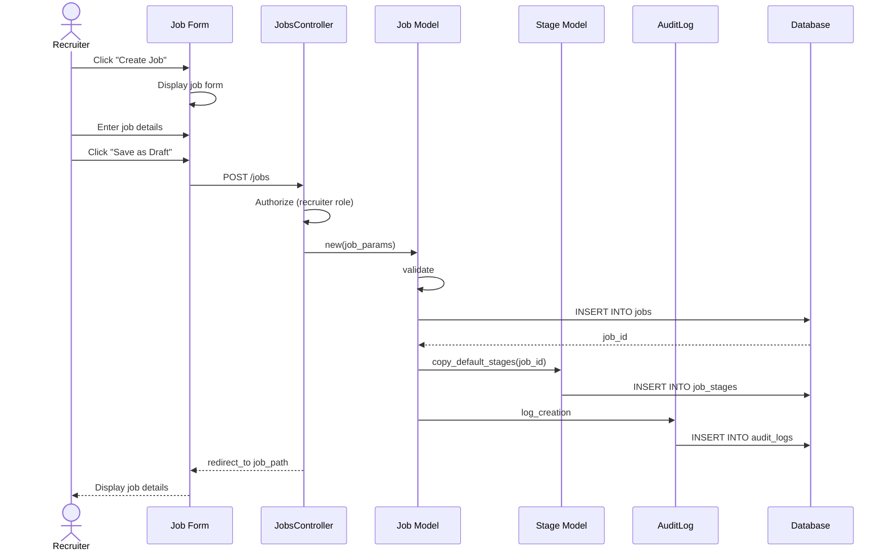

# UC-001: Create Job Requisition

## Metadata

| Attribute | Value |
|-----------|-------|
| **ID** | UC-001 |
| **Name** | Create Job Requisition |
| **Functional Area** | Job Requisition Management |
| **Primary Actor** | Recruiter (ACT-02) |
| **Priority** | P1 |
| **Complexity** | Medium |
| **Status** | Draft |

## Description

A recruiter creates a new job requisition containing the position details, requirements, compensation range, and hiring team assignments. The requisition starts in draft status and can be submitted for approval or opened directly based on organization settings.

## Actors

| Actor | Role in Use Case |
|-------|------------------|
| Recruiter (ACT-02) | Creates and configures the job requisition |
| System Administrator (ACT-01) | Configures default settings and templates |

## Preconditions

- [ ] User is authenticated and has Recruiter or Admin role
- [ ] User belongs to an organization with active subscription
- [ ] At least one department exists in the organization (optional but typical)

## Postconditions

### Success
- [ ] New Job record created with status = 'draft'
- [ ] Job assigned to organization
- [ ] Hiring manager and recruiter assigned (if specified)
- [ ] Default pipeline stages associated with job
- [ ] Audit log entry created

### Failure
- [ ] No job record created
- [ ] User shown validation errors
- [ ] No audit entry (nothing to audit)

## Triggers

- Recruiter clicks "Create Job" button from jobs list
- Recruiter clicks "New Requisition" from dashboard
- Recruiter clones an existing job (invokes UC-009 first, then this flow)

## Basic Flow



| Step | Actor | Action | System Response |
|------|-------|--------|-----------------|
| 1 | Recruiter | Clicks "Create Job" button | System displays job creation form |
| 2 | Recruiter | Enters job title | Title field populated |
| 3 | Recruiter | Selects department | Department dropdown populated |
| 4 | Recruiter | Enters job description (rich text) | Description editor captures content |
| 5 | Recruiter | Enters requirements (rich text) | Requirements editor captures content |
| 6 | Recruiter | Selects location type (onsite/remote/hybrid) | Location type set |
| 7 | Recruiter | Enters location (city, state, country) | Location fields populated |
| 8 | Recruiter | Selects employment type | Employment type set |
| 9 | Recruiter | Enters salary range (optional) | Salary min/max captured |
| 10 | Recruiter | Selects hiring manager | Hiring manager assigned |
| 11 | Recruiter | Confirms self as recruiter (or selects another) | Recruiter assigned |
| 12 | Recruiter | Clicks "Save as Draft" | System validates all fields |
| 13 | System | Validates required fields | Validation passes |
| 14 | System | Creates Job record | Job saved with status='draft' |
| 15 | System | Copies default stages to job | JobStages created |
| 16 | System | Creates audit log entry | Audit record saved |
| 17 | System | Redirects to job detail page | Job detail displayed |

## Alternative Flows

### AF-1: Save and Submit for Approval

**Trigger:** Recruiter clicks "Submit for Approval" instead of "Save as Draft" at step 12

| Step | Actor | Action | System Response |
|------|-------|--------|-----------------|
| 12a | Recruiter | Clicks "Submit for Approval" | System validates all fields |
| 13a | System | Creates Job with status='pending_approval' | Job saved |
| 14a | System | Creates JobApproval record | Approval request created |
| 15a | System | Notifies hiring manager | Email sent to hiring manager |
| 16a | System | Redirects to job detail | Shows "Pending Approval" status |

**Resumption:** Use case ends (triggers UC-004 for approver)

### AF-2: Save and Open Directly

**Trigger:** Organization settings allow direct open, recruiter clicks "Save and Open" at step 12

| Step | Actor | Action | System Response |
|------|-------|--------|-----------------|
| 12b | Recruiter | Clicks "Save and Open" | System validates all fields |
| 13b | System | Validates approval not required | Check passes |
| 14b | System | Creates Job with status='open' | Job saved as open |
| 15b | System | Sets opened_at timestamp | Timestamp recorded |
| 16b | System | Redirects to job detail | Shows "Open" status |

**Resumption:** Use case ends

### AF-3: Clone from Existing Job

**Trigger:** Recruiter started from "Clone" action on another job

| Step | Actor | Action | System Response |
|------|-------|--------|-----------------|
| 0a | Recruiter | Clicks "Clone" on existing job | System pre-populates form |
| 1a | System | Copies job fields to form | Form displayed with copied data |
| 2a | Recruiter | Modifies fields as needed | Fields updated |

**Resumption:** Continues at step 12 of basic flow

## Exception Flows

### EF-1: Validation Failure

**Trigger:** Required fields missing or invalid at step 13

| Step | Actor | Action | System Response |
|------|-------|--------|-----------------|
| 13.1 | System | Detects validation errors | Highlights invalid fields |
| 13.2 | System | Displays error messages | Shows specific errors |
| 13.3 | Recruiter | Corrects invalid fields | Fields updated |
| 13.4 | Recruiter | Resubmits form | System re-validates |

**Resolution:** Returns to step 13, continues if valid

### EF-2: Hiring Manager Not Found

**Trigger:** Selected hiring manager has been deactivated

| Step | Actor | Action | System Response |
|------|-------|--------|-----------------|
| 10.1 | System | Detects inactive user | Displays warning |
| 10.2 | Recruiter | Selects different hiring manager | New manager selected |

**Resolution:** Continues from step 11

### EF-3: Session Timeout

**Trigger:** User session expires during form entry

| Step | Actor | Action | System Response |
|------|-------|--------|-----------------|
| E.1 | System | Detects expired session | Saves form to local storage |
| E.2 | System | Redirects to login | Login page displayed |
| E.3 | Recruiter | Re-authenticates | Session restored |
| E.4 | System | Restores form data | Form repopulated |

**Resolution:** Continues from where user left off

## Business Rules

| ID | Rule | Description |
|----|------|-------------|
| BR-001.1 | Required Fields | Title and employment_type are always required |
| BR-001.2 | Approval Requirement | If org.require_job_approval = true, jobs cannot be opened without approval |
| BR-001.3 | Hiring Manager | Hiring manager must have hiring_manager or admin role |
| BR-001.4 | Salary Consistency | If salary_min provided, salary_max must be >= salary_min |
| BR-001.5 | Location Required | If location_type = 'onsite' or 'hybrid', location is required |
| BR-001.6 | Department Assignment | Job inherits department's default approvers if configured |

## Data Requirements

### Input Data

| Field | Type | Required | Validation |
|-------|------|----------|------------|
| title | string | Yes | Max 255 chars, not blank |
| description | text | No | Max 50,000 chars |
| requirements | text | No | Max 50,000 chars |
| department_id | integer | No | Must exist in org |
| location | string | Conditional | Required if not fully remote |
| location_type | enum | Yes | onsite, remote, hybrid |
| employment_type | enum | Yes | full_time, part_time, contract, intern |
| salary_min | integer | No | >= 0, in cents |
| salary_max | integer | No | >= salary_min, in cents |
| salary_currency | string | No | ISO 4217 code, default USD |
| hiring_manager_id | integer | No | Must be active user with HM role |
| recruiter_id | integer | No | Must be active user with recruiter role |

### Output Data

| Field | Type | Description |
|-------|------|-------------|
| id | integer | Unique job identifier |
| status | enum | 'draft' (default) |
| created_at | datetime | Timestamp of creation |
| organization_id | integer | Owning organization |

## Database Transactions

### Tables Affected

| Table | Operation | Conditions |
|-------|-----------|------------|
| jobs | CREATE | Always |
| job_stages | CREATE | Copy from org default stages |
| job_approvals | CREATE | If submitting for approval (AF-1) |
| audit_logs | CREATE | Always |

### Transaction Detail

```sql
-- Create Job Requisition Transaction
BEGIN TRANSACTION;

-- Step 1: Insert job record
INSERT INTO jobs (
    organization_id,
    department_id,
    title,
    description,
    requirements,
    location,
    location_type,
    employment_type,
    salary_min,
    salary_max,
    salary_currency,
    hiring_manager_id,
    recruiter_id,
    status,
    created_at,
    updated_at
) VALUES (
    @organization_id,
    @department_id,
    @title,
    @description,
    @requirements,
    @location,
    @location_type,
    @employment_type,
    @salary_min,
    @salary_max,
    @salary_currency,
    @hiring_manager_id,
    @recruiter_id,
    'draft',
    NOW(),
    NOW()
);

SET @job_id = LAST_INSERT_ID();

-- Step 2: Copy default stages from organization
INSERT INTO job_stages (job_id, stage_id, position, created_at, updated_at)
SELECT @job_id, id, position, NOW(), NOW()
FROM stages
WHERE organization_id = @organization_id
  AND is_default = true
ORDER BY position;

-- Step 3: Create audit log entry
INSERT INTO audit_logs (
    organization_id,
    user_id,
    action,
    auditable_type,
    auditable_id,
    metadata,
    ip_address,
    user_agent,
    created_at
) VALUES (
    @organization_id,
    @current_user_id,
    'job.created',
    'Job',
    @job_id,
    JSON_OBJECT(
        'title', @title,
        'status', 'draft',
        'hiring_manager_id', @hiring_manager_id,
        'recruiter_id', @recruiter_id
    ),
    @ip_address,
    @user_agent,
    NOW()
);

COMMIT;
```

### Alternative: Submit for Approval (AF-1)

```sql
-- Additional operations for AF-1
-- After main transaction, if submitting for approval:

UPDATE jobs SET status = 'pending_approval' WHERE id = @job_id;

INSERT INTO job_approvals (
    job_id,
    approver_id,
    status,
    created_at,
    updated_at
) VALUES (
    @job_id,
    @hiring_manager_id,
    'pending',
    NOW(),
    NOW()
);

INSERT INTO audit_logs (
    organization_id,
    user_id,
    action,
    auditable_type,
    auditable_id,
    metadata,
    created_at
) VALUES (
    @organization_id,
    @current_user_id,
    'job.submitted_for_approval',
    'Job',
    @job_id,
    JSON_OBJECT('approver_id', @hiring_manager_id),
    NOW()
);
```

### Rollback Scenarios

| Scenario | Rollback Action |
|----------|-----------------|
| Validation failure | No transaction started, return errors |
| Stage copy failure | Full rollback, delete job if created |
| Audit log failure | Log error but commit job (non-critical) |

## UI/UX Requirements

### Screen/Component

- **Location:** /jobs/new
- **Entry Point:**
  - "Create Job" button on /jobs
  - "New Requisition" card on dashboard
  - "Clone" action on existing job
- **Key Elements:**
  - Rich text editors for description/requirements
  - User picker for hiring manager/recruiter
  - Department dropdown with search
  - Salary range inputs with currency selector
  - Location type radio buttons
  - Action buttons: "Save as Draft", "Submit for Approval", "Cancel"

### Form Layout

```
┌─────────────────────────────────────────────────────────┐
│ Create Job Requisition                                  │
├─────────────────────────────────────────────────────────┤
│ Job Title *                                             │
│ ┌─────────────────────────────────────────────────────┐ │
│ │                                                     │ │
│ └─────────────────────────────────────────────────────┘ │
│                                                         │
│ Department                  Employment Type *           │
│ ┌───────────────────┐       ○ Full-time                │
│ │ Select...       ▼ │       ○ Part-time                │
│ └───────────────────┘       ○ Contract                 │
│                             ○ Intern                    │
│                                                         │
│ Location Type *                                         │
│ ○ On-site  ○ Remote  ○ Hybrid                          │
│                                                         │
│ Location                                                │
│ ┌─────────────────────────────────────────────────────┐ │
│ │ City, State, Country                                │ │
│ └─────────────────────────────────────────────────────┘ │
│                                                         │
│ Salary Range (optional)                                 │
│ ┌──────────┐  to  ┌──────────┐  ┌─────┐               │
│ │ Min      │      │ Max      │  │ USD │               │
│ └──────────┘      └──────────┘  └─────┘               │
│                                                         │
│ Job Description                                         │
│ ┌─────────────────────────────────────────────────────┐ │
│ │ [Rich Text Editor]                                  │ │
│ │                                                     │ │
│ └─────────────────────────────────────────────────────┘ │
│                                                         │
│ Requirements                                            │
│ ┌─────────────────────────────────────────────────────┐ │
│ │ [Rich Text Editor]                                  │ │
│ │                                                     │ │
│ └─────────────────────────────────────────────────────┘ │
│                                                         │
│ Hiring Team                                             │
│ Hiring Manager    ┌─────────────────────────────────┐  │
│                   │ Search users...               ▼ │  │
│                   └─────────────────────────────────┘  │
│                                                         │
│ Recruiter         ┌─────────────────────────────────┐  │
│                   │ You (default)                 ▼ │  │
│                   └─────────────────────────────────┘  │
│                                                         │
├─────────────────────────────────────────────────────────┤
│ [Cancel]            [Save as Draft]  [Submit for Approval] │
└─────────────────────────────────────────────────────────┘
```

## Non-Functional Requirements

| Requirement | Target |
|-------------|--------|
| Response Time | Form load < 1s, save < 2s |
| Availability | 99.9% |
| Autosave | Every 30 seconds while editing |

## Security Considerations

- [x] Authentication required
- [x] Authorization check: User must have recruiter or admin role
- [x] Organization scoping: Job created within user's organization only
- [x] Audit logging: Creation logged with user, timestamp, IP

## Related Use Cases

| Use Case | Relationship |
|----------|--------------|
| UC-002 Edit Job Requisition | Can follow to modify job |
| UC-003 Submit for Approval | Alternative flow triggers this |
| UC-004 Approve Requisition | Follows if submitted for approval |
| UC-006 Open Job | Follows when ready to accept applications |
| UC-009 Clone Job | Can precede this (provides initial data) |
| UC-010 Configure Job Stages | Can follow to customize stages |

---

## Data Model References

> Cross-references to [DATA_MODEL.md](../DATA_MODEL.md) and [CRUD_MATRIX.md](../CRUD_MATRIX.md)

### Subject Areas

| Subject Area | ID | Relationship |
|--------------|-----|--------------|
| Job Requisition | SA-03 | Primary |
| Organization | SA-02 | Secondary |
| Compliance & Audit | SA-09 | Reference |

### Entities CRUD

| Entity | C | R | U | D | Notes |
|--------|---|---|---|---|-------|
| Job | ✓ | | | | Created as draft in step 14 |
| JobStage | ✓ | | | | Copied from default stages in step 15 |
| JobApproval | ✓ | | | | Created in AF-1 when submitting for approval |
| Stage | | ✓ | | | Read to get default stages |
| Department | | ✓ | | | Read to populate dropdown |
| User | | ✓ | | | Read for hiring manager/recruiter selection |
| AuditLog | ✓ | | | | Created in step 16 |

**Legend:** C = Create, R = Read, U = Update, D = Delete

---

## Process Model References

> Cross-references to [PROCESS_MODEL.md](../PROCESS_MODEL.md) and [PROCESS_CRUD_MATRIX.md](../PROCESS_CRUD_MATRIX.md)

| Attribute | Value | Link |
|-----------|-------|------|
| **Elementary Business Process** | EP-0101: Create Job Requisition | [PROCESS_MODEL.md#ep-0101](../PROCESS_MODEL.md#ep-0101-create-job-requisition) |
| **Business Process** | BP-101: Requisition Management | [PROCESS_MODEL.md#bp-101](../PROCESS_MODEL.md#bp-101-requisition-management) |
| **Business Function** | BF-01: Talent Acquisition | [PROCESS_MODEL.md#bf-01](../PROCESS_MODEL.md#bf-01-talent-acquisition) |

### EBP Details

| Attribute | Value |
|-----------|-------|
| **Trigger** | Recruiter initiates job creation from jobs list or dashboard |
| **Input** | Job details (title, description, requirements, compensation, hiring team) |
| **Output** | New Job record in draft status with associated stages |
| **Business Rules** | BR-001.1 through BR-001.6 (see Business Rules section) |

---

## Traceability Matrix

> Complete artifact mapping for requirements traceability

| Artifact Type | ID | Name | Link |
|---------------|-----|------|------|
| **Use Case** | UC-001 | Create Job Requisition | *(this document)* |
| **Elementary Process** | EP-0101 | Create Job Requisition | [PROCESS_MODEL.md](../PROCESS_MODEL.md#ep-0101-create-job-requisition) |
| **Business Process** | BP-101 | Requisition Management | [PROCESS_MODEL.md](../PROCESS_MODEL.md#bp-101-requisition-management) |
| **Business Function** | BF-01 | Talent Acquisition | [PROCESS_MODEL.md](../PROCESS_MODEL.md#bf-01-talent-acquisition) |
| **Primary Actor** | ACT-02 | Recruiter | [ACTORS.md](../ACTORS.md#act-02-recruiter) |
| **Subject Area (Primary)** | SA-03 | Job Requisition | [DATA_MODEL.md](../DATA_MODEL.md#sa-03-job-requisition) |
| **Subject Area (Secondary)** | SA-02 | Organization | [DATA_MODEL.md](../DATA_MODEL.md#sa-02-organization) |
| **CRUD Matrix Row** | UC-001 | - | [CRUD_MATRIX.md](../CRUD_MATRIX.md#uc-001) |
| **Process CRUD Row** | EP-0101 | - | [PROCESS_CRUD_MATRIX.md](../PROCESS_CRUD_MATRIX.md#ep-0101) |

### Implementation Artifacts

| Artifact Type | Path/Reference | Status |
|---------------|----------------|--------|
| Controller | `app/controllers/admin/jobs_controller.rb` | Implemented |
| Model | `app/models/job.rb` | Implemented |
| Service | `app/services/jobs/create_service.rb` | Implemented |
| Policy | `app/policies/job_policy.rb` | Implemented |
| View | `app/views/admin/jobs/new.html.erb` | Implemented |
| Test | `test/controllers/admin/jobs_controller_test.rb` | Implemented |

---

## Open Questions

1. Should job descriptions support markdown or HTML?
2. What is the maximum number of custom fields per job?
3. Should we support job templates beyond cloning?

## Change History

| Version | Date | Author | Changes |
|---------|------|--------|---------|
| 0.1 | 2026-01-19 | System | Initial draft |
