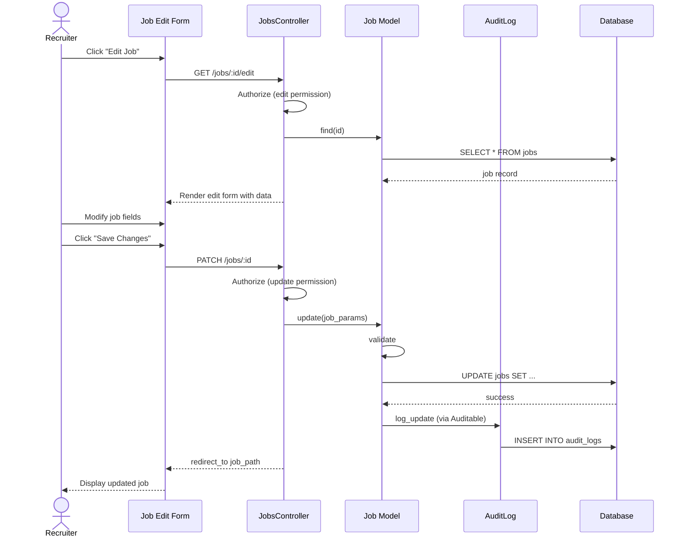

# UC-002: Edit Job Requisition

## Metadata

| Attribute | Value |
|-----------|-------|
| **ID** | UC-002 |
| **Name** | Edit Job Requisition |
| **Functional Area** | Job Requisition Management |
| **Primary Actor** | Recruiter (ACT-02) |
| **Priority** | P1 |
| **Complexity** | Medium |
| **Status** | Draft |

## Description

A recruiter or hiring manager modifies an existing job requisition to update position details, requirements, compensation, or hiring team assignments. Jobs can be edited in draft, pending_approval, or open status, with different restrictions based on current state.

## Actors

| Actor | Role in Use Case |
|-------|------------------|
| Recruiter (ACT-02) | Primary editor of job requisitions |
| Hiring Manager (ACT-03) | Can edit jobs they manage |
| System Administrator (ACT-01) | Can edit any job in the organization |

## Preconditions

- [ ] User is authenticated and has Recruiter, Hiring Manager, or Admin role
- [ ] User belongs to the same organization as the job
- [ ] Job exists and is not in closed status
- [ ] User has edit permission for the specific job (owner, hiring manager, or admin)

## Postconditions

### Success
- [ ] Job record updated with new values
- [ ] Audit log entry created with changes recorded
- [ ] If job has active applications and stages changed, appropriate notifications sent

### Failure
- [ ] Job record unchanged
- [ ] User shown validation errors
- [ ] No audit entry created

## Triggers

- Recruiter clicks "Edit" button on job detail page
- Recruiter clicks "Edit" action from jobs list
- User navigates directly to /admin/jobs/:id/edit

## Basic Flow



| Step | Actor | Action | System Response |
|------|-------|--------|-----------------|
| 1 | Recruiter | Clicks "Edit" on job | System loads edit form |
| 2 | System | Verifies edit permission | Authorization passes |
| 3 | System | Displays form with current values | Form populated |
| 4 | Recruiter | Modifies job title | Field updated |
| 5 | Recruiter | Updates job description | Rich text editor saves content |
| 6 | Recruiter | Changes salary range | Salary fields updated |
| 7 | Recruiter | Modifies requirements | Requirements updated |
| 8 | Recruiter | Changes hiring manager | New manager assigned |
| 9 | Recruiter | Clicks "Save Changes" | System validates all fields |
| 10 | System | Validates required fields | Validation passes |
| 11 | System | Updates Job record | Job saved |
| 12 | System | Creates audit log entry | Changes recorded |
| 13 | System | Redirects to job detail | Updated job displayed |

## Alternative Flows

### AF-1: Edit Job in Pending Approval Status

**Trigger:** Job is in pending_approval status when edit initiated

| Step | Actor | Action | System Response |
|------|-------|--------|-----------------|
| 2a | System | Detects pending_approval status | Displays warning banner |
| 2b | System | Shows "Changes will reset approval" notice | User informed |
| 9a | System | Resets approval to pending | JobApproval status reset |
| 9b | System | Notifies approver of changes | Email sent to hiring manager |

**Resumption:** Continues at step 10 of basic flow

### AF-2: Edit Open Job

**Trigger:** Job is in open status with active applications

| Step | Actor | Action | System Response |
|------|-------|--------|-----------------|
| 2c | System | Detects open status with applications | Shows warning about active candidates |
| 2d | System | Restricts stage modifications | Stage section read-only |
| 9c | System | Updates job without affecting applications | Applications unchanged |

**Resumption:** Continues at step 10 of basic flow

### AF-3: Quick Edit from List

**Trigger:** Recruiter uses inline edit on jobs list

| Step | Actor | Action | System Response |
|------|-------|--------|-----------------|
| 1a | Recruiter | Clicks inline edit icon | Modal form appears |
| 2a | System | Loads minimal edit form | Title, status fields shown |
| 3a | Recruiter | Makes quick changes | Fields updated |
| 4a | System | Saves via AJAX | List refreshes with changes |

**Resumption:** Use case ends

## Exception Flows

### EF-1: Validation Failure

**Trigger:** Required fields missing or invalid at step 10

| Step | Actor | Action | System Response |
|------|-------|--------|-----------------|
| 10.1 | System | Detects validation errors | Highlights invalid fields |
| 10.2 | System | Displays error messages | Shows specific errors |
| 10.3 | Recruiter | Corrects invalid fields | Fields updated |
| 10.4 | Recruiter | Resubmits form | System re-validates |

**Resolution:** Returns to step 10, continues if valid

### EF-2: Concurrent Edit Conflict

**Trigger:** Another user modified the job while editing

| Step | Actor | Action | System Response |
|------|-------|--------|-----------------|
| E.1 | System | Detects stale record (updated_at mismatch) | Displays conflict warning |
| E.2 | System | Shows both versions | User can compare changes |
| E.3 | Recruiter | Chooses to overwrite or reload | Action executed |

**Resolution:** Either saves with new data or reloads fresh copy

### EF-3: Unauthorized Edit Attempt

**Trigger:** User lacks edit permission for job

| Step | Actor | Action | System Response |
|------|-------|--------|-----------------|
| E.1 | System | Authorization check fails | Displays access denied |
| E.2 | System | Redirects to job detail (read-only) | Job shown without edit option |

**Resolution:** User must request access from job owner

## Business Rules

| ID | Rule | Description |
|----|------|-------------|
| BR-002.1 | Edit Permission | User must be job recruiter, hiring manager, or admin to edit |
| BR-002.2 | Closed Job Restriction | Jobs in closed status cannot be edited (must clone) |
| BR-002.3 | Approval Reset | Editing a pending_approval job resets approval status |
| BR-002.4 | Stage Lock | Cannot modify stages for jobs with active applications |
| BR-002.5 | Title Required | Title cannot be changed to blank |
| BR-002.6 | Salary Consistency | If salary_min changed, must remain <= salary_max |

## Data Requirements

### Input Data

| Field | Type | Required | Validation |
|-------|------|----------|------------|
| title | string | Yes | Max 255 chars, not blank |
| description | text | No | Max 50,000 chars |
| requirements | text | No | Max 50,000 chars |
| department_id | integer | No | Must exist in org |
| location | string | Conditional | Required if not fully remote |
| location_type | enum | Yes | onsite, remote, hybrid |
| employment_type | enum | Yes | full_time, part_time, contract, intern |
| salary_min | integer | No | >= 0, in cents |
| salary_max | integer | No | >= salary_min, in cents |
| salary_currency | string | No | ISO 4217 code |
| hiring_manager_id | integer | No | Must be active user with HM role |
| recruiter_id | integer | No | Must be active user with recruiter role |
| headcount | integer | Yes | >= 1 |

### Output Data

| Field | Type | Description |
|-------|------|-------------|
| id | integer | Job identifier (unchanged) |
| updated_at | datetime | Timestamp of last update |
| previous_values | json | Audit log captures old values |

## Database Transactions

### Tables Affected

| Table | Operation | Conditions |
|-------|-----------|------------|
| jobs | UPDATE | Always |
| job_approvals | UPDATE | If status was pending_approval |
| audit_logs | CREATE | Always |

### Transaction Detail

```sql
-- Edit Job Requisition Transaction
BEGIN TRANSACTION;

-- Step 1: Update job record
UPDATE jobs SET
    title = @title,
    description = @description,
    requirements = @requirements,
    department_id = @department_id,
    location = @location,
    location_type = @location_type,
    employment_type = @employment_type,
    salary_min = @salary_min,
    salary_max = @salary_max,
    salary_currency = @salary_currency,
    hiring_manager_id = @hiring_manager_id,
    recruiter_id = @recruiter_id,
    headcount = @headcount,
    updated_at = NOW()
WHERE id = @job_id
  AND organization_id = @organization_id;

-- Step 2: Create audit log entry with changes
INSERT INTO audit_logs (
    organization_id,
    user_id,
    action,
    auditable_type,
    auditable_id,
    metadata,
    recorded_changes,
    ip_address,
    user_agent,
    created_at
) VALUES (
    @organization_id,
    @current_user_id,
    'job.updated',
    'Job',
    @job_id,
    JSON_OBJECT('title', @title),
    JSON_OBJECT(
        'title', JSON_ARRAY(@old_title, @title),
        'description', JSON_ARRAY(@old_description, @description),
        'salary_min', JSON_ARRAY(@old_salary_min, @salary_min)
    ),
    @ip_address,
    @user_agent,
    NOW()
);

COMMIT;
```

### Alternative: Reset Approval (AF-1)

```sql
-- Additional operations when editing pending_approval job
UPDATE job_approvals
SET status = 'pending',
    decided_at = NULL,
    notes = 'Reset due to job edit'
WHERE job_id = @job_id
  AND status = 'pending';

INSERT INTO audit_logs (
    organization_id,
    user_id,
    action,
    auditable_type,
    auditable_id,
    metadata,
    created_at
) VALUES (
    @organization_id,
    @current_user_id,
    'job.approval_reset',
    'Job',
    @job_id,
    JSON_OBJECT('reason', 'Job edited while pending approval'),
    NOW()
);
```

### Rollback Scenarios

| Scenario | Rollback Action |
|----------|-----------------|
| Validation failure | No transaction started, return errors |
| Concurrent edit detected | Abort transaction, show conflict |
| Audit log failure | Log error but commit job update (non-critical) |

## UI/UX Requirements

### Screen/Component

- **Location:** /admin/jobs/:id/edit
- **Entry Point:**
  - "Edit" button on job detail page
  - "Edit" action in jobs list dropdown
  - Inline edit icons on jobs list
- **Key Elements:**
  - Same form layout as create (UC-001)
  - "Last modified by" info shown
  - Warning banner if job has applications
  - Change history link
  - Action buttons: "Save Changes", "Cancel"

### Form Layout

```
+-------------------------------------------------------------+
| Edit Job Requisition                                         |
| Last modified by Jane Doe on Jan 20, 2026 at 3:45 PM        |
+-------------------------------------------------------------+
| [!] This job has 12 active applications. Some fields are    |
|     restricted to prevent pipeline disruption.               |
+-------------------------------------------------------------+
| Job Title *                                                  |
| +----------------------------------------------------------+ |
| | Senior Software Engineer                                  | |
| +----------------------------------------------------------+ |
|                                                              |
| [Rest of form same as UC-001]                               |
|                                                              |
+-------------------------------------------------------------+
| [Cancel]                                     [Save Changes]  |
+-------------------------------------------------------------+
```

## Non-Functional Requirements

| Requirement | Target |
|-------------|--------|
| Response Time | Form load < 1s, save < 2s |
| Availability | 99.9% |
| Autosave | Every 30 seconds while editing |
| Optimistic Locking | Detect concurrent edits |

## Security Considerations

- [x] Authentication required
- [x] Authorization check: User must have edit permission for this job
- [x] Organization scoping: Can only edit jobs in user's organization
- [x] Audit logging: All changes logged with before/after values
- [x] Optimistic locking: Prevents accidental overwrites

## Related Use Cases

| Use Case | Relationship |
|----------|--------------|
| UC-001 Create Job Requisition | Precedes this - job must exist |
| UC-003 Submit for Approval | Can follow if changes complete |
| UC-004 Approve Requisition | May need re-approval after edit |
| UC-006 Open Job | Can follow after editing |
| UC-010 Configure Job Stages | May invoke to adjust stages |

---

## Data Model References

> Cross-references to [DATA_MODEL.md](../DATA_MODEL.md) and [CRUD_MATRIX.md](../CRUD_MATRIX.md)

### Subject Areas

| Subject Area | ID | Relationship |
|--------------|-----|--------------|
| Job Requisition | SA-03 | Primary |
| Organization | SA-02 | Secondary |
| Compliance & Audit | SA-09 | Reference |

### Entities CRUD

| Entity | C | R | U | D | Notes |
|--------|---|---|---|---|-------|
| Job | | ✓ | ✓ | | Read to load form, update on save |
| JobApproval | | ✓ | ✓ | | May reset if pending_approval |
| Department | | ✓ | | | Read for dropdown |
| User | | ✓ | | | Read for hiring manager/recruiter |
| AuditLog | ✓ | | | | Created with change details |

**Legend:** C = Create, R = Read, U = Update, D = Delete

---

## Process Model References

> Cross-references to [PROCESS_MODEL.md](../PROCESS_MODEL.md) and [PROCESS_CRUD_MATRIX.md](../PROCESS_CRUD_MATRIX.md)

| Attribute | Value | Link |
|-----------|-------|------|
| **Elementary Business Process** | EP-0102: Edit Requisition | [PROCESS_MODEL.md#ep-0102](../PROCESS_MODEL.md#elementary-business-processes) |
| **Business Process** | BP-101: Requisition Management | [PROCESS_MODEL.md#bp-101](../PROCESS_MODEL.md#bp-101-requisition-management) |
| **Business Function** | BF-01: Talent Acquisition | [PROCESS_MODEL.md#bf-01](../PROCESS_MODEL.md#bf-01-talent-acquisition) |

### EBP Details

| Attribute | Value |
|-----------|-------|
| **Trigger** | User initiates edit from job detail or list |
| **Input** | Modified job details |
| **Output** | Updated Job record with audit trail |
| **Business Rules** | BR-002.1 through BR-002.6 (see Business Rules section) |

---

## Traceability Matrix

> Complete artifact mapping for requirements traceability

| Artifact Type | ID | Name | Link |
|---------------|-----|------|------|
| **Use Case** | UC-002 | Edit Job Requisition | *(this document)* |
| **Elementary Process** | EP-0102 | Edit Requisition | [PROCESS_MODEL.md](../PROCESS_MODEL.md#elementary-business-processes) |
| **Business Process** | BP-101 | Requisition Management | [PROCESS_MODEL.md](../PROCESS_MODEL.md#bp-101-requisition-management) |
| **Business Function** | BF-01 | Talent Acquisition | [PROCESS_MODEL.md](../PROCESS_MODEL.md#bf-01-talent-acquisition) |
| **Primary Actor** | ACT-02 | Recruiter | [ACTORS.md](../ACTORS.md#act-02-recruiter) |
| **Subject Area (Primary)** | SA-03 | Job Requisition | [DATA_MODEL.md](../DATA_MODEL.md#sa-03-job-requisition) |
| **Subject Area (Secondary)** | SA-02 | Organization | [DATA_MODEL.md](../DATA_MODEL.md#sa-02-organization) |
| **CRUD Matrix Row** | UC-002 | - | [CRUD_MATRIX.md](../CRUD_MATRIX.md#uc-002) |
| **Process CRUD Row** | EP-0102 | - | [PROCESS_CRUD_MATRIX.md](../PROCESS_CRUD_MATRIX.md#ep-0102) |

### Implementation Artifacts

| Artifact Type | Path/Reference | Status |
|---------------|----------------|--------|
| Controller | `app/controllers/admin/jobs_controller.rb#edit,update` | Implemented |
| Model | `app/models/job.rb` | Implemented |
| Policy | `app/policies/job_policy.rb#update?` | Implemented |
| View | `app/views/admin/jobs/edit.html.erb` | Implemented |
| Test | `test/controllers/admin/jobs_controller_test.rb` | Implemented |

---

## Open Questions

1. Should we track revision history (versioning) for job descriptions?
2. What notification should hiring managers receive when their job is edited?
3. Should there be approval workflow for editing open jobs?

## Change History

| Version | Date | Author | Changes |
|---------|------|--------|---------|
| 0.1 | 2026-01-25 | System | Initial draft |
