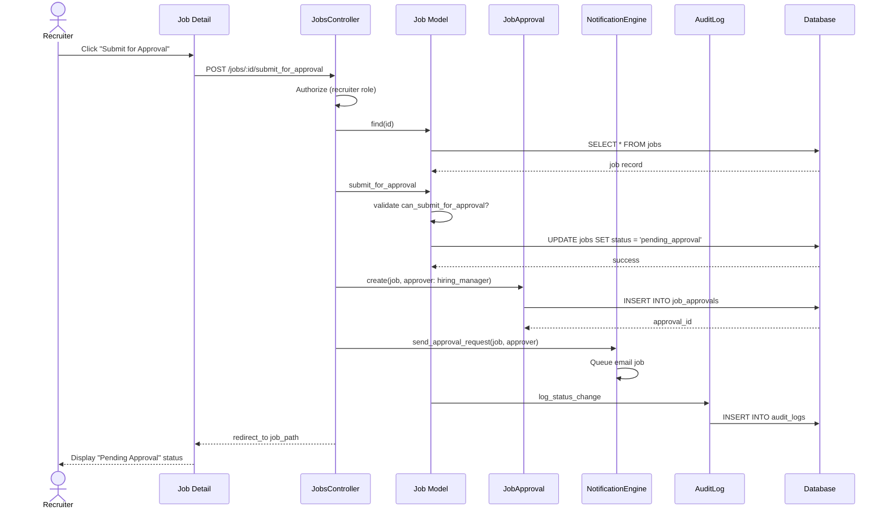

# UC-003: Submit for Approval

## Metadata

| Attribute | Value |
|-----------|-------|
| **ID** | UC-003 |
| **Name** | Submit for Approval |
| **Functional Area** | Job Requisition Management |
| **Primary Actor** | Recruiter (ACT-02) |
| **Priority** | P1 |
| **Complexity** | Low |
| **Status** | Draft |

## Description

A recruiter submits a draft job requisition to the designated approver (typically the hiring manager) for review and approval before the job can be opened for applications. This initiates the approval workflow and notifies the approver.

## Actors

| Actor | Role in Use Case |
|-------|------------------|
| Recruiter (ACT-02) | Submits the requisition for approval |
| Hiring Manager (ACT-03) | Designated approver who receives notification |
| System (ACT-11) | Sends notification emails |

## Preconditions

- [ ] User is authenticated and has Recruiter or Admin role
- [ ] Job exists and is in draft status
- [ ] Job has a hiring manager assigned
- [ ] User has permission to submit this job (recruiter or admin)
- [ ] All required fields are populated (title, employment_type, location_type)

## Postconditions

### Success
- [ ] Job status changed to pending_approval
- [ ] JobApproval record created with status = pending
- [ ] Hiring manager notified via email
- [ ] Audit log entry created
- [ ] Job detail page shows pending approval status

### Failure
- [ ] Job remains in draft status
- [ ] No JobApproval record created
- [ ] User shown error message

## Triggers

- Recruiter clicks "Submit for Approval" button on job detail page
- Recruiter clicks "Submit for Approval" during job creation (UC-001 AF-1)
- Recruiter selects "Submit for Approval" from job actions dropdown

## Basic Flow



| Step | Actor | Action | System Response |
|------|-------|--------|-----------------|
| 1 | Recruiter | Clicks "Submit for Approval" | System receives request |
| 2 | System | Authorizes user action | Permission verified |
| 3 | System | Loads job record | Job retrieved |
| 4 | System | Validates job can be submitted | Checks status = draft |
| 5 | System | Validates hiring manager assigned | Hiring manager present |
| 6 | System | Transitions job to pending_approval | Status updated |
| 7 | System | Creates JobApproval record | Approval request created |
| 8 | System | Queues notification email | Email job enqueued |
| 9 | System | Creates audit log entry | Action recorded |
| 10 | System | Redirects to job detail | Shows pending status |

## Alternative Flows

### AF-1: Multi-Level Approval

**Trigger:** Organization requires multiple approvers (configured in department)

| Step | Actor | Action | System Response |
|------|-------|--------|-----------------|
| 7a | System | Retrieves approval chain from department | Gets ordered approvers |
| 7b | System | Creates JobApproval for first approver | sequence = 1 |
| 7c | System | Creates pending approvals for subsequent | sequence = 2, 3... |
| 8a | System | Notifies only first approver | Others wait their turn |

**Resumption:** Continues at step 9 of basic flow

### AF-2: Submit Without Hiring Manager

**Trigger:** Job has no hiring manager assigned but organization allows self-approval

| Step | Actor | Action | System Response |
|------|-------|--------|-----------------|
| 5a | System | Detects no hiring manager | Checks org settings |
| 5b | System | Allows self-approval mode | Recruiter is approver |
| 7a | System | Creates JobApproval with recruiter | Recruiter must approve |

**Resumption:** Continues at step 8 of basic flow

### AF-3: Direct Open (No Approval Required)

**Trigger:** Organization setting require_job_approval = false

| Step | Actor | Action | System Response |
|------|-------|--------|-----------------|
| 4a | System | Checks org.require_job_approval | Returns false |
| 4b | System | Skips approval workflow | Proceeds to open |
| 4c | System | Transitions directly to open | job.open! called |

**Resumption:** Use case ends (triggers UC-006)

## Exception Flows

### EF-1: No Hiring Manager Assigned

**Trigger:** Job has no hiring_manager_id and organization requires approval

| Step | Actor | Action | System Response |
|------|-------|--------|-----------------|
| E.1 | System | Detects missing hiring manager | Validation fails |
| E.2 | System | Displays error message | "Please assign a hiring manager" |
| E.3 | Recruiter | Clicks edit to assign manager | Edit form opens |
| E.4 | Recruiter | Assigns hiring manager | Manager selected |
| E.5 | Recruiter | Resubmits for approval | Process restarts |

**Resolution:** Returns to step 1 after manager assigned

### EF-2: Invalid Job Status

**Trigger:** Job is not in draft status

| Step | Actor | Action | System Response |
|------|-------|--------|-----------------|
| E.1 | System | Detects non-draft status | State machine error |
| E.2 | System | Displays status error | "Job must be in draft status" |

**Resolution:** Recruiter must address current status first

### EF-3: Notification Failure

**Trigger:** Email service unavailable

| Step | Actor | Action | System Response |
|------|-------|--------|-----------------|
| E.1 | System | Email delivery fails | Queues for retry |
| E.2 | System | Logs notification error | Error recorded |
| E.3 | System | Continues with approval creation | Job still pending |
| E.4 | System | Retries notification later | Background job retries |

**Resolution:** Job submitted, notification sent when service recovers

## Business Rules

| ID | Rule | Description |
|----|------|-------------|
| BR-003.1 | Draft Status Required | Job must be in draft status to submit |
| BR-003.2 | Approver Required | Job must have hiring_manager assigned unless org allows self-approval |
| BR-003.3 | Required Fields | All required job fields must be populated |
| BR-003.4 | Single Pending Approval | Only one pending approval chain per job at a time |
| BR-003.5 | Approval Notification | Approver must be notified within 5 minutes of submission |

## Data Requirements

### Input Data

| Field | Type | Required | Validation |
|-------|------|----------|------------|
| job_id | integer | Yes | Must exist and be in draft |
| notes | text | No | Optional message to approver |

### Output Data

| Field | Type | Description |
|-------|------|-------------|
| job.status | enum | Changed to 'pending_approval' |
| job_approval.id | integer | New approval request ID |
| job_approval.status | enum | Set to 'pending' |
| job_approval.approver_id | integer | Hiring manager ID |

## Database Transactions

### Tables Affected

| Table | Operation | Conditions |
|-------|-----------|------------|
| jobs | UPDATE | status -> pending_approval |
| job_approvals | CREATE | New approval request |
| audit_logs | CREATE | Status change recorded |

### Transaction Detail

```sql
-- Submit for Approval Transaction
BEGIN TRANSACTION;

-- Step 1: Update job status
UPDATE jobs
SET status = 'pending_approval',
    updated_at = NOW()
WHERE id = @job_id
  AND organization_id = @organization_id
  AND status = 'draft';

-- Verify update happened (optimistic check)
IF ROW_COUNT() = 0 THEN
    ROLLBACK;
    SIGNAL SQLSTATE '45000' SET MESSAGE_TEXT = 'Job not in draft status';
END IF;

-- Step 2: Create approval request
INSERT INTO job_approvals (
    job_id,
    approver_id,
    status,
    sequence,
    created_at,
    updated_at
) VALUES (
    @job_id,
    @hiring_manager_id,
    'pending',
    1,
    NOW(),
    NOW()
);

-- Step 3: Create audit log entry
INSERT INTO audit_logs (
    organization_id,
    user_id,
    action,
    auditable_type,
    auditable_id,
    metadata,
    recorded_changes,
    created_at
) VALUES (
    @organization_id,
    @current_user_id,
    'job.submitted_for_approval',
    'Job',
    @job_id,
    JSON_OBJECT(
        'approver_id', @hiring_manager_id,
        'approver_name', @hiring_manager_name
    ),
    JSON_OBJECT('status', JSON_ARRAY('draft', 'pending_approval')),
    NOW()
);

COMMIT;

-- Step 4: Queue notification (outside transaction)
INSERT INTO solid_queue_jobs (
    queue_name,
    class_name,
    arguments,
    scheduled_at
) VALUES (
    'mailers',
    'ApprovalMailer',
    JSON_OBJECT('job_id', @job_id, 'approver_id', @hiring_manager_id),
    NOW()
);
```

### Rollback Scenarios

| Scenario | Rollback Action |
|----------|-----------------|
| Status transition fails | Full rollback, job stays draft |
| Approval creation fails | Full rollback, job stays draft |
| Notification failure | No rollback - job submitted, retry notification |

## UI/UX Requirements

### Screen/Component

- **Location:** /admin/jobs/:id (detail page action)
- **Entry Point:**
  - "Submit for Approval" button on job detail
  - Job actions dropdown menu
- **Key Elements:**
  - Confirmation dialog before submission
  - Approver name shown in dialog
  - Optional notes field for context
  - Success toast notification

### Confirmation Dialog

```
+-----------------------------------------------+
| Submit for Approval                           |
+-----------------------------------------------+
| Are you sure you want to submit this job      |
| for approval?                                 |
|                                               |
| Approver: Jane Smith (Hiring Manager)         |
|                                               |
| Notes to approver (optional):                 |
| +-------------------------------------------+ |
| |                                           | |
| +-------------------------------------------+ |
|                                               |
| [Cancel]                    [Submit]          |
+-----------------------------------------------+
```

### Status Banner (After Submission)

```
+-----------------------------------------------+
| [!] Pending Approval                          |
| Waiting for approval from Jane Smith          |
| Submitted by John Doe on Jan 25, 2026         |
+-----------------------------------------------+
```

## Non-Functional Requirements

| Requirement | Target |
|-------------|--------|
| Response Time | < 1 second for status change |
| Notification Delivery | Within 5 minutes |
| Availability | 99.9% |

## Security Considerations

- [x] Authentication required
- [x] Authorization check: User must be job recruiter or admin
- [x] Organization scoping: Can only submit jobs in user's organization
- [x] Audit logging: Submission action logged with approver details

## Related Use Cases

| Use Case | Relationship |
|----------|--------------|
| UC-001 Create Job Requisition | Can trigger this via AF-1 |
| UC-002 Edit Job Requisition | May precede this |
| UC-004 Approve Requisition | Follows this (approver action) |
| UC-005 Reject Requisition | Alternative follow (rejection) |
| UC-006 Open Job | Follows after approval |

---

## Data Model References

> Cross-references to [DATA_MODEL.md](../DATA_MODEL.md) and [CRUD_MATRIX.md](../CRUD_MATRIX.md)

### Subject Areas

| Subject Area | ID | Relationship |
|--------------|-----|--------------|
| Job Requisition | SA-03 | Primary |
| Communication | SA-10 | Secondary |
| Compliance & Audit | SA-09 | Reference |

### Entities CRUD

| Entity | C | R | U | D | Notes |
|--------|---|---|---|---|-------|
| Job | | ✓ | ✓ | | Read to verify, update status |
| JobApproval | ✓ | | | | Created for approval workflow |
| User | | ✓ | | | Read to get approver details |
| AuditLog | ✓ | | | | Created for status change |

**Legend:** C = Create, R = Read, U = Update, D = Delete

---

## Process Model References

> Cross-references to [PROCESS_MODEL.md](../PROCESS_MODEL.md) and [PROCESS_CRUD_MATRIX.md](../PROCESS_CRUD_MATRIX.md)

| Attribute | Value | Link |
|-----------|-------|------|
| **Elementary Business Process** | EP-0103: Submit for Approval | [PROCESS_MODEL.md#ep-0103](../PROCESS_MODEL.md#elementary-business-processes) |
| **Business Process** | BP-101: Requisition Management | [PROCESS_MODEL.md#bp-101](../PROCESS_MODEL.md#bp-101-requisition-management) |
| **Business Function** | BF-01: Talent Acquisition | [PROCESS_MODEL.md#bf-01](../PROCESS_MODEL.md#bf-01-talent-acquisition) |

### EBP Details

| Attribute | Value |
|-----------|-------|
| **Trigger** | Recruiter initiates approval request |
| **Input** | Draft job with hiring manager assigned |
| **Output** | Job in pending_approval status, approval request created |
| **Business Rules** | BR-003.1 through BR-003.5 (see Business Rules section) |

---

## Traceability Matrix

> Complete artifact mapping for requirements traceability

| Artifact Type | ID | Name | Link |
|---------------|-----|------|------|
| **Use Case** | UC-003 | Submit for Approval | *(this document)* |
| **Elementary Process** | EP-0103 | Submit for Approval | [PROCESS_MODEL.md](../PROCESS_MODEL.md#elementary-business-processes) |
| **Business Process** | BP-101 | Requisition Management | [PROCESS_MODEL.md](../PROCESS_MODEL.md#bp-101-requisition-management) |
| **Business Function** | BF-01 | Talent Acquisition | [PROCESS_MODEL.md](../PROCESS_MODEL.md#bf-01-talent-acquisition) |
| **Primary Actor** | ACT-02 | Recruiter | [ACTORS.md](../ACTORS.md#act-02-recruiter) |
| **Subject Area (Primary)** | SA-03 | Job Requisition | [DATA_MODEL.md](../DATA_MODEL.md#sa-03-job-requisition) |
| **Subject Area (Secondary)** | SA-10 | Communication | [DATA_MODEL.md](../DATA_MODEL.md#sa-10-communication) |
| **CRUD Matrix Row** | UC-003 | - | [CRUD_MATRIX.md](../CRUD_MATRIX.md#uc-003) |
| **Process CRUD Row** | EP-0103 | - | [PROCESS_CRUD_MATRIX.md](../PROCESS_CRUD_MATRIX.md#ep-0103) |

### Implementation Artifacts

| Artifact Type | Path/Reference | Status |
|---------------|----------------|--------|
| Controller | `app/controllers/admin/jobs_controller.rb#submit_for_approval` | Implemented |
| Model | `app/models/job.rb#submit_for_approval` | Implemented |
| Model | `app/models/job_approval.rb` | Implemented |
| Mailer | `app/mailers/approval_mailer.rb` | Implemented |
| Policy | `app/policies/job_policy.rb#submit_for_approval?` | Implemented |
| Test | `test/controllers/admin/jobs_controller_test.rb` | Implemented |

---

## Open Questions

1. Should there be an SLA for approval turnaround time?
2. What happens if the approver is on leave?
3. Should we support delegation of approval authority?

## Change History

| Version | Date | Author | Changes |
|---------|------|--------|---------|
| 0.1 | 2026-01-25 | System | Initial draft |
