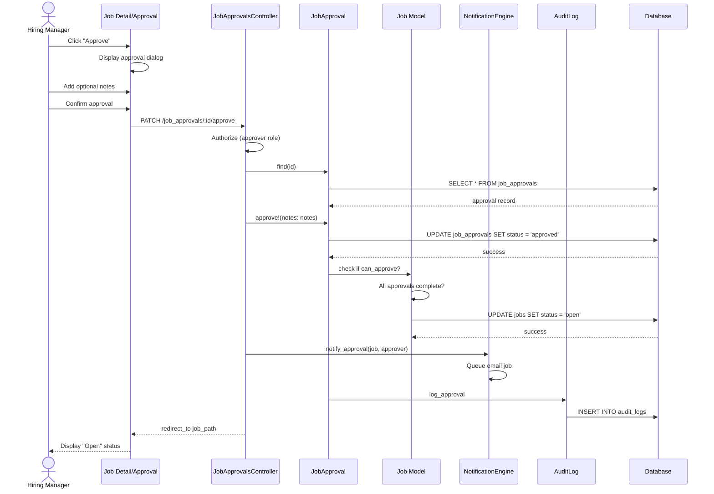

# UC-004: Approve Requisition

## Metadata

| Attribute | Value |
|-----------|-------|
| **ID** | UC-004 |
| **Name** | Approve Requisition |
| **Functional Area** | Job Requisition Management |
| **Primary Actor** | Hiring Manager (ACT-03) |
| **Priority** | P1 |
| **Complexity** | Low |
| **Status** | Draft |

## Description

A hiring manager (or other designated approver) reviews and approves a pending job requisition. Upon approval, the job transitions to approved status (or directly to open status if it's the final approval). The recruiter is notified of the approval.

## Actors

| Actor | Role in Use Case |
|-------|------------------|
| Hiring Manager (ACT-03) | Primary approver who reviews and approves |
| Executive (ACT-05) | May be secondary approver for high-level positions |
| System Administrator (ACT-01) | Can approve any job in the organization |
| System (ACT-11) | Sends notification to recruiter |

## Preconditions

- [ ] User is authenticated and is the designated approver (or admin)
- [ ] Job exists and is in pending_approval status
- [ ] JobApproval record exists with status = pending for this user
- [ ] User has not already approved/rejected this specific approval request

## Postconditions

### Success
- [ ] JobApproval status changed to approved
- [ ] JobApproval.decided_at timestamp set
- [ ] If final approval: Job status changed to open, opened_at set
- [ ] If multi-level: Next approver notified
- [ ] Recruiter notified of approval
- [ ] Audit log entry created

### Failure
- [ ] JobApproval remains pending
- [ ] Job remains in pending_approval
- [ ] User shown error message

## Triggers

- Hiring manager clicks "Approve" button from job detail page
- Hiring manager clicks "Approve" from approval notification email
- Hiring manager selects "Approve" from pending approvals dashboard

## Basic Flow



| Step | Actor | Action | System Response |
|------|-------|--------|-----------------|
| 1 | Hiring Manager | Clicks "Approve" button | Approval dialog appears |
| 2 | Hiring Manager | Optionally enters approval notes | Notes captured |
| 3 | Hiring Manager | Clicks "Confirm Approval" | System processes approval |
| 4 | System | Verifies approver authorization | Permission confirmed |
| 5 | System | Loads JobApproval record | Record retrieved |
| 6 | System | Updates approval to approved | Status, decided_at updated |
| 7 | System | Checks if all approvals complete | Evaluates approval chain |
| 8 | System | Transitions job to open (if final) | Job status updated |
| 9 | System | Notifies recruiter | Email queued |
| 10 | System | Creates audit log entry | Action recorded |
| 11 | System | Redirects to job detail | Open status displayed |

## Alternative Flows

### AF-1: Multi-Level Approval (Not Final Approver)

**Trigger:** This is not the final approval in the chain

| Step | Actor | Action | System Response |
|------|-------|--------|-----------------|
| 7a | System | Checks approval chain | More approvers pending |
| 7b | System | Job remains pending_approval | Status unchanged |
| 8a | System | Identifies next approver | sequence + 1 |
| 8b | System | Notifies next approver | Email sent |
| 9a | System | Notifies recruiter of partial approval | Status update email |

**Resumption:** Use case ends, next approver receives notification

### AF-2: Approval from Email Link

**Trigger:** Approver clicks "Approve" link in notification email

| Step | Actor | Action | System Response |
|------|-------|--------|-----------------|
| 1a | Hiring Manager | Clicks email approval link | Browser opens |
| 1b | System | Validates token/session | User authenticated |
| 1c | System | Displays approval confirmation | Streamlined dialog |
| 2a | Hiring Manager | Confirms approval | No notes option |

**Resumption:** Continues at step 4 of basic flow

### AF-3: Approval from Dashboard

**Trigger:** Approver uses pending approvals dashboard

| Step | Actor | Action | System Response |
|------|-------|--------|-----------------|
| 1a | Hiring Manager | Views pending approvals list | Dashboard shown |
| 1b | Hiring Manager | Clicks "Approve" on job row | Quick approval dialog |
| 2a | System | Shows job summary in dialog | Key details visible |

**Resumption:** Continues at step 3 of basic flow

## Exception Flows

### EF-1: Already Decided

**Trigger:** Approval has already been approved or rejected

| Step | Actor | Action | System Response |
|------|-------|--------|-----------------|
| E.1 | System | Detects non-pending status | Validation fails |
| E.2 | System | Displays "Already decided" message | Shows current status |
| E.3 | System | Shows decision details | Who, when, notes |

**Resolution:** No action needed, approval already processed

### EF-2: Not Authorized Approver

**Trigger:** User is not the designated approver

| Step | Actor | Action | System Response |
|------|-------|--------|-----------------|
| E.1 | System | Authorization check fails | Pundit error |
| E.2 | System | Displays access denied | User redirected |

**Resolution:** Correct approver must take action

### EF-3: Job Status Changed

**Trigger:** Job is no longer in pending_approval (e.g., was edited back to draft)

| Step | Actor | Action | System Response |
|------|-------|--------|-----------------|
| E.1 | System | Detects invalid job status | State machine error |
| E.2 | System | Displays status error | "Job not awaiting approval" |
| E.3 | System | Shows current job status | User informed |

**Resolution:** Recruiter must resubmit if needed

## Business Rules

| ID | Rule | Description |
|----|------|-------------|
| BR-004.1 | Approver Match | User must be the designated approver for this JobApproval |
| BR-004.2 | Pending Status | JobApproval must be in pending status |
| BR-004.3 | Job Status | Job must be in pending_approval status |
| BR-004.4 | Sequential Approval | Multi-level approvals must be completed in sequence order |
| BR-004.5 | Auto-Open | Job automatically opens after final approval unless configured otherwise |
| BR-004.6 | Notification | Recruiter must be notified within 5 minutes of approval |

## Data Requirements

### Input Data

| Field | Type | Required | Validation |
|-------|------|----------|------------|
| job_approval_id | integer | Yes | Must exist and be pending |
| notes | text | No | Max 2000 chars |

### Output Data

| Field | Type | Description |
|-------|------|-------------|
| job_approval.status | enum | Changed to 'approved' |
| job_approval.decided_at | datetime | Timestamp of decision |
| job_approval.notes | text | Approver's notes |
| job.status | enum | Changed to 'open' if final approval |
| job.opened_at | datetime | Set if job opened |

## Database Transactions

### Tables Affected

| Table | Operation | Conditions |
|-------|-----------|------------|
| job_approvals | UPDATE | status -> approved |
| jobs | UPDATE | status -> open (if final approval) |
| audit_logs | CREATE | Approval recorded |

### Transaction Detail

```sql
-- Approve Requisition Transaction
BEGIN TRANSACTION;

-- Step 1: Update approval record
UPDATE job_approvals
SET status = 'approved',
    notes = @notes,
    decided_at = NOW(),
    updated_at = NOW()
WHERE id = @approval_id
  AND approver_id = @current_user_id
  AND status = 'pending';

-- Verify update happened
IF ROW_COUNT() = 0 THEN
    ROLLBACK;
    SIGNAL SQLSTATE '45000' SET MESSAGE_TEXT = 'Approval not found or already decided';
END IF;

-- Step 2: Check if all approvals complete for this job
SELECT COUNT(*) INTO @pending_count
FROM job_approvals
WHERE job_id = @job_id
  AND status = 'pending';

-- Step 3: If final approval, open the job
IF @pending_count = 0 THEN
    UPDATE jobs
    SET status = 'open',
        opened_at = NOW(),
        updated_at = NOW()
    WHERE id = @job_id
      AND status = 'pending_approval';
END IF;

-- Step 4: Create audit log entry
INSERT INTO audit_logs (
    organization_id,
    user_id,
    action,
    auditable_type,
    auditable_id,
    metadata,
    recorded_changes,
    created_at
) VALUES (
    @organization_id,
    @current_user_id,
    'job.approved',
    'Job',
    @job_id,
    JSON_OBJECT(
        'approver_name', @approver_name,
        'notes', @notes,
        'is_final_approval', @pending_count = 0
    ),
    JSON_OBJECT('status', JSON_ARRAY('pending_approval', 'open')),
    NOW()
);

COMMIT;
```

### Rollback Scenarios

| Scenario | Rollback Action |
|----------|-----------------|
| Approval update fails | Full rollback |
| Job status update fails | Full rollback |
| Notification failure | No rollback - approval stands, retry notification |

## UI/UX Requirements

### Screen/Component

- **Location:** /admin/jobs/:id (approval action) or /admin/approvals
- **Entry Point:**
  - "Approve" button on job detail page
  - Link in approval notification email
  - Pending approvals dashboard
- **Key Elements:**
  - Job summary shown before approval
  - Optional notes field
  - Clear approve/cancel buttons
  - Success confirmation

### Approval Dialog

```
+-----------------------------------------------+
| Approve Job Requisition                       |
+-----------------------------------------------+
| Position: Senior Software Engineer            |
| Department: Engineering                       |
| Submitted by: John Doe (Recruiter)           |
| Submitted on: Jan 24, 2026                    |
|                                               |
| Salary Range: $150,000 - $200,000            |
| Location: San Francisco, CA (Hybrid)          |
|                                               |
| Approval Notes (optional):                    |
| +-------------------------------------------+ |
| | Approved. Good candidate profile.         | |
| +-------------------------------------------+ |
|                                               |
| [Cancel]                    [Approve]         |
+-----------------------------------------------+
```

### Approval Confirmation

```
+-----------------------------------------------+
| [check] Job Approved Successfully             |
|                                               |
| Senior Software Engineer has been approved    |
| and is now open for applications.             |
|                                               |
| [View Job]              [Back to Dashboard]   |
+-----------------------------------------------+
```

## Non-Functional Requirements

| Requirement | Target |
|-------------|--------|
| Response Time | < 1 second for approval action |
| Notification Delivery | Within 5 minutes |
| Availability | 99.9% |

## Security Considerations

- [x] Authentication required
- [x] Authorization check: User must be designated approver or admin
- [x] Organization scoping: Can only approve jobs in user's organization
- [x] Audit logging: Approval action logged with approver details
- [x] Token validation: Email approval links validated for security

## Related Use Cases

| Use Case | Relationship |
|----------|--------------|
| UC-003 Submit for Approval | Precedes this (triggers approval request) |
| UC-005 Reject Requisition | Alternative action (rejection) |
| UC-006 Open Job | May be triggered by final approval |
| UC-002 Edit Job Requisition | Recruiter may edit after approval |

---

## Data Model References

> Cross-references to [DATA_MODEL.md](../DATA_MODEL.md) and [CRUD_MATRIX.md](../CRUD_MATRIX.md)

### Subject Areas

| Subject Area | ID | Relationship |
|--------------|-----|--------------|
| Job Requisition | SA-03 | Primary |
| Communication | SA-10 | Secondary |
| Compliance & Audit | SA-09 | Reference |

### Entities CRUD

| Entity | C | R | U | D | Notes |
|--------|---|---|---|---|-------|
| JobApproval | | ✓ | ✓ | | Read to verify, update status |
| Job | | ✓ | ✓ | | Read for details, update if final |
| User | | ✓ | | | Read for approver/recruiter details |
| AuditLog | ✓ | | | | Created for approval action |

**Legend:** C = Create, R = Read, U = Update, D = Delete

---

## Process Model References

> Cross-references to [PROCESS_MODEL.md](../PROCESS_MODEL.md) and [PROCESS_CRUD_MATRIX.md](../PROCESS_CRUD_MATRIX.md)

| Attribute | Value | Link |
|-----------|-------|------|
| **Elementary Business Process** | EP-0104: Approve Requisition | [PROCESS_MODEL.md#ep-0104](../PROCESS_MODEL.md#elementary-business-processes) |
| **Business Process** | BP-101: Requisition Management | [PROCESS_MODEL.md#bp-101](../PROCESS_MODEL.md#bp-101-requisition-management) |
| **Business Function** | BF-01: Talent Acquisition | [PROCESS_MODEL.md#bf-01](../PROCESS_MODEL.md#bf-01-talent-acquisition) |

### EBP Details

| Attribute | Value |
|-----------|-------|
| **Trigger** | Approver action on pending requisition |
| **Input** | Pending JobApproval, optional notes |
| **Output** | Approved JobApproval, potentially open Job |
| **Business Rules** | BR-004.1 through BR-004.6 (see Business Rules section) |

---

## Traceability Matrix

> Complete artifact mapping for requirements traceability

| Artifact Type | ID | Name | Link |
|---------------|-----|------|------|
| **Use Case** | UC-004 | Approve Requisition | *(this document)* |
| **Elementary Process** | EP-0104 | Approve Requisition | [PROCESS_MODEL.md](../PROCESS_MODEL.md#elementary-business-processes) |
| **Business Process** | BP-101 | Requisition Management | [PROCESS_MODEL.md](../PROCESS_MODEL.md#bp-101-requisition-management) |
| **Business Function** | BF-01 | Talent Acquisition | [PROCESS_MODEL.md](../PROCESS_MODEL.md#bf-01-talent-acquisition) |
| **Primary Actor** | ACT-03 | Hiring Manager | [ACTORS.md](../ACTORS.md#act-03-hiring-manager) |
| **Subject Area (Primary)** | SA-03 | Job Requisition | [DATA_MODEL.md](../DATA_MODEL.md#sa-03-job-requisition) |
| **Subject Area (Secondary)** | SA-10 | Communication | [DATA_MODEL.md](../DATA_MODEL.md#sa-10-communication) |
| **CRUD Matrix Row** | UC-004 | - | [CRUD_MATRIX.md](../CRUD_MATRIX.md#uc-004) |
| **Process CRUD Row** | EP-0104 | - | [PROCESS_CRUD_MATRIX.md](../PROCESS_CRUD_MATRIX.md#ep-0104) |

### Implementation Artifacts

| Artifact Type | Path/Reference | Status |
|---------------|----------------|--------|
| Controller | `app/controllers/admin/job_approvals_controller.rb#approve` | Implemented |
| Model | `app/models/job_approval.rb#approve!` | Implemented |
| Model | `app/models/job.rb#approve` (state machine) | Implemented |
| Mailer | `app/mailers/approval_mailer.rb` | Implemented |
| Policy | `app/policies/job_approval_policy.rb#approve?` | Implemented |
| Test | `test/models/job_approval_test.rb` | Implemented |

---

## Open Questions

1. Should approvers be able to approve with conditions/requests?
2. What happens if an approver leaves the company mid-approval?
3. Should we support approval delegation for vacations?

## Change History

| Version | Date | Author | Changes |
|---------|------|--------|---------|
| 0.1 | 2026-01-25 | System | Initial draft |
