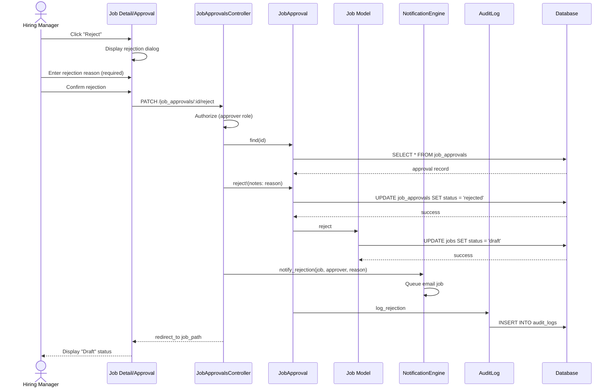

# UC-005: Reject Requisition

## Metadata

| Attribute | Value |
|-----------|-------|
| **ID** | UC-005 |
| **Name** | Reject Requisition |
| **Functional Area** | Job Requisition Management |
| **Primary Actor** | Hiring Manager (ACT-03) |
| **Priority** | P1 |
| **Complexity** | Low |
| **Status** | Draft |

## Description

A hiring manager (or other designated approver) reviews and rejects a pending job requisition. Upon rejection, the job returns to draft status so the recruiter can address the feedback and potentially resubmit. The recruiter is notified of the rejection with the approver's feedback.

## Actors

| Actor | Role in Use Case |
|-------|------------------|
| Hiring Manager (ACT-03) | Primary approver who rejects the requisition |
| Executive (ACT-05) | May be secondary approver who rejects |
| System Administrator (ACT-01) | Can reject any pending job |
| System (ACT-11) | Sends notification to recruiter |

## Preconditions

- [ ] User is authenticated and is the designated approver (or admin)
- [ ] Job exists and is in pending_approval status
- [ ] JobApproval record exists with status = pending for this user
- [ ] User has not already approved/rejected this specific approval request

## Postconditions

### Success
- [ ] JobApproval status changed to rejected
- [ ] JobApproval.decided_at timestamp set
- [ ] JobApproval.notes contains rejection reason
- [ ] Job status returned to draft
- [ ] Recruiter notified of rejection with feedback
- [ ] Audit log entry created

### Failure
- [ ] JobApproval remains pending
- [ ] Job remains in pending_approval
- [ ] User shown error message

## Triggers

- Hiring manager clicks "Reject" button from job detail page
- Hiring manager clicks "Reject" from approval notification email
- Hiring manager selects "Reject" from pending approvals dashboard

## Basic Flow



| Step | Actor | Action | System Response |
|------|-------|--------|-----------------|
| 1 | Hiring Manager | Clicks "Reject" button | Rejection dialog appears |
| 2 | Hiring Manager | Enters rejection reason | Reason captured (required) |
| 3 | Hiring Manager | Clicks "Confirm Rejection" | System processes rejection |
| 4 | System | Verifies approver authorization | Permission confirmed |
| 5 | System | Validates rejection reason provided | Reason not empty |
| 6 | System | Loads JobApproval record | Record retrieved |
| 7 | System | Updates approval to rejected | Status, decided_at, notes updated |
| 8 | System | Transitions job back to draft | Job status reverted |
| 9 | System | Notifies recruiter with reason | Email queued |
| 10 | System | Creates audit log entry | Action recorded |
| 11 | System | Redirects to job detail | Draft status displayed |

## Alternative Flows

### AF-1: Multi-Level Approval Chain Rejection

**Trigger:** Job has multiple approvers and one rejects

| Step | Actor | Action | System Response |
|------|-------|--------|-----------------|
| 7a | System | Cancels remaining approvals | Other approvals marked cancelled |
| 8a | System | Job returns to draft | Entire chain reset |
| 9a | System | Notifies all parties | Recruiter and other approvers informed |

**Resumption:** Continues at step 10 of basic flow

### AF-2: Rejection from Email Link

**Trigger:** Approver clicks "Reject" link in notification email

| Step | Actor | Action | System Response |
|------|-------|--------|-----------------|
| 1a | Hiring Manager | Clicks email rejection link | Browser opens |
| 1b | System | Validates token/session | User authenticated |
| 1c | System | Displays rejection form | Reason field shown |
| 2a | Hiring Manager | Enters reason | Field populated |

**Resumption:** Continues at step 3 of basic flow

### AF-3: Rejection with Suggested Changes

**Trigger:** Approver wants to specify what needs to change

| Step | Actor | Action | System Response |
|------|-------|--------|-----------------|
| 2a | Hiring Manager | Selects rejection category | Category dropdown |
| 2b | Hiring Manager | Enters detailed feedback | Rich text field |
| 2c | System | Saves structured feedback | Category + details stored |

**Resumption:** Continues at step 3 of basic flow

## Exception Flows

### EF-1: Missing Rejection Reason

**Trigger:** Approver submits without providing a reason

| Step | Actor | Action | System Response |
|------|-------|--------|-----------------|
| E.1 | System | Detects empty reason | Validation fails |
| E.2 | System | Displays error message | "Please provide a rejection reason" |
| E.3 | Hiring Manager | Enters reason | Field populated |
| E.4 | Hiring Manager | Resubmits | Validation passes |

**Resolution:** Returns to step 3 after reason provided

### EF-2: Already Decided

**Trigger:** Approval has already been approved or rejected

| Step | Actor | Action | System Response |
|------|-------|--------|-----------------|
| E.1 | System | Detects non-pending status | Validation fails |
| E.2 | System | Displays "Already decided" message | Shows current status |
| E.3 | System | Shows decision details | Who, when, notes |

**Resolution:** No action needed, already processed

### EF-3: Not Authorized Approver

**Trigger:** User is not the designated approver

| Step | Actor | Action | System Response |
|------|-------|--------|-----------------|
| E.1 | System | Authorization check fails | Pundit error |
| E.2 | System | Displays access denied | User redirected |

**Resolution:** Correct approver must take action

## Business Rules

| ID | Rule | Description |
|----|------|-------------|
| BR-005.1 | Approver Match | User must be designated approver for this JobApproval |
| BR-005.2 | Pending Status | JobApproval must be in pending status |
| BR-005.3 | Reason Required | Rejection reason is mandatory |
| BR-005.4 | Status Revert | Job must return to draft status on rejection |
| BR-005.5 | Chain Reset | All pending approvals in chain are cancelled on rejection |
| BR-005.6 | Notification | Recruiter must be notified within 5 minutes with reason |

## Data Requirements

### Input Data

| Field | Type | Required | Validation |
|-------|------|----------|------------|
| job_approval_id | integer | Yes | Must exist and be pending |
| notes | text | Yes | Min 10 chars, max 2000 chars |
| rejection_category | string | No | Optional categorization |

### Output Data

| Field | Type | Description |
|-------|------|-------------|
| job_approval.status | enum | Changed to 'rejected' |
| job_approval.decided_at | datetime | Timestamp of decision |
| job_approval.notes | text | Rejection reason |
| job.status | enum | Changed to 'draft' |

## Database Transactions

### Tables Affected

| Table | Operation | Conditions |
|-------|-----------|------------|
| job_approvals | UPDATE | status -> rejected |
| jobs | UPDATE | status -> draft |
| audit_logs | CREATE | Rejection recorded |

### Transaction Detail

```sql
-- Reject Requisition Transaction
BEGIN TRANSACTION;

-- Step 1: Update approval record
UPDATE job_approvals
SET status = 'rejected',
    notes = @rejection_reason,
    decided_at = NOW(),
    updated_at = NOW()
WHERE id = @approval_id
  AND approver_id = @current_user_id
  AND status = 'pending';

-- Verify update happened
IF ROW_COUNT() = 0 THEN
    ROLLBACK;
    SIGNAL SQLSTATE '45000' SET MESSAGE_TEXT = 'Approval not found or already decided';
END IF;

-- Step 2: Cancel any remaining pending approvals in chain
UPDATE job_approvals
SET status = 'cancelled',
    notes = 'Cancelled due to rejection by previous approver',
    decided_at = NOW(),
    updated_at = NOW()
WHERE job_id = @job_id
  AND status = 'pending'
  AND sequence > @current_sequence;

-- Step 3: Return job to draft status
UPDATE jobs
SET status = 'draft',
    updated_at = NOW()
WHERE id = @job_id
  AND status = 'pending_approval';

-- Step 4: Create audit log entry
INSERT INTO audit_logs (
    organization_id,
    user_id,
    action,
    auditable_type,
    auditable_id,
    metadata,
    recorded_changes,
    created_at
) VALUES (
    @organization_id,
    @current_user_id,
    'job.rejected',
    'Job',
    @job_id,
    JSON_OBJECT(
        'approver_name', @approver_name,
        'rejection_reason', @rejection_reason
    ),
    JSON_OBJECT('status', JSON_ARRAY('pending_approval', 'draft')),
    NOW()
);

COMMIT;
```

### Rollback Scenarios

| Scenario | Rollback Action |
|----------|-----------------|
| Approval update fails | Full rollback |
| Job status update fails | Full rollback |
| Notification failure | No rollback - rejection stands, retry notification |

## UI/UX Requirements

### Screen/Component

- **Location:** /admin/jobs/:id (rejection action) or /admin/approvals
- **Entry Point:**
  - "Reject" button on job detail page
  - Link in approval notification email
  - Pending approvals dashboard
- **Key Elements:**
  - Job summary shown before rejection
  - Required rejection reason field
  - Optional rejection category
  - Clear reject/cancel buttons

### Rejection Dialog

```
+-----------------------------------------------+
| Reject Job Requisition                        |
+-----------------------------------------------+
| Position: Senior Software Engineer            |
| Department: Engineering                       |
| Submitted by: John Doe (Recruiter)           |
|                                               |
| Why are you rejecting this requisition?       |
|                                               |
| Category (optional):                          |
| +-------------------------------------------+ |
| | Budget concerns                         v | |
| +-------------------------------------------+ |
|                                               |
| Rejection Reason (required):                  |
| +-------------------------------------------+ |
| | The salary range exceeds our approved    | |
| | budget for this role. Please revise to   | |
| | $120k-$150k or provide justification.    | |
| +-------------------------------------------+ |
| Character count: 156/2000                     |
|                                               |
| [Cancel]                    [Reject]          |
+-----------------------------------------------+
```

### Recruiter Notification

```
+-----------------------------------------------+
| [!] Requisition Rejected                      |
|                                               |
| Senior Software Engineer was rejected by      |
| Jane Smith on Jan 25, 2026.                   |
|                                               |
| Reason: The salary range exceeds our approved |
| budget for this role. Please revise to        |
| $120k-$150k or provide justification.         |
|                                               |
| [Edit Job]                 [View Details]     |
+-----------------------------------------------+
```

## Non-Functional Requirements

| Requirement | Target |
|-------------|--------|
| Response Time | < 1 second for rejection action |
| Notification Delivery | Within 5 minutes |
| Availability | 99.9% |

## Security Considerations

- [x] Authentication required
- [x] Authorization check: User must be designated approver or admin
- [x] Organization scoping: Can only reject jobs in user's organization
- [x] Audit logging: Rejection action logged with reason
- [x] Input validation: Rejection reason sanitized

## Related Use Cases

| Use Case | Relationship |
|----------|--------------|
| UC-003 Submit for Approval | Precedes this (triggers approval request) |
| UC-004 Approve Requisition | Alternative action (approval) |
| UC-002 Edit Job Requisition | Follows this (recruiter addresses feedback) |
| UC-003 Submit for Approval | May follow after edits (resubmission) |

---

## Data Model References

> Cross-references to [DATA_MODEL.md](../DATA_MODEL.md) and [CRUD_MATRIX.md](../CRUD_MATRIX.md)

### Subject Areas

| Subject Area | ID | Relationship |
|--------------|-----|--------------|
| Job Requisition | SA-03 | Primary |
| Communication | SA-10 | Secondary |
| Compliance & Audit | SA-09 | Reference |

### Entities CRUD

| Entity | C | R | U | D | Notes |
|--------|---|---|---|---|-------|
| JobApproval | | ✓ | ✓ | | Read to verify, update status |
| Job | | ✓ | ✓ | | Read for details, update to draft |
| User | | ✓ | | | Read for approver/recruiter details |
| AuditLog | ✓ | | | | Created for rejection action |

**Legend:** C = Create, R = Read, U = Update, D = Delete

---

## Process Model References

> Cross-references to [PROCESS_MODEL.md](../PROCESS_MODEL.md) and [PROCESS_CRUD_MATRIX.md](../PROCESS_CRUD_MATRIX.md)

| Attribute | Value | Link |
|-----------|-------|------|
| **Elementary Business Process** | EP-0105: Reject Requisition | [PROCESS_MODEL.md#ep-0105](../PROCESS_MODEL.md#elementary-business-processes) |
| **Business Process** | BP-101: Requisition Management | [PROCESS_MODEL.md#bp-101](../PROCESS_MODEL.md#bp-101-requisition-management) |
| **Business Function** | BF-01: Talent Acquisition | [PROCESS_MODEL.md#bf-01](../PROCESS_MODEL.md#bf-01-talent-acquisition) |

### EBP Details

| Attribute | Value |
|-----------|-------|
| **Trigger** | Approver action to reject pending requisition |
| **Input** | Pending JobApproval, rejection reason |
| **Output** | Rejected JobApproval, Job returned to draft |
| **Business Rules** | BR-005.1 through BR-005.6 (see Business Rules section) |

---

## Traceability Matrix

> Complete artifact mapping for requirements traceability

| Artifact Type | ID | Name | Link |
|---------------|-----|------|------|
| **Use Case** | UC-005 | Reject Requisition | *(this document)* |
| **Elementary Process** | EP-0105 | Reject Requisition | [PROCESS_MODEL.md](../PROCESS_MODEL.md#elementary-business-processes) |
| **Business Process** | BP-101 | Requisition Management | [PROCESS_MODEL.md](../PROCESS_MODEL.md#bp-101-requisition-management) |
| **Business Function** | BF-01 | Talent Acquisition | [PROCESS_MODEL.md](../PROCESS_MODEL.md#bf-01-talent-acquisition) |
| **Primary Actor** | ACT-03 | Hiring Manager | [ACTORS.md](../ACTORS.md#act-03-hiring-manager) |
| **Subject Area (Primary)** | SA-03 | Job Requisition | [DATA_MODEL.md](../DATA_MODEL.md#sa-03-job-requisition) |
| **Subject Area (Secondary)** | SA-10 | Communication | [DATA_MODEL.md](../DATA_MODEL.md#sa-10-communication) |
| **CRUD Matrix Row** | UC-005 | - | [CRUD_MATRIX.md](../CRUD_MATRIX.md#uc-005) |
| **Process CRUD Row** | EP-0105 | - | [PROCESS_CRUD_MATRIX.md](../PROCESS_CRUD_MATRIX.md#ep-0105) |

### Implementation Artifacts

| Artifact Type | Path/Reference | Status |
|---------------|----------------|--------|
| Controller | `app/controllers/admin/job_approvals_controller.rb#reject` | Implemented |
| Model | `app/models/job_approval.rb#reject!` | Implemented |
| Model | `app/models/job.rb#reject` (state machine) | Implemented |
| Mailer | `app/mailers/approval_mailer.rb` | Implemented |
| Policy | `app/policies/job_approval_policy.rb#reject?` | Implemented |
| Test | `test/models/job_approval_test.rb` | Implemented |

---

## Open Questions

1. Should rejection reasons be categorized for reporting?
2. How many times can a job be rejected and resubmitted?
3. Should there be an appeal process for rejections?

## Change History

| Version | Date | Author | Changes |
|---------|------|--------|---------|
| 0.1 | 2026-01-25 | System | Initial draft |
