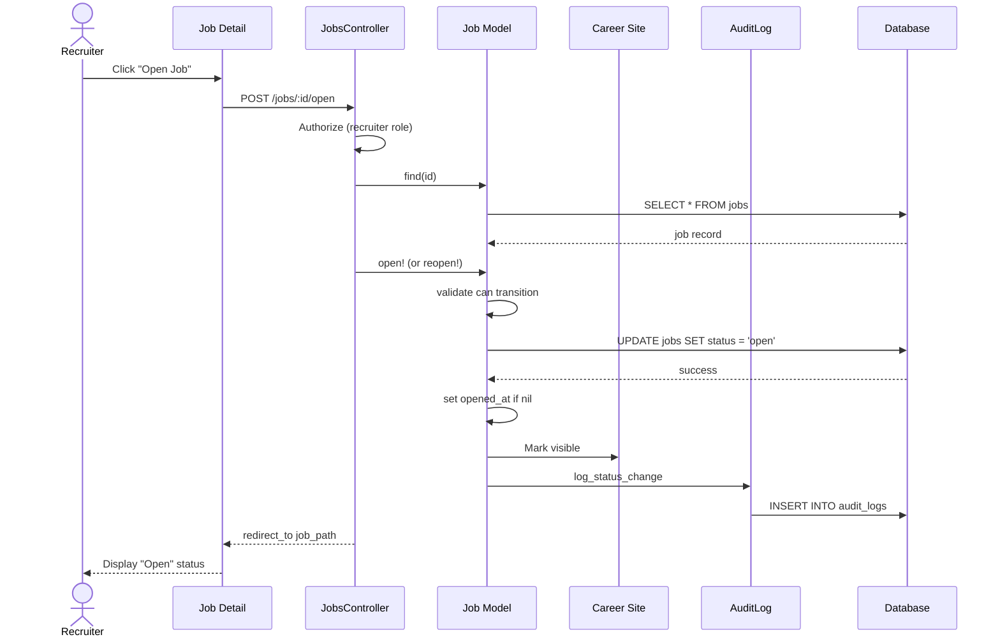

# UC-006: Open Job

## Metadata

| Attribute | Value |
|-----------|-------|
| **ID** | UC-006 |
| **Name** | Open Job |
| **Functional Area** | Job Requisition Management |
| **Primary Actor** | Recruiter (ACT-02) |
| **Priority** | P1 |
| **Complexity** | Low |
| **Status** | Draft |

## Description

A recruiter opens a job requisition to begin accepting applications. This can occur after approval (if required), directly from draft (if no approval required), or by reopening a job that was on hold or closed. Opening sets the job's opened_at timestamp and makes it visible on the career site.

## Actors

| Actor | Role in Use Case |
|-------|------------------|
| Recruiter (ACT-02) | Opens the job to accept applications |
| System Administrator (ACT-01) | Can open any job in the organization |
| System (ACT-11) | May automatically open after approval |

## Preconditions

- [ ] User is authenticated and has Recruiter or Admin role
- [ ] Job exists and is in an openable state (approved, draft if no approval required, on_hold, or closed)
- [ ] User has permission to manage this job
- [ ] If reopening closed job: close reason was not 'filled' (unless headcount increased)

## Postconditions

### Success
- [ ] Job status changed to open
- [ ] Job.opened_at timestamp set (if first time opening)
- [ ] Job visible on public career site
- [ ] Job available for applications
- [ ] Audit log entry created

### Failure
- [ ] Job status unchanged
- [ ] User shown error message with reason

## Triggers

- Recruiter clicks "Open Job" button on job detail page
- System automatically opens after final approval (UC-004)
- Recruiter clicks "Reopen" on closed or on-hold job
- Recruiter selects "Open" from job actions dropdown

## Basic Flow



| Step | Actor | Action | System Response |
|------|-------|--------|-----------------|
| 1 | Recruiter | Clicks "Open Job" | Confirmation dialog appears |
| 2 | Recruiter | Confirms opening | System processes request |
| 3 | System | Authorizes user action | Permission verified |
| 4 | System | Loads job record | Job retrieved |
| 5 | System | Validates state transition | Can open from current state |
| 6 | System | Transitions job to open | Status updated |
| 7 | System | Sets opened_at timestamp | First opening recorded |
| 8 | System | Makes job visible on career site | Public visibility enabled |
| 9 | System | Creates audit log entry | Action recorded |
| 10 | System | Redirects to job detail | Open status displayed |

## Alternative Flows

### AF-1: Reopen from On Hold

**Trigger:** Job is currently on hold

| Step | Actor | Action | System Response |
|------|-------|--------|-----------------|
| 1a | Recruiter | Clicks "Reopen" on held job | Confirmation shown |
| 5a | System | Validates can_reopen? | Job was on_hold |
| 6a | System | Uses reopen event | Transitions on_hold -> open |
| 7a | System | Keeps original opened_at | Timestamp preserved |

**Resumption:** Continues at step 8 of basic flow

### AF-2: Reopen Closed Job

**Trigger:** Job was closed but needs to reopen (e.g., hire fell through)

| Step | Actor | Action | System Response |
|------|-------|--------|-----------------|
| 1a | Recruiter | Clicks "Reopen" on closed job | Warning dialog shown |
| 1b | System | Checks close_reason | Not 'filled' or headcount increased |
| 2a | Recruiter | Provides reopen reason | Reason captured |
| 5a | System | Validates can_reopen? | Allowed based on rules |
| 6a | System | Clears close_reason, closed_at | Reset closure fields |
| 6b | System | Uses reopen event | Transitions closed -> open |

**Resumption:** Continues at step 8 of basic flow

### AF-3: Open from Draft (No Approval Required)

**Trigger:** Organization does not require job approval

| Step | Actor | Action | System Response |
|------|-------|--------|-----------------|
| 5a | System | Checks org.require_job_approval | Returns false |
| 5b | System | Validates can open from draft | Allowed |
| 6a | System | Direct transition draft -> open | Skips approval |

**Resumption:** Continues at step 7 of basic flow

### AF-4: Auto-Open After Approval

**Trigger:** This is invoked automatically by UC-004

| Step | Actor | Action | System Response |
|------|-------|--------|-----------------|
| 1a | System | Final approval triggers | After UC-004 completes |
| 3a | System | Uses system context | No user interaction |
| 9a | System | Audit shows auto-open | Linked to approval |

**Resumption:** Use case ends (no redirect)

## Exception Flows

### EF-1: Invalid State Transition

**Trigger:** Job cannot be opened from current state (e.g., pending_approval)

| Step | Actor | Action | System Response |
|------|-------|--------|-----------------|
| E.1 | System | State machine blocks transition | InvalidTransition error |
| E.2 | System | Displays status error | "Job must be approved first" |
| E.3 | System | Shows current status | User informed |

**Resolution:** Complete required workflow first

### EF-2: Reopen Filled Job Without Headcount Change

**Trigger:** Trying to reopen a job that was closed as filled

| Step | Actor | Action | System Response |
|------|-------|--------|-----------------|
| E.1 | System | Detects close_reason = filled | Validates headcount |
| E.2 | System | filled_count >= headcount | Blocks reopen |
| E.3 | System | Displays message | "Increase headcount to reopen" |

**Resolution:** Edit job to increase headcount, then reopen

### EF-3: Missing Required Fields

**Trigger:** Job missing fields required for posting

| Step | Actor | Action | System Response |
|------|-------|--------|-----------------|
| E.1 | System | Validates job completeness | Missing fields detected |
| E.2 | System | Displays missing field list | User informed |
| E.3 | Recruiter | Edits job to complete fields | Fields populated |
| E.4 | Recruiter | Retries open action | Process restarts |

**Resolution:** Complete job details, then retry

## Business Rules

| ID | Rule | Description |
|----|------|-------------|
| BR-006.1 | Valid Transitions | Can open from: approved, draft (if no approval), on_hold, closed |
| BR-006.2 | Approval Check | If org requires approval and job is draft, must go through approval |
| BR-006.3 | Opened At | opened_at only set on first opening, preserved on reopen |
| BR-006.4 | Filled Job Reopen | Cannot reopen filled job unless headcount increased |
| BR-006.5 | Career Site Visibility | Open jobs automatically visible on public career site |
| BR-006.6 | Closed Fields Reset | Reopening clears closed_at and close_reason |

## Data Requirements

### Input Data

| Field | Type | Required | Validation |
|-------|------|----------|------------|
| job_id | integer | Yes | Must exist in openable state |
| reopen_reason | text | Conditional | Required when reopening closed job |

### Output Data

| Field | Type | Description |
|-------|------|-------------|
| job.status | enum | Changed to 'open' |
| job.opened_at | datetime | Set if first opening |
| job.closed_at | datetime | Cleared if reopening |
| job.close_reason | string | Cleared if reopening |

## Database Transactions

### Tables Affected

| Table | Operation | Conditions |
|-------|-----------|------------|
| jobs | UPDATE | status -> open |
| audit_logs | CREATE | Status change recorded |

### Transaction Detail

```sql
-- Open Job Transaction
BEGIN TRANSACTION;

-- Step 1: Update job status to open
UPDATE jobs
SET status = 'open',
    opened_at = COALESCE(opened_at, NOW()),
    closed_at = NULL,
    close_reason = NULL,
    updated_at = NOW()
WHERE id = @job_id
  AND organization_id = @organization_id
  AND status IN ('approved', 'draft', 'on_hold', 'closed');

-- Verify update happened
IF ROW_COUNT() = 0 THEN
    ROLLBACK;
    SIGNAL SQLSTATE '45000' SET MESSAGE_TEXT = 'Job cannot be opened from current state';
END IF;

-- Step 2: Create audit log entry
INSERT INTO audit_logs (
    organization_id,
    user_id,
    action,
    auditable_type,
    auditable_id,
    metadata,
    recorded_changes,
    created_at
) VALUES (
    @organization_id,
    @current_user_id,
    'job.opened',
    'Job',
    @job_id,
    JSON_OBJECT(
        'title', @job_title,
        'previous_status', @previous_status,
        'reopen_reason', @reopen_reason
    ),
    JSON_OBJECT('status', JSON_ARRAY(@previous_status, 'open')),
    NOW()
);

COMMIT;
```

### Rollback Scenarios

| Scenario | Rollback Action |
|----------|-----------------|
| State transition invalid | Full rollback, show error |
| Audit log failure | Log error but commit job update (non-critical) |

## UI/UX Requirements

### Screen/Component

- **Location:** /admin/jobs/:id (open action)
- **Entry Point:**
  - "Open Job" button on approved job detail
  - "Reopen" button on held/closed job
  - Job actions dropdown
- **Key Elements:**
  - Confirmation dialog
  - Reopen reason field (for closed jobs)
  - Success notification

### Open Confirmation Dialog

```
+-----------------------------------------------+
| Open Job                                      |
+-----------------------------------------------+
| Are you sure you want to open this job?       |
|                                               |
| Position: Senior Software Engineer            |
| Department: Engineering                       |
|                                               |
| This will:                                    |
| - Make the job visible on your career site    |
| - Allow candidates to apply                   |
| - Start tracking time-to-hire                 |
|                                               |
| [Cancel]                    [Open Job]        |
+-----------------------------------------------+
```

### Reopen Confirmation (for closed job)

```
+-----------------------------------------------+
| Reopen Job                                    |
+-----------------------------------------------+
| This job was closed on Jan 20, 2026.          |
| Reason: Candidate withdrew                    |
|                                               |
| Why are you reopening this job?               |
| +-------------------------------------------+ |
| | Original hire fell through, need to       | |
| | restart the search.                       | |
| +-------------------------------------------+ |
|                                               |
| [Cancel]                    [Reopen Job]      |
+-----------------------------------------------+
```

## Non-Functional Requirements

| Requirement | Target |
|-------------|--------|
| Response Time | < 1 second for status change |
| Career Site Visibility | Within 1 minute of opening |
| Availability | 99.9% |

## Security Considerations

- [x] Authentication required
- [x] Authorization check: User must be job recruiter or admin
- [x] Organization scoping: Can only open jobs in user's organization
- [x] Audit logging: Open action logged with previous status

## Related Use Cases

| Use Case | Relationship |
|----------|--------------|
| UC-004 Approve Requisition | May trigger auto-open |
| UC-007 Put Job On Hold | Reverse action (close -> hold) |
| UC-008 Close Job | Reverse action (open -> close) |
| UC-011 Post to Job Boards | Typically follows this |
| UC-100 Apply for Job | Enabled by this |

---

## Data Model References

> Cross-references to [DATA_MODEL.md](../DATA_MODEL.md) and [CRUD_MATRIX.md](../CRUD_MATRIX.md)

### Subject Areas

| Subject Area | ID | Relationship |
|--------------|-----|--------------|
| Job Requisition | SA-03 | Primary |
| Career Site | SA-12 | Secondary |
| Compliance & Audit | SA-09 | Reference |

### Entities CRUD

| Entity | C | R | U | D | Notes |
|--------|---|---|---|---|-------|
| Job | | ✓ | ✓ | | Read to verify, update status |
| AuditLog | ✓ | | | | Created for status change |

**Legend:** C = Create, R = Read, U = Update, D = Delete

---

## Process Model References

> Cross-references to [PROCESS_MODEL.md](../PROCESS_MODEL.md) and [PROCESS_CRUD_MATRIX.md](../PROCESS_CRUD_MATRIX.md)

| Attribute | Value | Link |
|-----------|-------|------|
| **Elementary Business Process** | EP-0106: Open Job | [PROCESS_MODEL.md#ep-0106](../PROCESS_MODEL.md#elementary-business-processes) |
| **Business Process** | BP-101: Requisition Management | [PROCESS_MODEL.md#bp-101](../PROCESS_MODEL.md#bp-101-requisition-management) |
| **Business Function** | BF-01: Talent Acquisition | [PROCESS_MODEL.md#bf-01](../PROCESS_MODEL.md#bf-01-talent-acquisition) |

### EBP Details

| Attribute | Value |
|-----------|-------|
| **Trigger** | Recruiter action or automatic after approval |
| **Input** | Job in openable state |
| **Output** | Open job accepting applications |
| **Business Rules** | BR-006.1 through BR-006.6 (see Business Rules section) |

---

## Traceability Matrix

> Complete artifact mapping for requirements traceability

| Artifact Type | ID | Name | Link |
|---------------|-----|------|------|
| **Use Case** | UC-006 | Open Job | *(this document)* |
| **Elementary Process** | EP-0106 | Open Job | [PROCESS_MODEL.md](../PROCESS_MODEL.md#elementary-business-processes) |
| **Business Process** | BP-101 | Requisition Management | [PROCESS_MODEL.md](../PROCESS_MODEL.md#bp-101-requisition-management) |
| **Business Function** | BF-01 | Talent Acquisition | [PROCESS_MODEL.md](../PROCESS_MODEL.md#bf-01-talent-acquisition) |
| **Primary Actor** | ACT-02 | Recruiter | [ACTORS.md](../ACTORS.md#act-02-recruiter) |
| **Subject Area (Primary)** | SA-03 | Job Requisition | [DATA_MODEL.md](../DATA_MODEL.md#sa-03-job-requisition) |
| **Subject Area (Secondary)** | SA-12 | Career Site | [DATA_MODEL.md](../DATA_MODEL.md#sa-12-career-site) |
| **CRUD Matrix Row** | UC-006 | - | [CRUD_MATRIX.md](../CRUD_MATRIX.md#uc-006) |
| **Process CRUD Row** | EP-0106 | - | [PROCESS_CRUD_MATRIX.md](../PROCESS_CRUD_MATRIX.md#ep-0106) |

### Implementation Artifacts

| Artifact Type | Path/Reference | Status |
|---------------|----------------|--------|
| Controller | `app/controllers/admin/jobs_controller.rb#open` | Implemented |
| Model | `app/models/job.rb` (state machine: reopen event) | Implemented |
| Policy | `app/policies/job_policy.rb#open?` | Implemented |
| View | `app/views/admin/jobs/show.html.erb` (open button) | Implemented |
| Test | `test/models/job_test.rb` | Implemented |

---

## Open Questions

1. Should there be a delay between opening and career site visibility?
2. Should we track how many times a job has been reopened?
3. What notifications should be sent when a job is opened?

## Change History

| Version | Date | Author | Changes |
|---------|------|--------|---------|
| 0.1 | 2026-01-25 | System | Initial draft |
