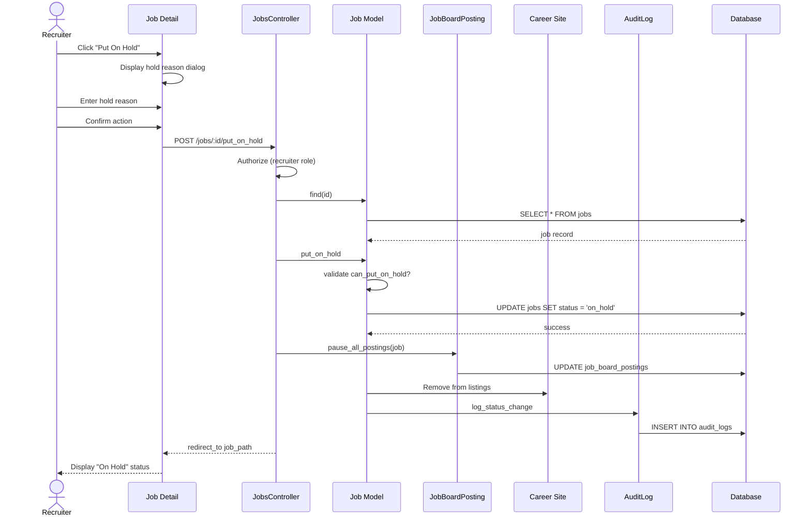

# UC-007: Put Job On Hold

## Metadata

| Attribute | Value |
|-----------|-------|
| **ID** | UC-007 |
| **Name** | Put Job On Hold |
| **Functional Area** | Job Requisition Management |
| **Primary Actor** | Recruiter (ACT-02) |
| **Priority** | P2 |
| **Complexity** | Low |
| **Status** | Draft |

## Description

A recruiter or hiring manager temporarily pauses hiring for an open position without closing it. This keeps candidate applications intact, stops accepting new applications from the career site, and freezes pipeline activity. The job can be reopened later when hiring resumes.

## Actors

| Actor | Role in Use Case |
|-------|------------------|
| Recruiter (ACT-02) | Puts the job on hold |
| Hiring Manager (ACT-03) | May put their jobs on hold |
| System Administrator (ACT-01) | Can put any job on hold |

## Preconditions

- [ ] User is authenticated and has Recruiter, Hiring Manager, or Admin role
- [ ] Job exists and is in open status
- [ ] User has permission to manage this job

## Postconditions

### Success
- [ ] Job status changed to on_hold
- [ ] Job removed from career site (not accepting applications)
- [ ] Existing applications preserved in their current states
- [ ] Job board postings marked as paused (if applicable)
- [ ] Audit log entry created with hold reason

### Failure
- [ ] Job status unchanged (remains open)
- [ ] User shown error message

## Triggers

- Recruiter clicks "Put On Hold" button on job detail page
- Hiring manager requests hold via job actions
- Recruiter selects "Put On Hold" from jobs list dropdown

## Basic Flow



| Step | Actor | Action | System Response |
|------|-------|--------|-----------------|
| 1 | Recruiter | Clicks "Put On Hold" | Hold reason dialog appears |
| 2 | Recruiter | Selects hold reason | Reason captured |
| 3 | Recruiter | Optionally adds notes | Additional context |
| 4 | Recruiter | Clicks "Confirm Hold" | System processes request |
| 5 | System | Authorizes user action | Permission verified |
| 6 | System | Loads job record | Job retrieved |
| 7 | System | Validates state transition | Can hold from open |
| 8 | System | Transitions job to on_hold | Status updated |
| 9 | System | Pauses job board postings | Postings marked paused |
| 10 | System | Removes from career site | No longer visible |
| 11 | System | Creates audit log entry | Action recorded |
| 12 | System | Redirects to job detail | On Hold status displayed |

## Alternative Flows

### AF-1: Hold with Scheduled Resume Date

**Trigger:** Recruiter knows when hiring will resume

| Step | Actor | Action | System Response |
|------|-------|--------|-----------------|
| 3a | Recruiter | Selects resume date | Date picker shown |
| 3b | Recruiter | Sets date for auto-reopen | Date captured |
| 11a | System | Creates scheduled job | Background job queued |

**Resumption:** Continues at step 12 of basic flow

### AF-2: Hold Entire Department

**Trigger:** Budget freeze affects entire department

| Step | Actor | Action | System Response |
|------|-------|--------|-----------------|
| 1a | Admin | Selects bulk hold option | Department jobs listed |
| 2a | Admin | Selects all department jobs | Jobs selected |
| 3a | Admin | Enters single hold reason | Applies to all |
| 4a | System | Processes each job | All transitioned |

**Resumption:** Use case ends (bulk operation)

### AF-3: Hiring Manager Initiated Hold

**Trigger:** Hiring manager needs to pause hiring

| Step | Actor | Action | System Response |
|------|-------|--------|-----------------|
| 1a | Hiring Manager | Requests hold | Notification to recruiter (optional) |
| 4a | System | Validates HM owns job | Permission confirmed |

**Resumption:** Continues at step 5 of basic flow

## Exception Flows

### EF-1: Invalid State Transition

**Trigger:** Job is not in open status

| Step | Actor | Action | System Response |
|------|-------|--------|-----------------|
| E.1 | System | State machine blocks transition | InvalidTransition error |
| E.2 | System | Displays status error | "Only open jobs can be put on hold" |
| E.3 | System | Shows current status | User informed |

**Resolution:** Job must be open to put on hold

### EF-2: Active Interviews Scheduled

**Trigger:** Job has upcoming interviews scheduled

| Step | Actor | Action | System Response |
|------|-------|--------|-----------------|
| E.1 | System | Detects scheduled interviews | Warning displayed |
| E.2 | System | Lists upcoming interviews | User can review |
| E.3 | Recruiter | Confirms proceed anyway | Interviews remain scheduled |
| E.4 | System | Or reschedules interviews | Based on preference |

**Resolution:** User decides how to handle scheduled interviews

### EF-3: Job Board Sync Failure

**Trigger:** Unable to pause postings on external boards

| Step | Actor | Action | System Response |
|------|-------|--------|-----------------|
| E.1 | System | API call to job board fails | Error logged |
| E.2 | System | Job still put on hold locally | Status updated |
| E.3 | System | Queues retry for job board | Background job scheduled |
| E.4 | System | Notifies user of partial failure | Warning shown |

**Resolution:** Job held, external sync retried automatically

## Business Rules

| ID | Rule | Description |
|----|------|-------------|
| BR-007.1 | Open Status Required | Only open jobs can be put on hold |
| BR-007.2 | Applications Preserved | All applications remain in their current state |
| BR-007.3 | Career Site Removal | Job immediately removed from career site |
| BR-007.4 | Hold Reason Required | Hold reason must be provided |
| BR-007.5 | Job Board Sync | Active job board postings should be paused |
| BR-007.6 | Notifications Optional | Team notification is configurable |

## Data Requirements

### Input Data

| Field | Type | Required | Validation |
|-------|------|----------|------------|
| job_id | integer | Yes | Must exist and be open |
| hold_reason | string | Yes | Selected from predefined list |
| hold_notes | text | No | Max 1000 chars |
| resume_date | date | No | Must be future date |

### Output Data

| Field | Type | Description |
|-------|------|-------------|
| job.status | enum | Changed to 'on_hold' |
| job.hold_reason | string | Reason for hold |
| job.hold_notes | text | Additional context |

## Database Transactions

### Tables Affected

| Table | Operation | Conditions |
|-------|-----------|------------|
| jobs | UPDATE | status -> on_hold |
| job_board_postings | UPDATE | status -> paused |
| audit_logs | CREATE | Status change recorded |

### Transaction Detail

```sql
-- Put Job On Hold Transaction
BEGIN TRANSACTION;

-- Step 1: Update job status to on_hold
UPDATE jobs
SET status = 'on_hold',
    hold_reason = @hold_reason,
    hold_notes = @hold_notes,
    updated_at = NOW()
WHERE id = @job_id
  AND organization_id = @organization_id
  AND status = 'open';

-- Verify update happened
IF ROW_COUNT() = 0 THEN
    ROLLBACK;
    SIGNAL SQLSTATE '45000' SET MESSAGE_TEXT = 'Job must be open to put on hold';
END IF;

-- Step 2: Pause active job board postings
UPDATE job_board_postings
SET status = 'paused',
    last_synced_at = NOW(),
    updated_at = NOW()
WHERE job_id = @job_id
  AND status IN ('active', 'posted', 'updated');

-- Step 3: Create audit log entry
INSERT INTO audit_logs (
    organization_id,
    user_id,
    action,
    auditable_type,
    auditable_id,
    metadata,
    recorded_changes,
    created_at
) VALUES (
    @organization_id,
    @current_user_id,
    'job.put_on_hold',
    'Job',
    @job_id,
    JSON_OBJECT(
        'title', @job_title,
        'hold_reason', @hold_reason,
        'hold_notes', @hold_notes,
        'resume_date', @resume_date
    ),
    JSON_OBJECT('status', JSON_ARRAY('open', 'on_hold')),
    NOW()
);

COMMIT;

-- Step 4: Queue job board sync (outside transaction)
INSERT INTO solid_queue_jobs (
    queue_name,
    class_name,
    arguments,
    scheduled_at
) VALUES (
    'integrations',
    'JobBoardSyncJob',
    JSON_OBJECT('job_id', @job_id, 'action', 'pause'),
    NOW()
);
```

### Rollback Scenarios

| Scenario | Rollback Action |
|----------|-----------------|
| State transition invalid | Full rollback, show error |
| Job board sync failure | No rollback - job held, queue retry |

## UI/UX Requirements

### Screen/Component

- **Location:** /admin/jobs/:id (hold action)
- **Entry Point:**
  - "Put On Hold" button on open job detail
  - Job actions dropdown
  - Bulk actions on jobs list
- **Key Elements:**
  - Hold reason dropdown
  - Optional notes field
  - Optional resume date picker
  - Application count reminder
  - Confirmation button

### Hold Reason Dialog

```
+-----------------------------------------------+
| Put Job On Hold                               |
+-----------------------------------------------+
| Position: Senior Software Engineer            |
| Current Applications: 45 active candidates    |
|                                               |
| This will:                                    |
| - Remove the job from your career site        |
| - Stop accepting new applications             |
| - Pause active job board postings             |
| - Keep existing applications unchanged        |
|                                               |
| Reason for hold:                              |
| +-------------------------------------------+ |
| | Budget freeze                           v | |
| +-------------------------------------------+ |
|                                               |
| Additional notes (optional):                  |
| +-------------------------------------------+ |
| | Q1 budget review in progress              | |
| +-------------------------------------------+ |
|                                               |
| Expected resume date (optional):              |
| +-------------------------------------------+ |
| | 02/15/2026                              [i] |
| +-------------------------------------------+ |
|                                               |
| [Cancel]                    [Put On Hold]     |
+-----------------------------------------------+
```

### Hold Reason Options

- Budget freeze
- Hiring freeze
- Position restructuring
- Manager change
- Candidate pipeline review
- Organizational changes
- Other (requires notes)

## Non-Functional Requirements

| Requirement | Target |
|-------------|--------|
| Response Time | < 1 second for status change |
| Career Site Update | Within 1 minute |
| Job Board Sync | Within 15 minutes |
| Availability | 99.9% |

## Security Considerations

- [x] Authentication required
- [x] Authorization check: User must be job recruiter, hiring manager, or admin
- [x] Organization scoping: Can only hold jobs in user's organization
- [x] Audit logging: Hold action logged with reason

## Related Use Cases

| Use Case | Relationship |
|----------|--------------|
| UC-006 Open Job | Precedes this (job must be open) |
| UC-006 Open Job | Can follow (reopen from hold) |
| UC-008 Close Job | Alternative action |
| UC-012 Remove from Job Boards | May be triggered by this |

---

## Data Model References

> Cross-references to [DATA_MODEL.md](../DATA_MODEL.md) and [CRUD_MATRIX.md](../CRUD_MATRIX.md)

### Subject Areas

| Subject Area | ID | Relationship |
|--------------|-----|--------------|
| Job Requisition | SA-03 | Primary |
| Integration | SA-11 | Secondary |
| Compliance & Audit | SA-09 | Reference |

### Entities CRUD

| Entity | C | R | U | D | Notes |
|--------|---|---|---|---|-------|
| Job | | ✓ | ✓ | | Read to verify, update status |
| JobBoardPosting | | ✓ | ✓ | | Update to paused status |
| AuditLog | ✓ | | | | Created for status change |

**Legend:** C = Create, R = Read, U = Update, D = Delete

---

## Process Model References

> Cross-references to [PROCESS_MODEL.md](../PROCESS_MODEL.md) and [PROCESS_CRUD_MATRIX.md](../PROCESS_CRUD_MATRIX.md)

| Attribute | Value | Link |
|-----------|-------|------|
| **Elementary Business Process** | EP-0107: Put Job On Hold | [PROCESS_MODEL.md#ep-0107](../PROCESS_MODEL.md#elementary-business-processes) |
| **Business Process** | BP-101: Requisition Management | [PROCESS_MODEL.md#bp-101](../PROCESS_MODEL.md#bp-101-requisition-management) |
| **Business Function** | BF-01: Talent Acquisition | [PROCESS_MODEL.md#bf-01](../PROCESS_MODEL.md#bf-01-talent-acquisition) |

### EBP Details

| Attribute | Value |
|-----------|-------|
| **Trigger** | User action to pause hiring |
| **Input** | Open job, hold reason |
| **Output** | Job on hold, career site updated |
| **Business Rules** | BR-007.1 through BR-007.6 (see Business Rules section) |

---

## Traceability Matrix

> Complete artifact mapping for requirements traceability

| Artifact Type | ID | Name | Link |
|---------------|-----|------|------|
| **Use Case** | UC-007 | Put Job On Hold | *(this document)* |
| **Elementary Process** | EP-0107 | Put Job On Hold | [PROCESS_MODEL.md](../PROCESS_MODEL.md#elementary-business-processes) |
| **Business Process** | BP-101 | Requisition Management | [PROCESS_MODEL.md](../PROCESS_MODEL.md#bp-101-requisition-management) |
| **Business Function** | BF-01 | Talent Acquisition | [PROCESS_MODEL.md](../PROCESS_MODEL.md#bf-01-talent-acquisition) |
| **Primary Actor** | ACT-02 | Recruiter | [ACTORS.md](../ACTORS.md#act-02-recruiter) |
| **Subject Area (Primary)** | SA-03 | Job Requisition | [DATA_MODEL.md](../DATA_MODEL.md#sa-03-job-requisition) |
| **Subject Area (Secondary)** | SA-11 | Integration | [DATA_MODEL.md](../DATA_MODEL.md#sa-11-integration) |
| **CRUD Matrix Row** | UC-007 | - | [CRUD_MATRIX.md](../CRUD_MATRIX.md#uc-007) |
| **Process CRUD Row** | EP-0107 | - | [PROCESS_CRUD_MATRIX.md](../PROCESS_CRUD_MATRIX.md#ep-0107) |

### Implementation Artifacts

| Artifact Type | Path/Reference | Status |
|---------------|----------------|--------|
| Controller | `app/controllers/admin/jobs_controller.rb#put_on_hold` | Implemented |
| Model | `app/models/job.rb` (state machine: put_on_hold event) | Implemented |
| Policy | `app/policies/job_policy.rb#put_on_hold?` | Implemented |
| View | `app/views/admin/jobs/show.html.erb` (hold button) | Implemented |
| Test | `test/models/job_test.rb` | Implemented |

---

## Open Questions

1. Should we automatically notify active candidates when a job goes on hold?
2. What is the maximum time a job can be on hold before auto-closing?
3. Should scheduled interviews be automatically cancelled or just flagged?

## Change History

| Version | Date | Author | Changes |
|---------|------|--------|---------|
| 0.1 | 2026-01-25 | System | Initial draft |
