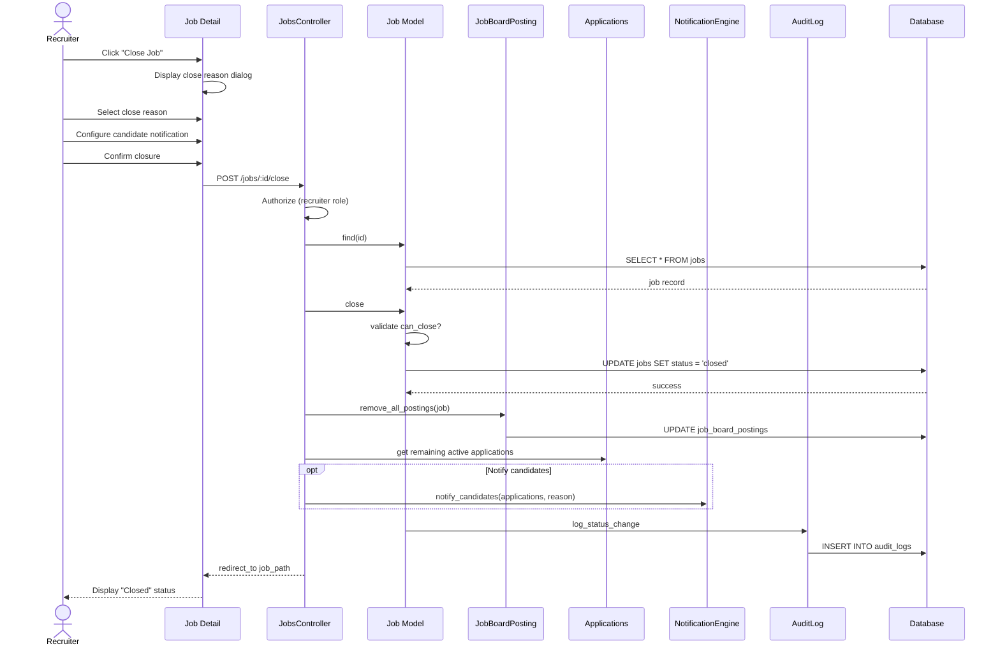

# UC-008: Close Job

## Metadata

| Attribute | Value |
|-----------|-------|
| **ID** | UC-008 |
| **Name** | Close Job |
| **Functional Area** | Job Requisition Management |
| **Primary Actor** | Recruiter (ACT-02) |
| **Priority** | P1 |
| **Complexity** | Medium |
| **Status** | Draft |

## Description

A recruiter closes an open or on-hold job requisition, marking the position as either filled, cancelled, or closed for another reason. Closing a job stops all hiring activity, removes it from the career site, removes it from job boards, and optionally triggers notifications to remaining candidates.

## Actors

| Actor | Role in Use Case |
|-------|------------------|
| Recruiter (ACT-02) | Closes the job requisition |
| Hiring Manager (ACT-03) | May close their jobs |
| System Administrator (ACT-01) | Can close any job |

## Preconditions

- [ ] User is authenticated and has Recruiter, Hiring Manager, or Admin role
- [ ] Job exists and is in open or on_hold status
- [ ] User has permission to manage this job

## Postconditions

### Success
- [ ] Job status changed to closed
- [ ] Job.closed_at timestamp set
- [ ] Job.close_reason recorded
- [ ] Job removed from career site
- [ ] Job board postings marked as removed
- [ ] Remaining candidates optionally notified
- [ ] Audit log entry created
- [ ] If filled: filled_count incremented

### Failure
- [ ] Job status unchanged
- [ ] User shown error message

## Triggers

- Recruiter clicks "Close Job" button on job detail page
- Recruiter marks candidate as hired (auto-close if filled)
- Recruiter selects "Close" from job actions dropdown
- System auto-closes stale jobs (if configured)

## Basic Flow



| Step | Actor | Action | System Response |
|------|-------|--------|-----------------|
| 1 | Recruiter | Clicks "Close Job" | Close dialog appears |
| 2 | Recruiter | Selects close reason | Reason captured |
| 3 | Recruiter | Optionally enters notes | Notes recorded |
| 4 | Recruiter | Selects candidate notification option | Preference saved |
| 5 | Recruiter | Clicks "Close Job" | System processes request |
| 6 | System | Authorizes user action | Permission verified |
| 7 | System | Loads job record | Job retrieved |
| 8 | System | Validates state transition | Can close from current state |
| 9 | System | Transitions job to closed | Status updated, timestamps set |
| 10 | System | Removes job board postings | Postings marked removed |
| 11 | System | Notifies candidates (if selected) | Emails queued |
| 12 | System | Creates audit log entry | Action recorded |
| 13 | System | Redirects to job detail | Closed status displayed |

## Alternative Flows

### AF-1: Close as Filled (Auto-triggered)

**Trigger:** Candidate marked as hired and job is now filled (filled_count >= headcount)

| Step | Actor | Action | System Response |
|------|-------|--------|-----------------|
| 1a | System | Hire completes (UC-259) | Checks job fill status |
| 2a | System | Job now fully filled | Auto-close triggered |
| 2b | System | Sets close_reason = 'filled' | Reason auto-set |
| 5a | System | Prompts for remaining candidates | Dialog shown to recruiter |

**Resumption:** Continues at step 6 of basic flow

### AF-2: Close from On Hold

**Trigger:** Job is on hold and being closed

| Step | Actor | Action | System Response |
|------|-------|--------|-----------------|
| 8a | System | Validates can close from on_hold | Allowed |
| 10a | System | Postings already paused | Updates to removed |

**Resumption:** Continues at step 11 of basic flow

### AF-3: Close with Candidate Disposition

**Trigger:** Recruiter wants to reject remaining candidates

| Step | Actor | Action | System Response |
|------|-------|--------|-----------------|
| 4a | Recruiter | Selects "Reject all remaining" | Bulk rejection option |
| 4b | Recruiter | Selects rejection reason | Applies to all |
| 11a | System | Rejects all active applications | Status updated |
| 11b | System | Sends rejection notifications | Emails queued |

**Resumption:** Continues at step 12 of basic flow

### AF-4: Partial Close (Multiple Openings)

**Trigger:** Job has headcount > 1 and not all positions filled

| Step | Actor | Action | System Response |
|------|-------|--------|-----------------|
| 2a | Recruiter | Selects "Close remaining openings" | Close unfilled only |
| 9a | System | Updates headcount to filled_count | Remaining closed |
| 9b | System | Job remains open if still has openings | Partial close only |

**Resumption:** Continues at step 10 or ends if no openings remain

## Exception Flows

### EF-1: Invalid State Transition

**Trigger:** Job is not in closeable state (e.g., draft)

| Step | Actor | Action | System Response |
|------|-------|--------|-----------------|
| E.1 | System | State machine blocks transition | InvalidTransition error |
| E.2 | System | Displays status error | "Cannot close job in current status" |

**Resolution:** Job must be open or on_hold to close

### EF-2: Active Offers Pending

**Trigger:** Job has offers in sent/pending state

| Step | Actor | Action | System Response |
|------|-------|--------|-----------------|
| E.1 | System | Detects pending offers | Warning displayed |
| E.2 | System | Lists pending offers | User can review |
| E.3 | Recruiter | Confirms close anyway | Offers withdrawn |
| E.4 | System | Or cancels to handle offers | Returns to job |

**Resolution:** User decides how to handle pending offers

### EF-3: Scheduled Interviews

**Trigger:** Job has upcoming interviews scheduled

| Step | Actor | Action | System Response |
|------|-------|--------|-----------------|
| E.1 | System | Detects scheduled interviews | Warning displayed |
| E.2 | System | Lists upcoming interviews | User can review |
| E.3 | Recruiter | Confirms close anyway | Interviews cancelled |
| E.4 | System | Notifies interviewers/candidates | Cancellations sent |

**Resolution:** Scheduled interviews cancelled with notifications

## Business Rules

| ID | Rule | Description |
|----|------|-------------|
| BR-008.1 | Valid Close States | Can only close from open or on_hold status |
| BR-008.2 | Close Reason Required | close_reason must be provided |
| BR-008.3 | Filled Auto-Close | Job auto-closes when filled_count >= headcount |
| BR-008.4 | Timestamp Setting | closed_at set to current time |
| BR-008.5 | Job Board Removal | All active postings must be removed |
| BR-008.6 | Offer Handling | Pending offers must be resolved before close |
| BR-008.7 | Interview Handling | Scheduled interviews cancelled with notice |

## Data Requirements

### Input Data

| Field | Type | Required | Validation |
|-------|------|----------|------------|
| job_id | integer | Yes | Must exist in closeable state |
| close_reason | string | Yes | filled, cancelled, on_hold |
| close_notes | text | No | Max 2000 chars |
| notify_candidates | boolean | No | Default false |
| reject_remaining | boolean | No | Default false |
| rejection_reason_id | integer | Conditional | Required if reject_remaining |

### Output Data

| Field | Type | Description |
|-------|------|-------------|
| job.status | enum | Changed to 'closed' |
| job.closed_at | datetime | Timestamp of closure |
| job.close_reason | string | Reason for closure |

## Database Transactions

### Tables Affected

| Table | Operation | Conditions |
|-------|-----------|------------|
| jobs | UPDATE | status -> closed |
| job_board_postings | UPDATE | status -> removed |
| applications | UPDATE | If rejecting remaining |
| offers | UPDATE | If withdrawing pending |
| interviews | UPDATE | If cancelling scheduled |
| audit_logs | CREATE | Closure recorded |

### Transaction Detail

```sql
-- Close Job Transaction
BEGIN TRANSACTION;

-- Step 1: Update job status to closed
UPDATE jobs
SET status = 'closed',
    closed_at = NOW(),
    close_reason = @close_reason,
    updated_at = NOW()
WHERE id = @job_id
  AND organization_id = @organization_id
  AND status IN ('open', 'on_hold');

-- Verify update happened
IF ROW_COUNT() = 0 THEN
    ROLLBACK;
    SIGNAL SQLSTATE '45000' SET MESSAGE_TEXT = 'Job cannot be closed from current state';
END IF;

-- Step 2: Remove all active job board postings
UPDATE job_board_postings
SET status = 'removed',
    removed_at = NOW(),
    last_synced_at = NOW(),
    updated_at = NOW()
WHERE job_id = @job_id
  AND status IN ('active', 'posted', 'updated', 'paused');

-- Step 3: Optionally reject remaining applications
IF @reject_remaining = TRUE THEN
    UPDATE applications
    SET status = 'rejected',
        rejection_reason_id = @rejection_reason_id,
        rejected_at = NOW(),
        updated_at = NOW()
    WHERE job_id = @job_id
      AND status NOT IN ('hired', 'rejected', 'withdrawn');

    -- Create stage transitions for rejections
    INSERT INTO stage_transitions (
        application_id,
        from_stage_id,
        to_stage_id,
        transitioned_by_id,
        created_at
    )
    SELECT
        id,
        current_stage_id,
        (SELECT id FROM stages WHERE organization_id = @org_id AND stage_type = 'rejected' LIMIT 1),
        @current_user_id,
        NOW()
    FROM applications
    WHERE job_id = @job_id
      AND status = 'rejected'
      AND rejected_at = (SELECT MAX(rejected_at) FROM applications WHERE job_id = @job_id);
END IF;

-- Step 4: Cancel scheduled interviews
UPDATE interviews
SET status = 'cancelled',
    cancelled_at = NOW(),
    cancellation_reason = 'Job closed',
    updated_at = NOW()
WHERE application_id IN (SELECT id FROM applications WHERE job_id = @job_id)
  AND status IN ('scheduled', 'confirmed')
  AND scheduled_at > NOW();

-- Step 5: Withdraw pending offers
UPDATE offers
SET status = 'withdrawn',
    withdrawn_at = NOW(),
    withdrawn_reason = 'Job closed',
    updated_at = NOW()
WHERE application_id IN (SELECT id FROM applications WHERE job_id = @job_id)
  AND status IN ('pending_approval', 'approved', 'sent');

-- Step 6: Create audit log entry
INSERT INTO audit_logs (
    organization_id,
    user_id,
    action,
    auditable_type,
    auditable_id,
    metadata,
    recorded_changes,
    created_at
) VALUES (
    @organization_id,
    @current_user_id,
    'job.closed',
    'Job',
    @job_id,
    JSON_OBJECT(
        'title', @job_title,
        'close_reason', @close_reason,
        'close_notes', @close_notes,
        'remaining_candidates_rejected', @reject_remaining,
        'candidates_notified', @notify_candidates
    ),
    JSON_OBJECT('status', JSON_ARRAY(@previous_status, 'closed')),
    NOW()
);

COMMIT;

-- Step 7: Queue notifications (outside transaction)
IF @notify_candidates = TRUE THEN
    INSERT INTO solid_queue_jobs (
        queue_name,
        class_name,
        arguments,
        scheduled_at
    ) VALUES (
        'mailers',
        'CandidateNotificationJob',
        JSON_OBJECT('job_id', @job_id, 'action', 'job_closed'),
        NOW()
    );
END IF;

-- Step 8: Queue job board removal sync
INSERT INTO solid_queue_jobs (
    queue_name,
    class_name,
    arguments,
    scheduled_at
) VALUES (
    'integrations',
    'JobBoardSyncJob',
    JSON_OBJECT('job_id', @job_id, 'action', 'remove'),
    NOW()
);
```

### Rollback Scenarios

| Scenario | Rollback Action |
|----------|-----------------|
| State transition invalid | Full rollback, show error |
| Job board sync failure | No rollback - job closed, queue retry |
| Notification failure | No rollback - job closed, log error |

## UI/UX Requirements

### Screen/Component

- **Location:** /admin/jobs/:id (close action)
- **Entry Point:**
  - "Close Job" button on job detail
  - Job actions dropdown
  - Auto-triggered on hire completion
- **Key Elements:**
  - Close reason dropdown
  - Notes field
  - Candidate notification options
  - Remaining applications summary
  - Confirmation button

### Close Reason Dialog

```
+-----------------------------------------------+
| Close Job                                     |
+-----------------------------------------------+
| Position: Senior Software Engineer            |
|                                               |
| Remaining Active Applications: 23             |
| Scheduled Interviews: 3                       |
| Pending Offers: 1                             |
|                                               |
| Close Reason:                                 |
| +-------------------------------------------+ |
| | Filled                                  v | |
| +-------------------------------------------+ |
|                                               |
| Notes (optional):                             |
| +-------------------------------------------+ |
| | Position filled by internal candidate.    | |
| +-------------------------------------------+ |
|                                               |
| Candidate Handling:                           |
| [ ] Reject all remaining candidates           |
|     Rejection reason: [Select...]             |
| [x] Send notification to remaining candidates |
|                                               |
| [!] This will cancel 3 scheduled interviews   |
|     and withdraw 1 pending offer.             |
|                                               |
| [Cancel]                    [Close Job]       |
+-----------------------------------------------+
```

### Close Reason Options

- Filled - Position has been filled
- Cancelled - Position no longer needed
- Budget - Position cancelled due to budget
- Reorganization - Position eliminated
- Other - Custom reason (requires notes)

## Non-Functional Requirements

| Requirement | Target |
|-------------|--------|
| Response Time | < 2 seconds (includes batch updates) |
| Career Site Update | Within 1 minute |
| Job Board Sync | Within 15 minutes |
| Candidate Notifications | Within 30 minutes |
| Availability | 99.9% |

## Security Considerations

- [x] Authentication required
- [x] Authorization check: User must be job recruiter, hiring manager, or admin
- [x] Organization scoping: Can only close jobs in user's organization
- [x] Audit logging: Closure logged with full details
- [x] Candidate privacy: Rejection reasons kept confidential

## Related Use Cases

| Use Case | Relationship |
|----------|--------------|
| UC-006 Open Job | May reopen closed job |
| UC-007 Put Job On Hold | Alternative to closing |
| UC-105 Reject Candidate | May trigger bulk rejection |
| UC-259 Mark as Hired | May trigger auto-close |
| UC-012 Remove from Job Boards | Triggered by this |

---

## Data Model References

> Cross-references to [DATA_MODEL.md](../DATA_MODEL.md) and [CRUD_MATRIX.md](../CRUD_MATRIX.md)

### Subject Areas

| Subject Area | ID | Relationship |
|--------------|-----|--------------|
| Job Requisition | SA-03 | Primary |
| Application Pipeline | SA-05 | Secondary |
| Integration | SA-11 | Secondary |
| Communication | SA-10 | Reference |

### Entities CRUD

| Entity | C | R | U | D | Notes |
|--------|---|---|---|---|-------|
| Job | | ✓ | ✓ | | Read to verify, update status |
| JobBoardPosting | | ✓ | ✓ | | Update to removed |
| Application | | ✓ | ✓ | | Optionally reject remaining |
| Offer | | ✓ | ✓ | | Withdraw pending offers |
| Interview | | ✓ | ✓ | | Cancel scheduled interviews |
| StageTransition | ✓ | | | | Created for rejections |
| AuditLog | ✓ | | | | Created for closure |

**Legend:** C = Create, R = Read, U = Update, D = Delete

---

## Process Model References

> Cross-references to [PROCESS_MODEL.md](../PROCESS_MODEL.md) and [PROCESS_CRUD_MATRIX.md](../PROCESS_CRUD_MATRIX.md)

| Attribute | Value | Link |
|-----------|-------|------|
| **Elementary Business Process** | EP-0108: Close Job | [PROCESS_MODEL.md#ep-0108](../PROCESS_MODEL.md#elementary-business-processes) |
| **Business Process** | BP-101: Requisition Management | [PROCESS_MODEL.md#bp-101](../PROCESS_MODEL.md#bp-101-requisition-management) |
| **Business Function** | BF-01: Talent Acquisition | [PROCESS_MODEL.md#bf-01](../PROCESS_MODEL.md#bf-01-talent-acquisition) |

### EBP Details

| Attribute | Value |
|-----------|-------|
| **Trigger** | User action or auto-close on hire |
| **Input** | Open/on-hold job, close reason |
| **Output** | Closed job, handled candidates |
| **Business Rules** | BR-008.1 through BR-008.7 (see Business Rules section) |

---

## Traceability Matrix

> Complete artifact mapping for requirements traceability

| Artifact Type | ID | Name | Link |
|---------------|-----|------|------|
| **Use Case** | UC-008 | Close Job | *(this document)* |
| **Elementary Process** | EP-0108 | Close Job | [PROCESS_MODEL.md](../PROCESS_MODEL.md#elementary-business-processes) |
| **Business Process** | BP-101 | Requisition Management | [PROCESS_MODEL.md](../PROCESS_MODEL.md#bp-101-requisition-management) |
| **Business Function** | BF-01 | Talent Acquisition | [PROCESS_MODEL.md](../PROCESS_MODEL.md#bf-01-talent-acquisition) |
| **Primary Actor** | ACT-02 | Recruiter | [ACTORS.md](../ACTORS.md#act-02-recruiter) |
| **Subject Area (Primary)** | SA-03 | Job Requisition | [DATA_MODEL.md](../DATA_MODEL.md#sa-03-job-requisition) |
| **Subject Area (Secondary)** | SA-05 | Application Pipeline | [DATA_MODEL.md](../DATA_MODEL.md#sa-05-application-pipeline) |
| **CRUD Matrix Row** | UC-008 | - | [CRUD_MATRIX.md](../CRUD_MATRIX.md#uc-008) |
| **Process CRUD Row** | EP-0108 | - | [PROCESS_CRUD_MATRIX.md](../PROCESS_CRUD_MATRIX.md#ep-0108) |

### Implementation Artifacts

| Artifact Type | Path/Reference | Status |
|---------------|----------------|--------|
| Controller | `app/controllers/admin/jobs_controller.rb#close` | Implemented |
| Model | `app/models/job.rb` (state machine: close event) | Implemented |
| Service | `app/services/jobs/close_service.rb` | Planned |
| Policy | `app/policies/job_policy.rb#close?` | Implemented |
| View | `app/views/admin/jobs/show.html.erb` (close button) | Implemented |
| Test | `test/models/job_test.rb` | Implemented |

---

## Open Questions

1. What is the grace period before auto-closing stale jobs?
2. Should we archive closed jobs after a certain period?
3. How do we handle candidates in background check stage when closing?

## Change History

| Version | Date | Author | Changes |
|---------|------|--------|---------|
| 0.1 | 2026-01-25 | System | Initial draft |
