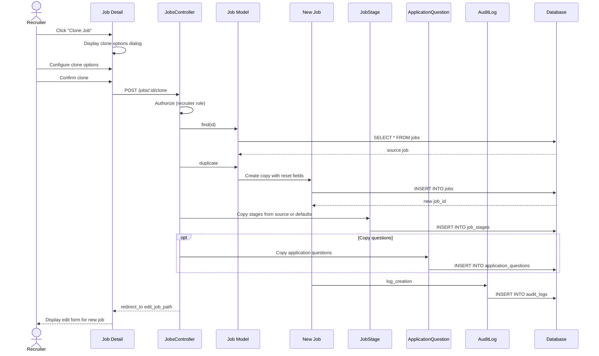

# UC-009: Clone Job

## Metadata

| Attribute | Value |
|-----------|-------|
| **ID** | UC-009 |
| **Name** | Clone Job |
| **Functional Area** | Job Requisition Management |
| **Primary Actor** | Recruiter (ACT-02) |
| **Priority** | P2 |
| **Complexity** | Low |
| **Status** | Draft |

## Description

A recruiter creates a new job requisition by duplicating an existing job. This allows reusing job descriptions, requirements, stages, and other configurations as a starting point. The cloned job is created in draft status with a modified title to distinguish it from the original.

## Actors

| Actor | Role in Use Case |
|-------|------------------|
| Recruiter (ACT-02) | Initiates the clone operation |
| System Administrator (ACT-01) | Can clone any job in the organization |

## Preconditions

- [ ] User is authenticated and has Recruiter or Admin role
- [ ] Source job exists in the organization
- [ ] User has read permission on the source job

## Postconditions

### Success
- [ ] New Job record created with status = draft
- [ ] New job has "(Copy)" appended to title
- [ ] Job details copied from source (description, requirements, salary, etc.)
- [ ] Default stages copied to new job
- [ ] Application questions copied (if configured)
- [ ] Hiring team optionally carried over
- [ ] Audit log entry created
- [ ] User redirected to edit form for new job

### Failure
- [ ] No new job created
- [ ] User shown error message

## Triggers

- Recruiter clicks "Clone" action on job detail page
- Recruiter clicks "Clone" from jobs list dropdown
- Recruiter selects multiple jobs for bulk clone

## Basic Flow



| Step | Actor | Action | System Response |
|------|-------|--------|-----------------|
| 1 | Recruiter | Clicks "Clone Job" | Clone options dialog appears |
| 2 | Recruiter | Selects what to copy | Options configured |
| 3 | Recruiter | Confirms clone | System processes request |
| 4 | System | Authorizes user action | Permission verified |
| 5 | System | Loads source job | Job retrieved |
| 6 | System | Creates duplicate job record | New job with draft status |
| 7 | System | Modifies title to add "(Copy)" | Title updated |
| 8 | System | Copies job stages | Stages duplicated |
| 9 | System | Copies application questions (if selected) | Questions duplicated |
| 10 | System | Creates audit log entry | Clone action recorded |
| 11 | System | Redirects to edit form | New job ready for editing |

## Alternative Flows

### AF-1: Clone with Fresh Hiring Team

**Trigger:** Recruiter chooses not to copy hiring team

| Step | Actor | Action | System Response |
|------|-------|--------|-----------------|
| 2a | Recruiter | Unchecks "Copy hiring team" | Option deselected |
| 6a | System | Sets hiring_manager_id = nil | No manager assigned |
| 6b | System | Sets recruiter to current user | Self-assigned |

**Resumption:** Continues at step 7 of basic flow

### AF-2: Clone with Custom Stages

**Trigger:** Recruiter wants to use different pipeline stages

| Step | Actor | Action | System Response |
|------|-------|--------|-----------------|
| 2a | Recruiter | Selects "Use default stages" | Ignores source stages |
| 8a | System | Copies org default stages | Not source stages |

**Resumption:** Continues at step 9 of basic flow

### AF-3: Clone Closed Job for Rehire

**Trigger:** Position needs to be refilled

| Step | Actor | Action | System Response |
|------|-------|--------|-----------------|
| 1a | Recruiter | Clones a closed job | Close data excluded |
| 6a | System | Excludes close_reason, closed_at | Fields reset |
| 6b | System | Resets filled_count to 0 | Fresh start |

**Resumption:** Continues at step 7 of basic flow

### AF-4: Bulk Clone

**Trigger:** Recruiter clones multiple jobs at once

| Step | Actor | Action | System Response |
|------|-------|--------|-----------------|
| 1a | Recruiter | Selects multiple jobs | Jobs checked |
| 1b | Recruiter | Clicks "Clone Selected" | Bulk operation started |
| 5a | System | Processes each job | Loop through selection |
| 11a | System | Redirects to jobs list | Shows all new jobs |

**Resumption:** Use case ends

## Exception Flows

### EF-1: Source Job Not Found

**Trigger:** Source job has been deleted or is inaccessible

| Step | Actor | Action | System Response |
|------|-------|--------|-----------------|
| E.1 | System | Cannot find source job | RecordNotFound error |
| E.2 | System | Displays error message | "Job not found" |
| E.3 | System | Redirects to jobs list | User returned to list |

**Resolution:** User must select existing job to clone

### EF-2: Title Too Long

**Trigger:** Adding "(Copy)" exceeds max title length

| Step | Actor | Action | System Response |
|------|-------|--------|-----------------|
| E.1 | System | Detects title will exceed 255 chars | Validation warning |
| E.2 | System | Truncates title before adding suffix | Title shortened |
| E.3 | System | Continues with clone | User can edit title |

**Resolution:** Automatic truncation, user can modify in edit form

### EF-3: No Permission on Source

**Trigger:** User lacks access to source job

| Step | Actor | Action | System Response |
|------|-------|--------|-----------------|
| E.1 | System | Authorization check fails | Pundit error |
| E.2 | System | Displays access denied | User informed |

**Resolution:** User must have read access to clone

## Business Rules

| ID | Rule | Description |
|----|------|-------------|
| BR-009.1 | Draft Status | Cloned job always starts in draft status |
| BR-009.2 | Title Modification | "(Copy)" or increment added to distinguish |
| BR-009.3 | Timestamp Reset | created_at, opened_at, closed_at all reset |
| BR-009.4 | Status Reset | Status fields (close_reason, etc.) cleared |
| BR-009.5 | Counter Reset | filled_count reset to 0 |
| BR-009.6 | Applications Not Copied | Candidate applications are never copied |
| BR-009.7 | Stage Copying | By default, copy source job's stages |

## Data Requirements

### Input Data

| Field | Type | Required | Validation |
|-------|------|----------|------------|
| source_job_id | integer | Yes | Must exist in organization |
| copy_hiring_team | boolean | No | Default true |
| copy_application_questions | boolean | No | Default true |
| use_default_stages | boolean | No | Default false (copy source) |

### Output Data

| Field | Type | Description |
|-------|------|-------------|
| id | integer | New job's unique identifier |
| title | string | Source title + " (Copy)" |
| status | enum | Always 'draft' |
| created_at | datetime | Current timestamp |

### Fields Copied

| Field | Copied | Notes |
|-------|--------|-------|
| title | Yes | With "(Copy)" suffix |
| description | Yes | Exact copy |
| requirements | Yes | Exact copy |
| department_id | Yes | Same department |
| location | Yes | Exact copy |
| location_type | Yes | Exact copy |
| employment_type | Yes | Exact copy |
| salary_min | Yes | Exact copy |
| salary_max | Yes | Exact copy |
| salary_currency | Yes | Exact copy |
| hiring_manager_id | Optional | If copy_hiring_team |
| recruiter_id | Optional | Default to current user |
| headcount | Yes | Same headcount |
| internal_notes | No | Excluded |
| remote_id | No | Always null |

### Fields Reset

| Field | Reset Value | Notes |
|-------|-------------|-------|
| status | draft | Always starts as draft |
| opened_at | null | Never opened |
| closed_at | null | Never closed |
| close_reason | null | Not applicable |
| filled_count | 0 | No hires yet |

## Database Transactions

### Tables Affected

| Table | Operation | Conditions |
|-------|-----------|------------|
| jobs | READ | Source job |
| jobs | CREATE | New cloned job |
| job_stages | READ | Source stages |
| job_stages | CREATE | Copied stages |
| application_questions | READ | Source questions |
| application_questions | CREATE | Copied questions |
| audit_logs | CREATE | Clone action recorded |

### Transaction Detail

```sql
-- Clone Job Transaction
BEGIN TRANSACTION;

-- Step 1: Create new job from source
INSERT INTO jobs (
    organization_id,
    department_id,
    title,
    description,
    requirements,
    location,
    location_type,
    employment_type,
    salary_min,
    salary_max,
    salary_currency,
    hiring_manager_id,
    recruiter_id,
    headcount,
    filled_count,
    status,
    created_at,
    updated_at
)
SELECT
    organization_id,
    department_id,
    CONCAT(SUBSTRING(title, 1, 248), ' (Copy)'),
    description,
    requirements,
    location,
    location_type,
    employment_type,
    salary_min,
    salary_max,
    salary_currency,
    CASE WHEN @copy_hiring_team THEN hiring_manager_id ELSE NULL END,
    @current_user_id,
    headcount,
    0,  -- Reset filled_count
    'draft',
    NOW(),
    NOW()
FROM jobs
WHERE id = @source_job_id
  AND organization_id = @organization_id;

SET @new_job_id = LAST_INSERT_ID();

-- Step 2: Copy job stages (or use defaults)
IF @use_default_stages THEN
    INSERT INTO job_stages (job_id, stage_id, position, created_at, updated_at)
    SELECT @new_job_id, id, position, NOW(), NOW()
    FROM stages
    WHERE organization_id = @organization_id
      AND is_default = true
    ORDER BY position;
ELSE
    INSERT INTO job_stages (job_id, stage_id, position, created_at, updated_at)
    SELECT @new_job_id, stage_id, position, NOW(), NOW()
    FROM job_stages
    WHERE job_id = @source_job_id
    ORDER BY position;
END IF;

-- Step 3: Copy application questions (if selected)
IF @copy_application_questions THEN
    INSERT INTO application_questions (
        organization_id,
        job_id,
        question_text,
        question_type,
        required,
        options,
        position,
        created_at,
        updated_at
    )
    SELECT
        organization_id,
        @new_job_id,
        question_text,
        question_type,
        required,
        options,
        position,
        NOW(),
        NOW()
    FROM application_questions
    WHERE job_id = @source_job_id
    ORDER BY position;
END IF;

-- Step 4: Create audit log entry
INSERT INTO audit_logs (
    organization_id,
    user_id,
    action,
    auditable_type,
    auditable_id,
    metadata,
    created_at
) VALUES (
    @organization_id,
    @current_user_id,
    'job.cloned',
    'Job',
    @new_job_id,
    JSON_OBJECT(
        'source_job_id', @source_job_id,
        'source_title', @source_title,
        'copy_hiring_team', @copy_hiring_team,
        'copy_questions', @copy_application_questions
    ),
    NOW()
);

COMMIT;

-- Return new job ID
SELECT @new_job_id AS new_job_id;
```

### Rollback Scenarios

| Scenario | Rollback Action |
|----------|-----------------|
| Source job not found | No transaction started |
| Stage copy failure | Full rollback |
| Question copy failure | Full rollback |

## UI/UX Requirements

### Screen/Component

- **Location:** /admin/jobs/:id/clone (action) and /admin/jobs/:id/edit (destination)
- **Entry Point:**
  - "Clone" button on job detail page
  - "Clone" action in jobs list dropdown
  - Bulk actions on jobs list
- **Key Elements:**
  - Clone options dialog
  - Checkbox options for what to copy
  - Preview of new job title
  - Confirmation button

### Clone Options Dialog

```
+-----------------------------------------------+
| Clone Job                                     |
+-----------------------------------------------+
| Source: Senior Software Engineer              |
|                                               |
| New Title:                                    |
| +-------------------------------------------+ |
| | Senior Software Engineer (Copy)           | |
| +-------------------------------------------+ |
|                                               |
| Clone Options:                                |
| [x] Copy job description and requirements     |
| [x] Copy salary range                         |
| [x] Copy hiring team (manager + recruiter)    |
| [x] Copy application questions                |
|                                               |
| Pipeline Stages:                              |
| ( ) Copy stages from source job               |
| (*) Use organization default stages           |
|                                               |
| [Cancel]                    [Clone Job]       |
+-----------------------------------------------+
```

### After Clone Message

```
+-----------------------------------------------+
| [check] Job Cloned Successfully               |
|                                               |
| "Senior Software Engineer (Copy)" has been    |
| created. Please review and update the details |
| before opening the position.                  |
+-----------------------------------------------+
```

## Non-Functional Requirements

| Requirement | Target |
|-------------|--------|
| Response Time | < 1 second for clone operation |
| Availability | 99.9% |

## Security Considerations

- [x] Authentication required
- [x] Authorization check: User must have read access to source job
- [x] Organization scoping: Can only clone jobs in user's organization
- [x] Audit logging: Clone action logged with source reference

## Related Use Cases

| Use Case | Relationship |
|----------|--------------|
| UC-001 Create Job Requisition | Alternative creation method |
| UC-002 Edit Job Requisition | Follows this (edit cloned job) |
| UC-003 Submit for Approval | May follow after editing |
| UC-010 Configure Job Stages | May follow to customize stages |

---

## Data Model References

> Cross-references to [DATA_MODEL.md](../DATA_MODEL.md) and [CRUD_MATRIX.md](../CRUD_MATRIX.md)

### Subject Areas

| Subject Area | ID | Relationship |
|--------------|-----|--------------|
| Job Requisition | SA-03 | Primary |
| Career Site | SA-12 | Reference |
| Compliance & Audit | SA-09 | Reference |

### Entities CRUD

| Entity | C | R | U | D | Notes |
|--------|---|---|---|---|-------|
| Job | ✓ | ✓ | | | Read source, create copy |
| JobStage | ✓ | ✓ | | | Read source, create for new job |
| ApplicationQuestion | ✓ | ✓ | | | Read source, create for new job |
| Stage | | ✓ | | | Read for default stages |
| AuditLog | ✓ | | | | Created for clone action |

**Legend:** C = Create, R = Read, U = Update, D = Delete

---

## Process Model References

> Cross-references to [PROCESS_MODEL.md](../PROCESS_MODEL.md) and [PROCESS_CRUD_MATRIX.md](../PROCESS_CRUD_MATRIX.md)

| Attribute | Value | Link |
|-----------|-------|------|
| **Elementary Business Process** | EP-0109: Clone Job | [PROCESS_MODEL.md#ep-0109](../PROCESS_MODEL.md#elementary-business-processes) |
| **Business Process** | BP-101: Requisition Management | [PROCESS_MODEL.md#bp-101](../PROCESS_MODEL.md#bp-101-requisition-management) |
| **Business Function** | BF-01: Talent Acquisition | [PROCESS_MODEL.md#bf-01](../PROCESS_MODEL.md#bf-01-talent-acquisition) |

### EBP Details

| Attribute | Value |
|-----------|-------|
| **Trigger** | User action to duplicate existing job |
| **Input** | Source job ID, clone options |
| **Output** | New job in draft status |
| **Business Rules** | BR-009.1 through BR-009.7 (see Business Rules section) |

---

## Traceability Matrix

> Complete artifact mapping for requirements traceability

| Artifact Type | ID | Name | Link |
|---------------|-----|------|------|
| **Use Case** | UC-009 | Clone Job | *(this document)* |
| **Elementary Process** | EP-0109 | Clone Job | [PROCESS_MODEL.md](../PROCESS_MODEL.md#elementary-business-processes) |
| **Business Process** | BP-101 | Requisition Management | [PROCESS_MODEL.md](../PROCESS_MODEL.md#bp-101-requisition-management) |
| **Business Function** | BF-01 | Talent Acquisition | [PROCESS_MODEL.md](../PROCESS_MODEL.md#bf-01-talent-acquisition) |
| **Primary Actor** | ACT-02 | Recruiter | [ACTORS.md](../ACTORS.md#act-02-recruiter) |
| **Subject Area (Primary)** | SA-03 | Job Requisition | [DATA_MODEL.md](../DATA_MODEL.md#sa-03-job-requisition) |
| **CRUD Matrix Row** | UC-009 | - | [CRUD_MATRIX.md](../CRUD_MATRIX.md#uc-009) |
| **Process CRUD Row** | EP-0109 | - | [PROCESS_CRUD_MATRIX.md](../PROCESS_CRUD_MATRIX.md#ep-0109) |

### Implementation Artifacts

| Artifact Type | Path/Reference | Status |
|---------------|----------------|--------|
| Controller | `app/controllers/admin/jobs_controller.rb#clone` | Implemented |
| Model | `app/models/job.rb#duplicate` | Implemented |
| Policy | `app/policies/job_policy.rb#clone?` | Implemented |
| View | `app/views/admin/jobs/show.html.erb` (clone button) | Implemented |
| Test | `test/models/job_test.rb` | Implemented |

---

## Open Questions

1. Should we support job templates as a separate feature?
2. How should we handle jobs with many clones (naming convention)?
3. Should cloned jobs reference their source for analytics?

## Change History

| Version | Date | Author | Changes |
|---------|------|--------|---------|
| 0.1 | 2026-01-25 | System | Initial draft |
