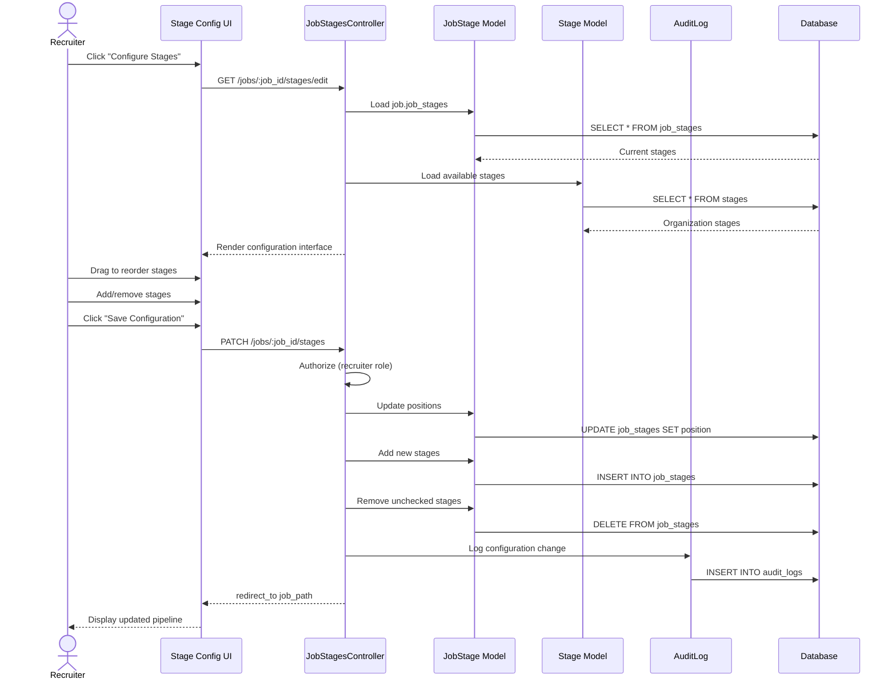

# UC-010: Configure Job Stages

## Metadata

| Attribute | Value |
|-----------|-------|
| **ID** | UC-010 |
| **Name** | Configure Job Stages |
| **Functional Area** | Job Requisition Management |
| **Primary Actor** | Recruiter (ACT-02) |
| **Priority** | P2 |
| **Complexity** | Medium |
| **Status** | Draft |

## Description

A recruiter customizes the hiring pipeline stages for a specific job. This allows tailoring the candidate journey for different positions - adding specialized interview stages, removing unnecessary steps, or reordering the pipeline. Stage configuration is typically done before opening a job.

## Actors

| Actor | Role in Use Case |
|-------|------------------|
| Recruiter (ACT-02) | Configures the job's pipeline stages |
| System Administrator (ACT-01) | Manages organization default stages |

## Preconditions

- [ ] User is authenticated and has Recruiter or Admin role
- [ ] Job exists in draft or pending_approval status
- [ ] User has edit permission on the job
- [ ] Organization has at least one stage defined

## Postconditions

### Success
- [ ] JobStage records updated for the job
- [ ] Stage order (position) reflects configuration
- [ ] All required stage types present (applied, at minimum)
- [ ] Audit log entry created

### Failure
- [ ] JobStage records unchanged
- [ ] User shown error message

## Triggers

- Recruiter clicks "Configure Stages" on job detail page
- Recruiter clicks "Customize Pipeline" during job creation
- Recruiter edits stages from job settings

## Basic Flow



| Step | Actor | Action | System Response |
|------|-------|--------|-----------------|
| 1 | Recruiter | Clicks "Configure Stages" | Stage configuration UI loads |
| 2 | System | Loads current job stages | Current pipeline displayed |
| 3 | System | Loads available organization stages | All options shown |
| 4 | Recruiter | Drags stages to reorder | Order updated visually |
| 5 | Recruiter | Adds new stage from available list | Stage added to pipeline |
| 6 | Recruiter | Removes unwanted stage | Stage removed from pipeline |
| 7 | Recruiter | Clicks "Save Configuration" | System processes changes |
| 8 | System | Validates stage configuration | Required stages present |
| 9 | System | Updates stage positions | Position values updated |
| 10 | System | Adds/removes JobStage records | Database updated |
| 11 | System | Creates audit log entry | Changes recorded |
| 12 | System | Redirects to job detail | New pipeline displayed |

## Alternative Flows

### AF-1: Reset to Default Stages

**Trigger:** Recruiter wants to start over with defaults

| Step | Actor | Action | System Response |
|------|-------|--------|-----------------|
| 4a | Recruiter | Clicks "Reset to Defaults" | Confirmation dialog |
| 4b | Recruiter | Confirms reset | System clears custom stages |
| 4c | System | Loads organization defaults | Default stages shown |
| 4d | System | Replaces current configuration | All custom stages removed |

**Resumption:** User can continue customizing or save

### AF-2: Add Custom Stage (On-the-fly)

**Trigger:** Recruiter needs a stage that doesn't exist

| Step | Actor | Action | System Response |
|------|-------|--------|-----------------|
| 5a | Recruiter | Clicks "Create New Stage" | Stage creation modal |
| 5b | Recruiter | Enters stage name and type | New stage configured |
| 5c | System | Creates organization-wide stage | Stage added to org |
| 5d | System | Adds stage to job pipeline | Stage in configuration |

**Resumption:** Continues at step 6 of basic flow

### AF-3: Copy Stages from Another Job

**Trigger:** Recruiter wants to reuse another job's pipeline

| Step | Actor | Action | System Response |
|------|-------|--------|-----------------|
| 4a | Recruiter | Clicks "Copy from Job" | Job selector shown |
| 4b | Recruiter | Selects source job | Source stages loaded |
| 4c | System | Replaces current with source stages | Pipeline copied |

**Resumption:** User can continue customizing or save

## Exception Flows

### EF-1: Job Has Active Applications

**Trigger:** Attempting to modify stages with applications in progress

| Step | Actor | Action | System Response |
|------|-------|--------|-----------------|
| E.1 | System | Detects active applications | Warning displayed |
| E.2 | System | Shows impacted candidates | Count per stage shown |
| E.3 | System | Restricts stage removal | Can only remove empty stages |
| E.4 | Recruiter | Proceeds with allowed changes | Partial update saved |

**Resolution:** Only empty stages can be removed; reordering allowed

### EF-2: Missing Required Stage Type

**Trigger:** Configuration missing required "applied" stage

| Step | Actor | Action | System Response |
|------|-------|--------|-----------------|
| E.1 | System | Validates stage types | Missing required type |
| E.2 | System | Displays error | "Applied stage is required" |
| E.3 | Recruiter | Adds required stage | Stage added |
| E.4 | Recruiter | Retries save | Validation passes |

**Resolution:** User must include required stage types

### EF-3: Job Not in Editable State

**Trigger:** Job is open or closed (not draft/pending)

| Step | Actor | Action | System Response |
|------|-------|--------|-----------------|
| E.1 | System | Checks job status | Not editable |
| E.2 | System | Shows read-only view | No edit controls |
| E.3 | System | Explains restriction | "Close job to modify stages" |

**Resolution:** Job must be in draft or pending_approval to edit stages

## Business Rules

| ID | Rule | Description |
|----|------|-------------|
| BR-010.1 | Editable States | Stages can only be fully edited in draft/pending_approval |
| BR-010.2 | Required Stages | At least "applied" stage type must be present |
| BR-010.3 | Position Uniqueness | Each position value must be unique within job |
| BR-010.4 | No Duplicate Stages | Same stage cannot appear twice in pipeline |
| BR-010.5 | Non-Empty Removal | Cannot remove stage with active applications |
| BR-010.6 | Terminal Stage | Terminal stages (hired/rejected) auto-included |
| BR-010.7 | Minimum Stages | At least 2 stages required (applied + terminal) |

## Data Requirements

### Input Data

| Field | Type | Required | Validation |
|-------|------|----------|------------|
| job_id | integer | Yes | Must exist and be editable |
| stage_ids | array[integer] | Yes | All must exist in organization |
| positions | array[integer] | Yes | Ordered 0, 1, 2... |

### Output Data

| Field | Type | Description |
|-------|------|-------------|
| job_stages | array | Updated JobStage records |
| stage_count | integer | Number of stages configured |

## Database Transactions

### Tables Affected

| Table | Operation | Conditions |
|-------|-----------|------------|
| job_stages | CREATE | New stages added |
| job_stages | UPDATE | Positions reordered |
| job_stages | DELETE | Stages removed |
| stages | CREATE | If creating new stage (AF-2) |
| audit_logs | CREATE | Configuration change logged |

### Transaction Detail

```sql
-- Configure Job Stages Transaction
BEGIN TRANSACTION;

-- Step 1: Verify job is editable
SELECT status INTO @job_status
FROM jobs
WHERE id = @job_id
  AND organization_id = @organization_id;

IF @job_status NOT IN ('draft', 'pending_approval') THEN
    ROLLBACK;
    SIGNAL SQLSTATE '45000' SET MESSAGE_TEXT = 'Job stages cannot be modified';
END IF;

-- Step 2: Check for applications in stages being removed
SELECT js.stage_id, COUNT(a.id) AS app_count
INTO @stages_with_apps
FROM job_stages js
LEFT JOIN applications a ON a.job_id = js.job_id AND a.current_stage_id = js.stage_id
WHERE js.job_id = @job_id
  AND js.stage_id NOT IN (@new_stage_ids)
GROUP BY js.stage_id
HAVING app_count > 0;

IF FOUND_ROWS() > 0 THEN
    ROLLBACK;
    SIGNAL SQLSTATE '45000' SET MESSAGE_TEXT = 'Cannot remove stages with active applications';
END IF;

-- Step 3: Delete removed stages
DELETE FROM job_stages
WHERE job_id = @job_id
  AND stage_id NOT IN (@new_stage_ids);

-- Step 4: Update positions for existing stages
-- (Using a loop or batch update)
UPDATE job_stages
SET position = @new_positions[stage_id],
    updated_at = NOW()
WHERE job_id = @job_id
  AND stage_id IN (@existing_stage_ids);

-- Step 5: Insert new stages
INSERT INTO job_stages (job_id, stage_id, position, created_at, updated_at)
SELECT @job_id, stage_id, position, NOW(), NOW()
FROM (
    SELECT @stage_id AS stage_id, @position AS position
    WHERE @stage_id NOT IN (
        SELECT stage_id FROM job_stages WHERE job_id = @job_id
    )
) AS new_stages;

-- Step 6: Validate minimum stages
SELECT COUNT(*) INTO @stage_count
FROM job_stages
WHERE job_id = @job_id;

IF @stage_count < 2 THEN
    ROLLBACK;
    SIGNAL SQLSTATE '45000' SET MESSAGE_TEXT = 'At least 2 stages required';
END IF;

-- Step 7: Create audit log entry
INSERT INTO audit_logs (
    organization_id,
    user_id,
    action,
    auditable_type,
    auditable_id,
    metadata,
    recorded_changes,
    created_at
) VALUES (
    @organization_id,
    @current_user_id,
    'job.stages_configured',
    'Job',
    @job_id,
    JSON_OBJECT(
        'stage_count', @stage_count,
        'stages_added', @added_stage_names,
        'stages_removed', @removed_stage_names
    ),
    JSON_OBJECT(
        'stage_ids', JSON_ARRAY(@old_stage_ids, @new_stage_ids)
    ),
    NOW()
);

COMMIT;
```

### Rollback Scenarios

| Scenario | Rollback Action |
|----------|-----------------|
| Job not editable | Full rollback, show error |
| Applications in removed stage | Full rollback, show affected count |
| Missing required stages | Full rollback, show validation error |

## UI/UX Requirements

### Screen/Component

- **Location:** /admin/jobs/:id/stages/edit
- **Entry Point:**
  - "Configure Stages" button on job detail
  - "Customize Pipeline" link during job creation
  - Job settings page
- **Key Elements:**
  - Drag-and-drop stage ordering
  - Stage type indicators (color-coded)
  - Add stage selector
  - Remove stage button
  - Reset to defaults option
  - Save/Cancel buttons

### Stage Configuration Interface

```
+-----------------------------------------------+
| Configure Pipeline Stages                      |
| Job: Senior Software Engineer                  |
+-----------------------------------------------+
| Current Pipeline:                     Actions  |
| +-------------------------------------------+ |
| | [=] 1. Applied            (applied)  [x] | |
| +-------------------------------------------+ |
| | [=] 2. Phone Screen       (screening) [x] | |
| +-------------------------------------------+ |
| | [=] 3. Technical Interview (interview)[x] | |
| +-------------------------------------------+ |
| | [=] 4. Onsite Interview   (interview) [x] | |
| +-------------------------------------------+ |
| | [=] 5. Reference Check    (screening) [x] | |
| +-------------------------------------------+ |
| | [=] 6. Offer              (offer)     [x] | |
| +-------------------------------------------+ |
|                                               |
| [=] = Drag handle    [x] = Remove stage       |
|                                               |
| Add Stage:                                    |
| +-------------------------------------------+ |
| | Select a stage to add...                v | |
| +-------------------------------------------+ |
| Available: Background Check, Assessment,      |
|           Culture Fit Interview               |
|                                               |
| [Create New Stage]      [Reset to Defaults]   |
|                                               |
+-----------------------------------------------+
| [Cancel]                    [Save Changes]    |
+-----------------------------------------------+
```

### Stage Type Color Coding

| Stage Type | Color | Description |
|------------|-------|-------------|
| applied | Blue | Entry point |
| screening | Purple | Initial review |
| interview | Green | Interviews |
| offer | Orange | Offer stage |
| hired | Dark Green | Terminal success |
| rejected | Red | Terminal failure |

## Non-Functional Requirements

| Requirement | Target |
|-------------|--------|
| Response Time | < 1 second for drag operations |
| Save Time | < 2 seconds |
| Availability | 99.9% |

## Security Considerations

- [x] Authentication required
- [x] Authorization check: User must have edit permission on job
- [x] Organization scoping: Can only use organization's stages
- [x] Audit logging: Stage changes logged

## Related Use Cases

| Use Case | Relationship |
|----------|--------------|
| UC-001 Create Job Requisition | May follow to customize |
| UC-002 Edit Job Requisition | May trigger this |
| UC-009 Clone Job | Stages can be copied |
| UC-103 Move Stage | Uses configured stages |

---

## Data Model References

> Cross-references to [DATA_MODEL.md](../DATA_MODEL.md) and [CRUD_MATRIX.md](../CRUD_MATRIX.md)

### Subject Areas

| Subject Area | ID | Relationship |
|--------------|-----|--------------|
| Job Requisition | SA-03 | Primary |
| Organization | SA-02 | Reference |

### Entities CRUD

| Entity | C | R | U | D | Notes |
|--------|---|---|---|---|-------|
| JobStage | ✓ | ✓ | ✓ | ✓ | Full CRUD for configuration |
| Stage | ✓ | ✓ | | | Read available, optionally create |
| Job | | ✓ | | | Read to verify editable |
| AuditLog | ✓ | | | | Created for changes |

**Legend:** C = Create, R = Read, U = Update, D = Delete

---

## Process Model References

> Cross-references to [PROCESS_MODEL.md](../PROCESS_MODEL.md) and [PROCESS_CRUD_MATRIX.md](../PROCESS_CRUD_MATRIX.md)

| Attribute | Value | Link |
|-----------|-------|------|
| **Elementary Business Process** | EP-0110: Configure Job Stages | [PROCESS_MODEL.md#ep-0110](../PROCESS_MODEL.md#elementary-business-processes) |
| **Business Process** | BP-101: Requisition Management | [PROCESS_MODEL.md#bp-101](../PROCESS_MODEL.md#bp-101-requisition-management) |
| **Business Function** | BF-01: Talent Acquisition | [PROCESS_MODEL.md#bf-01](../PROCESS_MODEL.md#bf-01-talent-acquisition) |

### EBP Details

| Attribute | Value |
|-----------|-------|
| **Trigger** | User action to customize pipeline |
| **Input** | Job ID, stage configuration |
| **Output** | Updated JobStage records |
| **Business Rules** | BR-010.1 through BR-010.7 (see Business Rules section) |

---

## Traceability Matrix

> Complete artifact mapping for requirements traceability

| Artifact Type | ID | Name | Link |
|---------------|-----|------|------|
| **Use Case** | UC-010 | Configure Job Stages | *(this document)* |
| **Elementary Process** | EP-0110 | Configure Job Stages | [PROCESS_MODEL.md](../PROCESS_MODEL.md#elementary-business-processes) |
| **Business Process** | BP-101 | Requisition Management | [PROCESS_MODEL.md](../PROCESS_MODEL.md#bp-101-requisition-management) |
| **Business Function** | BF-01 | Talent Acquisition | [PROCESS_MODEL.md](../PROCESS_MODEL.md#bf-01-talent-acquisition) |
| **Primary Actor** | ACT-02 | Recruiter | [ACTORS.md](../ACTORS.md#act-02-recruiter) |
| **Subject Area (Primary)** | SA-03 | Job Requisition | [DATA_MODEL.md](../DATA_MODEL.md#sa-03-job-requisition) |
| **CRUD Matrix Row** | UC-010 | - | [CRUD_MATRIX.md](../CRUD_MATRIX.md#uc-010) |
| **Process CRUD Row** | EP-0110 | - | [PROCESS_CRUD_MATRIX.md](../PROCESS_CRUD_MATRIX.md#ep-0110) |

### Implementation Artifacts

| Artifact Type | Path/Reference | Status |
|---------------|----------------|--------|
| Controller | `app/controllers/admin/job_stages_controller.rb` | Implemented |
| Model | `app/models/job_stage.rb` | Implemented |
| Model | `app/models/stage.rb` | Implemented |
| Policy | `app/policies/job_stage_policy.rb` | Implemented |
| View | `app/views/admin/job_stages/edit.html.erb` | Implemented |
| Test | `test/models/job_stage_test.rb` | Implemented |

---

## Open Questions

1. Should stage-specific interview requirements be configurable here?
2. Can we support conditional stages (skip based on criteria)?
3. Should we allow per-stage automation rules in this UI?

## Change History

| Version | Date | Author | Changes |
|---------|------|--------|---------|
| 0.1 | 2026-01-25 | System | Initial draft |
