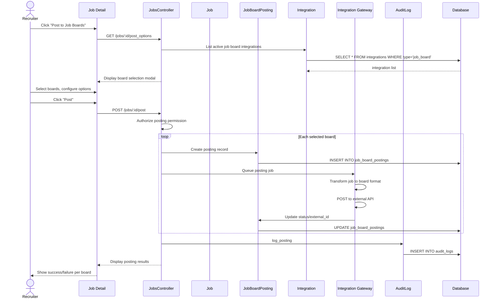

# UC-011: Post to Job Boards

## Metadata

| Attribute | Value |
|-----------|-------|
| **ID** | UC-011 |
| **Name** | Post to Job Boards |
| **Functional Area** | Job Requisition Management |
| **Primary Actor** | Recruiter (ACT-02) |
| **Priority** | P2 |
| **Complexity** | Medium |
| **Status** | Draft |

## Description

A recruiter publishes an open job requisition to one or more external job boards (Indeed, LinkedIn, Glassdoor, etc.). The system uses configured integrations to push job posting data to selected boards, tracks posting status, and monitors applications received from each source.

## Actors

| Actor | Role in Use Case |
|-------|------------------|
| Recruiter (ACT-02) | Selects boards and initiates posting |
| System Administrator (ACT-01) | Configures job board integrations |
| Integration Gateway (ACT-11) | Handles outbound API communication |

## Preconditions

- [ ] User is authenticated and has Recruiter or Admin role
- [ ] Job is in "open" status
- [ ] At least one job board integration is configured and active
- [ ] Job has required fields populated (title, description, location)

## Postconditions

### Success
- [ ] JobBoardPosting record(s) created for each selected board
- [ ] Posting status set to "pending" initially, then "published"
- [ ] External posting IDs stored for tracking
- [ ] Source tracking enabled for applications from each board
- [ ] Audit log entry created for posting action

### Failure
- [ ] JobBoardPosting record created with "failed" status
- [ ] Error details captured for troubleshooting
- [ ] User notified of posting failure

## Triggers

- Recruiter clicks "Post to Job Boards" from job detail page
- Recruiter selects jobs for bulk posting from jobs list
- Automated posting rule triggers on job status change

## Basic Flow



| Step | Actor | Action | System Response |
|------|-------|--------|-----------------|
| 1 | Recruiter | Clicks "Post to Job Boards" | Board selection modal appears |
| 2 | System | Loads active integrations | Available boards displayed |
| 3 | Recruiter | Selects target boards | Options configured |
| 4 | Recruiter | Optionally customizes posting | Board-specific fields shown |
| 5 | Recruiter | Clicks "Post" | System processes posting |
| 6 | System | Creates posting records | One per selected board |
| 7 | System | Queues external API calls | Background job scheduled |
| 8 | System | Sends to each job board | API requests made |
| 9 | System | Updates posting statuses | Results tracked |
| 10 | System | Creates audit log entry | Action recorded |
| 11 | System | Displays results | Success/failure per board |

## Alternative Flows

### AF-1: Scheduled Posting

**Trigger:** Recruiter selects future posting date

| Step | Actor | Action | System Response |
|------|-------|--------|-----------------|
| 4.1 | Recruiter | Selects schedule date/time | Schedule options displayed |
| 4.2 | Recruiter | Confirms schedule | Posting scheduled |
| 4.3 | System | Creates scheduled job | Posting deferred |

**Resumption:** Posting executes at scheduled time (step 7+)

### AF-2: Bulk Posting Multiple Jobs

**Trigger:** Recruiter selects multiple jobs from list

| Step | Actor | Action | System Response |
|------|-------|--------|-----------------|
| 1.1 | Recruiter | Selects multiple jobs | Bulk action menu shown |
| 1.2 | Recruiter | Clicks "Post to Job Boards" | Bulk posting modal |
| 1.3 | System | Validates all jobs are open | Status checked |

**Resumption:** Returns to step 2 for board selection

## Exception Flows

### EF-1: Integration Not Configured

**Trigger:** No job board integrations available

| Step | Actor | Action | System Response |
|------|-------|--------|-----------------|
| E.1 | System | Checks for integrations | None found |
| E.2 | System | Displays configuration prompt | Link to settings |
| E.3 | Recruiter | Navigates to settings | - |

**Resolution:** Admin configures integration first

### EF-2: API Rate Limit Exceeded

**Trigger:** Job board API returns rate limit error

| Step | Actor | Action | System Response |
|------|-------|--------|-----------------|
| E.1 | System | Receives rate limit response | Error captured |
| E.2 | System | Marks posting as "pending_retry" | Status updated |
| E.3 | System | Schedules retry with backoff | Exponential backoff |
| E.4 | System | Notifies recruiter | Email/notification sent |

**Resolution:** Automatic retry with exponential backoff

### EF-3: Invalid Job Data for Board

**Trigger:** Job missing required fields for specific board

| Step | Actor | Action | System Response |
|------|-------|--------|-----------------|
| E.1 | System | Validates job against board requirements | Missing fields detected |
| E.2 | System | Displays validation errors | Required fields listed |
| E.3 | Recruiter | Updates job or skips board | - |

**Resolution:** User corrects data or excludes board

## Business Rules

| ID | Rule | Description |
|----|------|-------------|
| BR-1 | Open Jobs Only | Only jobs with status="open" can be posted |
| BR-2 | Active Integration | Board integration must be enabled and authenticated |
| BR-3 | Required Fields | Title, description, and location required for all boards |
| BR-4 | Duplicate Prevention | System prevents duplicate active postings to same board |
| BR-5 | Source Tracking | Each posting creates unique source for application attribution |

## Data Requirements

### Input Data

| Field | Type | Required | Validation |
|-------|------|----------|------------|
| job_id | integer | Yes | Must exist, status=open |
| board_ids | array | Yes | At least one selected |
| scheduled_at | datetime | No | Must be future if provided |
| board_options | json | No | Board-specific customizations |

### Output Data

| Field | Type | Description |
|-------|------|-------------|
| posting_id | integer | Internal posting record ID |
| external_id | string | ID assigned by job board |
| posting_url | string | Public URL on job board |
| status | string | pending/published/failed |
| posted_at | datetime | When successfully posted |

## Database Transactions

### Tables Affected

| Table | Operation | Conditions |
|-------|-----------|------------|
| job_board_postings | CREATE | New posting record |
| job_board_postings | UPDATE | Status updates |
| integration_activities | CREATE | API call logging |
| audit_logs | CREATE | Action audit trail |
| sources | CREATE | If new board source needed |

### Transaction Detail

```sql
BEGIN TRANSACTION;

-- Create posting record
INSERT INTO job_board_postings (
    job_id, integration_id, status,
    board_options, organization_id, created_at
)
VALUES (@job_id, @integration_id, 'pending', @options, @org_id, NOW());

-- Create source for tracking if not exists
INSERT INTO sources (name, source_type, external_id, organization_id)
SELECT @board_name, 'job_board', @integration_id, @org_id
WHERE NOT EXISTS (
    SELECT 1 FROM sources
    WHERE external_id = @integration_id AND organization_id = @org_id
);

-- Create audit log
INSERT INTO audit_logs (action, auditable_type, auditable_id, user_id, metadata, created_at)
VALUES ('job_posted', 'Job', @job_id, @user_id, '{"boards": [...]}', NOW());

COMMIT;
```

### Rollback Scenarios

| Scenario | Rollback Action |
|----------|-----------------|
| Single board fails | Other postings proceed, failed one marked |
| All boards fail | Transaction commits with failed statuses |
| Database error | Full rollback, no postings created |

## UI/UX Requirements

### Screen/Component

- **Location:** Job detail page > Actions dropdown
- **Entry Point:** "Post to Job Boards" button/menu item
- **Key Elements:**
  - Available job boards checklist
  - Board-specific options (premium, featured)
  - Schedule posting option
  - Posting preview per board
  - Submit/Cancel buttons

### Wireframe Reference

`/designs/wireframes/UC-011-post-to-boards.png`

## Non-Functional Requirements

| Requirement | Target |
|-------------|--------|
| Response Time | < 3 seconds for UI, async for actual posting |
| Availability | 99.9% |
| Retry Attempts | 3 with exponential backoff |
| Timeout | 30 seconds per board API |

## Security Considerations

- [x] Authentication required
- [x] Authorization check: recruiter or admin role, same organization
- [x] Data encryption: API credentials stored encrypted
- [x] Audit logging: All posting actions logged with user/timestamp

## Related Use Cases

| Use Case | Relationship |
|----------|--------------|
| UC-006 Open Job | Must precede (job must be open) |
| UC-012 Remove from Job Boards | Reverses this action |
| UC-450 Configure Job Board Integration | Sets up boards for this use case |
| UC-452 Import Applications from Boards | Receives applications from postings |

---

## Data Model References

### Subject Areas

| Subject Area | ID | Relationship |
|--------------|-----|--------------|
| Job Requisition | SA-03 | Primary |
| Integration | SA-11 | Primary |

### Entities CRUD

| Entity | C | R | U | D | Notes |
|--------|---|---|---|---|-------|
| Job | | ✓ | | | Read for posting data |
| JobBoardPosting | ✓ | ✓ | ✓ | | Created and updated |
| Integration | | ✓ | | | Read for API config |
| IntegrationActivity | ✓ | | | | API call logging |
| Source | ✓ | ✓ | | | Created if new board |
| AuditLog | ✓ | | | | Immutable audit entry |

---

## Process Model References

| Attribute | Value | Link |
|-----------|-------|------|
| **Elementary Business Process** | EP-0111: Post Job to External Boards | [PROCESS_MODEL.md](../PROCESS_MODEL.md) |
| **Business Process** | BP-101: Requisition Management | [PROCESS_MODEL.md](../PROCESS_MODEL.md) |
| **Business Function** | BF-01: Talent Acquisition | [PROCESS_MODEL.md](../PROCESS_MODEL.md) |

### EBP Details

| Attribute | Value |
|-----------|-------|
| **Trigger** | Recruiter initiates posting or scheduled job runs |
| **Input** | Open job requisition, selected job boards |
| **Output** | Active postings on external boards |
| **Business Rules** | BR-1 through BR-5 |

---

## Traceability Matrix

| Artifact Type | ID | Name | Link |
|---------------|-----|------|------|
| **Use Case** | UC-011 | Post to Job Boards | *(this document)* |
| **Elementary Process** | EP-0111 | Post Job to External Boards | [PROCESS_MODEL.md](../PROCESS_MODEL.md) |
| **Business Process** | BP-101 | Requisition Management | [PROCESS_MODEL.md](../PROCESS_MODEL.md) |
| **Business Function** | BF-01 | Talent Acquisition | [PROCESS_MODEL.md](../PROCESS_MODEL.md) |
| **Primary Actor** | ACT-02 | Recruiter | [ACTORS.md](../ACTORS.md) |
| **Subject Area (Primary)** | SA-03 | Job Requisition | [DATA_MODEL.md](../DATA_MODEL.md) |
| **Subject Area (Secondary)** | SA-11 | Integration | [DATA_MODEL.md](../DATA_MODEL.md) |

### Implementation Artifacts

| Artifact Type | Path/Reference | Status |
|---------------|----------------|--------|
| Controller | `app/controllers/admin/job_board_postings_controller.rb` | Implemented |
| Model | `app/models/job_board_posting.rb` | Implemented |
| Service | `app/services/post_job_to_board_service.rb` | Implemented |
| Policy | `app/policies/job_board_posting_policy.rb` | Implemented |
| Job | `app/jobs/job_board_posting_job.rb` | Implemented |

---

## Open Questions

1. Should we support draft postings before publishing?
2. Do we need posting expiration management?

## Change History

| Version | Date | Author | Changes |
|---------|------|--------|---------|
| 0.1 | 2026-01-25 | System | Initial draft |
