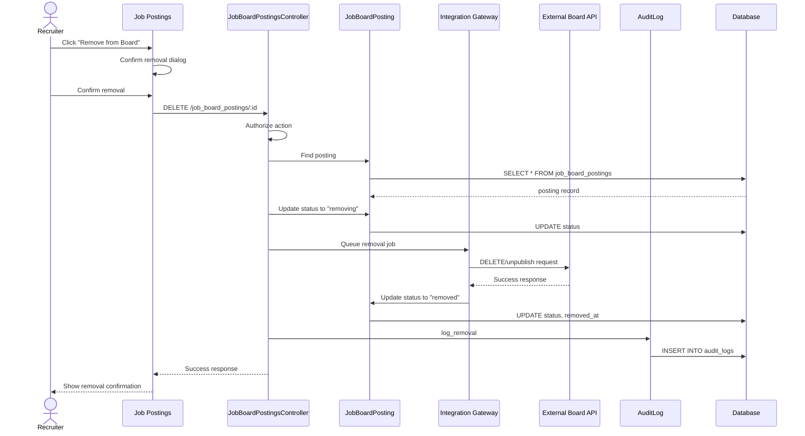

# UC-012: Remove from Job Boards

## Metadata

| Attribute | Value |
|-----------|-------|
| **ID** | UC-012 |
| **Name** | Remove from Job Boards |
| **Functional Area** | Job Requisition Management |
| **Primary Actor** | Recruiter (ACT-02) |
| **Priority** | P2 |
| **Complexity** | Low |
| **Status** | Draft |

## Description

A recruiter removes a job posting from one or more external job boards. This can be done manually for individual boards or automatically when a job is closed or put on hold. The system sends removal requests to external boards via their APIs and updates internal posting records.

## Actors

| Actor | Role in Use Case |
|-------|------------------|
| Recruiter (ACT-02) | Initiates manual removal |
| System (ACT-10) | Triggers automatic removal on job close |
| Integration Gateway (ACT-11) | Handles outbound API communication |

## Preconditions

- [ ] User is authenticated and has Recruiter or Admin role
- [ ] Job has active postings on at least one board
- [ ] JobBoardPosting record exists with status="published"

## Postconditions

### Success
- [ ] External posting removed from job board
- [ ] JobBoardPosting status updated to "removed"
- [ ] removed_at timestamp recorded
- [ ] Source tracking preserved for historical applications
- [ ] Audit log entry created

### Failure
- [ ] JobBoardPosting status set to "removal_failed"
- [ ] Error details captured
- [ ] User notified for manual intervention

## Triggers

- Recruiter clicks "Remove" on active posting
- Recruiter closes job (automatic removal)
- Recruiter puts job on hold (optional automatic removal)
- Posting expiration date reached

## Basic Flow



| Step | Actor | Action | System Response |
|------|-------|--------|-----------------|
| 1 | Recruiter | Clicks "Remove from Board" | Confirmation dialog appears |
| 2 | Recruiter | Confirms removal | System processes request |
| 3 | System | Validates user permission | Permission verified |
| 4 | System | Loads posting record | Record retrieved |
| 5 | System | Sets status to "removing" | Interim state set |
| 6 | System | Queues removal API call | Background job scheduled |
| 7 | System | Sends removal request | API call made |
| 8 | System | Updates posting status | Status = "removed" |
| 9 | System | Creates audit log | Action recorded |
| 10 | System | Displays confirmation | Success message shown |

## Alternative Flows

### AF-1: Bulk Removal on Job Close

**Trigger:** Job status changed to "closed"

| Step | Actor | Action | System Response |
|------|-------|--------|-----------------|
| 1.1 | System | Detects job closure | Status change event |
| 1.2 | System | Finds all active postings | Query job_board_postings |
| 1.3 | System | Queues removal for each | Background jobs created |

**Resumption:** Each posting processes steps 6-10

### AF-2: Selective Removal

**Trigger:** Recruiter wants to remove from specific boards only

| Step | Actor | Action | System Response |
|------|-------|--------|-----------------|
| 1.1 | Recruiter | Views all active postings | Posting list displayed |
| 1.2 | Recruiter | Selects specific boards | Checkboxes selected |
| 1.3 | Recruiter | Clicks "Remove Selected" | Bulk removal initiated |

**Resumption:** Returns to step 3 for each selected posting

## Exception Flows

### EF-1: External API Failure

**Trigger:** Job board API returns error or times out

| Step | Actor | Action | System Response |
|------|-------|--------|-----------------|
| E.1 | System | Receives API error | Error captured |
| E.2 | System | Sets status to "removal_failed" | Status updated |
| E.3 | System | Schedules retry | With exponential backoff |
| E.4 | System | Notifies recruiter after retries exhausted | Email/notification |

**Resolution:** Manual intervention or automatic retry success

### EF-2: Posting Already Removed Externally

**Trigger:** External board reports posting not found

| Step | Actor | Action | System Response |
|------|-------|--------|-----------------|
| E.1 | System | Receives 404 response | External not found |
| E.2 | System | Marks posting as "removed" | Status synced |
| E.3 | System | Logs discrepancy | For audit purposes |

**Resolution:** Status synchronized, no user action needed

## Business Rules

| ID | Rule | Description |
|----|------|-------------|
| BR-1 | Published Only | Only "published" postings can be removed |
| BR-2 | Auto-Remove on Close | Job closure triggers removal from all boards |
| BR-3 | Hold Behavior | On hold may trigger removal (configurable) |
| BR-4 | Application Preservation | Removal doesn't affect existing applications |
| BR-5 | Historical Data | Posting records retained for reporting |

## Data Requirements

### Input Data

| Field | Type | Required | Validation |
|-------|------|----------|------------|
| posting_id | integer | Yes | Must exist, status=published |
| reason | string | No | Optional removal reason |

### Output Data

| Field | Type | Description |
|-------|------|-------------|
| posting_id | integer | Removed posting record |
| status | string | "removed" or "removal_failed" |
| removed_at | datetime | When removal completed |
| external_status | string | Confirmation from board |

## Database Transactions

### Tables Affected

| Table | Operation | Conditions |
|-------|-----------|------------|
| job_board_postings | UPDATE | Status and timestamps |
| integration_activities | CREATE | API call logging |
| audit_logs | CREATE | Action audit trail |

### Transaction Detail

```sql
BEGIN TRANSACTION;

-- Update posting status
UPDATE job_board_postings
SET status = 'removed',
    removed_at = NOW(),
    removal_reason = @reason,
    updated_at = NOW()
WHERE id = @posting_id;

-- Log integration activity
INSERT INTO integration_activities (
    integration_id, activity_type, status,
    request_payload, response_payload, created_at
)
VALUES (@integration_id, 'remove_posting', 'success', @request, @response, NOW());

-- Create audit log
INSERT INTO audit_logs (
    action, auditable_type, auditable_id,
    user_id, metadata, created_at
)
VALUES ('posting_removed', 'JobBoardPosting', @posting_id, @user_id, '{"board": "..."}', NOW());

COMMIT;
```

### Rollback Scenarios

| Scenario | Rollback Action |
|----------|-----------------|
| API failure | Status remains "published", retry scheduled |
| Database error | Transaction rolled back, posting unchanged |

## UI/UX Requirements

### Screen/Component

- **Location:** Job detail page > Postings tab
- **Entry Point:** "Remove" button on each active posting row
- **Key Elements:**
  - Active postings list with board name, status, posted date
  - Remove button per posting
  - Bulk select for multiple removal
  - Confirmation dialog with optional reason
  - Status indicators (removing, removed, failed)

### Wireframe Reference

`/designs/wireframes/UC-012-remove-from-boards.png`

## Non-Functional Requirements

| Requirement | Target |
|-------------|--------|
| Response Time | < 2 seconds UI, async for API |
| Retry Attempts | 3 with exponential backoff |
| Timeout | 30 seconds per API call |

## Security Considerations

- [x] Authentication required
- [x] Authorization check: recruiter or admin, same organization
- [x] Audit logging: Removal action logged with user/timestamp
- [x] Data retention: Posting records preserved for compliance

## Related Use Cases

| Use Case | Relationship |
|----------|--------------|
| UC-011 Post to Job Boards | Creates the postings this UC removes |
| UC-008 Close Job | Can trigger automatic removal |
| UC-007 Put Job On Hold | May trigger automatic removal |
| UC-450 Configure Job Board Integration | Sets up board connections |

---

## Data Model References

### Subject Areas

| Subject Area | ID | Relationship |
|--------------|-----|--------------|
| Job Requisition | SA-03 | Primary |
| Integration | SA-11 | Primary |

### Entities CRUD

| Entity | C | R | U | D | Notes |
|--------|---|---|---|---|-------|
| JobBoardPosting | | ✓ | ✓ | | Status updated to removed |
| IntegrationActivity | ✓ | | | | API call logged |
| AuditLog | ✓ | | | | Immutable audit entry |

---

## Process Model References

| Attribute | Value | Link |
|-----------|-------|------|
| **Elementary Business Process** | EP-0112: Remove Job from External Boards | [PROCESS_MODEL.md](../PROCESS_MODEL.md) |
| **Business Process** | BP-101: Requisition Management | [PROCESS_MODEL.md](../PROCESS_MODEL.md) |
| **Business Function** | BF-01: Talent Acquisition | [PROCESS_MODEL.md](../PROCESS_MODEL.md) |

### EBP Details

| Attribute | Value |
|-----------|-------|
| **Trigger** | Manual removal or job closure/hold |
| **Input** | Active job board posting |
| **Output** | Posting removed from external board |
| **Business Rules** | BR-1 through BR-5 |

---

## Traceability Matrix

| Artifact Type | ID | Name | Link |
|---------------|-----|------|------|
| **Use Case** | UC-012 | Remove from Job Boards | *(this document)* |
| **Elementary Process** | EP-0112 | Remove Job from External Boards | [PROCESS_MODEL.md](../PROCESS_MODEL.md) |
| **Business Process** | BP-101 | Requisition Management | [PROCESS_MODEL.md](../PROCESS_MODEL.md) |
| **Business Function** | BF-01 | Talent Acquisition | [PROCESS_MODEL.md](../PROCESS_MODEL.md) |
| **Primary Actor** | ACT-02 | Recruiter | [ACTORS.md](../ACTORS.md) |
| **Subject Area (Primary)** | SA-03 | Job Requisition | [DATA_MODEL.md](../DATA_MODEL.md) |
| **Subject Area (Secondary)** | SA-11 | Integration | [DATA_MODEL.md](../DATA_MODEL.md) |

### Implementation Artifacts

| Artifact Type | Path/Reference | Status |
|---------------|----------------|--------|
| Controller | `app/controllers/admin/job_board_postings_controller.rb` | Implemented |
| Model | `app/models/job_board_posting.rb` | Implemented |
| Service | `app/services/remove_job_from_board_service.rb` | Implemented |
| Job | `app/jobs/job_board_removal_job.rb` | Implemented |

---

## Open Questions

1. Should removal be reversible (re-publish)?
2. Default behavior for jobs on hold - remove or keep?

## Change History

| Version | Date | Author | Changes |
|---------|------|--------|---------|
| 0.1 | 2026-01-25 | System | Initial draft |
