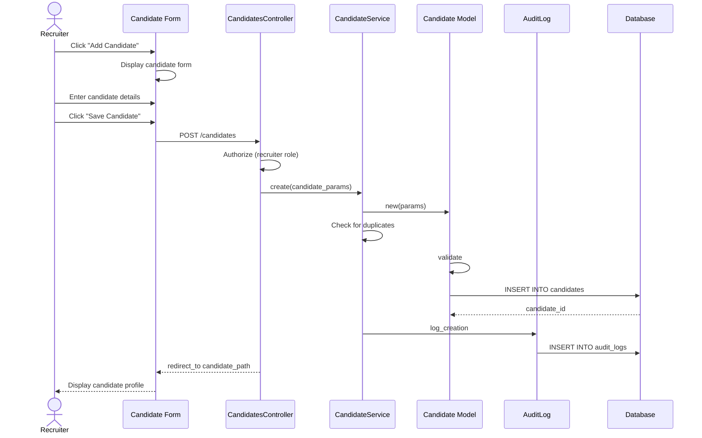

# UC-050: Add Candidate Manually

## Metadata

| Attribute | Value |
|-----------|-------|
| **ID** | UC-050 |
| **Name** | Add Candidate Manually |
| **Functional Area** | Candidate Management |
| **Primary Actor** | Recruiter (ACT-02) |
| **Priority** | P1 |
| **Complexity** | Low |
| **Status** | Draft |

## Description

A recruiter manually creates a new candidate record by entering the candidate's personal information, contact details, and optional professional summary. This is typically used for candidates sourced through networking, job fairs, or direct outreach rather than through formal applications.

## Actors

| Actor | Role in Use Case |
|-------|------------------|
| Recruiter (ACT-02) | Enters candidate information and creates the record |
| System Administrator (ACT-01) | Configures custom fields for candidates |

## Preconditions

- [ ] User is authenticated and has Recruiter or Admin role
- [ ] User belongs to an organization with active subscription
- [ ] Organization has candidate management enabled

## Postconditions

### Success
- [ ] New Candidate record created in the organization
- [ ] Candidate source tracked as "manual_entry"
- [ ] Audit log entry created for candidate creation
- [ ] Candidate available for search and talent pool assignment

### Failure
- [ ] No candidate record created
- [ ] User shown validation errors
- [ ] No audit entry created

## Triggers

- Recruiter clicks "Add Candidate" button from candidates list
- Recruiter clicks "New Candidate" from dashboard quick actions
- Recruiter selects "Add Manually" from candidate sourcing options

## Basic Flow



| Step | Actor | Action | System Response |
|------|-------|--------|-----------------|
| 1 | Recruiter | Clicks "Add Candidate" button | System displays candidate creation form |
| 2 | Recruiter | Enters first name | First name field populated |
| 3 | Recruiter | Enters last name | Last name field populated |
| 4 | Recruiter | Enters email address | Email field populated |
| 5 | Recruiter | Enters phone number (optional) | Phone field populated |
| 6 | Recruiter | Enters location (optional) | Location field populated |
| 7 | Recruiter | Enters LinkedIn URL (optional) | LinkedIn field populated |
| 8 | Recruiter | Enters portfolio URL (optional) | Portfolio field populated |
| 9 | Recruiter | Enters professional summary (optional) | Summary editor captures content |
| 10 | Recruiter | Fills custom fields (if configured) | Custom field values captured |
| 11 | Recruiter | Clicks "Save Candidate" | System validates all fields |
| 12 | System | Validates required fields | Validation passes |
| 13 | System | Checks for duplicate candidates | No duplicates found (or user proceeds) |
| 14 | System | Creates Candidate record | Candidate saved |
| 15 | System | Creates CandidateSource record | Source tracked as manual_entry |
| 16 | System | Creates audit log entry | Audit record saved |
| 17 | System | Redirects to candidate profile | Candidate detail displayed |

## Alternative Flows

### AF-1: Duplicate Candidate Detected

**Trigger:** System detects potential duplicate at step 13

| Step | Actor | Action | System Response |
|------|-------|--------|-----------------|
| 13a | System | Detects potential duplicate by email | Displays duplicate warning modal |
| 13b | System | Shows existing candidate details | Recruiter can compare |
| 13c | Recruiter | Clicks "View Existing" | Redirects to existing candidate |
| 13d | Recruiter | Clicks "Create Anyway" | Proceeds with creation |

**Resumption:** If "Create Anyway", continues at step 14

### AF-2: Save and Add Another

**Trigger:** Recruiter clicks "Save and Add Another" at step 11

| Step | Actor | Action | System Response |
|------|-------|--------|-----------------|
| 11a | Recruiter | Clicks "Save and Add Another" | System validates and saves |
| 12a | System | Creates candidate | Candidate saved |
| 13a | System | Clears form | Form reset with success message |
| 14a | System | Displays empty form | Ready for next candidate |

**Resumption:** Returns to step 2 with empty form

### AF-3: Save and Add to Job

**Trigger:** Recruiter clicks "Save and Add to Job" at step 11

| Step | Actor | Action | System Response |
|------|-------|--------|-----------------|
| 11b | Recruiter | Clicks "Save and Add to Job" | System shows job selection |
| 12b | Recruiter | Selects target job | Job selected |
| 13b | System | Creates candidate and application | Both records created |
| 14b | System | Redirects to job pipeline | Shows candidate in pipeline |

**Resumption:** Use case ends (triggers UC-101)

## Exception Flows

### EF-1: Validation Failure

**Trigger:** Required fields missing or invalid at step 12

| Step | Actor | Action | System Response |
|------|-------|--------|-----------------|
| 12.1 | System | Detects validation errors | Highlights invalid fields |
| 12.2 | System | Displays error messages | Shows specific errors |
| 12.3 | Recruiter | Corrects invalid fields | Fields updated |
| 12.4 | Recruiter | Resubmits form | System re-validates |

**Resolution:** Returns to step 12, continues if valid

### EF-2: Invalid Email Format

**Trigger:** Email format invalid at step 4

| Step | Actor | Action | System Response |
|------|-------|--------|-----------------|
| 4.1 | System | Validates email format | Displays inline error |
| 4.2 | Recruiter | Corrects email | Error clears |

**Resolution:** Continues with valid email

### EF-3: Phone Number Format Error

**Trigger:** Phone number format invalid at step 5

| Step | Actor | Action | System Response |
|------|-------|--------|-----------------|
| 5.1 | System | Validates phone format | Displays format hint |
| 5.2 | Recruiter | Corrects phone number | Format accepted |

**Resolution:** Continues with valid phone

## Business Rules

| ID | Rule | Description |
|----|------|-------------|
| BR-050.1 | Required Fields | First name, last name, and email are required |
| BR-050.2 | Email Uniqueness | Email must be unique within organization |
| BR-050.3 | Email Format | Email must be valid format (RFC 5322) |
| BR-050.4 | Phone Format | Phone numbers stored in E.164 format |
| BR-050.5 | PII Encryption | Email and phone must be encrypted at rest |
| BR-050.6 | Source Tracking | Source must be recorded as "manual_entry" |

## Data Requirements

### Input Data

| Field | Type | Required | Validation |
|-------|------|----------|------------|
| first_name | string | Yes | Max 100 chars, not blank |
| last_name | string | Yes | Max 100 chars, not blank |
| email | string | Yes | Valid email format, unique in org |
| phone | string | No | Valid phone format |
| location | string | No | Max 255 chars |
| linkedin_url | string | No | Valid LinkedIn URL format |
| portfolio_url | string | No | Valid URL format |
| summary | text | No | Max 10,000 chars |
| custom_fields | json | No | Based on organization config |

### Output Data

| Field | Type | Description |
|-------|------|-------------|
| id | integer | Unique candidate identifier |
| organization_id | integer | Owning organization |
| created_at | datetime | Timestamp of creation |

## Database Transactions

### Tables Affected

| Table | Operation | Conditions |
|-------|-----------|------------|
| candidates | CREATE | Always |
| candidate_sources | CREATE | Always |
| candidate_custom_field_values | CREATE | If custom fields provided |
| audit_logs | CREATE | Always |

### Transaction Detail

```sql
-- Add Candidate Manually Transaction
BEGIN TRANSACTION;

-- Step 1: Check for duplicate candidates
SELECT id, first_name, last_name, email
FROM candidates
WHERE organization_id = @organization_id
  AND email = @email
  AND discarded_at IS NULL;

-- Step 2: Insert candidate record
INSERT INTO candidates (
    organization_id,
    first_name,
    last_name,
    email,
    phone,
    location,
    linkedin_url,
    portfolio_url,
    summary,
    created_at,
    updated_at
) VALUES (
    @organization_id,
    @first_name,
    @last_name,
    @email,  -- encrypted
    @phone,  -- encrypted
    @location,
    @linkedin_url,
    @portfolio_url,
    @summary,
    NOW(),
    NOW()
);

SET @candidate_id = LAST_INSERT_ID();

-- Step 3: Create source tracking record
INSERT INTO candidate_sources (
    candidate_id,
    source_type,
    source_detail,
    created_at
) VALUES (
    @candidate_id,
    'manual_entry',
    'Recruiter added manually',
    NOW()
);

-- Step 4: Insert custom field values (if any)
INSERT INTO candidate_custom_field_values (
    candidate_id,
    custom_field_id,
    value,
    created_at,
    updated_at
)
SELECT @candidate_id, cf.id, @custom_value, NOW(), NOW()
FROM custom_fields cf
WHERE cf.organization_id = @organization_id
  AND cf.entity_type = 'candidate'
  AND cf.field_key = @field_key;

-- Step 5: Create audit log entry
INSERT INTO audit_logs (
    organization_id,
    user_id,
    action,
    auditable_type,
    auditable_id,
    metadata,
    ip_address,
    user_agent,
    created_at
) VALUES (
    @organization_id,
    @current_user_id,
    'candidate.created',
    'Candidate',
    @candidate_id,
    JSON_OBJECT(
        'first_name', @first_name,
        'last_name', @last_name,
        'source', 'manual_entry'
    ),
    @ip_address,
    @user_agent,
    NOW()
);

COMMIT;
```

### Rollback Scenarios

| Scenario | Rollback Action |
|----------|-----------------|
| Validation failure | No transaction started, return errors |
| Duplicate detected and user cancels | No commit, return to form |
| Database constraint violation | Full rollback, show error |

## UI/UX Requirements

### Screen/Component

- **Location:** /candidates/new
- **Entry Point:**
  - "Add Candidate" button on /candidates
  - "New Candidate" card on dashboard
  - Quick action dropdown
- **Key Elements:**
  - Name fields (first, last)
  - Contact information (email, phone)
  - Location input with autocomplete
  - URL fields with validation indicators
  - Rich text editor for summary
  - Custom fields section (dynamic)
  - Action buttons: "Save", "Save and Add Another", "Save and Add to Job", "Cancel"

### Form Layout

```
+-------------------------------------------------------------+
| Add Candidate                                                |
+-------------------------------------------------------------+
| Personal Information                                         |
| First Name *              Last Name *                        |
| +------------------------+ +------------------------+        |
| |                        | |                        |        |
| +------------------------+ +------------------------+        |
|                                                              |
| Contact Information                                          |
| Email *                                                      |
| +----------------------------------------------------------+ |
| |                                                          | |
| +----------------------------------------------------------+ |
|                                                              |
| Phone                                                        |
| +----------------------------------------------------------+ |
| | +1 (___) ___-____                                        | |
| +----------------------------------------------------------+ |
|                                                              |
| Location                                                     |
| +----------------------------------------------------------+ |
| | City, State, Country                                     | |
| +----------------------------------------------------------+ |
|                                                              |
| Online Presence                                              |
| LinkedIn URL                                                 |
| +----------------------------------------------------------+ |
| | https://linkedin.com/in/                                 | |
| +----------------------------------------------------------+ |
|                                                              |
| Portfolio/Website                                            |
| +----------------------------------------------------------+ |
| | https://                                                 | |
| +----------------------------------------------------------+ |
|                                                              |
| Professional Summary                                         |
| +----------------------------------------------------------+ |
| | [Rich Text Editor]                                       | |
| |                                                          | |
| +----------------------------------------------------------+ |
|                                                              |
| Custom Fields (if configured)                                |
| +----------------------------------------------------------+ |
| | [Dynamic fields based on org configuration]              | |
| +----------------------------------------------------------+ |
|                                                              |
+-------------------------------------------------------------+
| [Cancel]    [Save and Add Another]  [Save and Add to Job]   |
|                                              [Save Candidate]|
+-------------------------------------------------------------+
```

## Non-Functional Requirements

| Requirement | Target |
|-------------|--------|
| Response Time | Form load < 1s, save < 2s |
| Availability | 99.9% |
| Duplicate Check | < 500ms for email lookup |

## Security Considerations

- [x] Authentication required
- [x] Authorization check: User must have recruiter or admin role
- [x] Organization scoping: Candidate created within user's organization only
- [x] Data encryption: Email and phone encrypted at rest
- [x] Audit logging: Creation logged with user, timestamp, IP

## Related Use Cases

| Use Case | Relationship |
|----------|--------------|
| UC-051 Import Candidates | Alternative method to add candidates |
| UC-054 Edit Candidate Profile | Can follow to modify candidate |
| UC-055 Upload Resume | Can follow to attach resume |
| UC-057 Add Candidate Note | Can follow to add notes |
| UC-058 Tag Candidate | Can follow to apply tags |
| UC-059 Detect Duplicates | Invoked during creation |
| UC-101 Add Candidate to Job | AF-3 triggers this |

---

## Data Model References

> Cross-references to [DATA_MODEL.md](../DATA_MODEL.md) and [CRUD_MATRIX.md](../CRUD_MATRIX.md)

### Subject Areas

| Subject Area | ID | Relationship |
|--------------|-----|--------------|
| Candidate | SA-04 | Primary |
| Organization | SA-02 | Secondary |
| Compliance & Audit | SA-09 | Reference |

### Entities CRUD

| Entity | C | R | U | D | Notes |
|--------|---|---|---|---|-------|
| Candidate | X | | | | Created in step 14 |
| CandidateSource | X | | | | Created in step 15 |
| CandidateCustomFieldValue | X | | | | Created if custom fields provided |
| CustomField | | X | | | Read to display form fields |
| AuditLog | X | | | | Created in step 16 |

**Legend:** C = Create, R = Read, U = Update, D = Delete

---

## Process Model References

> Cross-references to [PROCESS_MODEL.md](../PROCESS_MODEL.md) and [PROCESS_CRUD_MATRIX.md](../PROCESS_CRUD_MATRIX.md)

| Attribute | Value | Link |
|-----------|-------|------|
| **Elementary Business Process** | EP-0201: Add Candidate Manually | [PROCESS_MODEL.md#ep-0201](../PROCESS_MODEL.md#bp-102-candidate-sourcing) |
| **Business Process** | BP-102: Candidate Sourcing | [PROCESS_MODEL.md#bp-102](../PROCESS_MODEL.md#bp-102-candidate-sourcing) |
| **Business Function** | BF-01: Talent Acquisition | [PROCESS_MODEL.md#bf-01](../PROCESS_MODEL.md#bf-01-talent-acquisition) |

### EBP Details

| Attribute | Value |
|-----------|-------|
| **Trigger** | Recruiter initiates candidate creation from UI |
| **Input** | Candidate personal and contact information |
| **Output** | New Candidate record in the system |
| **Business Rules** | BR-050.1 through BR-050.6 (see Business Rules section) |

---

## Traceability Matrix

> Complete artifact mapping for requirements traceability

| Artifact Type | ID | Name | Link |
|---------------|-----|------|------|
| **Use Case** | UC-050 | Add Candidate Manually | *(this document)* |
| **Elementary Process** | EP-0201 | Add Candidate Manually | [PROCESS_MODEL.md](../PROCESS_MODEL.md#bp-102-candidate-sourcing) |
| **Business Process** | BP-102 | Candidate Sourcing | [PROCESS_MODEL.md](../PROCESS_MODEL.md#bp-102-candidate-sourcing) |
| **Business Function** | BF-01 | Talent Acquisition | [PROCESS_MODEL.md](../PROCESS_MODEL.md#bf-01-talent-acquisition) |
| **Primary Actor** | ACT-02 | Recruiter | [ACTORS.md](../ACTORS.md#act-02-recruiter) |
| **Subject Area (Primary)** | SA-04 | Candidate | [DATA_MODEL.md](../DATA_MODEL.md#sa-04-candidate) |
| **Subject Area (Secondary)** | SA-02 | Organization | [DATA_MODEL.md](../DATA_MODEL.md#sa-02-organization) |
| **CRUD Matrix Row** | UC-050 | - | [CRUD_MATRIX.md](../CRUD_MATRIX.md#uc-050) |
| **Process CRUD Row** | EP-0201 | - | [PROCESS_CRUD_MATRIX.md](../PROCESS_CRUD_MATRIX.md#ep-0201) |

### Implementation Artifacts

| Artifact Type | Path/Reference | Status |
|---------------|----------------|--------|
| Controller | `app/controllers/admin/candidates_controller.rb` | Planned |
| Model | `app/models/candidate.rb` | Planned |
| Service | `app/services/candidates/create_service.rb` | Planned |
| Policy | `app/policies/candidate_policy.rb` | Planned |
| View | `app/views/admin/candidates/new.html.erb` | Planned |
| Test | `test/controllers/admin/candidates_controller_test.rb` | Planned |

---

## Open Questions

1. Should we support importing from LinkedIn profile URL?
2. What is the maximum number of custom fields per candidate?
3. Should we auto-detect timezone from location?

## Change History

| Version | Date | Author | Changes |
|---------|------|--------|---------|
| 0.1 | 2026-01-25 | System | Initial draft |
