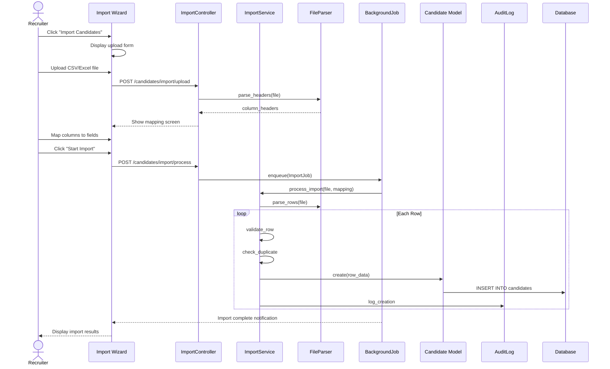

# UC-051: Import Candidates

## Metadata

| Attribute | Value |
|-----------|-------|
| **ID** | UC-051 |
| **Name** | Import Candidates |
| **Functional Area** | Candidate Management |
| **Primary Actor** | Recruiter (ACT-02) |
| **Priority** | P2 |
| **Complexity** | High |
| **Status** | Draft |

## Description

A recruiter imports multiple candidates from a CSV or Excel file. The system validates the file format, maps columns to candidate fields, detects duplicates, and creates candidate records in bulk. This is used for migrating data from other systems or importing candidates from events like job fairs.

## Actors

| Actor | Role in Use Case |
|-------|------------------|
| Recruiter (ACT-02) | Uploads file and manages import process |
| System Administrator (ACT-01) | Configures import templates and field mappings |
| Scheduler (ACT-11) | Processes large imports asynchronously |

## Preconditions

- [ ] User is authenticated and has Recruiter or Admin role
- [ ] User belongs to an organization with active subscription
- [ ] Import file is in supported format (CSV, XLSX)
- [ ] File size within allowed limits (max 10MB)

## Postconditions

### Success
- [ ] All valid candidate records created
- [ ] Duplicate candidates flagged for review
- [ ] Import summary report generated
- [ ] Audit log entries created for all imported candidates

### Failure
- [ ] Import aborted or partially completed
- [ ] Error report generated
- [ ] User notified of failure reasons

## Triggers

- Recruiter clicks "Import Candidates" button from candidates list
- Recruiter selects "Bulk Import" from candidate actions menu
- Recruiter drops file on import drop zone

## Basic Flow



| Step | Actor | Action | System Response |
|------|-------|--------|-----------------|
| 1 | Recruiter | Clicks "Import Candidates" button | System displays import wizard |
| 2 | Recruiter | Selects file or drags to drop zone | File uploaded and validated |
| 3 | System | Parses file headers | Extracts column names |
| 4 | System | Displays column mapping screen | Shows source and target fields |
| 5 | Recruiter | Maps each column to candidate field | Mapping saved |
| 6 | Recruiter | Configures duplicate handling option | Option saved |
| 7 | Recruiter | Clicks "Preview Import" | System shows sample rows |
| 8 | System | Validates sample data | Shows validation results |
| 9 | Recruiter | Clicks "Start Import" | System queues import job |
| 10 | System | Processes import in background | Progress updated in real-time |
| 11 | System | Validates each row | Records valid/invalid status |
| 12 | System | Checks for duplicates | Flags potential duplicates |
| 13 | System | Creates candidate records | Candidates saved |
| 14 | System | Creates audit log entries | Audit records saved |
| 15 | System | Generates import report | Report available for download |
| 16 | System | Notifies recruiter | Email and in-app notification sent |

## Alternative Flows

### AF-1: Use Saved Import Template

**Trigger:** Recruiter selects existing template at step 4

| Step | Actor | Action | System Response |
|------|-------|--------|-----------------|
| 4a | System | Displays saved templates | Template list shown |
| 4b | Recruiter | Selects template | Mapping auto-populated |
| 4c | Recruiter | Adjusts mapping if needed | Mapping updated |

**Resumption:** Continues at step 6

### AF-2: Skip Duplicates

**Trigger:** Recruiter selects "Skip Duplicates" at step 6

| Step | Actor | Action | System Response |
|------|-------|--------|-----------------|
| 6a | Recruiter | Selects "Skip Duplicates" | Option saved |
| 12a | System | Detects duplicate | Skips row, logs as skipped |

**Resumption:** Continues with next row

### AF-3: Update Existing on Duplicate

**Trigger:** Recruiter selects "Update Existing" at step 6

| Step | Actor | Action | System Response |
|------|-------|--------|-----------------|
| 6b | Recruiter | Selects "Update Existing" | Option saved |
| 12b | System | Detects duplicate | Updates existing record |

**Resumption:** Continues with next row

### AF-4: Small File Synchronous Import

**Trigger:** File has fewer than 50 rows

| Step | Actor | Action | System Response |
|------|-------|--------|-----------------|
| 9a | System | Detects small file | Processes synchronously |
| 10a | System | Imports all rows | Shows progress bar |
| 11a | System | Completes import | Displays results immediately |

**Resumption:** Use case ends with results displayed

## Exception Flows

### EF-1: Invalid File Format

**Trigger:** File is not CSV or XLSX

| Step | Actor | Action | System Response |
|------|-------|--------|-----------------|
| 2.1 | System | Detects invalid format | Displays error message |
| 2.2 | Recruiter | Uploads correct format | Processing continues |

**Resolution:** Returns to step 2

### EF-2: File Too Large

**Trigger:** File exceeds 10MB limit

| Step | Actor | Action | System Response |
|------|-------|--------|-----------------|
| 2.1 | System | Detects file size | Displays size limit error |
| 2.2 | Recruiter | Splits file or compresses | Uploads smaller file |

**Resolution:** Returns to step 2

### EF-3: Missing Required Columns

**Trigger:** Required fields cannot be mapped at step 5

| Step | Actor | Action | System Response |
|------|-------|--------|-----------------|
| 5.1 | System | Detects missing mappings | Highlights required fields |
| 5.2 | Recruiter | Adds missing columns to file | Re-uploads file |
| 5.3 | System | Re-parses file | New columns available |

**Resolution:** Returns to step 5

### EF-4: Import Job Failure

**Trigger:** Background job fails during processing

| Step | Actor | Action | System Response |
|------|-------|--------|-----------------|
| 10.1 | System | Detects job failure | Logs error, notifies user |
| 10.2 | Recruiter | Views error details | Can retry or download partial results |
| 10.3 | Recruiter | Clicks "Retry Failed Rows" | Re-queues failed rows |

**Resolution:** Partial import completed, failed rows available for retry

## Business Rules

| ID | Rule | Description |
|----|------|-------------|
| BR-051.1 | Required Fields | First name, last name, and email required for each row |
| BR-051.2 | Email Uniqueness | Duplicate handling based on email match within org |
| BR-051.3 | File Size Limit | Maximum file size is 10MB |
| BR-051.4 | Row Limit | Maximum 10,000 rows per import |
| BR-051.5 | Supported Formats | CSV (UTF-8) and XLSX (Excel 2007+) supported |
| BR-051.6 | Async Threshold | Imports with >50 rows processed asynchronously |
| BR-051.7 | Source Tracking | All imported candidates marked with source "bulk_import" |

## Data Requirements

### Input Data

| Field | Type | Required | Validation |
|-------|------|----------|------------|
| file | binary | Yes | CSV or XLSX, max 10MB |
| column_mapping | json | Yes | Maps file columns to candidate fields |
| duplicate_action | enum | Yes | skip, update, create_new |
| import_template_id | integer | No | Saved template to use |

### Output Data

| Field | Type | Description |
|-------|------|-------------|
| import_id | integer | Unique import identifier |
| total_rows | integer | Total rows in file |
| created_count | integer | New candidates created |
| updated_count | integer | Existing candidates updated |
| skipped_count | integer | Rows skipped (duplicates) |
| error_count | integer | Rows with errors |
| error_report_url | string | URL to download error details |

## Database Transactions

### Tables Affected

| Table | Operation | Conditions |
|-------|-----------|------------|
| candidate_imports | CREATE | Always |
| candidates | CREATE | For new candidates |
| candidates | UPDATE | For duplicate updates |
| candidate_sources | CREATE | For each imported candidate |
| audit_logs | CREATE | For each candidate operation |

### Transaction Detail

```sql
-- Import Candidates Transaction (per batch of 100 rows)
BEGIN TRANSACTION;

-- Step 1: Update import progress
UPDATE candidate_imports
SET processed_rows = processed_rows + @batch_size,
    status = 'processing',
    updated_at = NOW()
WHERE id = @import_id;

-- Step 2: Check for duplicates (batch lookup)
SELECT id, email
FROM candidates
WHERE organization_id = @organization_id
  AND email IN (@email_list)
  AND discarded_at IS NULL;

-- Step 3: Insert new candidates (bulk insert)
INSERT INTO candidates (
    organization_id,
    first_name,
    last_name,
    email,
    phone,
    location,
    linkedin_url,
    portfolio_url,
    summary,
    created_at,
    updated_at
) VALUES
    (@org_id, @first1, @last1, @email1, @phone1, @loc1, @li1, @port1, @sum1, NOW(), NOW()),
    (@org_id, @first2, @last2, @email2, @phone2, @loc2, @li2, @port2, @sum2, NOW(), NOW()),
    -- ... more rows
;

-- Step 4: Create source tracking records
INSERT INTO candidate_sources (
    candidate_id,
    source_type,
    source_detail,
    source_job_id,
    created_at
)
SELECT c.id, 'bulk_import', @import_id, NULL, NOW()
FROM candidates c
WHERE c.id IN (@new_candidate_ids);

-- Step 5: Create audit log entries (bulk)
INSERT INTO audit_logs (
    organization_id,
    user_id,
    action,
    auditable_type,
    auditable_id,
    metadata,
    created_at
)
SELECT
    @organization_id,
    @current_user_id,
    'candidate.imported',
    'Candidate',
    c.id,
    JSON_OBJECT('import_id', @import_id, 'row_number', @row_num),
    NOW()
FROM candidates c
WHERE c.id IN (@new_candidate_ids);

COMMIT;
```

### Rollback Scenarios

| Scenario | Rollback Action |
|----------|-----------------|
| Batch validation failure | Skip invalid rows, continue with valid |
| Database constraint violation | Rollback batch, log errors, continue |
| System error | Rollback current batch, mark import as failed |

## UI/UX Requirements

### Screen/Component

- **Location:** /candidates/import
- **Entry Point:**
  - "Import" button on /candidates
  - "Bulk Import" from actions menu
- **Key Elements:**
  - File drop zone with drag-and-drop support
  - Column mapping interface with auto-detection
  - Preview table showing sample data
  - Progress bar for async imports
  - Results summary with download options

### Import Wizard Layout

```
+-------------------------------------------------------------+
| Import Candidates                                            |
+-------------------------------------------------------------+
| Step 1 of 4: Upload File                                     |
+-------------------------------------------------------------+
|                                                              |
|  +------------------------------------------------------+   |
|  |                                                      |   |
|  |     Drag and drop your CSV or Excel file here       |   |
|  |                                                      |   |
|  |                  [Browse Files]                      |   |
|  |                                                      |   |
|  +------------------------------------------------------+   |
|                                                              |
|  Supported formats: CSV, XLSX (max 10MB, 10,000 rows)       |
|                                                              |
|  [Download Template]                                         |
|                                                              |
+-------------------------------------------------------------+
| [Cancel]                                            [Next >] |
+-------------------------------------------------------------+

+-------------------------------------------------------------+
| Step 2 of 4: Map Columns                                     |
+-------------------------------------------------------------+
| File Column          | Maps To           | Sample Value      |
|---------------------|-------------------|-------------------|
| Name                | -> First Name  v  | John              |
| Surname             | -> Last Name   v  | Smith             |
| Email Address       | -> Email *     v  | john@example.com  |
| Mobile              | -> Phone       v  | +1-555-0100       |
| City                | -> Location    v  | New York          |
| LinkedIn            | -> LinkedIn    v  | /in/johnsmith     |
|                     |                   |                   |
| * Required field                                             |
|                                                              |
| [Use Saved Template v]        [Save as Template]            |
+-------------------------------------------------------------+
| [< Back]                                            [Next >] |
+-------------------------------------------------------------+

+-------------------------------------------------------------+
| Step 3 of 4: Configure Options                               |
+-------------------------------------------------------------+
|                                                              |
| Duplicate Handling (matching by email)                       |
| +--------------------------------------------------------+ |
| | ( ) Skip duplicates - Don't import matching records    | |
| | ( ) Update existing - Update fields if email matches   | |
| | (*) Create new - Create new record even if duplicate   | |
| +--------------------------------------------------------+ |
|                                                              |
| Import Summary                                               |
| +--------------------------------------------------------+ |
| | Total rows: 247                                         | |
| | Valid rows: 243                                         | |
| | Rows with errors: 4 [View Errors]                       | |
| +--------------------------------------------------------+ |
|                                                              |
+-------------------------------------------------------------+
| [< Back]                                     [Start Import]  |
+-------------------------------------------------------------+

+-------------------------------------------------------------+
| Step 4 of 4: Import Progress                                 |
+-------------------------------------------------------------+
|                                                              |
|  Importing candidates...                                     |
|                                                              |
|  [====================>                    ] 45%            |
|                                                              |
|  110 of 243 rows processed                                   |
|                                                              |
|  Created: 98  |  Updated: 12  |  Skipped: 0  |  Errors: 0   |
|                                                              |
+-------------------------------------------------------------+
|                                          [Cancel Import]     |
+-------------------------------------------------------------+
```

## Non-Functional Requirements

| Requirement | Target |
|-------------|--------|
| Response Time | File upload < 5s for 10MB |
| Processing Speed | 100 rows/second minimum |
| Availability | 99.9% |
| Max Concurrent Imports | 10 per organization |

## Security Considerations

- [x] Authentication required
- [x] Authorization check: User must have recruiter or admin role
- [x] File validation: Virus scan on upload
- [x] Data encryption: Imported PII encrypted at rest
- [x] Audit logging: Import operation logged with details
- [x] Rate limiting: Max imports per hour per user

## Related Use Cases

| Use Case | Relationship |
|----------|--------------|
| UC-050 Add Candidate Manually | Alternative single-record method |
| UC-054 Edit Candidate Profile | Can follow to modify imported candidates |
| UC-059 Detect Duplicates | Invoked during import |
| UC-060 Merge Candidates | Can follow to resolve duplicates |

---

## Data Model References

> Cross-references to [DATA_MODEL.md](../DATA_MODEL.md) and [CRUD_MATRIX.md](../CRUD_MATRIX.md)

### Subject Areas

| Subject Area | ID | Relationship |
|--------------|-----|--------------|
| Candidate | SA-04 | Primary |
| Organization | SA-02 | Secondary |
| Compliance & Audit | SA-09 | Reference |

### Entities CRUD

| Entity | C | R | U | D | Notes |
|--------|---|---|---|---|-------|
| Candidate | X | X | X | | Created or updated during import |
| CandidateSource | X | | | | Created for each imported candidate |
| CandidateImport | X | X | X | | Tracks import job status |
| AuditLog | X | | | | Created for each candidate operation |

**Legend:** C = Create, R = Read, U = Update, D = Delete

---

## Process Model References

> Cross-references to [PROCESS_MODEL.md](../PROCESS_MODEL.md) and [PROCESS_CRUD_MATRIX.md](../PROCESS_CRUD_MATRIX.md)

| Attribute | Value | Link |
|-----------|-------|------|
| **Elementary Business Process** | EP-0202: Import Candidates | [PROCESS_MODEL.md#ep-0202](../PROCESS_MODEL.md#bp-102-candidate-sourcing) |
| **Business Process** | BP-102: Candidate Sourcing | [PROCESS_MODEL.md#bp-102](../PROCESS_MODEL.md#bp-102-candidate-sourcing) |
| **Business Function** | BF-01: Talent Acquisition | [PROCESS_MODEL.md#bf-01](../PROCESS_MODEL.md#bf-01-talent-acquisition) |

### EBP Details

| Attribute | Value |
|-----------|-------|
| **Trigger** | Recruiter uploads file for bulk candidate import |
| **Input** | CSV/XLSX file with candidate data, column mapping |
| **Output** | Multiple Candidate records, import summary report |
| **Business Rules** | BR-051.1 through BR-051.7 (see Business Rules section) |

---

## Traceability Matrix

> Complete artifact mapping for requirements traceability

| Artifact Type | ID | Name | Link |
|---------------|-----|------|------|
| **Use Case** | UC-051 | Import Candidates | *(this document)* |
| **Elementary Process** | EP-0202 | Import Candidates | [PROCESS_MODEL.md](../PROCESS_MODEL.md#bp-102-candidate-sourcing) |
| **Business Process** | BP-102 | Candidate Sourcing | [PROCESS_MODEL.md](../PROCESS_MODEL.md#bp-102-candidate-sourcing) |
| **Business Function** | BF-01 | Talent Acquisition | [PROCESS_MODEL.md](../PROCESS_MODEL.md#bf-01-talent-acquisition) |
| **Primary Actor** | ACT-02 | Recruiter | [ACTORS.md](../ACTORS.md#act-02-recruiter) |
| **Subject Area (Primary)** | SA-04 | Candidate | [DATA_MODEL.md](../DATA_MODEL.md#sa-04-candidate) |
| **CRUD Matrix Row** | UC-051 | - | [CRUD_MATRIX.md](../CRUD_MATRIX.md#uc-051) |
| **Process CRUD Row** | EP-0202 | - | [PROCESS_CRUD_MATRIX.md](../PROCESS_CRUD_MATRIX.md#ep-0202) |

### Implementation Artifacts

| Artifact Type | Path/Reference | Status |
|---------------|----------------|--------|
| Controller | `app/controllers/admin/candidate_imports_controller.rb` | Planned |
| Model | `app/models/candidate_import.rb` | Planned |
| Service | `app/services/candidates/import_service.rb` | Planned |
| Job | `app/jobs/candidate_import_job.rb` | Planned |
| Policy | `app/policies/candidate_import_policy.rb` | Planned |
| View | `app/views/admin/candidate_imports/` | Planned |
| Test | `test/services/candidates/import_service_test.rb` | Planned |

---

## Open Questions

1. Should we support other file formats (JSON, XML)?
2. What is the data retention period for import logs?
3. Should we allow scheduling imports for later processing?
4. Should we support importing candidates directly to a job?

## Change History

| Version | Date | Author | Changes |
|---------|------|--------|---------|
| 0.1 | 2026-01-25 | System | Initial draft |
