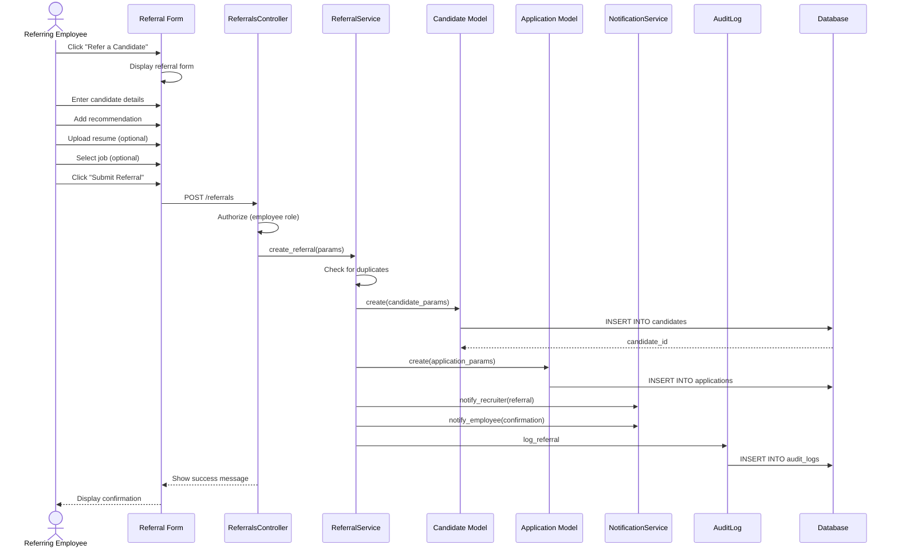

# UC-052: Submit Referral

## Metadata

| Attribute | Value |
|-----------|-------|
| **ID** | UC-052 |
| **Name** | Submit Referral |
| **Functional Area** | Candidate Management |
| **Primary Actor** | Referring Employee (ACT-08) |
| **Priority** | P2 |
| **Complexity** | Medium |
| **Status** | Draft |

## Description

An employee submits a referral for a candidate they recommend for a position. The referral includes the candidate's contact information, a recommendation statement, and optionally a resume. The referral creates a candidate record linked to the referring employee for tracking referral bonuses and attribution.

## Actors

| Actor | Role in Use Case |
|-------|------------------|
| Referring Employee (ACT-08) | Submits candidate referral with recommendation |
| Recruiter (ACT-02) | Reviews and processes referral |
| System Administrator (ACT-01) | Configures referral program settings |

## Preconditions

- [ ] Referring employee is authenticated and has referral submission permissions
- [ ] At least one job is open and accepting referrals
- [ ] Referral program is enabled for the organization
- [ ] Employee has not exceeded referral submission limits (if configured)

## Postconditions

### Success
- [ ] New Candidate record created with referred_by_id set
- [ ] Referral relationship tracked for bonus eligibility
- [ ] Application created for specified job (if selected)
- [ ] Recruiter notified of new referral
- [ ] Referring employee notified of successful submission
- [ ] Audit log entry created

### Failure
- [ ] No candidate record created
- [ ] User shown validation errors
- [ ] Referral not tracked

## Triggers

- Employee clicks "Refer a Candidate" from internal portal
- Employee clicks "Refer a Friend" from job posting
- Employee accesses referral link from email campaign

## Basic Flow



| Step | Actor | Action | System Response |
|------|-------|--------|-----------------|
| 1 | Employee | Clicks "Refer a Candidate" | System displays referral form |
| 2 | Employee | Enters candidate first name | First name captured |
| 3 | Employee | Enters candidate last name | Last name captured |
| 4 | Employee | Enters candidate email | Email captured |
| 5 | Employee | Enters candidate phone (optional) | Phone captured |
| 6 | Employee | Writes recommendation statement | Recommendation captured |
| 7 | Employee | Selects relationship to candidate | Relationship recorded |
| 8 | Employee | Uploads resume (optional) | Resume attached |
| 9 | Employee | Selects target job (optional) | Job association set |
| 10 | Employee | Clicks "Submit Referral" | System validates submission |
| 11 | System | Checks for duplicate candidates | No duplicate or proceeds |
| 12 | System | Creates Candidate record | Candidate saved with referred_by_id |
| 13 | System | Creates Application (if job selected) | Application in pipeline |
| 14 | System | Notifies assigned recruiter | Email sent to recruiter |
| 15 | System | Sends confirmation to employee | Confirmation email sent |
| 16 | System | Creates audit log entry | Audit record saved |
| 17 | System | Displays success page | Confirmation shown to employee |

## Alternative Flows

### AF-1: Referral Without Specific Job

**Trigger:** Employee does not select a specific job at step 9

| Step | Actor | Action | System Response |
|------|-------|--------|-----------------|
| 9a | Employee | Skips job selection | No job selected |
| 12a | System | Creates Candidate only | No application created |
| 13a | System | Adds to general talent pool | Candidate available for any job |

**Resumption:** Continues at step 14

### AF-2: Duplicate Candidate - Employee Proceeds

**Trigger:** System finds existing candidate with same email at step 11

| Step | Actor | Action | System Response |
|------|-------|--------|-----------------|
| 11a | System | Detects existing candidate | Shows duplicate warning |
| 11b | Employee | Views existing referral status | Status displayed |
| 11c | Employee | Clicks "Submit Anyway" | Creates new application for job |

**Resumption:** Continues at step 13 (skips candidate creation)

### AF-3: Self-Referral (Apply Through Employee)

**Trigger:** Candidate wants employee to submit on their behalf

| Step | Actor | Action | System Response |
|------|-------|--------|-----------------|
| 7a | Employee | Selects "Submitting for candidate" | Self-referral mode enabled |
| 7b | Employee | Confirms candidate consent | Consent recorded |

**Resumption:** Continues at step 8

## Exception Flows

### EF-1: Validation Failure

**Trigger:** Required fields missing or invalid

| Step | Actor | Action | System Response |
|------|-------|--------|-----------------|
| 10.1 | System | Detects validation errors | Highlights invalid fields |
| 10.2 | System | Displays error messages | Shows specific errors |
| 10.3 | Employee | Corrects invalid fields | Fields updated |
| 10.4 | Employee | Resubmits form | System re-validates |

**Resolution:** Returns to step 10, continues if valid

### EF-2: Job No Longer Open

**Trigger:** Selected job closed after page load but before submission

| Step | Actor | Action | System Response |
|------|-------|--------|-----------------|
| 10.1 | System | Detects closed job | Displays job closed message |
| 10.2 | Employee | Selects different job | New job selected |
| 10.3 | Employee | Resubmits | System re-validates |

**Resolution:** Returns to step 10

### EF-3: Referral Limit Reached

**Trigger:** Employee has exceeded referral limit

| Step | Actor | Action | System Response |
|------|-------|--------|-----------------|
| 1.1 | System | Checks referral quota | Limit reached |
| 1.2 | System | Displays limit message | Shows remaining cooldown |
| 1.3 | Employee | Waits for cooldown period | Returns later |

**Resolution:** Use case blocked until cooldown expires

## Business Rules

| ID | Rule | Description |
|----|------|-------------|
| BR-052.1 | Required Fields | First name, last name, email, and recommendation required |
| BR-052.2 | Email Uniqueness | Email must be unique within organization |
| BR-052.3 | Self-Referral | Employees cannot refer themselves |
| BR-052.4 | Referral Limit | Configurable limit per employee per month (default: unlimited) |
| BR-052.5 | Relationship Required | Must indicate relationship to candidate |
| BR-052.6 | Source Attribution | Source tracked as "referral" with employee ID |
| BR-052.7 | Bonus Eligibility | Referral tracked for potential bonus on hire |

## Data Requirements

### Input Data

| Field | Type | Required | Validation |
|-------|------|----------|------------|
| first_name | string | Yes | Max 100 chars |
| last_name | string | Yes | Max 100 chars |
| email | string | Yes | Valid email format |
| phone | string | No | Valid phone format |
| recommendation | text | Yes | Min 50, max 2000 chars |
| relationship | enum | Yes | colleague, friend, family, professional_contact, other |
| job_id | integer | No | Must be open job |
| resume | file | No | PDF, DOC, DOCX, max 5MB |

### Output Data

| Field | Type | Description |
|-------|------|-------------|
| candidate_id | integer | Created candidate identifier |
| application_id | integer | Created application (if job selected) |
| referral_tracking_id | string | Unique referral tracking code |

## Database Transactions

### Tables Affected

| Table | Operation | Conditions |
|-------|-----------|------------|
| candidates | CREATE | Always |
| candidate_sources | CREATE | Always |
| candidate_notes | CREATE | For recommendation |
| applications | CREATE | If job selected |
| resumes | CREATE | If resume uploaded |
| notifications | CREATE | For recruiter and employee |
| audit_logs | CREATE | Always |

### Transaction Detail

```sql
-- Submit Referral Transaction
BEGIN TRANSACTION;

-- Step 1: Check for duplicate candidates
SELECT id, first_name, last_name, email
FROM candidates
WHERE organization_id = @organization_id
  AND email = @email
  AND discarded_at IS NULL;

-- Step 2: Insert candidate record
INSERT INTO candidates (
    organization_id,
    first_name,
    last_name,
    email,
    phone,
    referred_by_id,
    created_at,
    updated_at
) VALUES (
    @organization_id,
    @first_name,
    @last_name,
    @email,
    @phone,
    @referring_employee_id,
    NOW(),
    NOW()
);

SET @candidate_id = LAST_INSERT_ID();

-- Step 3: Create source tracking record
INSERT INTO candidate_sources (
    candidate_id,
    source_type,
    source_detail,
    source_job_id,
    created_at
) VALUES (
    @candidate_id,
    'referral',
    @relationship,
    @job_id,
    NOW()
);

-- Step 4: Create recommendation note
INSERT INTO candidate_notes (
    candidate_id,
    user_id,
    content,
    visibility,
    pinned,
    created_at,
    updated_at
) VALUES (
    @candidate_id,
    @referring_employee_id,
    @recommendation,
    'team',
    true,
    NOW(),
    NOW()
);

-- Step 5: Create application (if job selected)
INSERT INTO applications (
    organization_id,
    job_id,
    candidate_id,
    current_stage_id,
    status,
    source_type,
    source_detail,
    applied_at,
    last_activity_at,
    created_at,
    updated_at
) VALUES (
    @organization_id,
    @job_id,
    @candidate_id,
    @first_stage_id,
    'active',
    'referral',
    CONCAT('Referred by ', @referring_employee_name),
    NOW(),
    NOW(),
    NOW(),
    NOW()
);

SET @application_id = LAST_INSERT_ID();

-- Step 6: Create audit log entry
INSERT INTO audit_logs (
    organization_id,
    user_id,
    action,
    auditable_type,
    auditable_id,
    metadata,
    ip_address,
    user_agent,
    created_at
) VALUES (
    @organization_id,
    @referring_employee_id,
    'candidate.referred',
    'Candidate',
    @candidate_id,
    JSON_OBJECT(
        'referred_by_id', @referring_employee_id,
        'job_id', @job_id,
        'relationship', @relationship
    ),
    @ip_address,
    @user_agent,
    NOW()
);

COMMIT;
```

### Rollback Scenarios

| Scenario | Rollback Action |
|----------|-----------------|
| Validation failure | No transaction started, return errors |
| Job closed during submission | Rollback, show job closed message |
| Database error | Full rollback, log error |

## UI/UX Requirements

### Screen/Component

- **Location:** /referrals/new or /jobs/:id/refer
- **Entry Point:**
  - "Refer a Candidate" button in employee portal
  - "Refer a Friend" link on job posting
  - Referral campaign email link
- **Key Elements:**
  - Simple, focused form
  - Job selector with search
  - Relationship dropdown
  - Recommendation text area with character count
  - Resume upload with drag-and-drop
  - Clear confirmation on success

### Form Layout

```
+-------------------------------------------------------------+
| Refer a Candidate                                            |
+-------------------------------------------------------------+
|                                                              |
| Know someone great? Help them find their next opportunity!   |
|                                                              |
+-------------------------------------------------------------+
| Candidate Information                                        |
|                                                              |
| First Name *              Last Name *                        |
| +------------------------+ +------------------------+        |
| |                        | |                        |        |
| +------------------------+ +------------------------+        |
|                                                              |
| Email *                                                      |
| +----------------------------------------------------------+ |
| |                                                          | |
| +----------------------------------------------------------+ |
|                                                              |
| Phone                                                        |
| +----------------------------------------------------------+ |
| | +1 (___) ___-____                                        | |
| +----------------------------------------------------------+ |
|                                                              |
+-------------------------------------------------------------+
| Your Recommendation                                          |
|                                                              |
| How do you know this person? *                               |
| +----------------------------------------------------------+ |
| | Select relationship...                                 v | |
| +----------------------------------------------------------+ |
| | - Former colleague                                       | |
| | - Current colleague (different team)                     | |
| | - Friend                                                 | |
| | - Professional contact                                   | |
| | - Family member                                          | |
| | - Other                                                  | |
|                                                              |
| Why would they be a great fit? *                             |
| +----------------------------------------------------------+ |
| |                                                          | |
| |                                                          | |
| | (Min 50 characters, 1847 remaining)                      | |
| +----------------------------------------------------------+ |
|                                                              |
+-------------------------------------------------------------+
| Resume (Optional)                                            |
|                                                              |
| +----------------------------------------------------------+ |
| |   Drag and drop resume here, or [Browse]                 | |
| |   PDF, DOC, DOCX (max 5MB)                               | |
| +----------------------------------------------------------+ |
|                                                              |
+-------------------------------------------------------------+
| Position (Optional)                                          |
|                                                              |
| Recommend for a specific job?                                |
| +----------------------------------------------------------+ |
| | Search open positions...                               v | |
| +----------------------------------------------------------+ |
|                                                              |
| ( ) Let recruiters decide the best fit                       |
|                                                              |
+-------------------------------------------------------------+
| [Cancel]                               [Submit Referral]     |
+-------------------------------------------------------------+
```

### Success Page

```
+-------------------------------------------------------------+
| Referral Submitted!                                          |
+-------------------------------------------------------------+
|                                                              |
|                      [Check mark icon]                       |
|                                                              |
|   Thank you for referring John Smith!                        |
|                                                              |
|   Your referral has been submitted for:                      |
|   Senior Software Engineer                                   |
|                                                              |
|   What happens next?                                         |
|   - Our recruiting team will review the referral             |
|   - John will receive an email about the opportunity         |
|   - You'll be notified of any status updates                 |
|                                                              |
|   Referral Tracking ID: REF-2026-00147                       |
|                                                              |
+-------------------------------------------------------------+
| [Refer Another Candidate]              [View My Referrals]   |
+-------------------------------------------------------------+
```

## Non-Functional Requirements

| Requirement | Target |
|-------------|--------|
| Response Time | Form load < 1s, submit < 2s |
| Availability | 99.9% |
| Concurrent Submissions | Support 100 simultaneous referrals |

## Security Considerations

- [x] Authentication required (employee must be logged in)
- [x] Authorization check: User must have referral submission permission
- [x] Organization scoping: Referral within employee's organization
- [x] Data encryption: Candidate PII encrypted at rest
- [x] Audit logging: Referral logged with full context
- [x] Rate limiting: Configurable referral limits per employee

## Related Use Cases

| Use Case | Relationship |
|----------|--------------|
| UC-050 Add Candidate Manually | Alternative method for recruiters |
| UC-055 Upload Resume | Invoked when resume attached |
| UC-056 Parse Resume | Follows resume upload |
| UC-059 Detect Duplicates | Invoked during submission |
| UC-100 Apply for Job | Creates application similar to this |

---

## Data Model References

> Cross-references to [DATA_MODEL.md](../DATA_MODEL.md) and [CRUD_MATRIX.md](../CRUD_MATRIX.md)

### Subject Areas

| Subject Area | ID | Relationship |
|--------------|-----|--------------|
| Candidate | SA-04 | Primary |
| Application Pipeline | SA-05 | Secondary |
| Organization | SA-02 | Reference |

### Entities CRUD

| Entity | C | R | U | D | Notes |
|--------|---|---|---|---|-------|
| Candidate | X | X | | | Created with referred_by_id |
| CandidateSource | X | | | | Source tracked as referral |
| CandidateNote | X | | | | Recommendation saved as note |
| Application | X | | | | Created if job selected |
| Resume | X | | | | Created if resume uploaded |
| AuditLog | X | | | | Created for referral action |

**Legend:** C = Create, R = Read, U = Update, D = Delete

---

## Process Model References

> Cross-references to [PROCESS_MODEL.md](../PROCESS_MODEL.md) and [PROCESS_CRUD_MATRIX.md](../PROCESS_CRUD_MATRIX.md)

| Attribute | Value | Link |
|-----------|-------|------|
| **Elementary Business Process** | EP-0203: Submit Referral | [PROCESS_MODEL.md#ep-0203](../PROCESS_MODEL.md#bp-102-candidate-sourcing) |
| **Business Process** | BP-102: Candidate Sourcing | [PROCESS_MODEL.md#bp-102](../PROCESS_MODEL.md#bp-102-candidate-sourcing) |
| **Business Function** | BF-01: Talent Acquisition | [PROCESS_MODEL.md#bf-01](../PROCESS_MODEL.md#bf-01-talent-acquisition) |

### EBP Details

| Attribute | Value |
|-----------|-------|
| **Trigger** | Employee initiates referral submission |
| **Input** | Candidate details, recommendation, optional resume and job |
| **Output** | Candidate record with referral attribution, optional application |
| **Business Rules** | BR-052.1 through BR-052.7 (see Business Rules section) |

---

## Traceability Matrix

> Complete artifact mapping for requirements traceability

| Artifact Type | ID | Name | Link |
|---------------|-----|------|------|
| **Use Case** | UC-052 | Submit Referral | *(this document)* |
| **Elementary Process** | EP-0203 | Submit Referral | [PROCESS_MODEL.md](../PROCESS_MODEL.md#bp-102-candidate-sourcing) |
| **Business Process** | BP-102 | Candidate Sourcing | [PROCESS_MODEL.md](../PROCESS_MODEL.md#bp-102-candidate-sourcing) |
| **Business Function** | BF-01 | Talent Acquisition | [PROCESS_MODEL.md](../PROCESS_MODEL.md#bf-01-talent-acquisition) |
| **Primary Actor** | ACT-08 | Referring Employee | [ACTORS.md](../ACTORS.md#act-08-referring-employee) |
| **Subject Area (Primary)** | SA-04 | Candidate | [DATA_MODEL.md](../DATA_MODEL.md#sa-04-candidate) |
| **Subject Area (Secondary)** | SA-05 | Application Pipeline | [DATA_MODEL.md](../DATA_MODEL.md#sa-05-application-pipeline) |
| **CRUD Matrix Row** | UC-052 | - | [CRUD_MATRIX.md](../CRUD_MATRIX.md#uc-052) |
| **Process CRUD Row** | EP-0203 | - | [PROCESS_CRUD_MATRIX.md](../PROCESS_CRUD_MATRIX.md#ep-0203) |

### Implementation Artifacts

| Artifact Type | Path/Reference | Status |
|---------------|----------------|--------|
| Controller | `app/controllers/referrals_controller.rb` | Planned |
| Model | `app/models/candidate.rb` | Planned |
| Service | `app/services/referrals/create_service.rb` | Planned |
| Policy | `app/policies/referral_policy.rb` | Planned |
| View | `app/views/referrals/new.html.erb` | Planned |
| Mailer | `app/mailers/referral_mailer.rb` | Planned |
| Test | `test/controllers/referrals_controller_test.rb` | Planned |

---

## Open Questions

1. Should referred candidates receive a different application experience?
2. What is the referral bonus workflow after hire?
3. Should employees see the full hiring status of their referrals?
4. Should referrals have an expiration period for bonus eligibility?

## Change History

| Version | Date | Author | Changes |
|---------|------|--------|---------|
| 0.1 | 2026-01-25 | System | Initial draft |
