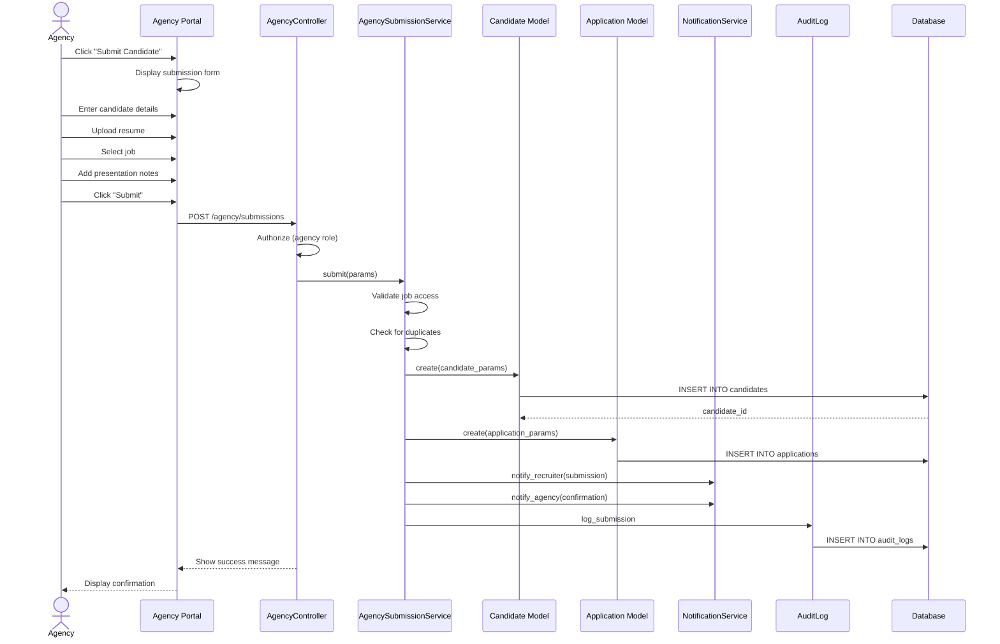

# UC-053: Agency Submission

## Metadata

| Attribute | Value |
|-----------|-------|
| **ID** | UC-053 |
| **Name** | Agency Submission |
| **Functional Area** | Candidate Management |
| **Primary Actor** | Staffing Agency (ACT-09) |
| **Priority** | P2 |
| **Complexity** | Medium |
| **Status** | Draft |

## Description

A staffing agency submits a candidate for a specific job requisition through the agency portal. The submission includes candidate details, resume, and optional notes about the candidate's fit. The system tracks agency attribution for fee calculations upon successful hire.

## Actors

| Actor | Role in Use Case |
|-------|------------------|
| Staffing Agency (ACT-09) | Submits candidate for consideration |
| Recruiter (ACT-02) | Reviews and processes agency submissions |
| System Administrator (ACT-01) | Configures agency relationships and fee structures |

## Preconditions

- [ ] Agency is authenticated and has active partnership status
- [ ] Agency is approved to submit for the specified job
- [ ] Job is open and accepting applications
- [ ] Agency has not exceeded submission limits (if configured)
- [ ] Master Service Agreement (MSA) is active

## Postconditions

### Success
- [ ] New Candidate record created with agency_id set
- [ ] Application created for specified job
- [ ] Agency fee structure linked for hire tracking
- [ ] Recruiter notified of new agency submission
- [ ] Agency receives confirmation with submission ID
- [ ] Audit log entry created

### Failure
- [ ] No candidate or application created
- [ ] Agency shown validation errors or rejection reason
- [ ] No fee tracking established

## Triggers

- Agency user clicks "Submit Candidate" from agency portal
- Agency user accesses job-specific submission link
- Agency submits via API integration

## Basic Flow



| Step | Actor | Action | System Response |
|------|-------|--------|-----------------|
| 1 | Agency | Logs into agency portal | Dashboard displayed |
| 2 | Agency | Clicks "Submit Candidate" | Submission form displayed |
| 3 | Agency | Selects target job | Job details shown |
| 4 | Agency | Enters candidate first name | First name captured |
| 5 | Agency | Enters candidate last name | Last name captured |
| 6 | Agency | Enters candidate email | Email captured |
| 7 | Agency | Enters candidate phone | Phone captured |
| 8 | Agency | Enters candidate location | Location captured |
| 9 | Agency | Uploads resume | Resume attached |
| 10 | Agency | Enters salary expectation | Expectation recorded |
| 11 | Agency | Enters availability/notice period | Availability recorded |
| 12 | Agency | Adds presentation notes | Notes captured |
| 13 | Agency | Clicks "Submit Candidate" | System validates submission |
| 14 | System | Verifies agency job access | Access confirmed |
| 15 | System | Checks for duplicate candidates | Duplicate handling applied |
| 16 | System | Creates Candidate record | Candidate saved with agency_id |
| 17 | System | Creates Application record | Application in first stage |
| 18 | System | Links fee structure | Agency fee tracked |
| 19 | System | Notifies recruiter | Email sent to job recruiter |
| 20 | System | Sends confirmation to agency | Confirmation with submission ID |
| 21 | System | Creates audit log entry | Audit record saved |

## Alternative Flows

### AF-1: Existing Candidate in System

**Trigger:** System finds candidate with same email at step 15

| Step | Actor | Action | System Response |
|------|-------|--------|-----------------|
| 15a | System | Detects existing candidate | Shows existing record |
| 15b | System | Checks if agency owns candidate | Ownership verified |
| 15c | System | Uses existing candidate | Links to new application |

**Resumption:** Continues at step 17

### AF-2: Candidate Owned by Different Agency

**Trigger:** Candidate exists but submitted by another agency

| Step | Actor | Action | System Response |
|------|-------|--------|-----------------|
| 15a | System | Detects candidate with different agency | Shows conflict |
| 15b | System | Applies ownership rules | First submission wins |
| 15c | System | Rejects duplicate submission | Displays rejection reason |

**Resumption:** Use case ends with rejection

### AF-3: API Submission

**Trigger:** Agency submits via API instead of portal

| Step | Actor | Action | System Response |
|------|-------|--------|-----------------|
| 1a | Agency System | Sends API POST request | Request received |
| 2a | System | Validates API key and permissions | Authorization confirmed |
| 3a | System | Processes submission data | Same validation as UI |

**Resumption:** Continues at step 14

### AF-4: Bulk Submission

**Trigger:** Agency submits multiple candidates at once

| Step | Actor | Action | System Response |
|------|-------|--------|-----------------|
| 2a | Agency | Uploads CSV with candidates | File parsed |
| 3a | System | Validates all rows | Shows validation summary |
| 4a | Agency | Confirms submission | Queues for processing |

**Resumption:** Each candidate processed per basic flow

## Exception Flows

### EF-1: Agency Not Approved for Job

**Trigger:** Agency lacks permission for selected job

| Step | Actor | Action | System Response |
|------|-------|--------|-----------------|
| 14.1 | System | Detects no job access | Displays access error |
| 14.2 | Agency | Contacts recruiter for access | Out of system |

**Resolution:** Use case blocked until access granted

### EF-2: Submission Limit Reached

**Trigger:** Agency exceeded submission quota

| Step | Actor | Action | System Response |
|------|-------|--------|-----------------|
| 13.1 | System | Checks submission quota | Limit reached |
| 13.2 | System | Displays limit message | Shows reset date |

**Resolution:** Use case blocked until quota resets

### EF-3: Expired MSA

**Trigger:** Agency's Master Service Agreement has expired

| Step | Actor | Action | System Response |
|------|-------|--------|-----------------|
| 1.1 | System | Checks MSA status | Agreement expired |
| 1.2 | System | Blocks portal access | Shows renewal message |

**Resolution:** Agency must renew agreement

### EF-4: Resume Format Error

**Trigger:** Uploaded resume is invalid format or corrupted

| Step | Actor | Action | System Response |
|------|-------|--------|-----------------|
| 9.1 | System | Validates resume file | Format error |
| 9.2 | System | Displays format requirements | Shows allowed types |
| 9.3 | Agency | Uploads valid resume | Processing continues |

**Resolution:** Returns to step 9

## Business Rules

| ID | Rule | Description |
|----|------|-------------|
| BR-053.1 | Required Fields | First name, last name, email, phone, and resume required |
| BR-053.2 | Job Access | Agency must be approved to submit for specific job |
| BR-053.3 | Candidate Ownership | First agency to submit owns candidate for fee purposes |
| BR-053.4 | Ownership Period | Candidate ownership lasts 6 months from submission |
| BR-053.5 | Fee Attribution | Agency fee tracked based on hire from their submission |
| BR-053.6 | Submission Limit | Configurable monthly limit per agency per job |
| BR-053.7 | Resume Required | Resume file must be provided for agency submissions |
| BR-053.8 | MSA Required | Valid Master Service Agreement required for submissions |

## Data Requirements

### Input Data

| Field | Type | Required | Validation |
|-------|------|----------|------------|
| job_id | integer | Yes | Must be open job with agency access |
| first_name | string | Yes | Max 100 chars |
| last_name | string | Yes | Max 100 chars |
| email | string | Yes | Valid email format |
| phone | string | Yes | Valid phone format |
| location | string | No | Max 255 chars |
| resume | file | Yes | PDF, DOC, DOCX, max 10MB |
| salary_expectation | integer | No | In cents |
| salary_currency | string | No | ISO 4217, default USD |
| notice_period | string | No | Enum: immediate, 2_weeks, 1_month, etc. |
| presentation_notes | text | No | Max 5000 chars |

### Output Data

| Field | Type | Description |
|-------|------|-------------|
| submission_id | string | Unique submission tracking ID |
| candidate_id | integer | Created/existing candidate ID |
| application_id | integer | Created application ID |
| status | enum | submitted, duplicate_rejected, etc. |

## Database Transactions

### Tables Affected

| Table | Operation | Conditions |
|-------|-----------|------------|
| candidates | CREATE/READ | Create new or link existing |
| applications | CREATE | Always for new submission |
| resumes | CREATE | Always |
| candidate_sources | CREATE | Always |
| agency_submissions | CREATE | Tracks submission details |
| audit_logs | CREATE | Always |

### Transaction Detail

```sql
-- Agency Submission Transaction
BEGIN TRANSACTION;

-- Step 1: Verify agency job access
SELECT 1 FROM agency_job_permissions
WHERE agency_id = @agency_id
  AND job_id = @job_id
  AND active = true;

-- Step 2: Check for existing candidate with ownership
SELECT c.id, c.agency_id, cs.created_at as first_submission
FROM candidates c
LEFT JOIN candidate_sources cs ON c.id = cs.candidate_id
WHERE c.organization_id = @organization_id
  AND c.email = @email
  AND c.discarded_at IS NULL
ORDER BY cs.created_at ASC
LIMIT 1;

-- Step 3: Apply ownership rules (if existing candidate)
-- If candidate.agency_id is different and within ownership period, reject

-- Step 4: Insert or update candidate record
INSERT INTO candidates (
    organization_id,
    first_name,
    last_name,
    email,
    phone,
    location,
    agency_id,
    created_at,
    updated_at
) VALUES (
    @organization_id,
    @first_name,
    @last_name,
    @email,
    @phone,
    @location,
    @agency_id,
    NOW(),
    NOW()
)
ON DUPLICATE KEY UPDATE
    phone = COALESCE(@phone, phone),
    location = COALESCE(@location, location),
    updated_at = NOW();

SET @candidate_id = LAST_INSERT_ID();

-- Step 5: Create source tracking record
INSERT INTO candidate_sources (
    candidate_id,
    source_type,
    source_detail,
    source_job_id,
    created_at
) VALUES (
    @candidate_id,
    'agency',
    @agency_name,
    @job_id,
    NOW()
);

-- Step 6: Create application record
INSERT INTO applications (
    organization_id,
    job_id,
    candidate_id,
    current_stage_id,
    status,
    source_type,
    source_detail,
    applied_at,
    last_activity_at,
    created_at,
    updated_at
) VALUES (
    @organization_id,
    @job_id,
    @candidate_id,
    @first_stage_id,
    'active',
    'agency',
    @agency_name,
    NOW(),
    NOW(),
    NOW(),
    NOW()
);

SET @application_id = LAST_INSERT_ID();

-- Step 7: Create agency submission record for fee tracking
INSERT INTO agency_submissions (
    agency_id,
    candidate_id,
    application_id,
    job_id,
    fee_percentage,
    salary_expectation,
    notice_period,
    presentation_notes,
    submitted_at,
    ownership_expires_at,
    created_at,
    updated_at
) VALUES (
    @agency_id,
    @candidate_id,
    @application_id,
    @job_id,
    @agency_fee_percentage,
    @salary_expectation,
    @notice_period,
    @presentation_notes,
    NOW(),
    DATE_ADD(NOW(), INTERVAL 6 MONTH),
    NOW(),
    NOW()
);

-- Step 8: Create audit log entry
INSERT INTO audit_logs (
    organization_id,
    user_id,
    action,
    auditable_type,
    auditable_id,
    metadata,
    ip_address,
    user_agent,
    created_at
) VALUES (
    @organization_id,
    @agency_user_id,
    'candidate.agency_submitted',
    'Candidate',
    @candidate_id,
    JSON_OBJECT(
        'agency_id', @agency_id,
        'job_id', @job_id,
        'application_id', @application_id
    ),
    @ip_address,
    @user_agent,
    NOW()
);

COMMIT;
```

### Rollback Scenarios

| Scenario | Rollback Action |
|----------|-----------------|
| Job access denied | Return error, no transaction |
| Candidate ownership conflict | Return error, no transaction |
| Database error | Full rollback, log error |

## UI/UX Requirements

### Screen/Component

- **Location:** /agency/submissions/new or /agency/jobs/:id/submit
- **Entry Point:**
  - "Submit Candidate" button in agency portal
  - Job card "Submit" action
- **Key Elements:**
  - Job information display
  - Candidate details form
  - Resume upload with preview
  - Presentation notes area
  - Fee acknowledgment
  - Submission tracking ID on success

### Form Layout

```
+-------------------------------------------------------------+
| Submit Candidate for: Senior Software Engineer               |
| TechCorp Inc. | San Francisco, CA | $150k-200k              |
+-------------------------------------------------------------+
|                                                              |
| Agency: Apex Staffing Solutions                              |
| Fee Agreement: 20% of first year salary                      |
|                                                              |
+-------------------------------------------------------------+
| Candidate Information                                        |
|                                                              |
| First Name *              Last Name *                        |
| +------------------------+ +------------------------+        |
| |                        | |                        |        |
| +------------------------+ +------------------------+        |
|                                                              |
| Email *                   Phone *                            |
| +------------------------+ +------------------------+        |
| |                        | | +1 (___) ___-____     |        |
| +------------------------+ +------------------------+        |
|                                                              |
| Current Location                                             |
| +----------------------------------------------------------+ |
| | City, State, Country                                     | |
| +----------------------------------------------------------+ |
|                                                              |
+-------------------------------------------------------------+
| Compensation & Availability                                  |
|                                                              |
| Salary Expectation         Notice Period                     |
| +------------------------+ +------------------------+        |
| | $150,000/year          | | 2 weeks             v |        |
| +------------------------+ +------------------------+        |
|                                                              |
+-------------------------------------------------------------+
| Resume *                                                     |
|                                                              |
| +----------------------------------------------------------+ |
| |   Drag and drop resume here, or [Browse]                 | |
| |   PDF, DOC, DOCX (max 10MB)                              | |
| +----------------------------------------------------------+ |
|                                                              |
+-------------------------------------------------------------+
| Presentation Notes                                           |
|                                                              |
| +----------------------------------------------------------+ |
| | Why is this candidate a great fit for this role?         | |
| |                                                          | |
| |                                                          | |
| +----------------------------------------------------------+ |
|                                                              |
+-------------------------------------------------------------+
| By submitting, you confirm:                                  |
| [x] Candidate has authorized submission                      |
| [x] Information is accurate to best of knowledge             |
| [x] Fee agreement acknowledged                               |
|                                                              |
+-------------------------------------------------------------+
| [Cancel]                              [Submit Candidate]     |
+-------------------------------------------------------------+
```

## Non-Functional Requirements

| Requirement | Target |
|-------------|--------|
| Response Time | Form load < 1s, submit < 3s |
| Availability | 99.9% |
| File Upload | Support 10MB files |
| API Rate Limit | 100 requests per minute per agency |

## Security Considerations

- [x] Authentication required (agency portal login)
- [x] Authorization check: Agency must be approved for job
- [x] Data encryption: Candidate PII and salary encrypted
- [x] Audit logging: Full submission audit trail
- [x] Rate limiting: Submission limits per agency
- [x] File scanning: Virus scan on resume upload
- [x] IP logging: Track submission source

## Related Use Cases

| Use Case | Relationship |
|----------|--------------|
| UC-050 Add Candidate Manually | Alternative for internal sourcing |
| UC-055 Upload Resume | Component of this use case |
| UC-056 Parse Resume | Follows resume upload |
| UC-059 Detect Duplicates | Invoked for ownership check |
| UC-101 Add Candidate to Job | Similar outcome, different actor |

---

## Data Model References

> Cross-references to [DATA_MODEL.md](../DATA_MODEL.md) and [CRUD_MATRIX.md](../CRUD_MATRIX.md)

### Subject Areas

| Subject Area | ID | Relationship |
|--------------|-----|--------------|
| Candidate | SA-04 | Primary |
| Application Pipeline | SA-05 | Primary |
| Organization | SA-02 | Reference |

### Entities CRUD

| Entity | C | R | U | D | Notes |
|--------|---|---|---|---|-------|
| Candidate | X | X | | | Created or referenced |
| Application | X | | | | Created for job |
| Resume | X | | | | Required for submission |
| CandidateSource | X | | | | Agency source tracked |
| Agency | | X | | | Fee structure referenced |
| AgencySubmission | X | | | | Tracks submission details |
| AuditLog | X | | | | Created for submission |

**Legend:** C = Create, R = Read, U = Update, D = Delete

---

## Process Model References

> Cross-references to [PROCESS_MODEL.md](../PROCESS_MODEL.md) and [PROCESS_CRUD_MATRIX.md](../PROCESS_CRUD_MATRIX.md)

| Attribute | Value | Link |
|-----------|-------|------|
| **Elementary Business Process** | EP-0204: Agency Submission | [PROCESS_MODEL.md#ep-0204](../PROCESS_MODEL.md#bp-102-candidate-sourcing) |
| **Business Process** | BP-102: Candidate Sourcing | [PROCESS_MODEL.md#bp-102](../PROCESS_MODEL.md#bp-102-candidate-sourcing) |
| **Business Function** | BF-01: Talent Acquisition | [PROCESS_MODEL.md#bf-01](../PROCESS_MODEL.md#bf-01-talent-acquisition) |

### EBP Details

| Attribute | Value |
|-----------|-------|
| **Trigger** | Agency submits candidate via portal or API |
| **Input** | Candidate details, resume, job selection, presentation notes |
| **Output** | Candidate and application records with agency attribution |
| **Business Rules** | BR-053.1 through BR-053.8 (see Business Rules section) |

---

## Traceability Matrix

> Complete artifact mapping for requirements traceability

| Artifact Type | ID | Name | Link |
|---------------|-----|------|------|
| **Use Case** | UC-053 | Agency Submission | *(this document)* |
| **Elementary Process** | EP-0204 | Agency Submission | [PROCESS_MODEL.md](../PROCESS_MODEL.md#bp-102-candidate-sourcing) |
| **Business Process** | BP-102 | Candidate Sourcing | [PROCESS_MODEL.md](../PROCESS_MODEL.md#bp-102-candidate-sourcing) |
| **Business Function** | BF-01 | Talent Acquisition | [PROCESS_MODEL.md](../PROCESS_MODEL.md#bf-01-talent-acquisition) |
| **Primary Actor** | ACT-09 | Staffing Agency | [ACTORS.md](../ACTORS.md#act-09-staffing-agency) |
| **Subject Area (Primary)** | SA-04 | Candidate | [DATA_MODEL.md](../DATA_MODEL.md#sa-04-candidate) |
| **Subject Area (Secondary)** | SA-05 | Application Pipeline | [DATA_MODEL.md](../DATA_MODEL.md#sa-05-application-pipeline) |
| **CRUD Matrix Row** | UC-053 | - | [CRUD_MATRIX.md](../CRUD_MATRIX.md#uc-053) |
| **Process CRUD Row** | EP-0204 | - | [PROCESS_CRUD_MATRIX.md](../PROCESS_CRUD_MATRIX.md#ep-0204) |

### Implementation Artifacts

| Artifact Type | Path/Reference | Status |
|---------------|----------------|--------|
| Controller | `app/controllers/agency/submissions_controller.rb` | Planned |
| Model | `app/models/agency_submission.rb` | Planned |
| Service | `app/services/agency/submission_service.rb` | Planned |
| Policy | `app/policies/agency_submission_policy.rb` | Planned |
| View | `app/views/agency/submissions/new.html.erb` | Planned |
| API | `app/controllers/api/v1/agency_submissions_controller.rb` | Planned |
| Test | `test/controllers/agency/submissions_controller_test.rb` | Planned |

---

## Open Questions

1. How should candidate ownership disputes be resolved?
2. Should agencies see other agencies' submissions for same candidate?
3. What is the fee calculation when multiple agencies submit same candidate?
4. Should there be a submission quality scoring system?

## Change History

| Version | Date | Author | Changes |
|---------|------|--------|---------|
| 0.1 | 2026-01-25 | System | Initial draft |
