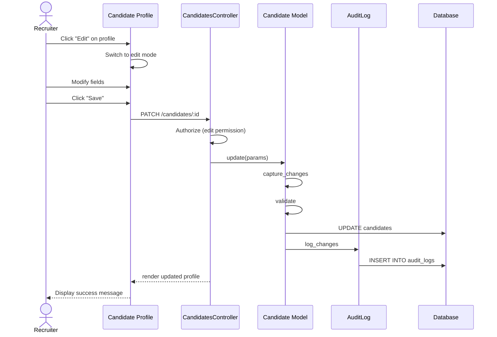

# UC-054: Edit Candidate Profile

## Metadata

| Attribute | Value |
|-----------|-------|
| **ID** | UC-054 |
| **Name** | Edit Candidate Profile |
| **Functional Area** | Candidate Management |
| **Primary Actor** | Recruiter (ACT-02) |
| **Priority** | P1 |
| **Complexity** | Low |
| **Status** | Draft |

## Description

A recruiter updates an existing candidate's profile information including contact details, location, professional summary, and custom fields. Changes are audited for compliance tracking.

## Actors

| Actor | Role in Use Case |
|-------|------------------|
| Recruiter (ACT-02) | Updates candidate information |
| Hiring Manager (ACT-03) | May update candidates on their jobs |
| System Administrator (ACT-01) | Configures editable fields |

## Preconditions

- [ ] User is authenticated and has appropriate role
- [ ] Candidate record exists and is not deleted
- [ ] User has permission to edit candidates
- [ ] Candidate is not subject to data freeze (legal hold)

## Postconditions

### Success
- [ ] Candidate record updated with new information
- [ ] Audit log entry created with before/after values
- [ ] Related applications reflect updated candidate data

### Failure
- [ ] No changes saved
- [ ] User shown validation errors
- [ ] Existing data preserved

## Triggers

- Recruiter clicks "Edit" on candidate profile
- Recruiter selects "Edit Candidate" from actions menu
- Recruiter double-clicks editable field (inline edit)

## Basic Flow



| Step | Actor | Action | System Response |
|------|-------|--------|-----------------|
| 1 | Recruiter | Clicks "Edit" on candidate profile | System displays edit form |
| 2 | Recruiter | Modifies first name (if needed) | Field updated |
| 3 | Recruiter | Modifies last name (if needed) | Field updated |
| 4 | Recruiter | Modifies email (if needed) | Field updated |
| 5 | Recruiter | Modifies phone (if needed) | Field updated |
| 6 | Recruiter | Modifies location (if needed) | Field updated |
| 7 | Recruiter | Modifies LinkedIn URL (if needed) | Field updated |
| 8 | Recruiter | Modifies portfolio URL (if needed) | Field updated |
| 9 | Recruiter | Modifies summary (if needed) | Summary updated |
| 10 | Recruiter | Updates custom fields (if needed) | Custom values updated |
| 11 | Recruiter | Clicks "Save Changes" | System validates changes |
| 12 | System | Validates all fields | Validation passes |
| 13 | System | Captures change history | Before/after recorded |
| 14 | System | Updates Candidate record | Changes saved |
| 15 | System | Creates audit log entry | Audit record with changes |
| 16 | System | Displays success message | Confirmation shown |

## Alternative Flows

### AF-1: Inline Edit Single Field

**Trigger:** Recruiter double-clicks a field value

| Step | Actor | Action | System Response |
|------|-------|--------|-----------------|
| 1a | Recruiter | Double-clicks field value | Field becomes editable |
| 2a | Recruiter | Modifies value | Changes captured |
| 3a | Recruiter | Clicks outside or presses Enter | System validates |
| 4a | System | Saves single field change | Field updated |

**Resumption:** Use case ends (single field updated)

### AF-2: Cancel Edit

**Trigger:** Recruiter clicks "Cancel" instead of "Save"

| Step | Actor | Action | System Response |
|------|-------|--------|-----------------|
| 11a | Recruiter | Clicks "Cancel" | System prompts confirmation |
| 11b | Recruiter | Confirms cancellation | Changes discarded |
| 11c | System | Reverts to view mode | Original data displayed |

**Resumption:** Use case ends (no changes saved)

### AF-3: Update from Parsed Resume

**Trigger:** New resume parsed with updated information

| Step | Actor | Action | System Response |
|------|-------|--------|-----------------|
| 0a | System | Detects newer resume data | Shows update suggestion |
| 0b | Recruiter | Reviews suggested changes | Changes displayed |
| 0c | Recruiter | Selects fields to update | Fields marked |
| 0d | Recruiter | Clicks "Apply Selected" | Selected changes merged |

**Resumption:** Continues at step 11

## Exception Flows

### EF-1: Validation Failure

**Trigger:** Invalid data entered at step 12

| Step | Actor | Action | System Response |
|------|-------|--------|-----------------|
| 12.1 | System | Detects validation errors | Highlights invalid fields |
| 12.2 | System | Displays error messages | Shows specific errors |
| 12.3 | Recruiter | Corrects invalid fields | Fields updated |
| 12.4 | Recruiter | Clicks "Save" again | System re-validates |

**Resolution:** Returns to step 12, continues if valid

### EF-2: Duplicate Email Conflict

**Trigger:** Email changed to one already in system

| Step | Actor | Action | System Response |
|------|-------|--------|-----------------|
| 12.1 | System | Detects duplicate email | Shows duplicate warning |
| 12.2 | System | Displays existing candidate | Offers merge option |
| 12.3 | Recruiter | Changes email or initiates merge | Conflict resolved |

**Resolution:** Either unique email used or merge started (UC-060)

### EF-3: Concurrent Edit Conflict

**Trigger:** Another user edited same candidate

| Step | Actor | Action | System Response |
|------|-------|--------|-----------------|
| 11.1 | System | Detects concurrent modification | Shows conflict warning |
| 11.2 | System | Displays both versions | Shows differences |
| 11.3 | Recruiter | Chooses resolution | Conflict resolved |

**Resolution:** Recruiter version saved or merged

### EF-4: Legal Hold Restriction

**Trigger:** Candidate under legal hold cannot be edited

| Step | Actor | Action | System Response |
|------|-------|--------|-----------------|
| 1.1 | System | Detects legal hold | Displays restriction message |
| 1.2 | System | Prevents editing | Form read-only |

**Resolution:** Contact compliance officer to lift hold

## Business Rules

| ID | Rule | Description |
|----|------|-------------|
| BR-054.1 | Required Fields | First name, last name, and email cannot be blank |
| BR-054.2 | Email Uniqueness | Email must remain unique within organization |
| BR-054.3 | Change Audit | All changes must be logged with before/after values |
| BR-054.4 | PII Updates | Updates to encrypted fields trigger re-encryption |
| BR-054.5 | Legal Hold | Candidates under legal hold cannot be edited |
| BR-054.6 | Source Preservation | Original source cannot be changed |

## Data Requirements

### Input Data

| Field | Type | Required | Validation |
|-------|------|----------|------------|
| first_name | string | Yes | Max 100 chars, not blank |
| last_name | string | Yes | Max 100 chars, not blank |
| email | string | Yes | Valid email, unique in org |
| phone | string | No | Valid phone format |
| location | string | No | Max 255 chars |
| linkedin_url | string | No | Valid LinkedIn URL |
| portfolio_url | string | No | Valid URL format |
| summary | text | No | Max 10,000 chars |
| custom_fields | json | No | Based on configuration |

### Output Data

| Field | Type | Description |
|-------|------|-------------|
| candidate | object | Updated candidate record |
| changes | json | Fields that were modified |
| updated_at | datetime | Timestamp of update |

## Database Transactions

### Tables Affected

| Table | Operation | Conditions |
|-------|-----------|------------|
| candidates | UPDATE | Always |
| candidate_custom_field_values | UPDATE/CREATE | If custom fields changed |
| audit_logs | CREATE | Always |

### Transaction Detail

```sql
-- Edit Candidate Profile Transaction
BEGIN TRANSACTION;

-- Step 1: Check for legal hold
SELECT 1 FROM deletion_requests
WHERE candidate_id = @candidate_id
  AND status = 'pending'
  AND legal_hold = true;

-- Step 2: Capture current values for audit
SELECT first_name, last_name, email, phone, location,
       linkedin_url, portfolio_url, summary, updated_at
FROM candidates
WHERE id = @candidate_id
  AND organization_id = @organization_id;

-- Step 3: Check for concurrent modifications
SELECT updated_at FROM candidates
WHERE id = @candidate_id
  AND updated_at = @expected_updated_at;

-- Step 4: Check email uniqueness (if changed)
SELECT id FROM candidates
WHERE organization_id = @organization_id
  AND email = @new_email
  AND id != @candidate_id
  AND discarded_at IS NULL;

-- Step 5: Update candidate record
UPDATE candidates
SET first_name = @first_name,
    last_name = @last_name,
    email = @email,
    phone = @phone,
    location = @location,
    linkedin_url = @linkedin_url,
    portfolio_url = @portfolio_url,
    summary = @summary,
    updated_at = NOW()
WHERE id = @candidate_id
  AND organization_id = @organization_id;

-- Step 6: Update custom field values
INSERT INTO candidate_custom_field_values (
    candidate_id,
    custom_field_id,
    value,
    created_at,
    updated_at
) VALUES (
    @candidate_id,
    @custom_field_id,
    @custom_value,
    NOW(),
    NOW()
)
ON DUPLICATE KEY UPDATE
    value = @custom_value,
    updated_at = NOW();

-- Step 7: Create audit log entry
INSERT INTO audit_logs (
    organization_id,
    user_id,
    action,
    auditable_type,
    auditable_id,
    metadata,
    changes,
    ip_address,
    user_agent,
    created_at
) VALUES (
    @organization_id,
    @current_user_id,
    'candidate.updated',
    'Candidate',
    @candidate_id,
    JSON_OBJECT('edited_by', @current_user_id),
    JSON_OBJECT(
        'before', JSON_OBJECT(
            'first_name', @old_first_name,
            'email', @old_email
        ),
        'after', JSON_OBJECT(
            'first_name', @new_first_name,
            'email', @new_email
        )
    ),
    @ip_address,
    @user_agent,
    NOW()
);

COMMIT;
```

### Rollback Scenarios

| Scenario | Rollback Action |
|----------|-----------------|
| Validation failure | No transaction started, return errors |
| Duplicate email | Rollback, show duplicate error |
| Concurrent modification | Rollback, show conflict |
| Legal hold detected | No transaction, show restriction |

## UI/UX Requirements

### Screen/Component

- **Location:** /candidates/:id/edit or inline on /candidates/:id
- **Entry Point:**
  - "Edit" button on candidate profile
  - Pencil icon on individual fields
  - "Edit Candidate" from actions dropdown
- **Key Elements:**
  - Editable form fields with current values
  - Inline validation feedback
  - Change indicator for modified fields
  - Cancel and Save buttons
  - Unsaved changes warning

### Form Layout

```
+-------------------------------------------------------------+
| Edit Candidate Profile                                       |
+-------------------------------------------------------------+
| Personal Information                                         |
|                                                              |
| First Name *              Last Name *                        |
| +------------------------+ +------------------------+        |
| | John                   | | Smith                  |        |
| +------------------------+ +------------------------+        |
| (modified)                                                   |
|                                                              |
| Contact Information                                          |
|                                                              |
| Email *                                                      |
| +----------------------------------------------------------+ |
| | john.smith@example.com                                   | |
| +----------------------------------------------------------+ |
|                                                              |
| Phone                                                        |
| +----------------------------------------------------------+ |
| | +1 (555) 123-4567                                        | |
| +----------------------------------------------------------+ |
|                                                              |
| Location                                                     |
| +----------------------------------------------------------+ |
| | San Francisco, CA, USA                                   | |
| +----------------------------------------------------------+ |
|                                                              |
| Online Presence                                              |
|                                                              |
| LinkedIn URL                                                 |
| +----------------------------------------------------------+ |
| | https://linkedin.com/in/johnsmith                        | |
| +----------------------------------------------------------+ |
|                                                              |
| Portfolio/Website                                            |
| +----------------------------------------------------------+ |
| | https://johnsmith.dev                                    | |
| +----------------------------------------------------------+ |
|                                                              |
| Professional Summary                                         |
| +----------------------------------------------------------+ |
| | Experienced software engineer with 10+ years...          | |
| |                                                          | |
| +----------------------------------------------------------+ |
|                                                              |
| Custom Fields                                                |
| +----------------------------------------------------------+ |
| | [Dynamic fields based on org configuration]              | |
| +----------------------------------------------------------+ |
|                                                              |
| Last Updated: Jan 20, 2026 by Sarah Jones                    |
|                                                              |
+-------------------------------------------------------------+
| [Cancel]                                   [Save Changes]    |
+-------------------------------------------------------------+
```

## Non-Functional Requirements

| Requirement | Target |
|-------------|--------|
| Response Time | Form load < 1s, save < 2s |
| Availability | 99.9% |
| Concurrent Edit Detection | < 500ms check |
| Autosave Draft | Every 30 seconds |

## Security Considerations

- [x] Authentication required
- [x] Authorization check: User must have candidate edit permission
- [x] Organization scoping: Can only edit candidates in own organization
- [x] Data encryption: PII re-encrypted on update
- [x] Audit logging: All changes logged with before/after values
- [x] Legal hold: Prevents editing of held candidates

## Related Use Cases

| Use Case | Relationship |
|----------|--------------|
| UC-050 Add Candidate Manually | Creates record this use case edits |
| UC-055 Upload Resume | Can trigger profile updates |
| UC-056 Parse Resume | Can suggest profile updates |
| UC-057 Add Candidate Note | Alternative to editing profile |
| UC-060 Merge Candidates | Alternative when duplicate found |

---

## Data Model References

> Cross-references to [DATA_MODEL.md](../DATA_MODEL.md) and [CRUD_MATRIX.md](../CRUD_MATRIX.md)

### Subject Areas

| Subject Area | ID | Relationship |
|--------------|-----|--------------|
| Candidate | SA-04 | Primary |
| Compliance & Audit | SA-09 | Reference |

### Entities CRUD

| Entity | C | R | U | D | Notes |
|--------|---|---|---|---|-------|
| Candidate | | X | X | | Updated in step 14 |
| CandidateCustomFieldValue | X | X | X | | Created or updated |
| AuditLog | X | | | | Created in step 15 |

**Legend:** C = Create, R = Read, U = Update, D = Delete

---

## Process Model References

> Cross-references to [PROCESS_MODEL.md](../PROCESS_MODEL.md) and [PROCESS_CRUD_MATRIX.md](../PROCESS_CRUD_MATRIX.md)

| Attribute | Value | Link |
|-----------|-------|------|
| **Elementary Business Process** | EP-0205: Edit Candidate Profile | [PROCESS_MODEL.md#ep-0205](../PROCESS_MODEL.md#bp-102-candidate-sourcing) |
| **Business Process** | BP-102: Candidate Sourcing | [PROCESS_MODEL.md#bp-102](../PROCESS_MODEL.md#bp-102-candidate-sourcing) |
| **Business Function** | BF-01: Talent Acquisition | [PROCESS_MODEL.md#bf-01](../PROCESS_MODEL.md#bf-01-talent-acquisition) |

### EBP Details

| Attribute | Value |
|-----------|-------|
| **Trigger** | Recruiter initiates candidate profile edit |
| **Input** | Updated candidate information |
| **Output** | Updated Candidate record with audit trail |
| **Business Rules** | BR-054.1 through BR-054.6 (see Business Rules section) |

---

## Traceability Matrix

> Complete artifact mapping for requirements traceability

| Artifact Type | ID | Name | Link |
|---------------|-----|------|------|
| **Use Case** | UC-054 | Edit Candidate Profile | *(this document)* |
| **Elementary Process** | EP-0205 | Edit Candidate Profile | [PROCESS_MODEL.md](../PROCESS_MODEL.md#bp-102-candidate-sourcing) |
| **Business Process** | BP-102 | Candidate Sourcing | [PROCESS_MODEL.md](../PROCESS_MODEL.md#bp-102-candidate-sourcing) |
| **Business Function** | BF-01 | Talent Acquisition | [PROCESS_MODEL.md](../PROCESS_MODEL.md#bf-01-talent-acquisition) |
| **Primary Actor** | ACT-02 | Recruiter | [ACTORS.md](../ACTORS.md#act-02-recruiter) |
| **Subject Area (Primary)** | SA-04 | Candidate | [DATA_MODEL.md](../DATA_MODEL.md#sa-04-candidate) |
| **CRUD Matrix Row** | UC-054 | - | [CRUD_MATRIX.md](../CRUD_MATRIX.md#uc-054) |
| **Process CRUD Row** | EP-0205 | - | [PROCESS_CRUD_MATRIX.md](../PROCESS_CRUD_MATRIX.md#ep-0205) |

### Implementation Artifacts

| Artifact Type | Path/Reference | Status |
|---------------|----------------|--------|
| Controller | `app/controllers/admin/candidates_controller.rb` | Planned |
| Model | `app/models/candidate.rb` | Planned |
| Service | `app/services/candidates/update_service.rb` | Planned |
| Policy | `app/policies/candidate_policy.rb` | Planned |
| View | `app/views/admin/candidates/edit.html.erb` | Planned |
| Test | `test/controllers/admin/candidates_controller_test.rb` | Planned |

---

## Open Questions

1. Should there be field-level edit permissions?
2. How long should edit history be retained?
3. Should we support bulk editing of multiple candidates?

## Change History

| Version | Date | Author | Changes |
|---------|------|--------|---------|
| 0.1 | 2026-01-25 | System | Initial draft |
