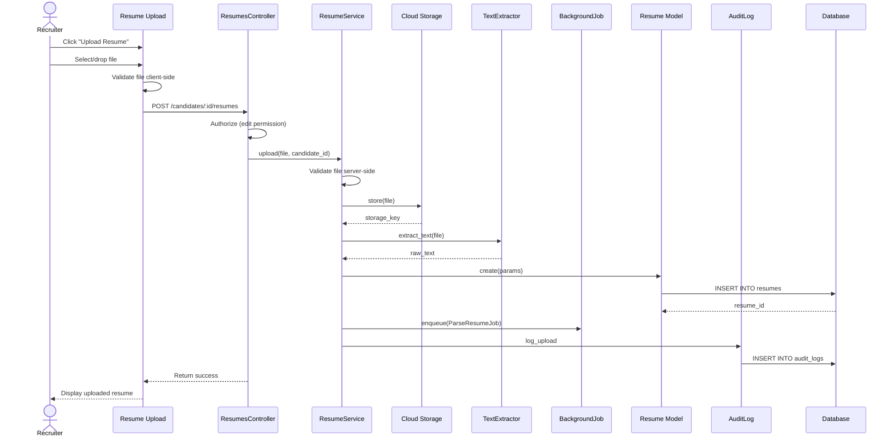

# UC-055: Upload Resume

## Metadata

| Attribute | Value |
|-----------|-------|
| **ID** | UC-055 |
| **Name** | Upload Resume |
| **Functional Area** | Candidate Management |
| **Primary Actor** | Recruiter (ACT-02) |
| **Priority** | P1 |
| **Complexity** | Low |
| **Status** | Draft |

## Description

A recruiter or candidate uploads a resume file to a candidate's profile. The system stores the file securely, extracts text content, and optionally triggers automated parsing to extract structured data. Multiple resumes can be attached to a single candidate profile.

## Actors

| Actor | Role in Use Case |
|-------|------------------|
| Recruiter (ACT-02) | Uploads resume on behalf of candidate |
| Candidate (ACT-07) | Uploads own resume via portal |
| Scheduler (ACT-11) | Triggers async parsing job |

## Preconditions

- [ ] User is authenticated (recruiter or candidate)
- [ ] Candidate record exists (for recruiter upload)
- [ ] File is in supported format (PDF, DOC, DOCX)
- [ ] File size within allowed limits (max 10MB)

## Postconditions

### Success
- [ ] Resume file stored securely in cloud storage
- [ ] Resume record created linked to candidate
- [ ] Raw text extracted from document
- [ ] Parse job queued (if auto-parse enabled)
- [ ] Audit log entry created

### Failure
- [ ] File not stored
- [ ] User shown error message
- [ ] No resume record created

## Triggers

- Recruiter clicks "Upload Resume" on candidate profile
- Recruiter drags file to resume drop zone
- Candidate uploads resume during application
- Candidate updates resume in portal

## Basic Flow



| Step | Actor | Action | System Response |
|------|-------|--------|-----------------|
| 1 | Recruiter | Clicks "Upload Resume" or drags file | Upload interface activated |
| 2 | Recruiter | Selects file from dialog | File selected |
| 3 | System | Validates file type client-side | Format accepted |
| 4 | System | Validates file size client-side | Size accepted |
| 5 | System | Shows upload progress | Progress bar displayed |
| 6 | System | Uploads file to server | File transmitted |
| 7 | System | Validates file server-side | Security scan passed |
| 8 | System | Stores file in cloud storage | File stored securely |
| 9 | System | Extracts text from document | Raw text captured |
| 10 | System | Creates Resume record | Resume saved |
| 11 | System | Sets as primary (if first resume) | Primary flag set |
| 12 | System | Queues parse job | Parse job enqueued |
| 13 | System | Creates audit log entry | Audit record saved |
| 14 | System | Displays success message | Confirmation shown |
| 15 | System | Shows resume in list | Resume visible on profile |

## Alternative Flows

### AF-1: Replace Existing Resume

**Trigger:** Candidate already has a primary resume

| Step | Actor | Action | System Response |
|------|-------|--------|-----------------|
| 10a | System | Detects existing primary | Shows replacement option |
| 10b | Recruiter | Selects "Replace Primary" | Previous primary demoted |
| 10c | System | Sets new resume as primary | Primary updated |

**Resumption:** Continues at step 12

### AF-2: Candidate Self-Upload (Portal)

**Trigger:** Candidate uploads via candidate portal

| Step | Actor | Action | System Response |
|------|-------|--------|-----------------|
| 1a | Candidate | Accesses portal profile | Profile displayed |
| 2a | Candidate | Clicks "Update Resume" | Upload interface shown |
| 3a | Candidate | Selects file | Same validation flow |

**Resumption:** Continues at step 3 (same flow, different context)

### AF-3: Upload During Application

**Trigger:** Resume uploaded as part of job application

| Step | Actor | Action | System Response |
|------|-------|--------|-----------------|
| 1a | Candidate | Reaches resume step in application | Resume upload shown |
| 2a | Candidate | Uploads resume | File processed |
| 3a | System | Links resume to application | Application-specific |

**Resumption:** Part of UC-100 (Apply for Job)

### AF-4: Multiple Resume Upload

**Trigger:** Recruiter uploads multiple resumes at once

| Step | Actor | Action | System Response |
|------|-------|--------|-----------------|
| 2a | Recruiter | Selects multiple files | Files queued |
| 3a | System | Validates all files | All formats checked |
| 4a | System | Uploads sequentially | Progress for each |
| 5a | System | Creates Resume records | All resumes saved |

**Resumption:** First uploaded set as primary if none exists

## Exception Flows

### EF-1: Invalid File Format

**Trigger:** File is not PDF, DOC, or DOCX

| Step | Actor | Action | System Response |
|------|-------|--------|-----------------|
| 3.1 | System | Detects invalid format | Shows format error |
| 3.2 | System | Displays allowed formats | PDF, DOC, DOCX listed |
| 3.3 | Recruiter | Selects valid file | Processing continues |

**Resolution:** Returns to step 2

### EF-2: File Too Large

**Trigger:** File exceeds 10MB limit

| Step | Actor | Action | System Response |
|------|-------|--------|-----------------|
| 4.1 | System | Detects file size | Shows size error |
| 4.2 | System | Displays size limit | Max 10MB shown |
| 4.3 | Recruiter | Compresses or splits file | Smaller file selected |

**Resolution:** Returns to step 2

### EF-3: Virus Detected

**Trigger:** Security scan finds malware

| Step | Actor | Action | System Response |
|------|-------|--------|-----------------|
| 7.1 | System | Detects malware | File rejected |
| 7.2 | System | Logs security event | Alert triggered |
| 7.3 | System | Shows security error | User notified |

**Resolution:** File rejected, user must provide clean file

### EF-4: Storage Failure

**Trigger:** Cloud storage unavailable

| Step | Actor | Action | System Response |
|------|-------|--------|-----------------|
| 8.1 | System | Detects storage error | Logs failure |
| 8.2 | System | Retries upload | 3 retry attempts |
| 8.3 | System | Shows error message | User notified to retry |

**Resolution:** User retries later

### EF-5: Text Extraction Failure

**Trigger:** Cannot extract text from document

| Step | Actor | Action | System Response |
|------|-------|--------|-----------------|
| 9.1 | System | Extraction fails | Logs warning |
| 9.2 | System | Stores file anyway | Resume saved without text |
| 9.3 | System | Marks for manual review | Flag set |

**Resolution:** Resume saved, parsing skipped

## Business Rules

| ID | Rule | Description |
|----|------|-------------|
| BR-055.1 | Supported Formats | PDF, DOC, DOCX only |
| BR-055.2 | File Size Limit | Maximum 10MB per file |
| BR-055.3 | Security Scan | All uploads must pass virus scan |
| BR-055.4 | Primary Resume | One resume marked as primary per candidate |
| BR-055.5 | Text Extraction | Raw text extracted for searchability |
| BR-055.6 | Auto-Parse | Parsing automatically triggered if enabled |
| BR-055.7 | Retention | Resumes retained per data retention policy |

## Data Requirements

### Input Data

| Field | Type | Required | Validation |
|-------|------|----------|------------|
| file | binary | Yes | PDF/DOC/DOCX, max 10MB |
| candidate_id | integer | Yes | Must exist |
| set_primary | boolean | No | Default true if first |

### Output Data

| Field | Type | Description |
|-------|------|-------------|
| id | integer | Resume record ID |
| filename | string | Original filename |
| storage_key | string | Cloud storage reference |
| content_type | string | MIME type |
| file_size | integer | Size in bytes |
| raw_text | text | Extracted text content |
| primary | boolean | Is primary resume |

## Database Transactions

### Tables Affected

| Table | Operation | Conditions |
|-------|-----------|------------|
| resumes | CREATE | Always |
| resumes | UPDATE | If setting new primary |
| active_storage_blobs | CREATE | File metadata |
| active_storage_attachments | CREATE | File association |
| audit_logs | CREATE | Always |

### Transaction Detail

```sql
-- Upload Resume Transaction
BEGIN TRANSACTION;

-- Step 1: Verify candidate exists
SELECT id FROM candidates
WHERE id = @candidate_id
  AND organization_id = @organization_id
  AND discarded_at IS NULL;

-- Step 2: Demote existing primary (if setting new primary)
UPDATE resumes
SET primary = false,
    updated_at = NOW()
WHERE candidate_id = @candidate_id
  AND primary = true;

-- Step 3: Create resume record
INSERT INTO resumes (
    candidate_id,
    filename,
    content_type,
    file_size,
    storage_key,
    raw_text,
    primary,
    created_at,
    updated_at
) VALUES (
    @candidate_id,
    @filename,
    @content_type,
    @file_size,
    @storage_key,
    @raw_text,
    @set_primary,
    NOW(),
    NOW()
);

SET @resume_id = LAST_INSERT_ID();

-- Step 4: Create audit log entry
INSERT INTO audit_logs (
    organization_id,
    user_id,
    action,
    auditable_type,
    auditable_id,
    metadata,
    ip_address,
    user_agent,
    created_at
) VALUES (
    @organization_id,
    @current_user_id,
    'resume.uploaded',
    'Resume',
    @resume_id,
    JSON_OBJECT(
        'candidate_id', @candidate_id,
        'filename', @filename,
        'file_size', @file_size,
        'set_primary', @set_primary
    ),
    @ip_address,
    @user_agent,
    NOW()
);

COMMIT;

-- Step 5: Queue parse job (after commit)
INSERT INTO solid_queue_jobs (
    queue_name,
    class_name,
    arguments,
    scheduled_at,
    created_at
) VALUES (
    'default',
    'ParseResumeJob',
    JSON_OBJECT('resume_id', @resume_id),
    NOW(),
    NOW()
);
```

### Rollback Scenarios

| Scenario | Rollback Action |
|----------|-----------------|
| Invalid format | Return error, no upload |
| File too large | Return error, no upload |
| Virus detected | Reject file, log security event |
| Storage failure | Retry then return error |
| Text extraction failure | Continue without text |

## UI/UX Requirements

### Screen/Component

- **Location:** /candidates/:id (profile page) or modal
- **Entry Point:**
  - "Upload Resume" button on profile
  - Resume drop zone
  - "Add Document" action
- **Key Elements:**
  - Drag-and-drop zone
  - File type indicators
  - Upload progress bar
  - Resume list with download/delete
  - Primary badge indicator

### Component Layout

```
+-------------------------------------------------------------+
| Resumes                                          [+ Upload]  |
+-------------------------------------------------------------+
|                                                              |
| +----------------------------------------------------------+ |
| |                                                          | |
| |    Drag and drop resume here                             | |
| |                                                          | |
| |    or [Browse Files]                                     | |
| |                                                          | |
| |    PDF, DOC, DOCX (max 10MB)                             | |
| |                                                          | |
| +----------------------------------------------------------+ |
|                                                              |
| Uploaded Resumes                                             |
| +----------------------------------------------------------+ |
| | [PDF] john_smith_resume_2026.pdf     PRIMARY             | |
| |       Uploaded Jan 20, 2026 | 245 KB                     | |
| |       Parsed: Complete                                   | |
| |       [Download] [Set Primary] [Delete]                  | |
| +----------------------------------------------------------+ |
| | [DOC] john_smith_cv_old.docx                             | |
| |       Uploaded Dec 15, 2025 | 189 KB                     | |
| |       Parsed: Complete                                   | |
| |       [Download] [Set Primary] [Delete]                  | |
| +----------------------------------------------------------+ |
|                                                              |
+-------------------------------------------------------------+
```

### Upload Progress

```
+-------------------------------------------------------------+
| Uploading Resume                                             |
+-------------------------------------------------------------+
|                                                              |
| john_smith_resume_2026.pdf                                   |
|                                                              |
| [========================================>            ] 75%  |
|                                                              |
| Uploading... 1.8 MB of 2.4 MB                               |
|                                                              |
| [Cancel]                                                     |
+-------------------------------------------------------------+
```

## Non-Functional Requirements

| Requirement | Target |
|-------------|--------|
| Upload Speed | Support 1MB/s minimum |
| Response Time | < 5s for 10MB file |
| Availability | 99.9% |
| Storage | Encrypted at rest (AES-256) |
| Text Extraction | < 10s for 50-page document |

## Security Considerations

- [x] Authentication required
- [x] Authorization check: User must have candidate access
- [x] Virus scanning: All uploads scanned
- [x] Data encryption: Files encrypted at rest
- [x] Secure storage: Files in private S3 bucket
- [x] Audit logging: Upload logged with metadata
- [x] Access control: Signed URLs for downloads

## Related Use Cases

| Use Case | Relationship |
|----------|--------------|
| UC-050 Add Candidate Manually | May include resume upload |
| UC-052 Submit Referral | May include resume upload |
| UC-053 Agency Submission | Requires resume upload |
| UC-056 Parse Resume | Follows this use case |
| UC-100 Apply for Job | Includes resume upload |

---

## Data Model References

> Cross-references to [DATA_MODEL.md](../DATA_MODEL.md) and [CRUD_MATRIX.md](../CRUD_MATRIX.md)

### Subject Areas

| Subject Area | ID | Relationship |
|--------------|-----|--------------|
| Candidate | SA-04 | Primary |
| Compliance & Audit | SA-09 | Reference |

### Entities CRUD

| Entity | C | R | U | D | Notes |
|--------|---|---|---|---|-------|
| Resume | X | X | X | | Created, possibly updates primary |
| Candidate | | X | | | Verified to exist |
| AuditLog | X | | | | Created for upload |

**Legend:** C = Create, R = Read, U = Update, D = Delete

---

## Process Model References

> Cross-references to [PROCESS_MODEL.md](../PROCESS_MODEL.md) and [PROCESS_CRUD_MATRIX.md](../PROCESS_CRUD_MATRIX.md)

| Attribute | Value | Link |
|-----------|-------|------|
| **Elementary Business Process** | EP-0206: Upload Resume | [PROCESS_MODEL.md#ep-0206](../PROCESS_MODEL.md#bp-102-candidate-sourcing) |
| **Business Process** | BP-102: Candidate Sourcing | [PROCESS_MODEL.md#bp-102](../PROCESS_MODEL.md#bp-102-candidate-sourcing) |
| **Business Function** | BF-01: Talent Acquisition | [PROCESS_MODEL.md#bf-01](../PROCESS_MODEL.md#bf-01-talent-acquisition) |

### EBP Details

| Attribute | Value |
|-----------|-------|
| **Trigger** | User initiates resume upload |
| **Input** | Resume file (PDF, DOC, DOCX) |
| **Output** | Resume record with extracted text, parse job queued |
| **Business Rules** | BR-055.1 through BR-055.7 (see Business Rules section) |

---

## Traceability Matrix

> Complete artifact mapping for requirements traceability

| Artifact Type | ID | Name | Link |
|---------------|-----|------|------|
| **Use Case** | UC-055 | Upload Resume | *(this document)* |
| **Elementary Process** | EP-0206 | Upload Resume | [PROCESS_MODEL.md](../PROCESS_MODEL.md#bp-102-candidate-sourcing) |
| **Business Process** | BP-102 | Candidate Sourcing | [PROCESS_MODEL.md](../PROCESS_MODEL.md#bp-102-candidate-sourcing) |
| **Business Function** | BF-01 | Talent Acquisition | [PROCESS_MODEL.md](../PROCESS_MODEL.md#bf-01-talent-acquisition) |
| **Primary Actor** | ACT-02 | Recruiter | [ACTORS.md](../ACTORS.md#act-02-recruiter) |
| **Subject Area (Primary)** | SA-04 | Candidate | [DATA_MODEL.md](../DATA_MODEL.md#sa-04-candidate) |
| **CRUD Matrix Row** | UC-055 | - | [CRUD_MATRIX.md](../CRUD_MATRIX.md#uc-055) |
| **Process CRUD Row** | EP-0206 | - | [PROCESS_CRUD_MATRIX.md](../PROCESS_CRUD_MATRIX.md#ep-0206) |

### Implementation Artifacts

| Artifact Type | Path/Reference | Status |
|---------------|----------------|--------|
| Controller | `app/controllers/admin/resumes_controller.rb` | Planned |
| Model | `app/models/resume.rb` | Planned |
| Service | `app/services/resumes/upload_service.rb` | Planned |
| Job | `app/jobs/parse_resume_job.rb` | Planned |
| Policy | `app/policies/resume_policy.rb` | Planned |
| View | `app/views/admin/resumes/_upload.html.erb` | Planned |
| Test | `test/services/resumes/upload_service_test.rb` | Planned |

---

## Open Questions

1. Should we support additional formats (RTF, TXT)?
2. What is the maximum number of resumes per candidate?
3. Should we offer resume conversion between formats?
4. Should candidates be able to delete their own resumes?

## Change History

| Version | Date | Author | Changes |
|---------|------|--------|---------|
| 0.1 | 2026-01-25 | System | Initial draft |
