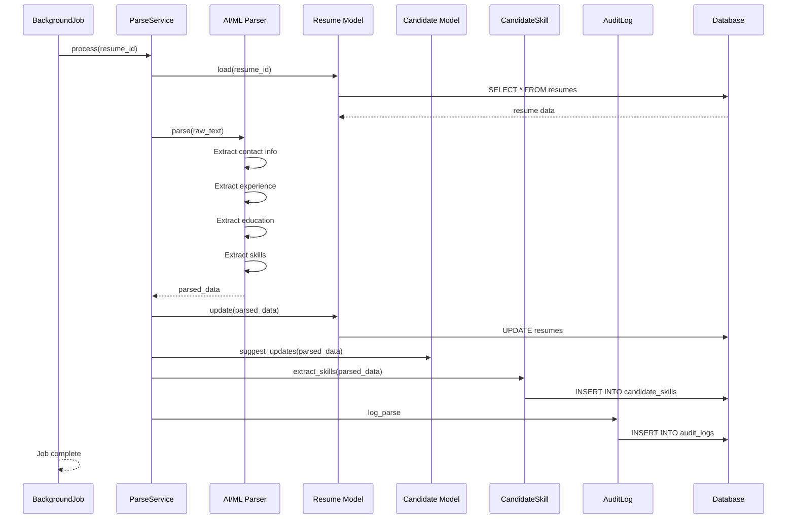

# UC-056: Parse Resume

## Metadata

| Attribute | Value |
|-----------|-------|
| **ID** | UC-056 |
| **Name** | Parse Resume |
| **Functional Area** | Candidate Management |
| **Primary Actor** | Scheduler (ACT-11) |
| **Priority** | P2 |
| **Complexity** | High |
| **Status** | Draft |

## Description

The system automatically parses an uploaded resume to extract structured data including contact information, work experience, education, skills, and certifications. The parsed data is stored for search indexing and can optionally update the candidate profile.

## Actors

| Actor | Role in Use Case |
|-------|------------------|
| Scheduler (ACT-11) | Executes parsing job asynchronously |
| Recruiter (ACT-02) | Reviews and approves parsed data |
| System Administrator (ACT-01) | Configures parsing settings |

## Preconditions

- [ ] Resume file has been uploaded and stored
- [ ] Raw text has been extracted from document
- [ ] Parsing service is available
- [ ] Candidate record exists and is not deleted

## Postconditions

### Success
- [ ] Parsed data stored in resume.parsed_data JSON
- [ ] Candidate profile optionally updated with parsed info
- [ ] Skills extracted and indexed for search
- [ ] Resume marked as parsed with timestamp
- [ ] Audit log entry created

### Failure
- [ ] Resume marked as parse failed
- [ ] Error logged for troubleshooting
- [ ] Resume still available (text only)

## Triggers

- Resume upload completes (automatic)
- Recruiter clicks "Re-parse Resume"
- Scheduled retry after transient failure
- Bulk re-parse job for all resumes

## Basic Flow



| Step | Actor | Action | System Response |
|------|-------|--------|-----------------|
| 1 | Scheduler | Picks up parse job from queue | Job started |
| 2 | System | Loads resume record | Resume data retrieved |
| 3 | System | Retrieves raw text | Text content loaded |
| 4 | System | Sends text to parsing engine | Parse initiated |
| 5 | System | Extracts contact information | Name, email, phone, location |
| 6 | System | Extracts work experience | Companies, titles, dates, descriptions |
| 7 | System | Extracts education | Schools, degrees, dates |
| 8 | System | Extracts skills | Technical and soft skills |
| 9 | System | Extracts certifications | Certifications and licenses |
| 10 | System | Calculates confidence scores | Per-field confidence |
| 11 | System | Stores parsed data in JSON | Resume record updated |
| 12 | System | Extracts and indexes skills | Candidate skills created |
| 13 | System | Marks resume as parsed | Parsed timestamp set |
| 14 | System | Creates audit log entry | Audit record saved |
| 15 | System | Completes job | Success status recorded |

## Alternative Flows

### AF-1: Auto-Update Candidate Profile

**Trigger:** Organization has auto-update enabled

| Step | Actor | Action | System Response |
|------|-------|--------|-----------------|
| 11a | System | Checks auto-update setting | Setting enabled |
| 11b | System | Compares with existing profile | Identifies differences |
| 11c | System | Updates candidate fields | Profile updated |
| 11d | System | Records changes in audit | Changes logged |

**Resumption:** Continues at step 12

### AF-2: Manual Parse Trigger

**Trigger:** Recruiter manually requests re-parse

| Step | Actor | Action | System Response |
|------|-------|--------|-----------------|
| 0a | Recruiter | Clicks "Re-parse Resume" | Confirmation dialog shown |
| 0b | Recruiter | Confirms re-parse | Job queued with priority |
| 0c | System | Clears existing parsed data | Ready for fresh parse |

**Resumption:** Continues at step 1

### AF-3: Low Confidence Result

**Trigger:** Parsing confidence below threshold

| Step | Actor | Action | System Response |
|------|-------|--------|-----------------|
| 10a | System | Detects low confidence | Flags for review |
| 11a | System | Stores with review flag | Parsed data marked provisional |
| 12a | System | Notifies recruiter | Review task created |

**Resumption:** Recruiter reviews in separate workflow

### AF-4: Multi-Language Resume

**Trigger:** Resume detected as non-English

| Step | Actor | Action | System Response |
|------|-------|--------|-----------------|
| 4a | System | Detects language | Language identified |
| 4b | System | Selects appropriate model | Language-specific parser |
| 5a | System | Parses with localized model | Adjusted extraction |

**Resumption:** Continues at step 5

## Exception Flows

### EF-1: Parse Service Unavailable

**Trigger:** AI/ML parsing service is down

| Step | Actor | Action | System Response |
|------|-------|--------|-----------------|
| 4.1 | System | Connection fails | Error logged |
| 4.2 | System | Retries (3 attempts) | Exponential backoff |
| 4.3 | System | Marks for retry later | Job requeued |

**Resolution:** Job retried after delay (5 min, 30 min, 2 hr)

### EF-2: Unreadable Document

**Trigger:** Raw text is empty or corrupted

| Step | Actor | Action | System Response |
|------|-------|--------|-----------------|
| 3.1 | System | Detects empty text | Error condition |
| 3.2 | System | Attempts OCR (if image PDF) | OCR processing |
| 3.3 | System | Marks as unparseable | Status set |

**Resolution:** Resume marked as unparseable, manual entry required

### EF-3: Timeout During Parse

**Trigger:** Parsing exceeds timeout (60 seconds)

| Step | Actor | Action | System Response |
|------|-------|--------|-----------------|
| 5.1 | System | Parse exceeds timeout | Job killed |
| 5.2 | System | Logs timeout | Error recorded |
| 5.3 | System | Requeues with simpler model | Retry with basic parser |

**Resolution:** Retry with simpler/faster model

### EF-4: Invalid Data Format

**Trigger:** Parsed data doesn't match expected schema

| Step | Actor | Action | System Response |
|------|-------|--------|-----------------|
| 10.1 | System | Schema validation fails | Data rejected |
| 10.2 | System | Logs malformed response | Error details recorded |
| 10.3 | System | Marks for investigation | Flags for review |

**Resolution:** Parse marked as failed, manual intervention needed

## Business Rules

| ID | Rule | Description |
|----|------|-------------|
| BR-056.1 | Auto Trigger | Parsing auto-triggered on resume upload |
| BR-056.2 | Retry Policy | Failed parses retried 3 times with backoff |
| BR-056.3 | Confidence Threshold | Fields below 70% confidence flagged for review |
| BR-056.4 | Skill Extraction | Skills normalized against standard taxonomy |
| BR-056.5 | PII Handling | Extracted PII encrypted same as manual entry |
| BR-056.6 | Timeout | Parse jobs timeout after 60 seconds |
| BR-056.7 | Profile Updates | Auto-update only if org setting enabled |

## Data Requirements

### Input Data

| Field | Type | Required | Validation |
|-------|------|----------|------------|
| resume_id | integer | Yes | Must exist and have raw_text |

### Output Data

| Field | Type | Description |
|-------|------|-------------|
| parsed_data | json | Structured extracted data |
| parsed_at | datetime | Parse completion timestamp |
| parse_status | enum | success, failed, pending_review |
| confidence_score | float | Overall confidence (0-1) |

### Parsed Data JSON Structure

```json
{
  "contact": {
    "first_name": { "value": "John", "confidence": 0.95 },
    "last_name": { "value": "Smith", "confidence": 0.95 },
    "email": { "value": "john@example.com", "confidence": 0.98 },
    "phone": { "value": "+1-555-123-4567", "confidence": 0.90 },
    "location": { "value": "San Francisco, CA", "confidence": 0.85 },
    "linkedin": { "value": "linkedin.com/in/johnsmith", "confidence": 0.92 }
  },
  "experience": [
    {
      "company": { "value": "TechCorp Inc", "confidence": 0.88 },
      "title": { "value": "Senior Engineer", "confidence": 0.90 },
      "start_date": { "value": "2020-01", "confidence": 0.82 },
      "end_date": { "value": "present", "confidence": 0.95 },
      "description": { "value": "Led team of 5 engineers...", "confidence": 0.75 },
      "highlights": ["Scaled system 10x", "Reduced costs 30%"]
    }
  ],
  "education": [
    {
      "institution": { "value": "Stanford University", "confidence": 0.95 },
      "degree": { "value": "BS Computer Science", "confidence": 0.88 },
      "graduation_year": { "value": "2015", "confidence": 0.90 }
    }
  ],
  "skills": [
    { "name": "Python", "confidence": 0.95, "years": 5 },
    { "name": "JavaScript", "confidence": 0.92, "years": 4 },
    { "name": "AWS", "confidence": 0.88, "years": 3 }
  ],
  "certifications": [
    {
      "name": { "value": "AWS Solutions Architect", "confidence": 0.90 },
      "year": { "value": "2022", "confidence": 0.85 }
    }
  ],
  "languages": [
    { "name": "English", "proficiency": "native" },
    { "name": "Spanish", "proficiency": "professional" }
  ],
  "overall_confidence": 0.87
}
```

## Database Transactions

### Tables Affected

| Table | Operation | Conditions |
|-------|-----------|------------|
| resumes | UPDATE | Always |
| candidate_skills | CREATE/UPDATE | If skills extracted |
| candidates | UPDATE | If auto-update enabled |
| audit_logs | CREATE | Always |

### Transaction Detail

```sql
-- Parse Resume Transaction
BEGIN TRANSACTION;

-- Step 1: Load resume and verify
SELECT id, candidate_id, raw_text, parsed_data, parsed_at
FROM resumes
WHERE id = @resume_id;

-- Step 2: Update resume with parsed data
UPDATE resumes
SET parsed_data = @parsed_data_json,
    parsed_at = NOW(),
    updated_at = NOW()
WHERE id = @resume_id;

-- Step 3: Extract and store skills
DELETE FROM candidate_skills
WHERE candidate_id = @candidate_id
  AND source = 'parsed';

INSERT INTO candidate_skills (
    candidate_id,
    skill_name,
    skill_normalized,
    years_experience,
    confidence,
    source,
    created_at
)
SELECT
    @candidate_id,
    skill->>'name',
    normalize_skill(skill->>'name'),
    CAST(skill->>'years' AS INT),
    CAST(skill->>'confidence' AS DECIMAL),
    'parsed',
    NOW()
FROM json_array_elements(@skills_json) AS skill;

-- Step 4: Update candidate profile (if auto-update enabled)
UPDATE candidates
SET parsed_profile = @parsed_data_json,
    updated_at = NOW()
WHERE id = @candidate_id
  AND @auto_update_enabled = true;

-- Step 5: Create audit log entry
INSERT INTO audit_logs (
    organization_id,
    user_id,
    action,
    auditable_type,
    auditable_id,
    metadata,
    created_at
) VALUES (
    @organization_id,
    NULL,  -- system action
    'resume.parsed',
    'Resume',
    @resume_id,
    JSON_OBJECT(
        'candidate_id', @candidate_id,
        'overall_confidence', @confidence_score,
        'skills_count', @skills_count,
        'experience_count', @experience_count
    ),
    NOW()
);

COMMIT;
```

### Rollback Scenarios

| Scenario | Rollback Action |
|----------|-----------------|
| Parse service failure | Requeue job for retry |
| Timeout | Rollback, requeue with simpler model |
| Schema validation failure | Mark as failed, log error |
| Database error | Full rollback, mark for retry |

## UI/UX Requirements

### Screen/Component

- **Location:** Part of candidate profile (resume section)
- **Entry Point:**
  - Automatic (no direct UI)
  - "Re-parse" button for manual trigger
- **Key Elements:**
  - Parse status indicator
  - Confidence score display
  - Parsed data preview
  - "Apply to Profile" button
  - Skills tags

### Parsed Resume Display

```
+-------------------------------------------------------------+
| Resume: john_smith_resume_2026.pdf                          |
+-------------------------------------------------------------+
| Parse Status: Complete                  Confidence: 87%     |
+-------------------------------------------------------------+
|                                                              |
| Extracted Information                    [Apply to Profile]  |
|                                                              |
| Contact                                                      |
| +----------------------------------------------------------+ |
| | Name: John Smith                              95%        | |
| | Email: john@example.com                       98%        | |
| | Phone: +1 (555) 123-4567                      90%        | |
| | Location: San Francisco, CA                   85%        | |
| +----------------------------------------------------------+ |
|                                                              |
| Experience                                                   |
| +----------------------------------------------------------+ |
| | TechCorp Inc - Senior Engineer               88%         | |
| | Jan 2020 - Present                                       | |
| | Led team of 5 engineers developing microservices...      | |
| +----------------------------------------------------------+ |
| | StartupXYZ - Software Engineer               85%         | |
| | Mar 2017 - Dec 2019                                      | |
| +----------------------------------------------------------+ |
|                                                              |
| Education                                                    |
| +----------------------------------------------------------+ |
| | Stanford University                          95%         | |
| | BS Computer Science, 2015                                | |
| +----------------------------------------------------------+ |
|                                                              |
| Skills                                                       |
| +----------------------------------------------------------+ |
| | [Python 95%] [JavaScript 92%] [AWS 88%] [React 85%]     | |
| | [PostgreSQL 80%] [Docker 78%] [Kubernetes 75%]          | |
| +----------------------------------------------------------+ |
|                                                              |
| [Re-parse]                               [View Raw Text]    |
+-------------------------------------------------------------+
```

## Non-Functional Requirements

| Requirement | Target |
|-------------|--------|
| Processing Time | < 30 seconds for typical resume |
| Accuracy | > 85% accuracy on structured fields |
| Throughput | 100 resumes per minute capacity |
| Availability | 99.5% (async processing) |
| Retry Window | Up to 24 hours for failed jobs |

## Security Considerations

- [x] PII Handling: Extracted data encrypted like manual entry
- [x] Data Isolation: Each org's data processed separately
- [x] Audit Logging: Parse actions logged for compliance
- [x] Access Control: Parsed data respects same permissions as resume
- [x] External Service: Parser API calls secured with API keys

## Related Use Cases

| Use Case | Relationship |
|----------|--------------|
| UC-055 Upload Resume | Triggers this use case |
| UC-054 Edit Candidate Profile | Can use parsed data |
| UC-061 Search Candidates | Uses extracted skills |

---

## Data Model References

> Cross-references to [DATA_MODEL.md](../DATA_MODEL.md) and [CRUD_MATRIX.md](../CRUD_MATRIX.md)

### Subject Areas

| Subject Area | ID | Relationship |
|--------------|-----|--------------|
| Candidate | SA-04 | Primary |
| Compliance & Audit | SA-09 | Reference |

### Entities CRUD

| Entity | C | R | U | D | Notes |
|--------|---|---|---|---|-------|
| Resume | | X | X | | Updated with parsed_data |
| CandidateSkill | X | | X | X | Skills extracted/refreshed |
| Candidate | | X | X | | Optional profile update |
| AuditLog | X | | | | Created for parse action |

**Legend:** C = Create, R = Read, U = Update, D = Delete

---

## Process Model References

> Cross-references to [PROCESS_MODEL.md](../PROCESS_MODEL.md) and [PROCESS_CRUD_MATRIX.md](../PROCESS_CRUD_MATRIX.md)

| Attribute | Value | Link |
|-----------|-------|------|
| **Elementary Business Process** | EP-0207: Parse Resume | [PROCESS_MODEL.md#ep-0207](../PROCESS_MODEL.md#bp-102-candidate-sourcing) |
| **Business Process** | BP-102: Candidate Sourcing | [PROCESS_MODEL.md#bp-102](../PROCESS_MODEL.md#bp-102-candidate-sourcing) |
| **Business Function** | BF-01: Talent Acquisition | [PROCESS_MODEL.md#bf-01](../PROCESS_MODEL.md#bf-01-talent-acquisition) |

### EBP Details

| Attribute | Value |
|-----------|-------|
| **Trigger** | Resume upload complete or manual re-parse request |
| **Input** | Resume raw text content |
| **Output** | Structured parsed data (JSON), extracted skills |
| **Business Rules** | BR-056.1 through BR-056.7 (see Business Rules section) |

---

## Traceability Matrix

> Complete artifact mapping for requirements traceability

| Artifact Type | ID | Name | Link |
|---------------|-----|------|------|
| **Use Case** | UC-056 | Parse Resume | *(this document)* |
| **Elementary Process** | EP-0207 | Parse Resume | [PROCESS_MODEL.md](../PROCESS_MODEL.md#bp-102-candidate-sourcing) |
| **Business Process** | BP-102 | Candidate Sourcing | [PROCESS_MODEL.md](../PROCESS_MODEL.md#bp-102-candidate-sourcing) |
| **Business Function** | BF-01 | Talent Acquisition | [PROCESS_MODEL.md](../PROCESS_MODEL.md#bf-01-talent-acquisition) |
| **Primary Actor** | ACT-11 | Scheduler | [ACTORS.md](../ACTORS.md#act-11-scheduler) |
| **Subject Area (Primary)** | SA-04 | Candidate | [DATA_MODEL.md](../DATA_MODEL.md#sa-04-candidate) |
| **CRUD Matrix Row** | UC-056 | - | [CRUD_MATRIX.md](../CRUD_MATRIX.md#uc-056) |
| **Process CRUD Row** | EP-0207 | - | [PROCESS_CRUD_MATRIX.md](../PROCESS_CRUD_MATRIX.md#ep-0207) |

### Implementation Artifacts

| Artifact Type | Path/Reference | Status |
|---------------|----------------|--------|
| Job | `app/jobs/parse_resume_job.rb` | Implemented |
| Service | `app/services/resumes/parse_service.rb` | Implemented |
| Model | `app/models/resume.rb` | Implemented |
| Model | `app/models/candidate_skill.rb` | Implemented |
| Test | `test/jobs/parse_resume_job_test.rb` | Implemented |

---

## Open Questions

1. Should we support multiple parsing providers (fallback)?
2. What is the cost model for AI parsing API calls?
3. Should low-confidence parses require human verification?
4. How do we handle resume updates (version comparison)?

## Change History

| Version | Date | Author | Changes |
|---------|------|--------|---------|
| 0.1 | 2026-01-25 | System | Initial draft |
