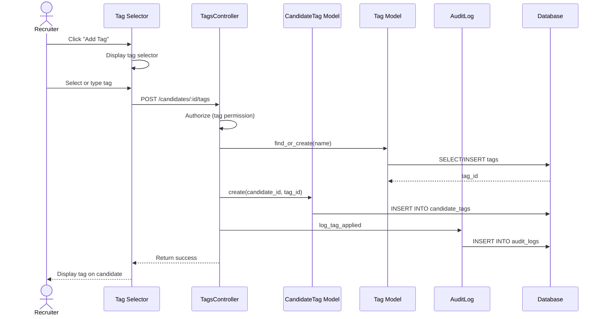

# UC-058: Tag Candidate

## Metadata

| Attribute | Value |
|-----------|-------|
| **ID** | UC-058 |
| **Name** | Tag Candidate |
| **Functional Area** | Candidate Management |
| **Primary Actor** | Recruiter (ACT-02) |
| **Priority** | P2 |
| **Complexity** | Low |
| **Status** | Draft |

## Description

A recruiter applies one or more tags to a candidate for categorization, filtering, and organization purposes. Tags are organization-defined labels that help recruiters quickly identify candidates with specific attributes, skills, or statuses.

## Actors

| Actor | Role in Use Case |
|-------|------------------|
| Recruiter (ACT-02) | Applies and removes tags from candidates |
| System Administrator (ACT-01) | Manages organization tag library |

## Preconditions

- [ ] User is authenticated and has candidate access
- [ ] Candidate record exists and is not deleted
- [ ] Organization has tags defined (or user can create new ones)

## Postconditions

### Success
- [ ] CandidateTag association created
- [ ] Candidate searchable by applied tags
- [ ] Audit log entry created

### Failure
- [ ] No tag applied
- [ ] User shown error message

## Triggers

- Recruiter clicks "Add Tag" on candidate profile
- Recruiter selects tags from dropdown
- Recruiter uses bulk tag action on multiple candidates

## Basic Flow



| Step | Actor | Action | System Response |
|------|-------|--------|-----------------|
| 1 | Recruiter | Clicks "Add Tag" or tag area | Tag selector displayed |
| 2 | Recruiter | Types to search or browses tags | Matching tags shown |
| 3 | Recruiter | Selects existing tag | Tag selected |
| 4 | System | Checks if tag already applied | Not duplicate |
| 5 | System | Creates CandidateTag record | Association saved |
| 6 | System | Creates audit log entry | Audit record saved |
| 7 | System | Displays tag on candidate | Tag visible |

## Alternative Flows

### AF-1: Create New Tag

**Trigger:** User types tag name that doesn't exist

| Step | Actor | Action | System Response |
|------|-------|--------|-----------------|
| 3a | Recruiter | Types new tag name | No matches found |
| 3b | System | Shows "Create new tag" option | Option displayed |
| 3c | Recruiter | Clicks "Create [tag name]" | New tag created |
| 3d | System | Creates Tag record | Tag saved |
| 3e | System | Applies to candidate | Tag association created |

**Resumption:** Continues at step 6

### AF-2: Apply Multiple Tags

**Trigger:** User selects multiple tags at once

| Step | Actor | Action | System Response |
|------|-------|--------|-----------------|
| 3a | Recruiter | Selects multiple tags | Tags queued |
| 4a | System | Validates all tags | All valid |
| 5a | System | Creates multiple CandidateTag records | Associations saved |

**Resumption:** Continues at step 6

### AF-3: Remove Tag

**Trigger:** User clicks X on existing tag

| Step | Actor | Action | System Response |
|------|-------|--------|-----------------|
| 1a | Recruiter | Clicks X on tag | Confirmation shown |
| 2a | Recruiter | Confirms removal | Tag association deleted |
| 3a | System | Logs removal | Audit record saved |

**Resumption:** Use case ends

### AF-4: Bulk Tag Candidates

**Trigger:** User selects multiple candidates and applies tag

| Step | Actor | Action | System Response |
|------|-------|--------|-----------------|
| 0a | Recruiter | Selects multiple candidates | Candidates selected |
| 0b | Recruiter | Clicks "Add Tag" from bulk actions | Tag selector shown |
| 1a | Recruiter | Selects tag(s) | Tags chosen |
| 2a | System | Applies to all selected candidates | Multiple associations |

**Resumption:** Continues at step 6 (multiple audit entries)

## Exception Flows

### EF-1: Tag Already Applied

**Trigger:** User tries to apply tag already on candidate

| Step | Actor | Action | System Response |
|------|-------|--------|-----------------|
| 4.1 | System | Detects existing tag | Shows "already applied" |
| 4.2 | System | Skips duplicate | No new record created |

**Resolution:** Silent skip, no error

### EF-2: Tag Name Too Long

**Trigger:** New tag name exceeds limit

| Step | Actor | Action | System Response |
|------|-------|--------|-----------------|
| 3.1 | System | Validates tag length | Too long |
| 3.2 | System | Shows error | Max 50 chars |
| 3.3 | Recruiter | Shortens name | Valid length |

**Resolution:** Returns to step 3

### EF-3: Tag Limit Reached

**Trigger:** Candidate has maximum tags (if configured)

| Step | Actor | Action | System Response |
|------|-------|--------|-----------------|
| 4.1 | System | Checks tag count | Limit reached |
| 4.2 | System | Shows limit error | Cannot add more |
| 4.3 | Recruiter | Removes other tag first | Space available |

**Resolution:** Returns to step 1

## Business Rules

| ID | Rule | Description |
|----|------|-------------|
| BR-058.1 | Tag Name Length | Tag names max 50 characters |
| BR-058.2 | Tag Uniqueness | Tag names unique within organization |
| BR-058.3 | No Duplicates | Same tag cannot be applied twice to candidate |
| BR-058.4 | Tag Limit | Optional limit of tags per candidate (default: none) |
| BR-058.5 | Tag Colors | Each tag can have optional color for display |
| BR-058.6 | Case Insensitive | Tag matching is case-insensitive |

## Data Requirements

### Input Data

| Field | Type | Required | Validation |
|-------|------|----------|------------|
| candidate_id | integer | Yes | Must exist |
| tag_id | integer | Conditional | Existing tag |
| tag_name | string | Conditional | For new tag, max 50 chars |

### Output Data

| Field | Type | Description |
|-------|------|-------------|
| candidate_tag_id | integer | Association ID |
| tag | object | Applied tag details |

## Database Transactions

### Tables Affected

| Table | Operation | Conditions |
|-------|-----------|------------|
| tags | CREATE | If new tag |
| candidate_tags | CREATE | Always |
| audit_logs | CREATE | Always |

### Transaction Detail

```sql
-- Tag Candidate Transaction
BEGIN TRANSACTION;

-- Step 1: Find or create tag
INSERT INTO tags (organization_id, name, color, created_at)
VALUES (@organization_id, @tag_name, @color, NOW())
ON DUPLICATE KEY UPDATE id = LAST_INSERT_ID(id);

SET @tag_id = LAST_INSERT_ID();

-- Step 2: Check if already applied
SELECT 1 FROM candidate_tags
WHERE candidate_id = @candidate_id
  AND tag_id = @tag_id;

-- Step 3: Create candidate tag association (if not exists)
INSERT IGNORE INTO candidate_tags (
    candidate_id,
    tag_id,
    added_by_id,
    created_at
) VALUES (
    @candidate_id,
    @tag_id,
    @current_user_id,
    NOW()
);

-- Step 4: Create audit log entry
INSERT INTO audit_logs (
    organization_id,
    user_id,
    action,
    auditable_type,
    auditable_id,
    metadata,
    ip_address,
    created_at
) VALUES (
    @organization_id,
    @current_user_id,
    'candidate.tagged',
    'Candidate',
    @candidate_id,
    JSON_OBJECT('tag_id', @tag_id, 'tag_name', @tag_name),
    @ip_address,
    NOW()
);

COMMIT;
```

### Rollback Scenarios

| Scenario | Rollback Action |
|----------|-----------------|
| Tag validation failure | No transaction started |
| Duplicate tag | Silent success (idempotent) |
| Database error | Full rollback |

## UI/UX Requirements

### Screen/Component

- **Location:** Candidate profile header or sidebar
- **Entry Point:**
  - Tag area click
  - "Add Tag" button
  - Bulk actions menu
- **Key Elements:**
  - Searchable tag dropdown
  - Tag autocomplete
  - Color-coded tag pills
  - Remove button on each tag
  - Create new tag option

### Tag Display Layout

```
+-------------------------------------------------------------+
| Tags                                           [+ Add Tag]   |
+-------------------------------------------------------------+
|                                                              |
| [Senior Level]  [Python Expert]  [Available Now]  [x]       |
| [Remote OK]     [Referred]                                   |
|                                                              |
+-------------------------------------------------------------+
```

### Tag Selector Dropdown

```
+-------------------------------------------------------------+
| Search or create tag...                                      |
+-------------------------------------------------------------+
| Recently Used                                                |
| +----------------------------------------------------------+ |
| | [*] Senior Level                                         | |
| | [*] Python Expert                                        | |
| | [ ] JavaScript Expert                                    | |
| +----------------------------------------------------------+ |
|                                                              |
| All Tags                                                     |
| +----------------------------------------------------------+ |
| | [ ] Available Now                                        | |
| | [ ] Contract OK                                          | |
| | [ ] Leadership                                           | |
| | [ ] Referred                                             | |
| | [ ] Remote OK                                            | |
| | [ ] Relocating                                           | |
| +----------------------------------------------------------+ |
|                                                              |
| + Create "Machine Learning"                                  |
|                                                              |
+-------------------------------------------------------------+
| [Cancel]                                        [Apply Tags] |
+-------------------------------------------------------------+
```

## Non-Functional Requirements

| Requirement | Target |
|-------------|--------|
| Response Time | < 500ms for tag apply |
| Availability | 99.9% |
| Autocomplete | < 100ms |
| Max Tags | Support 1000+ tags per org |

## Security Considerations

- [x] Authentication required
- [x] Authorization check: User must have candidate access
- [x] Organization scoping: Tags within organization only
- [x] Audit logging: Tag actions logged

## Related Use Cases

| Use Case | Relationship |
|----------|--------------|
| UC-061 Search Candidates | Uses tags for filtering |
| UC-062 Create Talent Pool | Can use tags as criteria |

---

## Data Model References

> Cross-references to [DATA_MODEL.md](../DATA_MODEL.md) and [CRUD_MATRIX.md](../CRUD_MATRIX.md)

### Subject Areas

| Subject Area | ID | Relationship |
|--------------|-----|--------------|
| Candidate | SA-04 | Primary |

### Entities CRUD

| Entity | C | R | U | D | Notes |
|--------|---|---|---|---|-------|
| Tag | X | X | | | Created if new |
| CandidateTag | X | X | | X | Applied/removed |
| AuditLog | X | | | | Created for actions |

**Legend:** C = Create, R = Read, U = Update, D = Delete

---

## Process Model References

> Cross-references to [PROCESS_MODEL.md](../PROCESS_MODEL.md) and [PROCESS_CRUD_MATRIX.md](../PROCESS_CRUD_MATRIX.md)

| Attribute | Value | Link |
|-----------|-------|------|
| **Elementary Business Process** | EP-0209: Tag Candidate | [PROCESS_MODEL.md#ep-0209](../PROCESS_MODEL.md#bp-102-candidate-sourcing) |
| **Business Process** | BP-102: Candidate Sourcing | [PROCESS_MODEL.md#bp-102](../PROCESS_MODEL.md#bp-102-candidate-sourcing) |
| **Business Function** | BF-01: Talent Acquisition | [PROCESS_MODEL.md#bf-01](../PROCESS_MODEL.md#bf-01-talent-acquisition) |

### EBP Details

| Attribute | Value |
|-----------|-------|
| **Trigger** | User applies tag to candidate |
| **Input** | Candidate ID, tag name or ID |
| **Output** | CandidateTag association |
| **Business Rules** | BR-058.1 through BR-058.6 (see Business Rules section) |

---

## Traceability Matrix

> Complete artifact mapping for requirements traceability

| Artifact Type | ID | Name | Link |
|---------------|-----|------|------|
| **Use Case** | UC-058 | Tag Candidate | *(this document)* |
| **Elementary Process** | EP-0209 | Tag Candidate | [PROCESS_MODEL.md](../PROCESS_MODEL.md#bp-102-candidate-sourcing) |
| **Business Process** | BP-102 | Candidate Sourcing | [PROCESS_MODEL.md](../PROCESS_MODEL.md#bp-102-candidate-sourcing) |
| **Business Function** | BF-01 | Talent Acquisition | [PROCESS_MODEL.md](../PROCESS_MODEL.md#bf-01-talent-acquisition) |
| **Primary Actor** | ACT-02 | Recruiter | [ACTORS.md](../ACTORS.md#act-02-recruiter) |
| **Subject Area (Primary)** | SA-04 | Candidate | [DATA_MODEL.md](../DATA_MODEL.md#sa-04-candidate) |
| **CRUD Matrix Row** | UC-058 | - | [CRUD_MATRIX.md](../CRUD_MATRIX.md#uc-058) |
| **Process CRUD Row** | EP-0209 | - | [PROCESS_CRUD_MATRIX.md](../PROCESS_CRUD_MATRIX.md#ep-0209) |

### Implementation Artifacts

| Artifact Type | Path/Reference | Status |
|---------------|----------------|--------|
| Controller | `app/controllers/admin/candidate_tags_controller.rb` | Planned |
| Model | `app/models/tag.rb` | Planned |
| Model | `app/models/candidate_tag.rb` | Planned |
| Policy | `app/policies/candidate_tag_policy.rb` | Planned |
| View | `app/views/admin/candidates/_tags.html.erb` | Planned |
| Test | `test/controllers/admin/candidate_tags_controller_test.rb` | Planned |

---

## Open Questions

1. Should tags be hierarchical (categories)?
2. Should there be system-generated auto-tags?
3. Should tags have descriptions for tooltip?
4. Should tag deletion cascade remove all associations?

## Change History

| Version | Date | Author | Changes |
|---------|------|--------|---------|
| 0.1 | 2026-01-25 | System | Initial draft |
