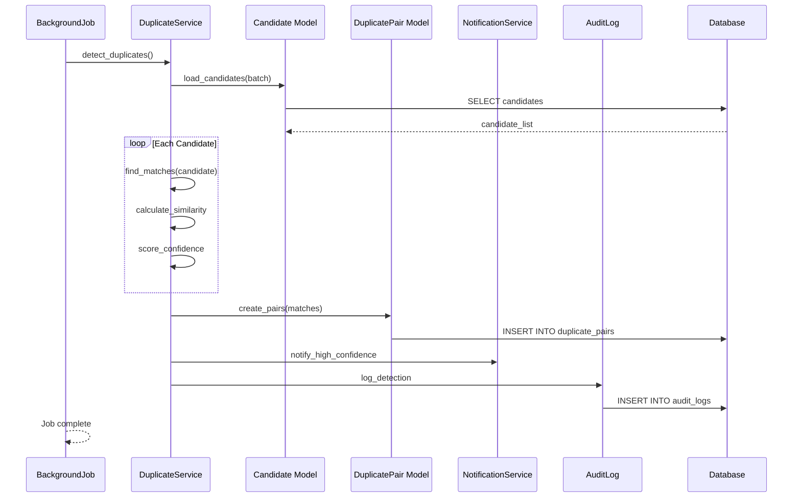

# UC-059: Detect Duplicates

## Metadata

| Attribute | Value |
|-----------|-------|
| **ID** | UC-059 |
| **Name** | Detect Duplicates |
| **Functional Area** | Candidate Management |
| **Primary Actor** | Scheduler (ACT-11) |
| **Priority** | P2 |
| **Complexity** | Medium |
| **Status** | Draft |

## Description

The system automatically detects potential duplicate candidate records based on matching criteria such as email, phone number, or name similarity. Duplicates can be detected in real-time during candidate creation or through scheduled batch processing.

## Actors

| Actor | Role in Use Case |
|-------|------------------|
| Scheduler (ACT-11) | Executes batch duplicate detection |
| Recruiter (ACT-02) | Reviews and acts on duplicate alerts |
| System Administrator (ACT-01) | Configures duplicate detection rules |

## Preconditions

- [ ] Duplicate detection is enabled for organization
- [ ] Candidate records exist to compare
- [ ] Detection rules are configured

## Postconditions

### Success
- [ ] Potential duplicates identified and flagged
- [ ] Duplicate pairs stored for review
- [ ] Recruiter notified of high-confidence matches
- [ ] Audit log entry created

### Failure
- [ ] Detection job fails and is retried
- [ ] Error logged for investigation

## Triggers

- Candidate creation (real-time check)
- Resume upload with new contact info
- Scheduled daily/weekly batch job
- Manual "Check for Duplicates" action

## Basic Flow



| Step | Actor | Action | System Response |
|------|-------|--------|-----------------|
| 1 | Scheduler | Triggers detection job | Job started |
| 2 | System | Loads candidate batch | Candidates retrieved |
| 3 | System | Compares email addresses | Exact matches found |
| 4 | System | Compares phone numbers | Normalized matches found |
| 5 | System | Compares names | Fuzzy matches found |
| 6 | System | Calculates similarity score | Scores computed |
| 7 | System | Applies confidence threshold | High confidence filtered |
| 8 | System | Creates DuplicatePair records | Pairs saved |
| 9 | System | Notifies recruiter (if high confidence) | Notification sent |
| 10 | System | Creates audit log entry | Audit record saved |

## Alternative Flows

### AF-1: Real-Time Detection on Create

**Trigger:** New candidate being created

| Step | Actor | Action | System Response |
|------|-------|--------|-----------------|
| 1a | System | Intercepts create action | Before save hook |
| 2a | System | Searches for matches | Quick lookup |
| 3a | System | Returns potential duplicates | Matches found |
| 4a | User | Decides to proceed or merge | Action taken |

**Resumption:** Either candidate created or merge initiated

### AF-2: Manual Duplicate Check

**Trigger:** Recruiter clicks "Check for Duplicates"

| Step | Actor | Action | System Response |
|------|-------|--------|-----------------|
| 1a | Recruiter | Clicks "Check for Duplicates" | Processing started |
| 2a | System | Searches entire database | Full comparison |
| 3a | System | Displays matches | Results shown |

**Resumption:** Continues at step 8 if matches found

### AF-3: No Duplicates Found

**Trigger:** No matches above threshold

| Step | Actor | Action | System Response |
|------|-------|--------|-----------------|
| 7a | System | No matches above threshold | No pairs created |
| 8a | System | Logs clean result | Audit recorded |

**Resumption:** Job completes with zero duplicates

## Exception Flows

### EF-1: Database Timeout

**Trigger:** Query takes too long

| Step | Actor | Action | System Response |
|------|-------|--------|-----------------|
| 3.1 | System | Query timeout | Error logged |
| 3.2 | System | Reduces batch size | Smaller query |
| 3.3 | System | Retries | Processing continues |

**Resolution:** Processes in smaller batches

### EF-2: External Service Failure

**Trigger:** Fuzzy matching service unavailable

| Step | Actor | Action | System Response |
|------|-------|--------|-----------------|
| 5.1 | System | Service call fails | Error logged |
| 5.2 | System | Falls back to exact match only | Reduced detection |
| 5.3 | System | Flags for re-run | Scheduled retry |

**Resolution:** Partial detection, scheduled retry

## Business Rules

| ID | Rule | Description |
|----|------|-------------|
| BR-059.1 | Email Match | Same email = 100% match |
| BR-059.2 | Phone Match | Normalized phone match = 90% |
| BR-059.3 | Name Match | Fuzzy name > 85% similarity = considered |
| BR-059.4 | Confidence Threshold | Only pairs above 70% flagged |
| BR-059.5 | High Confidence | Pairs above 95% trigger immediate notification |
| BR-059.6 | Exclusions | Already-merged candidates excluded |
| BR-059.7 | Same Org Only | Only compares within same organization |

## Data Requirements

### Input Data

| Field | Type | Required | Validation |
|-------|------|----------|------------|
| organization_id | integer | Yes | For scoping |
| candidate_id | integer | No | For single candidate check |
| batch_size | integer | No | Default 1000 |

### Output Data

| Field | Type | Description |
|-------|------|-------------|
| duplicate_pairs | array | List of potential duplicate pairs |
| confidence_score | float | Match confidence (0-1) |
| match_reasons | array | Why they match |

### Match Reasons Structure

```json
{
  "candidate_a_id": 123,
  "candidate_b_id": 456,
  "confidence": 0.92,
  "reasons": [
    {
      "field": "email",
      "match_type": "exact",
      "score": 1.0,
      "value_a": "john@example.com",
      "value_b": "john@example.com"
    },
    {
      "field": "name",
      "match_type": "fuzzy",
      "score": 0.88,
      "value_a": "John Smith",
      "value_b": "Jon Smith"
    }
  ],
  "detected_at": "2026-01-25T10:30:00Z"
}
```

## Database Transactions

### Tables Affected

| Table | Operation | Conditions |
|-------|-----------|------------|
| candidates | READ | For comparison |
| duplicate_pairs | CREATE | For each potential match |
| duplicate_pairs | UPDATE | If pair already exists |
| notifications | CREATE | For high confidence matches |
| audit_logs | CREATE | For detection run |

### Transaction Detail

```sql
-- Detect Duplicates Transaction
BEGIN TRANSACTION;

-- Step 1: Find email matches
SELECT c1.id as candidate_a_id, c2.id as candidate_b_id,
       1.0 as score, 'email' as match_type
FROM candidates c1
JOIN candidates c2 ON c1.email = c2.email
WHERE c1.organization_id = @organization_id
  AND c1.id < c2.id
  AND c1.discarded_at IS NULL
  AND c2.discarded_at IS NULL
  AND c1.merged_into_id IS NULL
  AND c2.merged_into_id IS NULL;

-- Step 2: Find phone matches (normalized)
SELECT c1.id, c2.id, 0.9 as score, 'phone' as match_type
FROM candidates c1
JOIN candidates c2 ON normalize_phone(c1.phone) = normalize_phone(c2.phone)
WHERE c1.organization_id = @organization_id
  AND c1.id < c2.id
  AND c1.phone IS NOT NULL
  AND c2.phone IS NOT NULL
  AND c1.discarded_at IS NULL
  AND c2.discarded_at IS NULL;

-- Step 3: Create/update duplicate pairs
INSERT INTO duplicate_pairs (
    organization_id,
    candidate_a_id,
    candidate_b_id,
    confidence_score,
    match_reasons,
    status,
    detected_at,
    created_at,
    updated_at
) VALUES (
    @organization_id,
    @candidate_a_id,
    @candidate_b_id,
    @confidence_score,
    @match_reasons_json,
    'pending_review',
    NOW(),
    NOW(),
    NOW()
)
ON DUPLICATE KEY UPDATE
    confidence_score = @confidence_score,
    match_reasons = @match_reasons_json,
    detected_at = NOW(),
    updated_at = NOW();

-- Step 4: Create audit log entry
INSERT INTO audit_logs (
    organization_id,
    user_id,
    action,
    auditable_type,
    auditable_id,
    metadata,
    created_at
) VALUES (
    @organization_id,
    NULL,
    'duplicates.detected',
    'Organization',
    @organization_id,
    JSON_OBJECT(
        'pairs_found', @pairs_count,
        'high_confidence_count', @high_confidence_count,
        'batch_size', @batch_size
    ),
    NOW()
);

COMMIT;
```

### Rollback Scenarios

| Scenario | Rollback Action |
|----------|-----------------|
| Query timeout | Retry with smaller batch |
| Database error | Full rollback, retry later |
| Service failure | Partial results saved |

## UI/UX Requirements

### Screen/Component

- **Location:** Candidates list sidebar, candidate profile
- **Entry Point:**
  - "Duplicates" filter in candidate list
  - Duplicate badge on candidate card
  - "Check Duplicates" action
- **Key Elements:**
  - Duplicate count badge
  - Side-by-side comparison view
  - Match reasons display
  - Merge/Dismiss actions

### Duplicate Review Panel

```
+-------------------------------------------------------------+
| Potential Duplicates (3)                                     |
+-------------------------------------------------------------+
|                                                              |
| High Confidence Match - 95%                                  |
| +------------------------+ +------------------------+        |
| | John Smith             | | Jon Smith              |        |
| | john@example.com       | | john@example.com       |        |
| | +1 (555) 123-4567      | | (555) 123-4567        |        |
| | San Francisco, CA      | | SF, California         |        |
| | Created: Jan 15, 2026  | | Created: Jan 20, 2026  |        |
| | Applications: 2        | | Applications: 1        |        |
| +------------------------+ +------------------------+        |
|                                                              |
| Match Reasons:                                               |
| - Email: Exact match (100%)                                  |
| - Phone: Normalized match (90%)                              |
| - Name: Fuzzy match "John Smith" ~ "Jon Smith" (88%)        |
|                                                              |
| [Merge Records]  [Not a Duplicate]  [View Both Profiles]    |
|                                                              |
+-------------------------------------------------------------+
| Medium Confidence Match - 78%                                |
| ... (next pair)                                              |
+-------------------------------------------------------------+
```

## Non-Functional Requirements

| Requirement | Target |
|-------------|--------|
| Real-time Detection | < 1 second during create |
| Batch Processing | 10,000 candidates per minute |
| Availability | 99.5% (async processing) |
| Accuracy | > 90% precision at 70% threshold |

## Security Considerations

- [x] Organization scoping: Only compares within organization
- [x] PII handling: Comparisons on encrypted data decrypted in memory
- [x] Audit logging: Detection runs logged
- [x] Access control: Only authorized users see duplicates

## Related Use Cases

| Use Case | Relationship |
|----------|--------------|
| UC-050 Add Candidate Manually | Triggers real-time check |
| UC-051 Import Candidates | Triggers batch check |
| UC-060 Merge Candidates | Follows duplicate detection |

---

## Data Model References

> Cross-references to [DATA_MODEL.md](../DATA_MODEL.md) and [CRUD_MATRIX.md](../CRUD_MATRIX.md)

### Subject Areas

| Subject Area | ID | Relationship |
|--------------|-----|--------------|
| Candidate | SA-04 | Primary |
| Compliance & Audit | SA-09 | Reference |

### Entities CRUD

| Entity | C | R | U | D | Notes |
|--------|---|---|---|---|-------|
| Candidate | | X | | | Read for comparison |
| DuplicatePair | X | X | X | | Created/updated for matches |
| Notification | X | | | | For high confidence |
| AuditLog | X | | | | Created for detection run |

**Legend:** C = Create, R = Read, U = Update, D = Delete

---

## Process Model References

> Cross-references to [PROCESS_MODEL.md](../PROCESS_MODEL.md) and [PROCESS_CRUD_MATRIX.md](../PROCESS_CRUD_MATRIX.md)

| Attribute | Value | Link |
|-----------|-------|------|
| **Elementary Business Process** | EP-0210: Detect Duplicates | [PROCESS_MODEL.md#ep-0210](../PROCESS_MODEL.md#bp-102-candidate-sourcing) |
| **Business Process** | BP-102: Candidate Sourcing | [PROCESS_MODEL.md#bp-102](../PROCESS_MODEL.md#bp-102-candidate-sourcing) |
| **Business Function** | BF-01: Talent Acquisition | [PROCESS_MODEL.md#bf-01](../PROCESS_MODEL.md#bf-01-talent-acquisition) |

### EBP Details

| Attribute | Value |
|-----------|-------|
| **Trigger** | Candidate creation, batch job, or manual check |
| **Input** | Candidate records for comparison |
| **Output** | DuplicatePair records with confidence scores |
| **Business Rules** | BR-059.1 through BR-059.7 (see Business Rules section) |

---

## Traceability Matrix

> Complete artifact mapping for requirements traceability

| Artifact Type | ID | Name | Link |
|---------------|-----|------|------|
| **Use Case** | UC-059 | Detect Duplicates | *(this document)* |
| **Elementary Process** | EP-0210 | Detect Duplicates | [PROCESS_MODEL.md](../PROCESS_MODEL.md#bp-102-candidate-sourcing) |
| **Business Process** | BP-102 | Candidate Sourcing | [PROCESS_MODEL.md](../PROCESS_MODEL.md#bp-102-candidate-sourcing) |
| **Business Function** | BF-01 | Talent Acquisition | [PROCESS_MODEL.md](../PROCESS_MODEL.md#bf-01-talent-acquisition) |
| **Primary Actor** | ACT-11 | Scheduler | [ACTORS.md](../ACTORS.md#act-11-scheduler) |
| **Subject Area (Primary)** | SA-04 | Candidate | [DATA_MODEL.md](../DATA_MODEL.md#sa-04-candidate) |
| **CRUD Matrix Row** | UC-059 | - | [CRUD_MATRIX.md](../CRUD_MATRIX.md#uc-059) |
| **Process CRUD Row** | EP-0210 | - | [PROCESS_CRUD_MATRIX.md](../PROCESS_CRUD_MATRIX.md#ep-0210) |

### Implementation Artifacts

| Artifact Type | Path/Reference | Status |
|---------------|----------------|--------|
| Job | `app/jobs/detect_duplicates_job.rb` | Planned |
| Service | `app/services/candidates/duplicate_detector.rb` | Planned |
| Model | `app/models/duplicate_pair.rb` | Planned |
| Controller | `app/controllers/admin/duplicates_controller.rb` | Planned |
| View | `app/views/admin/duplicates/index.html.erb` | Planned |
| Test | `test/services/candidates/duplicate_detector_test.rb` | Planned |

---

## Open Questions

1. Should we use ML for name matching or simple Levenshtein?
2. How should we handle duplicates across different sources (referral vs. application)?
3. Should there be automated merge rules for 100% matches?
4. What is the retention period for resolved duplicate pairs?

## Change History

| Version | Date | Author | Changes |
|---------|------|--------|---------|
| 0.1 | 2026-01-25 | System | Initial draft |
