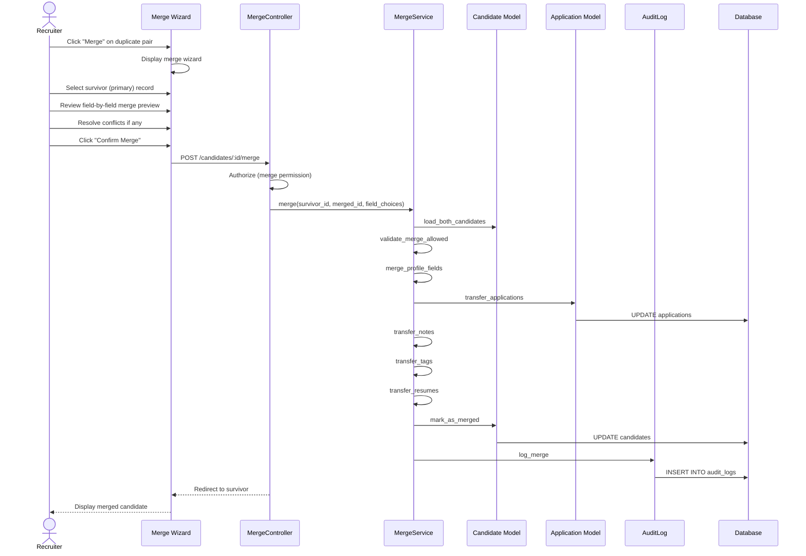

# UC-060: Merge Candidates

## Metadata

| Attribute | Value |
|-----------|-------|
| **ID** | UC-060 |
| **Name** | Merge Candidates |
| **Functional Area** | Candidate Management |
| **Primary Actor** | Recruiter (ACT-02) |
| **Priority** | P2 |
| **Complexity** | High |
| **Status** | Draft |

## Description

A recruiter merges two duplicate candidate records into a single unified record. The merge process preserves all applications, notes, resumes, and activity history from both records while eliminating data redundancy. The survivor record is updated while the merged record is marked as merged and retains a reference to the survivor.

## Actors

| Actor | Role in Use Case |
|-------|------------------|
| Recruiter (ACT-02) | Initiates and completes merge |
| System Administrator (ACT-01) | Can undo merges within time window |

## Preconditions

- [ ] User is authenticated and has candidate merge permission
- [ ] Two candidate records identified as potential duplicates
- [ ] Neither candidate is already merged into another
- [ ] Neither candidate is under legal hold

## Postconditions

### Success
- [ ] Survivor candidate updated with merged data
- [ ] All applications transferred to survivor
- [ ] All notes, tags, and resumes transferred
- [ ] Merged candidate marked with merged_into_id
- [ ] Audit log entry created with full merge details
- [ ] DuplicatePair marked as resolved

### Failure
- [ ] No changes to either candidate
- [ ] User shown error message
- [ ] Original data preserved

## Triggers

- Recruiter clicks "Merge" from duplicate review panel
- Recruiter selects two candidates and chooses merge action
- System suggests merge for high-confidence duplicate

## Basic Flow



| Step | Actor | Action | System Response |
|------|-------|--------|-----------------|
| 1 | Recruiter | Clicks "Merge" on duplicate pair | Merge wizard displayed |
| 2 | System | Shows side-by-side comparison | Both candidates displayed |
| 3 | Recruiter | Selects survivor (primary) record | Primary designated |
| 4 | System | Shows field-by-field preview | Merge preview displayed |
| 5 | Recruiter | Reviews automatic field selections | Defaults shown |
| 6 | Recruiter | Overrides field choices if needed | Custom choices saved |
| 7 | Recruiter | Clicks "Confirm Merge" | Validation started |
| 8 | System | Validates merge is allowed | No conflicts |
| 9 | System | Merges profile fields | Fields updated on survivor |
| 10 | System | Transfers all applications | Applications re-pointed |
| 11 | System | Transfers notes to survivor | Notes reassigned |
| 12 | System | Transfers tags (deduped) | Tags combined |
| 13 | System | Transfers resumes | Resumes reassigned |
| 14 | System | Marks merged candidate | merged_into_id set |
| 15 | System | Creates audit log entry | Full merge details logged |
| 16 | System | Marks duplicate pair resolved | Status updated |
| 17 | System | Redirects to survivor profile | Merged candidate shown |

## Alternative Flows

### AF-1: Quick Merge (Same Email)

**Trigger:** Duplicates have identical email, auto-select survivor

| Step | Actor | Action | System Response |
|------|-------|--------|-----------------|
| 2a | System | Detects identical email | Auto-recommends survivor |
| 3a | System | Selects more complete profile | Primary pre-selected |
| 4a | Recruiter | Reviews and confirms | Accepts default |

**Resumption:** Continues at step 7

### AF-2: Cancel Merge

**Trigger:** Recruiter decides not to merge

| Step | Actor | Action | System Response |
|------|-------|--------|-----------------|
| 7a | Recruiter | Clicks "Cancel" | Confirmation dialog |
| 7b | Recruiter | Confirms cancel | Wizard closed |
| 7c | System | Returns to duplicate list | No changes made |

**Resumption:** Use case ends (no merge)

### AF-3: Mark as Not Duplicate

**Trigger:** Recruiter determines not actually duplicate

| Step | Actor | Action | System Response |
|------|-------|--------|-----------------|
| 3a | Recruiter | Clicks "Not a Duplicate" | Confirmation dialog |
| 3b | Recruiter | Confirms | Pair status updated |
| 3c | System | Marks pair as "dismissed" | Won't show again |

**Resumption:** Use case ends

### AF-4: Undo Merge (Admin)

**Trigger:** Admin needs to reverse a merge

| Step | Actor | Action | System Response |
|------|-------|--------|-----------------|
| 1a | Admin | Accesses merge history | Merge record shown |
| 2a | Admin | Clicks "Undo Merge" | Confirmation dialog |
| 3a | Admin | Confirms undo | Merge reversed |
| 4a | System | Restores original records | Data separated |

**Resumption:** Both candidates restored to pre-merge state

## Exception Flows

### EF-1: Candidate Already Merged

**Trigger:** One candidate already has merged_into_id set

| Step | Actor | Action | System Response |
|------|-------|--------|-----------------|
| 8.1 | System | Detects already merged | Shows error |
| 8.2 | System | Shows merge chain | Points to ultimate survivor |
| 8.3 | Recruiter | Follows chain or cancels | Action chosen |

**Resolution:** Either merge with ultimate survivor or cancel

### EF-2: Legal Hold Conflict

**Trigger:** One or both candidates under legal hold

| Step | Actor | Action | System Response |
|------|-------|--------|-----------------|
| 8.1 | System | Detects legal hold | Shows restriction |
| 8.2 | System | Displays hold details | Reason shown |
| 8.3 | Recruiter | Contacts compliance | Out of system |

**Resolution:** Merge blocked until hold lifted

### EF-3: Application Conflict

**Trigger:** Both candidates have application to same job

| Step | Actor | Action | System Response |
|------|-------|--------|-----------------|
| 10.1 | System | Detects duplicate applications | Shows conflict |
| 10.2 | System | Asks which to keep | Options displayed |
| 10.3 | Recruiter | Selects primary application | Choice made |
| 10.4 | System | Archives secondary | One application kept |

**Resolution:** Single application per job preserved

### EF-4: Database Error During Merge

**Trigger:** Transaction fails partway through

| Step | Actor | Action | System Response |
|------|-------|--------|-----------------|
| E.1 | System | Detects database error | Transaction rolled back |
| E.2 | System | Logs error details | Error recorded |
| E.3 | System | Shows error to user | Retry option offered |

**Resolution:** Full rollback, user can retry

## Business Rules

| ID | Rule | Description |
|----|------|-------------|
| BR-060.1 | One Survivor | Exactly one candidate survives the merge |
| BR-060.2 | No Chain Merge | Cannot merge already-merged candidate |
| BR-060.3 | Same Org Only | Can only merge within same organization |
| BR-060.4 | Application Uniqueness | One application per job after merge |
| BR-060.5 | Tag Deduplication | Duplicate tags combined, not duplicated |
| BR-060.6 | All History Preserved | All activity history transferred |
| BR-060.7 | Merged Retention | Merged record retained for audit (soft reference) |
| BR-060.8 | Undo Window | Merge can be undone within 30 days |

## Data Requirements

### Input Data

| Field | Type | Required | Validation |
|-------|------|----------|------------|
| survivor_id | integer | Yes | Must be valid candidate |
| merged_id | integer | Yes | Must be different candidate |
| field_choices | json | No | Override automatic selections |

### Output Data

| Field | Type | Description |
|-------|------|-------------|
| survivor | object | Updated survivor record |
| merged | object | Merged record with reference |
| merge_summary | object | What was transferred |

### Field Choice Structure

```json
{
  "survivor_id": 123,
  "merged_id": 456,
  "field_choices": {
    "email": "survivor",
    "phone": "merged",
    "location": "survivor",
    "linkedin_url": "merged",
    "summary": "merged"
  }
}
```

## Database Transactions

### Tables Affected

| Table | Operation | Conditions |
|-------|-----------|------------|
| candidates | UPDATE | Survivor and merged records |
| applications | UPDATE | Transfer to survivor |
| candidate_notes | UPDATE | Transfer to survivor |
| candidate_tags | UPDATE/DELETE | Transfer and dedupe |
| resumes | UPDATE | Transfer to survivor |
| duplicate_pairs | UPDATE | Mark resolved |
| merge_records | CREATE | For undo capability |
| audit_logs | CREATE | Full merge details |

### Transaction Detail

```sql
-- Merge Candidates Transaction
BEGIN TRANSACTION;

-- Step 1: Validate both candidates
SELECT id, organization_id, merged_into_id
FROM candidates
WHERE id IN (@survivor_id, @merged_id)
  AND discarded_at IS NULL;

-- Step 2: Check for legal holds
SELECT 1 FROM deletion_requests
WHERE candidate_id IN (@survivor_id, @merged_id)
  AND legal_hold = true;

-- Step 3: Create merge record (for undo)
INSERT INTO merge_records (
    organization_id,
    survivor_id,
    merged_id,
    survivor_snapshot,
    merged_snapshot,
    field_choices,
    merged_by_id,
    merged_at,
    created_at
) VALUES (
    @organization_id,
    @survivor_id,
    @merged_id,
    @survivor_snapshot_json,
    @merged_snapshot_json,
    @field_choices_json,
    @current_user_id,
    NOW(),
    NOW()
);

SET @merge_record_id = LAST_INSERT_ID();

-- Step 4: Update survivor with chosen field values
UPDATE candidates
SET email = COALESCE(@chosen_email, email),
    phone = COALESCE(@chosen_phone, phone),
    location = COALESCE(@chosen_location, location),
    linkedin_url = COALESCE(@chosen_linkedin, linkedin_url),
    portfolio_url = COALESCE(@chosen_portfolio, portfolio_url),
    summary = COALESCE(@chosen_summary, summary),
    updated_at = NOW()
WHERE id = @survivor_id;

-- Step 5: Transfer applications (handle job conflicts)
UPDATE applications
SET candidate_id = @survivor_id,
    updated_at = NOW()
WHERE candidate_id = @merged_id
  AND job_id NOT IN (
    SELECT job_id FROM applications WHERE candidate_id = @survivor_id
  );

-- Archive duplicate job applications
UPDATE applications
SET status = 'merged',
    discarded_at = NOW()
WHERE candidate_id = @merged_id
  AND job_id IN (
    SELECT job_id FROM applications WHERE candidate_id = @survivor_id
  );

-- Step 6: Transfer notes
UPDATE candidate_notes
SET candidate_id = @survivor_id,
    updated_at = NOW()
WHERE candidate_id = @merged_id;

-- Step 7: Transfer tags (skip duplicates)
INSERT IGNORE INTO candidate_tags (candidate_id, tag_id, added_by_id, created_at)
SELECT @survivor_id, tag_id, added_by_id, created_at
FROM candidate_tags
WHERE candidate_id = @merged_id;

DELETE FROM candidate_tags WHERE candidate_id = @merged_id;

-- Step 8: Transfer resumes
UPDATE resumes
SET candidate_id = @survivor_id,
    updated_at = NOW()
WHERE candidate_id = @merged_id;

-- Step 9: Mark merged candidate
UPDATE candidates
SET merged_into_id = @survivor_id,
    merged_at = NOW(),
    updated_at = NOW()
WHERE id = @merged_id;

-- Step 10: Resolve duplicate pair
UPDATE duplicate_pairs
SET status = 'merged',
    resolved_at = NOW(),
    resolved_by_id = @current_user_id,
    updated_at = NOW()
WHERE (candidate_a_id = @survivor_id AND candidate_b_id = @merged_id)
   OR (candidate_a_id = @merged_id AND candidate_b_id = @survivor_id);

-- Step 11: Create audit log entry
INSERT INTO audit_logs (
    organization_id,
    user_id,
    action,
    auditable_type,
    auditable_id,
    metadata,
    changes,
    ip_address,
    user_agent,
    created_at
) VALUES (
    @organization_id,
    @current_user_id,
    'candidate.merged',
    'Candidate',
    @survivor_id,
    JSON_OBJECT(
        'survivor_id', @survivor_id,
        'merged_id', @merged_id,
        'merge_record_id', @merge_record_id,
        'applications_transferred', @apps_count,
        'notes_transferred', @notes_count,
        'tags_transferred', @tags_count
    ),
    @field_choices_json,
    @ip_address,
    @user_agent,
    NOW()
);

COMMIT;
```

### Rollback Scenarios

| Scenario | Rollback Action |
|----------|-----------------|
| Validation failure | No transaction started |
| Already merged | Return error, no changes |
| Legal hold | Return error, no changes |
| Database error | Full rollback |

## UI/UX Requirements

### Screen/Component

- **Location:** /candidates/:id/merge or /duplicates/:pair_id/merge
- **Entry Point:**
  - "Merge" button on duplicate pair
  - "Merge with..." from candidate actions
- **Key Elements:**
  - Side-by-side comparison
  - Field-by-field selector
  - Application conflict resolver
  - Preview of merged result
  - Confirmation summary

### Merge Wizard Layout

```
+-------------------------------------------------------------+
| Merge Candidates                                  Step 1 of 3|
+-------------------------------------------------------------+
| Select Primary Record                                        |
+-------------------------------------------------------------+
|                                                              |
| Which record should be the primary (survivor)?               |
|                                                              |
| +------------------------+ +------------------------+        |
| | (*) CANDIDATE A        | | ( ) CANDIDATE B        |        |
| +------------------------+ +------------------------+        |
| | John Smith             | | Jon Smith              |        |
| | john@example.com       | | john@example.com       |        |
| | +1 (555) 123-4567      | | (555) 123-4567        |        |
| | San Francisco, CA      | | SF, California         |        |
| |                        | |                        |        |
| | Created: Jan 15, 2026  | | Created: Jan 20, 2026  |        |
| | Applications: 3        | | Applications: 1        |        |
| | Notes: 5               | | Notes: 2               |        |
| | Resumes: 2             | | Resumes: 1             |        |
| +------------------------+ +------------------------+        |
|                                                              |
| Recommendation: Candidate A has more complete history        |
|                                                              |
+-------------------------------------------------------------+
| [Cancel]  [Not a Duplicate]                        [Next >]  |
+-------------------------------------------------------------+

+-------------------------------------------------------------+
| Merge Candidates                                  Step 2 of 3|
+-------------------------------------------------------------+
| Review Field Merge                                           |
+-------------------------------------------------------------+
|                                                              |
| For each field, select which value to keep:                  |
|                                                              |
| Email                                                        |
| +----------------------------------------------------------+ |
| | (*) john@example.com (both same)                         | |
| +----------------------------------------------------------+ |
|                                                              |
| Phone                                                        |
| +----------------------------------------------------------+ |
| | (*) +1 (555) 123-4567  ( ) (555) 123-4567               | |
| +----------------------------------------------------------+ |
|                                                              |
| Location                                                     |
| +----------------------------------------------------------+ |
| | (*) San Francisco, CA  ( ) SF, California                | |
| +----------------------------------------------------------+ |
|                                                              |
| LinkedIn                                                     |
| +----------------------------------------------------------+ |
| | ( ) (empty)            (*) linkedin.com/in/jsmith        | |
| +----------------------------------------------------------+ |
|                                                              |
| Summary                                                      |
| +----------------------------------------------------------+ |
| | ( ) Candidate A        (*) Candidate B (more detailed)   | |
| +----------------------------------------------------------+ |
|                                                              |
+-------------------------------------------------------------+
| [< Back]                                           [Next >]  |
+-------------------------------------------------------------+

+-------------------------------------------------------------+
| Merge Candidates                                  Step 3 of 3|
+-------------------------------------------------------------+
| Confirm Merge                                                |
+-------------------------------------------------------------+
|                                                              |
| The following will happen:                                   |
|                                                              |
| - Primary record: John Smith (ID: 123)                       |
| - Records to merge: Jon Smith (ID: 456)                      |
|                                                              |
| Data to transfer:                                            |
| - 1 application (no conflicts)                               |
| - 2 notes                                                    |
| - 3 tags (1 duplicate will be skipped)                       |
| - 1 resume                                                   |
|                                                              |
| [!] This action can be undone within 30 days                 |
|                                                              |
+-------------------------------------------------------------+
| [< Back]  [Cancel]                         [Confirm Merge]   |
+-------------------------------------------------------------+
```

## Non-Functional Requirements

| Requirement | Target |
|-------------|--------|
| Response Time | < 5 seconds for merge |
| Availability | 99.9% |
| Undo Window | 30 days |
| Audit Retention | 7 years |

## Security Considerations

- [x] Authentication required
- [x] Authorization check: User must have merge permission
- [x] Organization scoping: Only merge within organization
- [x] Legal hold check: Cannot merge held candidates
- [x] Full audit trail: Complete merge details logged
- [x] Undo capability: Admin can reverse within window

## Related Use Cases

| Use Case | Relationship |
|----------|--------------|
| UC-059 Detect Duplicates | Precedes this use case |
| UC-054 Edit Candidate Profile | Alternative for minor corrections |

---

## Data Model References

> Cross-references to [DATA_MODEL.md](../DATA_MODEL.md) and [CRUD_MATRIX.md](../CRUD_MATRIX.md)

### Subject Areas

| Subject Area | ID | Relationship |
|--------------|-----|--------------|
| Candidate | SA-04 | Primary |
| Application Pipeline | SA-05 | Secondary |
| Compliance & Audit | SA-09 | Reference |

### Entities CRUD

| Entity | C | R | U | D | Notes |
|--------|---|---|---|---|-------|
| Candidate | | X | X | | Both updated |
| Application | | X | X | | Transferred to survivor |
| CandidateNote | | X | X | | Transferred to survivor |
| CandidateTag | | X | X | X | Transferred and deduped |
| Resume | | X | X | | Transferred to survivor |
| MergeRecord | X | | | | For undo capability |
| DuplicatePair | | X | X | | Marked resolved |
| AuditLog | X | | | | Full merge details |

**Legend:** C = Create, R = Read, U = Update, D = Delete

---

## Process Model References

> Cross-references to [PROCESS_MODEL.md](../PROCESS_MODEL.md) and [PROCESS_CRUD_MATRIX.md](../PROCESS_CRUD_MATRIX.md)

| Attribute | Value | Link |
|-----------|-------|------|
| **Elementary Business Process** | EP-0211: Merge Candidates | [PROCESS_MODEL.md#ep-0211](../PROCESS_MODEL.md#bp-102-candidate-sourcing) |
| **Business Process** | BP-102: Candidate Sourcing | [PROCESS_MODEL.md#bp-102](../PROCESS_MODEL.md#bp-102-candidate-sourcing) |
| **Business Function** | BF-01: Talent Acquisition | [PROCESS_MODEL.md#bf-01](../PROCESS_MODEL.md#bf-01-talent-acquisition) |

### EBP Details

| Attribute | Value |
|-----------|-------|
| **Trigger** | Recruiter initiates merge from duplicate pair |
| **Input** | Two candidate IDs, field merge choices |
| **Output** | Single merged candidate, archived source |
| **Business Rules** | BR-060.1 through BR-060.8 (see Business Rules section) |

---

## Traceability Matrix

> Complete artifact mapping for requirements traceability

| Artifact Type | ID | Name | Link |
|---------------|-----|------|------|
| **Use Case** | UC-060 | Merge Candidates | *(this document)* |
| **Elementary Process** | EP-0211 | Merge Candidates | [PROCESS_MODEL.md](../PROCESS_MODEL.md#bp-102-candidate-sourcing) |
| **Business Process** | BP-102 | Candidate Sourcing | [PROCESS_MODEL.md](../PROCESS_MODEL.md#bp-102-candidate-sourcing) |
| **Business Function** | BF-01 | Talent Acquisition | [PROCESS_MODEL.md](../PROCESS_MODEL.md#bf-01-talent-acquisition) |
| **Primary Actor** | ACT-02 | Recruiter | [ACTORS.md](../ACTORS.md#act-02-recruiter) |
| **Subject Area (Primary)** | SA-04 | Candidate | [DATA_MODEL.md](../DATA_MODEL.md#sa-04-candidate) |
| **CRUD Matrix Row** | UC-060 | - | [CRUD_MATRIX.md](../CRUD_MATRIX.md#uc-060) |
| **Process CRUD Row** | EP-0211 | - | [PROCESS_CRUD_MATRIX.md](../PROCESS_CRUD_MATRIX.md#ep-0211) |

### Implementation Artifacts

| Artifact Type | Path/Reference | Status |
|---------------|----------------|--------|
| Controller | `app/controllers/admin/merges_controller.rb` | Planned |
| Service | `app/services/candidates/merge_service.rb` | Planned |
| Model | `app/models/merge_record.rb` | Planned |
| Policy | `app/policies/merge_policy.rb` | Planned |
| View | `app/views/admin/merges/new.html.erb` | Planned |
| Test | `test/services/candidates/merge_service_test.rb` | Planned |

---

## Open Questions

1. Should we support three-way merges?
2. How do we handle merge conflicts in scorecards and interviews?
3. Should GDPR consent be re-requested after merge?
4. What happens to agency attribution when merging agency candidates?

## Change History

| Version | Date | Author | Changes |
|---------|------|--------|---------|
| 0.1 | 2026-01-25 | System | Initial draft |
