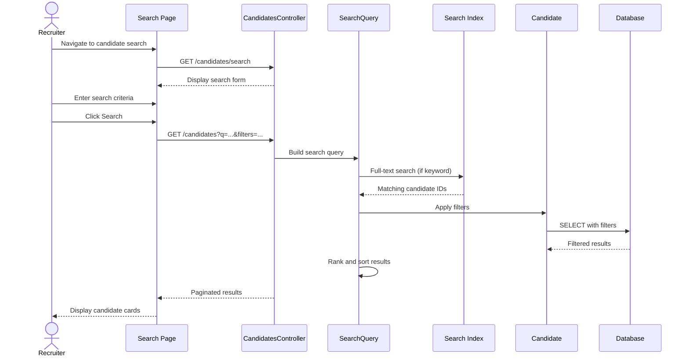

# UC-061: Search Candidates

## Metadata

| Attribute | Value |
|-----------|-------|
| **ID** | UC-061 |
| **Name** | Search Candidates |
| **Functional Area** | Candidate Management |
| **Primary Actor** | Recruiter (ACT-02) |
| **Priority** | P1 |
| **Complexity** | Medium |
| **Status** | Draft |

## Description

A recruiter searches the candidate database using various filters and keywords to find suitable candidates. The search supports full-text search on resume content, structured filters (skills, location, experience), and saved search criteria. Results can be sorted, exported, or used to populate talent pools.

## Actors

| Actor | Role in Use Case |
|-------|------------------|
| Recruiter (ACT-02) | Performs searches and views results |
| Hiring Manager (ACT-03) | Searches within assigned jobs |
| System (ACT-10) | Executes search queries and ranks results |

## Preconditions

- [ ] User is authenticated and has Recruiter or Hiring Manager role
- [ ] At least one candidate exists in the organization's database
- [ ] Search index is up to date (for full-text search)

## Postconditions

### Success
- [ ] Search results displayed matching criteria
- [ ] Results ranked by relevance
- [ ] Search can be saved for future use
- [ ] Results can be exported or added to pool

### Failure
- [ ] No results message displayed
- [ ] Search suggestions offered
- [ ] Broader search recommended

## Triggers

- Recruiter enters search criteria in candidate search page
- Recruiter uses quick search from global search bar
- Recruiter loads a saved search
- System alert triggers saved search execution

## Basic Flow



| Step | Actor | Action | System Response |
|------|-------|--------|-----------------|
| 1 | Recruiter | Navigates to candidate search | Search form displayed |
| 2 | Recruiter | Enters keyword(s) | Terms accepted |
| 3 | Recruiter | Selects filters | Filter options applied |
| 4 | Recruiter | Clicks "Search" | Query executed |
| 5 | System | Performs full-text search | Keyword matches found |
| 6 | System | Applies structured filters | Results narrowed |
| 7 | System | Ranks by relevance | Results ordered |
| 8 | System | Returns paginated results | First page shown |
| 9 | Recruiter | Reviews results | Candidate cards displayed |
| 10 | Recruiter | Optionally saves search | Search criteria stored |

## Alternative Flows

### AF-1: Load Saved Search

**Trigger:** Recruiter selects a saved search

| Step | Actor | Action | System Response |
|------|-------|--------|-----------------|
| 1.1 | Recruiter | Clicks "Saved Searches" | List displayed |
| 1.2 | Recruiter | Selects saved search | Criteria loaded |
| 1.3 | System | Executes saved query | Fresh results returned |

**Resumption:** Returns to step 8 with results

### AF-2: Boolean Search

**Trigger:** Recruiter uses advanced search syntax

| Step | Actor | Action | System Response |
|------|-------|--------|-----------------|
| 2.1 | Recruiter | Uses AND/OR/NOT operators | Boolean logic applied |
| 2.2 | System | Parses boolean expression | Query constructed |
| 2.3 | System | Executes compound query | Complex matching performed |

**Resumption:** Returns to step 7 with results

### AF-3: Export Results

**Trigger:** Recruiter wants to export search results

| Step | Actor | Action | System Response |
|------|-------|--------|-----------------|
| 9.1 | Recruiter | Clicks "Export" | Export options shown |
| 9.2 | Recruiter | Selects format (CSV/Excel) | Format confirmed |
| 9.3 | System | Generates export file | File downloaded |

**Resumption:** Use case complete

## Exception Flows

### EF-1: No Results Found

**Trigger:** Search returns zero candidates

| Step | Actor | Action | System Response |
|------|-------|--------|-----------------|
| E.1 | System | Detects empty result set | No matches |
| E.2 | System | Suggests broader criteria | Recommendations shown |
| E.3 | System | Shows related searches | Alternative queries |

**Resolution:** User modifies search or accepts no results

### EF-2: Search Timeout

**Trigger:** Query takes too long

| Step | Actor | Action | System Response |
|------|-------|--------|-----------------|
| E.1 | System | Query exceeds timeout | Performance issue |
| E.2 | System | Returns partial results | With timeout notice |
| E.3 | System | Suggests narrower criteria | To improve performance |

**Resolution:** User refines search for better performance

## Business Rules

| ID | Rule | Description |
|----|------|-------------|
| BR-1 | Organization Scope | Search only returns candidates in same organization |
| BR-2 | Privacy Filters | Certain fields excluded based on consent status |
| BR-3 | Relevance Ranking | Results ordered by match score by default |
| BR-4 | Active Candidates | Archived candidates excluded unless explicitly included |
| BR-5 | Saved Search Limit | Max 50 saved searches per user |

## Data Requirements

### Input Data

| Field | Type | Required | Validation |
|-------|------|----------|------------|
| keywords | string | No | Max 500 characters |
| skills | array | No | Valid skill tags |
| location | string | No | City, state, or zip |
| experience_min | integer | No | 0-50 years |
| experience_max | integer | No | 0-50 years |
| sources | array | No | Valid source IDs |
| tags | array | No | Valid tag IDs |
| applied_to_job | integer | No | Valid job ID |
| in_pool | integer | No | Valid pool ID |

### Output Data

| Field | Type | Description |
|-------|------|-------------|
| candidates | array | Matching candidate records |
| total_count | integer | Total matches (before pagination) |
| page | integer | Current page number |
| per_page | integer | Results per page |
| facets | object | Count breakdowns for filters |

## Database Transactions

### Tables Affected

| Table | Operation | Conditions |
|-------|-----------|------------|
| candidates | READ | Search target |
| candidate_skills | READ | Skill filtering |
| applications | READ | Job application filters |
| talent_pool_memberships | READ | Pool membership filters |
| saved_searches | CREATE/READ | If saving search |

### Transaction Detail

```sql
-- Complex search query (simplified)
SELECT c.*, ts_rank(search_vector, query) as relevance
FROM candidates c
LEFT JOIN candidate_skills cs ON cs.candidate_id = c.id
WHERE c.organization_id = @org_id
  AND c.search_vector @@ to_tsquery(@keywords)
  AND (
    @skills IS NULL OR
    c.id IN (
      SELECT candidate_id FROM candidate_skills
      WHERE skill_id IN (@skills)
      GROUP BY candidate_id
      HAVING COUNT(DISTINCT skill_id) = @skill_count
    )
  )
  AND (@location IS NULL OR c.location ILIKE @location)
ORDER BY relevance DESC
LIMIT @per_page OFFSET @offset;
```

### Rollback Scenarios

| Scenario | Rollback Action |
|----------|-----------------|
| Query error | Return error message, no data change |
| Timeout | Return partial results or error |

## UI/UX Requirements

### Screen/Component

- **Location:** Main navigation > Candidates > Search
- **Entry Point:** "Search Candidates" menu item or global search
- **Key Elements:**
  - Keyword search input (prominent)
  - Filter sidebar (collapsible)
  - Results grid/list toggle
  - Candidate cards with key info
  - Pagination controls
  - Save search button
  - Export button
  - Bulk actions (add to pool, email)

### Wireframe Reference

`/designs/wireframes/UC-061-candidate-search.png`

## Non-Functional Requirements

| Requirement | Target |
|-------------|--------|
| Response Time | < 2 seconds for typical search |
| Results Limit | Max 10,000 results |
| Page Size Options | 25, 50, 100 per page |
| Search Index Lag | < 5 minutes from candidate update |

## Security Considerations

- [x] Authentication required
- [x] Authorization check: recruiter or hiring manager role
- [x] Data filtering: Only same-organization candidates
- [x] PII protection: Some fields require additional consent check
- [x] Audit logging: Searches logged for compliance

## Related Use Cases

| Use Case | Relationship |
|----------|--------------|
| UC-050 Add Candidate Manually | Creates searchable candidates |
| UC-056 Parse Resume | Indexes resume content for search |
| UC-062 Create Talent Pool | Can use search results |
| UC-063 Add to Talent Pool | Action on search results |
| UC-551 Send Bulk Email | Can email search results |

---

## Data Model References

### Subject Areas

| Subject Area | ID | Relationship |
|--------------|-----|--------------|
| Candidate | SA-04 | Primary |
| Application Pipeline | SA-05 | Secondary |

### Entities CRUD

| Entity | C | R | U | D | Notes |
|--------|---|---|---|---|-------|
| Candidate | | ✓ | | | Search target |
| CandidateSkill | | ✓ | | | Skill filtering |
| Application | | ✓ | | | Job filter |
| TalentPoolMembership | | ✓ | | | Pool filter |
| SavedSearch | ✓ | ✓ | | | If saving search |

---

## Process Model References

| Attribute | Value | Link |
|-----------|-------|------|
| **Elementary Business Process** | EP-0211: Search Candidate Database | [PROCESS_MODEL.md](../PROCESS_MODEL.md) |
| **Business Process** | BP-102: Candidate Sourcing | [PROCESS_MODEL.md](../PROCESS_MODEL.md) |
| **Business Function** | BF-01: Talent Acquisition | [PROCESS_MODEL.md](../PROCESS_MODEL.md) |

### EBP Details

| Attribute | Value |
|-----------|-------|
| **Trigger** | User initiates search or saved search executes |
| **Input** | Keywords, filters, saved criteria |
| **Output** | Ranked list of matching candidates |
| **Business Rules** | BR-1 through BR-5 |

---

## Traceability Matrix

| Artifact Type | ID | Name | Link |
|---------------|-----|------|------|
| **Use Case** | UC-061 | Search Candidates | *(this document)* |
| **Elementary Process** | EP-0211 | Search Candidate Database | [PROCESS_MODEL.md](../PROCESS_MODEL.md) |
| **Business Process** | BP-102 | Candidate Sourcing | [PROCESS_MODEL.md](../PROCESS_MODEL.md) |
| **Business Function** | BF-01 | Talent Acquisition | [PROCESS_MODEL.md](../PROCESS_MODEL.md) |
| **Primary Actor** | ACT-02 | Recruiter | [ACTORS.md](../ACTORS.md) |
| **Subject Area (Primary)** | SA-04 | Candidate | [DATA_MODEL.md](../DATA_MODEL.md) |

### Implementation Artifacts

| Artifact Type | Path/Reference | Status |
|---------------|----------------|--------|
| Controller | `app/controllers/admin/candidates_controller.rb` | Implemented |
| Model | `app/models/candidate.rb` | Implemented |
| Query | `app/queries/candidate_search_query.rb` | Implemented |
| Model | `app/models/saved_search.rb` | Implemented |

---

## Open Questions

1. Should we support proximity search for locations?
2. AI-assisted search suggestions for better matches?

## Change History

| Version | Date | Author | Changes |
|---------|------|--------|---------|
| 0.1 | 2026-01-25 | System | Initial draft |
