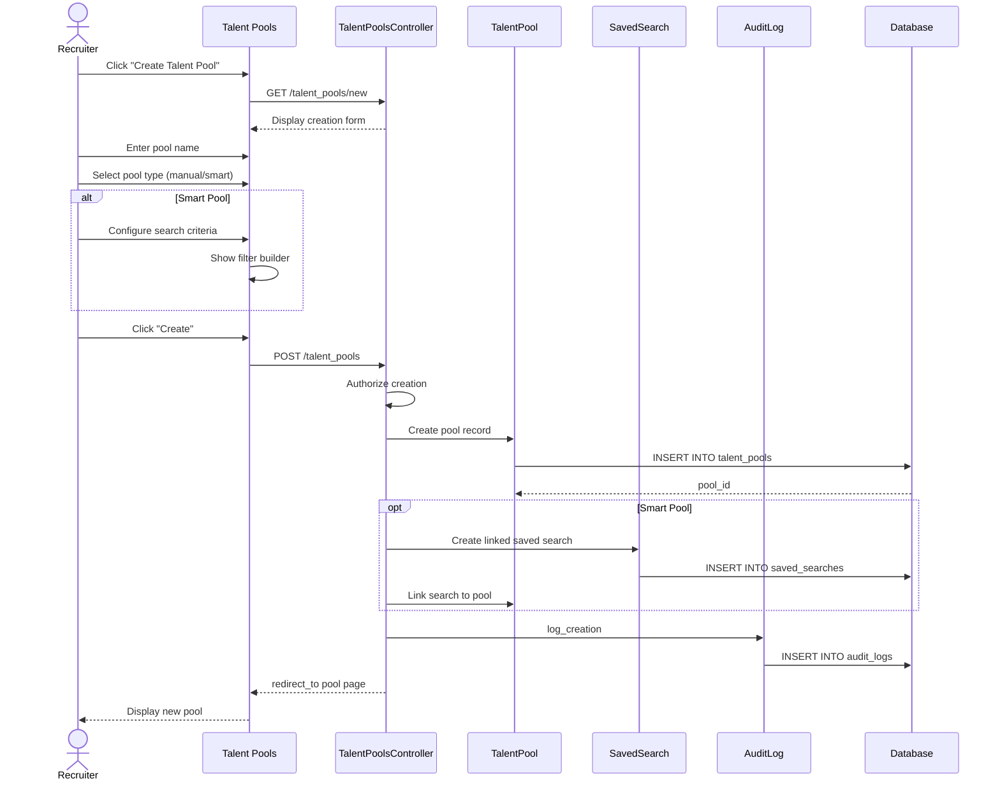

# UC-062: Create Talent Pool

## Metadata

| Attribute | Value |
|-----------|-------|
| **ID** | UC-062 |
| **Name** | Create Talent Pool |
| **Functional Area** | Candidate Management |
| **Primary Actor** | Recruiter (ACT-02) |
| **Priority** | P2 |
| **Complexity** | Low |
| **Status** | Draft |

## Description

A recruiter creates a talent pool to group and organize candidates for future opportunities. Pools can be manual (members added individually) or smart (members determined by saved search criteria that automatically updates). Talent pools help build pipelines for recurring roles or future hiring needs.

## Actors

| Actor | Role in Use Case |
|-------|------------------|
| Recruiter (ACT-02) | Creates and configures the pool |
| System (ACT-10) | Maintains smart pool membership |

## Preconditions

- [ ] User is authenticated and has Recruiter or Admin role
- [ ] User has permission to create talent pools

## Postconditions

### Success
- [ ] TalentPool record created
- [ ] Pool type set (manual or smart)
- [ ] Smart pool: Saved search criteria linked
- [ ] Pool visible in talent pools list
- [ ] Audit log entry created

### Failure
- [ ] No pool created
- [ ] Validation errors displayed to user

## Triggers

- Recruiter clicks "Create Talent Pool" from pools page
- Recruiter saves search results as a new pool
- Recruiter creates pool from candidate list bulk action

## Basic Flow



| Step | Actor | Action | System Response |
|------|-------|--------|-----------------|
| 1 | Recruiter | Clicks "Create Talent Pool" | Creation form displayed |
| 2 | Recruiter | Enters pool name | Name accepted |
| 3 | Recruiter | Adds description (optional) | Description stored |
| 4 | Recruiter | Selects pool type | Manual or smart options shown |
| 5 | Recruiter | Configures criteria (if smart) | Filter builder displayed |
| 6 | Recruiter | Clicks "Create" | Form submitted |
| 7 | System | Validates input | Validation passed |
| 8 | System | Creates pool record | Pool saved |
| 9 | System | Links saved search (if smart) | Search criteria stored |
| 10 | System | Creates audit log | Action recorded |
| 11 | System | Redirects to pool page | Pool details shown |

## Alternative Flows

### AF-1: Create from Search Results

**Trigger:** Recruiter clicks "Save as Pool" from search results

| Step | Actor | Action | System Response |
|------|-------|--------|-----------------|
| 1.1 | Recruiter | Performs candidate search | Results displayed |
| 1.2 | Recruiter | Clicks "Save as Pool" | Pool creation modal |
| 1.3 | System | Pre-populates search criteria | Smart pool configured |
| 1.4 | Recruiter | Enters pool name | Name required |

**Resumption:** Returns to step 6 to complete creation

### AF-2: Create from Bulk Selection

**Trigger:** Recruiter selects candidates and creates pool

| Step | Actor | Action | System Response |
|------|-------|--------|-----------------|
| 1.1 | Recruiter | Selects multiple candidates | Bulk actions enabled |
| 1.2 | Recruiter | Clicks "Create Pool" | Pool creation with pre-selected members |
| 1.3 | System | Creates manual pool | Pool type = manual |
| 1.4 | System | Adds selected candidates | Initial membership set |

**Resumption:** Returns to step 10 to complete

## Exception Flows

### EF-1: Duplicate Pool Name

**Trigger:** Pool name already exists

| Step | Actor | Action | System Response |
|------|-------|--------|-----------------|
| E.1 | System | Validates uniqueness | Duplicate found |
| E.2 | System | Displays error message | "Name already taken" |
| E.3 | Recruiter | Enters different name | - |

**Resolution:** User provides unique name

### EF-2: Invalid Search Criteria

**Trigger:** Smart pool search criteria is invalid

| Step | Actor | Action | System Response |
|------|-------|--------|-----------------|
| E.1 | System | Validates search criteria | Invalid syntax/values |
| E.2 | System | Highlights invalid fields | Error messages shown |
| E.3 | Recruiter | Corrects criteria | - |

**Resolution:** User fixes search criteria

## Business Rules

| ID | Rule | Description |
|----|------|-------------|
| BR-1 | Unique Name | Pool name must be unique within organization |
| BR-2 | Type Immutable | Pool type (manual/smart) cannot change after creation |
| BR-3 | Smart Pool Refresh | Smart pools refresh membership on view (cached) |
| BR-4 | Pool Limit | Organizations limited to 200 pools (configurable) |
| BR-5 | Owner Assignment | Creator becomes pool owner by default |

## Data Requirements

### Input Data

| Field | Type | Required | Validation |
|-------|------|----------|------------|
| name | string | Yes | Max 100 chars, unique in org |
| description | text | No | Max 1000 chars |
| pool_type | enum | Yes | 'manual' or 'smart' |
| search_criteria | json | If smart | Valid search filter JSON |
| shared_with | array | No | Valid user IDs |

### Output Data

| Field | Type | Description |
|-------|------|-------------|
| pool_id | integer | New pool record ID |
| name | string | Pool name |
| pool_type | string | manual or smart |
| member_count | integer | Initial member count (0 or from search) |
| created_at | datetime | Creation timestamp |

## Database Transactions

### Tables Affected

| Table | Operation | Conditions |
|-------|-----------|------------|
| talent_pools | CREATE | New pool record |
| saved_searches | CREATE | If smart pool |
| talent_pool_memberships | CREATE | If creating from selection |
| audit_logs | CREATE | Action logging |

### Transaction Detail

```sql
BEGIN TRANSACTION;

-- Create talent pool
INSERT INTO talent_pools (
    name, description, pool_type, owner_id,
    organization_id, created_at, updated_at
)
VALUES (@name, @description, @pool_type, @user_id, @org_id, NOW(), NOW())
RETURNING id INTO @pool_id;

-- For smart pools, create linked saved search
IF @pool_type = 'smart' THEN
    INSERT INTO saved_searches (
        name, criteria, talent_pool_id,
        user_id, organization_id, created_at
    )
    VALUES (@name, @criteria, @pool_id, @user_id, @org_id, NOW());
END IF;

-- Add initial members if creating from selection
INSERT INTO talent_pool_memberships (talent_pool_id, candidate_id, added_by_id, created_at)
SELECT @pool_id, candidate_id, @user_id, NOW()
FROM unnest(@selected_candidate_ids) AS candidate_id;

-- Create audit log
INSERT INTO audit_logs (action, auditable_type, auditable_id, user_id, metadata, created_at)
VALUES ('pool_created', 'TalentPool', @pool_id, @user_id, '{"type": "..."}', NOW());

COMMIT;
```

### Rollback Scenarios

| Scenario | Rollback Action |
|----------|-----------------|
| Validation failure | No commit, return errors |
| Database error | Full rollback |

## UI/UX Requirements

### Screen/Component

- **Location:** Candidates > Talent Pools > Create
- **Entry Point:** "Create Pool" button or search results action
- **Key Elements:**
  - Pool name input
  - Description textarea
  - Pool type selector (manual/smart toggle)
  - Smart pool filter builder (conditional)
  - Sharing options
  - Create/Cancel buttons

### Wireframe Reference

`/designs/wireframes/UC-062-create-talent-pool.png`

## Non-Functional Requirements

| Requirement | Target |
|-------------|--------|
| Response Time | < 2 seconds |
| Concurrent Creation | Supported |
| Smart Pool Refresh | < 5 seconds |

## Security Considerations

- [x] Authentication required
- [x] Authorization check: recruiter or admin role
- [x] Organization scoping: Pool scoped to organization
- [x] Audit logging: Creation logged

## Related Use Cases

| Use Case | Relationship |
|----------|--------------|
| UC-061 Search Candidates | Can create smart pool from search |
| UC-063 Add to Talent Pool | Adds members after creation |
| UC-050 Add Candidate Manually | Creates candidates for pools |

---

## Data Model References

### Subject Areas

| Subject Area | ID | Relationship |
|--------------|-----|--------------|
| Candidate | SA-04 | Primary |

### Entities CRUD

| Entity | C | R | U | D | Notes |
|--------|---|---|---|---|-------|
| TalentPool | ✓ | | | | Created in this use case |
| SavedSearch | ✓ | | | | For smart pools |
| TalentPoolMembership | ✓ | | | | Initial members if any |
| AuditLog | ✓ | | | | Immutable audit entry |

---

## Process Model References

| Attribute | Value | Link |
|-----------|-------|------|
| **Elementary Business Process** | EP-0212: Create Talent Pool | [PROCESS_MODEL.md](../PROCESS_MODEL.md) |
| **Business Process** | BP-102: Candidate Sourcing | [PROCESS_MODEL.md](../PROCESS_MODEL.md) |
| **Business Function** | BF-01: Talent Acquisition | [PROCESS_MODEL.md](../PROCESS_MODEL.md) |

### EBP Details

| Attribute | Value |
|-----------|-------|
| **Trigger** | User initiates pool creation |
| **Input** | Pool name, type, optional search criteria |
| **Output** | New talent pool record |
| **Business Rules** | BR-1 through BR-5 |

---

## Traceability Matrix

| Artifact Type | ID | Name | Link |
|---------------|-----|------|------|
| **Use Case** | UC-062 | Create Talent Pool | *(this document)* |
| **Elementary Process** | EP-0212 | Create Talent Pool | [PROCESS_MODEL.md](../PROCESS_MODEL.md) |
| **Business Process** | BP-102 | Candidate Sourcing | [PROCESS_MODEL.md](../PROCESS_MODEL.md) |
| **Business Function** | BF-01 | Talent Acquisition | [PROCESS_MODEL.md](../PROCESS_MODEL.md) |
| **Primary Actor** | ACT-02 | Recruiter | [ACTORS.md](../ACTORS.md) |
| **Subject Area (Primary)** | SA-04 | Candidate | [DATA_MODEL.md](../DATA_MODEL.md) |

### Implementation Artifacts

| Artifact Type | Path/Reference | Status |
|---------------|----------------|--------|
| Controller | `app/controllers/admin/talent_pools_controller.rb` | Implemented |
| Model | `app/models/talent_pool.rb` | Implemented |
| Model | `app/models/saved_search.rb` | Implemented |
| Policy | `app/policies/talent_pool_policy.rb` | Implemented |

---

## Open Questions

1. Should smart pools support real-time membership or scheduled refresh?
2. Maximum members per pool?

## Change History

| Version | Date | Author | Changes |
|---------|------|--------|---------|
| 0.1 | 2026-01-25 | System | Initial draft |
