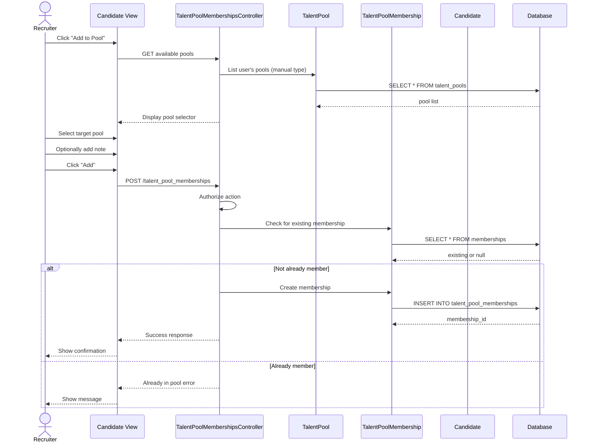

# UC-063: Add to Talent Pool

## Metadata

| Attribute | Value |
|-----------|-------|
| **ID** | UC-063 |
| **Name** | Add to Talent Pool |
| **Functional Area** | Candidate Management |
| **Primary Actor** | Recruiter (ACT-02) |
| **Priority** | P2 |
| **Complexity** | Low |
| **Status** | Draft |

## Description

A recruiter adds one or more candidates to an existing manual talent pool. This helps organize candidates for future opportunities, track silver medalists, or build pipelines for recurring roles. Candidates can be added from search results, candidate profiles, or application views.

## Actors

| Actor | Role in Use Case |
|-------|------------------|
| Recruiter (ACT-02) | Selects candidates and target pool |
| Hiring Manager (ACT-03) | Can add candidates to shared pools |

## Preconditions

- [ ] User is authenticated and has Recruiter or Hiring Manager role
- [ ] Target talent pool exists and is type="manual"
- [ ] User has permission to modify the pool
- [ ] Candidate(s) exist in the organization

## Postconditions

### Success
- [ ] TalentPoolMembership record(s) created
- [ ] Candidate(s) visible in pool member list
- [ ] Added timestamp and user recorded
- [ ] Notification sent (if configured)

### Failure
- [ ] No membership created
- [ ] Error message displayed (e.g., already in pool)

## Triggers

- Recruiter clicks "Add to Pool" from candidate profile
- Recruiter selects candidates and uses bulk "Add to Pool" action
- Recruiter drags candidate into pool in sidebar

## Basic Flow



| Step | Actor | Action | System Response |
|------|-------|--------|-----------------|
| 1 | Recruiter | Clicks "Add to Pool" | Pool selector displayed |
| 2 | System | Loads available pools | Manual pools shown |
| 3 | Recruiter | Selects target pool | Pool selected |
| 4 | Recruiter | Adds note (optional) | Note captured |
| 5 | Recruiter | Clicks "Add" | Request submitted |
| 6 | System | Checks authorization | Permission verified |
| 7 | System | Checks existing membership | Duplicate check |
| 8 | System | Creates membership | If not duplicate |
| 9 | System | Displays confirmation | Success message |

## Alternative Flows

### AF-1: Bulk Add Multiple Candidates

**Trigger:** Recruiter selects multiple candidates

| Step | Actor | Action | System Response |
|------|-------|--------|-----------------|
| 1.1 | Recruiter | Selects multiple candidates | Bulk actions enabled |
| 1.2 | Recruiter | Clicks "Add to Pool" | Pool selector with count |
| 1.3 | System | Adds all selected | Batch insert |
| 1.4 | System | Reports results | X added, Y already in pool |

**Resumption:** Use case complete with batch results

### AF-2: Add from Search Results

**Trigger:** Recruiter adds directly from search

| Step | Actor | Action | System Response |
|------|-------|--------|-----------------|
| 1.1 | Recruiter | Performs search | Results displayed |
| 1.2 | Recruiter | Clicks "Add to Pool" on result | Pool selector shown |

**Resumption:** Returns to step 3

### AF-3: Create and Add

**Trigger:** Desired pool doesn't exist

| Step | Actor | Action | System Response |
|------|-------|--------|-----------------|
| 3.1 | Recruiter | Clicks "Create New Pool" | Inline creation form |
| 3.2 | Recruiter | Enters pool name | New pool created |
| 3.3 | System | Creates pool and adds candidate | Both operations complete |

**Resumption:** Use case complete

## Exception Flows

### EF-1: Candidate Already in Pool

**Trigger:** Candidate is already a member

| Step | Actor | Action | System Response |
|------|-------|--------|-----------------|
| E.1 | System | Detects existing membership | Duplicate found |
| E.2 | System | Displays message | "Already in this pool" |
| E.3 | Recruiter | Selects different pool or cancels | - |

**Resolution:** User selects different pool

### EF-2: Smart Pool Selected

**Trigger:** User tries to add to smart pool

| Step | Actor | Action | System Response |
|------|-------|--------|-----------------|
| E.1 | System | Detects smart pool type | Cannot manually add |
| E.2 | System | Displays explanation | "Smart pools update automatically" |

**Resolution:** User selects manual pool instead

## Business Rules

| ID | Rule | Description |
|----|------|-------------|
| BR-1 | Manual Pools Only | Can only add to manual pools, not smart pools |
| BR-2 | No Duplicates | Candidate can only be in a pool once |
| BR-3 | Organization Scope | Pool and candidate must be in same organization |
| BR-4 | Pool Access | User must own pool or have it shared with them |
| BR-5 | Multi-Pool | Candidate can be in multiple different pools |

## Data Requirements

### Input Data

| Field | Type | Required | Validation |
|-------|------|----------|------------|
| talent_pool_id | integer | Yes | Must exist, type=manual |
| candidate_ids | array | Yes | Valid candidate IDs |
| note | text | No | Max 500 chars |

### Output Data

| Field | Type | Description |
|-------|------|-------------|
| membership_ids | array | Created membership records |
| added_count | integer | Number successfully added |
| skipped_count | integer | Already in pool count |
| errors | array | Any error messages |

## Database Transactions

### Tables Affected

| Table | Operation | Conditions |
|-------|-----------|------------|
| talent_pool_memberships | CREATE | New membership |
| talent_pools | UPDATE | Updated member count cache |

### Transaction Detail

```sql
BEGIN TRANSACTION;

-- Check pool exists and is manual type
SELECT id, pool_type FROM talent_pools
WHERE id = @pool_id AND organization_id = @org_id;

-- Insert membership (ignore if exists)
INSERT INTO talent_pool_memberships (
    talent_pool_id, candidate_id, added_by_id,
    note, created_at, updated_at
)
SELECT @pool_id, candidate_id, @user_id, @note, NOW(), NOW()
FROM unnest(@candidate_ids) AS candidate_id
WHERE NOT EXISTS (
    SELECT 1 FROM talent_pool_memberships
    WHERE talent_pool_id = @pool_id AND candidate_id = candidate_id
);

-- Update pool member count
UPDATE talent_pools
SET member_count = (
    SELECT COUNT(*) FROM talent_pool_memberships WHERE talent_pool_id = @pool_id
),
updated_at = NOW()
WHERE id = @pool_id;

COMMIT;
```

### Rollback Scenarios

| Scenario | Rollback Action |
|----------|-----------------|
| Authorization failure | No changes made |
| Database error | Full rollback |

## UI/UX Requirements

### Screen/Component

- **Location:** Candidate profile action bar, search results
- **Entry Point:** "Add to Pool" button/menu item
- **Key Elements:**
  - Pool dropdown/search selector
  - Quick pool search
  - Note textarea (optional)
  - Add/Cancel buttons
  - Success/error toast notification

### Wireframe Reference

`/designs/wireframes/UC-063-add-to-pool.png`

## Non-Functional Requirements

| Requirement | Target |
|-------------|--------|
| Response Time | < 1 second |
| Bulk Add Limit | 500 candidates per request |

## Security Considerations

- [x] Authentication required
- [x] Authorization check: pool owner or shared access
- [x] Organization scoping: Pool and candidates same org
- [x] Audit logging: Membership additions logged

## Related Use Cases

| Use Case | Relationship |
|----------|--------------|
| UC-062 Create Talent Pool | Creates pools for this action |
| UC-061 Search Candidates | Source for bulk add |
| UC-050 Add Candidate Manually | Creates candidates to add |

---

## Data Model References

### Subject Areas

| Subject Area | ID | Relationship |
|--------------|-----|--------------|
| Candidate | SA-04 | Primary |

### Entities CRUD

| Entity | C | R | U | D | Notes |
|--------|---|---|---|---|-------|
| TalentPoolMembership | ✓ | ✓ | | | Created, checked for dups |
| TalentPool | | ✓ | ✓ | | Read for validation, update count |
| Candidate | | ✓ | | | Validate existence |

---

## Process Model References

| Attribute | Value | Link |
|-----------|-------|------|
| **Elementary Business Process** | EP-0213: Add Candidate to Talent Pool | [PROCESS_MODEL.md](../PROCESS_MODEL.md) |
| **Business Process** | BP-102: Candidate Sourcing | [PROCESS_MODEL.md](../PROCESS_MODEL.md) |
| **Business Function** | BF-01: Talent Acquisition | [PROCESS_MODEL.md](../PROCESS_MODEL.md) |

### EBP Details

| Attribute | Value |
|-----------|-------|
| **Trigger** | User initiates add to pool action |
| **Input** | Candidate ID(s), target pool |
| **Output** | Pool membership record(s) |
| **Business Rules** | BR-1 through BR-5 |

---

## Traceability Matrix

| Artifact Type | ID | Name | Link |
|---------------|-----|------|------|
| **Use Case** | UC-063 | Add to Talent Pool | *(this document)* |
| **Elementary Process** | EP-0213 | Add Candidate to Talent Pool | [PROCESS_MODEL.md](../PROCESS_MODEL.md) |
| **Business Process** | BP-102 | Candidate Sourcing | [PROCESS_MODEL.md](../PROCESS_MODEL.md) |
| **Business Function** | BF-01 | Talent Acquisition | [PROCESS_MODEL.md](../PROCESS_MODEL.md) |
| **Primary Actor** | ACT-02 | Recruiter | [ACTORS.md](../ACTORS.md) |
| **Subject Area (Primary)** | SA-04 | Candidate | [DATA_MODEL.md](../DATA_MODEL.md) |

### Implementation Artifacts

| Artifact Type | Path/Reference | Status |
|---------------|----------------|--------|
| Controller | `app/controllers/admin/talent_pool_memberships_controller.rb` | Implemented |
| Model | `app/models/talent_pool_membership.rb` | Implemented |
| Model | `app/models/talent_pool.rb` | Implemented |

---

## Open Questions

1. Should we support removing from pool in same UI?
2. Pool membership history/timeline?

## Change History

| Version | Date | Author | Changes |
|---------|------|--------|---------|
| 0.1 | 2026-01-25 | System | Initial draft |
