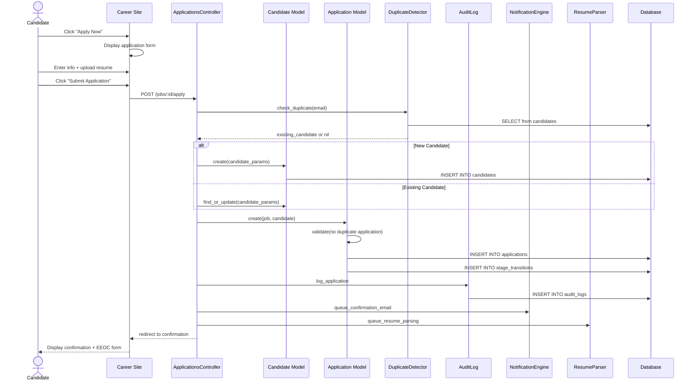

# UC-100: Apply for Job

## Metadata

| Attribute | Value |
|-----------|-------|
| **ID** | UC-100 |
| **Name** | Apply for Job |
| **Functional Area** | Application & Pipeline |
| **Primary Actor** | Candidate (ACT-07) |
| **Priority** | P1 |
| **Complexity** | Medium |
| **Status** | Draft |

## Description

A candidate submits an application for an open job position through the public career site. The system creates candidate and application records, triggers duplicate detection, sends confirmation notifications, and places the candidate in the first pipeline stage.

## Actors

| Actor | Role in Use Case |
|-------|------------------|
| Candidate (ACT-07) | Submits application with resume and information |
| Notification Engine (ACT-13) | Sends confirmation email |
| Scheduler (ACT-11) | Triggers resume parsing job |

## Preconditions

- [ ] Job exists with status = 'open'
- [ ] Job is published on career site (visible = true)
- [ ] Career site is accessible
- [ ] Application deadline not passed (if set)

## Postconditions

### Success
- [ ] Candidate record created (or existing found via duplicate detection)
- [ ] Application record created linking candidate to job
- [ ] Application placed in first stage (typically "Applied")
- [ ] Resume file attached to candidate
- [ ] Confirmation email queued for delivery
- [ ] Resume parsing job queued
- [ ] EEOC collection page shown (if US job)
- [ ] Audit log entry created

### Failure
- [ ] Candidate shown validation errors
- [ ] No application record created
- [ ] No email sent

## Triggers

- Candidate clicks "Apply Now" on job detail page
- Candidate clicks "Apply" from job listing
- Direct link to application form (from job board)

## Basic Flow



| Step | Actor | Action | System Response |
|------|-------|--------|-----------------|
| 1 | Candidate | Clicks "Apply Now" on job page | System displays application form |
| 2 | Candidate | Enters first name | Field captured |
| 3 | Candidate | Enters last name | Field captured |
| 4 | Candidate | Enters email address | Email validated format |
| 5 | Candidate | Enters phone (optional) | Phone captured |
| 6 | Candidate | Uploads resume file | File uploaded to temp storage |
| 7 | Candidate | Answers custom questions (if any) | Responses captured |
| 8 | Candidate | Accepts terms/privacy policy | Consent recorded |
| 9 | Candidate | Clicks "Submit Application" | System processes application |
| 10 | System | Checks for duplicate candidate | Finds or creates candidate |
| 11 | System | Validates no existing application | Checks job+candidate unique |
| 12 | System | Creates application record | Application saved in first stage |
| 13 | System | Records stage transition | StageTransition created |
| 14 | System | Attaches resume to candidate | Resume file associated |
| 15 | System | Records consent | Consent record created |
| 16 | System | Creates audit log | Application logged |
| 17 | System | Queues confirmation email | Email job enqueued |
| 18 | System | Queues resume parsing | Parsing job enqueued |
| 19 | System | Displays confirmation page | Shows success + EEOC form |

## Alternative Flows

### AF-1: Existing Candidate (Duplicate Detected)

**Trigger:** Email matches existing candidate at step 10

| Step | Actor | Action | System Response |
|------|-------|--------|-----------------|
| 10a | System | Finds existing candidate by email | Retrieves candidate record |
| 10b | System | Updates candidate info if newer | Merges contact info |
| 10c | System | Associates new resume | Adds resume to candidate |

**Resumption:** Continues at step 11 of basic flow

### AF-2: Already Applied to This Job

**Trigger:** Candidate+Job combination already exists at step 11

| Step | Actor | Action | System Response |
|------|-------|--------|-----------------|
| 11a | System | Detects existing application | Finds duplicate |
| 11b | System | Displays message | "You've already applied to this position" |
| 11c | System | Shows application status | Displays current stage |
| 11d | System | Offers to update resume | Option to upload new resume |

**Resumption:** Use case ends (no new application)

### AF-3: Apply Without Account (Guest)

**Trigger:** Candidate not logged in (default flow)

| Step | Actor | Action | System Response |
|------|-------|--------|-----------------|
| 1a | System | Shows guest application form | No login required |
| 9a | System | Creates or finds candidate | Based on email |
| 19a | System | Offers account creation | "Create account to track status" |

**Resumption:** Continues normally, account is optional

### AF-4: Apply with Existing Account

**Trigger:** Candidate is logged in to candidate portal

| Step | Actor | Action | System Response |
|------|-------|--------|-----------------|
| 1b | System | Pre-fills form from profile | Contact info populated |
| 1c | System | Shows saved resumes | Can select existing resume |
| 10b | System | Uses authenticated candidate | No duplicate check needed |

**Resumption:** Continues at step 11

### AF-5: LinkedIn Easy Apply

**Trigger:** Application comes via LinkedIn integration

| Step | Actor | Action | System Response |
|------|-------|--------|-----------------|
| 1c | Candidate | Clicks "Easy Apply" on LinkedIn | LinkedIn sends data |
| 2c | System | Receives LinkedIn profile data | Parses LinkedIn payload |
| 3c | System | Pre-fills application | Maps LinkedIn fields |
| 4c | Candidate | Reviews and confirms | May edit details |

**Resumption:** Continues at step 9 of basic flow

## Exception Flows

### EF-1: Invalid Email Format

**Trigger:** Email validation fails at step 4

| Step | Actor | Action | System Response |
|------|-------|--------|-----------------|
| 4.1 | System | Detects invalid email | Highlights field |
| 4.2 | System | Shows error message | "Please enter a valid email" |
| 4.3 | Candidate | Corrects email | Re-enters email |

**Resolution:** Returns to step 4

### EF-2: Resume Upload Failure

**Trigger:** File upload fails at step 6

| Step | Actor | Action | System Response |
|------|-------|--------|-----------------|
| 6.1 | System | Detects upload error | File rejected |
| 6.2 | System | Shows error message | "Upload failed. Please try again." |
| 6.3 | Candidate | Retries upload | Selects file again |

**Resolution:** Returns to step 6

### EF-3: Invalid File Type

**Trigger:** Resume is not PDF, DOC, DOCX, or TXT

| Step | Actor | Action | System Response |
|------|-------|--------|-----------------|
| 6.1 | System | Validates file type | Type not allowed |
| 6.2 | System | Shows error | "Please upload PDF, DOC, DOCX, or TXT" |
| 6.3 | Candidate | Uploads correct format | New file selected |

**Resolution:** Returns to step 6

### EF-4: Job Closed During Application

**Trigger:** Job status changes to closed between form load and submit

| Step | Actor | Action | System Response |
|------|-------|--------|-----------------|
| 9.1 | System | Checks job still open | Job is closed |
| 9.2 | System | Shows message | "This position is no longer accepting applications" |
| 9.3 | System | Suggests similar jobs | Lists related open positions |

**Resolution:** Use case ends, no application created

### EF-5: File Too Large

**Trigger:** Resume exceeds size limit (e.g., 10MB)

| Step | Actor | Action | System Response |
|------|-------|--------|-----------------|
| 6.1 | System | Checks file size | Exceeds limit |
| 6.2 | System | Shows error | "File must be under 10MB" |
| 6.3 | Candidate | Uploads smaller file | New file selected |

**Resolution:** Returns to step 6

## Business Rules

| ID | Rule | Description |
|----|------|-------------|
| BR-100.1 | One Application Per Job | A candidate can only have one active application per job |
| BR-100.2 | Resume Required | Resume is required unless job configured otherwise |
| BR-100.3 | Email Required | Valid email is always required |
| BR-100.4 | File Types | Resume must be PDF, DOC, DOCX, or TXT |
| BR-100.5 | File Size | Resume must be under 10MB |
| BR-100.6 | Open Jobs Only | Applications only accepted for jobs with status='open' |
| BR-100.7 | Consent Required | Candidate must accept privacy policy before submitting |
| BR-100.8 | EEOC Optional | EEOC data collection shown post-apply, voluntary |
| BR-100.9 | Source Attribution | Source = 'direct_apply', source_detail = career site URL |

## Data Requirements

### Input Data

| Field | Type | Required | Validation |
|-------|------|----------|------------|
| first_name | string | Yes | Max 100 chars |
| last_name | string | Yes | Max 100 chars |
| email | string | Yes | Valid email format |
| phone | string | No | E.164 format preferred |
| resume | file | Conditional | PDF/DOC/DOCX/TXT, <10MB |
| linkedin_url | string | No | Valid LinkedIn URL |
| custom_responses | json | Conditional | Per job configuration |
| consent_privacy | boolean | Yes | Must be true |
| consent_marketing | boolean | No | Default false |

### Output Data

| Field | Type | Description |
|-------|------|-------------|
| application_id | integer | Unique application identifier |
| candidate_id | integer | Associated candidate ID |
| confirmation_code | string | Human-readable reference code |
| current_stage | string | Initial stage name (e.g., "Applied") |

## Database Transactions

### Tables Affected

| Table | Operation | Conditions |
|-------|-----------|------------|
| candidates | CREATE or UPDATE | New or existing candidate |
| resumes | CREATE | Always (new resume) |
| applications | CREATE | Always |
| stage_transitions | CREATE | Initial stage entry |
| consents | CREATE | For each consent given |
| custom_field_responses | CREATE | If custom questions exist |
| audit_logs | CREATE | Always |

### Transaction Detail

```sql
-- Apply for Job Transaction
BEGIN TRANSACTION;

-- Step 1: Find or create candidate
INSERT INTO candidates (
    organization_id,
    first_name,
    last_name,
    email,
    phone,
    linkedin_url,
    source,
    source_detail,
    created_at,
    updated_at
) VALUES (
    @organization_id,
    @first_name,
    @last_name,
    @email,
    @phone,
    @linkedin_url,
    'direct_apply',
    @career_site_url,
    NOW(),
    NOW()
)
ON DUPLICATE KEY UPDATE
    first_name = COALESCE(@first_name, first_name),
    last_name = COALESCE(@last_name, last_name),
    phone = COALESCE(@phone, phone),
    linkedin_url = COALESCE(@linkedin_url, linkedin_url),
    updated_at = NOW();

SET @candidate_id = LAST_INSERT_ID();
-- (Or retrieve existing ID if duplicate)

-- Step 2: Create resume record (file stored via Active Storage)
INSERT INTO resumes (
    candidate_id,
    filename,
    content_type,
    created_at,
    updated_at
) VALUES (
    @candidate_id,
    @filename,
    @content_type,
    NOW(),
    NOW()
);

SET @resume_id = LAST_INSERT_ID();

-- Step 3: Get first stage for this job
SELECT js.stage_id INTO @first_stage_id
FROM job_stages js
JOIN stages s ON s.id = js.stage_id
WHERE js.job_id = @job_id
ORDER BY js.position ASC
LIMIT 1;

-- Step 4: Create application
INSERT INTO applications (
    organization_id,
    job_id,
    candidate_id,
    current_stage_id,
    status,
    applied_at,
    created_at,
    updated_at
) VALUES (
    @organization_id,
    @job_id,
    @candidate_id,
    @first_stage_id,
    'active',
    NOW(),
    NOW(),
    NOW()
);

SET @application_id = LAST_INSERT_ID();

-- Step 5: Record initial stage transition
INSERT INTO stage_transitions (
    application_id,
    from_stage_id,
    to_stage_id,
    moved_by_id,
    notes,
    created_at,
    updated_at
) VALUES (
    @application_id,
    NULL,  -- No previous stage
    @first_stage_id,
    NULL,  -- System action
    'Application received',
    NOW(),
    NOW()
);

-- Step 6: Record consents
INSERT INTO consents (
    candidate_id,
    consent_type,
    granted,
    ip_address,
    user_agent,
    granted_at,
    created_at,
    updated_at
) VALUES
    (@candidate_id, 'data_processing', true, @ip_address, @user_agent, NOW(), NOW(), NOW()),
    (@candidate_id, 'marketing', @marketing_consent, @ip_address, @user_agent, NOW(), NOW(), NOW());

-- Step 7: Store custom question responses (if any)
INSERT INTO custom_field_responses (
    application_id,
    custom_field_id,
    value,
    created_at,
    updated_at
)
SELECT
    @application_id,
    cf.id,
    JSON_EXTRACT(@custom_responses, CONCAT('$.', cf.key)),
    NOW(),
    NOW()
FROM custom_fields cf
WHERE cf.job_id = @job_id
  AND JSON_EXTRACT(@custom_responses, CONCAT('$.', cf.key)) IS NOT NULL;

-- Step 8: Create audit log
INSERT INTO audit_logs (
    organization_id,
    user_id,
    action,
    auditable_type,
    auditable_id,
    metadata,
    ip_address,
    user_agent,
    created_at
) VALUES (
    @organization_id,
    NULL,  -- Candidate action, no user
    'application.created',
    'Application',
    @application_id,
    JSON_OBJECT(
        'job_id', @job_id,
        'candidate_id', @candidate_id,
        'source', 'direct_apply',
        'stage_id', @first_stage_id
    ),
    @ip_address,
    @user_agent,
    NOW()
);

COMMIT;

-- Post-commit async jobs (outside transaction)
-- Queue confirmation email
INSERT INTO solid_queue_jobs (queue, class, args, scheduled_at)
VALUES ('mailers', 'ApplicationMailer', JSON_OBJECT('application_id', @application_id, 'type', 'confirmation'), NOW());

-- Queue resume parsing
INSERT INTO solid_queue_jobs (queue, class, args, scheduled_at)
VALUES ('parsers', 'ResumeParserJob', JSON_OBJECT('resume_id', @resume_id), NOW());
```

### Rollback Scenarios

| Scenario | Rollback Action |
|----------|-----------------|
| Validation failure | No transaction started |
| Duplicate application detected | Rollback, show existing application |
| Resume upload fails | Rollback entire transaction |
| Database error | Full rollback, show error |

## UI/UX Requirements

### Screen/Component

- **Location:** /careers/jobs/:id/apply
- **Entry Point:** "Apply Now" button on job detail page
- **Key Elements:**
  - Simple, single-page form
  - Progress indicator (if multi-step)
  - Mobile-responsive design
  - File upload with drag-and-drop
  - Clear privacy policy link
  - Submit button with loading state

### Form Layout (Mobile-First)

```
┌─────────────────────────────────────────────────────────┐
│ [Company Logo]                                          │
│                                                         │
│ Apply for: Senior Software Engineer                     │
│ San Francisco, CA • Full-time                           │
├─────────────────────────────────────────────────────────┤
│                                                         │
│ First Name *                                            │
│ ┌─────────────────────────────────────────────────────┐ │
│ │                                                     │ │
│ └─────────────────────────────────────────────────────┘ │
│                                                         │
│ Last Name *                                             │
│ ┌─────────────────────────────────────────────────────┐ │
│ │                                                     │ │
│ └─────────────────────────────────────────────────────┘ │
│                                                         │
│ Email *                                                 │
│ ┌─────────────────────────────────────────────────────┐ │
│ │                                                     │ │
│ └─────────────────────────────────────────────────────┘ │
│                                                         │
│ Phone                                                   │
│ ┌─────────────────────────────────────────────────────┐ │
│ │                                                     │ │
│ └─────────────────────────────────────────────────────┘ │
│                                                         │
│ Resume *                                                │
│ ┌─────────────────────────────────────────────────────┐ │
│ │  📄 Drag and drop or click to upload               │ │
│ │     PDF, DOC, DOCX, TXT (max 10MB)                 │ │
│ └─────────────────────────────────────────────────────┘ │
│                                                         │
│ LinkedIn Profile (optional)                             │
│ ┌─────────────────────────────────────────────────────┐ │
│ │ https://linkedin.com/in/                           │ │
│ └─────────────────────────────────────────────────────┘ │
│                                                         │
│ [Custom Questions Section - if configured]              │
│                                                         │
│ ☑ I agree to the Privacy Policy *                      │
│ ☐ I'd like to receive updates about future positions   │
│                                                         │
│ ┌─────────────────────────────────────────────────────┐ │
│ │           Submit Application                        │ │
│ └─────────────────────────────────────────────────────┘ │
│                                                         │
└─────────────────────────────────────────────────────────┘
```

### Confirmation Page

```
┌─────────────────────────────────────────────────────────┐
│ [Company Logo]                                          │
│                                                         │
│              ✓ Application Submitted!                   │
│                                                         │
│ Thank you for applying to Senior Software Engineer.     │
│                                                         │
│ Your confirmation code: APP-2026-001234                 │
│                                                         │
│ What happens next?                                      │
│ • We'll review your application                         │
│ • You'll hear from us within 5 business days           │
│ • Check your email for confirmation                     │
│                                                         │
├─────────────────────────────────────────────────────────┤
│ Help Us Improve (Optional & Confidential)               │
│                                                         │
│ The following questions are voluntary and used          │
│ only for equal opportunity compliance reporting.        │
│                                                         │
│ [EEOC Questions - UC-300]                              │
│                                                         │
├─────────────────────────────────────────────────────────┤
│ [Create Account to Track Status]  [View Other Jobs]     │
└─────────────────────────────────────────────────────────┘
```

## Non-Functional Requirements

| Requirement | Target |
|-------------|--------|
| Page Load Time | < 2 seconds |
| Form Submit Time | < 3 seconds |
| File Upload | Support up to 10MB |
| Mobile Support | Full responsive design |
| Accessibility | WCAG 2.1 AA compliant |
| Availability | 99.9% |

## Security Considerations

- [ ] No authentication required (public form)
- [x] CSRF protection on form submission
- [x] Rate limiting: Max 10 applications per IP per hour
- [x] File validation: Type, size, malware scan
- [x] Input sanitization: Prevent XSS in all fields
- [x] Email validation: Prevent spam submissions
- [x] Honeypot field: Detect bot submissions
- [x] Consent recorded with timestamp and IP

## Related Use Cases

| Use Case | Relationship |
|----------|--------------|
| UC-055 Upload Resume | Invoked during application |
| UC-056 Parse Resume | Triggered after submission |
| UC-059 Detect Duplicates | Invoked during submission |
| UC-300 Collect EEOC Data | Shown on confirmation page |
| UC-301 Record Consent | Invoked during submission |
| UC-402 View Job Details | Precedes application |
| UC-405 Check Application Status | Follows for candidate |
| UC-550 Send Email | Confirmation email triggered |

---

## Data Model References

> Cross-references to [DATA_MODEL.md](../DATA_MODEL.md) and [CRUD_MATRIX.md](../CRUD_MATRIX.md)

### Subject Areas

| Subject Area | ID | Relationship |
|--------------|-----|--------------|
| Application Pipeline | SA-05 | Primary |
| Candidate | SA-04 | Primary |
| Job Requisition | SA-03 | Reference |
| Career Site | SA-12 | Reference |
| Compliance & Audit | SA-09 | Secondary |

### Entities CRUD

| Entity | C | R | U | D | Notes |
|--------|---|---|---|---|-------|
| Application | ✓ | | | | Created in step 12 with initial stage |
| Candidate | ✓ | ✓ | ✓ | | Created or updated via duplicate detection |
| Resume | ✓ | | | | Created in step 14, stored via Active Storage |
| StageTransition | ✓ | | | | Created in step 13 for initial stage entry |
| GdprConsent | ✓ | | | | Created in step 15 for privacy/marketing consent |
| CustomFieldResponse | ✓ | | | | Created in step 7 if custom questions exist |
| Job | | ✓ | | | Read to validate job is open |
| JobStage | | ✓ | | | Read to get first stage |
| AuditLog | ✓ | | | | Created in step 16 |

**Legend:** C = Create, R = Read, U = Update, D = Delete

---

## Process Model References

> Cross-references to [PROCESS_MODEL.md](../PROCESS_MODEL.md) and [PROCESS_CRUD_MATRIX.md](../PROCESS_CRUD_MATRIX.md)

| Attribute | Value | Link |
|-----------|-------|------|
| **Elementary Business Process** | EP-0301: Apply for Job | [PROCESS_MODEL.md#ep-0301](../PROCESS_MODEL.md#ep-0301-apply-for-job) |
| **Business Process** | BP-103: Application Processing | [PROCESS_MODEL.md#bp-103](../PROCESS_MODEL.md#bp-103-application-processing) |
| **Business Function** | BF-01: Talent Acquisition | [PROCESS_MODEL.md#bf-01](../PROCESS_MODEL.md#bf-01-talent-acquisition) |

### EBP Details

| Attribute | Value |
|-----------|-------|
| **Trigger** | Candidate submits application form on career site |
| **Input** | Contact info, resume file, custom question responses, consent acknowledgment |
| **Output** | New Application in first stage, Candidate record, confirmation email queued |
| **Business Rules** | BR-100.1 through BR-100.9 (see Business Rules section) |

---

## Traceability Matrix

> Complete artifact mapping for requirements traceability

| Artifact Type | ID | Name | Link |
|---------------|-----|------|------|
| **Use Case** | UC-100 | Apply for Job | *(this document)* |
| **Elementary Process** | EP-0301 | Apply for Job | [PROCESS_MODEL.md](../PROCESS_MODEL.md#ep-0301-apply-for-job) |
| **Business Process** | BP-103 | Application Processing | [PROCESS_MODEL.md](../PROCESS_MODEL.md#bp-103-application-processing) |
| **Business Function** | BF-01 | Talent Acquisition | [PROCESS_MODEL.md](../PROCESS_MODEL.md#bf-01-talent-acquisition) |
| **Primary Actor** | ACT-07 | Candidate | [ACTORS.md](../ACTORS.md#act-07-candidate) |
| **Subject Area (Primary)** | SA-05 | Application Pipeline | [DATA_MODEL.md](../DATA_MODEL.md#sa-05-application-pipeline) |
| **Subject Area (Secondary)** | SA-04 | Candidate | [DATA_MODEL.md](../DATA_MODEL.md#sa-04-candidate) |
| **CRUD Matrix Row** | UC-100 | - | [CRUD_MATRIX.md](../CRUD_MATRIX.md#uc-100) |
| **Process CRUD Row** | EP-0301 | - | [PROCESS_CRUD_MATRIX.md](../PROCESS_CRUD_MATRIX.md#ep-0301) |

### Implementation Artifacts

| Artifact Type | Path/Reference | Status |
|---------------|----------------|--------|
| Controller | `app/controllers/career_site/applications_controller.rb` | Implemented |
| Model | `app/models/application.rb` | Implemented |
| Model | `app/models/candidate.rb` | Implemented |
| Service | `app/services/applications/create_service.rb` | Implemented |
| Service | `app/services/candidates/duplicate_detector_service.rb` | Implemented |
| View | `app/views/career_site/applications/new.html.erb` | Implemented |
| Test | `test/controllers/career_site/applications_controller_test.rb` | Implemented |

---

## Open Questions

1. Should we support "Apply with LinkedIn" OAuth flow?
2. Maximum number of custom questions per job?
3. Should resume be strictly required or configurable per job?
4. Support for portfolio/work sample uploads?

## Change History

| Version | Date | Author | Changes |
|---------|------|--------|---------|
| 0.1 | 2026-01-19 | System | Initial draft |
