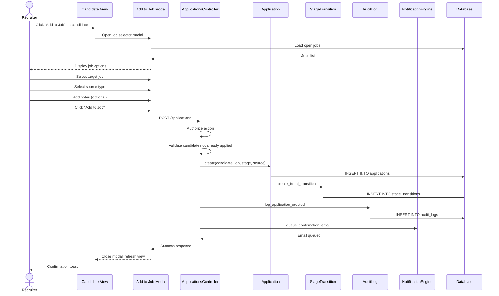

# UC-101: Add Candidate to Job

## Metadata

| Attribute | Value |
|-----------|-------|
| **ID** | UC-101 |
| **Name** | Add Candidate to Job |
| **Functional Area** | Application & Pipeline |
| **Primary Actor** | Recruiter (ACT-02) |
| **Priority** | P1 |
| **Complexity** | Low |
| **Status** | Draft |

## Description

A recruiter manually adds an existing candidate from the talent pool to a specific job, creating a new application. This differs from UC-100 (Apply for Job) where the candidate self-applies. This use case is used when recruiters source candidates proactively, receive referrals, or want to consider a candidate in the talent pool for a new opening.

## Actors

| Actor | Role in Use Case |
|-------|------------------|
| Recruiter (ACT-02) | Selects candidate and job, creates application |
| Hiring Manager (ACT-03) | May add candidates to their jobs |
| Notification Engine (ACT-13) | Sends application confirmation to candidate |

## Preconditions

- [ ] User is authenticated with recruiter or hiring manager role
- [ ] Candidate exists in the system
- [ ] Target job exists and is in 'open' status
- [ ] Candidate has not already applied to this job
- [ ] User has permission to add candidates to this job

## Postconditions

### Success
- [ ] New Application record created with status 'new'
- [ ] Application linked to candidate and job
- [ ] Application placed in initial pipeline stage
- [ ] StageTransition created for initial placement
- [ ] Audit log entry created
- [ ] Notification sent to candidate (if configured)
- [ ] Candidate appears in job pipeline view

### Failure
- [ ] No Application created
- [ ] Error message displayed
- [ ] Candidate state unchanged

## Triggers

- Click "Add to Job" from candidate profile
- Select candidate(s) from search results and choose "Add to Job"
- Click "Add Candidate" from job pipeline view
- Drag candidate from talent pool to job

## Basic Flow



| Step | Actor | Action | System Response |
|------|-------|--------|-----------------|
| 1 | Recruiter | Clicks "Add to Job" on candidate | System opens job selector modal |
| 2 | System | Loads available open jobs | Displays job list with search |
| 3 | Recruiter | Searches/filters for target job | Filtered results shown |
| 4 | Recruiter | Selects target job | Job selected |
| 5 | Recruiter | Selects application source | Source captured (referral, sourced, etc.) |
| 6 | Recruiter | Enters notes (optional) | Notes captured |
| 7 | Recruiter | Clicks "Add to Job" | System processes request |
| 8 | System | Validates candidate eligibility | Check passes |
| 9 | System | Creates Application record | Application in 'new' status |
| 10 | System | Assigns to initial stage | Placed in "Applied" stage |
| 11 | System | Creates StageTransition | Initial transition recorded |
| 12 | System | Creates audit log | Action logged |
| 13 | System | Queues confirmation email | Email job enqueued |
| 14 | System | Returns success | 201 Created |
| 15 | UI | Shows confirmation | "Candidate added to [Job Title]" |

## Alternative Flows

### AF-1: Add from Job Pipeline View

**Trigger:** Recruiter is viewing job pipeline and wants to add candidate

| Step | Actor | Action | System Response |
|------|-------|--------|-----------------|
| 1a | Recruiter | Clicks "+ Add Candidate" on pipeline | Opens candidate search modal |
| 1b | Recruiter | Searches for candidate | Results displayed |
| 1c | Recruiter | Selects candidate | Candidate selected |

**Resumption:** Continues at step 5 of basic flow

### AF-2: Add Multiple Candidates

**Trigger:** Recruiter selects multiple candidates from search results

| Step | Actor | Action | System Response |
|------|-------|--------|-----------------|
| 1a | Recruiter | Selects multiple candidates | Multi-select enabled |
| 1b | Recruiter | Clicks "Add to Job" | Shows job selector |
| 4a | System | Validates all candidates | Checks each candidate |
| 9a | System | Creates multiple applications | Batch insert |

**Resumption:** Continues at step 10 of basic flow for each application

### AF-3: Add with Custom Initial Stage

**Trigger:** Recruiter wants to place candidate in a specific stage (not Applied)

| Step | Actor | Action | System Response |
|------|-------|--------|-----------------|
| 4a | Modal | Shows stage selector | Lists job stages |
| 4b | Recruiter | Selects starting stage | Stage captured |
| 10a | System | Assigns to selected stage | Placed in chosen stage |

**Resumption:** Continues at step 11 of basic flow

### AF-4: Add from Talent Pool

**Trigger:** Recruiter drags candidate from talent pool to job

| Step | Actor | Action | System Response |
|------|-------|--------|-----------------|
| 1a | Recruiter | Drags candidate to job card | Drag detected |
| 1b | System | Opens quick-add dialog | Minimal form shown |
| 1c | Recruiter | Confirms addition | Proceeds with default values |

**Resumption:** Continues at step 8 of basic flow

## Exception Flows

### EF-1: Candidate Already Applied

**Trigger:** Candidate has existing active application for this job

| Step | Actor | Action | System Response |
|------|-------|--------|-----------------|
| 8.1 | System | Checks for existing application | Duplicate found |
| 8.2 | System | Returns error | "Candidate already has an application" |
| 8.3 | Modal | Shows error with link | Link to existing application |

**Resolution:** Recruiter views existing application or cancels

### EF-2: Job Not Accepting Applications

**Trigger:** Job is closed, on hold, or in draft status

| Step | Actor | Action | System Response |
|------|-------|--------|-----------------|
| 8.1 | System | Validates job status | Job not open |
| 8.2 | System | Returns error | "Job is not accepting applications" |
| 8.3 | Modal | Shows job status | Explains current state |

**Resolution:** Recruiter selects different job or opens the job first

### EF-3: Unauthorized User

**Trigger:** User lacks permission to add candidates to this job

| Step | Actor | Action | System Response |
|------|-------|--------|-----------------|
| 7.1 | System | Checks authorization | Permission denied |
| 7.2 | System | Returns 403 error | "You cannot add candidates to this job" |
| 7.3 | Modal | Shows error | Explains permission issue |

**Resolution:** User contacts job owner or admin

### EF-4: Candidate Has Pending Deletion Request

**Trigger:** Candidate has requested GDPR deletion

| Step | Actor | Action | System Response |
|------|-------|--------|-----------------|
| 8.1 | System | Checks candidate status | Deletion pending |
| 8.2 | System | Returns error | "Cannot add - deletion pending" |
| 8.3 | Modal | Shows compliance warning | Explains GDPR status |

**Resolution:** Process deletion request or cancel it first

## Business Rules

| ID | Rule | Description |
|----|------|-------------|
| BR-101.1 | Job Must Be Open | Applications can only be created for jobs with status='open' |
| BR-101.2 | No Duplicates | Candidate cannot have multiple active applications for same job |
| BR-101.3 | Source Required | Application source_type must be specified |
| BR-101.4 | Audit Trail | Every application creation must create audit log entry |
| BR-101.5 | Initial Stage | New applications start in the job's first configured stage |
| BR-101.6 | Permission Check | User must have recruiter role or be job's hiring manager |
| BR-101.7 | GDPR Compliance | Cannot add candidates with pending deletion requests |

## Data Requirements

### Input Data

| Field | Type | Required | Validation |
|-------|------|----------|------------|
| candidate_id | integer | Yes | Must exist, must be in same org |
| job_id | integer | Yes | Must exist, must be open |
| source_type | string | Yes | Valid source type from lookup |
| source_detail | string | No | Max 500 chars |
| notes | text | No | Max 5000 chars |
| initial_stage_id | integer | No | Must be valid for job |

### Output Data

| Field | Type | Description |
|-------|------|-------------|
| application | object | Created application record |
| stage_transition | object | Initial stage transition |
| candidate | object | Candidate details |
| job | object | Job details |

## Database Transactions

### Tables Affected

| Table | Operation | Conditions |
|-------|-----------|------------|
| applications | CREATE | New application record |
| stage_transitions | CREATE | Initial placement record |
| audit_logs | CREATE | Always |

### Transaction Detail

```sql
-- Add Candidate to Job Transaction
BEGIN TRANSACTION;

-- Step 1: Validate job is open
SELECT id, organization_id, status
INTO @job_id, @org_id, @job_status
FROM jobs
WHERE id = @target_job_id
  AND discarded_at IS NULL;

IF @job_status != 'open' THEN
    ROLLBACK;
    SIGNAL SQLSTATE '45000' SET MESSAGE_TEXT = 'Job is not accepting applications';
END IF;

-- Step 2: Validate candidate exists and is in same org
SELECT id, organization_id, merged_into_id
INTO @candidate_id, @cand_org_id, @merged_into
FROM candidates
WHERE id = @target_candidate_id
  AND discarded_at IS NULL;

IF @cand_org_id != @org_id THEN
    ROLLBACK;
    SIGNAL SQLSTATE '45000' SET MESSAGE_TEXT = 'Candidate not found';
END IF;

IF @merged_into IS NOT NULL THEN
    ROLLBACK;
    SIGNAL SQLSTATE '45000' SET MESSAGE_TEXT = 'Candidate has been merged';
END IF;

-- Step 3: Check for existing application
SELECT COUNT(*) INTO @existing_count
FROM applications
WHERE candidate_id = @candidate_id
  AND job_id = @job_id
  AND discarded_at IS NULL;

IF @existing_count > 0 THEN
    ROLLBACK;
    SIGNAL SQLSTATE '45000' SET MESSAGE_TEXT = 'Candidate already applied to this job';
END IF;

-- Step 4: Get initial stage for job
SELECT s.id INTO @initial_stage_id
FROM job_stages js
JOIN stages s ON s.id = js.stage_id
WHERE js.job_id = @job_id
ORDER BY js.position ASC
LIMIT 1;

-- Step 5: Create application
INSERT INTO applications (
    organization_id,
    job_id,
    candidate_id,
    current_stage_id,
    status,
    source_type,
    source_detail,
    applied_at,
    last_activity_at,
    created_at,
    updated_at
) VALUES (
    @org_id,
    @job_id,
    @candidate_id,
    COALESCE(@custom_stage_id, @initial_stage_id),
    'new',
    @source_type,
    @source_detail,
    NOW(),
    NOW(),
    NOW(),
    NOW()
);

SET @application_id = LAST_INSERT_ID();

-- Step 6: Create initial stage transition
INSERT INTO stage_transitions (
    application_id,
    from_stage_id,
    to_stage_id,
    moved_by_id,
    notes,
    created_at,
    updated_at
) VALUES (
    @application_id,
    NULL,
    COALESCE(@custom_stage_id, @initial_stage_id),
    @current_user_id,
    @notes,
    NOW(),
    NOW()
);

-- Step 7: Create audit log
INSERT INTO audit_logs (
    organization_id,
    user_id,
    action,
    auditable_type,
    auditable_id,
    metadata,
    ip_address,
    user_agent,
    created_at
) VALUES (
    @org_id,
    @current_user_id,
    'application.created',
    'Application',
    @application_id,
    JSON_OBJECT(
        'job_id', @job_id,
        'candidate_id', @candidate_id,
        'source_type', @source_type,
        'added_by_recruiter', true
    ),
    @ip_address,
    @user_agent,
    NOW()
);

COMMIT;

-- Post-commit: Queue notification
INSERT INTO solid_queue_jobs (queue, class, args, scheduled_at)
VALUES ('mailers', 'CandidateMailer',
    JSON_OBJECT(
        'application_id', @application_id,
        'type', 'application_created'
    ),
    NOW()
);
```

### Rollback Scenarios

| Scenario | Rollback Action |
|----------|-----------------|
| Job not open | Full rollback, return 422 |
| Candidate not found | Full rollback, return 404 |
| Already applied | Full rollback, return 422 |
| Authorization failure | No transaction, return 403 |

## UI/UX Requirements

### Screen/Component

- **Location:** Candidate profile, search results, talent pool, pipeline view
- **Entry Point:** "Add to Job" button/action
- **Key Elements:**
  - Job search/filter
  - Source type selector
  - Optional notes field
  - Stage selector (advanced)
  - Confirm button

### Add to Job Modal

```
+-------------------------------------------------------------+
| Add Candidate to Job                                    [X] |
+-------------------------------------------------------------+
|                                                             |
| Candidate: Jane Doe (jane.doe@email.com)                    |
|                                                             |
| Select Job *                                                |
| +-----------------------------------------------------------+
| | [Search jobs...]                                        v |
| +-----------------------------------------------------------+
|                                                             |
|   +-------------------------------------------------------+ |
|   | [x] Software Engineer - San Francisco                 | |
|   |     Engineering | 3 openings | Posted 5 days ago      | |
|   +-------------------------------------------------------+ |
|   | [ ] Product Manager - Remote                          | |
|   |     Product | 1 opening | Posted 2 days ago           | |
|   +-------------------------------------------------------+ |
|   | [ ] UX Designer - New York                            | |
|   |     Design | 2 openings | Posted 1 week ago           | |
|   +-------------------------------------------------------+ |
|                                                             |
| Application Source *                                        |
| +-----------------------------------------------------------+
| | Sourced by Recruiter                                  v | |
| +-----------------------------------------------------------+
|                                                             |
| Source Details                                              |
| +-----------------------------------------------------------+
| | Found on LinkedIn, strong background in...              | |
| +-----------------------------------------------------------+
|                                                             |
| [v] Advanced Options                                        |
|     Starting Stage: [Applied               v]               |
|                                                             |
+-------------------------------------------------------------+
|                                                             |
|   [Cancel]                              [Add to Job]        |
|                                                             |
+-------------------------------------------------------------+
```

### Confirmation Toast

```
+----------------------------------------+
| [check] Jane Doe added to Software Engineer  |
|         [View Application]                   |
+----------------------------------------+
```

## Non-Functional Requirements

| Requirement | Target |
|-------------|--------|
| Response Time | < 1 second for application creation |
| Modal Load | < 500ms with job list |
| Search | Typeahead with < 300ms latency |
| Batch Add | Up to 50 candidates in single operation |

## Security Considerations

- [x] Authentication required
- [x] Authorization: Recruiter role or job's hiring manager
- [x] Organization scoping: Candidate and job must be in user's org
- [x] Audit logging: Full trail of who added whom to which job
- [x] GDPR compliance: Check for pending deletion requests

## Related Use Cases

| Use Case | Relationship |
|----------|--------------|
| UC-100 Apply for Job | Alternative (candidate self-applies) |
| UC-102 View Pipeline | Where new application appears |
| UC-103 Move Stage | Next action after adding |
| UC-050 Add Candidate Manually | May precede (create candidate first) |
| UC-061 Search Candidates | May trigger this use case |
| UC-063 Add to Talent Pool | Alternative action |

---

## Data Model References

> Cross-references to [DATA_MODEL.md](../DATA_MODEL.md) and [CRUD_MATRIX.md](../CRUD_MATRIX.md)

### Subject Areas

| Subject Area | ID | Relationship |
|--------------|-----|--------------|
| Application Pipeline | SA-05 | Primary |
| Candidate | SA-04 | Secondary |
| Job Requisition | SA-03 | Secondary |
| Compliance & Audit | SA-09 | Secondary |

### Entities CRUD

| Entity | C | R | U | D | Notes |
|--------|---|---|---|---|-------|
| Application | X | | | | Created in step 9 |
| StageTransition | X | | | | Created in step 11 for initial placement |
| Candidate | | X | | | Read to validate existence |
| Job | | X | | | Read to validate status and get stages |
| Stage | | X | | | Read to determine initial stage |
| AuditLog | X | | | | Created in step 12 |

**Legend:** C = Create, R = Read, U = Update, D = Delete

---

## Process Model References

> Cross-references to [PROCESS_MODEL.md](../PROCESS_MODEL.md) and [PROCESS_CRUD_MATRIX.md](../PROCESS_CRUD_MATRIX.md)

| Attribute | Value | Link |
|-----------|-------|------|
| **Elementary Business Process** | EP-0302: Add to Job | [PROCESS_MODEL.md#ep-0302](../PROCESS_MODEL.md#ep-0302-add-to-job) |
| **Business Process** | BP-103: Application Processing | [PROCESS_MODEL.md#bp-103](../PROCESS_MODEL.md#bp-103-application-processing) |
| **Business Function** | BF-01: Talent Acquisition | [PROCESS_MODEL.md#bf-01](../PROCESS_MODEL.md#bf-01-talent-acquisition) |

### EBP Details

| Attribute | Value |
|-----------|-------|
| **Trigger** | Recruiter clicks "Add to Job" from candidate profile or search results |
| **Input** | Candidate ID, Job ID, source type, optional notes |
| **Output** | New Application record, StageTransition, audit log entry |
| **Business Rules** | BR-101.1 through BR-101.7 (see Business Rules section) |

---

## Traceability Matrix

> Complete artifact mapping for requirements traceability

| Artifact Type | ID | Name | Link |
|---------------|-----|------|------|
| **Use Case** | UC-101 | Add Candidate to Job | *(this document)* |
| **Elementary Process** | EP-0302 | Add to Job | [PROCESS_MODEL.md](../PROCESS_MODEL.md#ep-0302-add-to-job) |
| **Business Process** | BP-103 | Application Processing | [PROCESS_MODEL.md](../PROCESS_MODEL.md#bp-103-application-processing) |
| **Business Function** | BF-01 | Talent Acquisition | [PROCESS_MODEL.md](../PROCESS_MODEL.md#bf-01-talent-acquisition) |
| **Primary Actor** | ACT-02 | Recruiter | [ACTORS.md](../ACTORS.md#act-02-recruiter) |
| **Subject Area (Primary)** | SA-05 | Application Pipeline | [DATA_MODEL.md](../DATA_MODEL.md#sa-05-application-pipeline) |
| **Subject Area (Secondary)** | SA-04 | Candidate | [DATA_MODEL.md](../DATA_MODEL.md#sa-04-candidate) |
| **CRUD Matrix Row** | UC-101 | - | [CRUD_MATRIX.md](../CRUD_MATRIX.md#uc-101) |
| **Process CRUD Row** | EP-0302 | - | [PROCESS_CRUD_MATRIX.md](../PROCESS_CRUD_MATRIX.md#ep-0302) |

### Implementation Artifacts

| Artifact Type | Path/Reference | Status |
|---------------|----------------|--------|
| Controller | `app/controllers/admin/applications_controller.rb` | Implemented |
| Model | `app/models/application.rb` | Implemented |
| Model | `app/models/candidate.rb` | Implemented |
| Service | `app/services/applications/create_service.rb` | Planned |
| Policy | `app/policies/application_policy.rb` | Implemented |
| View | `app/views/admin/candidates/_add_to_job_modal.html.erb` | Planned |
| Test | `test/controllers/admin/applications_controller_test.rb` | Implemented |

---

## Open Questions

1. Should we support adding a candidate to multiple jobs at once?
2. Notify hiring manager when candidate is added to their job?
3. Allow pre-filling application questions when adding via recruiter?

## Change History

| Version | Date | Author | Changes |
|---------|------|--------|---------|
| 0.1 | 2026-01-25 | System | Initial draft |
