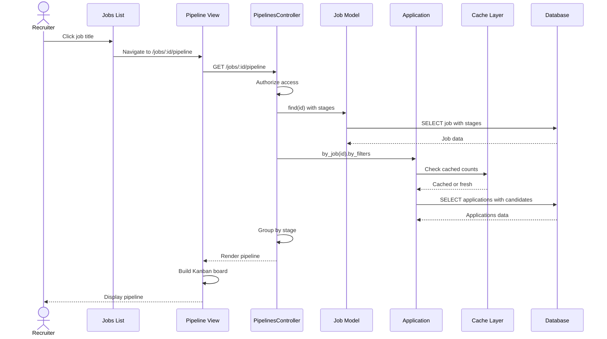

# UC-102: View Pipeline

## Metadata

| Attribute | Value |
|-----------|-------|
| **ID** | UC-102 |
| **Name** | View Pipeline |
| **Functional Area** | Application & Pipeline |
| **Primary Actor** | Recruiter (ACT-02) |
| **Priority** | P1 |
| **Complexity** | Medium |
| **Status** | Draft |

## Description

A recruiter or hiring manager views the Kanban-style pipeline board for a specific job, showing all candidates organized by their current stage. This is the primary interface for managing the hiring process, enabling quick visual assessment of pipeline health, candidate distribution, and facilitating drag-and-drop stage transitions.

## Actors

| Actor | Role in Use Case |
|-------|------------------|
| Recruiter (ACT-02) | Views and interacts with full pipeline |
| Hiring Manager (ACT-03) | Views pipeline for their jobs |
| Interviewer (ACT-04) | May have limited view access |

## Preconditions

- [ ] User is authenticated with appropriate role
- [ ] User has permission to view the job
- [ ] Job exists and is not deleted

## Postconditions

### Success
- [ ] Pipeline board rendered with all stages
- [ ] Candidates displayed in appropriate stage columns
- [ ] Filtering and sorting applied as requested
- [ ] Real-time updates enabled for concurrent users
- [ ] Performance within acceptable limits

### Failure
- [ ] Error message displayed
- [ ] Fallback to list view if Kanban fails
- [ ] Partial data displayed with retry option

## Triggers

- Click on job from jobs list
- Navigate to pipeline URL directly
- Deep link from notification email
- Return from candidate detail view

## Basic Flow



| Step | Actor | Action | System Response |
|------|-------|--------|-----------------|
| 1 | Recruiter | Clicks on job from jobs list | System navigates to pipeline |
| 2 | System | Validates user authorization | Access granted |
| 3 | System | Loads job with configured stages | Job and stages loaded |
| 4 | System | Loads applications for job | All active applications retrieved |
| 5 | System | Loads candidate data | Candidate details included |
| 6 | System | Groups applications by stage | Data organized for display |
| 7 | System | Calculates stage counts | Numbers per column computed |
| 8 | System | Renders Kanban board | HTML/Turbo response generated |
| 9 | UI | Displays stage columns | Columns with headers shown |
| 10 | UI | Displays candidate cards | Cards in appropriate columns |
| 11 | UI | Enables drag-and-drop | Interaction handlers attached |
| 12 | System | Subscribes to real-time updates | ActionCable connection established |

## Alternative Flows

### AF-1: View with Filters Applied

**Trigger:** User applies one or more filters

| Step | Actor | Action | System Response |
|------|-------|--------|-----------------|
| 10a | Recruiter | Selects filter (source, rating, date) | Filter captured |
| 10b | System | Applies filter to query | Filtered results |
| 10c | System | Updates board | Only matching candidates shown |
| 10d | System | Updates URL | Filters reflected in URL params |

**Resumption:** Display continues with filtered data

### AF-2: View with Search

**Trigger:** User searches for specific candidate

| Step | Actor | Action | System Response |
|------|-------|--------|-----------------|
| 10a | Recruiter | Types in search box | Search term captured |
| 10b | System | Searches candidate names/emails | Matching candidates found |
| 10c | System | Highlights matching cards | Non-matches dimmed/hidden |

**Resumption:** User can click to view candidate

### AF-3: Switch to List View

**Trigger:** User prefers tabular display

| Step | Actor | Action | System Response |
|------|-------|--------|-----------------|
| 9a | Recruiter | Clicks "List View" toggle | View preference captured |
| 9b | System | Renders table view | Sortable columns displayed |
| 9c | System | Persists preference | Remembered for next visit |

**Resumption:** User can switch back to Kanban

### AF-4: View Rejected/Withdrawn

**Trigger:** User wants to see closed applications

| Step | Actor | Action | System Response |
|------|-------|--------|-----------------|
| 4a | Recruiter | Clicks "Show Rejected" toggle | Include terminal shown |
| 4b | System | Loads rejected applications | Terminal apps included |
| 4c | System | Shows in separate section | Rejected column or accordion |

**Resumption:** Continues with extended data set

### AF-5: Real-time Update Received

**Trigger:** Another user modifies an application

| Step | Actor | Action | System Response |
|------|-------|--------|-----------------|
| R.1 | System | Receives ActionCable broadcast | Update data received |
| R.2 | UI | Animates card movement | Smooth visual transition |
| R.3 | UI | Updates stage counts | Numbers refreshed |
| R.4 | UI | Shows activity indicator | "Jane moved Bob to Interview" |

**Resumption:** User continues interaction

## Exception Flows

### EF-1: Job Not Found

**Trigger:** Job ID doesn't exist or was deleted

| Step | Actor | Action | System Response |
|------|-------|--------|-----------------|
| 3.1 | System | Cannot find job | 404 raised |
| 3.2 | System | Renders not found page | Error message displayed |
| 3.3 | UI | Shows navigation back | Link to jobs list |

**Resolution:** User returns to jobs list

### EF-2: Access Denied

**Trigger:** User lacks permission for this job

| Step | Actor | Action | System Response |
|------|-------|--------|-----------------|
| 2.1 | System | Authorization check fails | 403 raised |
| 2.2 | System | Renders access denied | Explains permission issue |

**Resolution:** User contacts admin or job owner

### EF-3: Too Many Candidates

**Trigger:** Pipeline has 500+ candidates (performance concern)

| Step | Actor | Action | System Response |
|------|-------|--------|-----------------|
| 4.1 | System | Detects large dataset | Count exceeds threshold |
| 4.2 | System | Loads paginated data | First 100 per stage |
| 4.3 | UI | Shows "Load More" button | Pagination enabled |
| 4.4 | UI | Shows performance warning | "Large pipeline - filters recommended" |

**Resolution:** User applies filters or scrolls to load more

### EF-4: Real-time Connection Failed

**Trigger:** WebSocket connection cannot be established

| Step | Actor | Action | System Response |
|------|-------|--------|-----------------|
| 12.1 | System | ActionCable connection fails | Error logged |
| 12.2 | UI | Shows offline indicator | Manual refresh available |
| 12.3 | System | Falls back to polling | 30-second refresh cycle |

**Resolution:** Full functionality restored when connection recovers

## Business Rules

| ID | Rule | Description |
|----|------|-------------|
| BR-102.1 | Org Scoping | Only show applications from user's organization |
| BR-102.2 | Role Access | Recruiters see all jobs, HM only their assigned jobs |
| BR-102.3 | Active Default | By default, show only active applications |
| BR-102.4 | Stage Order | Columns ordered by JobStage.position |
| BR-102.5 | Card Order | Cards ordered by last_activity_at DESC within stage |
| BR-102.6 | Count Accuracy | Stage counts must match visible cards |
| BR-102.7 | Real-time Sync | Changes by other users reflected within 2 seconds |

## Data Requirements

### Input Data

| Field | Type | Required | Validation |
|-------|------|----------|------------|
| job_id | integer | Yes | Must exist, user must have access |
| filter[source] | string | No | Valid source type |
| filter[rating] | integer | No | 1-5 range |
| filter[stage_id] | integer | No | Valid stage for job |
| filter[applied_after] | date | No | Valid date |
| filter[applied_before] | date | No | Valid date |
| search | string | No | Max 100 chars |
| view | string | No | 'kanban' or 'list' |
| include_rejected | boolean | No | Default false |

### Output Data

| Field | Type | Description |
|-------|------|-------------|
| job | object | Job details with title, status |
| stages | array | Ordered list of configured stages |
| applications | grouped object | Applications grouped by stage_id |
| counts | object | Count per stage |
| filters_applied | object | Current active filters |

## Database Transactions

### Tables Affected

| Table | Operation | Conditions |
|-------|-----------|------------|
| jobs | READ | Fetch job with validation |
| job_stages | READ | Get configured stages ordered |
| stages | READ | Get stage details |
| applications | READ | Fetch by job with filters |
| candidates | READ | Join for display data |

### Query Detail

```sql
-- Main pipeline query with filters
SELECT
    a.id,
    a.current_stage_id,
    a.status,
    a.source_type,
    a.rating,
    a.starred,
    a.applied_at,
    a.last_activity_at,
    c.id AS candidate_id,
    c.first_name,
    c.last_name,
    c.email,
    c.location,
    s.name AS stage_name,
    s.color AS stage_color
FROM applications a
JOIN candidates c ON c.id = a.candidate_id
JOIN stages s ON s.id = a.current_stage_id
WHERE a.job_id = @job_id
  AND a.organization_id = @organization_id
  AND a.discarded_at IS NULL
  AND c.discarded_at IS NULL
  -- Filters applied dynamically
  AND (@source_filter IS NULL OR a.source_type = @source_filter)
  AND (@rating_filter IS NULL OR a.rating = @rating_filter)
  AND (@stage_filter IS NULL OR a.current_stage_id = @stage_filter)
  AND (@applied_after IS NULL OR a.applied_at >= @applied_after)
  AND (@applied_before IS NULL OR a.applied_at <= @applied_before)
  AND (@include_rejected = true OR a.status NOT IN ('rejected', 'withdrawn'))
  -- Search filter
  AND (@search IS NULL OR (
      c.first_name LIKE CONCAT('%', @search, '%')
      OR c.last_name LIKE CONCAT('%', @search, '%')
      OR c.email LIKE CONCAT('%', @search, '%')
  ))
ORDER BY a.current_stage_id, a.last_activity_at DESC;

-- Stage counts query
SELECT
    current_stage_id,
    COUNT(*) as count
FROM applications
WHERE job_id = @job_id
  AND organization_id = @organization_id
  AND discarded_at IS NULL
  AND status NOT IN ('rejected', 'withdrawn')
GROUP BY current_stage_id;
```

## UI/UX Requirements

### Screen/Component

- **Location:** /jobs/:id/pipeline
- **Entry Point:** Jobs list, navigation, notifications
- **Key Elements:**
  - Job header with title and status
  - Stage columns with counts
  - Candidate cards (draggable)
  - Filter/search toolbar
  - View toggle (Kanban/List)
  - Add Candidate button

### Pipeline Kanban Board

```
+-----------------------------------------------------------------------------+
| Software Engineer - San Francisco                    [+ Add Candidate]      |
| Engineering | Open | 3 openings | Posted 2 weeks ago                        |
+-----------------------------------------------------------------------------+
| [Search candidates...]  [Source: All v] [Rating: v] [Date: v] [More v]      |
|                                                [Kanban] [List]  [Rejected]  |
+-----------------------------------------------------------------------------+
|                                                                             |
|  Applied (12)     Screen (8)      Interview (5)     Offer (2)    Hired (1) |
| +-----------+   +-----------+   +-----------+   +-----------+  +---------+ |
| |           |   |           |   |           |   |           |  |         | |
| | +-------+ |   | +-------+ |   | +-------+ |   | +-------+ |  | +-----+ | |
| | |Jane D.| |   | |John S.| |   | |Sarah L| |   | |Mike C.| |  | |Alex | | |
| | |*****  | |   | |****   | |   | |*****  | |   | |****   |  | | |  H  | | |
| | |SF     | |   | |NYC    | |   | |Remote | |   | |LA     | |  | |ired | | |
| | |2d ago | |   | |5d ago | |   | |1w ago | |   | |3d ago | |  | +-----+ | |
| | +-------+ |   | +-------+ |   | +-------+ |   | +-------+ |  |         | |
| |           |   |           |   |           |   |           |  |         | |
| | +-------+ |   | +-------+ |   | +-------+ |   | +-------+ |  |         | |
| | |Bob W. | |   | |Amy K. | |   | |Kim P. | |   | |Tom R. | |  |         | |
| | |****   | |   | |***    | |   | |****   | |   | |*****  | |  |         | |
| | |Chicago| |   | |Boston | |   | |Denver | |   | |Austin | |  |         | |
| | |3d ago | |   | |1w ago | |   | |2w ago | |   | |1d ago | |  |         | |
| | +-------+ |   | +-------+ |   | +-------+ |   | +-------+ |  |         | |
| |           |   |           |   |           |   |           |  |         | |
| | +-------+ |   | +-------+ |   | +-------+ |   |           |  |         | |
| | |  ...  | |   | |  ...  | |   | |  ...  | |   |           |  |         | |
| | +-------+ |   | +-------+ |   | +-------+ |   |           |  |         | |
| |           |   |           |   |           |   |           |  |         | |
| | [+8 more] |   | [+5 more] |   | [+2 more] |   |           |  |         | |
| +-----------+   +-----------+   +-----------+   +-----------+  +---------+ |
|                                                                             |
+-----------------------------------------------------------------------------+
```

### Candidate Card Detail

```
+-------------------+
| Jane Doe      [*] |  <- Star toggle
| *****             |  <- Rating (5 stars)
| San Francisco     |  <- Location
| LinkedIn          |  <- Source icon
| 2 days ago        |  <- Applied date
|                   |
| [...]             |  <- Actions menu
+-------------------+

Actions Menu:
+------------------+
| View Profile     |
| Move to Stage >  |
| Schedule Interview|
| Add Note         |
| Star             |
| Reject           |
+------------------+
```

## Non-Functional Requirements

| Requirement | Target |
|-------------|--------|
| Initial Load | < 2 seconds for up to 100 candidates |
| Scroll Performance | 60 FPS smooth scrolling |
| Drag-and-Drop | < 100ms response on drop |
| Real-time Update | < 2 seconds for other user changes |
| Concurrent Users | 50 users viewing same pipeline |

## Security Considerations

- [x] Authentication required
- [x] Authorization: Check job access per user role
- [x] Organization scoping: All queries filtered by org
- [x] No sensitive data exposed (masked emails if configured)
- [x] Audit logging for access (optional, configurable)

## Related Use Cases

| Use Case | Relationship |
|----------|--------------|
| UC-101 Add Candidate to Job | Initiated from pipeline view |
| UC-103 Move Stage | Executed via drag-and-drop |
| UC-104 Bulk Move Stage | Multi-select from pipeline |
| UC-105 Reject Candidate | Action from candidate card |
| UC-109 View Application History | Drill-down from card |
| UC-010 Configure Job Stages | Defines pipeline structure |

---

## Data Model References

> Cross-references to [DATA_MODEL.md](../DATA_MODEL.md) and [CRUD_MATRIX.md](../CRUD_MATRIX.md)

### Subject Areas

| Subject Area | ID | Relationship |
|--------------|-----|--------------|
| Application Pipeline | SA-05 | Primary |
| Job Requisition | SA-03 | Secondary |
| Candidate | SA-04 | Secondary |

### Entities CRUD

| Entity | C | R | U | D | Notes |
|--------|---|---|---|---|-------|
| Job | | X | | | Read for header info and access check |
| JobStage | | X | | | Read for column configuration |
| Stage | | X | | | Read for stage details |
| Application | | X | | | Read with filters, grouped by stage |
| Candidate | | X | | | Read for card display data |

**Legend:** C = Create, R = Read, U = Update, D = Delete

---

## Process Model References

> Cross-references to [PROCESS_MODEL.md](../PROCESS_MODEL.md) and [PROCESS_CRUD_MATRIX.md](../PROCESS_CRUD_MATRIX.md)

| Attribute | Value | Link |
|-----------|-------|------|
| **Elementary Business Process** | EP-0303: View Pipeline | [PROCESS_MODEL.md#ep-0303](../PROCESS_MODEL.md#ep-0303-view-pipeline) |
| **Business Process** | BP-103: Application Processing | [PROCESS_MODEL.md#bp-103](../PROCESS_MODEL.md#bp-103-application-processing) |
| **Business Function** | BF-01: Talent Acquisition | [PROCESS_MODEL.md#bf-01](../PROCESS_MODEL.md#bf-01-talent-acquisition) |

### EBP Details

| Attribute | Value |
|-----------|-------|
| **Trigger** | User navigates to job pipeline from jobs list or direct URL |
| **Input** | Job ID, optional filter parameters |
| **Output** | Rendered Kanban board with applications grouped by stage |
| **Business Rules** | BR-102.1 through BR-102.7 (see Business Rules section) |

---

## Traceability Matrix

> Complete artifact mapping for requirements traceability

| Artifact Type | ID | Name | Link |
|---------------|-----|------|------|
| **Use Case** | UC-102 | View Pipeline | *(this document)* |
| **Elementary Process** | EP-0303 | View Pipeline | [PROCESS_MODEL.md](../PROCESS_MODEL.md#ep-0303-view-pipeline) |
| **Business Process** | BP-103 | Application Processing | [PROCESS_MODEL.md](../PROCESS_MODEL.md#bp-103-application-processing) |
| **Business Function** | BF-01 | Talent Acquisition | [PROCESS_MODEL.md](../PROCESS_MODEL.md#bf-01-talent-acquisition) |
| **Primary Actor** | ACT-02 | Recruiter | [ACTORS.md](../ACTORS.md#act-02-recruiter) |
| **Subject Area (Primary)** | SA-05 | Application Pipeline | [DATA_MODEL.md](../DATA_MODEL.md#sa-05-application-pipeline) |
| **Subject Area (Secondary)** | SA-03 | Job Requisition | [DATA_MODEL.md](../DATA_MODEL.md#sa-03-job-requisition) |
| **CRUD Matrix Row** | UC-102 | - | [CRUD_MATRIX.md](../CRUD_MATRIX.md#uc-102) |
| **Process CRUD Row** | EP-0303 | - | [PROCESS_CRUD_MATRIX.md](../PROCESS_CRUD_MATRIX.md#ep-0303) |

### Implementation Artifacts

| Artifact Type | Path/Reference | Status |
|---------------|----------------|--------|
| Controller | `app/controllers/admin/pipelines_controller.rb` | Implemented |
| Model | `app/models/application.rb` | Implemented |
| Model | `app/models/job_stage.rb` | Implemented |
| View | `app/views/admin/pipelines/show.html.erb` | Implemented |
| Stimulus | `app/javascript/controllers/pipeline_controller.js` | Implemented |
| Channel | `app/channels/pipeline_channel.rb` | Implemented |
| Test | `test/controllers/admin/pipelines_controller_test.rb` | Implemented |

---

## Open Questions

1. Should we support custom card fields (configurable per org)?
2. Implement virtual scrolling for very large pipelines (1000+ candidates)?
3. Add keyboard navigation support for accessibility?
4. Support for collapsible stage columns?

## Change History

| Version | Date | Author | Changes |
|---------|------|--------|---------|
| 0.1 | 2026-01-25 | System | Initial draft |
