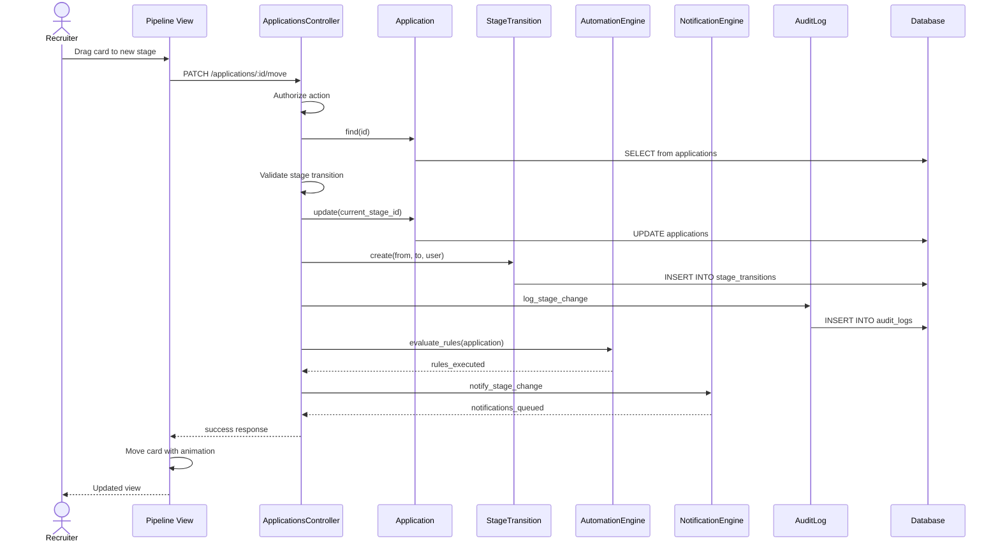

# UC-103: Move Stage

## Metadata

| Attribute | Value |
|-----------|-------|
| **ID** | UC-103 |
| **Name** | Move Stage |
| **Functional Area** | Application & Pipeline |
| **Primary Actor** | Recruiter (ACT-02) |
| **Priority** | P1 |
| **Complexity** | Low |
| **Status** | Draft |

## Description

A recruiter or hiring manager moves a candidate's application from one pipeline stage to another. This is the core action for progressing candidates through the hiring process. The system records the transition for audit purposes and may trigger notifications or automation rules.

## Actors

| Actor | Role in Use Case |
|-------|------------------|
| Recruiter (ACT-02) | Moves candidates through pipeline stages |
| Hiring Manager (ACT-03) | May move candidates within their jobs |
| Notification Engine (ACT-13) | Sends notifications based on stage change |
| Scheduler (ACT-11) | Executes automation rules |

## Preconditions

- [ ] User is authenticated with recruiter or hiring manager role
- [ ] Application exists and is in 'active' status
- [ ] User has permission to modify this application
- [ ] Target stage exists and is valid for this job

## Postconditions

### Success
- [ ] Application.current_stage_id updated to new stage
- [ ] StageTransition record created
- [ ] Audit log entry created
- [ ] Automation rules evaluated and executed
- [ ] Notifications sent (if configured)
- [ ] UI updated to reflect new stage

### Failure
- [ ] Application stage unchanged
- [ ] Error message displayed
- [ ] No audit entry for failed attempt

## Triggers

- Drag candidate card to new column in Kanban view
- Select "Move to Stage" from candidate action menu
- Click stage button in candidate detail view
- Bulk action to move multiple candidates

## Basic Flow



| Step | Actor | Action | System Response |
|------|-------|--------|-----------------|
| 1 | Recruiter | Drags candidate card to new column | UI shows drag preview |
| 2 | Recruiter | Drops card in target stage | UI initiates move request |
| 3 | System | Validates user authorization | Permission check passes |
| 4 | System | Validates stage transition | Target stage is valid |
| 5 | System | Updates application stage | current_stage_id changed |
| 6 | System | Creates stage transition record | Audit trail captured |
| 7 | System | Creates audit log entry | Action logged |
| 8 | System | Evaluates automation rules | Matching rules executed |
| 9 | System | Queues notifications | Emails/alerts queued |
| 10 | System | Returns success | 200 OK with updated app |
| 11 | UI | Animates card to new position | Visual confirmation |

## Alternative Flows

### AF-1: Move via Action Menu

**Trigger:** Recruiter uses dropdown menu instead of drag

| Step | Actor | Action | System Response |
|------|-------|--------|-----------------|
| 1a | Recruiter | Clicks "..." on candidate card | Shows action menu |
| 1b | Recruiter | Clicks "Move to Stage" | Shows stage picker |
| 1c | Recruiter | Selects target stage | Stage selected |
| 1d | Recruiter | Clicks "Move" | System processes move |

**Resumption:** Continues at step 3 of basic flow

### AF-2: Move with Notes

**Trigger:** Recruiter wants to add context to the move

| Step | Actor | Action | System Response |
|------|-------|--------|-----------------|
| 2a | UI | Shows optional notes field | Notes input displayed |
| 2b | Recruiter | Enters notes | Notes captured |
| 6a | System | Saves notes with transition | Notes stored in StageTransition |

**Resumption:** Continues at step 7 of basic flow

### AF-3: Move to Terminal Stage (Hired)

**Trigger:** Target stage is "Hired" (terminal positive)

| Step | Actor | Action | System Response |
|------|-------|--------|-----------------|
| 4a | System | Detects terminal hire stage | Flags for special handling |
| 5a | System | Updates application status | status = 'hired' |
| 5b | System | Sets hired_at timestamp | Timestamp recorded |
| 8a | System | Triggers hire automation | Offer completion, HRIS export |

**Resumption:** Continues at step 9 of basic flow

### AF-4: Move Requires Approval

**Trigger:** Organization configured approval for certain stage transitions

| Step | Actor | Action | System Response |
|------|-------|--------|-----------------|
| 4a | System | Checks approval requirements | Approval needed |
| 4b | System | Creates pending transition | Transition in 'pending' status |
| 4c | System | Notifies approver | Email to hiring manager |
| 4d | System | Returns pending status | UI shows "Awaiting Approval" |

**Resumption:** Use case pauses until UC-206 (Approve Stage Progression)

### AF-5: Move from Candidate Detail View

**Trigger:** User is viewing individual candidate detail

| Step | Actor | Action | System Response |
|------|-------|--------|-----------------|
| 1a | Recruiter | Views candidate detail page | Stage progress shown |
| 1b | Recruiter | Clicks current stage indicator | Stage picker opens |
| 1c | Recruiter | Selects new stage | Stage selected |

**Resumption:** Continues at step 2 of basic flow

## Exception Flows

### EF-1: Unauthorized User

**Trigger:** User doesn't have permission to move this candidate

| Step | Actor | Action | System Response |
|------|-------|--------|-----------------|
| 3.1 | System | Checks authorization | Permission denied |
| 3.2 | System | Returns 403 error | "You don't have permission" |
| 3.3 | UI | Reverts card position | Card snaps back |

**Resolution:** User must request access or different user performs action

### EF-2: Application Already Closed

**Trigger:** Application status is rejected, withdrawn, or hired

| Step | Actor | Action | System Response |
|------|-------|--------|-----------------|
| 4.1 | System | Checks application status | Status is terminal |
| 4.2 | System | Returns error | "Cannot move closed application" |
| 4.3 | UI | Shows error toast | Explains issue |

**Resolution:** User must reopen application first (UC-108)

### EF-3: Invalid Stage Transition

**Trigger:** Stage doesn't exist or isn't configured for this job

| Step | Actor | Action | System Response |
|------|-------|--------|-----------------|
| 4.1 | System | Validates target stage | Stage invalid |
| 4.2 | System | Returns 422 error | "Invalid stage for this job" |
| 4.3 | UI | Reverts card position | Card snaps back |

**Resolution:** User selects valid stage

### EF-4: Concurrent Modification

**Trigger:** Another user moved the candidate simultaneously

| Step | Actor | Action | System Response |
|------|-------|--------|-----------------|
| 5.1 | System | Detects version conflict | Optimistic lock failed |
| 5.2 | System | Returns conflict error | "Candidate was updated" |
| 5.3 | UI | Refreshes pipeline | Shows current state |
| 5.4 | UI | Prompts user | "Candidate moved by [user]. Refresh to see changes." |

**Resolution:** User refreshes and retries if still needed

## Business Rules

| ID | Rule | Description |
|----|------|-------------|
| BR-103.1 | Active Only | Only applications with status='active' can be moved |
| BR-103.2 | Valid Stages | Target stage must be configured for the job |
| BR-103.3 | Permission Check | User must have recruiter role or be hiring manager for the job |
| BR-103.4 | Audit Required | Every stage change must create StageTransition record |
| BR-103.5 | Terminal Stages | Moving to Hired/Rejected updates application status |
| BR-103.6 | Backward Allowed | Candidates can move backward in pipeline |
| BR-103.7 | Skip Stages | Stages can be skipped (no sequential requirement) |

## Data Requirements

### Input Data

| Field | Type | Required | Validation |
|-------|------|----------|------------|
| application_id | integer | Yes | Must exist, must be active |
| target_stage_id | integer | Yes | Must be valid for job |
| notes | text | No | Max 5000 chars |

### Output Data

| Field | Type | Description |
|-------|------|-------------|
| application | object | Updated application with new stage |
| stage_transition | object | Created transition record |
| previous_stage | string | Name of previous stage |
| current_stage | string | Name of new stage |

## Database Transactions

### Tables Affected

| Table | Operation | Conditions |
|-------|-----------|------------|
| applications | UPDATE | current_stage_id, status (if terminal) |
| stage_transitions | CREATE | Always |
| audit_logs | CREATE | Always |

### Transaction Detail

```sql
-- Move Stage Transaction
BEGIN TRANSACTION;

-- Step 1: Lock and validate application
SELECT id, current_stage_id, job_id, status, lock_version
INTO @app_id, @from_stage_id, @job_id, @status, @version
FROM applications
WHERE id = @application_id
FOR UPDATE;

-- Validate status
IF @status != 'active' THEN
    ROLLBACK;
    SIGNAL SQLSTATE '45000' SET MESSAGE_TEXT = 'Application is not active';
END IF;

-- Step 2: Validate target stage exists for job
SELECT COUNT(*) INTO @stage_valid
FROM job_stages
WHERE job_id = @job_id AND stage_id = @target_stage_id;

IF @stage_valid = 0 THEN
    ROLLBACK;
    SIGNAL SQLSTATE '45000' SET MESSAGE_TEXT = 'Invalid stage for this job';
END IF;

-- Step 3: Check if target stage is terminal
SELECT stage_type, is_terminal
INTO @stage_type, @is_terminal
FROM stages
WHERE id = @target_stage_id;

-- Step 4: Update application
UPDATE applications
SET
    current_stage_id = @target_stage_id,
    status = CASE
        WHEN @stage_type = 'hired' THEN 'hired'
        WHEN @stage_type = 'rejected' THEN 'rejected'
        ELSE status
    END,
    hired_at = CASE
        WHEN @stage_type = 'hired' THEN NOW()
        ELSE hired_at
    END,
    rejected_at = CASE
        WHEN @stage_type = 'rejected' THEN NOW()
        ELSE rejected_at
    END,
    lock_version = lock_version + 1,
    updated_at = NOW()
WHERE id = @application_id
  AND lock_version = @version;

-- Check optimistic lock
IF ROW_COUNT() = 0 THEN
    ROLLBACK;
    SIGNAL SQLSTATE '45000' SET MESSAGE_TEXT = 'Concurrent modification detected';
END IF;

-- Step 5: Create stage transition record
INSERT INTO stage_transitions (
    application_id,
    from_stage_id,
    to_stage_id,
    moved_by_id,
    notes,
    created_at,
    updated_at
) VALUES (
    @application_id,
    @from_stage_id,
    @target_stage_id,
    @current_user_id,
    @notes,
    NOW(),
    NOW()
);

SET @transition_id = LAST_INSERT_ID();

-- Step 6: Create audit log
INSERT INTO audit_logs (
    organization_id,
    user_id,
    action,
    auditable_type,
    auditable_id,
    metadata,
    ip_address,
    user_agent,
    created_at
) VALUES (
    @organization_id,
    @current_user_id,
    'application.stage_changed',
    'Application',
    @application_id,
    JSON_OBJECT(
        'from_stage_id', @from_stage_id,
        'to_stage_id', @target_stage_id,
        'transition_id', @transition_id,
        'notes', @notes
    ),
    @ip_address,
    @user_agent,
    NOW()
);

COMMIT;

-- Post-commit async jobs
-- Evaluate automation rules
INSERT INTO solid_queue_jobs (queue, class, args, scheduled_at)
VALUES ('automations', 'AutomationEvaluatorJob',
    JSON_OBJECT(
        'trigger', 'stage_changed',
        'application_id', @application_id,
        'from_stage_id', @from_stage_id,
        'to_stage_id', @target_stage_id
    ),
    NOW()
);

-- Queue notifications if configured
INSERT INTO solid_queue_jobs (queue, class, args, scheduled_at)
VALUES ('notifications', 'StageChangeNotificationJob',
    JSON_OBJECT('transition_id', @transition_id),
    NOW()
);
```

### Rollback Scenarios

| Scenario | Rollback Action |
|----------|-----------------|
| Invalid stage | Full rollback, return 422 |
| Closed application | Full rollback, return 422 |
| Optimistic lock failure | Full rollback, return 409 |
| Authorization failure | No transaction started, return 403 |

## UI/UX Requirements

### Screen/Component

- **Location:** /jobs/:job_id/pipeline (Kanban view)
- **Entry Point:** Drag-and-drop or context menu
- **Key Elements:**
  - Draggable candidate cards
  - Stage columns with drop zones
  - Visual feedback during drag
  - Success animation on drop
  - Optional notes modal

### Kanban Interaction

```
┌─────────────────────────────────────────────────────────────────────────────┐
│ Software Engineer Pipeline                              [+ Add Candidate]   │
├─────────────────────────────────────────────────────────────────────────────┤
│                                                                             │
│  Applied (5)      Screen (3)       Interview (2)      Offer (1)   Hired    │
│ ┌───────────┐   ┌───────────┐    ┌───────────┐    ┌───────────┐  ┌──────┐ │
│ │           │   │           │    │           │    │           │  │      │ │
│ │ ┌───────┐ │   │ ┌───────┐ │    │ ┌───────┐ │    │ ┌───────┐ │  │      │ │
│ │ │ Jane  │ │   │ │ John  │ │    │ │ Sarah │ │    │ │ Mike  │ │  │      │ │
│ │ │ Doe   │ │   │ │ Smith │ │    │ │ Lee   │ │    │ │ Chen  │ │  │      │ │
│ │ │ ★★★★☆ │ │   │ │ ★★★☆☆ │ │    │ │ ★★★★★ │ │    │ │ ★★★★☆ │ │  │      │ │
│ │ └───────┘ │   │ └───────┘ │    │ └───────┘ │    │ └───────┘ │  │      │ │
│ │           │   │           │    │           │    │           │  │      │ │
│ │ ┌───────┐ │   │ ┌ ─ ─ ─ ┐ │    │ ┌───────┐ │    │           │  │      │ │
│ │ │ Bob   │─┼───┼▶│ Bob   │ │    │ │ Kim   │ │    │           │  │      │ │
│ │ │ Wilson│ │   │ │Wilson │ │    │ │ Park  │ │    │           │  │      │ │
│ │ │ ★★★★☆ │ │   │ │       │ │    │ │ ★★★☆☆ │ │    │           │  │      │ │
│ │ └───────┘ │   │ └ ─ ─ ─ ┘ │    │ └───────┘ │    │           │  │      │ │
│ │           │   │  ▲        │    │           │    │           │  │      │ │
│ │ ┌───────┐ │   │  │ Drop   │    │           │    │           │  │      │ │
│ │ │ ...   │ │   │  │ here   │    │           │    │           │  │      │ │
│ │ └───────┘ │   │           │    │           │    │           │  │      │ │
│ └───────────┘   └───────────┘    └───────────┘    └───────────┘  └──────┘ │
│                                                                             │
└─────────────────────────────────────────────────────────────────────────────┘

Drag States:
┌───────────┐     ┌ ─ ─ ─ ─ ─ ┐     ┌───────────┐
│  Normal   │     │  Dragging │     │  Dropped  │
│  Card     │ ──▶ │   Ghost   │ ──▶ │  ✓ Moved  │
│           │     │           │     │           │
└───────────┘     └ ─ ─ ─ ─ ─ ┘     └───────────┘
```

### Notes Modal (Optional)

```
┌─────────────────────────────────────────────┐
│ Move Bob Wilson to Screen                   │
├─────────────────────────────────────────────┤
│                                             │
│ Add notes (optional)                        │
│ ┌─────────────────────────────────────────┐ │
│ │ Resume looks strong, scheduling phone   │ │
│ │ screen for next week.                   │ │
│ │                                         │ │
│ └─────────────────────────────────────────┘ │
│                                             │
│         [Cancel]           [Move]           │
└─────────────────────────────────────────────┘
```

## Non-Functional Requirements

| Requirement | Target |
|-------------|--------|
| Response Time | < 500ms for stage update |
| Animation | Smooth 200ms transition |
| Concurrent Users | Support 50 users on same pipeline |
| Real-time | Other users see update within 2s |

## Security Considerations

- [x] Authentication required
- [x] Authorization: Recruiter role or job's hiring manager
- [x] Organization scoping: Can only move within own org
- [x] Optimistic locking: Prevent concurrent conflicts
- [x] Audit logging: Full trail of who moved whom when

## Related Use Cases

| Use Case | Relationship |
|----------|--------------|
| UC-102 View Pipeline | Context where this action occurs |
| UC-104 Bulk Move Stage | Batch version of this use case |
| UC-105 Reject Candidate | Alternative terminal action |
| UC-108 Reopen Application | May follow if moved to terminal |
| UC-109 View Application History | Shows transitions created here |
| UC-206 Approve Stage Progression | May follow if approval required |

---

## Data Model References

> Cross-references to [DATA_MODEL.md](../DATA_MODEL.md) and [CRUD_MATRIX.md](../CRUD_MATRIX.md)

### Subject Areas

| Subject Area | ID | Relationship |
|--------------|-----|--------------|
| Application Pipeline | SA-05 | Primary |
| Compliance & Audit | SA-09 | Secondary |

### Entities CRUD

| Entity | C | R | U | D | Notes |
|--------|---|---|---|---|-------|
| Application | | ✓ | ✓ | | Read in step 4, updated in step 5 |
| StageTransition | ✓ | | | | Created in step 6 for audit trail |
| Stage | | ✓ | | | Read to validate target stage |
| JobStage | | ✓ | | | Read to verify stage is valid for job |
| AuditLog | ✓ | | | | Created in step 7 |

**Legend:** C = Create, R = Read, U = Update, D = Delete

---

## Process Model References

> Cross-references to [PROCESS_MODEL.md](../PROCESS_MODEL.md) and [PROCESS_CRUD_MATRIX.md](../PROCESS_CRUD_MATRIX.md)

| Attribute | Value | Link |
|-----------|-------|------|
| **Elementary Business Process** | EP-0303: Move Application Stage | [PROCESS_MODEL.md#ep-0303](../PROCESS_MODEL.md#ep-0303-move-application-stage) |
| **Business Process** | BP-104: Pipeline Management | [PROCESS_MODEL.md#bp-104](../PROCESS_MODEL.md#bp-104-pipeline-management) |
| **Business Function** | BF-01: Talent Acquisition | [PROCESS_MODEL.md#bf-01](../PROCESS_MODEL.md#bf-01-talent-acquisition) |

### EBP Details

| Attribute | Value |
|-----------|-------|
| **Trigger** | Recruiter drags candidate card or selects "Move to Stage" action |
| **Input** | Application ID, target stage ID, optional notes |
| **Output** | Updated Application with new stage, StageTransition record, triggered automations |
| **Business Rules** | BR-103.1 through BR-103.7 (see Business Rules section) |

---

## Traceability Matrix

> Complete artifact mapping for requirements traceability

| Artifact Type | ID | Name | Link |
|---------------|-----|------|------|
| **Use Case** | UC-103 | Move Stage | *(this document)* |
| **Elementary Process** | EP-0303 | Move Application Stage | [PROCESS_MODEL.md](../PROCESS_MODEL.md#ep-0303-move-application-stage) |
| **Business Process** | BP-104 | Pipeline Management | [PROCESS_MODEL.md](../PROCESS_MODEL.md#bp-104-pipeline-management) |
| **Business Function** | BF-01 | Talent Acquisition | [PROCESS_MODEL.md](../PROCESS_MODEL.md#bf-01-talent-acquisition) |
| **Primary Actor** | ACT-02 | Recruiter | [ACTORS.md](../ACTORS.md#act-02-recruiter) |
| **Subject Area (Primary)** | SA-05 | Application Pipeline | [DATA_MODEL.md](../DATA_MODEL.md#sa-05-application-pipeline) |
| **Subject Area (Secondary)** | SA-09 | Compliance & Audit | [DATA_MODEL.md](../DATA_MODEL.md#sa-09-compliance-audit) |
| **CRUD Matrix Row** | UC-103 | - | [CRUD_MATRIX.md](../CRUD_MATRIX.md#uc-103) |
| **Process CRUD Row** | EP-0303 | - | [PROCESS_CRUD_MATRIX.md](../PROCESS_CRUD_MATRIX.md#ep-0303) |

### Implementation Artifacts

| Artifact Type | Path/Reference | Status |
|---------------|----------------|--------|
| Controller | `app/controllers/admin/applications_controller.rb` | Implemented |
| Model | `app/models/application.rb` | Implemented |
| Model | `app/models/stage_transition.rb` | Implemented |
| Service | `app/services/applications/move_stage_service.rb` | Implemented |
| Policy | `app/policies/application_policy.rb` | Implemented |
| View | `app/views/admin/pipelines/show.html.erb` | Implemented |
| Test | `test/controllers/admin/applications_controller_test.rb` | Implemented |

---

## Open Questions

1. Should we support "undo" for recent stage moves?
2. Time limit for self-service undo (e.g., 5 minutes)?
3. Show confirmation for moves to terminal stages?

## Change History

| Version | Date | Author | Changes |
|---------|------|--------|---------|
| 0.1 | 2026-01-19 | System | Initial draft |
