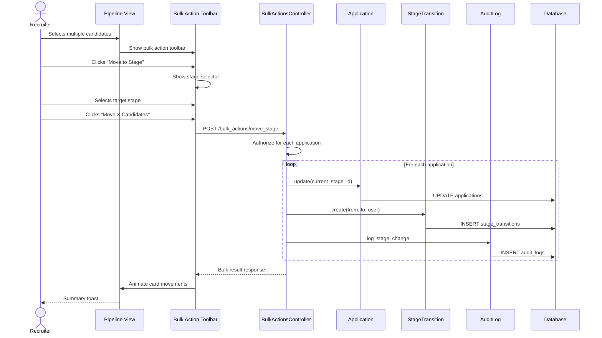

# UC-104: Bulk Move Stage

## Metadata

| Attribute | Value |
|-----------|-------|
| **ID** | UC-104 |
| **Name** | Bulk Move Stage |
| **Functional Area** | Application & Pipeline |
| **Primary Actor** | Recruiter (ACT-02) |
| **Priority** | P2 |
| **Complexity** | Medium |
| **Status** | Draft |

## Description

A recruiter selects multiple candidates from the pipeline view and moves them all to a new stage in a single operation. This batch action improves efficiency when processing groups of candidates, such as advancing all candidates who passed phone screening or moving a cohort through the interview process.

## Actors

| Actor | Role in Use Case |
|-------|------------------|
| Recruiter (ACT-02) | Selects candidates and initiates bulk move |
| Hiring Manager (ACT-03) | May perform bulk moves on their jobs |
| Notification Engine (ACT-13) | Sends notifications for stage changes |
| Scheduler (ACT-11) | Executes automation rules for each move |

## Preconditions

- [ ] User is authenticated with recruiter or hiring manager role
- [ ] At least two candidates selected
- [ ] All selected applications are in 'active' status
- [ ] User has permission to modify selected applications
- [ ] Target stage exists and is valid for the job

## Postconditions

### Success
- [ ] All selected applications updated to new stage
- [ ] StageTransition record created for each application
- [ ] Audit log entries created for each change
- [ ] Automation rules evaluated for each application
- [ ] Notifications queued (if configured)
- [ ] UI reflects new positions for all moved candidates

### Failure
- [ ] Partial success: Some applications moved, others failed
- [ ] Error summary displayed showing successes and failures
- [ ] Successfully moved applications remain in new stage
- [ ] Failed applications remain in original stage

## Triggers

- Select multiple candidates and choose "Move to Stage"
- Select all in current stage and move to next stage
- Use bulk action toolbar
- Right-click context menu on selection

## Basic Flow



| Step | Actor | Action | System Response |
|------|-------|--------|-----------------|
| 1 | Recruiter | Clicks checkbox on first candidate | Candidate selected, bulk toolbar appears |
| 2 | Recruiter | Clicks additional candidate checkboxes | More candidates added to selection |
| 3 | UI | Shows selection count in toolbar | "5 candidates selected" |
| 4 | Recruiter | Clicks "Move to Stage" button | Stage selector dropdown appears |
| 5 | Recruiter | Selects target stage | Stage choice captured |
| 6 | Recruiter | Clicks "Move 5 Candidates" | Confirmation required |
| 7 | System | Validates all applications | Eligibility checked |
| 8 | System | Begins transaction | Atomic operation starts |
| 9 | System | Updates each application | current_stage_id changed |
| 10 | System | Creates stage transitions | Audit records created |
| 11 | System | Creates audit logs | Actions logged |
| 12 | System | Commits transaction | Changes persisted |
| 13 | System | Queues automation jobs | Background processing triggered |
| 14 | UI | Animates cards to new column | Smooth visual transition |
| 15 | UI | Shows summary toast | "5 candidates moved to Interview" |

## Alternative Flows

### AF-1: Select All in Stage

**Trigger:** Recruiter wants to move entire stage

| Step | Actor | Action | System Response |
|------|-------|--------|-----------------|
| 1a | Recruiter | Clicks "Select All" in stage header | All stage candidates selected |
| 1b | System | Updates selection count | Shows total count |
| 1c | System | Enables bulk actions | Toolbar fully active |

**Resumption:** Continues at step 4 of basic flow

### AF-2: Move with Notes

**Trigger:** Recruiter wants to add context to bulk move

| Step | Actor | Action | System Response |
|------|-------|--------|-----------------|
| 6a | UI | Shows notes field in confirmation | Optional input displayed |
| 6b | Recruiter | Enters shared notes | Notes captured |
| 10a | System | Applies same notes to all transitions | Notes stored on each record |

**Resumption:** Continues at step 11 of basic flow

### AF-3: Move to Terminal Stage (Hired)

**Trigger:** Bulk moving candidates to Hired stage

| Step | Actor | Action | System Response |
|------|-------|--------|-----------------|
| 5a | System | Detects terminal stage selected | Special handling flagged |
| 6a | UI | Shows additional confirmation | "This will mark all as hired" |
| 6b | Recruiter | Confirms action | Proceeds with hire |
| 9a | System | Updates status to 'hired' | Terminal state set |
| 9b | System | Sets hired_at timestamps | Timestamps recorded |

**Resumption:** Continues at step 10 of basic flow

### AF-4: Cross-Stage Selection

**Trigger:** Candidates selected from multiple stages

| Step | Actor | Action | System Response |
|------|-------|--------|-----------------|
| 2a | Recruiter | Selects from different columns | Cross-stage selection |
| 7a | System | Validates diverse source stages | All must be active |
| 10a | System | Records correct from_stage for each | Accurate transitions |

**Resumption:** Continues at step 11 of basic flow

## Exception Flows

### EF-1: Partial Authorization Failure

**Trigger:** User doesn't have permission for some applications

| Step | Actor | Action | System Response |
|------|-------|--------|-----------------|
| 7.1 | System | Checks permissions per app | Some unauthorized |
| 7.2 | System | Filters to authorized only | Subset identified |
| 7.3 | UI | Shows warning | "3 of 5 can be moved" |
| 7.4 | Recruiter | Chooses to proceed or cancel | Decision captured |

**Resolution:** Either proceed with authorized subset or cancel entirely

### EF-2: Some Applications Already Closed

**Trigger:** Selection includes rejected/withdrawn applications

| Step | Actor | Action | System Response |
|------|-------|--------|-----------------|
| 7.1 | System | Checks application statuses | Some not active |
| 7.2 | System | Excludes closed applications | Only active proceed |
| 7.3 | UI | Shows info message | "2 applications already closed, skipping" |

**Resolution:** Proceeds with active applications only

### EF-3: Concurrent Modification

**Trigger:** Another user modified an application during bulk operation

| Step | Actor | Action | System Response |
|------|-------|--------|-----------------|
| 9.1 | System | Detects version conflict | Lock failed |
| 9.2 | System | Skips conflicting record | Notes failure |
| 9.3 | System | Continues with others | Partial success |
| 15.1 | UI | Shows mixed result | "4 moved, 1 failed (modified by another user)" |

**Resolution:** User can retry failed application manually

### EF-4: Database Transaction Failure

**Trigger:** Database error during bulk operation

| Step | Actor | Action | System Response |
|------|-------|--------|-----------------|
| 12.1 | System | Transaction fails | Rollback triggered |
| 12.2 | System | All changes reverted | Atomic failure |
| 12.3 | UI | Shows error | "Operation failed, please retry" |

**Resolution:** User retries or contacts support

## Business Rules

| ID | Rule | Description |
|----|------|-------------|
| BR-104.1 | Active Only | Only active applications can be bulk moved |
| BR-104.2 | Same Job | All selected applications must be for same job |
| BR-104.3 | Valid Stage | Target stage must be configured for the job |
| BR-104.4 | Permission Check | User must have move permission for each application |
| BR-104.5 | Audit Per App | Each application gets its own audit trail entry |
| BR-104.6 | Automation Per App | Automation rules evaluated separately per application |
| BR-104.7 | Maximum Selection | Limit of 100 applications per bulk operation |

## Data Requirements

### Input Data

| Field | Type | Required | Validation |
|-------|------|----------|------------|
| application_ids | array[integer] | Yes | 2-100 valid IDs, all same job |
| target_stage_id | integer | Yes | Must be valid for job |
| notes | text | No | Max 5000 chars, applied to all |

### Output Data

| Field | Type | Description |
|-------|------|-------------|
| success_count | integer | Number successfully moved |
| failure_count | integer | Number failed |
| moved_applications | array | IDs of successfully moved apps |
| failed_applications | array | Objects with ID and error reason |
| target_stage | object | Details of destination stage |

## Database Transactions

### Tables Affected

| Table | Operation | Conditions |
|-------|-----------|------------|
| applications | UPDATE | current_stage_id, status (if terminal) |
| stage_transitions | CREATE | One per moved application |
| audit_logs | CREATE | One per moved application |

### Transaction Detail

```sql
-- Bulk Move Stage Transaction
BEGIN TRANSACTION;

-- Step 1: Lock all applications
SELECT id, current_stage_id, job_id, status, lock_version
INTO @apps
FROM applications
WHERE id IN (@application_ids)
  AND organization_id = @organization_id
  AND discarded_at IS NULL
FOR UPDATE;

-- Step 2: Validate all are active and same job
SELECT COUNT(*) INTO @invalid_count
FROM @apps
WHERE status NOT IN ('new', 'screening', 'interviewing', 'assessment', 'background_check', 'offered')
   OR job_id != @expected_job_id;

IF @invalid_count > 0 THEN
    -- Log which are invalid but continue with valid ones
    -- (Partial success mode)
END IF;

-- Step 3: Validate target stage exists for job
SELECT id, stage_type INTO @target_stage_id, @stage_type
FROM stages s
JOIN job_stages js ON js.stage_id = s.id
WHERE s.id = @target_stage_id
  AND js.job_id = @expected_job_id;

IF @target_stage_id IS NULL THEN
    ROLLBACK;
    SIGNAL SQLSTATE '45000' SET MESSAGE_TEXT = 'Invalid target stage';
END IF;

-- Step 4: Update each application
-- (Loop handled in application code for proper transition tracking)
FOR @app IN @valid_apps DO
    -- Update application
    UPDATE applications
    SET
        current_stage_id = @target_stage_id,
        status = CASE
            WHEN @stage_type = 'hired' THEN 'hired'
            WHEN @stage_type = 'rejected' THEN 'rejected'
            ELSE status
        END,
        hired_at = CASE
            WHEN @stage_type = 'hired' THEN NOW()
            ELSE hired_at
        END,
        lock_version = lock_version + 1,
        updated_at = NOW()
    WHERE id = @app.id
      AND lock_version = @app.lock_version;

    IF ROW_COUNT() = 0 THEN
        -- Record as conflict failure
        SET @failed_ids = CONCAT(@failed_ids, ',', @app.id);
        CONTINUE;
    END IF;

    -- Create stage transition
    INSERT INTO stage_transitions (
        application_id,
        from_stage_id,
        to_stage_id,
        moved_by_id,
        notes,
        created_at,
        updated_at
    ) VALUES (
        @app.id,
        @app.current_stage_id,
        @target_stage_id,
        @current_user_id,
        @notes,
        NOW(),
        NOW()
    );

    -- Create audit log
    INSERT INTO audit_logs (
        organization_id,
        user_id,
        action,
        auditable_type,
        auditable_id,
        metadata,
        ip_address,
        created_at
    ) VALUES (
        @organization_id,
        @current_user_id,
        'application.stage_changed',
        'Application',
        @app.id,
        JSON_OBJECT(
            'from_stage_id', @app.current_stage_id,
            'to_stage_id', @target_stage_id,
            'bulk_operation', true,
            'batch_size', @total_count
        ),
        @ip_address,
        NOW()
    );

    SET @success_ids = CONCAT(@success_ids, ',', @app.id);
END FOR;

COMMIT;

-- Post-commit: Queue automation jobs for each
FOR @app_id IN @success_ids DO
    INSERT INTO solid_queue_jobs (queue, class, args, scheduled_at)
    VALUES ('automations', 'AutomationEvaluatorJob',
        JSON_OBJECT(
            'trigger', 'stage_changed',
            'application_id', @app_id,
            'to_stage_id', @target_stage_id
        ),
        NOW()
    );
END FOR;
```

### Rollback Scenarios

| Scenario | Rollback Action |
|----------|-----------------|
| Invalid stage | Full rollback, return 422 |
| All unauthorized | Full rollback, return 403 |
| Database failure | Full rollback, return 500 |
| Partial conflict | Partial success, report failures |

## UI/UX Requirements

### Screen/Component

- **Location:** Pipeline view (/jobs/:id/pipeline)
- **Entry Point:** Checkbox selection on candidate cards
- **Key Elements:**
  - Candidate card checkboxes
  - Bulk action toolbar
  - Selection counter
  - Stage selector dropdown
  - Confirmation modal
  - Progress indicator
  - Result summary

### Bulk Action Toolbar

```
+-----------------------------------------------------------------------------+
| [x] 5 candidates selected    [Move to Stage v]  [Reject]  [Send Email]  [X] |
+-----------------------------------------------------------------------------+
```

### Stage Selector Dropdown

```
+---------------------------+
| Move 5 candidates to:     |
+---------------------------+
| [ ] Applied               |
| [*] Screening             |
| [ ] Phone Interview       |
| [ ] On-site Interview     |
| [ ] Background Check      |
| [ ] Offer                 |
| [-] Hired (terminal)      |
+---------------------------+
|        [Move Candidates]  |
+---------------------------+
```

### Confirmation Modal (for terminal stages)

```
+-------------------------------------------------------------+
| Move to Hired                                           [X] |
+-------------------------------------------------------------+
|                                                             |
| You are about to move 5 candidates to Hired.                |
|                                                             |
| This action will:                                           |
| - Mark these candidates as hired                            |
| - Close their applications                                  |
| - Trigger any configured hire notifications                 |
|                                                             |
| Add notes (optional)                                        |
| +-----------------------------------------------------------+
| | Batch hire from final interview round                   | |
| +-----------------------------------------------------------+
|                                                             |
| [Cancel]                              [Move 5 to Hired]     |
+-------------------------------------------------------------+
```

### Progress and Result

```
+---------------------------------------------+
| Moving candidates...                        |
| [========>                    ] 3/5         |
+---------------------------------------------+

After completion:
+---------------------------------------------+
| [check] 5 candidates moved to Screening     |
|        [View in Screening]                  |
+---------------------------------------------+

Partial success:
+---------------------------------------------+
| [!] 4 of 5 candidates moved to Interview    |
|     1 failed: Modified by another user      |
|     [View Moved] [Retry Failed]             |
+---------------------------------------------+
```

## Non-Functional Requirements

| Requirement | Target |
|-------------|--------|
| Bulk Move Time | < 3 seconds for 50 candidates |
| UI Responsiveness | Progress updates every 100ms |
| Concurrent Safety | Optimistic locking per application |
| Maximum Batch | 100 applications per operation |
| Animation | Smooth 300ms transitions for moved cards |

## Security Considerations

- [x] Authentication required
- [x] Authorization checked per application
- [x] Partial authorization gracefully handled
- [x] Organization scoping enforced
- [x] Audit logging per application (not just batch)
- [x] Optimistic locking prevents lost updates

## Related Use Cases

| Use Case | Relationship |
|----------|--------------|
| UC-102 View Pipeline | Context where this action occurs |
| UC-103 Move Stage | Single-candidate version |
| UC-106 Bulk Reject | Similar bulk action pattern |
| UC-109 View Application History | Shows bulk move in timeline |

---

## Data Model References

> Cross-references to [DATA_MODEL.md](../DATA_MODEL.md) and [CRUD_MATRIX.md](../CRUD_MATRIX.md)

### Subject Areas

| Subject Area | ID | Relationship |
|--------------|-----|--------------|
| Application Pipeline | SA-05 | Primary |
| Compliance & Audit | SA-09 | Secondary |

### Entities CRUD

| Entity | C | R | U | D | Notes |
|--------|---|---|---|---|-------|
| Application | | X | X | | Read to validate, updated for each |
| StageTransition | X | | | | Created for each moved application |
| Stage | | X | | | Read to validate target stage |
| AuditLog | X | | | | Created for each moved application |

**Legend:** C = Create, R = Read, U = Update, D = Delete

---

## Process Model References

> Cross-references to [PROCESS_MODEL.md](../PROCESS_MODEL.md) and [PROCESS_CRUD_MATRIX.md](../PROCESS_CRUD_MATRIX.md)

| Attribute | Value | Link |
|-----------|-------|------|
| **Elementary Business Process** | EP-0402: Bulk Move Stage | [PROCESS_MODEL.md#ep-0402](../PROCESS_MODEL.md#ep-0402-bulk-move-stage) |
| **Business Process** | BP-104: Pipeline Management | [PROCESS_MODEL.md#bp-104](../PROCESS_MODEL.md#bp-104-pipeline-management) |
| **Business Function** | BF-01: Talent Acquisition | [PROCESS_MODEL.md#bf-01](../PROCESS_MODEL.md#bf-01-talent-acquisition) |

### EBP Details

| Attribute | Value |
|-----------|-------|
| **Trigger** | Recruiter selects multiple candidates and chooses "Move to Stage" |
| **Input** | Array of application IDs, target stage ID, optional notes |
| **Output** | Updated applications, StageTransition records, audit entries |
| **Business Rules** | BR-104.1 through BR-104.7 (see Business Rules section) |

---

## Traceability Matrix

> Complete artifact mapping for requirements traceability

| Artifact Type | ID | Name | Link |
|---------------|-----|------|------|
| **Use Case** | UC-104 | Bulk Move Stage | *(this document)* |
| **Elementary Process** | EP-0402 | Bulk Move Stage | [PROCESS_MODEL.md](../PROCESS_MODEL.md#ep-0402-bulk-move-stage) |
| **Business Process** | BP-104 | Pipeline Management | [PROCESS_MODEL.md](../PROCESS_MODEL.md#bp-104-pipeline-management) |
| **Business Function** | BF-01 | Talent Acquisition | [PROCESS_MODEL.md](../PROCESS_MODEL.md#bf-01-talent-acquisition) |
| **Primary Actor** | ACT-02 | Recruiter | [ACTORS.md](../ACTORS.md#act-02-recruiter) |
| **Subject Area (Primary)** | SA-05 | Application Pipeline | [DATA_MODEL.md](../DATA_MODEL.md#sa-05-application-pipeline) |
| **Subject Area (Secondary)** | SA-09 | Compliance & Audit | [DATA_MODEL.md](../DATA_MODEL.md#sa-09-compliance-audit) |
| **CRUD Matrix Row** | UC-104 | - | [CRUD_MATRIX.md](../CRUD_MATRIX.md#uc-104) |
| **Process CRUD Row** | EP-0402 | - | [PROCESS_CRUD_MATRIX.md](../PROCESS_CRUD_MATRIX.md#ep-0402) |

### Implementation Artifacts

| Artifact Type | Path/Reference | Status |
|---------------|----------------|--------|
| Controller | `app/controllers/admin/bulk_actions_controller.rb` | Planned |
| Model | `app/models/application.rb` | Implemented |
| Service | `app/services/applications/bulk_move_service.rb` | Planned |
| Policy | `app/policies/application_policy.rb` | Implemented |
| View | `app/views/admin/pipelines/_bulk_toolbar.html.erb` | Planned |
| Stimulus | `app/javascript/controllers/bulk_select_controller.js` | Planned |
| Test | `test/services/applications/bulk_move_service_test.rb` | Planned |

---

## Open Questions

1. Should we support undo for bulk operations within a time window?
2. Allow different notes per application in advanced mode?
3. Support scheduling bulk moves for future execution?
4. Real-time progress broadcast to other users viewing pipeline?

## Change History

| Version | Date | Author | Changes |
|---------|------|--------|---------|
| 0.1 | 2026-01-25 | System | Initial draft |
