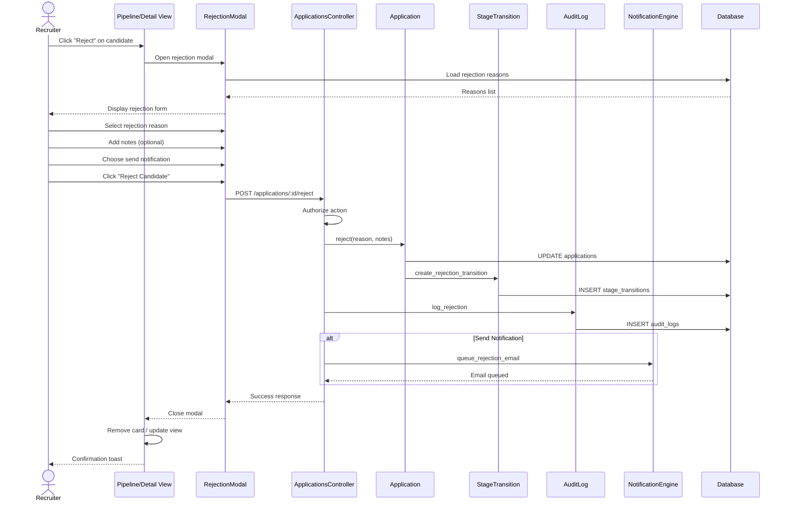

# UC-105: Reject Candidate

## Metadata

| Attribute | Value |
|-----------|-------|
| **ID** | UC-105 |
| **Name** | Reject Candidate |
| **Functional Area** | Application & Pipeline |
| **Primary Actor** | Recruiter (ACT-02) |
| **Priority** | P1 |
| **Complexity** | Medium |
| **Status** | Draft |

## Description

A recruiter or hiring manager rejects a candidate's application, removing them from active consideration for a position. The rejection requires a documented reason for compliance purposes, optionally sends a notification to the candidate, and creates an audit trail. This is a critical compliance touchpoint for defensible hiring decisions.

## Actors

| Actor | Role in Use Case |
|-------|------------------|
| Recruiter (ACT-02) | Primary actor performing rejection |
| Hiring Manager (ACT-03) | May reject candidates in their jobs |
| Notification Engine (ACT-13) | Sends rejection email if configured |
| Compliance Officer (ACT-06) | Reviews rejections in audits |

## Preconditions

- [ ] User is authenticated with recruiter or hiring manager role
- [ ] Application exists and is in 'active' status
- [ ] User has permission to reject this application
- [ ] Rejection reasons are configured for the organization

## Postconditions

### Success
- [ ] Application status changed to 'rejected'
- [ ] Application.rejected_at timestamp set
- [ ] Rejection reason recorded
- [ ] StageTransition created to "Rejected" stage
- [ ] Audit log entry created with full context
- [ ] Rejection email queued (if send_notification = true)
- [ ] Candidate removed from active pipeline view

### Failure
- [ ] Application status unchanged
- [ ] Error message displayed
- [ ] No notification sent

## Triggers

- Click "Reject" button on candidate card
- Select "Reject" from candidate action menu
- Drag candidate to "Rejected" column
- Bulk reject action

## Basic Flow



| Step | Actor | Action | System Response |
|------|-------|--------|-----------------|
| 1 | Recruiter | Clicks "Reject" on candidate | System opens rejection modal |
| 2 | System | Loads rejection reasons | Displays reason dropdown |
| 3 | Recruiter | Selects rejection reason | Reason captured |
| 4 | Recruiter | Enters additional notes (optional) | Notes captured |
| 5 | Recruiter | Chooses whether to notify candidate | Notification preference set |
| 6 | Recruiter | Clicks "Reject Candidate" | System processes rejection |
| 7 | System | Validates required fields | Validation passes |
| 8 | System | Updates application status | status = 'rejected' |
| 9 | System | Records rejected_at timestamp | Timestamp saved |
| 10 | System | Creates stage transition | Moved to "Rejected" stage |
| 11 | System | Creates audit log entry | Full context logged |
| 12 | System | Queues rejection email (if selected) | Email job enqueued |
| 13 | System | Returns success response | 200 OK |
| 14 | UI | Removes candidate from active view | Card hidden/moved |
| 15 | UI | Shows confirmation toast | "Candidate rejected" |

## Alternative Flows

### AF-1: Reject with Required Notes

**Trigger:** Selected rejection reason has requires_notes = true

| Step | Actor | Action | System Response |
|------|-------|--------|-----------------|
| 3a | System | Detects notes required | Makes notes field required |
| 4a | Recruiter | Must enter notes | Cannot submit without notes |
| 7a | System | Validates notes present | Checks notes not empty |

**Resumption:** Continues at step 8 of basic flow

### AF-2: Reject via Drag to Rejected Column

**Trigger:** User drags candidate card to Rejected column

| Step | Actor | Action | System Response |
|------|-------|--------|-----------------|
| 1a | Recruiter | Drags card to Rejected | Drop detected |
| 1b | System | Intercepts as rejection | Opens rejection modal |

**Resumption:** Continues at step 2 of basic flow

### AF-3: Custom Rejection Email

**Trigger:** Recruiter wants to customize the rejection message

| Step | Actor | Action | System Response |
|------|-------|--------|-----------------|
| 5a | Recruiter | Clicks "Customize Email" | Email editor opens |
| 5b | System | Loads default template | Template displayed |
| 5c | Recruiter | Modifies email text | Custom text captured |
| 12a | System | Uses custom email content | Sends modified email |

**Resumption:** Continues at step 13 of basic flow

### AF-4: Delay Rejection Email

**Trigger:** Organization policy to delay rejection notifications

| Step | Actor | Action | System Response |
|------|-------|--------|-----------------|
| 12a | System | Checks notification policy | Delay configured |
| 12b | System | Schedules email for later | Email queued with delay |
| 12c | System | Sets scheduled_for timestamp | E.g., 3 days from now |

**Resumption:** Continues at step 13 of basic flow

### AF-5: Reject at Final Stage

**Trigger:** Candidate is rejected after reaching Offer stage

| Step | Actor | Action | System Response |
|------|-------|--------|-----------------|
| 7a | System | Detects post-offer rejection | Flags for review |
| 7b | System | Prompts for additional context | Shows warning |
| 7c | Recruiter | Confirms rejection | Acknowledges prompt |
| 11a | System | Creates enhanced audit entry | Extra context logged |

**Resumption:** Continues at step 12 of basic flow

## Exception Flows

### EF-1: Missing Rejection Reason

**Trigger:** User tries to submit without selecting reason

| Step | Actor | Action | System Response |
|------|-------|--------|-----------------|
| 7.1 | System | Validates reason required | Validation fails |
| 7.2 | System | Highlights reason field | Shows error message |
| 7.3 | Recruiter | Selects a reason | Reason now provided |

**Resolution:** Returns to step 7

### EF-2: Application Already Closed

**Trigger:** Application was closed by another user

| Step | Actor | Action | System Response |
|------|-------|--------|-----------------|
| 8.1 | System | Checks application status | Already rejected/hired |
| 8.2 | System | Returns error | "Application already closed" |
| 8.3 | UI | Closes modal | Refreshes view |

**Resolution:** No action needed, already processed

### EF-3: Notes Required But Empty

**Trigger:** Reason requires notes but none provided

| Step | Actor | Action | System Response |
|------|-------|--------|-----------------|
| 7.1 | System | Validates notes for reason | Notes empty |
| 7.2 | System | Shows error | "Notes required for this reason" |
| 7.3 | Recruiter | Enters notes | Notes provided |

**Resolution:** Returns to step 7

### EF-4: Email Delivery Failure

**Trigger:** Rejection email bounces

| Step | Actor | Action | System Response |
|------|-------|--------|-----------------|
| E.1 | System | Email delivery fails | Bounce detected |
| E.2 | System | Logs delivery failure | Failure recorded |
| E.3 | System | Notifies recruiter | "Email could not be delivered" |

**Resolution:** Rejection stands, recruiter may contact candidate differently

## Business Rules

| ID | Rule | Description |
|----|------|-------------|
| BR-105.1 | Reason Required | Every rejection must have a reason selected |
| BR-105.2 | Notes Conditional | Some reasons require additional notes |
| BR-105.3 | Audit Required | All rejections must be logged with full context |
| BR-105.4 | No Auto-Delete | Rejected applications retained per retention policy |
| BR-105.5 | Notification Optional | Candidate notification is configurable |
| BR-105.6 | Delay Policy | Org may configure notification delay (e.g., 48 hours) |
| BR-105.7 | Compliance Reasons | Reasons must align with legal requirements |
| BR-105.8 | Cannot Self-Reject | Candidates cannot reject themselves (use withdraw) |

## Data Requirements

### Input Data

| Field | Type | Required | Validation |
|-------|------|----------|------------|
| application_id | integer | Yes | Must exist, must be active |
| rejection_reason_id | integer | Yes | Must exist, must be active |
| notes | text | Conditional | Required if reason.requires_notes |
| send_notification | boolean | Yes | Default from org settings |
| custom_email_body | text | No | Max 10,000 chars |

### Output Data

| Field | Type | Description |
|-------|------|-------------|
| application | object | Updated application with rejected status |
| rejected_at | datetime | Timestamp of rejection |
| rejection_reason | object | Selected reason details |

## Database Transactions

### Tables Affected

| Table | Operation | Conditions |
|-------|-----------|------------|
| applications | UPDATE | status, rejected_at, rejection_reason_id |
| stage_transitions | CREATE | Transition to Rejected stage |
| audit_logs | CREATE | Always |
| email_logs | CREATE | If notification sent |

### Transaction Detail

```sql
-- Reject Candidate Transaction
BEGIN TRANSACTION;

-- Step 1: Lock and validate application
SELECT id, organization_id, job_id, candidate_id, current_stage_id, status
INTO @app_id, @org_id, @job_id, @candidate_id, @from_stage_id, @current_status
FROM applications
WHERE id = @application_id
FOR UPDATE;

-- Validate status
IF @current_status != 'active' THEN
    ROLLBACK;
    SIGNAL SQLSTATE '45000' SET MESSAGE_TEXT = 'Application is not active';
END IF;

-- Step 2: Validate rejection reason exists and is active
SELECT id, name, requires_notes
INTO @reason_id, @reason_name, @requires_notes
FROM rejection_reasons
WHERE id = @rejection_reason_id
  AND organization_id = @org_id
  AND active = true;

IF @reason_id IS NULL THEN
    ROLLBACK;
    SIGNAL SQLSTATE '45000' SET MESSAGE_TEXT = 'Invalid rejection reason';
END IF;

-- Step 3: Validate notes if required
IF @requires_notes = true AND (@notes IS NULL OR TRIM(@notes) = '') THEN
    ROLLBACK;
    SIGNAL SQLSTATE '45000' SET MESSAGE_TEXT = 'Notes required for this rejection reason';
END IF;

-- Step 4: Get rejected stage ID
SELECT id INTO @rejected_stage_id
FROM stages
WHERE organization_id = @org_id
  AND stage_type = 'rejected'
LIMIT 1;

-- Step 5: Update application
UPDATE applications
SET
    status = 'rejected',
    current_stage_id = @rejected_stage_id,
    rejection_reason_id = @rejection_reason_id,
    rejected_at = NOW(),
    updated_at = NOW()
WHERE id = @application_id;

-- Step 6: Create stage transition
INSERT INTO stage_transitions (
    application_id,
    from_stage_id,
    to_stage_id,
    moved_by_id,
    notes,
    created_at,
    updated_at
) VALUES (
    @application_id,
    @from_stage_id,
    @rejected_stage_id,
    @current_user_id,
    @notes,
    NOW(),
    NOW()
);

SET @transition_id = LAST_INSERT_ID();

-- Step 7: Create comprehensive audit log
INSERT INTO audit_logs (
    organization_id,
    user_id,
    action,
    auditable_type,
    auditable_id,
    metadata,
    ip_address,
    user_agent,
    created_at
) VALUES (
    @org_id,
    @current_user_id,
    'application.rejected',
    'Application',
    @application_id,
    JSON_OBJECT(
        'job_id', @job_id,
        'candidate_id', @candidate_id,
        'from_stage_id', @from_stage_id,
        'rejection_reason_id', @rejection_reason_id,
        'rejection_reason_name', @reason_name,
        'notes', @notes,
        'transition_id', @transition_id,
        'notification_sent', @send_notification
    ),
    @ip_address,
    @user_agent,
    NOW()
);

COMMIT;

-- Post-commit: Queue notification if requested
IF @send_notification = true THEN
    -- Check for notification delay policy
    SELECT COALESCE(
        JSON_EXTRACT(settings, '$.rejection_notification_delay_hours'),
        0
    ) INTO @delay_hours
    FROM organizations
    WHERE id = @org_id;

    INSERT INTO solid_queue_jobs (queue, class, args, scheduled_at)
    VALUES (
        'mailers',
        'CandidateMailer',
        JSON_OBJECT(
            'application_id', @application_id,
            'type', 'rejection',
            'custom_body', @custom_email_body
        ),
        DATE_ADD(NOW(), INTERVAL @delay_hours HOUR)
    );
END IF;
```

### Rollback Scenarios

| Scenario | Rollback Action |
|----------|-----------------|
| Invalid reason | Full rollback, return 422 |
| Notes required but missing | Full rollback, return 422 |
| Application already closed | Full rollback, return 422 |
| Authorization failure | No transaction, return 403 |

## UI/UX Requirements

### Screen/Component

- **Location:** Rejection modal (overlay)
- **Entry Point:** Candidate card menu, detail view, drag-to-reject
- **Key Elements:**
  - Reason dropdown (required)
  - Notes textarea (conditional)
  - Notification checkbox
  - Email preview/customize option
  - Confirm button with clear action

### Rejection Modal

```
┌─────────────────────────────────────────────────────────┐
│ Reject Candidate                                    [X] │
├─────────────────────────────────────────────────────────┤
│                                                         │
│ You are rejecting Jane Doe for Software Engineer        │
│                                                         │
│ Rejection Reason *                                      │
│ ┌─────────────────────────────────────────────────────┐ │
│ │ Select a reason...                                ▼ │ │
│ └─────────────────────────────────────────────────────┘ │
│                                                         │
│   ○ Not enough experience                               │
│   ○ Skills mismatch                                     │
│   ○ Culture fit concerns                                │
│   ○ Position filled                                     │
│   ○ Candidate withdrew                                  │
│   ○ Failed assessment                                   │
│   ○ Compensation mismatch                               │
│   ○ Other (requires notes)                              │
│                                                         │
│ Notes                                                   │
│ ┌─────────────────────────────────────────────────────┐ │
│ │ Add context for this decision...                    │ │
│ │                                                     │ │
│ │                                                     │ │
│ └─────────────────────────────────────────────────────┘ │
│ ⓘ Notes are internal only and help with compliance     │
│                                                         │
│ ─────────────────────────────────────────────────────── │
│                                                         │
│ Candidate Notification                                  │
│                                                         │
│ ☑ Send rejection email to candidate                    │
│   Email will be sent in 48 hours (org policy)          │
│                                                         │
│   [Preview Email]  [Customize Email]                    │
│                                                         │
├─────────────────────────────────────────────────────────┤
│                                                         │
│   [Cancel]                      [Reject Candidate]      │
│                                                         │
└─────────────────────────────────────────────────────────┘
```

### Confirmation Toast

```
┌────────────────────────────────────────┐
│ ✓ Jane Doe has been rejected           │
│   Notification scheduled for 48 hours  │
│                               [Undo]   │
└────────────────────────────────────────┘
```

## Non-Functional Requirements

| Requirement | Target |
|-------------|--------|
| Response Time | < 1 second for rejection |
| Modal Load | < 500ms to open with reasons |
| Undo Window | 30 seconds after rejection |
| Audit Retention | 7 years minimum (compliance) |

## Security Considerations

- [x] Authentication required
- [x] Authorization: Recruiter or job's hiring manager only
- [x] Audit logging: Complete trail with reason and notes
- [x] Notes visibility: Internal only, never shown to candidate
- [x] Email content: Cannot include internal notes
- [x] Data retention: Follows compliance retention policy

## Compliance Considerations

| Requirement | Implementation |
|-------------|----------------|
| EEOC/OFCCP | Rejection reason tracked, analyzable for adverse impact |
| Documentation | Full audit trail with timestamp, user, reason, notes |
| Defensibility | Structured reasons prevent discriminatory language |
| Retention | Rejected applications retained per policy (typically 2-3 years) |
| Access Control | Rejection data visible only to authorized roles |

## Related Use Cases

| Use Case | Relationship |
|----------|--------------|
| UC-103 Move Stage | Alternative (non-terminal move) |
| UC-106 Bulk Reject | Batch version of this use case |
| UC-107 Withdraw Application | Candidate-initiated closure |
| UC-108 Reopen Application | May follow to reconsider |
| UC-109 View Application History | Shows rejection in timeline |
| UC-304 Initiate Adverse Action | May follow if background-related |
| UC-306 Generate EEOC Report | Analyzes rejection patterns |
| UC-311 Document Hiring Decision | Related compliance documentation |

---

## Data Model References

> Cross-references to [DATA_MODEL.md](../DATA_MODEL.md) and [CRUD_MATRIX.md](../CRUD_MATRIX.md)

### Subject Areas

| Subject Area | ID | Relationship |
|--------------|-----|--------------|
| Application Pipeline | SA-05 | Primary |
| Compliance & Audit | SA-09 | Primary |
| Communication | SA-10 | Secondary |

### Entities CRUD

| Entity | C | R | U | D | Notes |
|--------|---|---|---|---|-------|
| Application | | ✓ | ✓ | | Read in step 7, updated in step 8-9 |
| StageTransition | ✓ | | | | Created in step 10 to rejected stage |
| RejectionReason | | ✓ | | | Read in step 2 to populate dropdown |
| Stage | | ✓ | | | Read to get "Rejected" terminal stage |
| EmailLog | ✓ | | | | Created in step 12 if notification sent |
| AuditLog | ✓ | | | | Created in step 11 with full context |

**Legend:** C = Create, R = Read, U = Update, D = Delete

---

## Process Model References

> Cross-references to [PROCESS_MODEL.md](../PROCESS_MODEL.md) and [PROCESS_CRUD_MATRIX.md](../PROCESS_CRUD_MATRIX.md)

| Attribute | Value | Link |
|-----------|-------|------|
| **Elementary Business Process** | EP-0305: Reject Application | [PROCESS_MODEL.md#ep-0305](../PROCESS_MODEL.md#ep-0305-reject-application) |
| **Business Process** | BP-104: Pipeline Management | [PROCESS_MODEL.md#bp-104](../PROCESS_MODEL.md#bp-104-pipeline-management) |
| **Business Function** | BF-01: Talent Acquisition | [PROCESS_MODEL.md#bf-01](../PROCESS_MODEL.md#bf-01-talent-acquisition) |

### EBP Details

| Attribute | Value |
|-----------|-------|
| **Trigger** | Recruiter clicks "Reject" or drags candidate to Rejected column |
| **Input** | Application ID, rejection reason ID, notes (conditional), notification preference |
| **Output** | Application with rejected status, StageTransition, audit log, optional email |
| **Business Rules** | BR-105.1 through BR-105.8 (see Business Rules section) |

---

## Traceability Matrix

> Complete artifact mapping for requirements traceability

| Artifact Type | ID | Name | Link |
|---------------|-----|------|------|
| **Use Case** | UC-105 | Reject Candidate | *(this document)* |
| **Elementary Process** | EP-0305 | Reject Application | [PROCESS_MODEL.md](../PROCESS_MODEL.md#ep-0305-reject-application) |
| **Business Process** | BP-104 | Pipeline Management | [PROCESS_MODEL.md](../PROCESS_MODEL.md#bp-104-pipeline-management) |
| **Business Function** | BF-01 | Talent Acquisition | [PROCESS_MODEL.md](../PROCESS_MODEL.md#bf-01-talent-acquisition) |
| **Primary Actor** | ACT-02 | Recruiter | [ACTORS.md](../ACTORS.md#act-02-recruiter) |
| **Subject Area (Primary)** | SA-05 | Application Pipeline | [DATA_MODEL.md](../DATA_MODEL.md#sa-05-application-pipeline) |
| **Subject Area (Secondary)** | SA-09 | Compliance & Audit | [DATA_MODEL.md](../DATA_MODEL.md#sa-09-compliance-audit) |
| **CRUD Matrix Row** | UC-105 | - | [CRUD_MATRIX.md](../CRUD_MATRIX.md#uc-105) |
| **Process CRUD Row** | EP-0305 | - | [PROCESS_CRUD_MATRIX.md](../PROCESS_CRUD_MATRIX.md#ep-0305) |

### Implementation Artifacts

| Artifact Type | Path/Reference | Status |
|---------------|----------------|--------|
| Controller | `app/controllers/admin/applications_controller.rb` | Implemented |
| Model | `app/models/application.rb` | Implemented |
| Model | `app/models/rejection_reason.rb` | Implemented |
| Service | `app/services/applications/reject_service.rb` | Implemented |
| Policy | `app/policies/application_policy.rb` | Implemented |
| View | `app/views/admin/applications/_rejection_modal.html.erb` | Implemented |
| Test | `test/services/applications/reject_service_test.rb` | Implemented |

---

## Open Questions

1. Should we support "rejection pools" for future consideration?
2. Minimum delay before sending rejection notification?
3. Allow bulk rejection email customization?
4. Should hiring managers require recruiter approval to reject?

## Change History

| Version | Date | Author | Changes |
|---------|------|--------|---------|
| 0.1 | 2026-01-19 | System | Initial draft |
