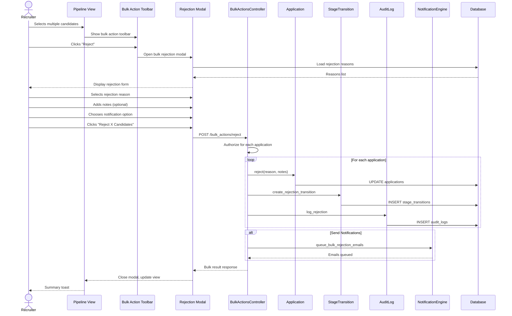

# UC-106: Bulk Reject

## Metadata

| Attribute | Value |
|-----------|-------|
| **ID** | UC-106 |
| **Name** | Bulk Reject |
| **Functional Area** | Application & Pipeline |
| **Primary Actor** | Recruiter (ACT-02) |
| **Priority** | P2 |
| **Complexity** | Medium |
| **Status** | Draft |

## Description

A recruiter selects multiple candidates from the pipeline view and rejects them all with a single rejection reason. This batch action is commonly used after reviewing a group of applications, processing unsuccessful interview cohorts, or when a position is filled and remaining candidates need to be rejected. Compliance requirements demand that each rejection is individually documented for audit purposes.

## Actors

| Actor | Role in Use Case |
|-------|------------------|
| Recruiter (ACT-02) | Selects candidates and initiates bulk rejection |
| Hiring Manager (ACT-03) | May perform bulk rejections on their jobs |
| Notification Engine (ACT-13) | Sends rejection emails if configured |
| Compliance Officer (ACT-06) | Reviews bulk rejection patterns in audits |

## Preconditions

- [ ] User is authenticated with recruiter or hiring manager role
- [ ] At least two candidates selected
- [ ] All selected applications are in 'active' status
- [ ] User has permission to reject selected applications
- [ ] Rejection reasons are configured for the organization

## Postconditions

### Success
- [ ] All selected applications status changed to 'rejected'
- [ ] rejected_at timestamp set for each application
- [ ] Rejection reason recorded for each application
- [ ] StageTransition created to "Rejected" stage for each
- [ ] Audit log entry created for each rejection
- [ ] Rejection emails queued for all (if send_notification = true)
- [ ] Candidates removed from active pipeline view

### Failure
- [ ] Partial success: Some rejections completed, others failed
- [ ] Error summary showing successes and failures
- [ ] Successfully rejected remain rejected
- [ ] Failed applications remain in original state

## Triggers

- Select multiple candidates and choose "Reject"
- Select all in a stage and reject
- Right-click context menu on selection
- Bulk action from candidate search results

## Basic Flow



| Step | Actor | Action | System Response |
|------|-------|--------|-----------------|
| 1 | Recruiter | Clicks checkbox on first candidate | Candidate selected, bulk toolbar appears |
| 2 | Recruiter | Selects additional candidates | Multi-selection updated |
| 3 | Recruiter | Clicks "Reject" in toolbar | Bulk rejection modal opens |
| 4 | System | Loads rejection reasons | Dropdown populated |
| 5 | Recruiter | Selects rejection reason | Reason captured |
| 6 | Recruiter | Enters shared notes (optional) | Notes captured |
| 7 | Recruiter | Chooses notification preference | Send/don't send selected |
| 8 | Recruiter | Clicks "Reject X Candidates" | Confirmation required |
| 9 | System | Validates all applications | Eligibility checked |
| 10 | System | Begins transaction | Atomic operation starts |
| 11 | System | Updates each application status | status = 'rejected' |
| 12 | System | Records rejection reason for each | reason_id stored |
| 13 | System | Sets rejected_at timestamps | Timestamps recorded |
| 14 | System | Creates stage transitions | Moved to Rejected stage |
| 15 | System | Creates audit logs | Each rejection logged |
| 16 | System | Queues rejection emails | Email jobs enqueued |
| 17 | UI | Removes cards from pipeline | Candidates hidden |
| 18 | UI | Shows summary toast | "X candidates rejected" |

## Alternative Flows

### AF-1: Reject with Required Notes

**Trigger:** Selected rejection reason requires notes

| Step | Actor | Action | System Response |
|------|-------|--------|-----------------|
| 5a | System | Detects notes required | Notes field marked required |
| 6a | Recruiter | Must enter notes | Validation enabled |
| 9a | System | Validates notes present | Checks notes not empty |

**Resumption:** Continues at step 10 of basic flow

### AF-2: Delayed Notification

**Trigger:** Organization has notification delay policy

| Step | Actor | Action | System Response |
|------|-------|--------|-----------------|
| 16a | System | Checks notification policy | Delay configured |
| 16b | System | Schedules emails for later | scheduled_for set |
| 18a | UI | Shows delay info | "Emails will be sent in 48 hours" |

**Resumption:** Continues with delayed notification display

### AF-3: Reject All Remaining

**Trigger:** Position filled, reject all non-hired candidates

| Step | Actor | Action | System Response |
|------|-------|--------|-----------------|
| 1a | Recruiter | Clicks "Select All Active" | All active candidates selected |
| 3a | System | Shows count and warning | "Rejecting 15 remaining candidates" |
| 5a | Recruiter | Selects "Position Filled" reason | Common scenario |

**Resumption:** Continues at step 6 of basic flow

### AF-4: Custom Email per Batch

**Trigger:** Recruiter wants to customize the rejection email

| Step | Actor | Action | System Response |
|------|-------|--------|-----------------|
| 7a | Recruiter | Clicks "Customize Email" | Email editor opens |
| 7b | System | Loads rejection template | Default text shown |
| 7c | Recruiter | Modifies message | Custom content saved |
| 16a | System | Uses custom email for all | Same message to all |

**Resumption:** Continues at step 17 of basic flow

## Exception Flows

### EF-1: Reason Requires Notes But None Provided

**Trigger:** Notes required but not entered

| Step | Actor | Action | System Response |
|------|-------|--------|-----------------|
| 9.1 | System | Validates notes for reason | Notes empty |
| 9.2 | System | Shows error | "Notes required for this reason" |
| 9.3 | Recruiter | Enters notes | Notes now provided |

**Resolution:** Returns to step 9 after notes entered

### EF-2: Some Applications Already Closed

**Trigger:** Selection includes already rejected/withdrawn applications

| Step | Actor | Action | System Response |
|------|-------|--------|-----------------|
| 9.1 | System | Checks application statuses | Some not active |
| 9.2 | System | Excludes closed applications | Only active proceed |
| 9.3 | UI | Shows info | "2 already closed, rejecting 8" |

**Resolution:** Proceeds with active applications only

### EF-3: Partial Authorization Failure

**Trigger:** User lacks permission for some applications

| Step | Actor | Action | System Response |
|------|-------|--------|-----------------|
| 9.1 | System | Checks permissions per app | Some unauthorized |
| 9.2 | UI | Shows warning | "You can reject 6 of 8 selected" |
| 9.3 | Recruiter | Confirms or cancels | Decision captured |

**Resolution:** Proceed with authorized subset or cancel

### EF-4: Email Delivery Failure

**Trigger:** Some rejection emails bounce

| Step | Actor | Action | System Response |
|------|-------|--------|-----------------|
| E.1 | System | Email delivery fails | Bounce detected |
| E.2 | System | Logs delivery failure | Failures recorded |
| E.3 | System | Notifies recruiter later | "3 emails could not be delivered" |

**Resolution:** Rejections stand, recruiter notified of email issues

## Business Rules

| ID | Rule | Description |
|----|------|-------------|
| BR-106.1 | Reason Required | Every rejection must have a reason |
| BR-106.2 | Same Reason | All bulk rejections use same reason |
| BR-106.3 | Notes Optional | Notes are optional unless reason requires them |
| BR-106.4 | Audit Per App | Each rejection gets its own audit entry |
| BR-106.5 | Notification Batched | One email per candidate, not combined |
| BR-106.6 | Active Only | Only active applications can be rejected |
| BR-106.7 | Maximum Selection | Limit of 100 applications per bulk reject |
| BR-106.8 | Compliance Retention | Rejected applications retained per policy |

## Data Requirements

### Input Data

| Field | Type | Required | Validation |
|-------|------|----------|------------|
| application_ids | array[integer] | Yes | 2-100 valid IDs |
| rejection_reason_id | integer | Yes | Must exist, must be active |
| notes | text | Conditional | Required if reason.requires_notes |
| send_notification | boolean | Yes | Default from org settings |
| custom_email_body | text | No | Max 10,000 chars |

### Output Data

| Field | Type | Description |
|-------|------|-------------|
| success_count | integer | Number successfully rejected |
| failure_count | integer | Number failed |
| rejected_applications | array | IDs of successfully rejected |
| failed_applications | array | Objects with ID and error reason |
| emails_queued | integer | Number of emails scheduled |

## Database Transactions

### Tables Affected

| Table | Operation | Conditions |
|-------|-----------|------------|
| applications | UPDATE | status, rejected_at, rejection_reason_id |
| stage_transitions | CREATE | One per rejected application |
| audit_logs | CREATE | One per rejected application |
| email_logs | CREATE | If notifications sent |

### Transaction Detail

```sql
-- Bulk Reject Transaction
BEGIN TRANSACTION;

-- Step 1: Validate rejection reason
SELECT id, name, requires_notes
INTO @reason_id, @reason_name, @requires_notes
FROM rejection_reasons
WHERE id = @rejection_reason_id
  AND organization_id = @organization_id
  AND active = true;

IF @reason_id IS NULL THEN
    ROLLBACK;
    SIGNAL SQLSTATE '45000' SET MESSAGE_TEXT = 'Invalid rejection reason';
END IF;

-- Step 2: Validate notes if required
IF @requires_notes = true AND (@notes IS NULL OR TRIM(@notes) = '') THEN
    ROLLBACK;
    SIGNAL SQLSTATE '45000' SET MESSAGE_TEXT = 'Notes required for this reason';
END IF;

-- Step 3: Lock applications
SELECT id, organization_id, job_id, candidate_id, current_stage_id, status
INTO @apps
FROM applications
WHERE id IN (@application_ids)
  AND organization_id = @organization_id
  AND discarded_at IS NULL
FOR UPDATE;

-- Step 4: Get rejected stage
SELECT id INTO @rejected_stage_id
FROM stages
WHERE organization_id = @organization_id
  AND stage_type = 'rejected'
LIMIT 1;

-- Step 5: Process each application
FOR @app IN @apps DO
    IF @app.status NOT IN ('new', 'screening', 'interviewing', 'assessment', 'background_check', 'offered') THEN
        -- Skip already closed
        SET @skipped_count = @skipped_count + 1;
        CONTINUE;
    END IF;

    -- Update application
    UPDATE applications
    SET
        status = 'rejected',
        current_stage_id = @rejected_stage_id,
        rejection_reason_id = @reason_id,
        rejection_notes = @notes,
        rejected_at = NOW(),
        updated_at = NOW()
    WHERE id = @app.id;

    -- Create stage transition
    INSERT INTO stage_transitions (
        application_id,
        from_stage_id,
        to_stage_id,
        moved_by_id,
        notes,
        created_at,
        updated_at
    ) VALUES (
        @app.id,
        @app.current_stage_id,
        @rejected_stage_id,
        @current_user_id,
        @notes,
        NOW(),
        NOW()
    );

    SET @transition_id = LAST_INSERT_ID();

    -- Create audit log with full compliance context
    INSERT INTO audit_logs (
        organization_id,
        user_id,
        action,
        auditable_type,
        auditable_id,
        metadata,
        ip_address,
        user_agent,
        created_at
    ) VALUES (
        @organization_id,
        @current_user_id,
        'application.rejected',
        'Application',
        @app.id,
        JSON_OBJECT(
            'job_id', @app.job_id,
            'candidate_id', @app.candidate_id,
            'from_stage_id', @app.current_stage_id,
            'rejection_reason_id', @reason_id,
            'rejection_reason_name', @reason_name,
            'notes', @notes,
            'transition_id', @transition_id,
            'bulk_operation', true,
            'batch_size', @total_count,
            'notification_sent', @send_notification
        ),
        @ip_address,
        @user_agent,
        NOW()
    );

    SET @success_count = @success_count + 1;
    SET @rejected_ids = CONCAT(@rejected_ids, ',', @app.id);
END FOR;

COMMIT;

-- Post-commit: Queue notification emails
IF @send_notification = true THEN
    -- Check for delay policy
    SELECT COALESCE(
        JSON_EXTRACT(settings, '$.rejection_notification_delay_hours'),
        0
    ) INTO @delay_hours
    FROM organizations
    WHERE id = @organization_id;

    FOR @app_id IN @rejected_ids DO
        INSERT INTO solid_queue_jobs (queue, class, args, scheduled_at)
        VALUES (
            'mailers',
            'CandidateMailer',
            JSON_OBJECT(
                'application_id', @app_id,
                'type', 'rejection',
                'custom_body', @custom_email_body
            ),
            DATE_ADD(NOW(), INTERVAL @delay_hours HOUR)
        );
    END FOR;
END IF;
```

### Rollback Scenarios

| Scenario | Rollback Action |
|----------|-----------------|
| Invalid reason | Full rollback, return 422 |
| Notes required but missing | Full rollback, return 422 |
| All applications already closed | No op, return success with 0 count |
| Database failure | Full rollback, return 500 |

## UI/UX Requirements

### Screen/Component

- **Location:** Pipeline view, candidate search results
- **Entry Point:** Bulk action toolbar "Reject" button
- **Key Elements:**
  - Selection count display
  - Rejection reason dropdown
  - Notes textarea
  - Notification toggle
  - Email preview/customize
  - Confirm button with count
  - Progress indicator
  - Result summary

### Bulk Rejection Modal

```
+-------------------------------------------------------------+
| Reject Candidates                                       [X] |
+-------------------------------------------------------------+
|                                                             |
| You are rejecting 8 candidates for Software Engineer        |
|                                                             |
| Rejection Reason *                                          |
| +-----------------------------------------------------------+
| | Select a reason...                                    v | |
| +-----------------------------------------------------------+
|                                                             |
|   o Not enough experience                                   |
|   o Skills mismatch                                         |
|   o Culture fit concerns                                    |
|   (*) Position filled                                       |
|   o Failed assessment                                       |
|   o Compensation mismatch                                   |
|   o Other (requires notes)                                  |
|                                                             |
| Notes                                                       |
| +-----------------------------------------------------------+
| | Final round candidates - position filled by John Smith  | |
| +-----------------------------------------------------------+
| i Notes are internal only, not shared with candidates       |
|                                                             |
+-------------------------------------------------------------+
|                                                             |
| Candidate Notification                                      |
|                                                             |
| [x] Send rejection email to all candidates                  |
|     Emails will be sent in 48 hours (org policy)           |
|                                                             |
|     [Preview Email]  [Customize Email]                      |
|                                                             |
+-------------------------------------------------------------+
|                                                             |
| [Cancel]                          [Reject 8 Candidates]     |
|                                                             |
+-------------------------------------------------------------+
```

### Progress Indicator

```
+---------------------------------------------+
| Rejecting candidates...                     |
| [============>                    ] 5/8     |
+---------------------------------------------+
```

### Result Summary

```
Success:
+---------------------------------------------+
| [check] 8 candidates rejected               |
|         Notification emails scheduled       |
|         [View Rejected]                     |
+---------------------------------------------+

Partial:
+---------------------------------------------+
| [!] 7 of 8 candidates rejected              |
|     1 skipped: Already withdrawn            |
|                                             |
|     [View Details]                          |
+---------------------------------------------+
```

## Non-Functional Requirements

| Requirement | Target |
|-------------|--------|
| Bulk Reject Time | < 5 seconds for 50 candidates |
| UI Responsiveness | Progress updates every 100ms |
| Email Queue Time | < 1 second per email |
| Maximum Batch | 100 applications per operation |
| Audit Retention | 7 years minimum (compliance) |

## Security Considerations

- [x] Authentication required
- [x] Authorization checked per application
- [x] Notes never exposed to candidates
- [x] Audit logging with full context per rejection
- [x] Organization scoping enforced
- [x] Rejection reasons controlled by org admin
- [x] Email content reviewed before send option

## Compliance Considerations

| Requirement | Implementation |
|-------------|----------------|
| EEOC/OFCCP | Same reason for all in batch aids consistency analysis |
| Documentation | Individual audit entries despite bulk operation |
| Defensibility | Structured reasons prevent discriminatory language |
| Retention | Rejected applications retained per policy |
| Reporting | Bulk rejection flag enables pattern analysis |

## Related Use Cases

| Use Case | Relationship |
|----------|--------------|
| UC-102 View Pipeline | Context where this action occurs |
| UC-104 Bulk Move Stage | Similar bulk action pattern |
| UC-105 Reject Candidate | Single-candidate version |
| UC-108 Reopen Application | May follow to reconsider |
| UC-109 View Application History | Shows bulk rejection in timeline |
| UC-306 Generate EEOC Report | Analyzes rejection patterns |

---

## Data Model References

> Cross-references to [DATA_MODEL.md](../DATA_MODEL.md) and [CRUD_MATRIX.md](../CRUD_MATRIX.md)

### Subject Areas

| Subject Area | ID | Relationship |
|--------------|-----|--------------|
| Application Pipeline | SA-05 | Primary |
| Compliance & Audit | SA-09 | Primary |
| Communication | SA-10 | Secondary |

### Entities CRUD

| Entity | C | R | U | D | Notes |
|--------|---|---|---|---|-------|
| Application | | X | X | | Read to validate, updated for each |
| StageTransition | X | | | | Created for each rejection |
| RejectionReason | | X | | | Read to validate and display |
| Stage | | X | | | Read to get "Rejected" terminal stage |
| EmailLog | X | | | | Created if notifications sent |
| AuditLog | X | | | | Created for each rejection |

**Legend:** C = Create, R = Read, U = Update, D = Delete

---

## Process Model References

> Cross-references to [PROCESS_MODEL.md](../PROCESS_MODEL.md) and [PROCESS_CRUD_MATRIX.md](../PROCESS_CRUD_MATRIX.md)

| Attribute | Value | Link |
|-----------|-------|------|
| **Elementary Business Process** | EP-0404: Bulk Reject | [PROCESS_MODEL.md#ep-0404](../PROCESS_MODEL.md#ep-0404-bulk-reject) |
| **Business Process** | BP-104: Pipeline Management | [PROCESS_MODEL.md#bp-104](../PROCESS_MODEL.md#bp-104-pipeline-management) |
| **Business Function** | BF-01: Talent Acquisition | [PROCESS_MODEL.md#bf-01](../PROCESS_MODEL.md#bf-01-talent-acquisition) |

### EBP Details

| Attribute | Value |
|-----------|-------|
| **Trigger** | Recruiter selects multiple candidates and clicks "Reject" |
| **Input** | Application IDs, rejection reason, notes, notification preference |
| **Output** | Rejected applications, StageTransitions, audit entries, email jobs |
| **Business Rules** | BR-106.1 through BR-106.8 (see Business Rules section) |

---

## Traceability Matrix

> Complete artifact mapping for requirements traceability

| Artifact Type | ID | Name | Link |
|---------------|-----|------|------|
| **Use Case** | UC-106 | Bulk Reject | *(this document)* |
| **Elementary Process** | EP-0404 | Bulk Reject | [PROCESS_MODEL.md](../PROCESS_MODEL.md#ep-0404-bulk-reject) |
| **Business Process** | BP-104 | Pipeline Management | [PROCESS_MODEL.md](../PROCESS_MODEL.md#bp-104-pipeline-management) |
| **Business Function** | BF-01 | Talent Acquisition | [PROCESS_MODEL.md](../PROCESS_MODEL.md#bf-01-talent-acquisition) |
| **Primary Actor** | ACT-02 | Recruiter | [ACTORS.md](../ACTORS.md#act-02-recruiter) |
| **Subject Area (Primary)** | SA-05 | Application Pipeline | [DATA_MODEL.md](../DATA_MODEL.md#sa-05-application-pipeline) |
| **Subject Area (Secondary)** | SA-09 | Compliance & Audit | [DATA_MODEL.md](../DATA_MODEL.md#sa-09-compliance-audit) |
| **CRUD Matrix Row** | UC-106 | - | [CRUD_MATRIX.md](../CRUD_MATRIX.md#uc-106) |
| **Process CRUD Row** | EP-0404 | - | [PROCESS_CRUD_MATRIX.md](../PROCESS_CRUD_MATRIX.md#ep-0404) |

### Implementation Artifacts

| Artifact Type | Path/Reference | Status |
|---------------|----------------|--------|
| Controller | `app/controllers/admin/bulk_actions_controller.rb` | Planned |
| Model | `app/models/application.rb` | Implemented |
| Model | `app/models/rejection_reason.rb` | Implemented |
| Service | `app/services/applications/bulk_reject_service.rb` | Planned |
| Policy | `app/policies/application_policy.rb` | Implemented |
| Mailer | `app/mailers/candidate_mailer.rb` | Implemented |
| View | `app/views/admin/bulk_actions/_rejection_modal.html.erb` | Planned |
| Test | `test/services/applications/bulk_reject_service_test.rb` | Planned |

---

## Open Questions

1. Allow different reasons per candidate in advanced mode?
2. Support for templated rejection emails per reason?
3. Option to include in future talent pool despite rejection?
4. Undo/reopen option in result summary?

## Change History

| Version | Date | Author | Changes |
|---------|------|--------|---------|
| 0.1 | 2026-01-25 | System | Initial draft |
