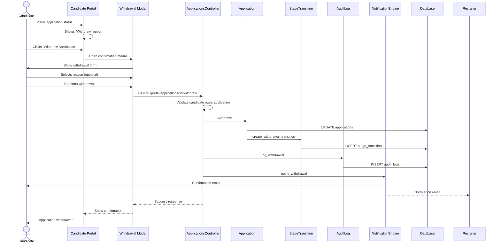

# UC-107: Withdraw Application

## Metadata

| Attribute | Value |
|-----------|-------|
| **ID** | UC-107 |
| **Name** | Withdraw Application |
| **Functional Area** | Application & Pipeline |
| **Primary Actor** | Candidate (ACT-07) |
| **Priority** | P2 |
| **Complexity** | Low |
| **Status** | Draft |

## Description

A candidate voluntarily withdraws their application from consideration for a position. This self-service action can be performed through the candidate portal, via a link in communication emails, or by request through a recruiter. The withdrawal is recorded for audit purposes and optionally captures a reason to help organizations understand candidate drop-off patterns.

## Actors

| Actor | Role in Use Case |
|-------|------------------|
| Candidate (ACT-07) | Initiates withdrawal of their own application |
| Recruiter (ACT-02) | May withdraw on behalf of candidate |
| Notification Engine (ACT-13) | Sends confirmation to candidate and recruiter |

## Preconditions

- [ ] Application exists and is in 'active' status
- [ ] Candidate is authenticated (if via portal) OR has valid token link
- [ ] Application has not already been withdrawn, rejected, or hired

## Postconditions

### Success
- [ ] Application status changed to 'withdrawn'
- [ ] Application.withdrawn_at timestamp set
- [ ] Withdrawal reason recorded (if provided)
- [ ] StageTransition created to "Withdrawn" stage
- [ ] Audit log entry created
- [ ] Confirmation sent to candidate
- [ ] Notification sent to recruiter/hiring team
- [ ] Candidate removed from active pipeline

### Failure
- [ ] Application status unchanged
- [ ] Error message displayed
- [ ] Candidate can retry

## Triggers

- Candidate clicks "Withdraw" in candidate portal
- Candidate clicks withdrawal link in email
- Recruiter withdraws on candidate's behalf
- Candidate requests withdrawal verbally/email (processed by recruiter)

## Basic Flow



| Step | Actor | Action | System Response |
|------|-------|--------|-----------------|
| 1 | Candidate | Navigates to candidate portal | Shows active applications |
| 2 | Candidate | Views application for job | Application details displayed |
| 3 | Candidate | Clicks "Withdraw Application" | Confirmation modal opens |
| 4 | System | Shows withdrawal reasons | Dropdown with options |
| 5 | Candidate | Selects reason (optional) | Reason captured |
| 6 | Candidate | Adds comments (optional) | Comments captured |
| 7 | Candidate | Clicks "Confirm Withdrawal" | System processes request |
| 8 | System | Validates application active | Check passes |
| 9 | System | Updates status to 'withdrawn' | Status changed |
| 10 | System | Sets withdrawn_at timestamp | Timestamp recorded |
| 11 | System | Creates stage transition | Moved to Withdrawn |
| 12 | System | Creates audit log | Action logged |
| 13 | System | Sends confirmation email | To candidate |
| 14 | System | Notifies hiring team | Email to recruiter |
| 15 | UI | Shows confirmation | "Application withdrawn successfully" |

## Alternative Flows

### AF-1: Withdraw via Email Link

**Trigger:** Candidate clicks withdrawal link in communication email

| Step | Actor | Action | System Response |
|------|-------|--------|-----------------|
| 1a | Candidate | Clicks "Withdraw" link in email | Opens token-authenticated page |
| 1b | System | Validates token | Token valid, identifies application |
| 1c | System | Shows simplified withdrawal form | No login required |

**Resumption:** Continues at step 4 of basic flow

### AF-2: Recruiter Withdraws on Behalf

**Trigger:** Candidate verbally requests withdrawal

| Step | Actor | Action | System Response |
|------|-------|--------|-----------------|
| 1a | Candidate | Contacts recruiter (phone/email) | Request received |
| 1b | Recruiter | Opens candidate application | Application details shown |
| 1c | Recruiter | Clicks "Withdraw (on behalf)" | Different modal opens |
| 1d | Recruiter | Documents reason and method | "Per candidate phone request" |

**Resumption:** Continues at step 7 of basic flow with recruiter as actor

### AF-3: Withdraw from Interview Scheduling

**Trigger:** Candidate decides not to proceed during scheduling

| Step | Actor | Action | System Response |
|------|-------|--------|-----------------|
| 1a | Candidate | Views interview scheduling link | Calendar options shown |
| 1b | Candidate | Clicks "I need to withdraw" | Withdrawal option available |
| 1c | System | Cancels any pending interviews | Interview slots released |

**Resumption:** Continues at step 4 of basic flow

### AF-4: Withdraw During Offer

**Trigger:** Candidate withdraws after receiving offer

| Step | Actor | Action | System Response |
|------|-------|--------|-----------------|
| 8a | System | Detects active offer | Offer in sent/viewed state |
| 8b | System | Marks offer as declined | Offer status updated |
| 8c | System | Records linked withdrawal | Reason: "Declined offer" |

**Resumption:** Continues at step 9 of basic flow

## Exception Flows

### EF-1: Application Already Closed

**Trigger:** Application already rejected, withdrawn, or hired

| Step | Actor | Action | System Response |
|------|-------|--------|-----------------|
| 8.1 | System | Checks application status | Not active |
| 8.2 | System | Returns error | "Application already closed" |
| 8.3 | UI | Shows current status | Explains cannot withdraw |

**Resolution:** Candidate sees correct current status

### EF-2: Invalid Token

**Trigger:** Email withdrawal link token expired or invalid

| Step | Actor | Action | System Response |
|------|-------|--------|-----------------|
| 1b.1 | System | Validates token | Token invalid/expired |
| 1b.2 | System | Returns 401 | "Link expired" |
| 1b.3 | UI | Prompts login | Redirect to portal login |

**Resolution:** Candidate logs in to withdraw normally

### EF-3: Candidate Not Owner

**Trigger:** Someone attempts to withdraw another's application

| Step | Actor | Action | System Response |
|------|-------|--------|-----------------|
| 8.1 | System | Validates ownership | Wrong candidate |
| 8.2 | System | Returns 403 | "Access denied" |
| 8.3 | System | Logs security event | Potential abuse recorded |

**Resolution:** Request denied, security team notified if pattern detected

## Business Rules

| ID | Rule | Description |
|----|------|-------------|
| BR-107.1 | Active Only | Only active applications can be withdrawn |
| BR-107.2 | Owner Only | Only application owner (or authorized recruiter) can withdraw |
| BR-107.3 | Reason Optional | Withdrawal reason is encouraged but not required |
| BR-107.4 | Audit Required | Withdrawal must be logged with full context |
| BR-107.5 | No Undo Candidate | Candidates cannot reopen their own withdrawn applications |
| BR-107.6 | Notification Required | Both candidate and hiring team must be notified |
| BR-107.7 | Offer Impact | Withdrawing cancels any pending offer |
| BR-107.8 | Interview Impact | Withdrawing cancels scheduled interviews |

## Data Requirements

### Input Data

| Field | Type | Required | Validation |
|-------|------|----------|------------|
| application_id | integer | Yes | Must exist, must be active, candidate must own |
| withdrawal_reason | string | No | From defined list or 'other' |
| withdrawal_comments | text | No | Max 2000 chars |
| method | string | No | 'portal', 'email_link', 'recruiter_behalf' |

### Output Data

| Field | Type | Description |
|-------|------|-------------|
| application | object | Updated application with withdrawn status |
| withdrawn_at | datetime | Timestamp of withdrawal |
| confirmation_sent | boolean | Whether email was sent |

## Database Transactions

### Tables Affected

| Table | Operation | Conditions |
|-------|-----------|------------|
| applications | UPDATE | status, withdrawn_at |
| stage_transitions | CREATE | Transition to Withdrawn stage |
| audit_logs | CREATE | Always |
| offers | UPDATE | If pending offer exists |
| interviews | UPDATE | If scheduled interviews exist |

### Transaction Detail

```sql
-- Withdraw Application Transaction
BEGIN TRANSACTION;

-- Step 1: Lock and validate application
SELECT id, organization_id, job_id, candidate_id, current_stage_id, status
INTO @app_id, @org_id, @job_id, @candidate_id, @from_stage_id, @current_status
FROM applications
WHERE id = @application_id
  AND discarded_at IS NULL
FOR UPDATE;

-- Validate ownership (unless recruiter behalf)
IF @initiator_type = 'candidate' AND @candidate_id != @authenticated_candidate_id THEN
    ROLLBACK;
    SIGNAL SQLSTATE '45000' SET MESSAGE_TEXT = 'Access denied';
END IF;

-- Validate status
IF @current_status NOT IN ('new', 'screening', 'interviewing', 'assessment', 'background_check', 'offered') THEN
    ROLLBACK;
    SIGNAL SQLSTATE '45000' SET MESSAGE_TEXT = 'Application cannot be withdrawn';
END IF;

-- Step 2: Get withdrawn stage
SELECT id INTO @withdrawn_stage_id
FROM stages
WHERE organization_id = @org_id
  AND stage_type = 'rejected'  -- Withdrawn uses rejected stage type
  AND name LIKE '%Withdrawn%'
LIMIT 1;

-- Fallback to generic rejected stage
IF @withdrawn_stage_id IS NULL THEN
    SELECT id INTO @withdrawn_stage_id
    FROM stages
    WHERE organization_id = @org_id
      AND is_terminal = true
    LIMIT 1;
END IF;

-- Step 3: Update application
UPDATE applications
SET
    status = 'withdrawn',
    current_stage_id = @withdrawn_stage_id,
    withdrawn_at = NOW(),
    withdrawal_reason = @withdrawal_reason,
    withdrawal_comments = @withdrawal_comments,
    updated_at = NOW()
WHERE id = @application_id;

-- Step 4: Cancel any pending offer
UPDATE offers
SET
    status = 'withdrawn',
    withdrawn_at = NOW(),
    updated_at = NOW()
WHERE application_id = @application_id
  AND status IN ('draft', 'pending_approval', 'approved', 'sent');

-- Step 5: Cancel scheduled interviews
UPDATE interviews
SET
    status = 'cancelled',
    cancelled_at = NOW(),
    cancellation_reason = 'Candidate withdrew application',
    updated_at = NOW()
WHERE application_id = @application_id
  AND status IN ('scheduled', 'confirmed');

-- Step 6: Create stage transition
INSERT INTO stage_transitions (
    application_id,
    from_stage_id,
    to_stage_id,
    moved_by_id,
    notes,
    created_at,
    updated_at
) VALUES (
    @application_id,
    @from_stage_id,
    @withdrawn_stage_id,
    CASE WHEN @initiator_type = 'recruiter' THEN @recruiter_user_id ELSE NULL END,
    CONCAT(
        'Withdrawn by ',
        CASE WHEN @initiator_type = 'recruiter' THEN 'recruiter on behalf of candidate' ELSE 'candidate' END,
        CASE WHEN @withdrawal_reason IS NOT NULL THEN CONCAT('. Reason: ', @withdrawal_reason) ELSE '' END
    ),
    NOW(),
    NOW()
);

-- Step 7: Create audit log
INSERT INTO audit_logs (
    organization_id,
    user_id,
    action,
    auditable_type,
    auditable_id,
    metadata,
    ip_address,
    created_at
) VALUES (
    @org_id,
    CASE WHEN @initiator_type = 'recruiter' THEN @recruiter_user_id ELSE NULL END,
    'application.withdrawn',
    'Application',
    @application_id,
    JSON_OBJECT(
        'job_id', @job_id,
        'candidate_id', @candidate_id,
        'from_stage_id', @from_stage_id,
        'withdrawal_reason', @withdrawal_reason,
        'withdrawal_comments', @withdrawal_comments,
        'initiator_type', @initiator_type,
        'method', @method
    ),
    @ip_address,
    NOW()
);

COMMIT;

-- Post-commit: Send notifications
INSERT INTO solid_queue_jobs (queue, class, args, scheduled_at)
VALUES ('mailers', 'CandidateMailer',
    JSON_OBJECT(
        'application_id', @application_id,
        'type', 'withdrawal_confirmation'
    ),
    NOW()
);

INSERT INTO solid_queue_jobs (queue, class, args, scheduled_at)
VALUES ('mailers', 'RecruiterMailer',
    JSON_OBJECT(
        'application_id', @application_id,
        'type', 'candidate_withdrew',
        'job_id', @job_id
    ),
    NOW()
);
```

### Rollback Scenarios

| Scenario | Rollback Action |
|----------|-----------------|
| Not owner | Full rollback, return 403 |
| Already closed | Full rollback, return 422 |
| Invalid token | No transaction, return 401 |
| Database failure | Full rollback, return 500 |

## UI/UX Requirements

### Screen/Component

- **Location:** Candidate portal (/portal/applications/:id)
- **Entry Point:** Application detail view, email link
- **Key Elements:**
  - Current application status
  - Withdraw button (clear but not prominent)
  - Confirmation modal
  - Reason dropdown (optional)
  - Comments field
  - Final confirmation

### Candidate Portal Application View

```
+-------------------------------------------------------------+
| Your Applications                                           |
+-------------------------------------------------------------+
|                                                             |
| +-----------------------------------------------------------+
| | Software Engineer - San Francisco                         |
| |                                                           |
| | Status: Interviewing                                      |
| | Applied: January 15, 2026                                 |
| | Last Update: January 22, 2026                             |
| |                                                           |
| | Your application is currently being reviewed.             |
| | Next step: Technical Interview scheduled for Jan 28       |
| |                                                           |
| | [View Details]                                            |
| |                                                           |
| | Need to withdraw? [Withdraw Application]                  |
| +-----------------------------------------------------------+
|                                                             |
+-------------------------------------------------------------+
```

### Withdrawal Confirmation Modal

```
+-------------------------------------------------------------+
| Withdraw Application                                    [X] |
+-------------------------------------------------------------+
|                                                             |
| Are you sure you want to withdraw your application for      |
| Software Engineer?                                          |
|                                                             |
| This action cannot be undone. You may apply again in the    |
| future for this or other positions.                         |
|                                                             |
| Why are you withdrawing? (optional)                         |
| +-----------------------------------------------------------+
| | Select a reason...                                    v | |
| +-----------------------------------------------------------+
|                                                             |
|   o Accepted another offer                                  |
|   o No longer interested in this role                       |
|   o Personal circumstances changed                          |
|   o Relocating / availability issues                        |
|   o Compensation expectations not aligned                   |
|   o Company/role not a good fit                             |
|   o Other                                                   |
|                                                             |
| Additional comments (optional)                              |
| +-----------------------------------------------------------+
| |                                                         | |
| +-----------------------------------------------------------+
|                                                             |
+-------------------------------------------------------------+
|                                                             |
|   [Cancel]                        [Confirm Withdrawal]      |
|                                                             |
+-------------------------------------------------------------+
```

### Confirmation Screen

```
+-------------------------------------------------------------+
|                                                             |
|                      [check icon]                           |
|                                                             |
|              Application Withdrawn                          |
|                                                             |
|   Your application for Software Engineer has been           |
|   successfully withdrawn.                                   |
|                                                             |
|   We've sent a confirmation to your email.                  |
|                                                             |
|   We appreciate your interest and encourage you to          |
|   apply again for future opportunities.                     |
|                                                             |
|              [Browse Other Jobs]                            |
|                                                             |
+-------------------------------------------------------------+
```

## Non-Functional Requirements

| Requirement | Target |
|-------------|--------|
| Response Time | < 1 second for withdrawal |
| Token Validity | 30 days for email links |
| Confirmation Email | Sent within 1 minute |
| Mobile Support | Fully responsive portal |

## Security Considerations

- [x] Authentication or valid token required
- [x] Ownership validation enforced
- [x] Rate limiting on withdrawal attempts
- [x] Token single-use or time-limited
- [x] Audit logging with IP address
- [x] No sensitive data exposed in confirmation

## Related Use Cases

| Use Case | Relationship |
|----------|--------------|
| UC-100 Apply for Job | Origin of application |
| UC-105 Reject Candidate | Alternative closure method |
| UC-108 Reopen Application | May follow to reconsider |
| UC-109 View Application History | Shows withdrawal in timeline |
| UC-155 Cancel Interview | Triggered by withdrawal |
| UC-258 Withdraw Offer | May be triggered if offer pending |

---

## Data Model References

> Cross-references to [DATA_MODEL.md](../DATA_MODEL.md) and [CRUD_MATRIX.md](../CRUD_MATRIX.md)

### Subject Areas

| Subject Area | ID | Relationship |
|--------------|-----|--------------|
| Application Pipeline | SA-05 | Primary |
| Career Site | SA-12 | Secondary (portal) |
| Compliance & Audit | SA-09 | Secondary |

### Entities CRUD

| Entity | C | R | U | D | Notes |
|--------|---|---|---|---|-------|
| Application | | X | X | | Read to validate, updated for withdrawal |
| StageTransition | X | | | | Created for withdrawal |
| Offer | | X | X | | Updated if pending offer |
| Interview | | X | X | | Updated if scheduled |
| AuditLog | X | | | | Created for withdrawal |

**Legend:** C = Create, R = Read, U = Update, D = Delete

---

## Process Model References

> Cross-references to [PROCESS_MODEL.md](../PROCESS_MODEL.md) and [PROCESS_CRUD_MATRIX.md](../PROCESS_CRUD_MATRIX.md)

| Attribute | Value | Link |
|-----------|-------|------|
| **Elementary Business Process** | EP-0405: Withdraw Application | [PROCESS_MODEL.md#ep-0405](../PROCESS_MODEL.md#ep-0405-withdraw-application) |
| **Business Process** | BP-104: Pipeline Management | [PROCESS_MODEL.md#bp-104](../PROCESS_MODEL.md#bp-104-pipeline-management) |
| **Business Function** | BF-01: Talent Acquisition | [PROCESS_MODEL.md#bf-01](../PROCESS_MODEL.md#bf-01-talent-acquisition) |

### EBP Details

| Attribute | Value |
|-----------|-------|
| **Trigger** | Candidate clicks "Withdraw" in portal or email link |
| **Input** | Application ID, optional reason and comments |
| **Output** | Withdrawn application, cancelled offers/interviews, notifications |
| **Business Rules** | BR-107.1 through BR-107.8 (see Business Rules section) |

---

## Traceability Matrix

> Complete artifact mapping for requirements traceability

| Artifact Type | ID | Name | Link |
|---------------|-----|------|------|
| **Use Case** | UC-107 | Withdraw Application | *(this document)* |
| **Elementary Process** | EP-0405 | Withdraw Application | [PROCESS_MODEL.md](../PROCESS_MODEL.md#ep-0405-withdraw-application) |
| **Business Process** | BP-104 | Pipeline Management | [PROCESS_MODEL.md](../PROCESS_MODEL.md#bp-104-pipeline-management) |
| **Business Function** | BF-01 | Talent Acquisition | [PROCESS_MODEL.md](../PROCESS_MODEL.md#bf-01-talent-acquisition) |
| **Primary Actor** | ACT-07 | Candidate | [ACTORS.md](../ACTORS.md#act-07-candidate) |
| **Subject Area (Primary)** | SA-05 | Application Pipeline | [DATA_MODEL.md](../DATA_MODEL.md#sa-05-application-pipeline) |
| **Subject Area (Secondary)** | SA-12 | Career Site | [DATA_MODEL.md](../DATA_MODEL.md#sa-12-career-site) |
| **CRUD Matrix Row** | UC-107 | - | [CRUD_MATRIX.md](../CRUD_MATRIX.md#uc-107) |
| **Process CRUD Row** | EP-0405 | - | [PROCESS_CRUD_MATRIX.md](../PROCESS_CRUD_MATRIX.md#ep-0405) |

### Implementation Artifacts

| Artifact Type | Path/Reference | Status |
|---------------|----------------|--------|
| Controller | `app/controllers/portal/applications_controller.rb` | Implemented |
| Model | `app/models/application.rb` | Implemented |
| Service | `app/services/applications/withdraw_service.rb` | Planned |
| View | `app/views/portal/applications/show.html.erb` | Implemented |
| Mailer | `app/mailers/candidate_mailer.rb` | Implemented |
| Test | `test/controllers/portal/applications_controller_test.rb` | Implemented |

---

## Open Questions

1. Should we capture more detailed feedback for product improvement?
2. Allow candidate to leave feedback about their experience?
3. Time limit on reapplying after withdrawal?
4. Notify interviewer panel members when candidate withdraws?

## Change History

| Version | Date | Author | Changes |
|---------|------|--------|---------|
| 0.1 | 2026-01-25 | System | Initial draft |
