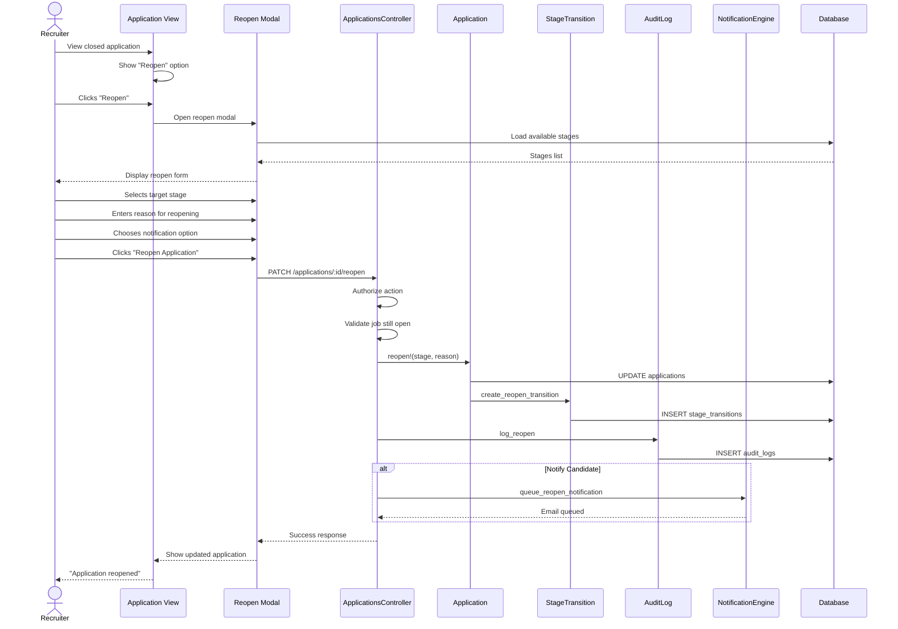

# UC-108: Reopen Application

## Metadata

| Attribute | Value |
|-----------|-------|
| **ID** | UC-108 |
| **Name** | Reopen Application |
| **Functional Area** | Application & Pipeline |
| **Primary Actor** | Recruiter (ACT-02) |
| **Priority** | P3 |
| **Complexity** | Low |
| **Status** | Draft |

## Description

A recruiter reactivates a previously rejected or withdrawn application, returning the candidate to the active pipeline for reconsideration. This action is used when a rejection was made in error, when circumstances change (e.g., new opening), when a candidate who withdrew becomes available again, or during appeals/dispute processes. The reopening is fully documented for compliance and audit purposes.

## Actors

| Actor | Role in Use Case |
|-------|------------------|
| Recruiter (ACT-02) | Initiates reopen and selects target stage |
| Hiring Manager (ACT-03) | May reopen applications for their jobs |
| Compliance Officer (ACT-06) | May review reopen patterns |
| Notification Engine (ACT-13) | Notifies candidate of reconsideration |

## Preconditions

- [ ] User is authenticated with recruiter or hiring manager role
- [ ] Application exists and is in 'rejected' or 'withdrawn' status
- [ ] User has permission to modify this application
- [ ] Job is still open (or on hold)
- [ ] Candidate has no active application for this job

## Postconditions

### Success
- [ ] Application status changed back to an active state
- [ ] Application moved to specified stage
- [ ] StageTransition created for reopen
- [ ] Audit log entry created with reopen reason
- [ ] Notification sent to candidate (if configured)
- [ ] Candidate reappears in active pipeline

### Failure
- [ ] Application status unchanged
- [ ] Error message displayed
- [ ] Audit log captures failed attempt (if significant)

## Triggers

- Click "Reopen" on rejected/withdrawn application
- Select "Reopen" from application detail view
- Access from candidate profile's application history
- Dispute resolution workflow completion

## Basic Flow



| Step | Actor | Action | System Response |
|------|-------|--------|-----------------|
| 1 | Recruiter | Views rejected/withdrawn application | Application details shown |
| 2 | Recruiter | Clicks "Reopen Application" | Reopen modal opens |
| 3 | System | Loads available stages | Stage dropdown populated |
| 4 | Recruiter | Selects target stage | Stage captured |
| 5 | Recruiter | Enters reason for reopening | Reason captured (required) |
| 6 | Recruiter | Chooses whether to notify candidate | Preference set |
| 7 | Recruiter | Clicks "Reopen Application" | System processes request |
| 8 | System | Validates job is still open | Check passes |
| 9 | System | Updates application status | Status = active state |
| 10 | System | Clears terminal timestamps | rejected_at/withdrawn_at nullified |
| 11 | System | Updates current stage | Moved to selected stage |
| 12 | System | Creates stage transition | Reopen recorded |
| 13 | System | Creates audit log | Full context logged |
| 14 | System | Queues notification (if selected) | Email job enqueued |
| 15 | UI | Shows updated application | Now active |
| 16 | UI | Shows confirmation | "Application reopened" |

## Alternative Flows

### AF-1: Reopen from Candidate Profile

**Trigger:** Recruiter is viewing candidate profile with closed applications

| Step | Actor | Action | System Response |
|------|-------|--------|-----------------|
| 1a | Recruiter | Views candidate profile | All applications listed |
| 1b | Recruiter | Finds rejected application | Status shown as "Rejected" |
| 1c | Recruiter | Clicks "Reopen" icon | Opens same modal |

**Resumption:** Continues at step 3 of basic flow

### AF-2: Reopen to Original Stage

**Trigger:** Recruiter wants to restore to previous position

| Step | Actor | Action | System Response |
|------|-------|--------|-----------------|
| 3a | Modal | Shows "Restore to previous stage" option | Previous stage displayed |
| 4a | Recruiter | Selects restore option | Uses stage before rejection |

**Resumption:** Continues at step 5 of basic flow

### AF-3: Reopen Multiple Applications

**Trigger:** Bulk reopen for reconsideration

| Step | Actor | Action | System Response |
|------|-------|--------|-----------------|
| 1a | Recruiter | Filters to show rejected | Rejected applications listed |
| 1b | Recruiter | Selects multiple | Bulk actions enabled |
| 1c | Recruiter | Clicks "Reopen Selected" | Bulk modal opens |
| 5a | System | Applies same reason to all | Batch reopen |

**Resumption:** Each application processed per basic flow

### AF-4: Reopen During Adverse Action Dispute

**Trigger:** Candidate successfully disputes background check adverse action

| Step | Actor | Action | System Response |
|------|-------|--------|-----------------|
| 1a | System | Adverse action dispute resolved | Application flagged for review |
| 1b | Compliance | Reviews resolution | Determines reopen appropriate |
| 5a | Compliance | Documents dispute resolution | Special reason category |

**Resumption:** Continues at step 6 of basic flow

## Exception Flows

### EF-1: Job Closed

**Trigger:** Job is no longer accepting applications

| Step | Actor | Action | System Response |
|------|-------|--------|-----------------|
| 8.1 | System | Checks job status | Job is closed |
| 8.2 | System | Returns error | "Job is no longer open" |
| 8.3 | Modal | Shows job status | Explains cannot reopen |

**Resolution:** Reopen job first, or transfer to different job (UC-110)

### EF-2: Candidate Has New Active Application

**Trigger:** Candidate already has another active application for same job

| Step | Actor | Action | System Response |
|------|-------|--------|-----------------|
| 8.1 | System | Checks for duplicates | Active application exists |
| 8.2 | System | Returns error | "Candidate has active application" |
| 8.3 | Modal | Shows link to active | "View current application" |

**Resolution:** Work with existing active application

### EF-3: Application Not Terminal

**Trigger:** Application is not actually rejected or withdrawn

| Step | Actor | Action | System Response |
|------|-------|--------|-----------------|
| 8.1 | System | Checks application status | Status is active |
| 8.2 | System | Returns error | "Application is already active" |
| 8.3 | UI | Shows current status | "Currently in [stage]" |

**Resolution:** No action needed, application already active

### EF-4: Reason Not Provided

**Trigger:** Recruiter attempts to reopen without justification

| Step | Actor | Action | System Response |
|------|-------|--------|-----------------|
| 7.1 | System | Validates reason field | Reason empty |
| 7.2 | Modal | Shows error | "Please provide a reason" |
| 7.3 | Recruiter | Enters reason | Reason now provided |

**Resolution:** Returns to step 7 with reason

## Business Rules

| ID | Rule | Description |
|----|------|-------------|
| BR-108.1 | Terminal Only | Only rejected or withdrawn applications can be reopened |
| BR-108.2 | Reason Required | Reopen reason must be documented for compliance |
| BR-108.3 | Job Open | Job must be open or on_hold to reopen applications |
| BR-108.4 | No Duplicates | Cannot reopen if candidate has active application for same job |
| BR-108.5 | Permission Check | User must have recruiter role or be job's hiring manager |
| BR-108.6 | Audit Trail | Full context including original closure reason must be logged |
| BR-108.7 | Candidate Consent | Consider notifying candidate before proceeding |
| BR-108.8 | GDPR Compliance | Check no pending deletion request |

## Data Requirements

### Input Data

| Field | Type | Required | Validation |
|-------|------|----------|------------|
| application_id | integer | Yes | Must be rejected or withdrawn |
| target_stage_id | integer | Yes | Must be valid for job |
| reopen_reason | text | Yes | Min 10 chars, max 2000 chars |
| notify_candidate | boolean | Yes | Default true |

### Output Data

| Field | Type | Description |
|-------|------|-------------|
| application | object | Updated application with active status |
| new_stage | object | Current stage after reopen |
| previous_status | string | What status was before (rejected/withdrawn) |

## Database Transactions

### Tables Affected

| Table | Operation | Conditions |
|-------|-----------|------------|
| applications | UPDATE | status, current_stage_id, clear terminal timestamps |
| stage_transitions | CREATE | Reopen transition |
| audit_logs | CREATE | Always with full context |

### Transaction Detail

```sql
-- Reopen Application Transaction
BEGIN TRANSACTION;

-- Step 1: Lock and validate application
SELECT id, organization_id, job_id, candidate_id, current_stage_id, status,
       rejected_at, withdrawn_at, rejection_reason_id
INTO @app_id, @org_id, @job_id, @candidate_id, @from_stage_id, @current_status,
     @was_rejected_at, @was_withdrawn_at, @original_rejection_reason_id
FROM applications
WHERE id = @application_id
  AND discarded_at IS NULL
FOR UPDATE;

-- Validate terminal status
IF @current_status NOT IN ('rejected', 'withdrawn') THEN
    ROLLBACK;
    SIGNAL SQLSTATE '45000' SET MESSAGE_TEXT = 'Application is not in a terminal state';
END IF;

-- Step 2: Validate job is open
SELECT status INTO @job_status
FROM jobs
WHERE id = @job_id
  AND discarded_at IS NULL;

IF @job_status NOT IN ('open', 'on_hold') THEN
    ROLLBACK;
    SIGNAL SQLSTATE '45000' SET MESSAGE_TEXT = 'Job is not accepting applications';
END IF;

-- Step 3: Check for existing active application
SELECT COUNT(*) INTO @active_count
FROM applications
WHERE candidate_id = @candidate_id
  AND job_id = @job_id
  AND id != @app_id
  AND status NOT IN ('rejected', 'withdrawn')
  AND discarded_at IS NULL;

IF @active_count > 0 THEN
    ROLLBACK;
    SIGNAL SQLSTATE '45000' SET MESSAGE_TEXT = 'Candidate has another active application';
END IF;

-- Step 4: Validate target stage
SELECT id INTO @target_stage_id
FROM stages s
JOIN job_stages js ON js.stage_id = s.id
WHERE s.id = @target_stage_id
  AND js.job_id = @job_id
  AND s.is_terminal = false;

IF @target_stage_id IS NULL THEN
    ROLLBACK;
    SIGNAL SQLSTATE '45000' SET MESSAGE_TEXT = 'Invalid target stage';
END IF;

-- Step 5: Determine new status based on target stage
SELECT stage_type INTO @stage_type
FROM stages WHERE id = @target_stage_id;

SET @new_status = CASE @stage_type
    WHEN 'applied' THEN 'new'
    WHEN 'screening' THEN 'screening'
    WHEN 'interview' THEN 'interviewing'
    WHEN 'offer' THEN 'offered'
    ELSE 'new'
END;

-- Step 6: Update application
UPDATE applications
SET
    status = @new_status,
    current_stage_id = @target_stage_id,
    rejected_at = NULL,
    withdrawn_at = NULL,
    rejection_reason_id = NULL,
    rejection_notes = NULL,
    withdrawal_reason = NULL,
    withdrawal_comments = NULL,
    last_activity_at = NOW(),
    updated_at = NOW()
WHERE id = @application_id;

-- Step 7: Create stage transition
INSERT INTO stage_transitions (
    application_id,
    from_stage_id,
    to_stage_id,
    moved_by_id,
    notes,
    created_at,
    updated_at
) VALUES (
    @application_id,
    @from_stage_id,
    @target_stage_id,
    @current_user_id,
    CONCAT('Reopened: ', @reopen_reason),
    NOW(),
    NOW()
);

SET @transition_id = LAST_INSERT_ID();

-- Step 8: Create comprehensive audit log
INSERT INTO audit_logs (
    organization_id,
    user_id,
    action,
    auditable_type,
    auditable_id,
    metadata,
    ip_address,
    user_agent,
    created_at
) VALUES (
    @org_id,
    @current_user_id,
    'application.reopened',
    'Application',
    @application_id,
    JSON_OBJECT(
        'job_id', @job_id,
        'candidate_id', @candidate_id,
        'previous_status', @current_status,
        'previous_stage_id', @from_stage_id,
        'was_rejected_at', @was_rejected_at,
        'was_withdrawn_at', @was_withdrawn_at,
        'original_rejection_reason_id', @original_rejection_reason_id,
        'new_stage_id', @target_stage_id,
        'new_status', @new_status,
        'reopen_reason', @reopen_reason,
        'transition_id', @transition_id,
        'notify_candidate', @notify_candidate
    ),
    @ip_address,
    @user_agent,
    NOW()
);

COMMIT;

-- Post-commit: Queue notification
IF @notify_candidate = true THEN
    INSERT INTO solid_queue_jobs (queue, class, args, scheduled_at)
    VALUES ('mailers', 'CandidateMailer',
        JSON_OBJECT(
            'application_id', @application_id,
            'type', 'application_reopened',
            'stage_name', (SELECT name FROM stages WHERE id = @target_stage_id)
        ),
        NOW()
    );
END IF;
```

### Rollback Scenarios

| Scenario | Rollback Action |
|----------|-----------------|
| Not terminal | Full rollback, return 422 |
| Job closed | Full rollback, return 422 |
| Has active application | Full rollback, return 422 |
| Invalid stage | Full rollback, return 422 |
| Authorization failure | No transaction, return 403 |

## UI/UX Requirements

### Screen/Component

- **Location:** Application detail view, candidate profile
- **Entry Point:** "Reopen" button on closed applications
- **Key Elements:**
  - Current status display (Rejected/Withdrawn)
  - Original closure reason (if applicable)
  - Target stage selector
  - Reason for reopening (required)
  - Notification option
  - Confirm button

### Reopen Modal

```
+-------------------------------------------------------------+
| Reopen Application                                      [X] |
+-------------------------------------------------------------+
|                                                             |
| Candidate: Jane Doe                                         |
| Job: Software Engineer - San Francisco                      |
| Current Status: Rejected (January 20, 2026)                 |
| Original Reason: Skills mismatch                            |
|                                                             |
| ----------------------------------------------------------- |
|                                                             |
| Reopen to Stage *                                           |
| +-----------------------------------------------------------+
| | Applied                                               v | |
| +-----------------------------------------------------------+
|                                                             |
|   o Applied (start fresh)                                   |
|   (*) Phone Screen (restore to previous)                    |
|   o Interview                                               |
|                                                             |
| Reason for Reopening *                                      |
| +-----------------------------------------------------------+
| | After further review of portfolio, candidate has         |
| | relevant experience we initially overlooked. Hiring      |
| | manager requested reconsideration.                       |
| +-----------------------------------------------------------+
| (Required - minimum 10 characters)                          |
|                                                             |
| ----------------------------------------------------------- |
|                                                             |
| [x] Notify candidate that their application is being        |
|     reconsidered                                            |
|                                                             |
+-------------------------------------------------------------+
|                                                             |
|   [Cancel]                        [Reopen Application]      |
|                                                             |
+-------------------------------------------------------------+
```

### Confirmation Toast

```
+---------------------------------------------+
| [check] Application reopened                |
|         Jane Doe is now in Phone Screen     |
|         [View in Pipeline]                  |
+---------------------------------------------+
```

## Non-Functional Requirements

| Requirement | Target |
|-------------|--------|
| Response Time | < 1 second for reopen |
| Modal Load | < 500ms with stage list |
| Notification | Sent within 1 minute |
| Audit Retention | 7 years minimum |

## Security Considerations

- [x] Authentication required
- [x] Authorization: Recruiter or job's hiring manager
- [x] Organization scoping enforced
- [x] Full audit logging with original closure context
- [x] Reason required prevents frivolous reopens
- [x] GDPR check for pending deletions

## Compliance Considerations

| Requirement | Implementation |
|-------------|----------------|
| Documentation | Full audit trail with reopen justification |
| Traceability | Links to original rejection/withdrawal context |
| Consistency | Reopen reason required for all cases |
| Review | Compliance can monitor reopen patterns |

## Related Use Cases

| Use Case | Relationship |
|----------|--------------|
| UC-103 Move Stage | Next action after reopening |
| UC-105 Reject Candidate | May have preceded this |
| UC-107 Withdraw Application | May have preceded this |
| UC-109 View Application History | Shows reopen in timeline |
| UC-110 Transfer to Another Job | Alternative if job closed |
| UC-304 Initiate Adverse Action | Reopen may follow dispute resolution |

---

## Data Model References

> Cross-references to [DATA_MODEL.md](../DATA_MODEL.md) and [CRUD_MATRIX.md](../CRUD_MATRIX.md)

### Subject Areas

| Subject Area | ID | Relationship |
|--------------|-----|--------------|
| Application Pipeline | SA-05 | Primary |
| Compliance & Audit | SA-09 | Secondary |

### Entities CRUD

| Entity | C | R | U | D | Notes |
|--------|---|---|---|---|-------|
| Application | | X | X | | Read for validation, updated to active |
| StageTransition | X | | | | Created for reopen event |
| Stage | | X | | | Read to validate target stage |
| Job | | X | | | Read to validate job status |
| AuditLog | X | | | | Created with full context |

**Legend:** C = Create, R = Read, U = Update, D = Delete

---

## Process Model References

> Cross-references to [PROCESS_MODEL.md](../PROCESS_MODEL.md) and [PROCESS_CRUD_MATRIX.md](../PROCESS_CRUD_MATRIX.md)

| Attribute | Value | Link |
|-----------|-------|------|
| **Elementary Business Process** | EP-0406: Reopen Application | [PROCESS_MODEL.md#ep-0406](../PROCESS_MODEL.md#ep-0406-reopen-application) |
| **Business Process** | BP-104: Pipeline Management | [PROCESS_MODEL.md#bp-104](../PROCESS_MODEL.md#bp-104-pipeline-management) |
| **Business Function** | BF-01: Talent Acquisition | [PROCESS_MODEL.md#bf-01](../PROCESS_MODEL.md#bf-01-talent-acquisition) |

### EBP Details

| Attribute | Value |
|-----------|-------|
| **Trigger** | Recruiter clicks "Reopen" on rejected/withdrawn application |
| **Input** | Application ID, target stage, reopen reason |
| **Output** | Active application, StageTransition, audit log, optional notification |
| **Business Rules** | BR-108.1 through BR-108.8 (see Business Rules section) |

---

## Traceability Matrix

> Complete artifact mapping for requirements traceability

| Artifact Type | ID | Name | Link |
|---------------|-----|------|------|
| **Use Case** | UC-108 | Reopen Application | *(this document)* |
| **Elementary Process** | EP-0406 | Reopen Application | [PROCESS_MODEL.md](../PROCESS_MODEL.md#ep-0406-reopen-application) |
| **Business Process** | BP-104 | Pipeline Management | [PROCESS_MODEL.md](../PROCESS_MODEL.md#bp-104-pipeline-management) |
| **Business Function** | BF-01 | Talent Acquisition | [PROCESS_MODEL.md](../PROCESS_MODEL.md#bf-01-talent-acquisition) |
| **Primary Actor** | ACT-02 | Recruiter | [ACTORS.md](../ACTORS.md#act-02-recruiter) |
| **Subject Area (Primary)** | SA-05 | Application Pipeline | [DATA_MODEL.md](../DATA_MODEL.md#sa-05-application-pipeline) |
| **Subject Area (Secondary)** | SA-09 | Compliance & Audit | [DATA_MODEL.md](../DATA_MODEL.md#sa-09-compliance-audit) |
| **CRUD Matrix Row** | UC-108 | - | [CRUD_MATRIX.md](../CRUD_MATRIX.md#uc-108) |
| **Process CRUD Row** | EP-0406 | - | [PROCESS_CRUD_MATRIX.md](../PROCESS_CRUD_MATRIX.md#ep-0406) |

### Implementation Artifacts

| Artifact Type | Path/Reference | Status |
|---------------|----------------|--------|
| Controller | `app/controllers/admin/applications_controller.rb` | Planned |
| Model | `app/models/application.rb` | Implemented |
| Service | `app/services/applications/reopen_service.rb` | Planned |
| Policy | `app/policies/application_policy.rb` | Implemented |
| View | `app/views/admin/applications/_reopen_modal.html.erb` | Planned |
| Mailer | `app/mailers/candidate_mailer.rb` | Implemented |
| Test | `test/services/applications/reopen_service_test.rb` | Planned |

---

## Open Questions

1. Time limit on reopening after rejection (e.g., 90 days)?
2. Require manager approval for reopening?
3. Track reopen count per application (flag frequent reopens)?
4. Allow candidate to request reconsideration via portal?

## Change History

| Version | Date | Author | Changes |
|---------|------|--------|---------|
| 0.1 | 2026-01-25 | System | Initial draft |
