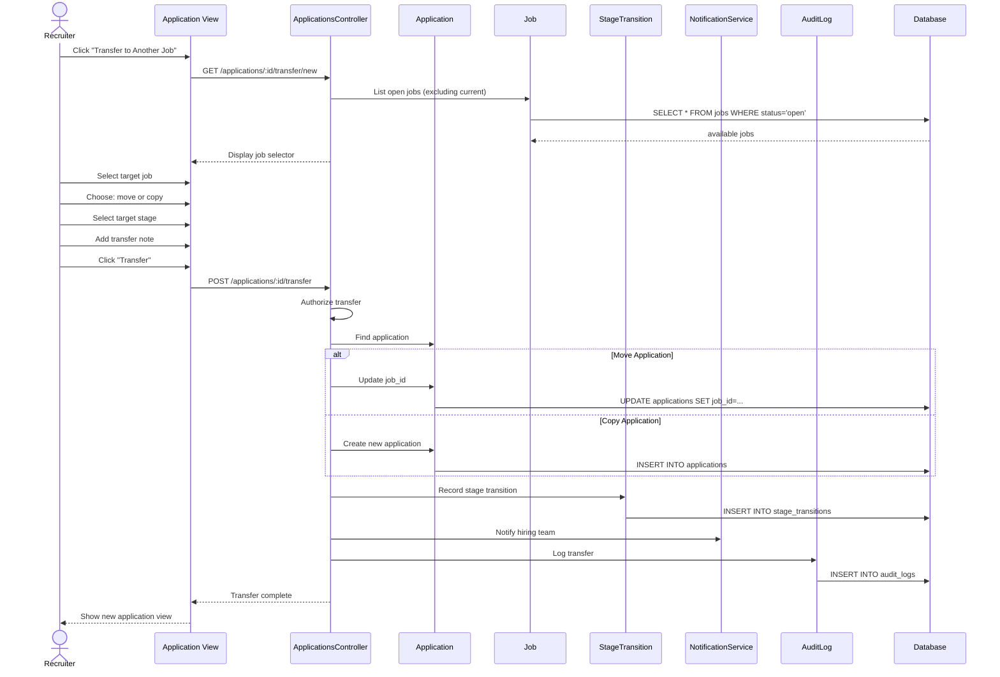

# UC-110: Transfer to Another Job

## Metadata

| Attribute | Value |
|-----------|-------|
| **ID** | UC-110 |
| **Name** | Transfer to Another Job |
| **Functional Area** | Application & Pipeline |
| **Primary Actor** | Recruiter (ACT-02) |
| **Priority** | P2 |
| **Complexity** | Medium |
| **Status** | Draft |

## Description

A recruiter transfers a candidate's application from one job requisition to another. This is useful when a candidate is better suited for a different role, when a job is closed but the candidate should be considered elsewhere, or when consolidating roles. The transfer can either move the existing application or create a new application while preserving the original.

## Actors

| Actor | Role in Use Case |
|-------|------------------|
| Recruiter (ACT-02) | Initiates and executes the transfer |
| Hiring Manager (ACT-03) | May transfer within their jobs |
| System (ACT-10) | Sends notifications and logs activity |

## Preconditions

- [ ] User is authenticated and has Recruiter or Hiring Manager role
- [ ] Source application exists and is not in terminal state (hired/rejected)
- [ ] Target job exists and is accepting applications (status = open)
- [ ] Target job is in the same organization

## Postconditions

### Success
- [ ] Application associated with new job
- [ ] Stage transition recorded
- [ ] Original application handled (moved or preserved)
- [ ] Hiring team of new job notified
- [ ] Audit log entry created
- [ ] Candidate optionally notified

### Failure
- [ ] Application remains with original job
- [ ] Error message displayed

## Triggers

- Recruiter clicks "Transfer to Another Job" from application view
- Recruiter selects applications for bulk transfer
- Job closure workflow suggests transfers

## Basic Flow



| Step | Actor | Action | System Response |
|------|-------|--------|-----------------|
| 1 | Recruiter | Clicks "Transfer to Another Job" | Transfer dialog opens |
| 2 | System | Loads available jobs | Open jobs listed |
| 3 | Recruiter | Selects target job | Job selected |
| 4 | Recruiter | Chooses move or copy | Transfer mode set |
| 5 | Recruiter | Selects target stage | Stage selected |
| 6 | Recruiter | Adds transfer note | Note captured |
| 7 | Recruiter | Clicks "Transfer" | Transfer initiated |
| 8 | System | Validates permissions | Authorization checked |
| 9 | System | Executes transfer | Application moved/copied |
| 10 | System | Records stage transition | History preserved |
| 11 | System | Sends notifications | Team notified |
| 12 | System | Logs transfer | Audit trail created |
| 13 | System | Shows new application | Redirect to target |

## Alternative Flows

### AF-1: Bulk Transfer on Job Close

**Trigger:** Job is being closed with active candidates

| Step | Actor | Action | System Response |
|------|-------|--------|-----------------|
| 1.1 | System | Detects active applications | On job close |
| 1.2 | System | Prompts for transfer options | Dialog shown |
| 1.3 | Recruiter | Selects candidates to transfer | Multi-select |
| 1.4 | Recruiter | Chooses target job(s) | Assignments made |
| 1.5 | System | Executes bulk transfer | All processed |

**Resumption:** Returns to step 10 for each transfer

### AF-2: Transfer with Stage Mapping

**Trigger:** Target job has different stage names

| Step | Actor | Action | System Response |
|------|-------|--------|-----------------|
| 5.1 | System | Detects stage mismatch | Different stages |
| 5.2 | System | Shows stage mapping | Equivalent stages suggested |
| 5.3 | Recruiter | Confirms or selects stage | Mapping applied |

**Resumption:** Returns to step 6

## Exception Flows

### EF-1: Target Job Closed

**Trigger:** Target job no longer accepting applications

| Step | Actor | Action | System Response |
|------|-------|--------|-----------------|
| E.1 | System | Validates target job status | Closed/on hold |
| E.2 | System | Displays error | "Job not accepting applications" |
| E.3 | Recruiter | Selects different job | - |

**Resolution:** User selects valid target job

### EF-2: Candidate Already Applied

**Trigger:** Candidate has existing application for target job

| Step | Actor | Action | System Response |
|------|-------|--------|-----------------|
| E.1 | System | Checks for existing application | Duplicate found |
| E.2 | System | Shows existing application | Link provided |
| E.3 | Recruiter | Chooses to merge or cancel | Decision made |

**Resolution:** User decides on handling duplicate

### EF-3: Insufficient Permissions

**Trigger:** User lacks permission for target job

| Step | Actor | Action | System Response |
|------|-------|--------|-----------------|
| E.1 | System | Checks user access to target job | No permission |
| E.2 | System | Hides job from list or shows error | Access denied |

**Resolution:** User selects job they have access to

## Business Rules

| ID | Rule | Description |
|----|------|-------------|
| BR-1 | Same Organization | Target job must be in same organization |
| BR-2 | Open Jobs Only | Can only transfer to open jobs |
| BR-3 | Non-Terminal Source | Cannot transfer hired/rejected applications |
| BR-4 | History Preserved | All previous activity retained in audit log |
| BR-5 | Duplicate Handling | Cannot have two active applications for same job |

## Data Requirements

### Input Data

| Field | Type | Required | Validation |
|-------|------|----------|------------|
| application_id | integer | Yes | Existing, non-terminal |
| target_job_id | integer | Yes | Open job in same org |
| transfer_mode | enum | Yes | 'move' or 'copy' |
| target_stage_id | integer | No | Valid stage for target job |
| transfer_note | text | No | Max 1000 chars |
| notify_candidate | boolean | No | Default false |

### Output Data

| Field | Type | Description |
|-------|------|-------------|
| application_id | integer | Transferred/new application ID |
| previous_job_id | integer | Original job (if moved) |
| previous_stage | string | Stage before transfer |
| new_stage | string | Stage after transfer |

## Database Transactions

### Tables Affected

| Table | Operation | Conditions |
|-------|-----------|------------|
| applications | UPDATE/CREATE | Move or copy |
| stage_transitions | CREATE | Record transfer |
| audit_logs | CREATE | Transfer logging |
| notifications | CREATE | Team notifications |

### Transaction Detail

```sql
BEGIN TRANSACTION;

-- For MOVE: Update existing application
UPDATE applications
SET job_id = @target_job_id,
    current_stage_id = @target_stage_id,
    updated_at = NOW()
WHERE id = @application_id;

-- For COPY: Create new application
INSERT INTO applications (
    candidate_id, job_id, current_stage_id,
    source_id, organization_id, status, created_at
)
SELECT candidate_id, @target_job_id, @target_stage_id,
       source_id, organization_id, 'new', NOW()
FROM applications WHERE id = @application_id
RETURNING id INTO @new_application_id;

-- Record stage transition
INSERT INTO stage_transitions (
    application_id, from_stage_id, to_stage_id,
    transition_type, notes, user_id, created_at
)
VALUES (
    COALESCE(@new_application_id, @application_id),
    @from_stage_id, @target_stage_id,
    'transfer', @transfer_note, @user_id, NOW()
);

-- Create audit log
INSERT INTO audit_logs (
    action, auditable_type, auditable_id, user_id, metadata, created_at
)
VALUES (
    'application_transferred', 'Application', @application_id, @user_id,
    '{"from_job": @from_job_id, "to_job": @target_job_id, "mode": "..."}',
    NOW()
);

COMMIT;
```

### Rollback Scenarios

| Scenario | Rollback Action |
|----------|-----------------|
| Target job validation fails | No changes made |
| Database error | Full rollback |

## UI/UX Requirements

### Screen/Component

- **Location:** Application detail page > Actions
- **Entry Point:** "Transfer to Another Job" menu item
- **Key Elements:**
  - Job search/dropdown selector
  - Transfer mode toggle (move/copy)
  - Stage selector for target job
  - Transfer note textarea
  - Notify candidate checkbox
  - Transfer/Cancel buttons

### Wireframe Reference

`/designs/wireframes/UC-110-transfer-application.png`

## Non-Functional Requirements

| Requirement | Target |
|-------------|--------|
| Response Time | < 3 seconds |
| Bulk Transfer | Up to 100 applications |

## Security Considerations

- [x] Authentication required
- [x] Authorization check: Access to both source and target jobs
- [x] Organization scoping: Same organization required
- [x] Audit logging: Full transfer details logged

## Related Use Cases

| Use Case | Relationship |
|----------|--------------|
| UC-100 Apply for Job | Creates original application |
| UC-103 Move Stage | Similar stage transition logic |
| UC-008 Close Job | May trigger bulk transfer |
| UC-105 Reject Candidate | Alternative to transfer |

---

## Data Model References

### Subject Areas

| Subject Area | ID | Relationship |
|--------------|-----|--------------|
| Application Pipeline | SA-05 | Primary |
| Job Requisition | SA-03 | Secondary |

### Entities CRUD

| Entity | C | R | U | D | Notes |
|--------|---|---|---|---|-------|
| Application | ✓ | ✓ | ✓ | | Create (copy) or update (move) |
| Job | | ✓ | | | Read for validation |
| StageTransition | ✓ | | | | Transfer recorded |
| AuditLog | ✓ | | | | Immutable audit entry |
| Notification | ✓ | | | | Team notification |

---

## Process Model References

| Attribute | Value | Link |
|-----------|-------|------|
| **Elementary Business Process** | EP-0310: Transfer Application to Different Job | [PROCESS_MODEL.md](../PROCESS_MODEL.md) |
| **Business Process** | BP-104: Pipeline Management | [PROCESS_MODEL.md](../PROCESS_MODEL.md) |
| **Business Function** | BF-01: Talent Acquisition | [PROCESS_MODEL.md](../PROCESS_MODEL.md) |

### EBP Details

| Attribute | Value |
|-----------|-------|
| **Trigger** | Recruiter initiates transfer |
| **Input** | Application, target job, transfer options |
| **Output** | Application in new job's pipeline |
| **Business Rules** | BR-1 through BR-5 |

---

## Traceability Matrix

| Artifact Type | ID | Name | Link |
|---------------|-----|------|------|
| **Use Case** | UC-110 | Transfer to Another Job | *(this document)* |
| **Elementary Process** | EP-0310 | Transfer Application | [PROCESS_MODEL.md](../PROCESS_MODEL.md) |
| **Business Process** | BP-104 | Pipeline Management | [PROCESS_MODEL.md](../PROCESS_MODEL.md) |
| **Business Function** | BF-01 | Talent Acquisition | [PROCESS_MODEL.md](../PROCESS_MODEL.md) |
| **Primary Actor** | ACT-02 | Recruiter | [ACTORS.md](../ACTORS.md) |
| **Subject Area (Primary)** | SA-05 | Application Pipeline | [DATA_MODEL.md](../DATA_MODEL.md) |
| **Subject Area (Secondary)** | SA-03 | Job Requisition | [DATA_MODEL.md](../DATA_MODEL.md) |

### Implementation Artifacts

| Artifact Type | Path/Reference | Status |
|---------------|----------------|--------|
| Controller | `app/controllers/admin/applications_controller.rb` | Implemented |
| Service | `app/services/transfer_application_service.rb` | Planned |
| Model | `app/models/application.rb` | Implemented |

---

## Open Questions

1. Should transfers reset candidate rating/scores?
2. Preserve interview history from original job?

## Change History

| Version | Date | Author | Changes |
|---------|------|--------|---------|
| 0.1 | 2026-01-25 | System | Initial draft |
