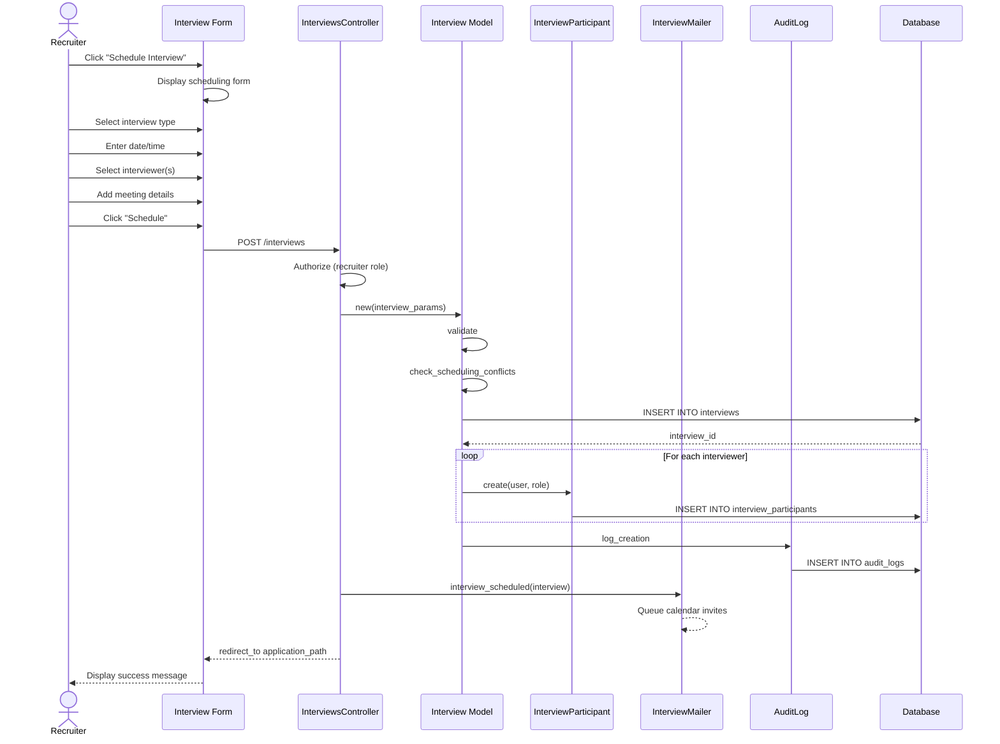

# UC-150: Schedule Interview

## Metadata

| Attribute | Value |
|-----------|-------|
| **ID** | UC-150 |
| **Name** | Schedule Interview |
| **Functional Area** | Interview Management |
| **Primary Actor** | Recruiter (ACT-02) |
| **Priority** | P1 |
| **Complexity** | Medium |
| **Status** | Draft |

## Description

A recruiter schedules an interview for a candidate by selecting the interview type, date/time, duration, location/meeting details, and one or more interviewers. The system creates the interview record, associates participants, and triggers calendar invite distribution.

## Actors

| Actor | Role in Use Case |
|-------|------------------|
| Recruiter (ACT-02) | Creates and configures the interview |
| Hiring Manager (ACT-03) | May schedule interviews for their requisitions |
| Interviewer (ACT-04) | Receives interview assignment and calendar invite |
| Notification Engine (ACT-13) | Sends calendar invites and notifications |

## Preconditions

- [ ] User is authenticated with Recruiter, Hiring Manager, or Admin role
- [ ] Application exists and is in an active status (not rejected/withdrawn/hired)
- [ ] At least one user with interviewer capability exists in the organization
- [ ] Candidate has valid contact information for notifications

## Postconditions

### Success
- [ ] Interview record created with status = 'scheduled'
- [ ] InterviewParticipant records created for all selected interviewers
- [ ] Calendar invites queued for distribution (UC-152)
- [ ] Candidate notification queued
- [ ] Audit log entry created

### Failure
- [ ] No interview record created
- [ ] User shown validation errors (scheduling conflict, invalid time, etc.)
- [ ] No notifications sent

## Triggers

- Recruiter clicks "Schedule Interview" from application detail page
- Recruiter clicks "Add Interview" from candidate timeline
- Hiring Manager schedules interview from their dashboard
- System triggers after candidate self-schedules (UC-153)

## Basic Flow



| Step | Actor | Action | System Response |
|------|-------|--------|-----------------|
| 1 | Recruiter | Clicks "Schedule Interview" | System displays interview scheduling form |
| 2 | Recruiter | Selects interview type (phone, video, onsite, etc.) | Default duration auto-populated |
| 3 | Recruiter | Selects or enters date and time | Date/time captured with timezone |
| 4 | Recruiter | Adjusts duration if needed | Duration field updated |
| 5 | Recruiter | Selects lead interviewer | Lead interviewer assigned |
| 6 | Recruiter | Adds additional interviewers (optional) | Additional participants added |
| 7 | Recruiter | Enters meeting location or video link | Location/URL captured |
| 8 | Recruiter | Adds instructions for candidate (optional) | Instructions captured |
| 9 | Recruiter | Clicks "Schedule Interview" | System validates all fields |
| 10 | System | Validates required fields | Validation passes |
| 11 | System | Checks for scheduling conflicts | No conflicts found |
| 12 | System | Creates Interview record | Interview saved with status='scheduled' |
| 13 | System | Creates InterviewParticipant records | Participants associated |
| 14 | System | Queues calendar invites | Invites queued (triggers UC-152) |
| 15 | System | Creates audit log entry | Audit record saved |
| 16 | System | Redirects to application page | Success message displayed |

## Alternative Flows

### AF-1: Schedule Panel Interview

**Trigger:** Recruiter selects "Panel" as interview type at step 2

| Step | Actor | Action | System Response |
|------|-------|--------|-----------------|
| 2a | Recruiter | Selects "Panel" interview type | Duration set to 90 minutes |
| 5a | Recruiter | Must select lead interviewer | Lead designation required |
| 6a | Recruiter | Adds multiple interviewers | At least 2 interviewers required |
| 6b | Recruiter | Assigns roles (interviewer, shadow, note_taker) | Roles assigned to each participant |

**Resumption:** Continues at step 7 of basic flow

### AF-2: Schedule with Self-Scheduling Option

**Trigger:** Recruiter wants candidate to pick time slot at step 3

| Step | Actor | Action | System Response |
|------|-------|--------|-----------------|
| 3a | Recruiter | Clicks "Enable Self-Scheduling" | Self-schedule form displayed |
| 3b | Recruiter | Defines available time slots | Slots added to available_slots array |
| 3c | Recruiter | Sets scheduling window | Start/end dates captured |
| 3d | Recruiter | Clicks "Send to Candidate" | Self-schedule created (UC-153) |

**Resumption:** Use case ends, candidate flow continues in UC-153

### AF-3: Schedule Recurring Interviews

**Trigger:** Recruiter needs to schedule multiple interview rounds

| Step | Actor | Action | System Response |
|------|-------|--------|-----------------|
| 9a | Recruiter | Clicks "Add Another Round" | Additional interview form displayed |
| 9b | Recruiter | Configures second interview | Second interview details captured |
| 9c | Recruiter | Repeats for additional rounds | Multiple interviews prepared |
| 9d | Recruiter | Clicks "Schedule All" | All interviews created sequentially |

**Resumption:** Basic flow step 10 executed for each interview

## Exception Flows

### EF-1: Scheduling Conflict Detected

**Trigger:** Selected time conflicts with interviewer's calendar at step 11

| Step | Actor | Action | System Response |
|------|-------|--------|-----------------|
| 11.1 | System | Detects overlapping interview | Displays conflict warning |
| 11.2 | System | Shows conflicting appointment | Conflict details displayed |
| 11.3 | Recruiter | Selects different time | Time updated |
| 11.4 | Recruiter | Or removes conflicting interviewer | Participant removed |

**Resolution:** Returns to step 9, continues if valid

### EF-2: Interview Time in Past

**Trigger:** Selected datetime is before current time at step 10

| Step | Actor | Action | System Response |
|------|-------|--------|-----------------|
| 10.1 | System | Detects past datetime | Displays error message |
| 10.2 | Recruiter | Selects future date/time | Datetime updated |

**Resolution:** Returns to step 9, continues if valid

### EF-3: Application No Longer Active

**Trigger:** Application status changed while scheduling

| Step | Actor | Action | System Response |
|------|-------|--------|-----------------|
| E.1 | System | Detects inactive application | Displays error message |
| E.2 | System | Prevents interview creation | Form disabled |
| E.3 | Recruiter | Navigates to application | Sees updated status |

**Resolution:** Use case terminates, no interview created

## Business Rules

| ID | Rule | Description |
|----|------|-------------|
| BR-150.1 | Future Scheduling | Interview scheduled_at must be in the future |
| BR-150.2 | Active Application | Application must be in active status (not rejected/withdrawn/hired) |
| BR-150.3 | Valid Duration | Duration must be between 15 and 480 minutes |
| BR-150.4 | Same Organization | All interviewers must belong to same organization |
| BR-150.5 | Lead Required | Panel interviews require a designated lead interviewer |
| BR-150.6 | Conflict Check | System should warn (not block) on interviewer schedule conflicts |

## Data Requirements

### Input Data

| Field | Type | Required | Validation |
|-------|------|----------|------------|
| application_id | integer | Yes | Must exist and be active |
| interview_type | enum | Yes | phone_screen, video, onsite, panel, technical, cultural_fit |
| scheduled_at | datetime | Yes | Must be in future |
| duration_minutes | integer | Yes | 15-480 minutes |
| timezone | string | Yes | Valid IANA timezone |
| title | string | No | Max 255 chars (auto-generated if blank) |
| location | string | No | Max 500 chars |
| video_url | string | No | Valid URL format |
| instructions | text | No | Max 5000 chars |
| interviewer_ids | array | Yes | At least one valid user_id |
| lead_interviewer_id | integer | No | Required for panel type |

### Output Data

| Field | Type | Description |
|-------|------|-------------|
| id | integer | Unique interview identifier |
| status | enum | 'scheduled' (initial) |
| created_at | datetime | Timestamp of creation |
| job_id | integer | Associated job (from application) |

## Database Transactions

### Tables Affected

| Table | Operation | Conditions |
|-------|-----------|------------|
| interviews | CREATE | Always |
| interview_participants | CREATE | One per interviewer |
| audit_logs | CREATE | Always |

### Transaction Detail

```sql
-- Schedule Interview Transaction
BEGIN TRANSACTION;

-- Step 1: Insert interview record
INSERT INTO interviews (
    organization_id,
    application_id,
    job_id,
    scheduled_by_id,
    interview_type,
    title,
    scheduled_at,
    duration_minutes,
    timezone,
    location,
    video_url,
    instructions,
    status,
    created_at,
    updated_at
) VALUES (
    @organization_id,
    @application_id,
    @job_id,
    @current_user_id,
    @interview_type,
    @title,
    @scheduled_at,
    @duration_minutes,
    @timezone,
    @location,
    @video_url,
    @instructions,
    'scheduled',
    NOW(),
    NOW()
);

SET @interview_id = LAST_INSERT_ID();

-- Step 2: Insert interview participants
INSERT INTO interview_participants (
    interview_id,
    user_id,
    role,
    status,
    created_at,
    updated_at
) VALUES
    (@interview_id, @lead_interviewer_id, 'lead', 'pending', NOW(), NOW()),
    (@interview_id, @interviewer_2_id, 'interviewer', 'pending', NOW(), NOW());

-- Step 3: Create audit log entry
INSERT INTO audit_logs (
    organization_id,
    user_id,
    action,
    auditable_type,
    auditable_id,
    metadata,
    ip_address,
    user_agent,
    created_at
) VALUES (
    @organization_id,
    @current_user_id,
    'interview.scheduled',
    'Interview',
    @interview_id,
    JSON_OBJECT(
        'interview_type', @interview_type,
        'scheduled_at', @scheduled_at,
        'candidate_name', @candidate_name,
        'job_title', @job_title,
        'interviewer_count', @interviewer_count
    ),
    @ip_address,
    @user_agent,
    NOW()
);

COMMIT;
```

### Rollback Scenarios

| Scenario | Rollback Action |
|----------|-----------------|
| Validation failure | No transaction started, return errors |
| Participant creation failure | Full rollback, delete interview |
| Notification failure | Log error but commit interview (non-critical) |

## UI/UX Requirements

### Screen/Component

- **Location:** /applications/:id/interviews/new
- **Entry Point:**
  - "Schedule Interview" button on application detail
  - "Add Interview" in candidate timeline
  - Quick action from pipeline card
- **Key Elements:**
  - Interview type selector with icons
  - Date/time picker with timezone
  - Duration dropdown (15, 30, 45, 60, 90, 120 min)
  - Interviewer search/select (multi-select for panel)
  - Location/video URL input
  - Instructions textarea
  - Calendar preview showing selected slot

### Form Layout

```
+---------------------------------------------------------------+
| Schedule Interview                                              |
| Candidate: John Smith - Software Engineer                       |
+-----------------------------------------------------------------+
| Interview Type                                                  |
| [Phone] [Video] [On-site] [Panel] [Technical] [Cultural]       |
|                                                                 |
| Date & Time                              Duration               |
| +-------------------------+  +--------+  +---------------+      |
| | Jan 25, 2026           |  | 10:00  |  | 45 minutes  v |      |
| +-------------------------+  +--------+  +---------------+      |
|                                                                 |
| Timezone: America/New_York                                      |
|                                                                 |
| Interviewer(s) *                                                |
| +-------------------------------------------------------+      |
| | Search team members...                              v |      |
| +-------------------------------------------------------+      |
| [x] Sarah Johnson (Lead)  [x] Mike Chen (Interviewer)          |
|                                                                 |
| Location / Meeting Details                                      |
| +-------------------------------------------------------+      |
| | Conference Room A / https://zoom.us/j/123456         |      |
| +-------------------------------------------------------+      |
|                                                                 |
| Instructions for Candidate (optional)                           |
| +-------------------------------------------------------+      |
| | Please arrive 10 minutes early...                     |      |
| |                                                       |      |
| +-------------------------------------------------------+      |
|                                                                 |
| [ ] Enable candidate self-scheduling                            |
|                                                                 |
+-----------------------------------------------------------------+
| [Cancel]                              [Schedule Interview]      |
+-----------------------------------------------------------------+
```

## Non-Functional Requirements

| Requirement | Target |
|-------------|--------|
| Response Time | Form load < 1s, save < 2s |
| Availability | 99.9% |
| Calendar Sync | Invites sent within 30 seconds |

## Security Considerations

- [x] Authentication required
- [x] Authorization check: User must have recruiter/hiring_manager/admin role
- [x] Organization scoping: Interview created within user's organization only
- [x] Application access: User must have access to the application
- [x] Audit logging: Scheduling logged with user, timestamp, IP

## Related Use Cases

| Use Case | Relationship |
|----------|--------------|
| UC-151 Create Interview Panel | Variant for multi-interviewer setup |
| UC-152 Send Calendar Invite | Triggered after scheduling |
| UC-153 Candidate Self-Schedule | Alternative flow for candidate-driven scheduling |
| UC-154 Reschedule Interview | Can follow to change time |
| UC-155 Cancel Interview | Can follow to cancel |
| UC-156 Confirm Attendance | Follows when participants confirm |

---

## Data Model References

> Cross-references to [DATA_MODEL.md](../DATA_MODEL.md) and [CRUD_MATRIX.md](../CRUD_MATRIX.md)

### Subject Areas

| Subject Area | ID | Relationship |
|--------------|-----|--------------|
| Interview | SA-06 | Primary |
| Application Pipeline | SA-05 | Secondary |
| Communication | SA-10 | Reference |

### Entities CRUD

| Entity | C | R | U | D | Notes |
|--------|---|---|---|---|-------|
| Interview | X | | | | Created in step 12 |
| InterviewParticipant | X | | | | Created in step 13 |
| Application | | X | | | Read to validate active status |
| Job | | X | | | Read for job context |
| User | | X | | | Read for interviewer selection |
| AuditLog | X | | | | Created in step 15 |

**Legend:** C = Create, R = Read, U = Update, D = Delete

---

## Process Model References

> Cross-references to [PROCESS_MODEL.md](../PROCESS_MODEL.md) and [PROCESS_CRUD_MATRIX.md](../PROCESS_CRUD_MATRIX.md)

| Attribute | Value | Link |
|-----------|-------|------|
| **Elementary Business Process** | EP-0501: Schedule Interview | [PROCESS_MODEL.md#ep-0501](../PROCESS_MODEL.md#elementary-business-processes-4) |
| **Business Process** | BP-201: Interview Coordination | [PROCESS_MODEL.md#bp-201](../PROCESS_MODEL.md#bp-201-interview-coordination) |
| **Business Function** | BF-02: Candidate Evaluation | [PROCESS_MODEL.md#bf-02](../PROCESS_MODEL.md#bf-02-candidate-evaluation) |

### EBP Details

| Attribute | Value |
|-----------|-------|
| **Trigger** | Recruiter initiates interview scheduling from application or candidate view |
| **Input** | Interview type, datetime, duration, interviewers, meeting details |
| **Output** | Scheduled interview with participants, calendar invites triggered |
| **Business Rules** | BR-150.1 through BR-150.6 (see Business Rules section) |

---

## Traceability Matrix

> Complete artifact mapping for requirements traceability

| Artifact Type | ID | Name | Link |
|---------------|-----|------|------|
| **Use Case** | UC-150 | Schedule Interview | *(this document)* |
| **Elementary Process** | EP-0501 | Schedule Interview | [PROCESS_MODEL.md](../PROCESS_MODEL.md#elementary-business-processes-4) |
| **Business Process** | BP-201 | Interview Coordination | [PROCESS_MODEL.md](../PROCESS_MODEL.md#bp-201-interview-coordination) |
| **Business Function** | BF-02 | Candidate Evaluation | [PROCESS_MODEL.md](../PROCESS_MODEL.md#bf-02-candidate-evaluation) |
| **Primary Actor** | ACT-02 | Recruiter | [ACTORS.md](../ACTORS.md#act-02-recruiter) |
| **Subject Area (Primary)** | SA-06 | Interview | [DATA_MODEL.md](../DATA_MODEL.md#sa-06-interview) |
| **Subject Area (Secondary)** | SA-05 | Application Pipeline | [DATA_MODEL.md](../DATA_MODEL.md#sa-05-application-pipeline) |
| **CRUD Matrix Row** | UC-150 | - | [CRUD_MATRIX.md](../CRUD_MATRIX.md#uc-150) |
| **Process CRUD Row** | EP-0501 | - | [PROCESS_CRUD_MATRIX.md](../PROCESS_CRUD_MATRIX.md#ep-0501) |

### Implementation Artifacts

| Artifact Type | Path/Reference | Status |
|---------------|----------------|--------|
| Controller | `app/controllers/interviews_controller.rb` | Implemented |
| Model | `app/models/interview.rb` | Implemented |
| Model | `app/models/interview_participant.rb` | Implemented |
| Policy | `app/policies/interview_policy.rb` | Implemented |
| View | `app/views/interviews/new.html.erb` | Implemented |
| Mailer | `app/mailers/interview_mailer.rb` | Implemented |
| Test | `test/controllers/interviews_controller_test.rb` | Implemented |

---

## Open Questions

1. Should we integrate with external calendar APIs to check interviewer availability?
2. What is the minimum notice required before an interview can be scheduled?
3. Should interviews be automatically linked to specific pipeline stages?

## Change History

| Version | Date | Author | Changes |
|---------|------|--------|---------|
| 0.1 | 2026-01-25 | System | Initial draft |
