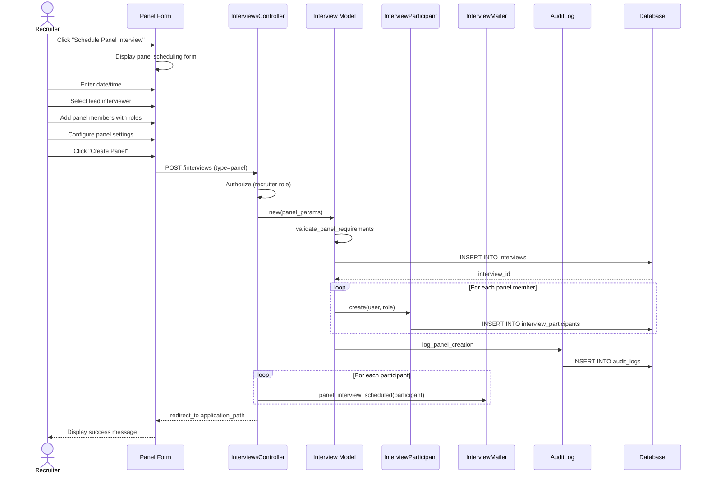

# UC-151: Create Interview Panel

## Metadata

| Attribute | Value |
|-----------|-------|
| **ID** | UC-151 |
| **Name** | Create Interview Panel |
| **Functional Area** | Interview Management |
| **Primary Actor** | Recruiter (ACT-02) |
| **Priority** | P2 |
| **Complexity** | Medium |
| **Status** | Draft |

## Description

A recruiter creates a panel interview session with multiple interviewers, each assigned a specific role (lead, interviewer, shadow, or note-taker). The panel format enables comprehensive candidate evaluation through diverse perspectives while coordinating schedules across multiple participants.

## Actors

| Actor | Role in Use Case |
|-------|------------------|
| Recruiter (ACT-02) | Creates and configures the panel interview |
| Hiring Manager (ACT-03) | Often designated as lead interviewer |
| Interviewer (ACT-04) | Participates as panel member with assigned role |
| Notification Engine (ACT-13) | Sends calendar invites to all participants |

## Preconditions

- [ ] User is authenticated with Recruiter, Hiring Manager, or Admin role
- [ ] Application exists and is in an active status
- [ ] At least two users with interviewer capability exist in the organization
- [ ] Candidate has valid contact information for notifications

## Postconditions

### Success
- [ ] Interview record created with interview_type = 'panel' and status = 'scheduled'
- [ ] Multiple InterviewParticipant records created with assigned roles
- [ ] Exactly one participant designated as 'lead'
- [ ] Calendar invites queued for all participants
- [ ] Candidate notification queued
- [ ] Audit log entry created

### Failure
- [ ] No interview record created
- [ ] User shown validation errors
- [ ] No notifications sent

## Triggers

- Recruiter clicks "Schedule Panel Interview" from application detail
- Recruiter selects "Panel" type in interview scheduling form (UC-150)
- Hiring Manager requests panel interview for final-round candidates

## Basic Flow



| Step | Actor | Action | System Response |
|------|-------|--------|-----------------|
| 1 | Recruiter | Clicks "Schedule Panel Interview" | System displays panel interview form |
| 2 | Recruiter | Enters interview title | Title captured |
| 3 | Recruiter | Selects date and time | Datetime captured with timezone |
| 4 | Recruiter | Sets duration (default 90 minutes) | Duration captured |
| 5 | Recruiter | Searches and selects lead interviewer | Lead interviewer added with 'lead' role |
| 6 | Recruiter | Adds additional interviewers | Each added with 'interviewer' role |
| 7 | Recruiter | Optionally adds shadow/note-taker | Participants added with specified roles |
| 8 | Recruiter | Enters meeting location or video link | Location/URL captured |
| 9 | Recruiter | Selects interview kit (optional) | Kit linked for all panel members |
| 10 | Recruiter | Adds special instructions | Instructions captured |
| 11 | Recruiter | Clicks "Create Panel" | System validates all fields |
| 12 | System | Validates panel requirements | Min 2 interviewers, exactly 1 lead |
| 13 | System | Checks scheduling conflicts | Warnings displayed if conflicts |
| 14 | System | Creates Interview record | Interview saved with type='panel' |
| 15 | System | Creates InterviewParticipant records | All participants saved with roles |
| 16 | System | Queues calendar invites | Invites queued for all participants |
| 17 | System | Creates audit log entry | Audit record saved |
| 18 | System | Redirects to application page | Success message displayed |

## Alternative Flows

### AF-1: Add Participants from Hiring Team

**Trigger:** Recruiter clicks "Add from Hiring Team" at step 6

| Step | Actor | Action | System Response |
|------|-------|--------|-----------------|
| 6a | Recruiter | Clicks "Add from Hiring Team" | Hiring team members displayed |
| 6b | Recruiter | Selects team members to add | Members pre-populated with default roles |
| 6c | Recruiter | Adjusts roles as needed | Roles updated |

**Resumption:** Continues at step 7 of basic flow

### AF-2: Clone from Previous Panel

**Trigger:** Recruiter wants to replicate a previous panel structure

| Step | Actor | Action | System Response |
|------|-------|--------|-----------------|
| 1a | Recruiter | Selects "Clone Previous Panel" | Previous panels listed |
| 1b | Recruiter | Selects panel to clone | Form pre-populated with participants |
| 1c | Recruiter | Adjusts date/time | New schedule set |

**Resumption:** Continues at step 6 of basic flow

### AF-3: Assign Focus Areas

**Trigger:** Recruiter wants each interviewer to focus on specific competencies

| Step | Actor | Action | System Response |
|------|-------|--------|-----------------|
| 7a | Recruiter | Clicks "Assign Focus Areas" | Focus area assignment UI appears |
| 7b | Recruiter | Assigns competencies per interviewer | Focus areas linked to participants |
| 7c | System | Links relevant scorecard sections | Personalized kits prepared |

**Resumption:** Continues at step 8 of basic flow

## Exception Flows

### EF-1: Insufficient Interviewers

**Trigger:** Fewer than 2 interviewers selected at step 12

| Step | Actor | Action | System Response |
|------|-------|--------|-----------------|
| 12.1 | System | Detects insufficient interviewers | Displays error message |
| 12.2 | System | Highlights interviewer section | Indicates minimum required |
| 12.3 | Recruiter | Adds additional interviewers | Count updated |

**Resolution:** Returns to step 11, continues if valid

### EF-2: No Lead Interviewer Designated

**Trigger:** No lead interviewer assigned at step 12

| Step | Actor | Action | System Response |
|------|-------|--------|-----------------|
| 12.1 | System | Detects missing lead | Displays error message |
| 12.2 | Recruiter | Designates lead interviewer | Lead role assigned |

**Resolution:** Returns to step 11, continues if valid

### EF-3: Multiple Leads Selected

**Trigger:** More than one lead interviewer assigned

| Step | Actor | Action | System Response |
|------|-------|--------|-----------------|
| 12.1 | System | Detects multiple leads | Displays warning |
| 12.2 | Recruiter | Selects single lead | Other leads changed to interviewer |

**Resolution:** Returns to step 11, continues if valid

### EF-4: Interviewer Unavailable

**Trigger:** Selected interviewer has conflicting appointment

| Step | Actor | Action | System Response |
|------|-------|--------|-----------------|
| 13.1 | System | Detects calendar conflict | Displays warning with details |
| 13.2 | System | Shows conflicting appointment | Option to proceed or change |
| 13.3 | Recruiter | Chooses different time or interviewer | Conflict resolved |

**Resolution:** Returns to step 11 if time changed, otherwise continues

## Business Rules

| ID | Rule | Description |
|----|------|-------------|
| BR-151.1 | Minimum Participants | Panel interviews require at least 2 active interviewers (lead + interviewer roles) |
| BR-151.2 | Single Lead | Exactly one participant must have 'lead' role |
| BR-151.3 | Default Duration | Panel interviews default to 90 minutes |
| BR-151.4 | Role Assignment | Valid roles: lead, interviewer, shadow, note_taker |
| BR-151.5 | Shadow Restrictions | Shadows and note-takers do not submit scorecards |
| BR-151.6 | Same Organization | All panel members must be in the same organization |

## Data Requirements

### Input Data

| Field | Type | Required | Validation |
|-------|------|----------|------------|
| application_id | integer | Yes | Must exist and be active |
| title | string | No | Max 255 chars (auto-generated if blank) |
| scheduled_at | datetime | Yes | Must be in future |
| duration_minutes | integer | Yes | Default 90, range 30-480 |
| timezone | string | Yes | Valid IANA timezone |
| location | string | No | Max 500 chars |
| video_url | string | No | Valid URL format |
| instructions | text | No | Max 5000 chars |
| participants | array | Yes | At least 2 members |
| participants[].user_id | integer | Yes | Valid user in organization |
| participants[].role | enum | Yes | lead, interviewer, shadow, note_taker |

### Output Data

| Field | Type | Description |
|-------|------|-------------|
| id | integer | Unique interview identifier |
| interview_type | enum | 'panel' |
| status | enum | 'scheduled' |
| participant_count | integer | Number of panel members |

## Database Transactions

### Tables Affected

| Table | Operation | Conditions |
|-------|-----------|------------|
| interviews | CREATE | Always with interview_type='panel' |
| interview_participants | CREATE | One per panel member |
| audit_logs | CREATE | Always |

### Transaction Detail

```sql
-- Create Panel Interview Transaction
BEGIN TRANSACTION;

-- Step 1: Insert panel interview record
INSERT INTO interviews (
    organization_id,
    application_id,
    job_id,
    scheduled_by_id,
    interview_type,
    title,
    scheduled_at,
    duration_minutes,
    timezone,
    location,
    video_url,
    instructions,
    status,
    created_at,
    updated_at
) VALUES (
    @organization_id,
    @application_id,
    @job_id,
    @current_user_id,
    'panel',
    @title,
    @scheduled_at,
    90,  -- Default panel duration
    @timezone,
    @location,
    @video_url,
    @instructions,
    'scheduled',
    NOW(),
    NOW()
);

SET @interview_id = LAST_INSERT_ID();

-- Step 2: Insert panel participants
-- Lead interviewer
INSERT INTO interview_participants (
    interview_id, user_id, role, status, created_at, updated_at
) VALUES (@interview_id, @lead_id, 'lead', 'pending', NOW(), NOW());

-- Additional interviewers
INSERT INTO interview_participants (
    interview_id, user_id, role, status, created_at, updated_at
) VALUES
    (@interview_id, @interviewer_1_id, 'interviewer', 'pending', NOW(), NOW()),
    (@interview_id, @interviewer_2_id, 'interviewer', 'pending', NOW(), NOW());

-- Optional: Shadow and note-taker
INSERT INTO interview_participants (
    interview_id, user_id, role, status, created_at, updated_at
) VALUES (@interview_id, @shadow_id, 'shadow', 'pending', NOW(), NOW());

-- Step 3: Create audit log entry
INSERT INTO audit_logs (
    organization_id,
    user_id,
    action,
    auditable_type,
    auditable_id,
    metadata,
    created_at
) VALUES (
    @organization_id,
    @current_user_id,
    'interview.panel_created',
    'Interview',
    @interview_id,
    JSON_OBJECT(
        'interview_type', 'panel',
        'scheduled_at', @scheduled_at,
        'participant_count', @participant_count,
        'lead_interviewer', @lead_name,
        'candidate_name', @candidate_name
    ),
    NOW()
);

COMMIT;
```

### Rollback Scenarios

| Scenario | Rollback Action |
|----------|-----------------|
| Validation failure | No transaction started, return errors |
| Missing lead | Full rollback, return validation error |
| Participant creation failure | Full rollback, delete interview |

## UI/UX Requirements

### Screen/Component

- **Location:** /applications/:id/interviews/new?type=panel
- **Entry Point:**
  - "Schedule Panel Interview" action on application
  - Select "Panel" in interview type (UC-150)
- **Key Elements:**
  - Panel member list with role assignment
  - Drag-and-drop reordering
  - Role dropdown per participant
  - Calendar conflict indicators
  - Focus area assignment (optional)

### Form Layout

```
+---------------------------------------------------------------+
| Schedule Panel Interview                                        |
| Candidate: John Smith - Senior Software Engineer                |
+-----------------------------------------------------------------+
| Panel Title                                                     |
| +-------------------------------------------------------+      |
| | Final Round Panel Interview                           |      |
| +-------------------------------------------------------+      |
|                                                                 |
| Date & Time                              Duration               |
| +-------------------------+  +--------+  +---------------+      |
| | Jan 28, 2026           |  | 14:00  |  | 90 minutes  v |      |
| +-------------------------+  +--------+  +---------------+      |
|                                                                 |
| Panel Members (minimum 2)                     [Add from Team]   |
+-----------------------------------------------------------------+
| [::] Sarah Johnson              [Lead         v]  [x Remove]    |
|      VP Engineering                                             |
|      Focus: Technical Architecture                              |
+-----------------------------------------------------------------+
| [::] Mike Chen                  [Interviewer  v]  [x Remove]    |
|      Senior Developer                                           |
|      Focus: Coding Skills                                       |
+-----------------------------------------------------------------+
| [::] Lisa Park                  [Interviewer  v]  [x Remove]    |
|      Product Manager                                            |
|      Focus: Collaboration                                       |
+-----------------------------------------------------------------+
| [::] Tom Wilson                 [Note Taker   v]  [x Remove]    |
|      HR Coordinator                                             |
+-----------------------------------------------------------------+
| [+ Add Panel Member]                                            |
|                                                                 |
| Meeting Location                                                |
| +-------------------------------------------------------+      |
| | Board Room A / https://zoom.us/j/987654              |      |
| +-------------------------------------------------------+      |
|                                                                 |
| Interview Kit: [Select Kit...                           v]     |
|                                                                 |
| Special Instructions                                            |
| +-------------------------------------------------------+      |
| | Candidate will present 15-min case study...          |      |
| +-------------------------------------------------------+      |
|                                                                 |
+-----------------------------------------------------------------+
| [Cancel]                                  [Create Panel]        |
+-----------------------------------------------------------------+
```

## Non-Functional Requirements

| Requirement | Target |
|-------------|--------|
| Response Time | Form load < 1s, save < 2s |
| Availability | 99.9% |
| Max Panel Size | 10 participants |
| Calendar Sync | All invites sent within 60 seconds |

## Security Considerations

- [x] Authentication required
- [x] Authorization check: User must have recruiter/hiring_manager/admin role
- [x] Organization scoping: All participants must be in same organization
- [x] Role validation: Only valid roles can be assigned
- [x] Audit logging: Panel creation logged with all participants

## Related Use Cases

| Use Case | Relationship |
|----------|--------------|
| UC-150 Schedule Interview | Parent use case (panel is a variant) |
| UC-152 Send Calendar Invite | Triggered for each participant |
| UC-154 Reschedule Interview | Can follow to change panel time |
| UC-156 Confirm Attendance | Each participant confirms separately |
| UC-159 View Interview Kit | Lead distributes kit to panel |

---

## Data Model References

> Cross-references to [DATA_MODEL.md](../DATA_MODEL.md) and [CRUD_MATRIX.md](../CRUD_MATRIX.md)

### Subject Areas

| Subject Area | ID | Relationship |
|--------------|-----|--------------|
| Interview | SA-06 | Primary |
| Application Pipeline | SA-05 | Secondary |
| Identity & Access | SA-01 | Reference |

### Entities CRUD

| Entity | C | R | U | D | Notes |
|--------|---|---|---|---|-------|
| Interview | X | | | | Created with type='panel' |
| InterviewParticipant | X | | | | Multiple created with roles |
| Application | | X | | | Read to validate status |
| User | | X | | | Read for panel member selection |
| InterviewKit | | X | | | Read if kit assigned |
| AuditLog | X | | | | Created on panel creation |

**Legend:** C = Create, R = Read, U = Update, D = Delete

---

## Process Model References

> Cross-references to [PROCESS_MODEL.md](../PROCESS_MODEL.md) and [PROCESS_CRUD_MATRIX.md](../PROCESS_CRUD_MATRIX.md)

| Attribute | Value | Link |
|-----------|-------|------|
| **Elementary Business Process** | EP-0502: Create Panel Interview | [PROCESS_MODEL.md#ep-0502](../PROCESS_MODEL.md#elementary-business-processes-4) |
| **Business Process** | BP-201: Interview Coordination | [PROCESS_MODEL.md#bp-201](../PROCESS_MODEL.md#bp-201-interview-coordination) |
| **Business Function** | BF-02: Candidate Evaluation | [PROCESS_MODEL.md#bf-02](../PROCESS_MODEL.md#bf-02-candidate-evaluation) |

### EBP Details

| Attribute | Value |
|-----------|-------|
| **Trigger** | Recruiter initiates panel interview creation |
| **Input** | Date/time, panel members with roles, meeting details |
| **Output** | Panel interview with multiple participants, invites triggered |
| **Business Rules** | BR-151.1 through BR-151.6 |

---

## Traceability Matrix

> Complete artifact mapping for requirements traceability

| Artifact Type | ID | Name | Link |
|---------------|-----|------|------|
| **Use Case** | UC-151 | Create Interview Panel | *(this document)* |
| **Elementary Process** | EP-0502 | Create Panel Interview | [PROCESS_MODEL.md](../PROCESS_MODEL.md#elementary-business-processes-4) |
| **Business Process** | BP-201 | Interview Coordination | [PROCESS_MODEL.md](../PROCESS_MODEL.md#bp-201-interview-coordination) |
| **Business Function** | BF-02 | Candidate Evaluation | [PROCESS_MODEL.md](../PROCESS_MODEL.md#bf-02-candidate-evaluation) |
| **Primary Actor** | ACT-02 | Recruiter | [ACTORS.md](../ACTORS.md#act-02-recruiter) |
| **Subject Area (Primary)** | SA-06 | Interview | [DATA_MODEL.md](../DATA_MODEL.md#sa-06-interview) |

### Implementation Artifacts

| Artifact Type | Path/Reference | Status |
|---------------|----------------|--------|
| Controller | `app/controllers/interviews_controller.rb` | Implemented |
| Model | `app/models/interview.rb` | Implemented |
| Model | `app/models/interview_participant.rb` | Implemented |
| Policy | `app/policies/interview_policy.rb` | Implemented |
| View | `app/views/interviews/new.html.erb` | Implemented |
| Test | `test/models/interview_test.rb` | Implemented |

---

## Open Questions

1. Should panel members be able to see each other's availability before scheduling?
2. What happens if a panel member declines - should the interview be flagged?
3. Should we support split panel sessions (different interviewers at different times)?

## Change History

| Version | Date | Author | Changes |
|---------|------|--------|---------|
| 0.1 | 2026-01-25 | System | Initial draft |
