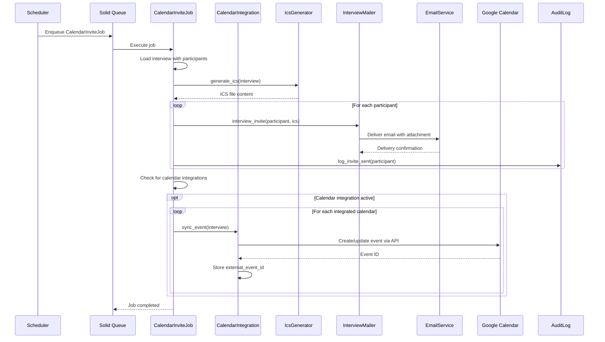

# UC-152: Send Calendar Invite

## Metadata

| Attribute | Value |
|-----------|-------|
| **ID** | UC-152 |
| **Name** | Send Calendar Invite |
| **Functional Area** | Interview Management |
| **Primary Actor** | Notification Engine (ACT-13) |
| **Priority** | P1 |
| **Complexity** | Medium |
| **Status** | Draft |

## Description

The system generates and sends calendar invitations to all interview participants (interviewers and candidate) when an interview is scheduled, rescheduled, or updated. Invites are sent as ICS attachments via email and optionally synchronized directly with external calendar systems (Google Calendar, Outlook) through integrations.

## Actors

| Actor | Role in Use Case |
|-------|------------------|
| Notification Engine (ACT-13) | Generates and dispatches calendar invites |
| Integration Gateway (ACT-12) | Syncs with external calendar systems |
| Scheduler (ACT-11) | Triggers background job for invite delivery |
| Recruiter (ACT-02) | Initial trigger through interview scheduling |
| Interviewer (ACT-04) | Receives calendar invite |
| Candidate (ACT-07) | Receives calendar invite |

## Preconditions

- [ ] Interview record exists with status = 'scheduled'
- [ ] At least one interviewer is assigned to the interview
- [ ] Candidate has valid email address
- [ ] All interviewers have valid email addresses
- [ ] Email service is operational

## Postconditions

### Success
- [ ] ICS calendar file generated with correct event details
- [ ] Email with ICS attachment sent to all interviewers
- [ ] Email with ICS attachment sent to candidate
- [ ] If calendar integration active, events created in external calendars
- [ ] Audit log entry created for each invite sent

### Failure
- [ ] Delivery failures logged
- [ ] Retry queued for failed deliveries
- [ ] Admin notified of persistent failures

## Triggers

- Interview is scheduled (UC-150)
- Interview is rescheduled (UC-154)
- Panel members are added or removed (UC-151)
- Interview details are updated (location, time, etc.)
- Candidate self-schedules (UC-153)

## Basic Flow



| Step | Actor | Action | System Response |
|------|-------|--------|-----------------|
| 1 | Scheduler | Triggers CalendarInviteJob | Job enqueued in Solid Queue |
| 2 | System | Loads interview with associations | Interview, participants, application loaded |
| 3 | System | Validates interview is scheduled | Confirms status is 'scheduled' |
| 4 | System | Generates ICS calendar file | ICS content created with event details |
| 5 | System | Prepares interviewer email | Email template populated |
| 6 | System | Attaches ICS to email | Calendar attachment ready |
| 7 | System | Sends email to each interviewer | Emails dispatched |
| 8 | System | Prepares candidate email | Candidate-specific template used |
| 9 | System | Sends email to candidate | Email dispatched |
| 10 | System | Checks for calendar integrations | Looks up user CalendarIntegration records |
| 11 | System | Creates events via calendar APIs | External events created |
| 12 | System | Stores external event IDs | IDs saved for future updates |
| 13 | System | Logs all invite activities | Audit entries created |
| 14 | System | Marks job complete | Job status updated |

## Alternative Flows

### AF-1: Update Existing Calendar Events

**Trigger:** Interview has been rescheduled (already has external_event_id)

| Step | Actor | Action | System Response |
|------|-------|--------|-----------------|
| 11a | System | Detects existing external_event_id | Update mode activated |
| 11b | System | Calls calendar API update endpoint | Event updated (not created) |
| 11c | System | Sends update invite (METHOD:REQUEST) | Updated ICS sent |

**Resumption:** Continues at step 12 of basic flow

### AF-2: Cancel Existing Events

**Trigger:** Interview has been cancelled (UC-155)

| Step | Actor | Action | System Response |
|------|-------|--------|-----------------|
| 4a | System | Generates cancellation ICS | METHOD:CANCEL in ICS |
| 7a | System | Sends cancellation to interviewers | Cancellation emails sent |
| 9a | System | Sends cancellation to candidate | Cancellation email sent |
| 11a | System | Deletes external calendar events | API delete calls made |

**Resumption:** Use case ends

### AF-3: Selective Invite Update

**Trigger:** Only specific participants need updated invites

| Step | Actor | Action | System Response |
|------|-------|--------|-----------------|
| 2a | System | Receives participant filter | Only specific users processed |
| 7a | System | Sends to filtered participants only | Subset receives invites |

**Resumption:** Continues at step 10 of basic flow

## Exception Flows

### EF-1: Email Delivery Failure

**Trigger:** Email service returns delivery error

| Step | Actor | Action | System Response |
|------|-------|--------|-----------------|
| E.1 | System | Receives delivery failure | Error logged |
| E.2 | System | Checks retry count | Evaluates attempts remaining |
| E.3 | System | Enqueues retry with backoff | Job requeued for later |
| E.4 | System | After max retries, alerts admin | Notification sent |

**Resolution:** Retry up to 3 times with exponential backoff

### EF-2: Calendar API Rate Limit

**Trigger:** External calendar API returns rate limit error

| Step | Actor | Action | System Response |
|------|-------|--------|-----------------|
| E.1 | System | Receives 429 response | Rate limit detected |
| E.2 | System | Reads Retry-After header | Wait time determined |
| E.3 | System | Requeues with delay | Job scheduled for future |

**Resolution:** Respects rate limit, retries after delay

### EF-3: Invalid Candidate Email

**Trigger:** Candidate email address bounces

| Step | Actor | Action | System Response |
|------|-------|--------|-----------------|
| E.1 | System | Receives bounce notification | Bounce logged |
| E.2 | System | Flags candidate record | Email marked invalid |
| E.3 | System | Notifies recruiter | Alert sent to scheduler |

**Resolution:** Recruiter must update candidate email

### EF-4: Calendar Integration Token Expired

**Trigger:** OAuth token for calendar integration has expired

| Step | Actor | Action | System Response |
|------|-------|--------|-----------------|
| E.1 | System | Receives 401 response | Token expired detected |
| E.2 | System | Attempts token refresh | Refresh token used |
| E.3a | System | If refresh succeeds | Retry calendar sync |
| E.3b | System | If refresh fails | Mark integration as needing reauth |
| E.4 | System | Notifies user | Email sent about reauthorization |

**Resolution:** User reauthorizes calendar integration

## Business Rules

| ID | Rule | Description |
|----|------|-------------|
| BR-152.1 | ICS Format | Calendar files must follow iCalendar (RFC 5545) specification |
| BR-152.2 | Timezone Handling | All times in ICS must include timezone information (VTIMEZONE) |
| BR-152.3 | Unique UID | Each interview must have a unique UID for calendar clients |
| BR-152.4 | Organizer | The recruiter who scheduled is listed as ORGANIZER |
| BR-152.5 | Attendee Status | Interviewers listed with PARTSTAT=NEEDS-ACTION |
| BR-152.6 | Candidate Privacy | Candidate email not visible to other attendees in invite |

## Data Requirements

### Input Data

| Field | Type | Required | Validation |
|-------|------|----------|------------|
| interview_id | integer | Yes | Must exist with status='scheduled' |
| action | enum | Yes | create, update, cancel |
| participant_filter | array | No | User IDs to limit recipients |

### Output Data

| Field | Type | Description |
|-------|------|-------------|
| ics_content | text | Generated ICS file content |
| emails_sent | integer | Count of emails dispatched |
| events_synced | integer | Count of external events created/updated |
| delivery_status | hash | Status per recipient |

## ICS File Structure

```ics
BEGIN:VCALENDAR
VERSION:2.0
PRODID:-//Ledgoria//ATS//EN
METHOD:REQUEST
BEGIN:VTIMEZONE
TZID:America/New_York
BEGIN:STANDARD
DTSTART:19701101T020000
RRULE:FREQ=YEARLY;BYMONTH=11;BYDAY=1SU
TZOFFSETFROM:-0400
TZOFFSETTO:-0500
TZNAME:EST
END:STANDARD
BEGIN:DAYLIGHT
DTSTART:19700308T020000
RRULE:FREQ=YEARLY;BYMONTH=3;BYDAY=2SU
TZOFFSETFROM:-0500
TZOFFSETTO:-0400
TZNAME:EDT
END:DAYLIGHT
END:VTIMEZONE
BEGIN:VEVENT
UID:interview-12345@ledgoria.com
DTSTAMP:20260125T150000Z
DTSTART;TZID=America/New_York:20260128T100000
DTEND;TZID=America/New_York:20260128T110000
SUMMARY:Technical Interview - John Smith
DESCRIPTION:Interview for Software Engineer position\n\nCandidate: John Smith\nType: Technical Interview\n\nLocation: Conference Room A
LOCATION:Conference Room A
ORGANIZER;CN=Jane Recruiter:mailto:jane@company.com
ATTENDEE;ROLE=REQ-PARTICIPANT;PARTSTAT=NEEDS-ACTION;CN=Mike Chen:mailto:mike@company.com
ATTENDEE;ROLE=REQ-PARTICIPANT;PARTSTAT=NEEDS-ACTION;CN=Sarah Johnson:mailto:sarah@company.com
STATUS:CONFIRMED
SEQUENCE:0
END:VEVENT
END:VCALENDAR
```

## Database Transactions

### Tables Affected

| Table | Operation | Conditions |
|-------|-----------|------------|
| interviews | READ | Load interview details |
| interview_participants | READ | Load participant list |
| interview_participants | UPDATE | Store external_event_id (if calendar sync) |
| calendar_integrations | READ | Check for active integrations |
| audit_logs | CREATE | Log invite activities |

### Transaction Detail

```sql
-- Calendar Invite Logging (per recipient)
INSERT INTO audit_logs (
    organization_id,
    user_id,
    action,
    auditable_type,
    auditable_id,
    metadata,
    created_at
) VALUES (
    @organization_id,
    NULL,  -- System action
    'interview.invite_sent',
    'Interview',
    @interview_id,
    JSON_OBJECT(
        'recipient_type', @recipient_type,  -- 'interviewer' or 'candidate'
        'recipient_email', @email,
        'invite_type', @action,  -- 'create', 'update', 'cancel'
        'calendar_synced', @calendar_synced,
        'external_event_id', @external_event_id
    ),
    NOW()
);

-- Store external event ID after calendar sync
UPDATE interview_participants
SET external_event_id = @event_id,
    calendar_synced_at = NOW(),
    updated_at = NOW()
WHERE interview_id = @interview_id
  AND user_id = @user_id;
```

## UI/UX Requirements

### Screen/Component

This is primarily a background system process, but status is displayed:

- **Interview Detail Page:** Shows invite delivery status
- **Participant List:** Shows individual sync status icons
- **Email Log:** Lists all sent invites with timestamps

### Status Indicators

```
Interview Details
+-----------------------------------------------------------------+
| Calendar Invites                                                 |
+-----------------------------------------------------------------+
| [check] Sarah Johnson      Sent Jan 25, 10:05 AM   [Google sync] |
| [check] Mike Chen          Sent Jan 25, 10:05 AM   [No sync]     |
| [check] John Smith (Cand.) Sent Jan 25, 10:05 AM                 |
+-----------------------------------------------------------------+
| [Resend Invites]                                                 |
+-----------------------------------------------------------------+
```

## Non-Functional Requirements

| Requirement | Target |
|-------------|--------|
| Processing Time | Job completes within 30 seconds |
| Delivery Rate | 99.5% successful delivery |
| Retry Policy | 3 retries with exponential backoff |
| Rate Limiting | Respect external API limits |

## Security Considerations

- [x] Email content sanitized to prevent injection
- [x] Candidate email protected from other attendees
- [x] OAuth tokens encrypted at rest
- [x] API calls use HTTPS
- [x] Audit logging for all invite activities

## Related Use Cases

| Use Case | Relationship |
|----------|--------------|
| UC-150 Schedule Interview | Triggers this use case |
| UC-151 Create Interview Panel | Triggers for all panel members |
| UC-153 Candidate Self-Schedule | Triggers after slot selection |
| UC-154 Reschedule Interview | Triggers update invites |
| UC-155 Cancel Interview | Triggers cancellation invites |
| UC-455 Configure Calendar Integration | Configures sync settings |

---

## Data Model References

> Cross-references to [DATA_MODEL.md](../DATA_MODEL.md) and [CRUD_MATRIX.md](../CRUD_MATRIX.md)

### Subject Areas

| Subject Area | ID | Relationship |
|--------------|-----|--------------|
| Interview | SA-06 | Primary |
| Communication | SA-10 | Secondary |
| Integration | SA-11 | Reference |

### Entities CRUD

| Entity | C | R | U | D | Notes |
|--------|---|---|---|---|-------|
| Interview | | X | | | Read for event details |
| InterviewParticipant | | X | X | | Read for recipients, update external_event_id |
| Application | | X | | | Read for candidate info |
| Candidate | | X | | | Read for email address |
| CalendarIntegration | | X | | | Check for active sync |
| AuditLog | X | | | | Created for each invite |

**Legend:** C = Create, R = Read, U = Update, D = Delete

---

## Process Model References

> Cross-references to [PROCESS_MODEL.md](../PROCESS_MODEL.md) and [PROCESS_CRUD_MATRIX.md](../PROCESS_CRUD_MATRIX.md)

| Attribute | Value | Link |
|-----------|-------|------|
| **Elementary Business Process** | EP-0503: Send Calendar Invite | [PROCESS_MODEL.md#ep-0503](../PROCESS_MODEL.md#elementary-business-processes-4) |
| **Business Process** | BP-201: Interview Coordination | [PROCESS_MODEL.md#bp-201](../PROCESS_MODEL.md#bp-201-interview-coordination) |
| **Business Function** | BF-02: Candidate Evaluation | [PROCESS_MODEL.md#bf-02](../PROCESS_MODEL.md#bf-02-candidate-evaluation) |

### EBP Details

| Attribute | Value |
|-----------|-------|
| **Trigger** | Interview scheduled, rescheduled, or cancelled |
| **Input** | Interview details, participant list, calendar integrations |
| **Output** | ICS invites sent, external calendar events created |
| **Business Rules** | BR-152.1 through BR-152.6 |

---

## Traceability Matrix

> Complete artifact mapping for requirements traceability

| Artifact Type | ID | Name | Link |
|---------------|-----|------|------|
| **Use Case** | UC-152 | Send Calendar Invite | *(this document)* |
| **Elementary Process** | EP-0503 | Send Calendar Invite | [PROCESS_MODEL.md](../PROCESS_MODEL.md#elementary-business-processes-4) |
| **Business Process** | BP-201 | Interview Coordination | [PROCESS_MODEL.md](../PROCESS_MODEL.md#bp-201-interview-coordination) |
| **Business Function** | BF-02 | Candidate Evaluation | [PROCESS_MODEL.md](../PROCESS_MODEL.md#bf-02-candidate-evaluation) |
| **Primary Actor** | ACT-13 | Notification Engine | [ACTORS.md](../ACTORS.md#act-13-notification-engine) |
| **Subject Area (Primary)** | SA-06 | Interview | [DATA_MODEL.md](../DATA_MODEL.md#sa-06-interview) |

### Implementation Artifacts

| Artifact Type | Path/Reference | Status |
|---------------|----------------|--------|
| Mailer | `app/mailers/interview_mailer.rb` | Implemented |
| Job | `app/jobs/calendar_invite_job.rb` | Planned |
| Model | `app/models/calendar_integration.rb` | Implemented |
| Service | `app/services/ics_generator_service.rb` | Planned |
| Test | `test/mailers/interview_mailer_test.rb` | Implemented |

---

## Open Questions

1. Should we support calendar sync for candidates (if they provide OAuth)?
2. What is the maximum attachment size for ICS files?
3. Should we track whether recipients added the event to their calendar?

## Change History

| Version | Date | Author | Changes |
|---------|------|--------|---------|
| 0.1 | 2026-01-25 | System | Initial draft |
