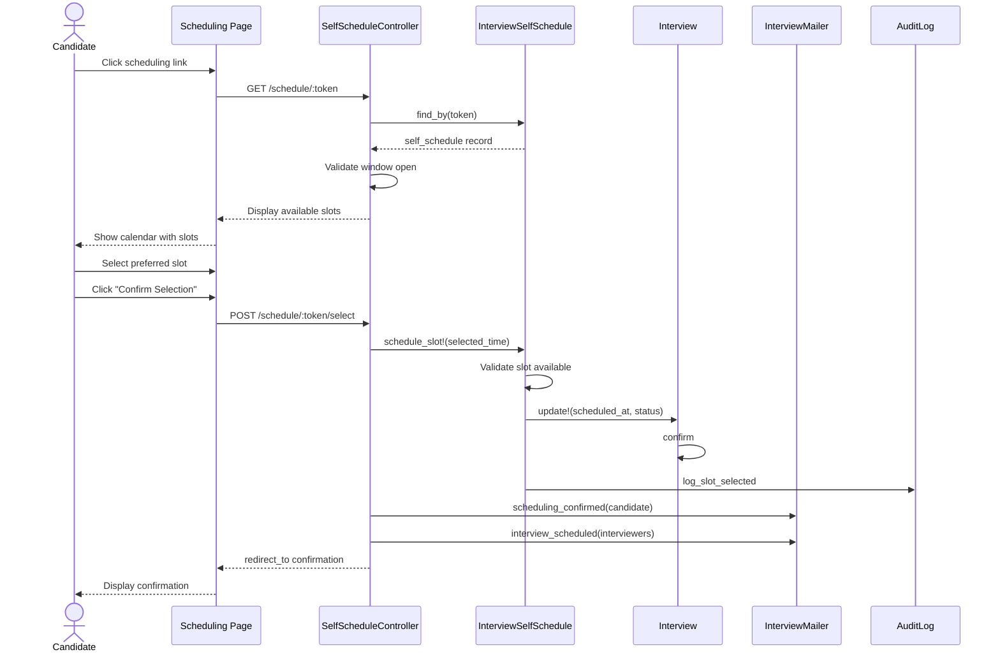

# UC-153: Candidate Self-Schedule

## Metadata

| Attribute | Value |
|-----------|-------|
| **ID** | UC-153 |
| **Name** | Candidate Self-Schedule |
| **Functional Area** | Interview Management |
| **Primary Actor** | Candidate (ACT-07) |
| **Priority** | P1 |
| **Complexity** | Medium |
| **Status** | Draft |

## Description

A candidate receives a self-scheduling link and selects their preferred interview time slot from a set of available options defined by the recruiter. This enables candidates to choose convenient times without back-and-forth communication, improving scheduling efficiency and candidate experience.

## Actors

| Actor | Role in Use Case |
|-------|------------------|
| Candidate (ACT-07) | Selects preferred time slot from available options |
| Recruiter (ACT-02) | Configures available slots and scheduling window |
| Notification Engine (ACT-13) | Sends scheduling link and confirmation |
| Scheduler (ACT-11) | Checks for expiration, sends reminders |

## Preconditions

- [ ] InterviewSelfSchedule record exists with status = 'pending'
- [ ] At least one available time slot is defined
- [ ] Scheduling window is currently open (between starts_at and ends_at)
- [ ] Candidate has received scheduling link email
- [ ] Interview has at least one interviewer assigned

## Postconditions

### Success
- [ ] InterviewSelfSchedule status updated to 'scheduled'
- [ ] Interview.scheduled_at updated to selected slot
- [ ] Interview status changed to 'confirmed'
- [ ] Candidate receives confirmation email
- [ ] Interviewers receive calendar invites (UC-152)
- [ ] Audit log entry created

### Failure
- [ ] No slot selected
- [ ] Self-schedule status remains 'pending'
- [ ] Interview time unchanged

## Triggers

- Candidate clicks scheduling link in email
- Candidate accesses scheduling page from candidate portal
- Reminder email prompts candidate to schedule

## Basic Flow



| Step | Actor | Action | System Response |
|------|-------|--------|-----------------|
| 1 | Candidate | Clicks scheduling link in email | Browser opens scheduling page |
| 2 | System | Validates token | Token found and valid |
| 3 | System | Checks scheduling window | Window is currently open |
| 4 | System | Loads available slots | Slots retrieved from database |
| 5 | System | Displays calendar view | Available slots shown with times |
| 6 | Candidate | Reviews available slots | Slots displayed in candidate's timezone |
| 7 | Candidate | Selects preferred time slot | Slot highlighted |
| 8 | Candidate | Clicks "Confirm Selection" | Selection submitted |
| 9 | System | Validates slot still available | Slot not taken by another action |
| 10 | System | Updates InterviewSelfSchedule | Status set to 'scheduled', selected_slot set |
| 11 | System | Updates Interview | scheduled_at updated, status set to 'confirmed' |
| 12 | System | Creates audit log | Selection logged |
| 13 | System | Sends confirmation to candidate | Confirmation email queued |
| 14 | System | Triggers calendar invites | UC-152 triggered for interviewers |
| 15 | System | Displays confirmation page | Confirmation with details shown |

## Alternative Flows

### AF-1: Candidate Changes Selection

**Trigger:** Candidate wants to select a different slot before final confirmation

| Step | Actor | Action | System Response |
|------|-------|--------|-----------------|
| 7a | Candidate | Clicks different slot | New slot highlighted |
| 7b | System | Updates preview | New time shown in preview |

**Resumption:** Continues at step 8 of basic flow

### AF-2: Scheduling via Candidate Portal

**Trigger:** Candidate accesses scheduling from logged-in portal instead of email link

| Step | Actor | Action | System Response |
|------|-------|--------|-----------------|
| 1a | Candidate | Logs into candidate portal | Portal dashboard displayed |
| 1b | Candidate | Clicks "Schedule Interview" action | Scheduling page displayed |
| 2a | System | Looks up pending self-schedules | Finds matching record |

**Resumption:** Continues at step 3 of basic flow

### AF-3: Multiple Slots Available Same Day

**Trigger:** Recruiter offered multiple slots on the same day

| Step | Actor | Action | System Response |
|------|-------|--------|-----------------|
| 5a | System | Groups slots by date | Daily view with multiple times |
| 6a | Candidate | Expands day to see times | Time slots for that day shown |
| 7a | Candidate | Selects specific time | Time slot highlighted |

**Resumption:** Continues at step 8 of basic flow

## Exception Flows

### EF-1: Scheduling Window Expired

**Trigger:** Candidate accesses link after scheduling_ends_at

| Step | Actor | Action | System Response |
|------|-------|--------|-----------------|
| 3.1 | System | Detects window expired | Displays expiration message |
| 3.2 | System | Updates status to 'expired' | Record marked expired |
| 3.3 | System | Shows contact information | Recruiter contact displayed |
| 3.4 | Candidate | Contacts recruiter | Manual scheduling needed |

**Resolution:** Recruiter creates new self-schedule or schedules manually

### EF-2: Slot No Longer Available

**Trigger:** Selected slot was taken between display and selection (race condition)

| Step | Actor | Action | System Response |
|------|-------|--------|-----------------|
| 9.1 | System | Detects slot unavailable | Error message displayed |
| 9.2 | System | Refreshes available slots | Updated slots loaded |
| 9.3 | System | Displays updated options | New availability shown |
| 9.4 | Candidate | Selects different slot | New selection made |

**Resolution:** Returns to step 8, continues with new selection

### EF-3: Invalid or Expired Token

**Trigger:** Token not found or has been invalidated

| Step | Actor | Action | System Response |
|------|-------|--------|-----------------|
| 2.1 | System | Token lookup fails | Invalid token detected |
| 2.2 | System | Displays error page | "Link invalid or expired" shown |
| 2.3 | System | Suggests next steps | Contact recruiter message |

**Resolution:** Use case terminates, candidate contacts recruiter

### EF-4: No Slots Available

**Trigger:** All offered slots have passed or been marked unavailable

| Step | Actor | Action | System Response |
|------|-------|--------|-----------------|
| 4.1 | System | Finds no available slots | Empty slot list detected |
| 4.2 | System | Displays no availability message | Apology message shown |
| 4.3 | System | Notifies recruiter | Alert sent to scheduler |
| 4.4 | System | Shows contact information | Recruiter contact displayed |

**Resolution:** Recruiter adds more slots or schedules manually

### EF-5: Already Scheduled

**Trigger:** Self-schedule record already has status = 'scheduled'

| Step | Actor | Action | System Response |
|------|-------|--------|-----------------|
| 2.1 | System | Detects already scheduled | Scheduled status found |
| 2.2 | System | Shows confirmation page | Current selection displayed |
| 2.3 | System | Provides calendar details | Interview details shown |

**Resolution:** Candidate sees their scheduled interview

## Business Rules

| ID | Rule | Description |
|----|------|-------------|
| BR-153.1 | Window Enforcement | Selection only allowed within scheduling window |
| BR-153.2 | Slot Availability | Only slots marked as available can be selected |
| BR-153.3 | Single Selection | Each self-schedule allows only one slot selection |
| BR-153.4 | Token Security | Token must be valid URL-safe base64 (32 bytes) |
| BR-153.5 | Timezone Display | Slots displayed in candidate's detected/selected timezone |
| BR-153.6 | Buffer Time | Selected slot must be at least buffer_minutes in future |

## Data Requirements

### Input Data

| Field | Type | Required | Validation |
|-------|------|----------|------------|
| token | string | Yes | 43 chars URL-safe base64 |
| selected_slot | datetime | Yes | Must be in available_slots array |
| candidate_timezone | string | No | Valid IANA timezone (for display) |

### Output Data

| Field | Type | Description |
|-------|------|-------------|
| confirmation_number | string | Unique confirmation ID |
| scheduled_at | datetime | Final scheduled interview time |
| interview_details | hash | Location, video link, instructions |
| add_to_calendar_url | string | Link to add to personal calendar |

## Database Transactions

### Tables Affected

| Table | Operation | Conditions |
|-------|-----------|------------|
| interview_self_schedules | READ, UPDATE | Load and update status |
| interviews | UPDATE | Set scheduled_at and confirm |
| audit_logs | CREATE | Log slot selection |

### Transaction Detail

```sql
-- Candidate Self-Schedule Selection
BEGIN TRANSACTION;

-- Step 1: Lock and update self-schedule record
UPDATE interview_self_schedules
SET status = 'scheduled',
    selected_slot = @selected_time,
    scheduled_at = NOW(),
    updated_at = NOW()
WHERE id = @self_schedule_id
  AND status = 'pending'
  AND token = @token;

-- Check row was updated (optimistic locking)
IF ROW_COUNT() = 0 THEN
    ROLLBACK;
    -- Return error: already scheduled or invalid
END IF;

-- Step 2: Update interview with scheduled time
UPDATE interviews
SET scheduled_at = @selected_time,
    duration_minutes = @slot_duration,
    status = 'confirmed',
    confirmed_at = NOW(),
    updated_at = NOW()
WHERE id = @interview_id;

-- Step 3: Create audit log
INSERT INTO audit_logs (
    organization_id,
    user_id,
    action,
    auditable_type,
    auditable_id,
    metadata,
    ip_address,
    user_agent,
    created_at
) VALUES (
    @organization_id,
    NULL,  -- Candidate action (no user_id)
    'interview.self_scheduled',
    'Interview',
    @interview_id,
    JSON_OBJECT(
        'candidate_name', @candidate_name,
        'selected_time', @selected_time,
        'timezone', @candidate_timezone,
        'token', SUBSTRING(@token, 1, 8) || '...',
        'job_title', @job_title
    ),
    @ip_address,
    @user_agent,
    NOW()
);

COMMIT;
```

### Rollback Scenarios

| Scenario | Rollback Action |
|----------|-----------------|
| Slot unavailable | Full rollback, show error |
| Already scheduled | Full rollback, show current selection |
| Interview not found | Full rollback, invalid token error |

## UI/UX Requirements

### Screen/Component

- **Location:** /schedule/:token (public, no auth required)
- **Entry Point:**
  - Email link from recruiter
  - Candidate portal action (if logged in)
- **Key Elements:**
  - Company branding (logo, colors)
  - Calendar/date picker view
  - Available time slots as buttons
  - Timezone selector
  - Interview details (type, duration, interviewers)
  - Confirmation preview before selection

### Form Layout

```
+---------------------------------------------------------------+
|  [Company Logo]                                                |
|                                                                |
|  Schedule Your Interview                                       |
|  Software Engineer position                                    |
+-----------------------------------------------------------------+
|                                                                 |
|  Hello John,                                                    |
|                                                                 |
|  Please select your preferred interview time below.             |
|                                                                 |
|  Interview Type: Technical Interview                            |
|  Duration: 60 minutes                                           |
|  Interviewer: Sarah Johnson, Senior Engineer                    |
|                                                                 |
|  Timezone: [America/New_York            v]                     |
|                                                                 |
+-----------------------------------------------------------------+
|  Available Times                                                |
|                                                                 |
|  Monday, January 27, 2026                                       |
|  +-------------------+  +-------------------+                   |
|  | 9:00 AM - 10:00 AM|  |10:30 AM - 11:30 AM|                   |
|  +-------------------+  +-------------------+                   |
|  +-------------------+                                          |
|  | 2:00 PM - 3:00 PM |                                          |
|  +-------------------+                                          |
|                                                                 |
|  Tuesday, January 28, 2026                                      |
|  +-------------------+  +-------------------+                   |
|  | 9:00 AM - 10:00 AM|  | 1:00 PM - 2:00 PM |                   |
|  +-------------------+  +-------------------+                   |
|                                                                 |
|  Wednesday, January 29, 2026                                    |
|  +-------------------+  +-------------------+                   |
|  |11:00 AM - 12:00 PM|  | 3:00 PM - 4:00 PM |                   |
|  +-------------------+  +-------------------+                   |
|                                                                 |
+-----------------------------------------------------------------+
|  Your Selection: Tuesday, Jan 28 at 1:00 PM EST                 |
|                                                                 |
|  [         Confirm This Time         ]                          |
|                                                                 |
+-----------------------------------------------------------------+
|  Having trouble? Contact jane@company.com                       |
+-----------------------------------------------------------------+
```

### Confirmation Page

```
+---------------------------------------------------------------+
|  [Company Logo]                                                |
|                                                                |
|  Interview Confirmed!                                          |
+-----------------------------------------------------------------+
|                                                                 |
|  Your interview has been scheduled.                             |
|                                                                 |
|  +-----------------------------------------------------------+ |
|  | Technical Interview                                       | |
|  | Tuesday, January 28, 2026                                 | |
|  | 1:00 PM - 2:00 PM EST                                     | |
|  |                                                           | |
|  | Location: https://zoom.us/j/123456789                     | |
|  |                                                           | |
|  | Interviewer: Sarah Johnson, Senior Engineer               | |
|  +-----------------------------------------------------------+ |
|                                                                 |
|  [Add to Google Calendar] [Add to Outlook] [Download .ics]     |
|                                                                 |
|  A confirmation email has been sent to john@email.com          |
|                                                                 |
|  Need to reschedule? Contact jane@company.com                   |
|                                                                 |
+-----------------------------------------------------------------+
```

## Non-Functional Requirements

| Requirement | Target |
|-------------|--------|
| Page Load Time | < 2 seconds |
| Mobile Responsive | Full functionality on mobile |
| Accessibility | WCAG 2.1 AA compliant |
| Availability | 99.9% (public-facing page) |

## Security Considerations

- [x] Token is cryptographically secure (32 bytes random)
- [x] Token does not expose interview or candidate IDs
- [x] Rate limiting on token validation endpoint
- [x] HTTPS required for all scheduling pages
- [x] No authentication required (public access via token)
- [x] Token expires with scheduling window

## Related Use Cases

| Use Case | Relationship |
|----------|--------------|
| UC-150 Schedule Interview | Creates the interview and self-schedule |
| UC-152 Send Calendar Invite | Triggered after slot selection |
| UC-154 Reschedule Interview | Candidate contacts recruiter to change |
| UC-156 Confirm Attendance | Interview auto-confirmed on selection |
| UC-455 Configure Calendar Integration | Enables calendar sync for interviewers |

---

## Data Model References

> Cross-references to [DATA_MODEL.md](../DATA_MODEL.md) and [CRUD_MATRIX.md](../CRUD_MATRIX.md)

### Subject Areas

| Subject Area | ID | Relationship |
|--------------|-----|--------------|
| Interview | SA-06 | Primary |
| Career Site | SA-12 | Secondary (public-facing) |
| Communication | SA-10 | Reference |

### Entities CRUD

| Entity | C | R | U | D | Notes |
|--------|---|---|---|---|-------|
| InterviewSelfSchedule | | X | X | | Read slots, update selection |
| Interview | | X | X | | Read details, update scheduled_at |
| Application | | X | | | Read for candidate context |
| Candidate | | X | | | Read for display name |
| AuditLog | X | | | | Created on selection |

**Legend:** C = Create, R = Read, U = Update, D = Delete

---

## Process Model References

> Cross-references to [PROCESS_MODEL.md](../PROCESS_MODEL.md) and [PROCESS_CRUD_MATRIX.md](../PROCESS_CRUD_MATRIX.md)

| Attribute | Value | Link |
|-----------|-------|------|
| **Elementary Business Process** | EP-0504: Self-Schedule Interview | [PROCESS_MODEL.md#ep-0504](../PROCESS_MODEL.md#elementary-business-processes-4) |
| **Business Process** | BP-201: Interview Coordination | [PROCESS_MODEL.md#bp-201](../PROCESS_MODEL.md#bp-201-interview-coordination) |
| **Business Function** | BF-02: Candidate Evaluation | [PROCESS_MODEL.md#bf-02](../PROCESS_MODEL.md#bf-02-candidate-evaluation) |

### EBP Details

| Attribute | Value |
|-----------|-------|
| **Trigger** | Candidate accesses scheduling link |
| **Input** | Token, selected time slot |
| **Output** | Confirmed interview with selected time |
| **Business Rules** | BR-153.1 through BR-153.6 |

---

## Traceability Matrix

> Complete artifact mapping for requirements traceability

| Artifact Type | ID | Name | Link |
|---------------|-----|------|------|
| **Use Case** | UC-153 | Candidate Self-Schedule | *(this document)* |
| **Elementary Process** | EP-0504 | Self-Schedule Interview | [PROCESS_MODEL.md](../PROCESS_MODEL.md#elementary-business-processes-4) |
| **Business Process** | BP-201 | Interview Coordination | [PROCESS_MODEL.md](../PROCESS_MODEL.md#bp-201-interview-coordination) |
| **Business Function** | BF-02 | Candidate Evaluation | [PROCESS_MODEL.md](../PROCESS_MODEL.md#bf-02-candidate-evaluation) |
| **Primary Actor** | ACT-07 | Candidate | [ACTORS.md](../ACTORS.md#act-07-candidate) |
| **Subject Area (Primary)** | SA-06 | Interview | [DATA_MODEL.md](../DATA_MODEL.md#sa-06-interview) |

### Implementation Artifacts

| Artifact Type | Path/Reference | Status |
|---------------|----------------|--------|
| Controller | `app/controllers/self_schedule_controller.rb` | Planned |
| Model | `app/models/interview_self_schedule.rb` | Implemented |
| View | `app/views/self_schedule/show.html.erb` | Planned |
| Test | `test/models/interview_self_schedule_test.rb` | Implemented |

---

## Open Questions

1. Should candidates be able to reschedule themselves, or only through recruiter?
2. How long should tokens remain valid after the scheduling window closes?
3. Should we support timezone auto-detection from browser?

## Change History

| Version | Date | Author | Changes |
|---------|------|--------|---------|
| 0.1 | 2026-01-25 | System | Initial draft |
