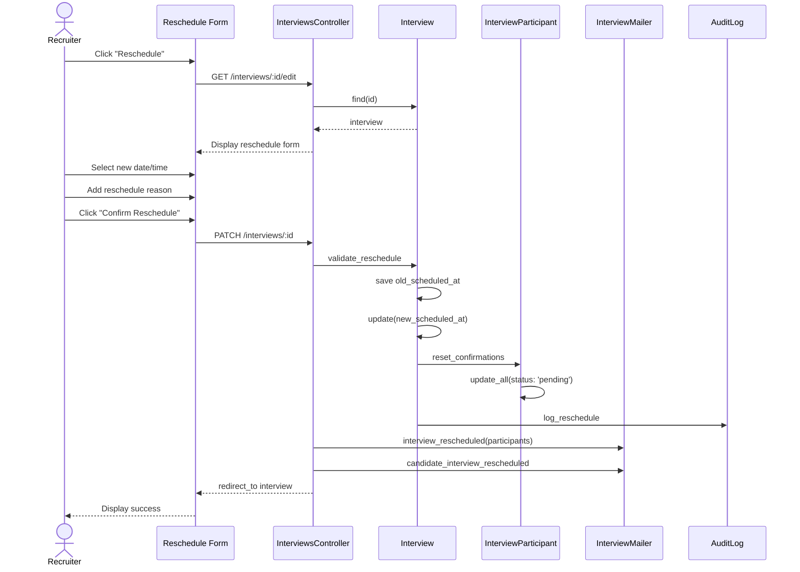

# UC-154: Reschedule Interview

## Metadata

| Attribute | Value |
|-----------|-------|
| **ID** | UC-154 |
| **Name** | Reschedule Interview |
| **Functional Area** | Interview Management |
| **Primary Actor** | Recruiter (ACT-02) |
| **Priority** | P1 |
| **Complexity** | Medium |
| **Status** | Draft |

## Description

A recruiter changes the date, time, or other details of a scheduled interview. The system updates the interview record, sends updated calendar invites to all participants, and notifies the candidate of the change. This is a common workflow when interviewers or candidates have conflicts.

## Actors

| Actor | Role in Use Case |
|-------|------------------|
| Recruiter (ACT-02) | Initiates and completes the reschedule |
| Hiring Manager (ACT-03) | May reschedule interviews for their requisitions |
| Interviewer (ACT-04) | Receives updated calendar invite |
| Candidate (ACT-07) | Receives notification of time change |
| Notification Engine (ACT-13) | Sends update notifications |

## Preconditions

- [ ] Interview exists with status = 'scheduled' or 'confirmed'
- [ ] Interview scheduled_at is in the future
- [ ] User has permission to modify the interview
- [ ] Application is still active

## Postconditions

### Success
- [ ] Interview scheduled_at updated to new time
- [ ] Interview status reset to 'scheduled' (if was 'confirmed')
- [ ] Participant confirmations reset to 'pending'
- [ ] Updated calendar invites sent (UC-152)
- [ ] Candidate notified of reschedule
- [ ] Audit log entry created with old and new times

### Failure
- [ ] Interview time unchanged
- [ ] User shown validation errors
- [ ] No notifications sent

## Triggers

- Recruiter clicks "Reschedule" on interview detail page
- Interviewer requests time change
- Candidate requests time change (communicated to recruiter)
- Scheduling conflict detected

## Basic Flow



| Step | Actor | Action | System Response |
|------|-------|--------|-----------------|
| 1 | Recruiter | Clicks "Reschedule" button | Reschedule form displayed |
| 2 | System | Loads current interview details | Form pre-populated |
| 3 | Recruiter | Selects new date | Date picker updated |
| 4 | Recruiter | Selects new time | Time picker updated |
| 5 | Recruiter | Optionally adjusts duration | Duration captured |
| 6 | Recruiter | Optionally updates location | Location captured |
| 7 | Recruiter | Enters reschedule reason | Reason captured |
| 8 | Recruiter | Clicks "Confirm Reschedule" | System validates |
| 9 | System | Validates new time is in future | Validation passes |
| 10 | System | Checks for scheduling conflicts | Warnings shown if conflicts |
| 11 | System | Saves previous scheduled_at | Old time recorded |
| 12 | System | Updates interview record | New time saved |
| 13 | System | Resets participant confirmations | All set to 'pending' |
| 14 | System | Creates audit log | Change recorded |
| 15 | System | Sends updated calendar invites | UC-152 triggered |
| 16 | System | Notifies candidate | Email sent |
| 17 | System | Displays success message | Confirmation shown |

## Alternative Flows

### AF-1: Change Only Location (No Time Change)

**Trigger:** Recruiter only needs to update meeting details, not time

| Step | Actor | Action | System Response |
|------|-------|--------|-----------------|
| 3a | Recruiter | Leaves date/time unchanged | Same time retained |
| 6a | Recruiter | Updates location or video link | New details captured |
| 13a | System | Does not reset confirmations | Status unchanged |
| 15a | System | Sends update (not reschedule) | Minor update email |

**Resumption:** Use case ends with update completed

### AF-2: Add/Remove Participants During Reschedule

**Trigger:** Recruiter wants to change interviewers while rescheduling

| Step | Actor | Action | System Response |
|------|-------|--------|-----------------|
| 5a | Recruiter | Clicks "Change Interviewers" | Participant list shown |
| 5b | Recruiter | Removes existing interviewer | Participant marked for removal |
| 5c | Recruiter | Adds new interviewer | New participant added |
| 15a | System | Sends cancellation to removed | Cancel invite sent |
| 15b | System | Sends new invite to added | New invite sent |

**Resumption:** Continues at step 16 of basic flow

### AF-3: Offer Self-Scheduling for Reschedule

**Trigger:** Recruiter wants candidate to pick new time

| Step | Actor | Action | System Response |
|------|-------|--------|-----------------|
| 3a | Recruiter | Clicks "Let Candidate Choose" | Self-schedule form shown |
| 3b | Recruiter | Defines new available slots | Slots added |
| 3c | Recruiter | Clicks "Send to Candidate" | Self-schedule created |
| 3d | System | Cancels current time slot | Old time released |

**Resumption:** Use case ends, flow continues in UC-153

## Exception Flows

### EF-1: New Time Conflicts with Interviewer

**Trigger:** New time overlaps with interviewer's existing commitment

| Step | Actor | Action | System Response |
|------|-------|--------|-----------------|
| 10.1 | System | Detects schedule conflict | Warning displayed |
| 10.2 | System | Shows conflicting event | Conflict details shown |
| 10.3 | Recruiter | Selects different time | Time updated |
| 10.4 | Recruiter | Or removes conflicting interviewer | Participant removed |

**Resolution:** Returns to step 8, continues if resolved

### EF-2: Interview Already Started

**Trigger:** Attempting to reschedule an interview that has begun

| Step | Actor | Action | System Response |
|------|-------|--------|-----------------|
| 2.1 | System | Detects interview in progress | Error displayed |
| 2.2 | System | Blocks reschedule action | Form disabled |
| 2.3 | System | Suggests cancellation | Cancel option offered |

**Resolution:** User must cancel (UC-155) instead

### EF-3: Concurrent Update Conflict

**Trigger:** Another user modified interview simultaneously

| Step | Actor | Action | System Response |
|------|-------|--------|-----------------|
| 12.1 | System | Detects version conflict | Conflict error |
| 12.2 | System | Shows current values | Latest data displayed |
| 12.3 | Recruiter | Reviews changes | Compares versions |
| 12.4 | Recruiter | Resubmits if needed | Fresh update attempted |

**Resolution:** User retries with current data

### EF-4: Candidate Email Bounce

**Trigger:** Candidate email for notification bounces

| Step | Actor | Action | System Response |
|------|-------|--------|-----------------|
| 16.1 | System | Receives bounce notification | Bounce logged |
| 16.2 | System | Flags interview | Manual follow-up needed |
| 16.3 | System | Alerts recruiter | Notification sent |

**Resolution:** Recruiter contacts candidate via alternate method

## Business Rules

| ID | Rule | Description |
|----|------|-------------|
| BR-154.1 | Future Time | New scheduled_at must be in the future |
| BR-154.2 | Active Interview | Can only reschedule scheduled/confirmed interviews |
| BR-154.3 | Reason Required | Reschedule reason is recommended but not required |
| BR-154.4 | Confirmation Reset | Time changes reset all participant confirmations |
| BR-154.5 | Status Transition | Interview status returns to 'scheduled' after reschedule |
| BR-154.6 | Audit Trail | Both old and new times recorded in audit log |

## Data Requirements

### Input Data

| Field | Type | Required | Validation |
|-------|------|----------|------------|
| interview_id | integer | Yes | Must exist and be modifiable |
| scheduled_at | datetime | Yes | Must be in future |
| duration_minutes | integer | No | 15-480 minutes |
| timezone | string | No | Valid IANA timezone |
| location | string | No | Max 500 chars |
| video_url | string | No | Valid URL format |
| reschedule_reason | text | No | Max 1000 chars |

### Output Data

| Field | Type | Description |
|-------|------|-------------|
| previous_scheduled_at | datetime | Original interview time |
| scheduled_at | datetime | New interview time |
| notifications_sent | integer | Count of notifications |

## Database Transactions

### Tables Affected

| Table | Operation | Conditions |
|-------|-----------|------------|
| interviews | UPDATE | Update scheduled_at and related fields |
| interview_participants | UPDATE | Reset confirmation status |
| audit_logs | CREATE | Log reschedule with before/after |

### Transaction Detail

```sql
-- Reschedule Interview Transaction
BEGIN TRANSACTION;

-- Step 1: Store old time for audit
SET @old_scheduled_at = (
    SELECT scheduled_at FROM interviews WHERE id = @interview_id
);

-- Step 2: Update interview
UPDATE interviews
SET scheduled_at = @new_scheduled_at,
    duration_minutes = COALESCE(@new_duration, duration_minutes),
    location = COALESCE(@new_location, location),
    video_url = COALESCE(@new_video_url, video_url),
    status = 'scheduled',  -- Reset to scheduled
    confirmed_at = NULL,
    updated_at = NOW()
WHERE id = @interview_id
  AND status IN ('scheduled', 'confirmed')
  AND scheduled_at > NOW();

-- Check row was updated
IF ROW_COUNT() = 0 THEN
    ROLLBACK;
    -- Return error: cannot reschedule
END IF;

-- Step 3: Reset participant confirmations
UPDATE interview_participants
SET status = 'pending',
    responded_at = NULL,
    updated_at = NOW()
WHERE interview_id = @interview_id;

-- Step 4: Create audit log
INSERT INTO audit_logs (
    organization_id,
    user_id,
    action,
    auditable_type,
    auditable_id,
    metadata,
    recorded_changes,
    ip_address,
    created_at
) VALUES (
    @organization_id,
    @current_user_id,
    'interview.rescheduled',
    'Interview',
    @interview_id,
    JSON_OBJECT(
        'reschedule_reason', @reason,
        'candidate_name', @candidate_name,
        'job_title', @job_title,
        'rescheduled_by', @user_name
    ),
    JSON_OBJECT(
        'scheduled_at', JSON_ARRAY(@old_scheduled_at, @new_scheduled_at)
    ),
    @ip_address,
    NOW()
);

COMMIT;
```

### Rollback Scenarios

| Scenario | Rollback Action |
|----------|-----------------|
| Validation failure | No transaction, return errors |
| Interview not modifiable | Rollback, return error |
| Notification failure | Log error, commit reschedule (non-blocking) |

## UI/UX Requirements

### Screen/Component

- **Location:** /interviews/:id/edit
- **Entry Point:**
  - "Reschedule" button on interview detail
  - "Reschedule" action in interview list
  - Quick action from candidate timeline
- **Key Elements:**
  - Current time display (with change indicator)
  - Date/time picker
  - Reason textarea
  - Conflict warnings
  - Preview of notifications

### Form Layout

```
+---------------------------------------------------------------+
| Reschedule Interview                                            |
+-----------------------------------------------------------------+
|                                                                 |
| Current Time                                                    |
| Monday, January 27, 2026 at 10:00 AM EST                        |
|                                                                 |
+-----------------------------------------------------------------+
| New Date & Time                                                 |
| +-------------------------+  +--------+  +---------------+      |
| | Jan 28, 2026           |  | 14:00  |  | 45 minutes  v |      |
| +-------------------------+  +--------+  +---------------+      |
|                                                                 |
| Timezone: America/New_York                                      |
|                                                                 |
| [!] Warning: Mike Chen has a conflict at this time              |
|                                                                 |
| Location (optional)                                             |
| +-------------------------------------------------------+      |
| | Conference Room B                                     |      |
| +-------------------------------------------------------+      |
|                                                                 |
| Reason for Reschedule                                           |
| +-------------------------------------------------------+      |
| | Interviewer conflict - original time no longer works  |      |
| +-------------------------------------------------------+      |
|                                                                 |
| Notifications:                                                  |
| [x] Send updated calendar invites to interviewers               |
| [x] Notify candidate of time change                             |
|                                                                 |
+-----------------------------------------------------------------+
| [Cancel]                              [Confirm Reschedule]      |
+-----------------------------------------------------------------+
```

## Non-Functional Requirements

| Requirement | Target |
|-------------|--------|
| Response Time | Save < 2 seconds |
| Notification Delivery | Within 60 seconds |
| Availability | 99.9% |

## Security Considerations

- [x] Authentication required
- [x] Authorization check: Must have modify permission for interview
- [x] Organization scoping: Interview must be in user's organization
- [x] Audit logging: Full before/after recorded
- [x] Optimistic locking: Prevents concurrent update conflicts

## Related Use Cases

| Use Case | Relationship |
|----------|--------------|
| UC-150 Schedule Interview | Original interview creation |
| UC-152 Send Calendar Invite | Triggered with update method |
| UC-153 Candidate Self-Schedule | Alternative for candidate-driven reschedule |
| UC-155 Cancel Interview | Alternative if reschedule not possible |
| UC-156 Confirm Attendance | Participants must re-confirm after reschedule |

---

## Data Model References

> Cross-references to [DATA_MODEL.md](../DATA_MODEL.md) and [CRUD_MATRIX.md](../CRUD_MATRIX.md)

### Subject Areas

| Subject Area | ID | Relationship |
|--------------|-----|--------------|
| Interview | SA-06 | Primary |
| Communication | SA-10 | Secondary |

### Entities CRUD

| Entity | C | R | U | D | Notes |
|--------|---|---|---|---|-------|
| Interview | | X | X | | Read and update scheduled_at |
| InterviewParticipant | | X | X | | Reset confirmation status |
| Application | | X | | | Validate still active |
| AuditLog | X | | | | Record reschedule details |

**Legend:** C = Create, R = Read, U = Update, D = Delete

---

## Process Model References

> Cross-references to [PROCESS_MODEL.md](../PROCESS_MODEL.md) and [PROCESS_CRUD_MATRIX.md](../PROCESS_CRUD_MATRIX.md)

| Attribute | Value | Link |
|-----------|-------|------|
| **Elementary Business Process** | EP-0505: Reschedule Interview | [PROCESS_MODEL.md#ep-0505](../PROCESS_MODEL.md#elementary-business-processes-4) |
| **Business Process** | BP-201: Interview Coordination | [PROCESS_MODEL.md#bp-201](../PROCESS_MODEL.md#bp-201-interview-coordination) |
| **Business Function** | BF-02: Candidate Evaluation | [PROCESS_MODEL.md#bf-02](../PROCESS_MODEL.md#bf-02-candidate-evaluation) |

### EBP Details

| Attribute | Value |
|-----------|-------|
| **Trigger** | Recruiter initiates reschedule from interview |
| **Input** | New date/time, optional reason |
| **Output** | Updated interview, notifications sent |
| **Business Rules** | BR-154.1 through BR-154.6 |

---

## Traceability Matrix

> Complete artifact mapping for requirements traceability

| Artifact Type | ID | Name | Link |
|---------------|-----|------|------|
| **Use Case** | UC-154 | Reschedule Interview | *(this document)* |
| **Elementary Process** | EP-0505 | Reschedule Interview | [PROCESS_MODEL.md](../PROCESS_MODEL.md#elementary-business-processes-4) |
| **Business Process** | BP-201 | Interview Coordination | [PROCESS_MODEL.md](../PROCESS_MODEL.md#bp-201-interview-coordination) |
| **Business Function** | BF-02 | Candidate Evaluation | [PROCESS_MODEL.md](../PROCESS_MODEL.md#bf-02-candidate-evaluation) |
| **Primary Actor** | ACT-02 | Recruiter | [ACTORS.md](../ACTORS.md#act-02-recruiter) |
| **Subject Area (Primary)** | SA-06 | Interview | [DATA_MODEL.md](../DATA_MODEL.md#sa-06-interview) |

### Implementation Artifacts

| Artifact Type | Path/Reference | Status |
|---------------|----------------|--------|
| Controller | `app/controllers/interviews_controller.rb` | Implemented |
| Model | `app/models/interview.rb` | Implemented |
| Mailer | `app/mailers/interview_mailer.rb` | Implemented |
| View | `app/views/interviews/edit.html.erb` | Implemented |
| Test | `test/controllers/interviews_controller_test.rb` | Implemented |

---

## Open Questions

1. Should we track reschedule count and alert on frequent reschedules?
2. How many times can an interview be rescheduled before requiring manager approval?
3. Should candidates be able to request reschedules through a self-service portal?

## Change History

| Version | Date | Author | Changes |
|---------|------|--------|---------|
| 0.1 | 2026-01-25 | System | Initial draft |
