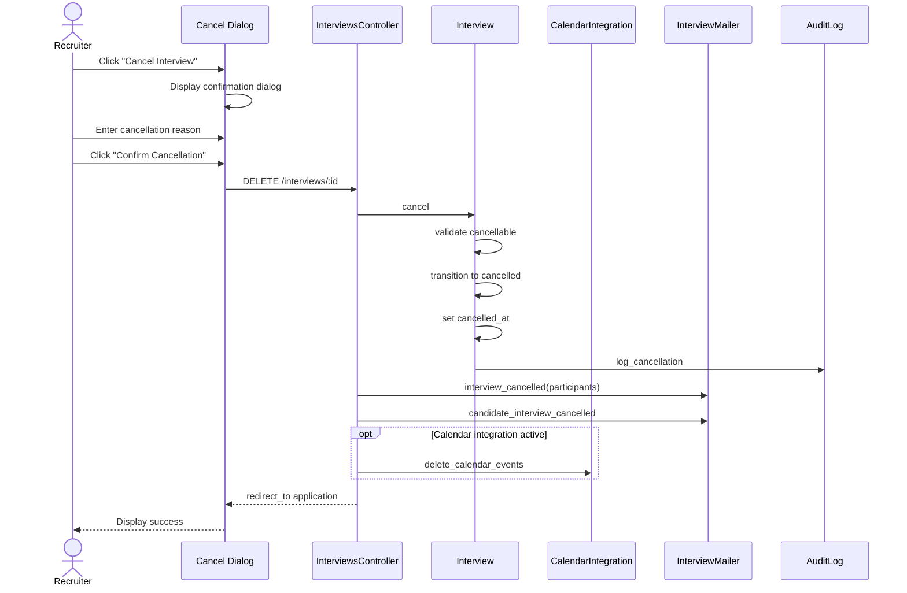

# UC-155: Cancel Interview

## Metadata

| Attribute | Value |
|-----------|-------|
| **ID** | UC-155 |
| **Name** | Cancel Interview |
| **Functional Area** | Interview Management |
| **Primary Actor** | Recruiter (ACT-02) |
| **Priority** | P1 |
| **Complexity** | Low |
| **Status** | Draft |

## Description

A recruiter cancels a scheduled interview, which triggers cancellation notifications to all participants (interviewers and candidate), removes calendar events, and records the cancellation reason in the audit log. Cancelled interviews cannot be reinstated; a new interview must be scheduled if needed.

## Actors

| Actor | Role in Use Case |
|-------|------------------|
| Recruiter (ACT-02) | Initiates and confirms the cancellation |
| Hiring Manager (ACT-03) | May cancel interviews for their requisitions |
| Interviewer (ACT-04) | Receives cancellation notification |
| Candidate (ACT-07) | Receives cancellation notification |
| Notification Engine (ACT-13) | Sends cancellation notifications |

## Preconditions

- [ ] Interview exists with status = 'scheduled' or 'confirmed'
- [ ] Interview scheduled_at is in the future (cannot cancel past interviews)
- [ ] User has permission to cancel the interview
- [ ] Interview has not already been cancelled or completed

## Postconditions

### Success
- [ ] Interview status changed to 'cancelled'
- [ ] cancelled_at timestamp recorded
- [ ] Cancellation reason stored in audit log
- [ ] Calendar cancellation invites sent to all interviewers
- [ ] Candidate notified of cancellation
- [ ] External calendar events deleted (if synced)
- [ ] Audit log entry created

### Failure
- [ ] Interview status unchanged
- [ ] User shown error message
- [ ] No notifications sent

## Triggers

- Recruiter clicks "Cancel Interview" on interview detail page
- Hiring Manager cancels from their dashboard
- Application is rejected or withdrawn (automatic cancellation)
- Job is closed (bulk cancellation of pending interviews)

## Basic Flow



| Step | Actor | Action | System Response |
|------|-------|--------|-----------------|
| 1 | Recruiter | Clicks "Cancel Interview" | Confirmation dialog displayed |
| 2 | System | Shows interview details | Date, time, participants shown |
| 3 | Recruiter | Enters cancellation reason | Reason captured |
| 4 | Recruiter | Clicks "Confirm Cancellation" | System processes cancellation |
| 5 | System | Validates interview can be cancelled | Status and timing verified |
| 6 | System | Transitions status to 'cancelled' | State machine transition |
| 7 | System | Records cancelled_at timestamp | Timestamp saved |
| 8 | System | Creates audit log entry | Cancellation logged with reason |
| 9 | System | Sends cancellation to interviewers | Email with ICS cancellation |
| 10 | System | Sends cancellation to candidate | Notification email sent |
| 11 | System | Deletes external calendar events | API calls to Google/Outlook |
| 12 | System | Redirects to application page | Success message displayed |

## Alternative Flows

### AF-1: Notify with Explanation

**Trigger:** Recruiter wants to include detailed explanation for candidate

| Step | Actor | Action | System Response |
|------|-------|--------|-----------------|
| 3a | Recruiter | Clicks "Add message to candidate" | Extended message field shown |
| 3b | Recruiter | Types personalized message | Message captured |
| 10a | System | Includes custom message in email | Personalized cancellation sent |

**Resumption:** Use case ends

### AF-2: Cancel All Interviews for Application

**Trigger:** Multiple interviews scheduled, all need cancellation

| Step | Actor | Action | System Response |
|------|-------|--------|-----------------|
| 1a | Recruiter | Selects "Cancel All Interviews" | Bulk cancel dialog shown |
| 2a | System | Lists all scheduled interviews | Interview list displayed |
| 3a | Recruiter | Enters single reason | Common reason captured |
| 4a | Recruiter | Clicks "Cancel All" | Bulk processing initiated |
| 5a | System | Cancels each interview | Loop through interviews |

**Resumption:** Basic flow steps 5-12 repeated for each interview

### AF-3: Automatic Cancellation

**Trigger:** System cancels due to application status change

| Step | Actor | Action | System Response |
|------|-------|--------|-----------------|
| 0a | System | Application rejected/withdrawn | Status change detected |
| 0b | System | Finds active interviews | Query for scheduled interviews |
| 5a | System | Sets reason to "Application [status]" | Automatic reason |
| 9a | System | Sends system-generated notification | Automated email |

**Resumption:** Continues with notification flow

## Exception Flows

### EF-1: Interview Already Completed

**Trigger:** Attempting to cancel an interview that has already occurred

| Step | Actor | Action | System Response |
|------|-------|--------|-----------------|
| 5.1 | System | Detects completed status | Error displayed |
| 5.2 | System | Blocks cancellation | Action prevented |
| 5.3 | System | Suggests alternatives | "Mark as No-Show" option |

**Resolution:** Use case terminates, no cancellation

### EF-2: Interview In Progress

**Trigger:** Interview is currently happening (scheduled_at is now)

| Step | Actor | Action | System Response |
|------|-------|--------|-----------------|
| 5.1 | System | Detects interview in progress | Warning displayed |
| 5.2 | System | Requests confirmation | "Are you sure?" prompt |
| 5.3 | Recruiter | Confirms cancellation | Proceeds with cancellation |

**Resolution:** Continues at step 6 if confirmed

### EF-3: Candidate Already at Interview Location

**Trigger:** Cancellation very close to interview time (within 30 minutes)

| Step | Actor | Action | System Response |
|------|-------|--------|-----------------|
| 5.1 | System | Detects imminent interview | Warning displayed |
| 5.2 | System | Shows urgent warning | "Interview starts in X minutes" |
| 5.3 | System | Recommends phone call | Suggests contacting candidate |
| 5.4 | Recruiter | Confirms or cancels action | Decision made |

**Resolution:** Continues at step 6 if confirmed

### EF-4: Calendar API Failure

**Trigger:** Unable to delete external calendar events

| Step | Actor | Action | System Response |
|------|-------|--------|-----------------|
| 11.1 | System | Calendar API returns error | Error logged |
| 11.2 | System | Continues with email cancellation | ICS cancellation sent |
| 11.3 | System | Flags for manual cleanup | Alert for admin |

**Resolution:** Interview cancelled, calendar cleanup pending

## Business Rules

| ID | Rule | Description |
|----|------|-------------|
| BR-155.1 | Active Status Required | Only 'scheduled' or 'confirmed' interviews can be cancelled |
| BR-155.2 | Future Time Required | Cannot cancel interviews that have already passed |
| BR-155.3 | Terminal State | Cancelled is a terminal state; cannot be reversed |
| BR-155.4 | Reason Recommended | Cancellation reason should be provided for audit |
| BR-155.5 | Immediate Notification | Cancellation notifications sent immediately |
| BR-155.6 | Cascade Consideration | Cancellation does not affect application status |

## Data Requirements

### Input Data

| Field | Type | Required | Validation |
|-------|------|----------|------------|
| interview_id | integer | Yes | Must exist and be cancellable |
| cancellation_reason | text | No | Max 1000 chars (recommended) |
| candidate_message | text | No | Max 2000 chars |
| notify_participants | boolean | No | Default true |

### Output Data

| Field | Type | Description |
|-------|------|-------------|
| cancelled_at | datetime | Timestamp of cancellation |
| notifications_sent | integer | Count of notifications |

## Database Transactions

### Tables Affected

| Table | Operation | Conditions |
|-------|-----------|------------|
| interviews | UPDATE | Set status='cancelled', cancelled_at |
| interview_participants | UPDATE | Clear external_event_id (optional) |
| audit_logs | CREATE | Log cancellation details |

### Transaction Detail

```sql
-- Cancel Interview Transaction
BEGIN TRANSACTION;

-- Step 1: Update interview status
UPDATE interviews
SET status = 'cancelled',
    cancelled_at = NOW(),
    updated_at = NOW()
WHERE id = @interview_id
  AND status IN ('scheduled', 'confirmed')
  AND scheduled_at >= NOW();

-- Check row was updated
IF ROW_COUNT() = 0 THEN
    ROLLBACK;
    -- Return error: cannot cancel
END IF;

-- Step 2: Create audit log
INSERT INTO audit_logs (
    organization_id,
    user_id,
    action,
    auditable_type,
    auditable_id,
    metadata,
    ip_address,
    created_at
) VALUES (
    @organization_id,
    @current_user_id,
    'interview.cancelled',
    'Interview',
    @interview_id,
    JSON_OBJECT(
        'cancellation_reason', @reason,
        'original_scheduled_at', @scheduled_at,
        'candidate_name', @candidate_name,
        'job_title', @job_title,
        'interviewer_names', @interviewer_names,
        'cancelled_by', @user_name
    ),
    @ip_address,
    NOW()
);

COMMIT;
```

### Rollback Scenarios

| Scenario | Rollback Action |
|----------|-----------------|
| Invalid status | No transaction, return error |
| Past interview | No transaction, return error |
| Notification failure | Log error, commit cancellation |

## UI/UX Requirements

### Screen/Component

- **Location:** Modal dialog on /interviews/:id or inline action
- **Entry Point:**
  - "Cancel" button on interview detail page
  - "Cancel" action in interview list dropdown
  - Context menu on calendar view
- **Key Elements:**
  - Interview summary (date, time, participants)
  - Reason textarea
  - Optional candidate message
  - Confirmation checkbox for irreversibility
  - Warning for imminent interviews

### Dialog Layout

```
+---------------------------------------------------------------+
| Cancel Interview                                         [X]   |
+-----------------------------------------------------------------+
|                                                                 |
| Are you sure you want to cancel this interview?                 |
|                                                                 |
| +-----------------------------------------------------------+  |
| | Technical Interview                                       |  |
| | Monday, January 27, 2026 at 10:00 AM EST                  |  |
| | Candidate: John Smith                                     |  |
| | Interviewers: Sarah Johnson, Mike Chen                    |  |
| +-----------------------------------------------------------+  |
|                                                                 |
| Reason for Cancellation                                         |
| +-------------------------------------------------------+      |
| | Position has been filled                              |      |
| +-------------------------------------------------------+      |
|                                                                 |
| [ ] Add personal message to candidate                           |
|                                                                 |
| Notifications:                                                  |
| [x] Send cancellation to interviewers                           |
| [x] Send cancellation to candidate                              |
|                                                                 |
| [!] This action cannot be undone. A new interview must be      |
|     scheduled if you want to interview this candidate.          |
|                                                                 |
+-----------------------------------------------------------------+
| [Keep Interview]                      [Cancel Interview]        |
+-----------------------------------------------------------------+
```

## Non-Functional Requirements

| Requirement | Target |
|-------------|--------|
| Response Time | < 2 seconds |
| Notification Delivery | Within 30 seconds |
| Availability | 99.9% |

## Security Considerations

- [x] Authentication required
- [x] Authorization check: Must have cancel permission for interview
- [x] Organization scoping: Interview must be in user's organization
- [x] Audit logging: Full cancellation details recorded
- [x] No data deletion: Record retained with cancelled status

## Related Use Cases

| Use Case | Relationship |
|----------|--------------|
| UC-150 Schedule Interview | Original interview creation |
| UC-152 Send Calendar Invite | Triggered with cancellation method |
| UC-154 Reschedule Interview | Alternative to cancellation |
| UC-157 Mark No-Show | Alternative for no-show situations |
| UC-105 Reject Candidate | May trigger automatic cancellation |

---

## Data Model References

> Cross-references to [DATA_MODEL.md](../DATA_MODEL.md) and [CRUD_MATRIX.md](../CRUD_MATRIX.md)

### Subject Areas

| Subject Area | ID | Relationship |
|--------------|-----|--------------|
| Interview | SA-06 | Primary |
| Communication | SA-10 | Secondary |

### Entities CRUD

| Entity | C | R | U | D | Notes |
|--------|---|---|---|---|-------|
| Interview | | X | X | | Read and update status |
| InterviewParticipant | | X | | | Read for notification |
| Application | | X | | | Read for candidate info |
| AuditLog | X | | | | Record cancellation |

**Legend:** C = Create, R = Read, U = Update, D = Delete

---

## Process Model References

> Cross-references to [PROCESS_MODEL.md](../PROCESS_MODEL.md) and [PROCESS_CRUD_MATRIX.md](../PROCESS_CRUD_MATRIX.md)

| Attribute | Value | Link |
|-----------|-------|------|
| **Elementary Business Process** | EP-0506: Cancel Interview | [PROCESS_MODEL.md#ep-0506](../PROCESS_MODEL.md#elementary-business-processes-4) |
| **Business Process** | BP-201: Interview Coordination | [PROCESS_MODEL.md#bp-201](../PROCESS_MODEL.md#bp-201-interview-coordination) |
| **Business Function** | BF-02: Candidate Evaluation | [PROCESS_MODEL.md#bf-02](../PROCESS_MODEL.md#bf-02-candidate-evaluation) |

### EBP Details

| Attribute | Value |
|-----------|-------|
| **Trigger** | Recruiter initiates cancellation or automatic trigger |
| **Input** | Interview ID, cancellation reason |
| **Output** | Cancelled interview, notifications sent |
| **Business Rules** | BR-155.1 through BR-155.6 |

---

## Traceability Matrix

> Complete artifact mapping for requirements traceability

| Artifact Type | ID | Name | Link |
|---------------|-----|------|------|
| **Use Case** | UC-155 | Cancel Interview | *(this document)* |
| **Elementary Process** | EP-0506 | Cancel Interview | [PROCESS_MODEL.md](../PROCESS_MODEL.md#elementary-business-processes-4) |
| **Business Process** | BP-201 | Interview Coordination | [PROCESS_MODEL.md](../PROCESS_MODEL.md#bp-201-interview-coordination) |
| **Business Function** | BF-02 | Candidate Evaluation | [PROCESS_MODEL.md](../PROCESS_MODEL.md#bf-02-candidate-evaluation) |
| **Primary Actor** | ACT-02 | Recruiter | [ACTORS.md](../ACTORS.md#act-02-recruiter) |
| **Subject Area (Primary)** | SA-06 | Interview | [DATA_MODEL.md](../DATA_MODEL.md#sa-06-interview) |

### Implementation Artifacts

| Artifact Type | Path/Reference | Status |
|---------------|----------------|--------|
| Controller | `app/controllers/interviews_controller.rb` | Implemented |
| Model | `app/models/interview.rb` | Implemented |
| Mailer | `app/mailers/interview_mailer.rb` | Implemented |
| Test | `test/models/interview_test.rb` | Implemented |

---

## Open Questions

1. Should there be an approval workflow for cancelling interviews close to the scheduled time?
2. How long should cancelled interview records be retained?
3. Should we track cancellation metrics (who cancels, reasons)?

## Change History

| Version | Date | Author | Changes |
|---------|------|--------|---------|
| 0.1 | 2026-01-25 | System | Initial draft |
