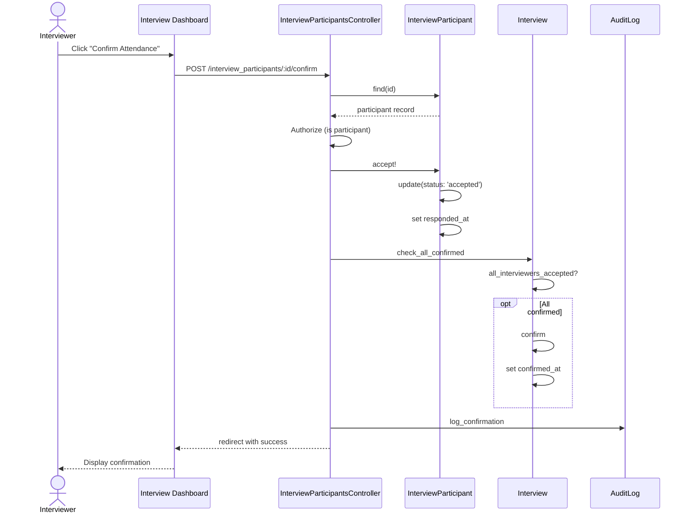

# UC-156: Confirm Attendance

## Metadata

| Attribute | Value |
|-----------|-------|
| **ID** | UC-156 |
| **Name** | Confirm Attendance |
| **Functional Area** | Interview Management |
| **Primary Actor** | Interviewer (ACT-04) |
| **Priority** | P2 |
| **Complexity** | Low |
| **Status** | Draft |

## Description

An interviewer or candidate confirms their availability to attend a scheduled interview. This updates their participation status and, when all required participants have confirmed, transitions the interview to 'confirmed' status. Confirmation can occur via calendar response (accept/decline/tentative) or through the application interface.

## Actors

| Actor | Role in Use Case |
|-------|------------------|
| Interviewer (ACT-04) | Confirms availability to conduct interview |
| Candidate (ACT-07) | Confirms attendance for the interview |
| Hiring Manager (ACT-03) | May confirm as interviewer |
| Integration Gateway (ACT-12) | Receives calendar responses from external systems |

## Preconditions

- [ ] Interview exists with status = 'scheduled'
- [ ] Participant (interviewer or candidate) has received invitation
- [ ] Interview scheduled_at is in the future
- [ ] Participant has not already responded with 'accepted' status

## Postconditions

### Success
- [ ] InterviewParticipant status updated to 'accepted'
- [ ] responded_at timestamp recorded
- [ ] If all interviewers confirmed, Interview status changes to 'confirmed'
- [ ] Audit log entry created
- [ ] Recruiter notified of confirmation (optional)

### Failure
- [ ] Participant status unchanged
- [ ] Error message displayed

## Triggers

- Interviewer clicks "Accept" on calendar invite
- Interviewer clicks "Confirm" in interview dashboard
- Candidate confirms via scheduling confirmation
- Integration gateway receives calendar response webhook

## Basic Flow



| Step | Actor | Action | System Response |
|------|-------|--------|-----------------|
| 1 | Interviewer | Navigates to interview dashboard | Dashboard displayed |
| 2 | System | Shows pending interview invitations | Invitations listed |
| 3 | Interviewer | Clicks "Confirm Attendance" | Confirmation request sent |
| 4 | System | Validates participant record | Participant found |
| 5 | System | Validates interview still scheduled | Interview active |
| 6 | System | Updates participant status | Status set to 'accepted' |
| 7 | System | Records responded_at timestamp | Timestamp saved |
| 8 | System | Checks if all interviewers confirmed | Query participants |
| 9 | System | If all confirmed, updates interview | Status to 'confirmed' |
| 10 | System | Creates audit log entry | Confirmation logged |
| 11 | System | Displays success message | Confirmation shown |

## Alternative Flows

### AF-1: Confirm via Calendar Response

**Trigger:** Interviewer accepts calendar invite in email client

| Step | Actor | Action | System Response |
|------|-------|--------|-----------------|
| 1a | Interviewer | Clicks "Accept" in calendar app | Calendar response sent |
| 2a | Integration | Receives webhook from calendar | Webhook processed |
| 3a | System | Matches response to participant | Participant identified |
| 4a | System | Updates participant status | Same as basic flow step 6 |

**Resumption:** Continues at step 8 of basic flow

### AF-2: Mark as Tentative

**Trigger:** Interviewer is unsure about availability

| Step | Actor | Action | System Response |
|------|-------|--------|-----------------|
| 3a | Interviewer | Clicks "Tentative" | Tentative request sent |
| 6a | System | Sets status to 'tentative' | Tentative status saved |
| 9a | System | Does not confirm interview | Needs full acceptance |
| 11a | System | Notifies recruiter | Alert about tentative response |

**Resumption:** Use case ends, recruiter may follow up

### AF-3: Decline Invitation

**Trigger:** Interviewer cannot attend

| Step | Actor | Action | System Response |
|------|-------|--------|-----------------|
| 3a | Interviewer | Clicks "Decline" | Decline request sent |
| 3b | Interviewer | Optionally enters reason | Reason captured |
| 6a | System | Sets status to 'declined' | Declined status saved |
| 10a | System | Notifies recruiter | Alert about declined response |
| 10b | System | Suggests replacement | Prompts for new interviewer |

**Resumption:** Use case ends, recruiter to reschedule or replace

### AF-4: Candidate Confirmation

**Trigger:** Candidate confirms attendance

| Step | Actor | Action | System Response |
|------|-------|--------|-----------------|
| 1a | Candidate | Clicks confirmation link | Confirmation page shown |
| 5a | System | Validates candidate token | Token verified |
| 6a | System | Records candidate confirmation | Confirmation stored |
| 10a | System | Notifies recruiter | Candidate confirmed alert |

**Resumption:** Basic flow step 11

## Exception Flows

### EF-1: Interview Already Cancelled

**Trigger:** Interview was cancelled after invite sent

| Step | Actor | Action | System Response |
|------|-------|--------|-----------------|
| 5.1 | System | Detects cancelled status | Error displayed |
| 5.2 | System | Shows cancellation notice | "This interview has been cancelled" |
| 5.3 | System | Provides contact info | Recruiter email shown |

**Resolution:** Use case terminates, no action taken

### EF-2: Interview Already Completed

**Trigger:** Interview has already occurred

| Step | Actor | Action | System Response |
|------|-------|--------|-----------------|
| 5.1 | System | Detects completed status | Info displayed |
| 5.2 | System | Shows interview details | Past interview shown |
| 5.3 | System | Prompts for feedback | "Submit your scorecard" |

**Resolution:** Redirects to scorecard submission

### EF-3: Already Confirmed

**Trigger:** Participant has already accepted

| Step | Actor | Action | System Response |
|------|-------|--------|-----------------|
| 4.1 | System | Detects accepted status | Already confirmed message |
| 4.2 | System | Shows confirmation details | Confirmation timestamp shown |
| 4.3 | System | Offers to change response | "Decline instead?" option |

**Resolution:** Participant can change response if needed

### EF-4: Calendar Integration Not Configured

**Trigger:** Calendar webhook received but no matching integration

| Step | Actor | Action | System Response |
|------|-------|--------|-----------------|
| 3a.1 | System | Cannot match calendar response | Webhook ignored |
| 3a.2 | System | Logs unmatched response | Debug info logged |

**Resolution:** Interviewer must confirm manually

## Business Rules

| ID | Rule | Description |
|----|------|-------------|
| BR-156.1 | Active Interview | Can only confirm for scheduled/confirmed interviews |
| BR-156.2 | Future Time | Cannot confirm after interview scheduled time |
| BR-156.3 | Interview Confirmation | Interview becomes 'confirmed' when all lead/interviewer roles accept |
| BR-156.4 | Shadow Exception | Shadow and note-taker responses do not affect interview status |
| BR-156.5 | Response Change | Participants can change response until interview starts |
| BR-156.6 | Single Response | Each calendar response updates participant status |

## Data Requirements

### Input Data

| Field | Type | Required | Validation |
|-------|------|----------|------------|
| participant_id | integer | Yes | Must exist |
| response | enum | Yes | accepted, declined, tentative |
| decline_reason | text | No | Max 500 chars |

### Output Data

| Field | Type | Description |
|-------|------|-------------|
| status | enum | New participant status |
| responded_at | datetime | Response timestamp |
| interview_confirmed | boolean | Whether interview is now confirmed |

## Database Transactions

### Tables Affected

| Table | Operation | Conditions |
|-------|-----------|------------|
| interview_participants | UPDATE | Update status and responded_at |
| interviews | UPDATE | Set confirmed status if all accepted |
| audit_logs | CREATE | Log confirmation |

### Transaction Detail

```sql
-- Confirm Attendance Transaction
BEGIN TRANSACTION;

-- Step 1: Update participant status
UPDATE interview_participants
SET status = 'accepted',
    responded_at = NOW(),
    updated_at = NOW()
WHERE id = @participant_id
  AND status IN ('pending', 'tentative');

-- Step 2: Check if all required participants confirmed
SET @all_confirmed = (
    SELECT COUNT(*) = 0
    FROM interview_participants
    WHERE interview_id = @interview_id
      AND role IN ('lead', 'interviewer')
      AND status != 'accepted'
);

-- Step 3: If all confirmed, update interview status
IF @all_confirmed THEN
    UPDATE interviews
    SET status = 'confirmed',
        confirmed_at = NOW(),
        updated_at = NOW()
    WHERE id = @interview_id
      AND status = 'scheduled';
END IF;

-- Step 4: Create audit log
INSERT INTO audit_logs (
    organization_id,
    user_id,
    action,
    auditable_type,
    auditable_id,
    metadata,
    created_at
) VALUES (
    @organization_id,
    @user_id,
    'interview.attendance_confirmed',
    'Interview',
    @interview_id,
    JSON_OBJECT(
        'participant_id', @participant_id,
        'response', 'accepted',
        'interview_confirmed', @all_confirmed
    ),
    NOW()
);

COMMIT;
```

### Rollback Scenarios

| Scenario | Rollback Action |
|----------|-----------------|
| Invalid participant | No transaction, return error |
| Interview not active | No transaction, return error |

## UI/UX Requirements

### Screen/Component

- **Location:** /interviews (interviewer dashboard) or email action
- **Entry Point:**
  - "Accept" button on calendar invite
  - "Confirm" button on interview dashboard
  - Confirmation link in email
- **Key Elements:**
  - Interview details summary
  - Accept/Tentative/Decline buttons
  - Decline reason field (conditional)
  - Current confirmation status

### Dashboard View

```
+---------------------------------------------------------------+
| My Upcoming Interviews                                          |
+-----------------------------------------------------------------+
|                                                                 |
| +-----------------------------------------------------------+  |
| | Technical Interview - John Smith                          |  |
| | Monday, January 27, 2026 at 10:00 AM EST                  |  |
| | Software Engineer | Duration: 60 min                       |  |
| | Location: Conference Room A                                |  |
| |                                                           |  |
| | Status: Awaiting Your Response                             |  |
| |                                                           |  |
| | [Confirm] [Tentative] [Decline]                           |  |
| +-----------------------------------------------------------+  |
|                                                                 |
| +-----------------------------------------------------------+  |
| | Panel Interview - Sarah Chen                               |  |
| | Tuesday, January 28, 2026 at 2:00 PM EST                  |  |
| | Product Manager | Duration: 90 min                         |  |
| | Location: Board Room                                       |  |
| |                                                           |  |
| | Status: Confirmed [checkmark]                              |  |
| |                                                           |  |
| | [View Details] [Decline]                                   |  |
| +-----------------------------------------------------------+  |
|                                                                 |
+-----------------------------------------------------------------+
```

### Decline Dialog

```
+---------------------------------------------------------------+
| Decline Interview                                        [X]   |
+-----------------------------------------------------------------+
|                                                                 |
| You are declining:                                              |
| Technical Interview - John Smith                                |
| Monday, January 27, 2026 at 10:00 AM EST                        |
|                                                                 |
| Reason for declining (optional)                                 |
| +-------------------------------------------------------+      |
| | Conflicting meeting with external client              |      |
| +-------------------------------------------------------+      |
|                                                                 |
| The recruiter will be notified and may contact you              |
| about an alternative time.                                      |
|                                                                 |
+-----------------------------------------------------------------+
| [Cancel]                                    [Confirm Decline]   |
+-----------------------------------------------------------------+
```

## Non-Functional Requirements

| Requirement | Target |
|-------------|--------|
| Response Time | < 1 second |
| Calendar Sync Latency | < 5 minutes from external response |
| Availability | 99.9% |

## Security Considerations

- [x] Authentication required (or valid token for candidate)
- [x] Authorization check: Must be the assigned participant
- [x] Audit logging: All responses logged
- [x] Token validation for candidate confirmations

## Related Use Cases

| Use Case | Relationship |
|----------|--------------|
| UC-150 Schedule Interview | Creates interview with participants |
| UC-152 Send Calendar Invite | Sends invites that can be responded to |
| UC-154 Reschedule Interview | May require re-confirmation |
| UC-157 Mark No-Show | Used when confirmed attendee doesn't show |
| UC-158 Complete Interview | Follows confirmed interviews |

---

## Data Model References

> Cross-references to [DATA_MODEL.md](../DATA_MODEL.md) and [CRUD_MATRIX.md](../CRUD_MATRIX.md)

### Subject Areas

| Subject Area | ID | Relationship |
|--------------|-----|--------------|
| Interview | SA-06 | Primary |

### Entities CRUD

| Entity | C | R | U | D | Notes |
|--------|---|---|---|---|-------|
| InterviewParticipant | | X | X | | Update status |
| Interview | | X | X | | May update to confirmed |
| AuditLog | X | | | | Log confirmation |

**Legend:** C = Create, R = Read, U = Update, D = Delete

---

## Process Model References

> Cross-references to [PROCESS_MODEL.md](../PROCESS_MODEL.md) and [PROCESS_CRUD_MATRIX.md](../PROCESS_CRUD_MATRIX.md)

| Attribute | Value | Link |
|-----------|-------|------|
| **Elementary Business Process** | EP-0507: Confirm Attendance | [PROCESS_MODEL.md#ep-0507](../PROCESS_MODEL.md#elementary-business-processes-4) |
| **Business Process** | BP-201: Interview Coordination | [PROCESS_MODEL.md#bp-201](../PROCESS_MODEL.md#bp-201-interview-coordination) |
| **Business Function** | BF-02: Candidate Evaluation | [PROCESS_MODEL.md#bf-02](../PROCESS_MODEL.md#bf-02-candidate-evaluation) |

### EBP Details

| Attribute | Value |
|-----------|-------|
| **Trigger** | Participant responds to interview invitation |
| **Input** | Participant ID, response (accept/decline/tentative) |
| **Output** | Updated participant status, potentially confirmed interview |
| **Business Rules** | BR-156.1 through BR-156.6 |

---

## Traceability Matrix

> Complete artifact mapping for requirements traceability

| Artifact Type | ID | Name | Link |
|---------------|-----|------|------|
| **Use Case** | UC-156 | Confirm Attendance | *(this document)* |
| **Elementary Process** | EP-0507 | Confirm Attendance | [PROCESS_MODEL.md](../PROCESS_MODEL.md#elementary-business-processes-4) |
| **Business Process** | BP-201 | Interview Coordination | [PROCESS_MODEL.md](../PROCESS_MODEL.md#bp-201-interview-coordination) |
| **Business Function** | BF-02 | Candidate Evaluation | [PROCESS_MODEL.md](../PROCESS_MODEL.md#bf-02-candidate-evaluation) |
| **Primary Actor** | ACT-04 | Interviewer | [ACTORS.md](../ACTORS.md#act-04-interviewer) |
| **Subject Area (Primary)** | SA-06 | Interview | [DATA_MODEL.md](../DATA_MODEL.md#sa-06-interview) |

### Implementation Artifacts

| Artifact Type | Path/Reference | Status |
|---------------|----------------|--------|
| Model | `app/models/interview_participant.rb` | Implemented |
| Model | `app/models/interview.rb` | Implemented |
| Controller | `app/controllers/interview_participants_controller.rb` | Planned |
| Test | `test/models/interview_participant_test.rb` | Implemented |

---

## Open Questions

1. Should we send reminders for unconfirmed interviews?
2. How should we handle partial panel confirmation (some accepted, some pending)?
3. Should candidates be able to confirm via the portal without a token link?

## Change History

| Version | Date | Author | Changes |
|---------|------|--------|---------|
| 0.1 | 2026-01-25 | System | Initial draft |
