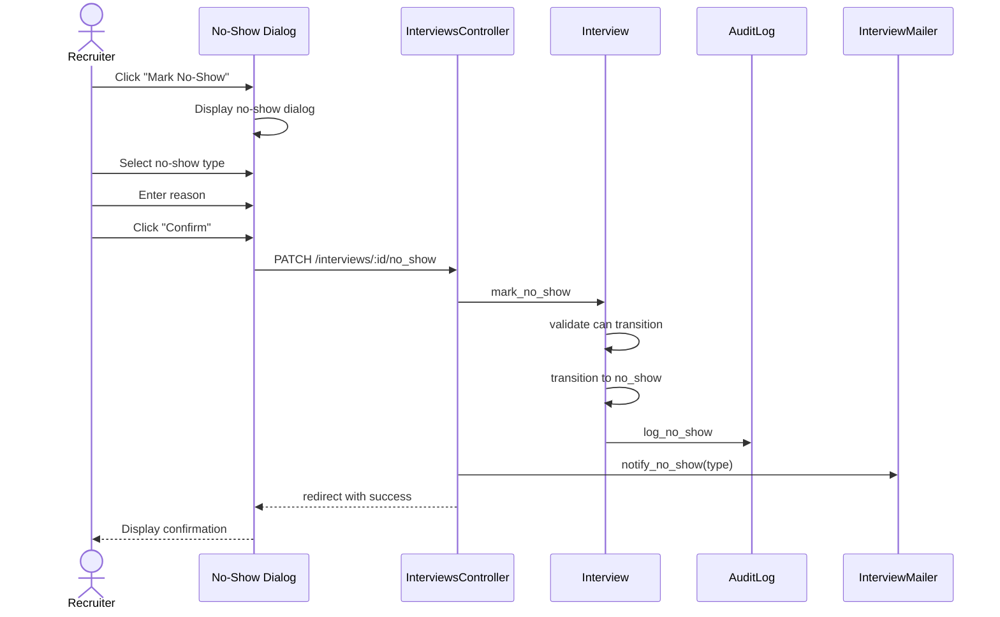

# UC-157: Mark No-Show

## Metadata

| Attribute | Value |
|-----------|-------|
| **ID** | UC-157 |
| **Name** | Mark No-Show |
| **Functional Area** | Interview Management |
| **Primary Actor** | Recruiter (ACT-02) |
| **Priority** | P2 |
| **Complexity** | Low |
| **Status** | Draft |

## Description

A recruiter marks an interview as a no-show when the candidate or interviewer fails to attend a confirmed interview. This updates the interview status, records who was absent, and creates an audit trail. For candidate no-shows, this information may factor into pipeline decisions. For interviewer no-shows, the system alerts the recruiter for rescheduling.

## Actors

| Actor | Role in Use Case |
|-------|------------------|
| Recruiter (ACT-02) | Marks the interview as no-show |
| Interviewer (ACT-04) | May report candidate no-show |
| Hiring Manager (ACT-03) | May mark no-show for their interviews |

## Preconditions

- [ ] Interview exists with status = 'scheduled' or 'confirmed'
- [ ] Interview scheduled_at has passed (or is very close)
- [ ] User has permission to modify the interview
- [ ] Interview has not already been marked as completed, cancelled, or no-show

## Postconditions

### Success
- [ ] Interview status changed to 'no_show'
- [ ] No-show type recorded (candidate or interviewer)
- [ ] No-show reason captured in audit log
- [ ] Relevant parties notified
- [ ] Audit log entry created

### Failure
- [ ] Interview status unchanged
- [ ] User shown validation error

## Triggers

- Recruiter receives notification that candidate didn't attend
- Interviewer reports candidate no-show
- Recruiter notes interviewer didn't attend
- System detects no feedback submitted after expected completion time

## Basic Flow



| Step | Actor | Action | System Response |
|------|-------|--------|-----------------|
| 1 | Recruiter | Clicks "Mark No-Show" on interview | No-show dialog displayed |
| 2 | System | Shows interview details | Date, time, candidate, interviewers |
| 3 | Recruiter | Selects who was absent | Candidate or Interviewer option |
| 4 | Recruiter | Enters reason/notes | Reason captured |
| 5 | Recruiter | Optionally selects follow-up action | Action captured |
| 6 | Recruiter | Clicks "Confirm" | System processes no-show |
| 7 | System | Validates interview can be marked | Status and timing verified |
| 8 | System | Transitions to 'no_show' status | State machine transition |
| 9 | System | Creates audit log with details | Full record captured |
| 10 | System | Sends appropriate notifications | Based on no-show type |
| 11 | System | Displays success message | Confirmation shown |

## Alternative Flows

### AF-1: Candidate No-Show

**Trigger:** Candidate failed to attend

| Step | Actor | Action | System Response |
|------|-------|--------|-----------------|
| 3a | Recruiter | Selects "Candidate No-Show" | Candidate options shown |
| 4a | Recruiter | Optionally marks "Attempt to contact" | Contact attempted checkbox |
| 10a | System | Records candidate no-show in profile | No-show count updated |
| 10b | System | Notifies hiring manager | Alert sent |
| 10c | System | Suggests next action | Reschedule or reject options |

**Resumption:** Use case ends

### AF-2: Interviewer No-Show

**Trigger:** Interviewer failed to attend

| Step | Actor | Action | System Response |
|------|-------|--------|-----------------|
| 3a | Recruiter | Selects "Interviewer No-Show" | Interviewer list shown |
| 3b | Recruiter | Selects which interviewer(s) | Absent interviewers marked |
| 10a | System | Notifies interviewer's manager | Alert sent |
| 10b | System | Apologizes to candidate | Apology email sent |
| 10c | System | Prompts for reschedule | Reschedule dialog offered |

**Resumption:** May trigger UC-154 Reschedule Interview

### AF-3: Partial Attendance (Panel)

**Trigger:** Some panel members attended, some didn't

| Step | Actor | Action | System Response |
|------|-------|--------|-----------------|
| 3a | Recruiter | Selects "Partial Attendance" | Panel member list shown |
| 3b | Recruiter | Marks each member's attendance | Individual status set |
| 8a | System | Determines if interview can continue | Minimum attendees check |
| 8b | System | If quorum met, may mark complete | Status decision made |

**Resumption:** May trigger UC-158 Complete Interview

### AF-4: Interviewer Reports No-Show

**Trigger:** Interviewer reports candidate didn't show

| Step | Actor | Action | System Response |
|------|-------|--------|-----------------|
| 1a | Interviewer | Clicks "Candidate Didn't Show" | Quick action processed |
| 2a | System | Sends alert to recruiter | Notification sent |
| 2b | Recruiter | Reviews and confirms | Opens no-show dialog |

**Resumption:** Continues at step 3 of basic flow

## Exception Flows

### EF-1: Interview Not Yet Started

**Trigger:** Attempting to mark no-show before scheduled time

| Step | Actor | Action | System Response |
|------|-------|--------|-----------------|
| 7.1 | System | Detects future interview | Warning displayed |
| 7.2 | System | Shows time until interview | "Interview starts in X minutes" |
| 7.3 | Recruiter | Confirms early marking | If certain, can proceed |

**Resolution:** User confirms or waits

### EF-2: Interview Already Completed

**Trigger:** Interview has already been marked complete

| Step | Actor | Action | System Response |
|------|-------|--------|-----------------|
| 7.1 | System | Detects completed status | Error displayed |
| 7.2 | System | Shows completion details | Feedback may exist |
| 7.3 | System | Blocks no-show action | Cannot change |

**Resolution:** Use case terminates

### EF-3: Candidate Arrived Late

**Trigger:** Candidate shows up after being marked no-show

| Step | Actor | Action | System Response |
|------|-------|--------|-----------------|
| E.1 | Recruiter | Decides to proceed with interview | Options shown |
| E.2 | Recruiter | Clicks "Revert No-Show" | Status change requested |
| E.3 | System | Changes status back to confirmed | No-show undone |
| E.4 | System | Creates audit entry | Reversion logged |

**Resolution:** Interview proceeds, late arrival noted

## Business Rules

| ID | Rule | Description |
|----|------|-------------|
| BR-157.1 | Timing Check | No-show typically only after scheduled start time |
| BR-157.2 | Type Required | Must specify who was absent (candidate or interviewer) |
| BR-157.3 | Terminal State | No-show is a terminal state (cannot transition to completed) |
| BR-157.4 | Candidate Impact | Candidate no-shows visible on candidate profile |
| BR-157.5 | Interviewer Tracking | Interviewer no-shows may be reported to management |
| BR-157.6 | Grace Period | System allows marking no-show after 15-minute grace period |

## Data Requirements

### Input Data

| Field | Type | Required | Validation |
|-------|------|----------|------------|
| interview_id | integer | Yes | Must exist and be markable |
| no_show_type | enum | Yes | candidate, interviewer, both |
| absent_interviewer_ids | array | Conditional | Required if interviewer no-show |
| reason | text | No | Max 1000 chars |
| contact_attempted | boolean | No | Default false |

### Output Data

| Field | Type | Description |
|-------|------|-------------|
| status | enum | 'no_show' |
| no_show_type | enum | Who was absent |
| marked_at | datetime | Timestamp of marking |

## Database Transactions

### Tables Affected

| Table | Operation | Conditions |
|-------|-----------|------------|
| interviews | UPDATE | Set status='no_show' |
| interview_participants | UPDATE | Mark absent participants |
| candidates | UPDATE | Increment no-show count (optional) |
| audit_logs | CREATE | Log no-show details |

### Transaction Detail

```sql
-- Mark No-Show Transaction
BEGIN TRANSACTION;

-- Step 1: Update interview status
UPDATE interviews
SET status = 'no_show',
    updated_at = NOW()
WHERE id = @interview_id
  AND status IN ('scheduled', 'confirmed');

-- Check row was updated
IF ROW_COUNT() = 0 THEN
    ROLLBACK;
    -- Return error: cannot mark no-show
END IF;

-- Step 2: Update participant records (for interviewer no-show)
UPDATE interview_participants
SET no_show = TRUE,
    updated_at = NOW()
WHERE interview_id = @interview_id
  AND user_id IN (@absent_interviewer_ids);

-- Step 3: Optionally update candidate no-show count
IF @no_show_type = 'candidate' THEN
    UPDATE candidates
    SET no_show_count = no_show_count + 1,
        last_no_show_at = NOW(),
        updated_at = NOW()
    WHERE id = @candidate_id;
END IF;

-- Step 4: Create audit log
INSERT INTO audit_logs (
    organization_id,
    user_id,
    action,
    auditable_type,
    auditable_id,
    metadata,
    ip_address,
    created_at
) VALUES (
    @organization_id,
    @current_user_id,
    'interview.no_show',
    'Interview',
    @interview_id,
    JSON_OBJECT(
        'no_show_type', @no_show_type,
        'absent_party', @absent_name,
        'reason', @reason,
        'contact_attempted', @contact_attempted,
        'scheduled_at', @scheduled_at,
        'candidate_name', @candidate_name,
        'job_title', @job_title
    ),
    @ip_address,
    NOW()
);

COMMIT;
```

### Rollback Scenarios

| Scenario | Rollback Action |
|----------|-----------------|
| Invalid status | No transaction, return error |
| Already marked | No transaction, return current status |

## UI/UX Requirements

### Screen/Component

- **Location:** Modal dialog on interview detail or list
- **Entry Point:**
  - "Mark No-Show" action on interview
  - "Candidate Didn't Show" quick action (for interviewers)
- **Key Elements:**
  - Interview summary
  - No-show type selector
  - Interviewer checkboxes (if applicable)
  - Reason textarea
  - Follow-up action options

### Dialog Layout

```
+---------------------------------------------------------------+
| Mark Interview as No-Show                                [X]   |
+-----------------------------------------------------------------+
|                                                                 |
| Interview Details                                               |
| Technical Interview - John Smith                                |
| Monday, January 27, 2026 at 10:00 AM EST                        |
| Expected end: 11:00 AM EST (1 hour ago)                         |
|                                                                 |
+-----------------------------------------------------------------+
| Who was absent?                                                 |
|                                                                 |
| ( ) Candidate didn't show                                       |
| ( ) Interviewer(s) didn't show                                  |
| ( ) Both (technical issues, etc.)                               |
|                                                                 |
+-----------------------------------------------------------------+
| [If interviewer selected]                                       |
| Which interviewer(s) were absent?                               |
| [ ] Sarah Johnson                                               |
| [ ] Mike Chen                                                   |
+-----------------------------------------------------------------+
| Reason / Notes                                                  |
| +-------------------------------------------------------+      |
| | Candidate did not join video call. Waited 20 minutes. |      |
| +-------------------------------------------------------+      |
|                                                                 |
| [x] I attempted to contact the absent party                     |
|                                                                 |
| Follow-up action:                                               |
| [Reschedule Interview v]                                        |
|                                                                 |
+-----------------------------------------------------------------+
| [Cancel]                                   [Confirm No-Show]    |
+-----------------------------------------------------------------+
```

## Non-Functional Requirements

| Requirement | Target |
|-------------|--------|
| Response Time | < 2 seconds |
| Availability | 99.9% |

## Security Considerations

- [x] Authentication required
- [x] Authorization check: Must have permission to modify interview
- [x] Audit logging: Full details recorded
- [x] No-show information restricted to hiring team

## Related Use Cases

| Use Case | Relationship |
|----------|--------------|
| UC-150 Schedule Interview | Original interview creation |
| UC-154 Reschedule Interview | May follow for another attempt |
| UC-155 Cancel Interview | Alternative outcome |
| UC-158 Complete Interview | Alternative outcome |
| UC-105 Reject Candidate | May follow candidate no-show |

---

## Data Model References

> Cross-references to [DATA_MODEL.md](../DATA_MODEL.md) and [CRUD_MATRIX.md](../CRUD_MATRIX.md)

### Subject Areas

| Subject Area | ID | Relationship |
|--------------|-----|--------------|
| Interview | SA-06 | Primary |
| Candidate | SA-04 | Secondary |

### Entities CRUD

| Entity | C | R | U | D | Notes |
|--------|---|---|---|---|-------|
| Interview | | X | X | | Update status to no_show |
| InterviewParticipant | | X | X | | Mark no_show flag |
| Candidate | | X | X | | Update no_show_count |
| AuditLog | X | | | | Record no-show details |

**Legend:** C = Create, R = Read, U = Update, D = Delete

---

## Process Model References

> Cross-references to [PROCESS_MODEL.md](../PROCESS_MODEL.md) and [PROCESS_CRUD_MATRIX.md](../PROCESS_CRUD_MATRIX.md)

| Attribute | Value | Link |
|-----------|-------|------|
| **Elementary Business Process** | EP-0508: Mark No-Show | [PROCESS_MODEL.md#ep-0508](../PROCESS_MODEL.md#elementary-business-processes-4) |
| **Business Process** | BP-201: Interview Coordination | [PROCESS_MODEL.md#bp-201](../PROCESS_MODEL.md#bp-201-interview-coordination) |
| **Business Function** | BF-02: Candidate Evaluation | [PROCESS_MODEL.md#bf-02](../PROCESS_MODEL.md#bf-02-candidate-evaluation) |

### EBP Details

| Attribute | Value |
|-----------|-------|
| **Trigger** | Participant fails to attend scheduled interview |
| **Input** | Interview ID, no-show type, reason |
| **Output** | Interview marked as no-show, notifications sent |
| **Business Rules** | BR-157.1 through BR-157.6 |

---

## Traceability Matrix

> Complete artifact mapping for requirements traceability

| Artifact Type | ID | Name | Link |
|---------------|-----|------|------|
| **Use Case** | UC-157 | Mark No-Show | *(this document)* |
| **Elementary Process** | EP-0508 | Mark No-Show | [PROCESS_MODEL.md](../PROCESS_MODEL.md#elementary-business-processes-4) |
| **Business Process** | BP-201 | Interview Coordination | [PROCESS_MODEL.md](../PROCESS_MODEL.md#bp-201-interview-coordination) |
| **Business Function** | BF-02 | Candidate Evaluation | [PROCESS_MODEL.md](../PROCESS_MODEL.md#bf-02-candidate-evaluation) |
| **Primary Actor** | ACT-02 | Recruiter | [ACTORS.md](../ACTORS.md#act-02-recruiter) |
| **Subject Area (Primary)** | SA-06 | Interview | [DATA_MODEL.md](../DATA_MODEL.md#sa-06-interview) |

### Implementation Artifacts

| Artifact Type | Path/Reference | Status |
|---------------|----------------|--------|
| Controller | `app/controllers/interviews_controller.rb` | Implemented |
| Model | `app/models/interview.rb` | Implemented |
| State Machine | Interview.mark_no_show event | Implemented |
| Test | `test/models/interview_test.rb` | Implemented |

---

## Open Questions

1. Should repeated no-shows automatically trigger rejection?
2. How long should we track candidate no-show history?
3. Should interviewer no-shows affect their interviewer score/availability?

## Change History

| Version | Date | Author | Changes |
|---------|------|--------|---------|
| 0.1 | 2026-01-25 | System | Initial draft |
