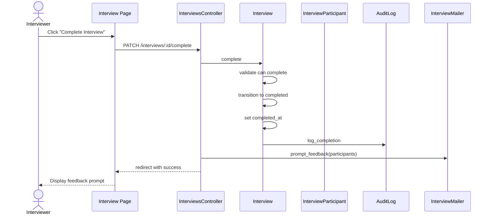

# UC-158: Complete Interview

## Metadata

| Attribute | Value |
|-----------|-------|
| **ID** | UC-158 |
| **Name** | Complete Interview |
| **Functional Area** | Interview Management |
| **Primary Actor** | Interviewer (ACT-04) |
| **Priority** | P1 |
| **Complexity** | Low |
| **Status** | Draft |

## Description

An interviewer marks an interview as completed after conducting the session. This transitions the interview to terminal 'completed' status, records the completion timestamp, and triggers prompts for feedback submission. The system may also auto-complete interviews after a configured time past the scheduled end.

## Actors

| Actor | Role in Use Case |
|-------|------------------|
| Interviewer (ACT-04) | Marks interview as completed |
| Recruiter (ACT-02) | May mark interview complete on behalf of interviewers |
| Hiring Manager (ACT-03) | May complete interviews they conducted |
| Scheduler (ACT-11) | Auto-completes interviews after deadline |

## Preconditions

- [ ] Interview exists with status = 'scheduled' or 'confirmed'
- [ ] Interview scheduled_at has passed (or is within grace period)
- [ ] User has permission to complete the interview
- [ ] Interview has not already been completed, cancelled, or marked no-show

## Postconditions

### Success
- [ ] Interview status changed to 'completed'
- [ ] completed_at timestamp recorded
- [ ] Interviewers prompted to submit scorecards
- [ ] Recruiter notified of completion
- [ ] Audit log entry created

### Failure
- [ ] Interview status unchanged
- [ ] User shown validation error

## Triggers

- Interviewer clicks "Complete Interview" after session
- Lead interviewer marks panel complete
- Scheduled job auto-completes after configured time
- Recruiter marks complete when feedback already submitted

## Basic Flow



| Step | Actor | Action | System Response |
|------|-------|--------|-----------------|
| 1 | Interviewer | Clicks "Complete Interview" | Completion dialog shown |
| 2 | System | Displays confirmation prompt | Interview details shown |
| 3 | Interviewer | Confirms completion | Completion processed |
| 4 | System | Validates interview can be completed | Status and timing verified |
| 5 | System | Transitions to 'completed' status | State machine transition |
| 6 | System | Records completed_at timestamp | Timestamp saved |
| 7 | System | Creates audit log entry | Completion logged |
| 8 | System | Sends feedback reminder to participants | Reminder emails queued |
| 9 | System | Redirects to scorecard | Prompts for feedback |

## Alternative Flows

### AF-1: Complete with Quick Notes

**Trigger:** Interviewer wants to add quick notes during completion

| Step | Actor | Action | System Response |
|------|-------|--------|-----------------|
| 2a | System | Shows notes field | Quick notes input displayed |
| 2b | Interviewer | Enters brief notes | Notes captured |
| 9a | System | Pre-populates scorecard | Notes available in scorecard |

**Resumption:** Continues to scorecard with notes

### AF-2: Complete Panel Interview

**Trigger:** Lead interviewer completes panel for all members

| Step | Actor | Action | System Response |
|------|-------|--------|-----------------|
| 1a | Lead | Clicks "Complete Panel" | Panel completion dialog |
| 2a | System | Lists all participants | Panel member list shown |
| 3a | Lead | Confirms completion for panel | All participants notified |
| 8a | System | Sends feedback reminders to all | Each gets reminder |

**Resumption:** Use case ends, each interviewer submits feedback separately

### AF-3: Auto-Complete by System

**Trigger:** Scheduled job runs after interview end time

| Step | Actor | Action | System Response |
|------|-------|--------|-----------------|
| 0a | Scheduler | Runs completion job | Query overdue interviews |
| 0b | System | Finds eligible interviews | Status=confirmed, time passed |
| 4a | System | Auto-completes each | Batch processing |
| 7a | System | Logs system completion | Automated action noted |
| 8a | System | Sends feedback reminders | Reminder emails sent |

**Resumption:** Use case ends per interview

### AF-4: Complete and Submit Feedback

**Trigger:** Interviewer wants to submit feedback immediately

| Step | Actor | Action | System Response |
|------|-------|--------|-----------------|
| 9a | System | Shows scorecard form | Direct to feedback |
| 9b | Interviewer | Completes scorecard | Scorecard submitted |
| 9c | System | Marks feedback submitted | Participant updated |

**Resumption:** Continues to UC-200 Submit Scorecard

## Exception Flows

### EF-1: Interview Not Yet Started

**Trigger:** Attempting to complete before scheduled time

| Step | Actor | Action | System Response |
|------|-------|--------|-----------------|
| 4.1 | System | Detects future interview | Error displayed |
| 4.2 | System | Shows scheduled time | "Interview hasn't started yet" |

**Resolution:** Use case terminates, must wait

### EF-2: Interview Already in Terminal State

**Trigger:** Interview already completed, cancelled, or no-show

| Step | Actor | Action | System Response |
|------|-------|--------|-----------------|
| 4.1 | System | Detects terminal status | Error displayed |
| 4.2 | System | Shows current status | Status information shown |
| 4.3 | System | Directs to appropriate action | Link to feedback or details |

**Resolution:** Use case terminates

### EF-3: Lead Interviewer Required for Panel

**Trigger:** Non-lead tries to complete panel interview

| Step | Actor | Action | System Response |
|------|-------|--------|-----------------|
| 4.1 | System | Detects non-lead attempting completion | Warning shown |
| 4.2 | System | Notifies lead interviewer | Alert sent |
| 4.3 | System | Allows individual to submit feedback | Personal scorecard enabled |

**Resolution:** Only lead can mark panel complete

## Business Rules

| ID | Rule | Description |
|----|------|-------------|
| BR-158.1 | Timing Requirement | Can only complete after scheduled start time |
| BR-158.2 | Active Status | Can only complete scheduled or confirmed interviews |
| BR-158.3 | Terminal State | Completed is a terminal state (cannot transition further) |
| BR-158.4 | Feedback Prompt | All interviewers prompted for feedback on completion |
| BR-158.5 | Auto-Complete | System auto-completes after 4 hours past scheduled end |
| BR-158.6 | Panel Lead | Only lead can complete panel interviews |

## Data Requirements

### Input Data

| Field | Type | Required | Validation |
|-------|------|----------|------------|
| interview_id | integer | Yes | Must exist and be completable |
| quick_notes | text | No | Max 2000 chars |
| completed_by | integer | No | Defaults to current user |

### Output Data

| Field | Type | Description |
|-------|------|-------------|
| status | enum | 'completed' |
| completed_at | datetime | Completion timestamp |
| feedback_pending_count | integer | Interviewers needing to submit feedback |

## Database Transactions

### Tables Affected

| Table | Operation | Conditions |
|-------|-----------|------------|
| interviews | UPDATE | Set status='completed', completed_at |
| audit_logs | CREATE | Log completion |

### Transaction Detail

```sql
-- Complete Interview Transaction
BEGIN TRANSACTION;

-- Step 1: Update interview status
UPDATE interviews
SET status = 'completed',
    completed_at = NOW(),
    updated_at = NOW()
WHERE id = @interview_id
  AND status IN ('scheduled', 'confirmed')
  AND scheduled_at <= NOW();

-- Check row was updated
IF ROW_COUNT() = 0 THEN
    ROLLBACK;
    -- Return error: cannot complete
END IF;

-- Step 2: Create audit log
INSERT INTO audit_logs (
    organization_id,
    user_id,
    action,
    auditable_type,
    auditable_id,
    metadata,
    ip_address,
    created_at
) VALUES (
    @organization_id,
    @current_user_id,
    'interview.completed',
    'Interview',
    @interview_id,
    JSON_OBJECT(
        'completed_by', @completed_by_name,
        'interview_type', @interview_type,
        'scheduled_at', @scheduled_at,
        'candidate_name', @candidate_name,
        'job_title', @job_title,
        'participants', @participant_count
    ),
    @ip_address,
    NOW()
);

COMMIT;
```

### Rollback Scenarios

| Scenario | Rollback Action |
|----------|-----------------|
| Invalid status | No transaction, return error |
| Future interview | No transaction, return error |

## UI/UX Requirements

### Screen/Component

- **Location:** /interviews/:id or interviewer dashboard
- **Entry Point:**
  - "Complete Interview" button on interview detail
  - "Mark Complete" in interview list
  - Post-interview prompt in dashboard
- **Key Elements:**
  - Interview summary
  - Confirmation message
  - Quick notes (optional)
  - Link to scorecard

### Completion Flow

```
+---------------------------------------------------------------+
| Interview Complete                                              |
+-----------------------------------------------------------------+
|                                                                 |
| Great! Your interview has been marked as complete.              |
|                                                                 |
| +-----------------------------------------------------------+  |
| | Technical Interview - John Smith                          |  |
| | Monday, January 27, 2026 at 10:00 AM EST                  |  |
| | Duration: 60 minutes                                       |  |
| +-----------------------------------------------------------+  |
|                                                                 |
| Don't forget to submit your feedback!                           |
|                                                                 |
| The hiring team is waiting for your evaluation to make          |
| a decision on this candidate.                                   |
|                                                                 |
| [          Submit Scorecard Now          ]                      |
|                                                                 |
| [I'll do it later]                                              |
|                                                                 |
+-----------------------------------------------------------------+
```

### Completion Button States

```
Before Interview:
+---------------------------------+
| Complete Interview              | (disabled, grayed)
| Interview hasn't started yet    |
+---------------------------------+

After Interview:
+---------------------------------+
| [check] Complete Interview      | (enabled, primary)
+---------------------------------+

After Completion:
+---------------------------------+
| [checkmark] Interview Completed |
| Jan 27, 2026 at 11:05 AM        |
| [Submit Feedback]               |
+---------------------------------+
```

## Non-Functional Requirements

| Requirement | Target |
|-------------|--------|
| Response Time | < 1 second |
| Auto-Complete | Within 5 minutes of scheduled job |
| Availability | 99.9% |

## Security Considerations

- [x] Authentication required
- [x] Authorization check: Must be participant or have admin access
- [x] Audit logging: Completion recorded with user
- [x] Timing validation: Cannot complete future interviews

## Related Use Cases

| Use Case | Relationship |
|----------|--------------|
| UC-150 Schedule Interview | Original interview creation |
| UC-156 Confirm Attendance | Precedes completion |
| UC-157 Mark No-Show | Alternative outcome |
| UC-200 Submit Scorecard | Typically follows completion |
| UC-204 Request Additional Feedback | Follows if feedback missing |

---

## Data Model References

> Cross-references to [DATA_MODEL.md](../DATA_MODEL.md) and [CRUD_MATRIX.md](../CRUD_MATRIX.md)

### Subject Areas

| Subject Area | ID | Relationship |
|--------------|-----|--------------|
| Interview | SA-06 | Primary |
| Evaluation | SA-07 | Secondary |

### Entities CRUD

| Entity | C | R | U | D | Notes |
|--------|---|---|---|---|-------|
| Interview | | X | X | | Update status to completed |
| InterviewParticipant | | X | | | Read for notification |
| AuditLog | X | | | | Record completion |

**Legend:** C = Create, R = Read, U = Update, D = Delete

---

## Process Model References

> Cross-references to [PROCESS_MODEL.md](../PROCESS_MODEL.md) and [PROCESS_CRUD_MATRIX.md](../PROCESS_CRUD_MATRIX.md)

| Attribute | Value | Link |
|-----------|-------|------|
| **Elementary Business Process** | EP-0509: Complete Interview | [PROCESS_MODEL.md#ep-0509](../PROCESS_MODEL.md#elementary-business-processes-4) |
| **Business Process** | BP-201: Interview Coordination | [PROCESS_MODEL.md#bp-201](../PROCESS_MODEL.md#bp-201-interview-coordination) |
| **Business Function** | BF-02: Candidate Evaluation | [PROCESS_MODEL.md#bf-02](../PROCESS_MODEL.md#bf-02-candidate-evaluation) |

### EBP Details

| Attribute | Value |
|-----------|-------|
| **Trigger** | Interview session ends |
| **Input** | Interview ID |
| **Output** | Completed interview, feedback prompts sent |
| **Business Rules** | BR-158.1 through BR-158.6 |

---

## Traceability Matrix

> Complete artifact mapping for requirements traceability

| Artifact Type | ID | Name | Link |
|---------------|-----|------|------|
| **Use Case** | UC-158 | Complete Interview | *(this document)* |
| **Elementary Process** | EP-0509 | Complete Interview | [PROCESS_MODEL.md](../PROCESS_MODEL.md#elementary-business-processes-4) |
| **Business Process** | BP-201 | Interview Coordination | [PROCESS_MODEL.md](../PROCESS_MODEL.md#bp-201-interview-coordination) |
| **Business Function** | BF-02 | Candidate Evaluation | [PROCESS_MODEL.md](../PROCESS_MODEL.md#bf-02-candidate-evaluation) |
| **Primary Actor** | ACT-04 | Interviewer | [ACTORS.md](../ACTORS.md#act-04-interviewer) |
| **Subject Area (Primary)** | SA-06 | Interview | [DATA_MODEL.md](../DATA_MODEL.md#sa-06-interview) |

### Implementation Artifacts

| Artifact Type | Path/Reference | Status |
|---------------|----------------|--------|
| Controller | `app/controllers/interviews_controller.rb` | Implemented |
| Model | `app/models/interview.rb` | Implemented |
| State Machine | Interview.complete event | Implemented |
| Job | `app/jobs/auto_complete_interviews_job.rb` | Planned |
| Test | `test/models/interview_test.rb` | Implemented |

---

## Open Questions

1. Should auto-completion be configurable per organization?
2. How aggressive should feedback reminder emails be?
3. Should completion require at least partial feedback?

## Change History

| Version | Date | Author | Changes |
|---------|------|--------|---------|
| 0.1 | 2026-01-25 | System | Initial draft |
